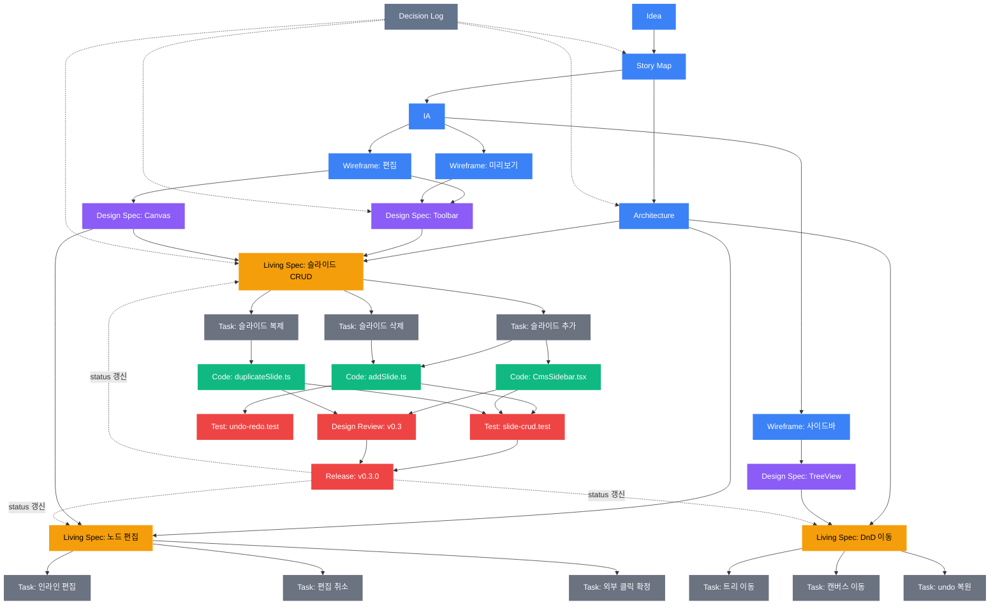

# 산출물 파이프라인 — N:M 관계도

## 전체 흐름



## 산출물 유형

| 색상 | 단계 | 산출물 | 수명 | 팬아웃 |
|------|------|--------|------|--------|
| 🔵 | 기획 | Story Map, IA, Wireframe, Architecture | Living | 1 → N |
| 🟣 | 디자인 | Design Spec | Living | N:M (여러 화면이 공유) |
| 🟡 | **허브** | **Living Spec** (story.yaml) | **영속** | 기획 ↔ 구현 연결점 |
| ⚫ | 구현 | Task Spec | 1회성 | 1 Story → N Task |
| 🟢 | 코드 | Code | 영속 (git) | N Task → M 파일 |
| 🔴 | 검증 | Test, Design Review, Release Note | 누적 | 피드백 루프 |
| 점선 | 메타 | Decision Log | 영속 | 전 구간 크로스커팅 |

## N:M 관계 상세

| From | To | 관계 | 왜 N:M인가 |
|------|----|------|------------|
| Wireframe → Design Spec | N:M | 여러 화면이 같은 Toolbar 디자인 공유 |
| Design Spec → Living Spec | N:M | 하나의 디자인이 여러 Story에, 하나의 Story가 여러 디자인 참조 |
| Task Spec → Code | N:M | 여러 Task가 같은 파일 수정, 하나의 Task가 여러 파일 수정 |
| Code → Test | N:M | 여러 코드가 하나의 통합 테스트, 하나의 코드에 여러 테스트 |
| Release → Living Spec | 1:N | 릴리즈가 여러 Story의 status를 done으로 갱신 |

## 피드백 루프

```
Release Note
  → Living Spec status 갱신 (done/wip/todo)
    → 다음 Story Map 우선순위 조정
      → 새 Task Spec 생성
        → Code → Test → Release → ...
```

## 핵심 인사이트

**Living Spec이 허브다.**

- 위: 기획 4종(Story Map, IA, Architecture, Design Spec)이 흘러들어옴
- 아래: 구현 3종(Task, Code, Test)으로 팬아웃
- 옆: Release에서 피드백 루프로 돌아옴
- 관통: Decision Log이 모든 분기점에 기록

"우리 뭐가 구현되어 있지?" → **Living Spec을 열면 답이 나온다.**
