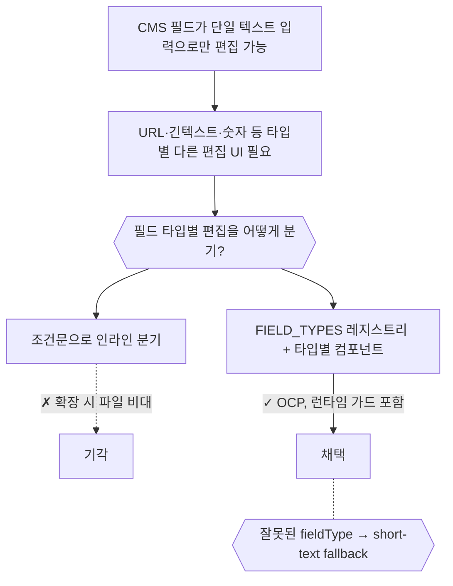
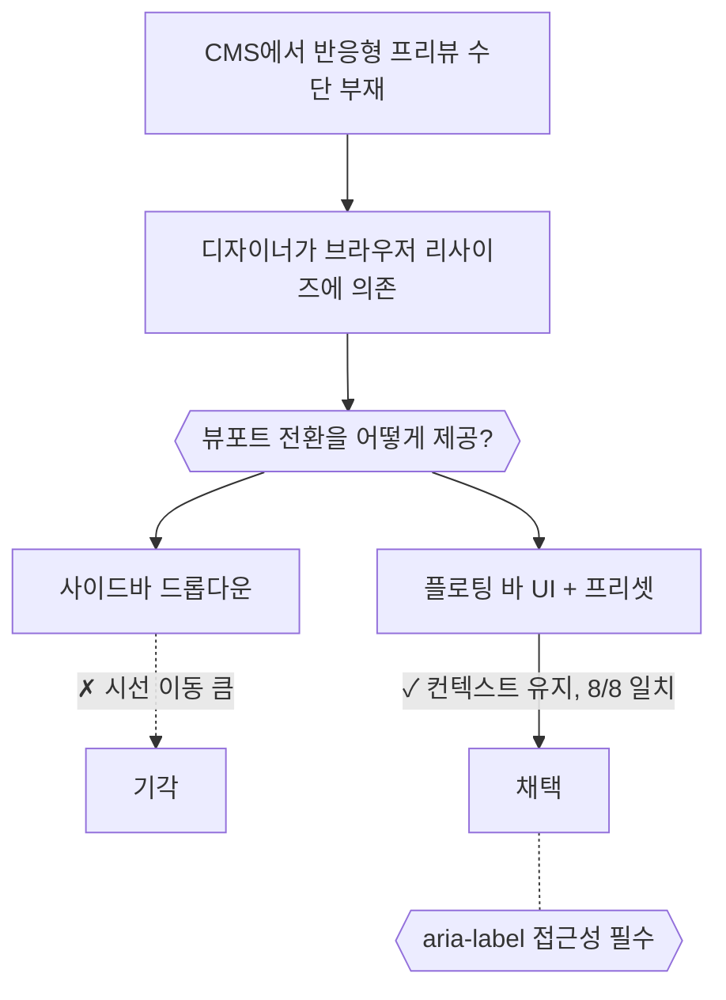
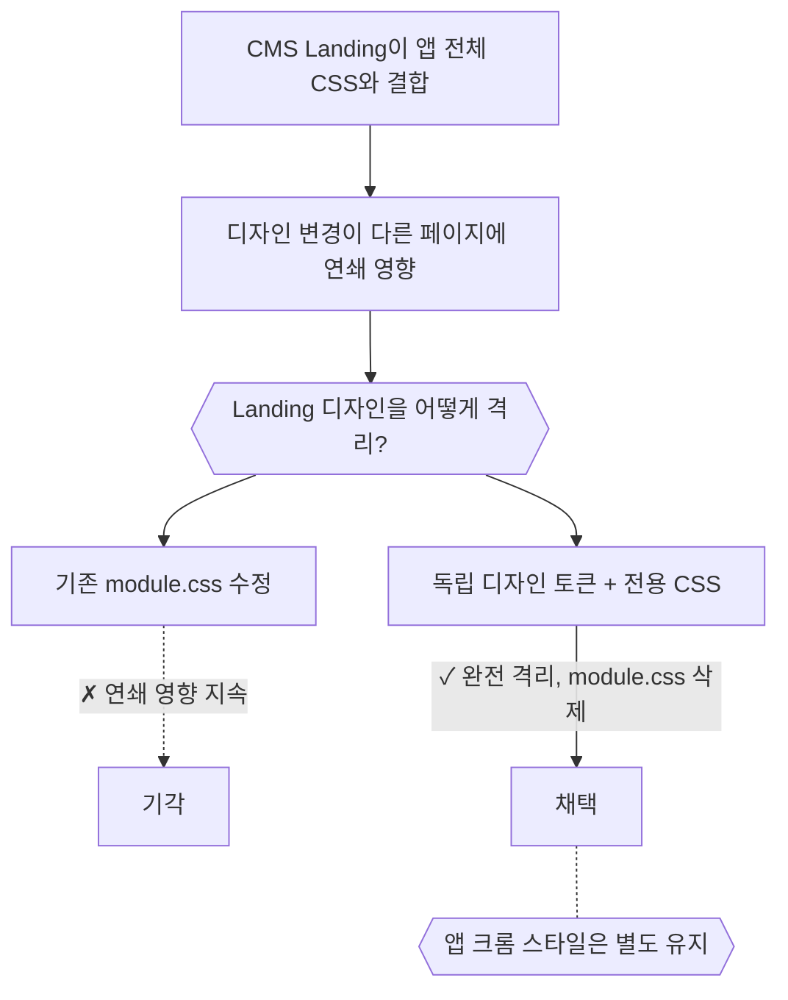

# CMS — 결정 요약

## Field Type System: 타입 기반 편집 UI (2026-03-24)

- CMS 필드가 단일 텍스트 입력으로만 편집 가능한 상태
- → URL, 긴 텍스트, 숫자 등 필드 타입별로 다른 편집 UI가 필요
- **필드 타입별 편집을 어떻게 분기할 것인가?**
  - FIELD_TYPES 런타임 Set + fieldType별 컴포넌트 분기
  - 잘못된 fieldType은 short-text fallback + has() 가드

> 원본: [archive/35-[retro]cms-field-type-system.md](archive/35-[retro]cms-field-type-system.md)

---

## Floating Viewport Bar: 반응형 프리뷰 크롬 (2026-03-24)

- CMS 편집 화면에서 다양한 뷰포트 크기를 프리뷰할 수단이 없는 상태
- → 디자이너가 반응형 확인을 위해 브라우저 리사이즈에 의존
- **뷰포트 전환을 어떻게 제공할 것인가?**
  - 플로팅 바 UI로 뷰포트 프리셋 전환
  - PRD 8/8 완전 일치, aria-label 접근성 개선 추가

> 원본: [archive/36-[retro]cms-floating-viewport-bar.md](archive/36-[retro]cms-floating-viewport-bar.md)

---

## Landing 독립 디자인 시스템 (2026-03-24)

- CMS Landing 페이지가 앱 전체 CSS와 결합되어 디자인 변경이 연쇄 영향을 일으키는 상태
- → Landing만의 독립 토큰이 필요하나 기존 module.css와 충돌
- **Landing 디자인을 어떻게 격리할 것인가?**
  - Landing 전용 디자인 토큰 + 독립 CSS 파일로 격리
  - 기존 PageVisualCms.module.css는 참조 0건으로 완전 삭제 (PRD보다 깔끔한 결과)

> 원본: [archive/37-[retro]cms-landing-design-system.md](archive/37-[retro]cms-landing-design-system.md)

#kind/note #archived
