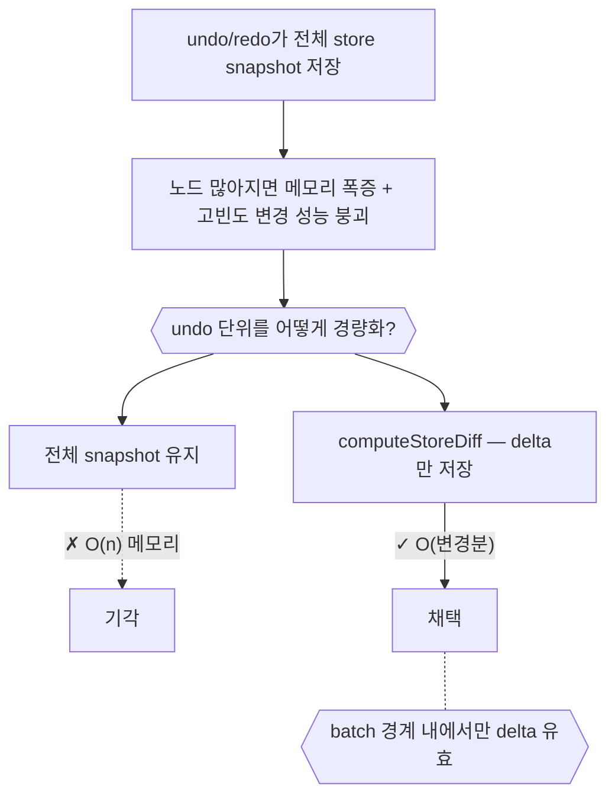
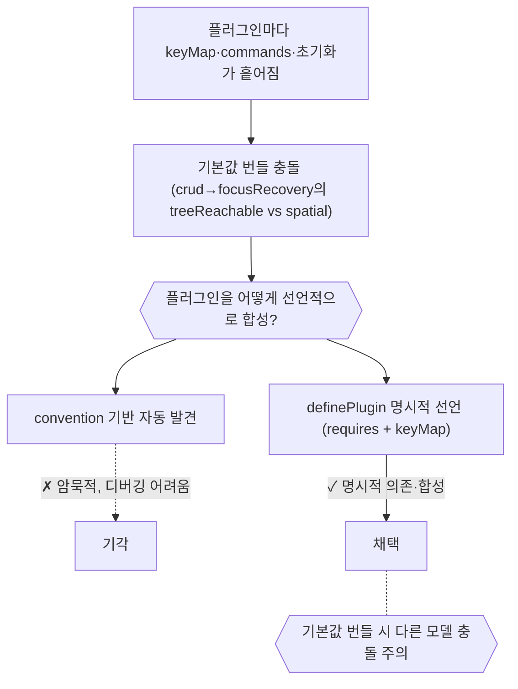
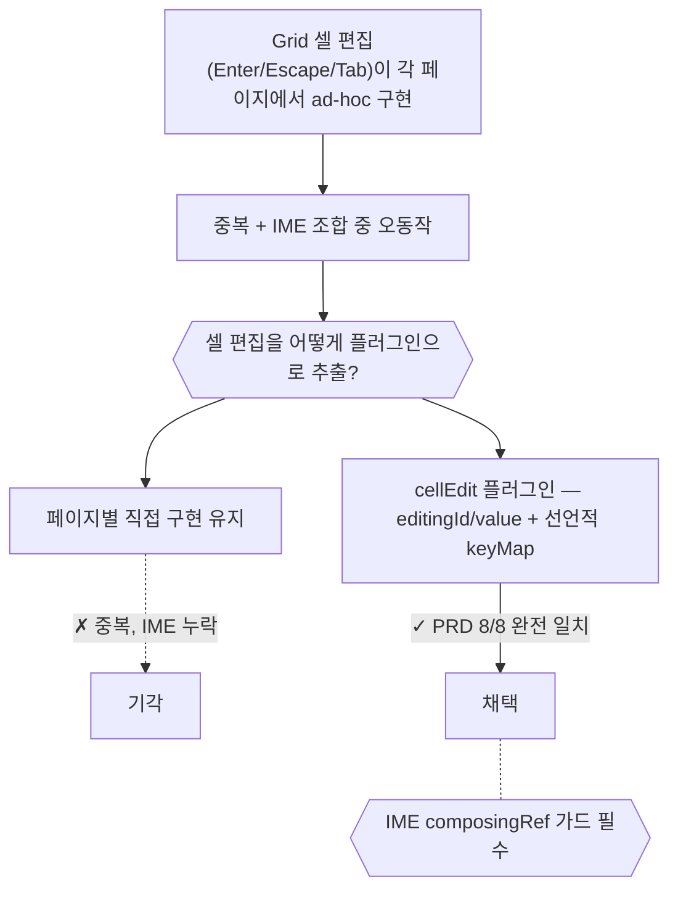
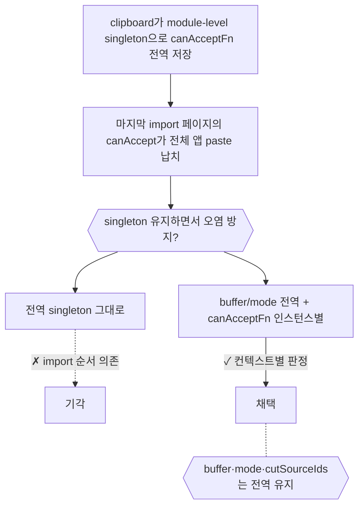
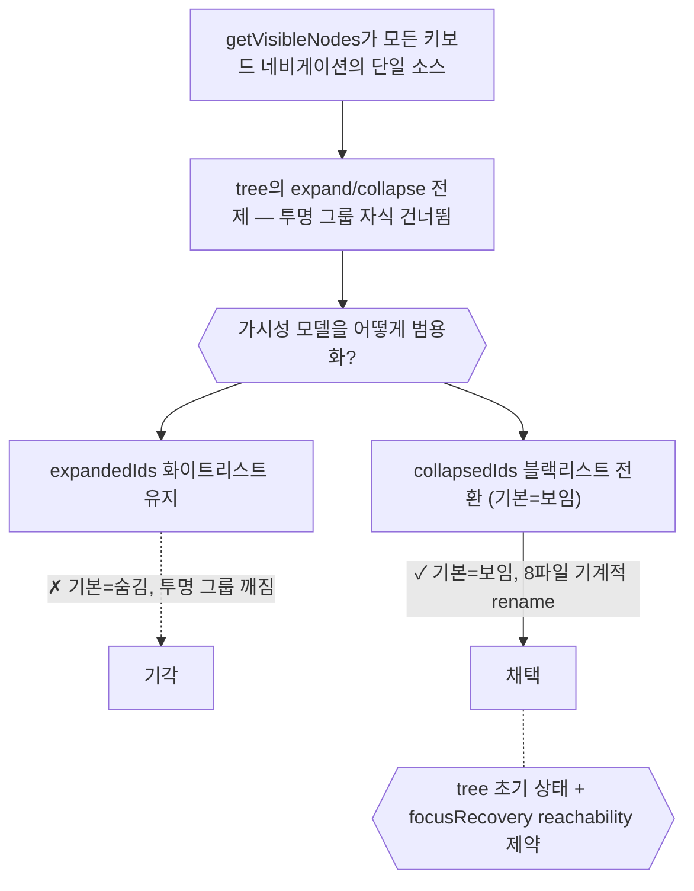

# Engine — 결정 요약

## History: snapshot → delta 방식 전환 (2026-03-23)

- undo/redo가 store 전체를 snapshot으로 저장하는 구조
- → 노드 수백 개 초과 시 메모리 폭증, slider 같은 고빈도 변경에서 성능 붕괴
- **undo 단위를 어떻게 경량화할 것인가?**
  - 변경분만 diff로 기록하는 delta 방식 채택
  - batch 경계 내에서만 유효하다는 제약

> 원본: [archive/29-[retro]history-delta.md](archive/29-[retro]history-delta.md)

---

## definePlugin: 플러그인 합성 API (2026-03-23)

- 플러그인마다 keyMap·commands·초기화 로직이 파일별로 흩어진 상태
- → crud가 focusRecovery를 번들할 때 기본 isReachable=treeReachable이 spatial 모델과 충돌
- **플러그인을 어떻게 선언적으로 합성할 것인가?**
  - definePlugin 팩토리로 requires+keyMap을 한 객체에 명시
  - 기본값 번들 시 사용처별 옵션 전달 필수라는 교훈

> 원본: [archive/31-[retro]define-plugin.md](archive/31-[retro]define-plugin.md)

---

## cellEdit Plugin: 셀 편집 축 (2026-03-25)

- Grid에서 Enter/Escape/Tab 셀 편집 흐름을 각 페이지가 직접 구현하는 상태
- → 동일 로직 중복, IME 조합 중 Enter 오동작
- **셀 편집을 어떻게 플러그인으로 추출할 것인가?**
  - cellEdit 플러그인으로 editingId/value 상태 + 선언적 keyMap 추출
  - IME는 composingRef 가드로 대응

> 원본: [archive/41-[retro]cell-edit-plugin.md](archive/41-[retro]cell-edit-plugin.md)

---

## Clipboard Singleton 오염 (2026-03-23)

- clipboard 플러그인이 module-level singleton으로 canAcceptFn을 전역 변수에 저장하는 설계
- → SPA에서 마지막으로 import된 페이지(CMS)의 canAccept가 전체 앱의 paste 판정을 납치
- **singleton을 유지하면서 페이지 간 오염을 어떻게 막을 것인가?**
  - buffer/mode는 전역 유지
  - canAcceptFn/canDeleteFn만 인스턴스별 바인딩으로 분리

> 원본: [archive/30-[explain]clipboard-singleton-contamination.md](archive/30-[explain]clipboard-singleton-contamination.md)

---

## getVisibleNodes: tree→범용 가시성 (2026-03-25)

- getVisibleNodes가 모든 키보드 네비게이션(focusNext, typeahead)의 단일 소스인 상태
- → expand/collapse를 전제한 tree 모델이라, 투명 그룹(listbox group)의 자식을 건너뜀
- **가시성 모델을 어떻게 범용화할 것인가?**
  - expandedIds(화이트리스트) → collapsedIds(블랙리스트) 전환으로 기본=보임
  - 8파일 기계적 rename, 핵심 제약은 tree 초기 상태와 focusRecovery reachability 2곳

> 원본: [archive/42-[explain]getVisibleNodes-dependency-tree.md](archive/42-[explain]getVisibleNodes-dependency-tree.md), [archive/43-[explain]expandedIds-to-collapsedIds-constraints.md](archive/43-[explain]expandedIds-to-collapsedIds-constraints.md)
