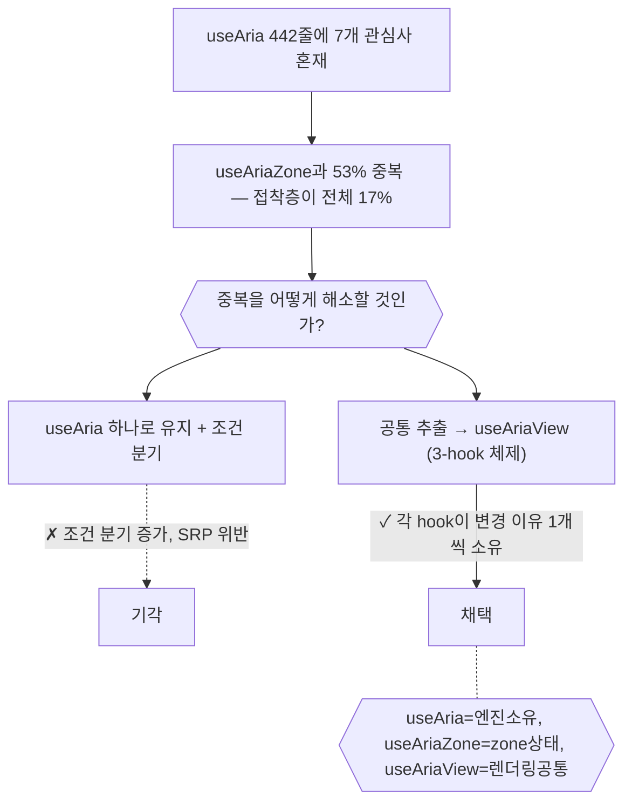
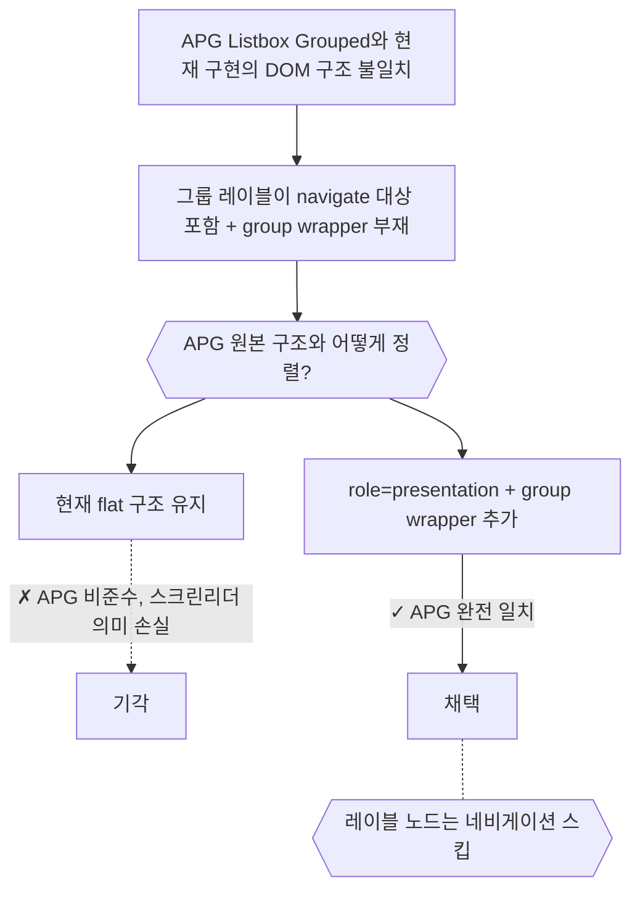

# Primitives — 결정 요약

## useAria 442줄 해부 → 3-hook 분리 (2026-03-23)

- useAria가 os의 유일한 진입점 hook으로 7개 관심사를 442줄에 담고 있는 상태
- → useAriaZone과 53% 중복, 접착층이 라이브러리 전체의 17% 차지
- **442줄의 각 라인이 존재해야 할 이유가 있는가?**
  - useAria = 엔진 소유 + 데이터 싱크 + 포인터 셀렉션
  - useAriaZone = zone-local 상태 + 가상 엔진
  - useAriaView = 렌더링 공통(props/state/keyMap/DOM) 추출

> 원본: [archive/32-[explain]useAria.md](archive/32-[explain]useAria.md), [archive/33-[explain]useAria-triad.md](archive/33-[explain]useAria-triad.md)

---

## Listbox Grouped: APG 구조 불일치 해소 (2026-03-28)

- APG Listbox Grouped Example과 현재 구현의 DOM 구조가 다른 상태
- → 그룹 레이블이 navigate 대상에 포함되고, ul[role=group] wrapper가 없는 flat 렌더링
- **APG 원본 구조와 어떻게 정렬할 것인가?**
  - 그룹 레이블은 role=presentation으로 네비게이션에서 제외
  - ul[role=group] wrapper 추가하여 APG와 일치

> 원본: [archive/listboxGroupedApgStructure.md](archive/listboxGroupedApgStructure.md)
