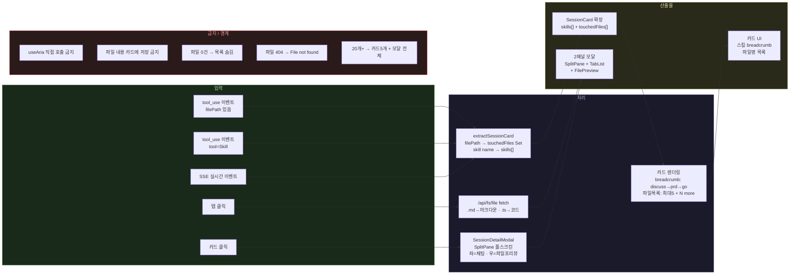

# Skill Kanban v2 — Review

```mermaid
flowchart LR
  subgraph 입력["입력"]
    E1["tool_use 이벤트\nfilePath 있음"]
    E2["tool_use 이벤트\ntool=Skill"]
    E3["SSE 실시간 이벤트"]
    E4["카드 클릭"]
    E5["탭 클릭"]
  end

  subgraph 처리["처리"]
    P1["extractSessionCard\nfilePath → touchedFiles Set\nskill name → skills[]"]
    P2["카드 렌더링\nbreadcrumb: discuss→prd→go\n파일목록: 최대5 + N more"]
    P3["SessionDetailModal\nSplitPane 풀스크린\n좌=채팅 · 우=파일프리뷰"]
    P4["/api/fs/file fetch\n.md→마크다운 · .ts→코드"]
  end

  subgraph 출력["산출물"]
    O1["SessionCard 확장\nskills[] + touchedFiles[]"]
    O2["카드 UI\n스킬 breadcrumb\n파일명 목록"]
    O3["2패널 모달\nSplitPane + TabList\n+ FilePreview"]
  end

  E1 --> P1
  E2 --> P1
  E3 --> P1
  P1 --> O1
  O1 --> P2
  P2 --> O2
  E4 --> P3
  E5 --> P4
  P4 --> O3
  P3 --> O3

  subgraph 제약["금지 / 경계"]
    C1["useAria 직접 호출 금지"]
    C2["파일 내용 카드에 저장 금지"]
    C3["파일 0건 → 목록 숨김"]
    C4["파일 404 → File not found"]
    C5["20개+ → 카드5개 + 모달 전체"]
  end

  style 입력 fill:#1a2a1a,stroke:#4a8a4a,color:#aaddaa
  style 처리 fill:#1a1a2a,stroke:#4a4a8a,color:#aaaadd
  style 출력 fill:#2a2a1a,stroke:#8a8a4a,color:#ddddaa
  style 제약 fill:#2a1a1a,stroke:#ff6b6b,color:#ff9999
```
