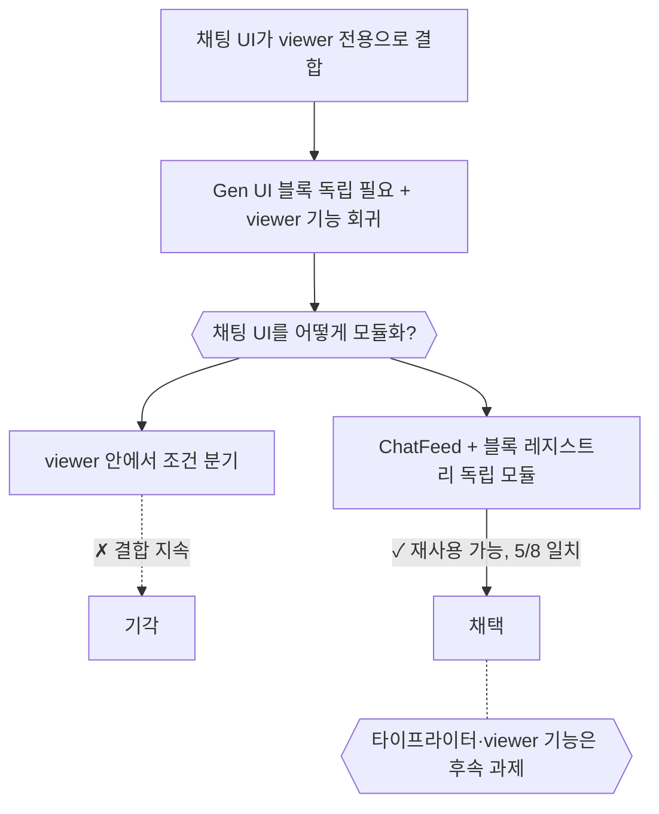
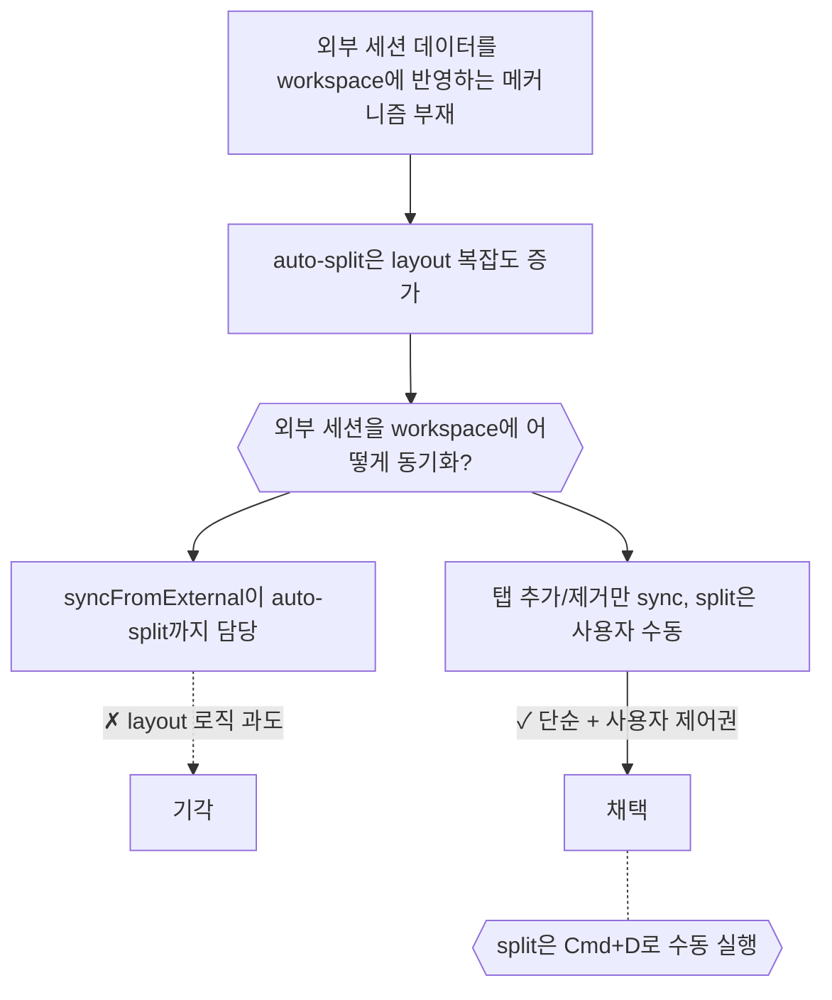
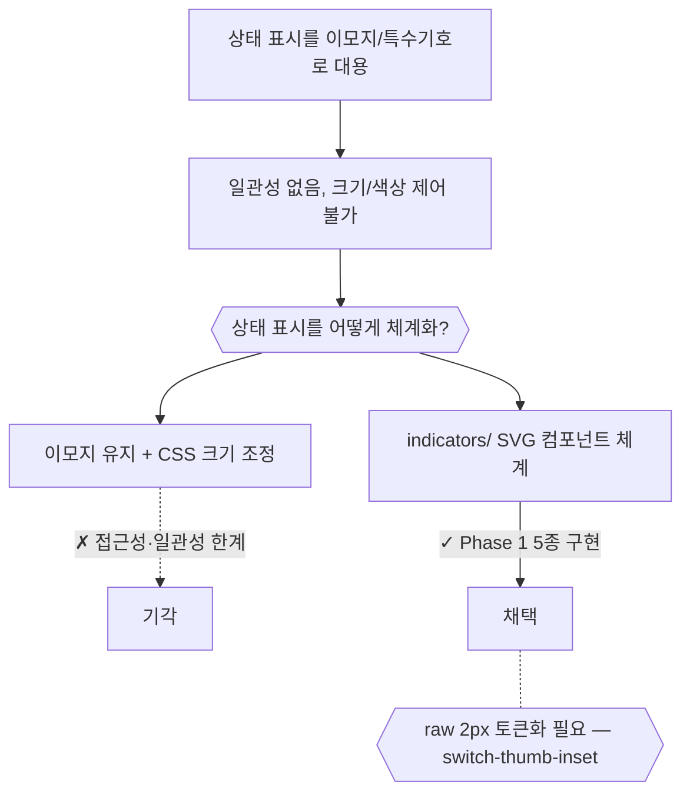

# UI — 결정 요약

## Gen UI Chat Module (2026-03-27)

- 채팅 UI가 viewer 전용으로 결합, Gen UI 블록(코드·테이블·차트)을 독립 모듈로 필요한 상황
- → 타이프라이터 미통합, viewer 기능 회귀(파일경로 클릭, loadOlder, 페이싱) 발생
- **채팅 UI를 어떻게 모듈화할 것인가?**
  - ChatFeed + 블록 레지스트리(TextBlock, CodeBlock, FallbackBlock)로 분리
  - 타이프라이터·viewer 기능은 의도적 스코프 축소로 후속 과제

> 원본: [archive/60-[retro]chatModule.md](archive/60-[retro]chatModule.md)

---

## Workspace Sync: 외부 세션 동기화 (2026-03-28)

- Agent viewer에서 외부 세션 데이터를 workspace에 반영하는 메커니즘 부재
- → PRD는 "균등 split"을 기대했지만, 자동 split은 layout 복잡도 증가
- **외부 세션을 workspace에 어떻게 동기화할 것인가?**
  - syncFromExternal은 탭 추가/제거만 담당, layout은 사용자 수동(Cmd+D)
  - PRD보다 단순하고 사용자 제어권이 높은 결과

> 원본: [archive/62-[retro]workspaceSync.md](archive/62-[retro]workspaceSync.md)

---

## UI Indicators Phase 1: 이모지 → 컴포넌트 전환 (2026-03-28)

- UI에서 상태 표시를 이모지/특수기호로 대용하고 있는 상태
- → 일관성 없음, 크기/색상 제어 불가, 접근성 문제
- **상태 표시를 어떻게 체계화할 것인가?**
  - indicators/ 디렉토리에 SVG 기반 컴포넌트 5종 Phase 1 구현
  - raw 2px 이관 이슈 + Breadcrumb chevron→line 시각 변경은 PRD 미명시

> 원본: [archive/63-[retro]uiIndicators.md](archive/63-[retro]uiIndicators.md)
