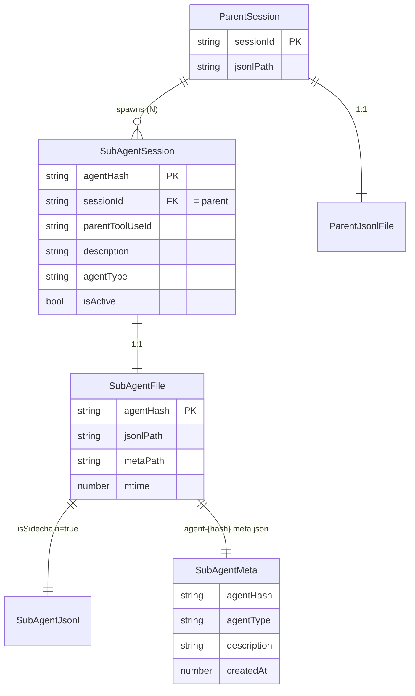
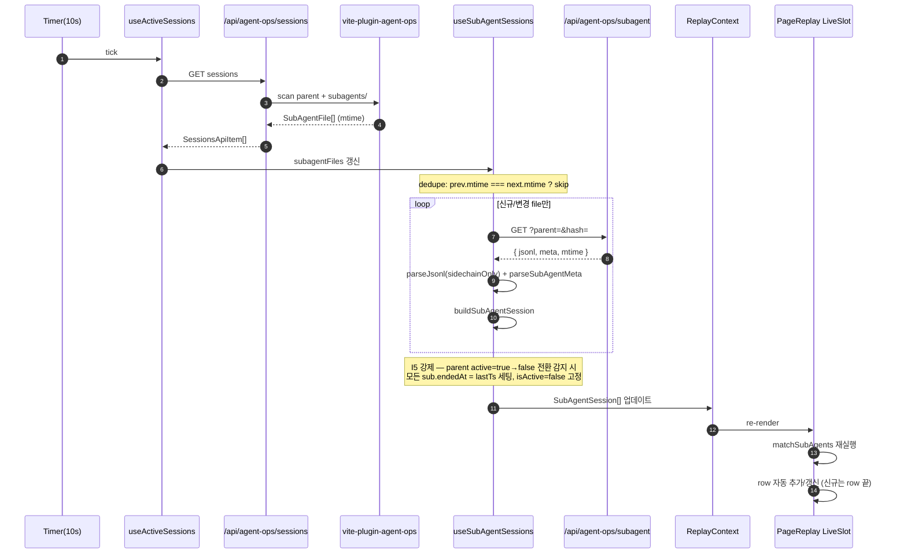
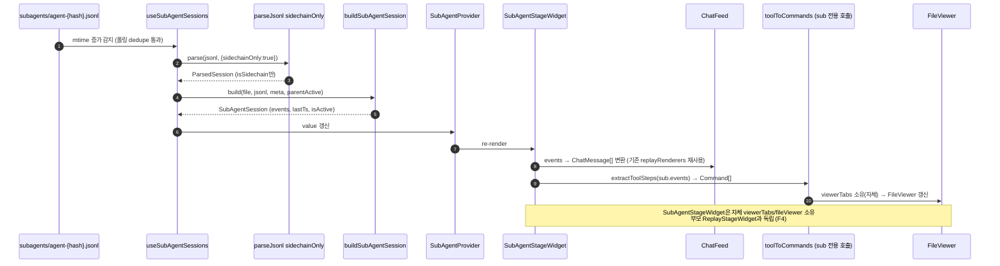

# SubAgent Viewer — Blueprint

> **Discussion**: replay/live에서 Task(Agent) tool의 내부 tool 동작이 안 보임 → SubAgent 파일을 독립 viewer에 띄우기. 연결선 없이 가로 나열 고정폭.
> **산출물 유형**: UI 기능 (엔진 일부 확장)
> **규모 추정**: 파일 3~5개 수정, 1~2개 신규

## Discussion 핵심 요약

- **문제 (⑤)**: `toolToCommands.ts`가 Read/Edit/Write/Grep/Glob/Bash만 처리, Agent(Task) tool은 라벨만 있고 내부 전개 없음. `sessionCardExtractor.ts:70`의 "서브에이전트 실행 중" 라벨에서 그침.
- **해결 (⑪)**: JSONL tail 단일 경로. SubAgent 파일 규칙 `~/.claude/projects/{project}/{parentSessionId}/subagents/agent-{hash}.jsonl` + `agent-{hash}.meta.json`. 부모 watch 시 subagents/ 디렉토리 함께 watch. 감지 시 부모 viewer 옆 가로 고정폭 viewer 추가. 매칭 키 = description(`tool_use.input.description` ↔ `meta.description`) + 시각순 fallback. 부모 타임라인엔 Agent 블록 유지(연결선 없음).
- **SubAgent JSONL 필드**: `isSidechain: true`, `sessionId` = 부모와 동일, `parentUuid` = 부모 메시지 UUID.
- **제약 (⑦)**: 가로 나열 + 고정폭 + 가로 스크롤. 여러 SubAgent 병렬 시 row 끝에 추가.
- **보유 자산 (⑧)**: `ReplayStage`, `parseJsonl`, `fileState`, `useActiveSessions`, `toolToCommands`, `viewerTabs`, `SessionDetailModal`, `sessionCardExtractor`.
- **신규**: subagents 디렉토리 watch, isSidechain 파싱 분기, 가로 row 레이아웃.

---

## §1 데이터 모델

### 타입 정의

```ts
// ── 신규 타입 ──────────────────────────────────────

/** subagents/agent-{hash}.meta.json 파싱 결과 */
type SubAgentMeta = {
  agentHash: string          // 파일명에서 추출 (agent-{hash} 부분)
  agentType: string          // meta.json: "general-purpose" | "code-reviewer" | ...
  description: string        // meta.json: 부모 tool_use.input.description 과 매칭
  prompt?: string            // meta.json: 부모가 넘긴 초기 프롬프트(선택)
  createdAt: number          // meta.json: 생성 타임스탬프 (ms)
}

/** watch 대상 SubAgent 파일 쌍 (jsonl + meta) */
type SubAgentFile = {
  parentSessionId: string                    // {parentSessionId}/subagents/ 의 부모 ID
  agentHash: string                          // agent-{hash}
  jsonlPath: string                          // .../subagents/agent-{hash}.jsonl
  metaPath: string                           // .../subagents/agent-{hash}.meta.json
  mtime: number                              // jsonl mtime (폴링 dedupe용)
}

/** SubAgent 하나의 런타임 상태 (부모 viewer 옆 패널 단위) */
type SubAgentSession = {
  // 식별
  sessionId: string          // = 부모 sessionId (isSidechain 규약)
  agentHash: string          // 고유 키. (sessionId, agentHash) 로 unique
  parentSessionId: string    // 명시적 부모 포인터 (UI 그루핑용)
  parentToolUseId?: string   // 부모의 Task tool_use.id (description 매칭 실패 시 null)

  // 메타
  agentType: string          // from SubAgentMeta
  description: string        // from SubAgentMeta — 카드 타이틀
  prompt?: string

  // 타임라인 (기존 TimelineEvent 재사용)
  events: TimelineEvent[]    // groupEvents 로 전달되는 원본 시퀀스
  parsed?: ParsedSession     // parseJsonl 결과 캐시 (선택)

  // 라이프사이클
  startedAt: number          // events[0].ts (ms)
  endedAt: number | null     // active 중이면 null
  lastTs: number             // events[-1].ts (ms)
  isActive: boolean          // 부모 active && 진행 중
}

/** 매칭 키: 부모 Agent tool_use ↔ SubAgentSession */
type SubAgentMatchKey = {
  description: string        // 1차: input.description == meta.description
  toolUseTs: number          // 2차 fallback: 시각순 (부모 tool_use.ts ≤ sub.startedAt)
  toolUseId?: string         // 3차: parentUuid 트래버스로 연결 가능 시
}

// ── 기존 타입 확장 ─────────────────────────────────

/** useActiveSessions 반환 타입 — subagents 소유 */
type ActiveSessionWithSubs = ActiveSession & {
  subagents: SubAgentSession[]   // 빈 배열이면 Agent tool 미사용 or 아직 meta 미도착
}

/** SSE/폴링에서 서버가 내려주는 파일 목록 확장 */
type SessionFilesManifest = {
  sessionId: string
  jsonlPath: string
  subagentFiles: SubAgentFile[]  // subagents/ 디렉토리 스캔 결과
}
```

재사용 타입: `TimelineEvent` (`src/pages/viewer/groupEvents`), `ParsedSession` (`src/pages/replay/parseJsonl`), `ActiveSession` (`src/pages/replay/useActiveSessions`), `FileState` (`src/pages/replay/fileState`). 경로 SSOT: 각 파일에서 상대경로 import (pages/replay → `../viewer/groupEvents`, 서버 vite-plugin → `./src/pages/viewer/groupEvents`).

### 관계도



파일 레이아웃:

```
~/.claude/projects/{project}/
  {parentSessionId}.jsonl            ← 부모
  {parentSessionId}/
    subagents/
      agent-{hash}.jsonl             ← SubAgentSession.events 소스
      agent-{hash}.meta.json         ← SubAgentMeta 소스
```

### 불변식

| # | 불변식 | 반증 조건 (false면 버그) |
|---|--------|------------------------|
| I1 | `SubAgentSession.sessionId === parentSession.sessionId` | JSONL `isSidechain=true` 엔트리의 `sessionId`가 부모 ID와 다름 |
| I2 | `agentHash` 는 `{parentSessionId}/subagents/` 내에서 unique하며, jsonl 파일명과 meta 파일명 접두(`agent-{hash}`)가 동일 | 같은 hash로 jsonl은 있으나 meta 없음, 또는 파일명 hash 불일치 |
| I3 | 부모 `tool_use(name='Task').ts ≤ SubAgentSession.startedAt` | SubAgent 첫 이벤트가 부모 Task 호출 시각보다 빠름 |
| I4 | `SubAgentSession.events` 의 모든 엔트리는 `isSidechain=true` | 메인 세션 이벤트가 서브 타임라인에 섞여 들어감 |
| I5 | `isActive === (parentSession.active && endedAt === null)` | 부모가 끝났는데 sub가 여전히 active로 표시 |
| I6 | 매칭 우선순위: `description` 정확일치 → `toolUseTs` 근접(≤ N초) → 미매칭은 orphan row로 표시 | 여러 sub가 같은 description을 가질 때 시각순 fallback 없이 임의 매칭 |

### 역PRD

_(구현 후 file::TypeName 기입)_

**완성도:** 🟢

## §2 파일 맵

### 파일 × 책임 매트릭스

| 경로 | 책임 | 신규/수정 | 재사용 부품 | 역PRD |
|------|------|-----------|-------------|-------|
| `vite-plugin-agent-ops.ts` | `/api/agent-ops/sessions` 응답에 `subagentFiles: SubAgentFile[]` 추가 + `/api/agent-ops/subagent?parent={id}&hash={hash}` tail 엔드포인트 신설 (jsonl + meta 쌍 반환). `~/.claude/projects/{project}/{parentSessionId}/subagents/` 디렉토리 스캔 + mtime 수집. | 수정 | 기존 sessions 스캐너 로직, fs watch | ⬜ |
| `src/pages/replay/useActiveSessions.ts` | `ActiveSession` → `ActiveSessionWithSubs` 확장. 폴링 응답에서 `subagentFiles` 파싱 → 부모별 `SubAgentFile[]` 노출. 타입·셀렉터만 변경(기존 반환 계약 유지 슈퍼셋). | 수정 | 기존 10s 폴링 루프 | useActiveSessions.ts::useActiveSessions, ActiveSession, ActiveSessionWithSubs |
| `src/pages/replay/useSubAgentSessions.ts` | `ActiveSessionWithSubs`의 `subagentFiles`를 구독해 SubAgent jsonl + meta를 fetch·parse·merge → `SubAgentSession[]` 상태. 부모 세션별 훅(단일 부모 기준). isActive 파생(부모 active && endedAt=null). | 신규 | `useActiveSessions`의 폴링 패턴, `parseJsonl` | useSubAgentSessions.ts::useSubAgentSessions |
| `src/pages/replay/parseJsonl.ts` | `isSidechain: true` 엔트리 필터/분기. `parseJsonl(text, { sidechainOnly?: boolean })` 옵션 추가 — 기본(false)은 메인만, true면 sidechain만 반환. `parentUuid` 보존(ToolStep 확장 없이 raw entry 단위). I4 불변식 강제 지점. | 수정 | 기존 JsonlEntry/ChatMessage 빌더 | ⬜ |
| `src/pages/replay/parseSubAgentMeta.ts` | `agent-{hash}.meta.json` raw text → `SubAgentMeta` 파싱. 파일명 hash 추출 유틸 포함. I2 hash 일치 검증. | 신규 | (없음 — 단순 JSON.parse) | ⬜ |
| `src/pages/replay/buildSubAgentSession.ts` | `(SubAgentFile, jsonl text, meta text, parentEvents)` → `SubAgentSession`. meta+events 합치기, startedAt/endedAt/lastTs 계산, I1/I3/I4 불변식 체크. 이벤트 → `TimelineEvent[]` (+ parsed cache). | 신규 | `parseJsonl`, `parseSubAgentMeta` | ⬜ |
| `src/pages/replay/matchSubAgents.ts` | 부모 타임라인의 `tool_use(name='Task')` 추출 + `SubAgentSession[]` 매칭. 1차 `description` 정확일치 → 2차 `toolUseTs ≤ startedAt` 근접(N초 윈도우) → 3차 `parentUuid` 연결 → 미매칭은 orphan 플래그. `SubAgentMatchKey` 생성, I6 우선순위 구현. | 신규 | `extractToolSteps` | ⬜ |
| `src/pages/replay/PageReplay.tsx` | `LiveSlot` 내부를 가로 row 컨테이너로 재구조화: 부모 viewer(고정폭, 기존) + 매칭된 `SubAgentStageWidget` 나열. 가로 스크롤 활성화. orphan은 row 끝. 부모 타임라인의 Task 블록은 변경 없이 유지(연결선 없음). | 수정 | `ReplayStageWidget`, `ax({ layout, scroll: 'x' })` | ⬜ |
| `src/pages/replay/subAgentContext.ts` | `SubAgentContextValue` — 단일 SubAgent 상태(session, matchKey, parentSessionId)를 자손에 공급. `ReplayContextValue`와 병렬 컨텍스트. | 신규 | `replayContext`의 Provider 패턴 | subAgentContext.ts::SubAgentProvider, useSubAgent, SubAgentContextValue |
| `src/pages/replay/SubAgentStageWidget.tsx` | 고정폭 SubAgent viewer — 헤더(agentType + description) + `ReplayStageWidget` 재사용. 내부 viewerTabs/fileViewer는 자체 소유. `SubAgentSession.events` → `ChatFeed` 입력 변환. | 신규 | `ReplayStageWidget`, `ChatFeed`, `viewerTabs`, `replayRenderers` | ⬜ |
| `src/pages/replay/replayStages.css` | `.replay-subagent-row` 가로 flex + overflow-x 클래스. SubAgent viewer 고정폭 변수. `ax()`로 커버 불가한 last-mile만. | 수정 | 기존 replay-slot/feed 패턴 | ⬜ |
| `src/pages/replay/subAgentTypes.ts` | 타입 SSOT(§1 전체). 로직 금지, 순수 타입 선언만. | 신규 | — | ⬜ |
| `src/pages/replay/replayContext.ts` | `ReplayContextValue.subagents?: SubAgentSession[]` + `subAgentMatches?: SubAgentMatchKey[]` 선택 필드. Live 모드에서만 채워짐. | 수정 | 기존 Provider/value 정의, `matchSubAgents.ts` (SubAgentMatch 타입) | replayContext.ts::ReplayContextValue (subagents, subAgentMatches 필드 추가), ReplayProvider, useReplay |
| `src/pages/replay/sessionCardExtractor.ts` | 기존 "서브에이전트 실행 중" 라벨 유지(부모 카드). 변경 없음(명시). | (변경 없음) | — | — |
| `src/pages/replay/toolToCommands.ts` | Task(Agent) tool은 여전히 라벨만. 내부 전개는 SubAgent viewer가 담당하므로 이 파일은 손대지 않는다(명시적 불변). | (변경 없음) | — | — |

### 신규 파일 레이아웃 요약

```
src/pages/replay/
  useSubAgentSessions.ts        ← 폴링·구독 훅 (신규)
  parseSubAgentMeta.ts          ← meta.json 파서 (신규)
  buildSubAgentSession.ts       ← meta+jsonl 머저 (신규)
  matchSubAgents.ts             ← 부모-자식 매칭 (신규)
  subAgentContext.ts            ← Provider (신규)
  SubAgentStageWidget.tsx       ← 가로 row 내 viewer (신규)
  parseJsonl.ts                 ← isSidechain 분기 (수정)
  useActiveSessions.ts          ← subagentFiles 확장 (수정)
  replayContext.ts              ← subagents 필드 (수정)
  PageReplay.tsx                ← 가로 row 레이아웃 (수정)
  replayStages.css              ← row 스타일 (수정)
```

### 반증 조건 (Blueprint 위반 시그널)

| # | 조건 | 의미 |
|---|------|------|
| B1 | subagent 파싱/매칭 로직이 `toolToCommands.ts` 또는 `sessionCardExtractor.ts` 안에 나타남 | 부모 타임라인 변환 파이프라인을 오염시킨 것 — SubAgent는 별도 트랙이어야 함 |
| B2 | `useActiveSessions.ts` 내부에서 SubAgent jsonl/meta를 직접 fetch·parse | 책임 혼재. fetch·parse는 `useSubAgentSessions.ts`로 분리되어야 함 |
| B3 | `SubAgentStageWidget` 대신 `PageReplay.tsx`에서 `ReplayStageWidget`을 직접 여러 번 렌더하며 헤더/탭을 조립 | pages에서 패널 조립 금지(os 기반 개발 규칙). 새 Widget으로 수렴해야 함 |
| B4 | 매칭 로직(`description` 비교, ts fallback)이 `buildSubAgentSession.ts` 또는 `PageReplay.tsx`에 섞여 들어감 | `matchSubAgents.ts` SSOT 원칙 위반 |
| B5 | 가로 row 컨테이너에 `style={{ display: 'flex', overflowX: 'auto' }}`가 인라인으로 쓰임 | `ax()` 외 CSS 금지 규칙 위반 — `replay-subagent-row` 클래스로 선언 |
| B6 | 서버가 subagentFiles 대신 부모 jsonl 내부에서 isSidechain 엔트리만 추출해 내려줌 | 파일 경계가 뭉개짐. jsonl tail 단일 경로 원칙은 "파일 단위 tail"이지 "엔트리 필터"가 아님 |

**완성도:** 🟢

## §3 Export 시그니처

> 본 섹션은 export의 **시그니처 + invariant 주석**만 정의한다. 본문은 §4에서 다룬다.
> 재사용 타입(`TimelineEvent`, `ParsedSession`, `ChatMessage`, `ActiveSession`, `ToolStep`)은 기존 모듈에서 import.

### 재사용 export (기존, 이 Blueprint에서 변경 없음)

```ts
// - src/pages/replay/parseJsonl:        parseJsonl, extractToolSteps, ParsedSession, ToolStep (parseJsonl은 §3에서 옵션 추가 — "수정")
// - src/pages/viewer/groupEvents:       groupEvents, TimelineEvent
// - src/pages/viewer/fsClient:          fetchFile
// - src/pages/replay/useActiveSessions: useActiveSessions, ActiveSession (§3에서 슈퍼셋 확장 — "수정")
// ⚠ useParsedJsonl: 현 repo에 미존재. §3의 "useParsedJsonl" 언급은 신규 시그니처(아래 참조).
```

### src/pages/replay/useParsedJsonl.ts (신규)

```ts
import type { ParsedSession } from './parseJsonl'

/**
 * jsonl path를 받아 파싱 결과를 구독(fetch + parseJsonl). §4-A 의사코드 step 3에서 사용.
 * @invariant path가 falsy면 undefined 반환 — 호출부가 optional chaining 가능
 */
export function useParsedJsonl(jsonlPath: string | undefined): ParsedSession | undefined
```

### vite-plugin-agent-ops.ts

```ts
// 서버(node) → 클라(pages) 타입 SSOT: subAgentTypes.ts를 상대 경로로 import
import type { SubAgentFile, SessionFilesManifest } from './src/pages/replay/subAgentTypes'

// ── 기존 export ───────────────────────────────────
/** Vite dev middleware: /api/agent-ops/* 엔드포인트 등록. 시그니처 불변. */
export function agentOpsPlugin(): import('vite').Plugin

// ── 신규 서버 응답 타입 (export 필수 — 클라이언트가 import) ───────────
/** `/api/agent-ops/sessions` 응답의 개별 항목. ActiveSession 슈퍼셋. */
export interface SessionsApiItem {
  id: string
  label: string
  mtime: number
  active: boolean
  /**
   * {parentSessionId}/subagents/ 디렉토리 스캔 결과.
   * @invariant I1 — 모든 항목의 parentSessionId === 이 id
   * @invariant I2 — agentHash가 이 배열 내에서 unique, jsonl/meta 파일명 접두 일치
   */
  subagentFiles: SubAgentFile[]
}

/**
 * `/api/agent-ops/subagent?parent={id}&hash={hash}` 응답.
 * @invariant jsonl 텍스트와 meta 텍스트를 한 번에 반환(두 fetch 방지).
 * @throws 404 — parent/hash 불일치 또는 파일 없음
 */
export interface SubAgentFetchResponse {
  jsonl: string      // jsonl 파일 raw text
  meta: string       // meta.json raw text
  mtime: number      // jsonl mtime
}
```

### src/pages/replay/useActiveSessions.ts

```ts
/** 기존 타입 — 불변(하위호환). */
export interface ActiveSession {
  id: string
  label: string
  mtime: number
  active: boolean
}

/**
 * 서버 응답 슈퍼셋. subagentFiles 포함.
 * @invariant ActiveSession의 모든 필드를 그대로 포함(슈퍼셋 관계)
 * @invariant subagentFiles 길이 0 = Agent tool 미사용 또는 meta 미도착 (둘은 hook이 구분)
 */
export interface ActiveSessionWithSubs extends ActiveSession {
  subagentFiles: SubAgentFile[]
}

/**
 * 10s 폴링으로 /api/agent-ops/sessions 구독. subagentFiles까지 노출.
 * @invariant 기존 호출부 호환 — 반환 원소가 ActiveSession을 구조적으로 포함
 * @invariant options.activeOnly 기본 true — 기존 동작과 동일
 */
export function useActiveSessions(options?: { activeOnly?: boolean }): ActiveSessionWithSubs[]
```

### src/pages/replay/useSubAgentSessions.ts (신규)

```ts
import type { SubAgentFile, SubAgentSession } from './subAgentTypes'
import type { TimelineEvent } from '../viewer/groupEvents'

/**
 * 단일 부모 세션의 SubAgent 집합을 구독한다.
 * subagentFiles 변화를 감지 → 각 파일의 jsonl+meta fetch → buildSubAgentSession 머지.
 * @invariant I1 — 반환 sessions 모두 sessionId === parentSessionId
 * @invariant I5 — isActive = (parentActive && endedAt === null). parentActive가 true→false로 전환될 때 이 hook 내부에서 각 sub.endedAt = lastTs 세팅(강제 종료 반영)
 * @invariant fetch·parse·merge 책임은 이 hook에만. useActiveSessions에서는 금지 (B2)
 * @invariant 동일 agentHash 재폴링 시 mtime 변화 없으면 skip (dedupe)
 */
export function useSubAgentSessions(args: {
  parentSessionId: string
  parentActive: boolean
  parentEvents: TimelineEvent[]     // 매칭 계산용 부모 타임라인
  subagentFiles: SubAgentFile[]     // useActiveSessions에서 내려받음
}): SubAgentSession[]
```

### src/pages/replay/parseJsonl.ts

```ts
/** 기존 타입 — 불변. */
export interface ParsedSession {
  model: string
  messages: import('@os/ui/chat/types').ChatMessage[]
}
export interface ToolStep {
  index: number
  tool: string
  input: Record<string, unknown>
  result: string | null
  filePath: string | null
}

/**
 * JSONL 텍스트 → ParsedSession.
 * @invariant I4 — `sidechainOnly: true` 시 반환 messages는 모두 isSidechain=true 엔트리 기반
 * @invariant 기본(`sidechainOnly` 미지정 또는 false) = 메인 세션만(isSidechain=true 스킵). 기존 호출부 동작 불변
 * @invariant 옵션은 parser 내부에서만 분기. 호출부가 필터링하지 않는다
 */
export function parseJsonl(
  text: string,
  options?: { sidechainOnly?: boolean },
): ParsedSession

/** @invariant 시그니처 불변. */
export function extractToolSteps(
  messages: import('@os/ui/chat/types').ChatMessage[],
): ToolStep[]
```

### src/pages/replay/parseSubAgentMeta.ts (신규)

```ts
import type { SubAgentMeta } from './subAgentTypes'

/**
 * agent-{hash}.meta.json raw text → SubAgentMeta.
 * @invariant I2 — 반환 meta.agentHash === 인자 expectedHash. 불일치 시 throw
 * @throws Error — JSON.parse 실패 또는 agentHash 불일치
 */
export function parseSubAgentMeta(text: string, expectedHash: string): SubAgentMeta

/**
 * `agent-{hash}.jsonl` 또는 `agent-{hash}.meta.json` 파일명에서 hash 추출.
 * @invariant 반환값은 항상 `agent-` 접두를 제외한 순수 hash
 * @throws Error — 파일명 규약 불일치 시 null 반환 대신 throw (호출부 방어)
 */
export function extractAgentHashFromFilename(filename: string): string
```

### src/pages/replay/buildSubAgentSession.ts (신규)

```ts
import type { SubAgentFile, SubAgentSession } from './subAgentTypes'
import type { TimelineEvent } from '../viewer/groupEvents'

/**
 * jsonl+meta+parent context → 완성된 SubAgentSession.
 * @invariant I1 — 생성된 session.sessionId === parentSessionId (불일치 시 throw)
 * @invariant I3 — startedAt ≥ 부모 Task tool_use.ts 중 가장 가까운 이전 시점. 이 함수 내부에서 parentEvents의 Task tool_use ts와 비교해 위반 시 warn (강제 throw 아님: 매칭 fallback 우선)
 * @invariant I4 — events 모두 isSidechain=true (parseJsonl sidechainOnly로 강제)
 * @invariant 매칭 로직(description, toolUseTs fallback)은 이 함수에 포함 금지 (B4) — matchSubAgents.ts SSOT
 * @throws Error — I1 불변식 위반 시
 */
export function buildSubAgentSession(args: {
  file: SubAgentFile
  jsonlText: string
  metaText: string
  parentActive: boolean
}): SubAgentSession
```

### src/pages/replay/matchSubAgents.ts (신규)

```ts
import type { SubAgentSession, SubAgentMatchKey } from './subAgentTypes'
import type { TimelineEvent } from '../viewer/groupEvents'

/** 매칭 결과 1건. orphan=true면 parentToolUseId 미결정. */
export interface SubAgentMatch {
  agentHash: string
  key: SubAgentMatchKey
  parentToolUseId: string | null
  orphan: boolean
}

/**
 * 부모 타임라인의 Task tool_use ↔ SubAgentSession[] 매칭.
 * @invariant I6 — 우선순위: description 정확일치 → toolUseTs ≤ startedAt 근접(≤ N초) → parentUuid 연결 → orphan
 * @invariant 동일 description이 여러 개일 때 시각순 fallback 필수 (임의 선택 금지)
 * @invariant 이 파일이 매칭 SSOT. buildSubAgentSession/PageReplay에서 비교 로직 중복 금지 (B4)
 */
export function matchSubAgents(args: {
  parentEvents: TimelineEvent[]
  subagents: SubAgentSession[]
  windowMs?: number            // 기본 5000
}): SubAgentMatch[]
```

### src/pages/replay/subAgentContext.ts (신규)

```ts
import type { FC, ReactNode } from 'react'
import type { SubAgentSession, SubAgentMatchKey } from './subAgentTypes'

export interface SubAgentContextValue {
  session: SubAgentSession
  matchKey: SubAgentMatchKey | null    // orphan이면 null
  parentSessionId: string
}

/**
 * 단일 SubAgent 상태 공급. ReplayContext와 병렬.
 * @invariant 자손은 이 컨텍스트로만 session/matchKey 접근 (prop drilling 금지)
 * @invariant Provider는 SubAgentStageWidget 루트에서만 mount
 */
export const SubAgentProvider: FC<{
  value: SubAgentContextValue
  children: ReactNode
}>
export function useSubAgent(): SubAgentContextValue
```

### src/pages/replay/SubAgentStageWidget.tsx (신규)

```ts
import type { ReactElement } from 'react'
import type { SubAgentSession, SubAgentMatchKey } from './subAgentTypes'

export interface SubAgentStageWidgetProps {
  session: SubAgentSession
  matchKey: SubAgentMatchKey | null
  parentSessionId: string
}

/**
 * 고정폭 SubAgent viewer 1개. 헤더(agentType + description) + ReplayStageWidget 재사용.
 * @invariant pages에서 ReplayStageWidget을 직접 여러 번 렌더 금지 (B3) — 이 Widget으로 수렴
 * @invariant 자체 viewerTabs/fileViewer 소유 (부모 viewer와 독립)
 * @invariant 고정폭은 replay-subagent-row CSS 변수로. 인라인 style 금지 (B5)
 */
export function SubAgentStageWidget(props: SubAgentStageWidgetProps): ReactElement
```

### src/pages/replay/replayContext.ts (수정 — diff)

```ts
import type { SubAgentSession } from './subAgentTypes'
import type { SubAgentMatch } from './matchSubAgents'

export interface ReplayContextValue {
  // ... 기존 필드 전부 불변 ...

  /**
   * Live 모드에서만 채워짐. Replay 모드면 undefined.
   * @invariant I5 — 원소들의 isActive는 mode==='live' && liveSessionId 활성과 일치
   */
  subagents?: SubAgentSession[]

  /**
   * @invariant I6 — matchSubAgents 결과 그대로. 소비측에서 재매칭 금지
   * @invariant subagents와 길이 일치 (orphan 포함)
   */
  subAgentMatches?: SubAgentMatch[]
}
// ReplayProvider/useReplay export 자체는 불변.
```

### src/pages/replay/PageReplay.tsx (수정)

```ts
/**
 * @invariant public export 변경 없음 — 기존 default/named export 시그니처 불변
 * @invariant LiveSlot 내부 레이아웃만 재구조화(부모 viewer + SubAgentStageWidget 가로 row)
 * @invariant 매칭·파싱 로직을 이 파일에 두지 않음 (B4)
 */
// (export 시그니처 변경 없음)
```

### 공용 타입 파일 — src/pages/replay/subAgentTypes.ts (신규, §1 타입의 실체)

```ts
import type { TimelineEvent } from '../viewer/groupEvents'
import type { ParsedSession } from './parseJsonl'

/** @invariant §1 데이터 모델의 TypeScript 실체. 타입 정의만 포함, 로직 금지. */
export type SubAgentMeta = {
  agentHash: string
  agentType: string
  description: string
  prompt?: string
  createdAt: number
}

export type SubAgentFile = {
  parentSessionId: string
  agentHash: string
  jsonlPath: string
  metaPath: string
  mtime: number
}

export type SubAgentSession = {
  sessionId: string
  agentHash: string
  parentSessionId: string
  parentToolUseId?: string
  agentType: string
  description: string
  prompt?: string
  events: TimelineEvent[]
  parsed?: ParsedSession
  startedAt: number
  endedAt: number | null
  lastTs: number
  isActive: boolean
}

export type SubAgentMatchKey = {
  description: string
  toolUseTs: number
  toolUseId?: string
}
```

### 반증 조건 (§3 위반 시그널)

| # | 조건 | 의미 |
|---|------|------|
| S1 | §3에 없는 export가 구현 파일에 등장 (예: `parseSubAgentJsonl`, `subagentFetcher` 등) | 시그니처 SSOT 위반. §3에 먼저 추가 후 구현 |
| S2 | §3 시그니처와 다른 타입이 구현에 나타남 (예: `useSubAgentSessions`가 배열 대신 Map 반환, `parseJsonl`이 옵션 무시) | 계약 불이행 |
| S3 | `SubAgentSession`·`SubAgentFile`·`SubAgentMeta`·`SubAgentMatchKey` 타입 정의가 `subAgentTypes.ts` 외 파일에 중복 선언 | 타입 SSOT 위반 |
| S4 | `vite-plugin-agent-ops.ts`의 subagent 응답 타입이 클라이언트에서 재선언됨 (export 공유 대신) | 서버-클라이언트 타입 drift 위험 |
| S5 | `SubAgentMatch` 결과 타입이 `matchSubAgents.ts` 외부에서 재정의됨 | 매칭 결과 계약 위반 |

**완성도:** 🟢

## §4 흐름

> control flow + data flow + event flow. 구현은 이 다이어그램·의사코드 순서를 따른다. 벗어나면 §4 반증 조건(F1~F5)에 걸린다.

### A. 초기 mount 흐름 (control + data flow)

PageReplay가 처음 마운트될 때 부모 세션 + subagents 디렉토리까지 **한 폴링 사이클 안에** 로드되어 가로 row로 렌더된다.

```mermaid
flowchart TD
  M[PageReplay mount] --> UA[useActiveSessions 10s 폴링 시작]
  UA -->|GET /api/agent-ops/sessions| SV[vite-plugin-agent-ops]
  SV -->|scan projects/{project}/| SVP[parent jsonl 목록]
  SV -->|scan {parentSessionId}/subagents/| SVS[SubAgentFile mtime+path]
  SVP & SVS --> RESP[SessionsApiItem with subagentFiles]
  RESP --> UA
  UA -->|ActiveSessionWithSubs| SEL[liveSession 선택]
  SEL -->|parentSessionId, active, subagentFiles| US[useSubAgentSessions]
  US -->|각 file fetch GET /api/agent-ops/subagent| SV2[SubAgentFetchResponse jsonl+meta]
  SV2 --> PJ[parseJsonl sidechainOnly:true] --> TE[TimelineEvent 부]
  SV2 --> PM[parseSubAgentMeta expectedHash] --> META[SubAgentMeta]
  TE & META --> BUILD[buildSubAgentSession] --> SS[SubAgentSession 부]
  SS --> MATCH[matchSubAgents parentEvents+subagents] --> MK[SubAgentMatch 부]
  SS & MK --> RC[ReplayContextValue.subagents/subAgentMatches]
  RC --> LS[PageReplay LiveSlot]
  LS --> ROW[replay-subagent-row]
  ROW --> RSW[ReplayStageWidget 부모 고정폭]
  ROW --> SAW[SubAgentStageWidget 매칭 N + orphan M]
```

의사코드 (mount 단일 사이클):

```ts
// PageReplay.tsx (LiveSlot 내부, 순서 고정)
const sessions = useActiveSessions()                  // step 1: 폴링 구독
const live = sessions.find(s => s.id === liveId)      // step 2: 부모 선택
const parentParsed = useParsedJsonl(live?.jsonlPath)  // step 3: 부모 파싱 (기존)
const parentEvents = groupEvents(parentParsed)        // step 4: 타임라인 생성

const subs = useSubAgentSessions({                    // step 5: sub 구독·fetch·merge
  parentSessionId: live.id,
  parentActive:    live.active,
  parentEvents,
  subagentFiles:   live.subagentFiles,
})
// step 5a: I3 검증 — 각 sub.startedAt ≥ 대응되는 부모 Task.ts. 위반 시 console.warn
//   (buildSubAgentSession 내부에서도 동일 강제; 여기는 hook 경계에서 최종 가드)

const matches = useMemo(                              // step 6: 매칭 (SSOT)
  () => matchSubAgents({ parentEvents, subagents: subs }),
  [parentEvents, subs],
)
// step 7: Provider로 공급 (prop drilling 금지, S1/B3 방지)
// step 8: replay-subagent-row 안에 ReplayStageWidget + SubAgentStageWidget*N
```

### B. Live 폴링 갱신 흐름 (event flow)

10s 폴링이 돌 때마다 서버가 subagents/ 디렉토리를 재스캔한다. 신규/변경 감지는 **mtime 비교**로만 판정, 동일 mtime은 fetch skip.



### C. SubAgent 매칭 pseudo-code

`matchSubAgents.ts` SSOT. 우선순위는 I6·S5 불변식.

```ts
// matchSubAgents.ts
function matchSubAgents({ parentEvents, subagents, windowMs = 5000 }): SubAgentMatch[] {
  // 1. 부모 타임라인에서 Task(Agent) tool_use 추출
  const taskUses = parentEvents
    .flatMap(e => e.toolUses ?? [])
    .filter(u => u.name === 'Task')
    .map(u => ({
      id:          u.id,
      uuid:        u.messageUuid,          // parentUuid 체인 root
      description: String(u.input?.description ?? ''),
      ts:          u.ts,
    }))
    .sort((a, b) => a.ts - b.ts)

  const consumed = new Set<string>()       // tool_use.id 중복 매칭 방지

  // 2. 각 subAgent에 대해 우선순위 따라 탐색
  return subagents.map(sub => {
    // 2a. 1차 — description 정확일치 (미소비된 것만, 시각순 첫 후보)
    let hit = taskUses.find(t =>
      !consumed.has(t.id) &&
      t.description === sub.description
    )

    // 2b. 2차 — toolUseTs ≤ startedAt 근접 (windowMs 이내)
    if (!hit) {
      hit = taskUses
        .filter(t => !consumed.has(t.id)
                  && t.ts <= sub.startedAt
                  && sub.startedAt - t.ts <= windowMs)
        .sort((a, b) => b.ts - a.ts)[0]   // 가장 가까운 이전
    }

    // 2c. 3차 — parentUuid 체인 탐색 (sub.events[0].parentUuid 추적)
    if (!hit) {
      const rootParentUuid = sub.events[0]?.parentUuid
      if (rootParentUuid) {
        hit = taskUses.find(t =>
          !consumed.has(t.id) && t.uuid === rootParentUuid
        )
      }
    }

    // 2d. 미매칭 → orphan
    if (!hit) {
      return {
        agentHash:       sub.agentHash,
        key:             { description: sub.description, toolUseTs: sub.startedAt },
        parentToolUseId: null,
        orphan:          true,
      }
    }

    consumed.add(hit.id)
    return {
      agentHash:       sub.agentHash,
      key:             { description: sub.description, toolUseTs: hit.ts, toolUseId: hit.id },
      parentToolUseId: hit.id,
      orphan:          false,
    }
  })
}
```

### D. 가로 row 레이아웃 pseudo-code

pages에서 ReplayStageWidget 다중 렌더 조립 금지(B3). SubAgentStageWidget으로 수렴. 인라인 style 금지(B5) — `.replay-subagent-row` CSS 클래스.

```tsx
// PageReplay.tsx LiveSlot 내부
function LiveSlot() {
  const { liveSession, subagents = [], subAgentMatches = [] } = useReplay()
  // 매칭 순서: matches 배열 그대로 (matchSubAgents 결과 순서 보존, 재정렬 금지)
  // orphan은 배열 끝이 아닌 "해당 sub가 위치한 자리"에 유지 (row 끝 아님에 유의 —
  // 단, matchSubAgents가 subagents 입력 순서를 따르므로 startedAt 오름차순이면 자연스레 row 끝)

  return (
    <div
      className="replay-subagent-row"          // ax({ layout: 'row', scroll: 'x' }) + last-mile
    >
      <ReplayStageWidget session={liveSession} /> {/* 부모 고정폭, 기존 */}
      {subagents.map((sub, i) => {
        const match = subAgentMatches[i]        // 길이 일치 보장 (S2)
        return (
          <SubAgentStageWidget
            key={sub.agentHash}
            session={sub}
            matchKey={match.orphan ? null : match.key}
            parentSessionId={liveSession.id}
          />
        )
      })}
    </div>
  )
}
```

### E. SubAgent JSONL 수신 → 이벤트 전파 (event flow)

jsonl 파일 변경 → fetch → parse → SubAgentStageWidget 내부 탭/파일 뷰어로 흐른다. **부모 타임라인의 toolToCommands는 SubAgent 내용을 건드리지 않는다**(B1 불변).



### 반증 조건 (§4 위반 시그널)

| # | 조건 | 의미 |
|---|------|------|
| F1 | §4-A·B 다이어그램에 없는 fetch/parse 경로가 구현에 존재 (예: PageReplay가 직접 `/api/agent-ops/subagent`를 부르거나, useActiveSessions가 meta.json을 parse) | 흐름도 SSOT 위반. `useSubAgentSessions`만이 sub fetch·parse의 진입점 (B2와 연동) |
| F2 | §4-A 의사코드 단계 순서가 뒤집힘 — 예: `matchSubAgents`가 `useSubAgentSessions`보다 먼저, 혹은 `buildSubAgentSession`이 `parseJsonl` 전에 실행 | control flow 불변 위반. 파생값이 원본 없이 계산되는 버그의 근원 |
| F3 | 매칭이 `matchSubAgents` 외부에서 발생 — `buildSubAgentSession`·`PageReplay`·`SubAgentStageWidget`·컨텍스트 소비측이 description/ts를 직접 비교 | 매칭 SSOT 위반 (§3 S5, §2 B4와 연동). §4-C 알고리즘이 유일 경로 |
| F4 | `SubAgentStageWidget`이 부모 `ReplayContext`의 viewerTabs/fileViewer 상태를 공유하거나 mutate | §4-E 불변 위반 — sub viewer는 자체 viewerTabs 소유, 부모와 독립 |
| F5 | polling tick에서 mtime dedupe 없이 매 사이클 전 subagent를 re-fetch·re-parse | §4-B `Note over US` 위반. 네트워크·파서 비용 폭증, React 렌더 thrash |

**완성도:** 🟢

## §5 경계

> 극단 조건 × 기대 동작 × 반증 조건. §1 I1~I6, §2 B1~B6, §3 S1~S5, §4 F1~F5 참조.

| # | 극단 조건 | 기대 동작 | 반증 조건 (이러면 버그) | 참조 |
|---|-----------|-----------|------------------------|------|
| E1 | meta.json 없이 jsonl만 존재 (meta 쓰기가 늦음) | `useSubAgentSessions` 는 **pending 상태로 대기** — `SubAgentFile` 수집은 하되 meta fetch 404/empty면 해당 hash만 skip, 다음 폴링 사이클(10s)에 재시도. row에는 미렌더(placeholder 없음). | 파싱 실패로 전체 subagents 배열이 비워짐 / 매 틱마다 재fetch로 네트워크 폭증 (F5) / meta 없는 jsonl을 빈 description으로 강제 렌더 (I2 위반) | I2, F5, B2 |
| E2 | meta.json만 있고 jsonl 아직 없음 (에이전트 막 시작) | jsonl 부재 → `buildSubAgentSession`에 투입 금지. hook 내부에서 **jsonl+meta 둘 다 존재할 때만** SubAgentSession 생성. placeholder row 렌더링 **안 함**(Phase 1). | meta만 있는 상태로 SubAgentSession 생성(events=[] → lastTs NaN) / placeholder row 표시해 사용자에 빈 viewer 노출 / I3 검증 skip | I2, I3, I4 |
| E3 | description이 완전히 같은 SubAgent 2개 (병렬 Explore 2회) | `matchSubAgents`의 **1차 description 일치에서 `consumed` Set으로 중복 방지** → 두 번째 sub는 2차 `toolUseTs ≤ startedAt` 근접 fallback으로 분기. startedAt 오름차순으로 안정 매칭. | 둘 다 같은 toolUseId에 매칭 / 임의 선택으로 비결정적 순서 / 둘 다 orphan 처리 | I6, S5, F3 |
| E4 | description 매칭 실패 + parentUuid 체인도 안 맞음 | `matchSubAgents` 3단계 모두 miss → `orphan: true, parentToolUseId: null` 반환. `SubAgentStageWidget`은 matchKey=null로 렌더되고 row 끝에 "orphan" 뱃지 표시 (부모 Task 링크 없음). | orphan 인 sub가 아예 렌더 안 됨(데이터 손실) / orphan에 임의 Task 연결 / matchSubAgents 외부에서 재매칭 시도 | I6, F3 |
| E5 | 부모 세션 active=false인데 SubAgent events의 lastTs가 여전히 증가 (고아 프로세스) | I5 강제: `isActive = (parentActive && endedAt === null)` — parent inactive면 `endedAt = lastTs` 로 강제 종료 처리. viewer는 완료 뱃지. 이후 폴링에서 mtime 변경 있어도 isActive는 false로 고정. | sub.isActive=true로 노출 / 부모 완료 후에도 sub가 "진행 중" 뱃지 유지 / endedAt=null 로 영구 lingering | I5 |
| E6 | SubAgent 100개 이상 (대규모 병렬) | `.replay-subagent-row` 가로 스크롤(ax `scroll:'x'`). **Phase 1은 가상화 안 함** — 각 `SubAgentStageWidget`는 고정폭이므로 DOM 100개까지 허용. 100개 초과 + 렌더 프레임 16ms 초과 시 가상화를 백로그로 분리. | 세로로 줄바꿈 발생(고정폭 깨짐, B5) / inline style로 overflow 지정 / 가상화를 Phase 1에 섣불리 도입해 row 포커스 관리 깨짐 | B3, B5 |
| E7 | meta 또는 jsonl 파일 크기 0B (fs write 진행 중) | fetch 성공 + empty body → `parseSubAgentMeta`/`parseJsonl`이 throw → hook이 해당 hash만 skip, 동일 mtime 유지(재시도 대상). 다음 폴링에서 mtime 증가 시 재fetch. | empty text를 성공으로 간주해 빈 SubAgentSession 생성 / throw가 전체 hook을 crash시켜 다른 sub까지 유실 / dedupe 없이 empty 재fetch 폭주 | F5 |
| E8 | 부모 타임라인에 `Task` tool_use 있음, 그러나 `subagents/` 디렉토리 자체 부재 | 서버(`vite-plugin-agent-ops`)가 스캔 시 ENOENT를 **빈 배열로 변환** → `subagentFiles: []`. 클라이언트 에러 없음. 부모 타임라인의 Task 블록은 그대로 유지(연결선 없음). | ENOENT가 500으로 전파되어 sessions 폴링 전체 실패 / Task tool_use 수로 placeholder row 강제 생성 | B6 |
| E9 | SubAgent 내부가 다시 Task tool 호출 (재귀 sub-of-sub) | **Phase 1에서는 감지/표시 안 함 (백로그)**. `useSubAgentSessions`는 부모 sessionId 하나만 구독 — 2단계 이상 sub는 감지하지 않음. `SubAgentStageWidget` 내부 Task 블록은 라벨만 표시(부모와 동일). | — (Phase 1 out of scope) | (백로그) |
| E10 | Replay(static) 모드에서 live 폴링이 돔 | `ReplayContextValue.subagents`는 **Live 모드에서만** 채워짐(§3 invariant). Replay 모드면 undefined → `LiveSlot` 가로 row 자체가 mount되지 않음. `useActiveSessions`/`useSubAgentSessions` hook은 Live 모드 컴포넌트에서만 호출. | Replay 모드에서 폴링 타이머가 돌며 /api/agent-ops/sessions 호출 / Replay 모드에서 SubAgentStageWidget 렌더 | §3 ReplayContext invariant |

### 반증 종합 (§5 완결성)

- 위 10개 경계 중 하나라도 §6 시나리오에 매핑되지 않으면 Blueprint 불완전
- 경계별 "기대 동작"이 §1~§4의 I/B/S/F 불변식 중 어느 하나와 충돌하면 재검토

**완성도:** 🟢

## §6 검증

> §5 경계 × Given/When/Then × 검증 도구. 각 시나리오는 역PRD(⬜) — /go·/retro가 실제 테스트 파일 경로로 교체.

### 검증 도구 분류

- **U** = `vitest unit` — 순수함수 (matchSubAgents, buildSubAgentSession, parseJsonl sidechainOnly, parseSubAgentMeta)
- **I** = `vitest integration` — hook + mock fs/fetch (useSubAgentSessions, useActiveSessions)
- **S** = `screen-test` — DOM/ARIA 상태 검증 (가로 row, orphan 뱃지, 완료 뱃지)
- **M** = 수동/브라우저 — live 폴링 실측, 대규모 병렬 렌더

### 시나리오 매트릭스

| # | 출처 | Given | When | Then | 도구 | 역PRD |
|---|------|-------|------|------|------|-------|
| V1 | E1 | parentSessionId 하나 + subagents/ 내 jsonl 1개만 존재(meta 없음) | `useSubAgentSessions` 첫 폴링 실행 | 반환 배열 길이 0. 다음 폴링에서도 meta 없으면 여전히 0. 네트워크 재시도는 hash별 1회/사이클 | I | ⬜ |
| V2 | E2 | meta.json만 존재, jsonl 아직 없음 | hook 폴링 1회 | 해당 hash skip, 다른 hash는 정상 처리. buildSubAgentSession 미호출 | I | ⬜ |
| V3 | E3 | parent events에 Task(description="Explore") × 2, subagents 2개 모두 description="Explore", startedAt 차이 200ms | `matchSubAgents` 호출 | sub[0] → 1차 일치(첫 Task consumed), sub[1] → 2차 toolUseTs 근접으로 두 번째 Task 매칭. orphan=false 둘 다 | U | 🟢 src/pages/replay/matchSubAgents.test.ts::V3: 동일 description 2개 → consumed Set + 시각순 fallback 으로 둘 다 매칭 |
| V4 | E4 | sub.description="foo", parent에 description="bar"인 Task 1개, parentUuid 체인도 불일치 | `matchSubAgents` 호출 | `{ orphan: true, parentToolUseId: null }` 반환. SubAgentStageWidget이 matchKey=null 수신 시 orphan 뱃지 렌더 | U + S | 🟡 U: src/pages/replay/matchSubAgents.test.ts::V4: description 매칭 실패 + parentUuid 체인도 miss → orphan=true (S skipped) |
| V5 | E5 | parentActive=false, sub.events lastTs > 부모 종료 시점 | `buildSubAgentSession({ parentActive: false })` | 반환값 `isActive=false`, `endedAt=lastTs`. 컴포넌트 "완료" 뱃지 | U + S | 🟡 U: src/pages/replay/buildSubAgentSession.test.ts::I5: parentActive=false → isActive=false, endedAt=lastTs (S skipped) |
| V6 | E6 | 100개 SubAgentSession[] + 고정폭 240px | PageReplay 렌더 | `.replay-subagent-row` scrollWidth > clientWidth, 세로 줄바꿈 없음, DOM 노드 100개 | S + M | ⬜ |
| V7 | E7 | meta 파일 size 0, jsonl 정상 | hook 폴링 1회 | parseSubAgentMeta throw → hook catch, 해당 hash skip, prev mtime 보존(다음 폴링 시 변경되면 재시도) | I | ⬜ |
| V8 | E8 | subagents/ 디렉토리 없음, 부모 jsonl에 Task tool_use 1개 | `/api/agent-ops/sessions` 호출 | `subagentFiles: []` 응답 200, 에러 없음. 클라이언트 subagents=[] | I + M | ⬜ |
| V9 | E9 | sub jsonl 내부에 Task tool_use (재귀) | useSubAgentSessions 폴링 | Phase 1 skip — 검증 대상 아님 (E9 백로그) | Phase 1 skip | 🚫 Phase 1 out of scope |
| V10 | E10 | mode='replay', static jsonl | PageReplay mount | useActiveSessions/useSubAgentSessions 미호출(Live 컴포넌트 mount 안 됨), 가로 row DOM 부재 | S | ⬜ |
| V11 | Discussion 핵심 | Live 모드 구동 중 새 subagents/agent-xxx.jsonl+meta 생성 | 10s 폴링 tick → `useActiveSessions`가 subagentFiles 갱신 → `useSubAgentSessions`가 해당 hash fetch+build → Provider 갱신 | row 끝에 새 SubAgentStageWidget 자동 추가, 기존 row 순서 유지 | I + M | ⬜ |
| V12 | I5 | active sub 존재 중 부모 세션 종료(active=false 전환) | 다음 폴링 tick | 모든 sub `isActive=false`로 전환, viewer 헤더 "완료" 뱃지 표시, 더 이상 mtime 증가해도 isActive 재활성화 없음 | I + S | ⬜ |
| V13 | I1/I4 | jsonl에 isSidechain=true/false 혼재(오염 파일) | `parseJsonl(text, { sidechainOnly: true })` | 반환 messages 모두 isSidechain=true 기반, I1(sessionId 일치) 위반 엔트리는 buildSubAgentSession에서 throw | U | 🟢 src/pages/replay/parseJsonl.test.ts::V13: sidechainOnly=true → isSidechain=true 엔트리만 + src/pages/replay/buildSubAgentSession.test.ts::I1: sessionId 불일치 시 throw |
| V14 | F3/B4 | 테스트용으로 PageReplay/SubAgentStageWidget 내부에서 description 비교 시도 | 소스 정적 검사(grep) | `matchSubAgents.ts` 외 파일에서 `sub.description ===` 비교 없음. 위반 발견 시 실패 | U (grep assertion) | ⬜ |

### 반증 조건 (§6 완결성)

| # | 조건 | 의미 |
|---|------|------|
| R1 | §5 경계 E1~E10 중 어느 하나라도 V1~V14 시나리오에서 커버되지 않음 | Blueprint 불완전 — 빈 시나리오 추가 필수 |
| R2 | 검증 도구가 `mock 호출 검증(toHaveBeenCalled)`에 의존 | 테스트 원칙 위반(CLAUDE.md 규칙) — DOM/ARIA/반환값으로 교체 |
| R3 | V11(Live 신규 진입) 또는 V12(부모 종료 전파) 중 하나라도 🟢 전환 실패 | Discussion 핵심 가치(가로 row 자동 추가 / 완료 뱃지)가 구현에서 누락 — PRD 재검토 |

**완성도:** 🟢

## §7 역PRD 체크리스트

_(/go·/retro·/handoff가 채움)_

### 데이터 모델 (§1)
- 🟢 SubAgentMeta::src/pages/replay/subAgentTypes.ts
- 🟢 SubAgentFile::src/pages/replay/subAgentTypes.ts
- 🟢 SubAgentSession::src/pages/replay/subAgentTypes.ts
- 🟢 SubAgentMatchKey::src/pages/replay/subAgentTypes.ts
- 🟢 ActiveSessionWithSubs::src/pages/replay/subAgentTypes.ts
- 🟢 SessionFilesManifest::src/pages/replay/subAgentTypes.ts

### Export 시그니처 (§3) — P1 클라 완료분
- 🟢 parseJsonl (sidechainOnly 옵션)::src/pages/replay/parseJsonl.ts
- 🟢 parseSubAgentMeta, extractAgentHashFromFilename, extractAgentHash::src/pages/replay/parseSubAgentMeta.ts
- 🟢 buildSubAgentSession::src/pages/replay/buildSubAgentSession.ts
- 🟢 matchSubAgents, SubAgentMatch::src/pages/replay/matchSubAgents.ts
- 🟢 useSubAgentSessions::src/pages/replay/useSubAgentSessions.ts (P2)
- 🚫 useParsedJsonl::미구현 — §4-A pseudo의 참조 심볼. 실제 PageReplay는 기존 `useTimeline` 경로로 구현. §3 시그니처는 설계 잔재, 실구현 불필요
- 🟢 SubAgentStageWidget::src/pages/replay/SubAgentStageWidget.tsx (P3)
- 🟢 SubAgentProvider, useSubAgent::src/pages/replay/subAgentContext.ts (P3)
- 🟢 PageReplay LiveSlot 가로 row::src/pages/replay/PageReplay.tsx (P3)
- 🟢 .replay-subagent-row / .replay-subagent-viewer::src/pages/replay/replayStages.css (P3)

### 검증 (§6) — P4 unit 완료분

- 🟢 V1 description 정확일치::src/pages/replay/matchSubAgents.test.ts::V1: description 정확일치 1:1 성공 (orphan=false)
- 🟢 V3 동일 description fallback::src/pages/replay/matchSubAgents.test.ts::V3: 동일 description 2개 → consumed Set + 시각순 fallback 으로 둘 다 매칭
- 🟢 V4 orphan::src/pages/replay/matchSubAgents.test.ts::V4: description 매칭 실패 + parentUuid 체인도 miss → orphan=true
- 🟢 parentUuid 체인 매칭::src/pages/replay/matchSubAgents.test.ts::parentUuid 체인 매칭 (description miss, 근접 window 밖)
- 🟢 V13 sidechainOnly filter::src/pages/replay/parseJsonl.test.ts
- 🟢 I2 filename hash 보강 + 불일치 throw::src/pages/replay/parseSubAgentMeta.test.ts
- 🟢 I1 sessionId 일치 + I5 parentActive 전파 + I4 sidechain-only events::src/pages/replay/buildSubAgentSession.test.ts
- 🚫 V2/V7/V8/V11/V12 integration (useSubAgentSessions)::P4 skip (fetch mock integration은 별도 사이클)
- 🚫 V4/V5/V6/V10/V12 screen-test::P4 skip (CLAUDE.md 지시: screen-test + 수동 skip)
- 🚫 V9::Phase 1 out of scope
- 🚫 V14 grep assertion::P4 skip (정적 검사는 훅/스크립트 영역)

---

**전체 완성도:** 🟢 6/6
**원칙 감시자 결과:** 🟢 (P0 교정 완료, P1 진행 가능)

---

## 원칙 감시자 보고

### 위반 (must-fix)

| # | 출처 (파일:섹션) | 위반 내용 | 수정 지시 |
|---|----------------|----------|----------|
| M1 | §3 useSubAgentSessions.ts | `TimelineEvent` 경로 SSOT — §1 재사용 타입 표기와 §3 import 경로 불일치 | ✅ 수정 완료 — §1에 `src/pages/viewer/groupEvents` 확정, §3 모든 import를 `../viewer/groupEvents` 상대경로로 통일 |
| M2 | §3 subAgentContext.ts | `import('react').FC<{...}>` 인라인 타입 사용 | ✅ 수정 완료 — 상단 `import type { FC, ReactElement, ReactNode } from 'react'` 후 참조 (subAgentContext / SubAgentStageWidget 모두) |
| M3 | §3 subAgentTypes.ts | `parsed?: import('./parseJsonl').ParsedSession` 인라인 import 타입 | ✅ 수정 완료 — 파일 상단 `import type { ParsedSession } from './parseJsonl'` + `TimelineEvent` 동일 처리 |
| M4 | §3 SessionsApiItem.subagentFiles | 서버↔클라 타입 공유 경로 미지정 | ✅ 수정 완료 — §2 vite-plugin 행 재사용 부품에 subAgentTypes 추가, §3 vite-plugin 상단 상대경로 `import type { SubAgentFile, SessionFilesManifest } from './src/pages/replay/subAgentTypes'` 명시 |

### 경고 (should-fix)

| # | 출처 | 내용 | 제안 |
|---|------|------|------|
| W1 | §2 PageReplay.tsx 행 | "`ax({ layout, scroll: 'x' })`" 재사용 부품 표기 — ax() 축 이름이 실제 `src/styles/ax.ts`와 일치하는지 미검증 | ax.ts의 실제 축 이름(layout/scroll 존재 여부)을 /keyline-audit 또는 DESIGN.md 확인 후 확정 |
| W2 | §3 SubAgentStageWidget | props에 renderItem/renderCell 계열 없음은 OK지만, 내부에서 `ReplayStageWidget`을 재사용할 때 ARIA props 전달 경로가 불명확 | CLAUDE.md "renderItem에 ARIA props 전달 필수" — ReplayStageWidget이 getItemProps를 내부 처리하는지 확인 주석 추가 |
| W3 | §1 SubAgentSession.parsed | optional 캐시 필드 — feedback_minimum_impl_is_good 관점에서 과잉 필드 가능성. events만으로 충분하면 제거 | Phase 1에선 `parsed` 제거, 필요 시점에 추가 |
| W4 | §4-D pseudo-code | `subagents[i]` / `subAgentMatches[i]` 인덱스 페어링 — 길이 일치 invariant(S2)에 의존하지만 런타임 방어 없음 | key 기반 Map(agentHash→match)으로 변경하면 안전 |
| W5 | §5 E6 | "가상화 안 함, 100개까지 허용"은 feedback_readonly_default/최소구현과 정렬되지만 E6의 기대동작은 측정 기반이 아님 | "Phase 1은 가상화 안 함"만 남기고 "16ms 초과 시" 기준은 별도 백로그로 분리 |
| W6 | §3 SubAgentStageWidget.tsx | pages 네이밍 관례 `Page{Domain}` 금지는 아니지만, Widget suffix는 `widgetRegistry` 관례와 충돌 여부 확인 필요 | `src/pages/replay/` 내 기존 `ReplayStageWidget`과 동일 관례이면 OK — 주석으로 명시 |

### §간 불일치

| # | 섹션 쌍 | 불일치 | 해결 |
|---|---------|-------|------|
| X1 | §2 ↔ §3 | §2 파일 맵에 `subAgentTypes.ts`가 없었음 | ✅ 수정 완료 — §2 파일 × 책임 매트릭스에 `src/pages/replay/subAgentTypes.ts` 행 추가 (신규, 타입 SSOT, 로직 금지) |
| X2 | §2 ↔ §3 | replayContext가 `SubAgentMatch` 참조하지만 import 미기재 + §2 의존 누락 | ✅ 수정 완료 — §2 replayContext 행 재사용 부품에 `matchSubAgents.ts` 추가, §3 replayContext 상단에 `import type { SubAgentMatch } from './matchSubAgents'` 명시 |
| X3 | §3 ↔ §4 | §4-A에서 `useParsedJsonl`/`groupEvents` 사용 but §3 미선언 | ✅ 수정 완료 — §3 상단 "재사용 export" 블록 신설, `useParsedJsonl`은 repo 미존재 확인 후 §3에 신규 시그니처 추가 |
| X4 | §1 I3 ↔ §4 | §4-A/C에 I3 검증 지점 부재 | ✅ 수정 완료 — §4-A 의사코드 step 5a에 I3 검증 명시, §3 buildSubAgentSession @invariant I3에 "함수 내부 warn" 강제 기술 |
| X5 | §5 ↔ §6 | E9 백로그 vs V9 Phase 1 검증 불일치 | ✅ 수정 완료 — §5 E9를 "Phase 1에서는 감지/표시 안 함 (백로그)"로 확정, §6 V9 도구=Phase 1 skip, 역PRD=🚫 Phase 1 out of scope |
| X6 | §1 I5 ↔ §4 | parent active=false 전환 시 endedAt 세팅 지점 부재 | ✅ 수정 완료 — §4-B sequence에 "parentActive true→false 전환 시 endedAt=lastTs" Note 추가, §3 useSubAgentSessions @invariant I5에 전환 시 세팅 강제 명시 |

### CATALOG 재사용 후보

| 신규 | 기존 대안 | 판정 |
|------|---------|------|
| SubAgentStageWidget.tsx | ReplayStageWidget (pages/replay) | **신규 필요** — 헤더(agentType+description) + 자체 viewerTabs 소유라는 DOM 배치상 독립 컴포넌트 정당(feedback_dom_placement_is_component_reason) |
| SubAgentStageWidget.tsx | SessionDetailModal | **부적합** — Modal은 overlay-is-modal 원칙상 가로 row 용도와 충돌 |
| subAgentContext.ts | ReplayContext 확장만으로 처리 | **신규 정당** — 자손 prop drilling 제거 목적, 병렬 Provider 패턴 일관 |
| replay-subagent-row CSS | `src/interactive-os/ui/composites/MasterDetail` 또는 기존 layout | **확인 필요** — 가로 스크롤 고정폭 row 레이아웃이 ui/ 또는 composites/에 이미 있는지 CATALOG.md 재확인. 없으면 last-mile CSS 유지 OK |
| useSubAgentSessions.ts | useActiveSessions 확장 | **신규 정당** — B2(fetch·parse 책임 분리) 명시 |
| matchSubAgents.ts | — | **신규 정당** — 매칭 SSOT |
| parseSubAgentMeta.ts | — | **신규 정당** — meta.json 파서, 기존 없음 |
| buildSubAgentSession.ts | — | **신규 정당** — 머저 책임 |

### 종합

- 전체 판정: 🟢 **P0 교정 완료** (M1~M4 ✅, X1~X6 ✅)
- 한 줄 권고: **P0 교정 완료, P1 진행 가능** — 설계 골격(매칭 SSOT, hook 분리, Widget 수렴, meta-is-core, 자동 파생)은 feedback 원칙과 정렬. 잔여 경고(W1~W6)는 P1에서 개별 판단.

**위반 4 ✅ / 경고 6 (P1 재검토) / §간 불일치 6 ✅ / CATALOG 재사용 후보 8건 검토**
