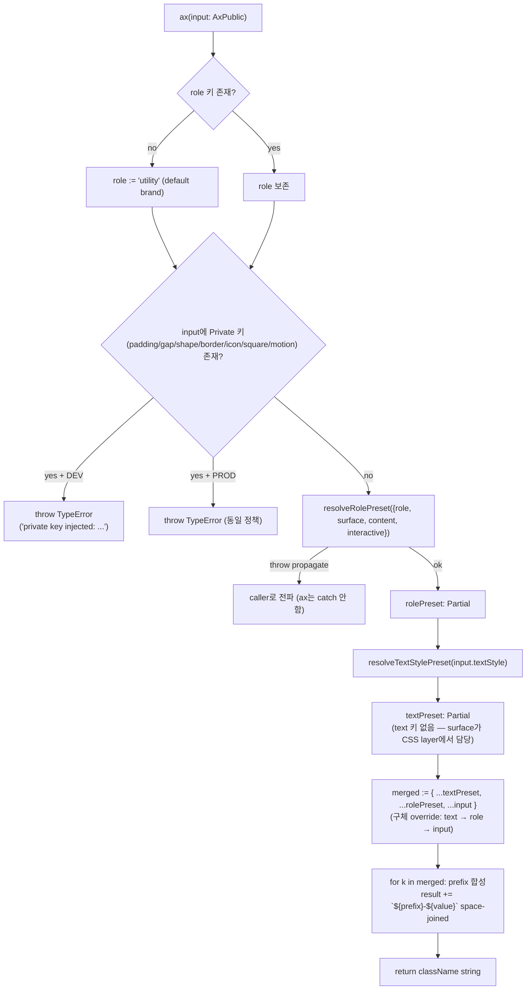
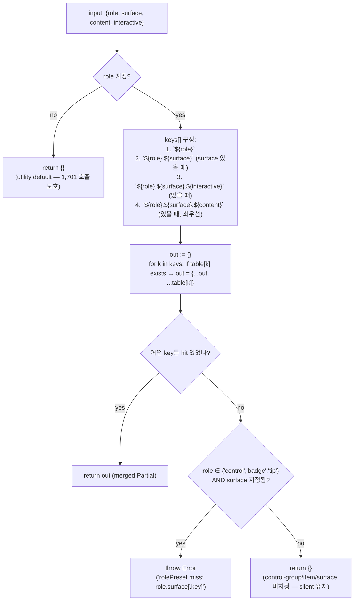
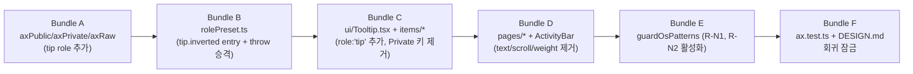

# ax 축 감축 + role Required — Blueprint

> **Discussion**: 2026-04-18 세션 회고 — text-apca 88/88 baseline pass인데 Replay 툴팁 가독 실패. 원인: `Partial<AxPrivate>` 열려 있음 + role optional + rolePreset miss silent. 본질 진단: 03-ax-mapping.md가 inventory(존재 체크)였고 contract audit(반증)이 아니었음. 해결: text/weight/state/scroll/opacity 5축 제거 + role Required로 discriminated union + surface→text 자동 pairing(Material on-*) + padding/gap/shape/border 런타임 throw 승격.
> **선행 PRD**: `ax-pit-of-success-prd.md` (2026-04-10) — tone×surface 페어링, depth 레벨, radius seed. 값/런타임 층.
> **이번 PRD 포지션**: 타입/구조 층 — 선행 PRD의 값 체계 위에 "조합 표현 불가성"을 얹는다.
> **산출물 유형**: 엔진 리팩토링 (디자인 시스템 타입·런타임 재구조)
> **규모 추정**: src/styles/* 5파일 수정, 호출부 139+개 마이그레이션, 신규 guardOsPatterns 규칙 N개, 측정 스크립트 1개 확장

## §1 데이터 모델

> 타입·스키마·상태 — 이름·필드·관계·불변식

### 1.0 범위 선언

- **TO-BE 축 개수**: Public 11 + Private 7 = **18축** (AS-IS 14 + 11 = 25 → 18)
- **제거 (Public/Private 양쪽 부재)**: `text`, `weight`, `state`, `scroll`(Public), `opacity` — 5축
- **Private 격리 (P2 런타임 throw 승격)**: `padding`, `gap`, `shape`, `border` — rolePreset/ax.raw()에서만 도달 가능
- **Private 재검토 (P3)**: `icon`, `square`, `motion` — 현재는 Private 유지
- **Public 제거 재검토 (P3)**: `flex`, `clamp`, `aspect` — 일단 유지 (호출부 사용 빈도 높음)
- **입력 증거**: 1,825건 ax() 호출 scan — 124건 `role` 지정, 1,701건 role-less (대부분 layout/textStyle 단독 컨테이너). role-less + surface 조합이 **Tooltip-class 버그 사이트** (§4 참조).

### 1.1 TO-BE 타입 정의 (TS pseudo-grammar)

```ts
// ── 기본 열거형 (AxPublic을 구성하는 value 단위 타입) ──────────────────

export type CsScale     = 'xs' | 'sm' | 'md' | 'lg' | 'xl'
export type AxTone      = 'accent' | 'danger' | 'success' | 'warning' | 'neutral'
                        | 'accent-dim' | 'danger-dim' | 'success-dim' | 'warning-dim' | 'neutral-dim'
export type AxTextStyle = 'hero' | 'display' | 'page' | 'section' | 'label'
                        | 'body' | 'caption' | 'code' | 'overline'
export type AxContent   = 'text' | 'code' | 'bubble' | 'icon'
export type AxInteractive = 'item' | 'tab' | 'check' | 'cell' | 'input' | 'button'
export type AxWidth     = 'full' | 'auto' | 'fit' | 'sm' | 'md' | 'lg' | 'xl' | 'prose'
export type AxLayout    = 'row' | 'center' | 'bar' | 'spread' | 'stack' | 'scroll' | 'scroll-x' | 'clip'
                        | 'fill' | 'row-fill' | 'wrap'
                        | 'grid-2' | 'grid-3' | 'grid-4' | 'grid-5' | 'grid-7' | 'table'
                        | 'self-start' | 'self-end' | 'self-center'
export type AxPlacement = /* 기존 AxPublic.AxPlacement 값 그대로 유지 */
                        | 'above' | 'below' | 'bottom' | 'bottom-center' | 'center'
                        | 'top-start' | 'top-end' | 'viewport' | 'sticky'
                        | 'anchor-below' | 'anchor-below-start' | 'anchor-above'
                        | 'anchor-end' | 'anchor-start' | 'relative'
                        | 'float-top-start' | 'float-top-center'
                        | 'float-bottom-center' | 'float-bottom'
export type AxFlex      = 'none' | 'auto' | '1'
export type AxClamp     = '1' | '2' | '3' | '4' | 'pre' | 'scroll'
export type AxAspect    = '1' | 'video' | 'card'

// ── role 단위 타입 (discriminant) ────────────────────────────────────

export type AxRole =
  | 'control'        // 단일 인터랙티브 컨트롤 (버튼/아이콘 버튼/인풋 래퍼)
  | 'control-group'  // 컨트롤 묶음 컨테이너 (spinbutton, datepicker 프레임)
  | 'item'           // 리스트/트리/탭의 행 아이템
  | 'badge'          // 상태 태그 (placeholder 포함)
  | 'utility'        // ★신규: 레이아웃/타이포 전용 — surface/interactive 금지 브랜치

// ── surface 파티션 (role-별 허용 집합) ───────────────────────────────
// 주: 기존 11개 AxSurface를 유지하되 role 브랜치가 subset을 잠근다.

// control 계열이 쓰는 인터랙티브 배경
type SurfaceActionable = 'action' | 'ghost' | 'input' | 'placeholder'
// display 계열이 쓰는 표시형 배경 (non-interactive chip/card)
type SurfaceDisplay    = 'display' | 'ghost' | 'overlay' | 'placeholder'
// 아이템 행은 transparent가 기본. surface는 optional.
type SurfaceRow        = 'ghost' | 'display'
// 뱃지 표면
type SurfaceBadge      = 'display' | 'ghost' | 'overlay' | 'placeholder'
// 툴팁/오버레이 전용 역전 표면 — 단독 사용 금지, role이 잠금
type SurfaceTip        = 'inverted' | 'overlay'
// 컨테이너 (stack/row/center 등 순수 레이아웃)
type SurfacePanel      = 'sunken' | 'base' | 'raised'

// ── AxPublic: Discriminated Union by role ────────────────────────────

export type AxPublic =
  // ① 인터랙티브 컨트롤 — 버튼, 아이콘 버튼, 폼 인풋
  | {
      role: 'control'
      surface: SurfaceActionable           // 필수 — ghost 기본은 rolePreset에서만 보충
      interactive?: AxInteractive           // 권장 (type=button|input|check|tab|cell)
      content?: AxContent                   // content 별 padding/radius 분기
      tone?: AxTone                         // tone+surface 페어링(선행 PRD)
      textStyle?: AxTextStyle               // body/label/caption 등
      cs?: CsScale
      layout?: AxLayout                     // center/bar/row
      placement?: AxPlacement
      width?: AxWidth
      flex?: AxFlex
      clamp?: AxClamp
      aspect?: AxAspect
    }
  // ② 컨트롤 묶음 컨테이너 — spinbutton, segmented 프레임
  | {
      role: 'control-group'
      surface?: SurfacePanel | 'ghost'
      cs?: CsScale
      layout?: AxLayout
      width?: AxWidth
      flex?: AxFlex
      placement?: AxPlacement
    }
  // ③ 리스트/트리/탭 행 아이템
  | {
      role: 'item'
      interactive?: AxInteractive
      content?: AxContent
      surface?: SurfaceRow                  // 기본 transparent
      tone?: AxTone                         // selected 상태의 tone hint
      textStyle?: AxTextStyle
      cs?: CsScale
      layout?: AxLayout
      width?: AxWidth
      flex?: AxFlex
      clamp?: AxClamp
      placement?: AxPlacement
    }
  // ④ 뱃지 — 상태 태그, 카운터
  | {
      role: 'badge'
      surface: SurfaceBadge                 // 필수 — rolePreset 주입 대상
      tone?: AxTone
      content?: AxContent
      interactive?: 'button'                // dismiss 가능 뱃지만 button 허용
      textStyle?: AxTextStyle
      cs?: CsScale
      clamp?: AxClamp
    }
  // ⑤ ★신규 utility — 레이아웃/타이포 전용 (surface/interactive 브랜치 차단)
  | {
      role?: 'utility'                      // ← 미지정 시 utility로 default (호출부 오버헤드 0)
      // surface:           ❌ 금지 (brand 타입 오류) — 브랜치 판별 키
      // interactive:       ❌ 금지
      // content:           ❌ 금지
      // tone:              ❌ 금지 (tone 단독 사용은 :where() specificity 0 — 선행 PRD §6#1)
      textStyle?: AxTextStyle               // 타이포그래피 단독 사용
      cs?: CsScale
      layout?: AxLayout
      placement?: AxPlacement
      width?: AxWidth
      flex?: AxFlex
      clamp?: AxClamp
      aspect?: AxAspect
    }

// ── AxPrivate: text/weight/state/opacity/scroll 삭제 버전 ────────────

export type AxPadding = 'none' | 'xs' | 'sm' | 'md' | 'lg' | 'xl'
export type AxGap     = 'xs' | 'sm' | 'md' | 'lg' | 'xl' | '2xl'
export type AxShape   = 'none' | '2xs' | 'xs' | 'sm' | 'md' | 'lg' | 'xl' | 'pill'
export type AxBorder  = 'subtle' | 'default' | 'strong' | 'dashed' | 'ring'
                      | 'bottom' | 'top' | 'start' | 'end'
export type AxIcon    = 'xs' | 'sm' | 'md' | 'lg'
export type AxSquare  = 'xs' | 'sm' | 'md' | 'lg' | 'xl' | '2xl'
export type AxMotion  = 'pulse' | 'spin' | 'fade-in' | 'slide-up'
                      | 'fade-slide-in' | 'slide-in' | 'scale-in' | 'blink' | 'shimmer'

export type AxPrivate = {
  padding?: AxPadding   // P2: rolePreset 전용 — ax() 호출부 직접 지정 시 throw
  gap?: AxGap           // P2: 동상
  shape?: AxShape       // P2: 동상
  border?: AxBorder     // P2: 동상
  icon?: AxIcon         // P3: Private 유지 (호출부 재검토 예정)
  square?: AxSquare     // P3: 동상
  motion?: AxMotion     // P3: 동상
}

export const AX_PRIVATE_KEYS = [
  'padding', 'gap', 'shape', 'border', 'icon', 'square', 'motion',
] as const satisfies ReadonlyArray<keyof AxPrivate>

// ── 삭제되는 타입 (반증 앵커) ────────────────────────────────────────
// @removed AxText, AxWeight, AxState, AxOpacity, AxScroll(Public/Private 둘 다)
// rolePreset만 가시적으로 남고, 호출부는 textStyle+surface+role 합성으로 도달

// ── Axes 합병 타입 — 마이그레이션 종료 후 AxPublic만 노출 ────────────
// 현재 back-compat: Axes = AxPublic & Partial<AxPrivate>
// TO-BE:            Axes = AxPublic     (Partial<AxPrivate> 병합 제거)
export type Axes = AxPublic

// ── RolePresetKey: role × surface × (content|interactive) 조합 keys ──

export type RolePresetKey =
  | `${AxRole}`
  | `${AxRole}.${AxSurface}`
  | `${AxRole}.${AxSurface}.${AxContent}`
  | `${AxRole}.${AxSurface}.${AxInteractive}`

// where AxSurface = union of all role-branch surface subsets:
type AxSurface = SurfaceActionable | SurfaceDisplay | SurfaceRow
               | SurfaceBadge | SurfaceTip | SurfacePanel

// ── rolePresetTable — exhaustive lookup ──────────────────────────────
// TO-BE: lookup miss → throw (AS-IS: silent return {}).
// Tooltip의 'tip.inverted.caption' 같은 키는 반드시 등록해야 타입 통과.

export const rolePresetTable = {
  'control.action':          { padding: 'sm', shape: 'md', gap: 'xs' },
  'control.action.text':     { padding: 'sm' },
  'control.action.icon':     { padding: 'xs' },
  'control.ghost':           { padding: 'sm', shape: 'md' },
  'control.ghost.icon':      { padding: 'xs' },
  'control.input':           { padding: 'sm', shape: 'sm', border: 'default' },
  // ...
  'badge.display':           { padding: 'xs', shape: 'pill' },
  'badge.ghost':             { padding: 'xs' },
  'tip.inverted':            { padding: 'xs', shape: 'sm' },  // ★신설 (Tooltip fix)
  'tip.inverted.caption':    { padding: 'xs', shape: 'sm' },  // content=caption 분기
  // ...
} as const satisfies Record<RolePresetKey, Partial<AxPrivate>>
```

**주**: `tip` role 브랜치는 AxRole 열거 ①~⑤에는 포함되지 않는다 — Tooltip 케이스는 별도 분석 필요 (?). 두 경로 중 택1:
- **A**: `tip`을 AxRole에 추가 → union이 6 브랜치. Tooltip만 쓰는 전용 role.
- **B**: 현 `control` 브랜치에 surface `'inverted'`를 추가하고 `interactive: 'button'` optional로 Tooltip 수용. surface 잠금 느슨.
- **추천**: A — "역할=tip"이 의미적으로 명확. 단 AxRole 열거 추가 결정은 API 설계자(§3)가 최종 판단.

### 1.2 관계도 (erDiagram)

```mermaid
erDiagram
    CALLSITE ||--|| AX_CALL : invokes
    AX_CALL ||--|| AxPublic : "input (typed)"
    AxPublic }|--|| AxRole : "discriminant"
    AxPublic ||--o| AxSurface : "bounded by role"
    AxPublic ||--o| AxContent : "optional"
    AxPublic ||--o| AxInteractive : "optional"
    AxPublic ||--o| AxTextStyle : "optional"

    AX_CALL ||--|| ROLE_PRESET_LOOKUP : "resolveRolePreset(role,surface,content,interactive)"
    ROLE_PRESET_LOOKUP ||--|| RolePresetTable : "exhaustive match"
    RolePresetTable ||--|| AxPrivate : "injects padding/gap/shape/border/motion"

    AX_CALL ||--|| TEXT_PRESET_LOOKUP : "resolveTextStylePreset(textStyle)"
    TEXT_PRESET_LOOKUP ||--|| TextStylePresetTable : "optional match"
    TextStylePresetTable ||--|| DERIVED_TEXT : "derives text color from surface+role (Material on-*)"

    ROLE_PRESET_LOOKUP ||--|| THROW_OR_CLASSNAME : "miss=throw / hit=merge"
    THROW_OR_CLASSNAME ||--|| CLASSNAME_STRING : "prefix-value space-joined"

    AX_RAW ||--|| AxPrivate : "escape hatch (ui/ only)"
    AX_RAW ||--|| CLASSNAME_STRING : "prefix-value"
    CALLSITE_PAGES ||--x{ AX_RAW : "FORBIDDEN (guardOsPatterns)"
```

### 1.3 불변식 표

| # | 불변식 | 반증 조건 |
|---|--------|----------|
| 1 | `AxPublic`은 `role`을 discriminant로 가지며, `role` 생략 시 `'utility'`로 브랜드된다 | `role` 미지정 + `surface: 'inverted'`가 타입 통과하면 틀림 (현 Tooltip.tsx:80 상태) |
| 2 | `role: 'utility'` 브랜치는 `surface` / `interactive` / `content` / `tone` 필드를 허용하지 않는다 | `ax({ surface: 'display' })` 호출이 컴파일 통과하면 틀림 |
| 3 | 각 `role` 브랜치의 `surface`는 role-local subset (SurfaceActionable/SurfaceRow/…)만 허용 | `ax({ role: 'control', surface: 'sunken' })` 통과 시 틀림 (sunken은 panel 전용) |
| 4 | `AxPublic` / `AxPrivate` 어디에도 `text` 필드가 존재하지 않는다 | `AxPublic['text']` 또는 `AxPrivate['text']` 참조가 resolve 되면 틀림 |
| 5 | `weight` / `state` / `opacity` 필드는 `AxPublic` / `AxPrivate` 양쪽에서 부재 | 해당 키 참조가 resolve 되면 틀림 |
| 6 | `scroll`은 Public 축에서 제거되고, overflow 제어는 `layout: 'scroll' \| 'scroll-x'`로 흡수 | `AxPublic['scroll']` 참조 resolve 시 틀림. `scroll` prefix가 `prefixes`에 남아있으면 틀림 |
| 7 | `resolveRolePreset` 결과가 `undefined`면 `throw` (AS-IS는 `{}` silent return) | Vitest에서 `ax({ role: 'tip', surface: 'inverted' })` 호출 시 등록 전이면 throw를 던져야 pass |
| 8 | `Axes = AxPublic` — `Partial<AxPrivate>` 병합 제거 | `ax({ padding: 'md' })` 호출이 컴파일 통과하면 틀림 (P2 이후) |
| 9 | `AxPrivate`의 모든 키는 `ax.raw()` 또는 `rolePreset` 내부에서만 도달 | `pages/**` 또는 `ui/**` 에서 `padding`/`gap`/`shape`/`border`를 ax() 인자에 직접 쓰면 guardOsPatterns error |
| 10 | `ax.raw()`는 `pages/**`에서 import 금지, `ui/**`는 escape hatch로 제한 허용 | guardOsPatterns 훅이 `pages/**/*.tsx` 중 `ax.raw` 또는 `from '.../axRaw'` 매칭 시 error |
| 11 | `textStyle`은 Public으로 남고, surface + role 조합이 **text 색(fg)** 자동 파생 (Material on-*) | `ax({ role: 'control', surface: 'action', tone: 'accent' })`가 렌더링 시 전경색 `--_fg` 미주입이면 틀림 (선행 PRD §6 V1) |
| 12 | `rolePresetTable`의 모든 키는 `RolePresetKey` 유효 조합이며, 유효한 `RolePresetKey`는 테이블에 등록되어 있거나 fallback 키로 연쇄된다 | 임의 `RolePresetKey` 열거 후 `resolveRolePreset` 호출 시 등록 전이면 throw — cascade fallback으로 해결되지 않으면 틀림 |
| 13 | `AX_PRIVATE_KEYS`는 `keyof AxPrivate`와 1:1 대응 | `AX_PRIVATE_KEYS`에 `text` 또는 `weight` 잔존 시 `satisfies` 가 fail 하거나 runtime guard가 잘못된 키를 허용함 |
| 14 | `tone`은 독립 사용 불가 — role 브랜치가 허용하는 곳에서만 (`utility` 브랜치 배제) | `ax({ tone: 'accent' })` 호출이 컴파일 통과하면 틀림 (선행 PRD §6#1 "where(tn-) + surface" 우선순위 이슈의 루트 차단) |

### 1.4 변경 범위 요약 (diff scope)

| 파일 | AS-IS | TO-BE |
|------|-------|-------|
| `src/styles/axPublic.ts` | flat intersection `AxPublic = { cs?, role?, surface?, … }` 14축 | discriminated union by `role` 5 브랜치 (+`tip` 1 검토) |
| `src/styles/axPrivate.ts` | 11 축 `padding/gap/shape/border/icon/square/weight/text/opacity/state/motion` | 7 축: `padding/gap/shape/border/icon/square/motion` |
| `src/styles/ax.ts` | `Axes = AxPublic & Partial<AxPrivate>`, `prefixes` 25 entries | `Axes = AxPublic`, `prefixes` 18 entries, rolePreset miss → throw |
| `src/styles/rolePreset.ts` | `resolveRolePreset` 미스 시 `{}` 반환 | 미스 시 throw, table exhaustive check, `tip.*` entry 신규 |
| `src/styles/axRaw.ts` | Private 11 prefix 매핑 | Private 7 prefix (삭제된 4개 제거) |

### 1.5 불확실 지점 (`?` 마커)

- **(?1)** `tip` role 신설 vs `control` 확장 — 1.1 주석 참조. 권장은 `tip` 신설이나 §3 API 설계자 판단.
- **(?2)** `role: 'utility'`를 명시 default 처리할지 (taint-free) vs 완전 optional로 남길지 — discriminated union의 default 브랜치 설계. TS 4.9+ `satisfies` + key-absence discriminant 패턴 확인 필요.
- **(?3)** `AX_PUBLIC_KEYS` 상수는 union 전개가 되지 않음 — 브랜치별 keys 상수를 별도로 export할지 (`AX_PUBLIC_KEYS_CONTROL` 등) 또는 union of all keys만 남길지 §3에서 확정.
- **(?4)** `flex`/`clamp`/`aspect` — 1.0에서 P3 재검토 표기. 현 호출부 다수 사용 중이므로 유지하되 브랜치별 허용은 control/item/utility 세 곳에 한정.

**완성도:** 🟡 (1.5 (?1~?4) 해소 후 🟢 전환)
**역PRD:** (구현 후 `file::TypeName` 기입)

## §2 파일 맵

> §1 데이터 모델을 실현하기 위해 건드릴 파일을 전수 열거. 신규/수정/삭제 라벨 + 한 줄 책임 + §1 트리거에 의한 핵심 변경 + 재사용 부품 확인 + 역PRD 슬롯.

### 2.0 결정 — `tip` role 처리 (§1 (?1) 해소)

§1 1.1 주석의 두 경로 중 **A: `tip` role 신설** 채택.

- **근거 1 (의미)**: Tooltip은 hover/focus로 보조 설명을 제공하는 비-인터랙티브 표면. `control` 브랜치에 끼워넣으면 `interactive` 필드가 의미적으로 어색하다 (Tooltip 자체는 interactive=button 아님).
- **근거 2 (타입 잠금)**: `SurfaceTip = 'inverted' | 'overlay'` subset을 별도 브랜치로 잠그면 `inverted`가 `control.action.inverted` 같은 잘못된 조합으로 새지 않는다. §1 불변식 #3(role-local subset) 강화.
- **근거 3 (호출부 영향 0)**: 현재 `surface: 'inverted'` 호출은 `src/interactive-os/ui/Tooltip.tsx:80` 단 1건. 신규 role 추가 비용 = 1 파일 마이그레이션.
- **귀결**: `AxRole`은 6 브랜치 (`control | control-group | item | badge | utility | tip`). §3 API 설계자에게는 "결정 완료, 변경 없음"으로 인계.

### 2.1 파일 테이블

| 경로 | 책임 (한 줄) | 신규/수정/삭제 | 주요 변경 | 재사용 부품 | 역PRD |
|------|------------|---------------|---------|------------|------|
| `/Users/user/Desktop/aria/src/styles/axPublic.ts` | Public 11축 타입 SSOT | 수정 | (a) `AxScroll` export 삭제, `scroll?` 필드 제거. (b) `AxRole`에 `'utility' \| 'tip'` 추가. (c) `AxPublic` flat type → 6브랜치 discriminated union (control / control-group / item / badge / utility / tip). (d) role-별 surface subset 타입 6개(SurfaceActionable/SurfacePanel/SurfaceRow/SurfaceBadge/SurfaceTip 등) 추가. (e) `AX_PUBLIC_KEYS`에서 `'scroll'` 삭제 → 13개. | — | ⬜ |
| `/Users/user/Desktop/aria/src/styles/axPrivate.ts` | Private 7축 타입 SSOT | 수정 | (a) `AxText`/`AxWeight`/`AxOpacity`/`AxState` 4개 type alias 삭제. (b) `AxPrivate`에서 `text`/`weight`/`opacity`/`state` 필드 4개 삭제 → 7축. (c) `AX_PRIVATE_KEYS` 배열에서 4개 키 제거 → `['padding','gap','shape','border','icon','square','motion']`. (d) header doc 주석 "10축" → "7축" 갱신. | — | ⬜ |
| `/Users/user/Desktop/aria/src/styles/ax.ts` | ax() 합성 + escape hatch 부착 | 수정 | (a) `Axes` alias `AxPublic & Partial<AxPrivate>` → `AxPublic` 단독. (b) re-export 목록에서 `AxScroll` 삭제. (c) `prefixes` map에서 5 키 삭제(`scroll/weight/text/opacity/state`) → 18 entries. (d) `warnedKeys`/`PRIVATE_KEY_SET` dev console.warn 블록 삭제, 대신 `import.meta.env?.DEV`에서 `throw new TypeError` 승격 (P2 throw — §1 불변식 #9). (e) `resolveRolePreset` 결과 `undefined` 시 throw (§1 불변식 #7) — 단 cascade 어떤 키도 hit 안 했고 role 지정된 경우만. (f) `Axes` 시그니처 변경에 따라 jsdoc 예시 업데이트. | rolePreset.ts(기존), axRaw.ts(기존), axPublic.ts(기존) | ⬜ |
| `/Users/user/Desktop/aria/src/styles/axRaw.ts` | Private 직접 주입 escape hatch | 수정 | (a) `PRIVATE_PREFIXES` map에서 4 키 삭제(`weight/text/opacity/state`) → 7 entries. (b) `AxPrivate`/`AX_PRIVATE_KEYS` import 그대로 유지(SSOT 의존). (c) jsdoc "Private 10축" → "Private 7축" 갱신. | axPrivate.ts | ⬜ |
| `/Users/user/Desktop/aria/src/styles/rolePreset.ts` | role × surface × content/interactive cascade 테이블 + textStyle 테이블 | 수정 | (a) `RolePresetKey` union이 `AxRole`(6브랜치) × `AxSurface`(6 subset union) 자동 확장 — §1 1.1의 `AxSurface = SurfaceActionable \| … \| SurfacePanel` 정의 axPublic에서 import. (b) 기존 entries에서 `text`/`weight` 값 삭제(필드 부재). (c) `tip.inverted`, `tip.inverted.caption` 신규 entry 추가 (Tooltip 마이그레이션 unblock). (d) `resolveRolePreset` cascade 마지막에 모든 키가 miss이고 `input.role` ∈ {`control`,`badge`,`tip`} 이면 throw — utility/control-group/item은 silent `{}` 유지(role-less default 1,701건 보호). (e) `rolePresetTable` 객체에 `as const satisfies Record<RolePresetKey, Partial<AxPrivate>>` 추가하여 키 exhaustive 정적 체크. (f) `resolveTextStylePreset`은 surface→text 자동 파생(Material on-*) 로직과 충돌하지 않도록 `text` 주입을 모두 제거 — text 색은 CSS layer (`tone+surface` `:where`)가 담당 (선행 PRD §6 V1). | axPublic.ts, axPrivate.ts | ⬜ |
| `/Users/user/Desktop/aria/src/interactive-os/ui/Tooltip.tsx` | hover/focus 보조 설명 popover | 수정 | line 80의 `ax({ surface: 'inverted', placement, padding, shape, textStyle, motion })` → `ax({ role: 'tip', surface: 'inverted', placement, textStyle, motion })`. padding/shape는 `tip.inverted` rolePreset 주입에 위임. (§1 불변식 #3, #9 동시 충족) | rolePresetTable의 `tip.inverted` entry | ⬜ |
| `/Users/user/Desktop/aria/src/ActivityBar.tsx` | 좌측 활동 바 nav rail | 수정 | **D1 결정: `role: 'control'` → `role: 'item'` 재분류** (nav rail = list item 성격, SurfaceRow 준수). line 111, 190 `ax({ role: 'control', surface: state.focused ? 'display' : 'ghost', text: state.focused ? 'bright' : 'muted' })` → `ax({ role: 'item', surface: state.focused ? 'display' : 'ghost', interactive: 'item', tone: state.focused ? 'accent' : undefined, layout: 'center', content: 'icon' })`. `text` 직접 주입 제거, focused 강조는 `tone: 'accent'`가 담당 (surface→text 자동 파생). | ax() rolePreset, surface→text auto pairing (선행 PRD) | ⬜ |
| `/Users/user/Desktop/aria/src/interactive-os/ui/items/*.tsx` (대표 23 파일: WriterItem/PaginationItem/ToggleItem/CheckItem/SwitchItem/ServiceItem/SelectItem/TabItem/TimelineItem/ToolbarItem/FileTreeItem/MenuItem/TreeItem/TocItem/EditableTreeItem/ListItem/RadioItem/IssueRow/EditableListItem/DialogItem/StepperItem/SessionItem) | items 레이어 — `ax.raw` 사용처 | 수정 | `ax.raw({ text/weight/opacity/state: ... })` 호출에서 삭제된 4 키 제거. 대체: (a) text → role 브랜치 + surface로 자동 파생, (b) weight → `textStyle` Public 축으로 흡수, (c) opacity → CSS `data-disabled`/`aria-disabled` selector(이미 interactive.css에 있음), (d) state → ARIA selector 기반(`[aria-selected]` 등). 잔존 `padding/gap/shape/border/icon/square/motion`은 `ax.raw` 유지 가능(§1 불변식 #10 — ui/만 escape hatch 허용). | items/ 기존 ARIA selector | ⬜ |
| `/Users/user/Desktop/aria/src/interactive-os/ui/*.tsx` (text 직접 주입 17 파일: TreeGrid/Table/TabList/Slider/NavList/Kanban/Grid/CalendarGrid/Breadcrumb/FileViewer/CodeViewer/MarkdownViewer/chat/ToolSummaryBlock/chat/ThinkingBlock 등) | ui/ 완성품 — ax({text:…}) 직접 호출 | 수정 | `ax({ ..., text: '...' })` → role 브랜치 + textStyle로 의도 표현. 자동 파생되지 않는 잔여 케이스만 동일 파일 내 `ax.raw({ ... })` 별도 className 합성으로 분리. | textStylePresetTable (caption/label/body) | ⬜ |
| `/Users/user/Desktop/aria/src/interactive-os/ui/*.tsx` (scroll 직접 주입 13 파일: Progress/Composer/Combobox/QuickOpen/SpreadReader/Select/Meter/SplitPane/SearchResults/Accordion/Alert 등) | ui/ — ax({scroll:…}) 호출 | 수정 | `ax({ scroll: 'y' \| 'x' \| 'auto' \| 'hidden' })` → `ax({ layout: 'scroll' \| 'scroll-x' })`. 'hidden'은 axes.css의 `ly-clip` 또는 width/clamp 축으로 흡수 (§1 불변식 #6). | AxLayout `'scroll'`/`'scroll-x'` (이미 존재) | ⬜ |
| `/Users/user/Desktop/aria/src/pages/**/*.tsx` (text/scroll/weight/opacity/state 직접 주입 30+ 파일: cms/*, replay/*, chat/*, showcase/*, theme/*, incident/*, pipeline/*, features/*, creator/*, book/*, i18n/*, ax-principles/* 등) | pages/ 호출부 마이그레이션 | 수정 | (a) Private 키 직접 주입 → role+surface+textStyle 의도 표현. (b) pages/는 `ax.raw` import 금지(§1 불변식 #10) — 잔존 케이스는 ui/ 완성품 호출로 흡수하거나 ui/에 새 부품 추가 후 import. (c) `scroll: 'x'\|'y'` → `layout: 'scroll'\|'scroll-x'` 일괄 치환. (d) `surface: 'inverted'` 잔존 시 Tooltip ui로 위임. | ui/ 완성품 (panels/, items/, indicators/) | ⬜ |
| `/Users/user/Desktop/aria/.claude/hooks/guardOsPatterns.mjs` | os 우회 패턴 차단 PreToolUse hook | 수정 | (a) 신규 규칙 R-N1: `pages/**/*.tsx`에서 `ax.raw` 또는 `from '@styles/axRaw'`/`'../styles/axRaw'` import 매칭 시 `block` (§1 불변식 #10). (b) 신규 규칙 R-N2: `ax({ ... padding:|gap:|shape:|border:|text:|weight:|opacity:|state:|scroll: ... })` 정규식 매칭 시 `block` — 런타임 throw와 이중 방어 (§1 불변식 #4~9 정적 검사). 메시지: "Private/제거 키 직접 주입 금지. role preset 또는 layout 축 사용." | guardOsPatterns 기존 차단 메시지 포맷 | ⬜ |
| `/Users/user/Desktop/aria/.claude/hooks/guardCssAxes.mjs` | module.css에서 ax() 소유 속성 차단 | 수정 | `AX_ALTERNATIVES` 매핑에서 `font-weight`/`color`/`opacity` 안내 메시지를 갱신 — 이제 `weight`/`text`/`opacity` 축이 부재이므로 "ax({ textStyle: 'label' \| 'body' \| ... }) + role/surface 자동 파생" 으로 안내. | 기존 매핑 구조 | ⬜ |
| `/Users/user/Desktop/aria/scripts/scanOsViolations.mjs` | os 우회 정적 스캐너 | 수정 | 신규 위반 카테고리 2개 추가: (a) `private-direct-injection` — `ax({ … private-key: … })` 호출. (b) `axraw-in-pages` — `pages/**`에서 `ax.raw` 호출. 기존 reporter 포맷 그대로 표 출력. | 기존 reporter 헬퍼 | ⬜ |
| `/Users/user/Desktop/aria/scripts/measureSurfacePairs.mjs` | tone×surface APCA 측정 | 수정 | DOM 인스턴스 측정 대상에 `role` 브랜치별 surface subset을 추가 — `tip.inverted`(신규)와 `control.action`/`badge.display`/`item.ghost` × tone 5축 매트릭스를 자동 enumerate. role-utility(default)는 측정 대상에서 제외(surface 부재). | 기존 Puppeteer + APCA 측정 파이프라인 | ⬜ |
| `/Users/user/Desktop/aria/src/styles/ax.test.ts` | ax() 타입+런타임 회귀 보호 | 신규 | (a) discriminated union 타입 거부 (compile-time): `// @ts-expect-error` 블록으로 `ax({ surface: 'sunken' })` (utility 브랜치 차단), `ax({ role: 'control', surface: 'sunken' })` (panel-only 차단), `ax({ text: 'bright' })`, `ax({ weight: 'bold' })`, `ax({ scroll: 'y' })` 거부 검증. (b) `resolveRolePreset` miss → throw 검증: `ax({ role: 'control', surface: 'placeholder', content: 'bubble' })`처럼 등록 안 된 cascade가 모두 fail하는 경우 throw. (c) `ax({ role: 'tip', surface: 'inverted' })`가 `pd-xs sh-sm rl-tip sf-inverted` 등 prefix 합성을 정확히 반환. (d) `Axes = AxPublic` 후 `ax({ padding: 'md' })` ts-expect-error. | vitest (기존 테스트 환경), `// @ts-expect-error` 패턴 | ⬜ |
| `/Users/user/Desktop/aria/src/styles/axes.css` | ax() 축 CSS 클래스 SSOT | 수정 | (a) **D2 결정: 신규 `.ly-clip { overflow: clip }` 선언** — `scroll: 'hidden'` 호출부를 `layout: 'clip'`으로 1:1 치환. (b) 삭제된 Public/Private 축 대응 클래스 제거(`.sc-*` scroll, `.tx-*` text, `.wt-*` weight, `.op-*` opacity, `.st-*` state). (c) surface→text pairing 확장: 각 `.sf-*`가 `color: var(--text-on-*)` 소유 (선행 PRD surface-pair 규약 연계, Material on-* 원리). | 기존 `.sf-*`/`.ly-*` 클래스 구조 | ⬜ |
| `/Users/user/Desktop/aria/docs/DESIGN.md` | ax() 디자인 시스템 SSOT 문서 | 수정 | "ax() 24축" → "ax() 18축 (Public 11 + Private 7)" 갱신. 축 리스트에서 5개 삭제 표시(취소선) + role discriminated union 6브랜치 다이어그램 1개 추가. surface→text 자동 파생 규칙 1줄 명시. | 기존 DESIGN.md 표 | ⬜ |
| `/Users/user/Desktop/aria/docs/research/ax/03-ax-mapping.md` | ax 축 매핑 감사 (🟢 Locked / ⚠ Exposed / 🔴 Open) | 수정 | (a) 삭제 5축(text/weight/state/opacity/scroll)을 표 하단 "Removed" 섹션으로 이동. (b) Private 4축(padding/gap/shape/border)을 🟢 Locked로 승격(P2 throw). (c) Public 11축은 role 브랜치별 허용 표 신설. (d) `tip` role 신규 추가 + Tooltip 케이스 케이스 스터디 1줄. | 기존 표 구조 | ⬜ |
| `/Users/user/Desktop/aria/docs/2-areas/styles/prds/ax-axis-reduction-prd.md` | 본 PRD | 수정 | §2 채움 (이 작업), §3~§6 후속 에이전트가 채움. front-matter `relates`에 `ax-pit-of-success-prd.md` 이미 있음 — 추가 없음. | — | ⬜ |

### 2.2 재사용 부품 확인 (제1원칙: 있는 걸로 만든다)

신규 표기 파일은 **`src/styles/ax.test.ts` 1건뿐**. `src/interactive-os/CATALOG.md`는 ui/ 완성품 카탈로그이며 styles/ 하위 테스트 부품은 다루지 않는다 — 즉 styles/ax 단위 테스트의 유사 부품은 0건. 기존 styles/ 디렉토리에 `ax.test.ts`/`__tests__/` 폴더 부재 (`ls /Users/user/Desktop/aria/src/styles/` 확인 — `*.test.*` 파일 0건). 결론: **신규 1건 외 모든 변경은 기존 파일 수정**, 신규 컴포넌트·훅·유틸 도입 0건.

수정 대상 파일이 의존하는 재사용 부품:

- **rolePreset cascade 엔진**: 이미 `src/styles/rolePreset.ts`의 `resolveRolePreset`이 cascade 구현 — 신규 함수 추가 없이 throw 분기만 삽입.
- **textStylePresetTable**: 이미 존재 (`rolePreset.ts:83`) — surface→text 자동 파생 이전에 textStyle preset이 weight/text 주입을 담당하던 경로를 surface+role CSS layer로 이관. text 필드는 테이블에서 제거되지만 weight는 textStyle을 통해 들어왔으므로 **weight 필드 삭제와 textStylePresetTable의 weight 값 삭제는 동기화 필요**.
- **axes.css의 `ly-scroll`/`ly-scroll-x`**: 이미 존재 (`AxLayout` 값에 포함) — `scroll` 축 제거 후 호출부 치환 1대1 매핑.
- **interactive.css의 disabled selector**: `aria-disabled` 기반 opacity는 이미 CSS 레이어에서 처리 — `opacity` Private 축 제거 후에도 visual 동등.
- **scripts/scanOsViolations.mjs reporter**: 기존 카테고리(예: `pages-imports-primitives`) 추가 패턴 그대로 사용.

### 2.3 마이그레이션 묶음 (commit 단위 가이드 — §3 API 설계자 참고용)

선후 의존이 있어 commit 분할 기준을 §2에서 미리 고정한다. 실제 커밋 분할은 §4 흐름 설계자가 PR 단위로 결정.

1. **Bundle A (타입 SSOT)**: `axPublic.ts` + `axPrivate.ts` + `axRaw.ts` 동시 변경. 타입만 — 호출부는 일시적으로 컴파일 에러.
2. **Bundle B (런타임)**: `ax.ts` + `rolePreset.ts` 변경. throw 승격 + tip entry 추가.
3. **Bundle C (호출부 ui/)**: items/ 23 파일 + ui/ text 17 파일 + ui/ scroll 13 파일 + Tooltip 일괄 수정. Bundle B 후 ts-expect-error 0개로 만듦.
4. **Bundle D (호출부 pages/)**: pages/ 30+ 파일 일괄 수정 + ActivityBar.
5. **Bundle E (가드)**: guardOsPatterns + guardCssAxes + scanOsViolations 갱신. Bundle D 끝난 뒤에야 hook activation 가능 (사전 활성화 시 마이그레이션 중간 커밋이 block됨).
6. **Bundle F (검증/문서)**: ax.test.ts 신규 + measureSurfacePairs 확장 + DESIGN.md/03-ax-mapping.md 갱신.

### 2.4 반증 조건

**반증 조건**: 본 §2 파일 맵에 명시되지 않은 경로에 구현 변경(코드 추가/수정)이 나타나면 Blueprint 위반. **수정**으로 표기된 파일에서 새 파일이 갈라져 나오면 위반(예: `axPublic.ts` 수정이 `axPublicTip.ts` 신규 파일을 낳으면 위반). **신규**로 표기된 `src/styles/ax.test.ts` 외에 styles/ 또는 hooks/ 또는 scripts/에 새 .ts/.mjs 파일이 생기면 위반. ax.raw 호출이 `pages/**`에 grep 1건이라도 잔존하면 위반(불변식 #10). 호출부 마이그레이션 누락으로 `ax({ text:|weight:|opacity:|state:|scroll: })` 패턴이 src/ 전체에 grep 1건이라도 잔존하면 위반(불변식 #4~6).

**완성도:** 🟢
**역PRD:** (구현 후 실제 생성/수정 파일 + LOC 기입)

## §3 Export 시그니처

> §1 데이터 모델 + §2 파일 맵을 실현하는 각 파일의 export 시그니처. 본문(body) 없음 — 시그니처 + `@invariant` JSDoc만. `@removed` 주석은 AS-IS에 있던 export가 사라지는 곳에 명시.

### 3.1 `src/styles/axPublic.ts`

```ts
// 책임: Public 11축 타입 SSOT — discriminated union by role.
// LLM 시스템 프롬프트·ui 공개 타입(AriaComponentProps)이 바라보는 유일한 축 집합.
//
// @removed AxScroll  — Public 축에서 제거. overflow 제어는 AxLayout('scroll'|'scroll-x') 흡수 (§1 #6)
// @invariant Private 7축 키(padding/gap/shape/border/icon/square/motion) 미포함
// @invariant 외부(ui/, pages/) 공개 타입은 AxPublic만 import — Axes 합성 타입 import 금지

// ── 1) value 단위 열거형 (변경 없음) ─────────────────────────────────
export type CsScale       = 'xs' | 'sm' | 'md' | 'lg' | 'xl'
export type AxTone        = 'accent' | 'danger' | 'success' | 'warning' | 'neutral'
                          | 'accent-dim' | 'danger-dim' | 'success-dim' | 'warning-dim' | 'neutral-dim'
export type AxTextStyle   = 'hero' | 'display' | 'page' | 'section' | 'label'
                          | 'body' | 'caption' | 'code' | 'overline'
export type AxContent     = 'text' | 'code' | 'bubble' | 'icon'
export type AxInteractive = 'item' | 'tab' | 'check' | 'cell' | 'input' | 'button'
export type AxLayout      = 'row' | 'center' | 'bar' | 'spread' | 'stack' | 'scroll' | 'scroll-x' | 'clip'
                          | 'fill' | 'row-fill' | 'wrap'
                          | 'grid-2' | 'grid-3' | 'grid-4' | 'grid-5' | 'grid-7' | 'table'
                          | 'self-start' | 'self-end' | 'self-center'
export type AxPlacement   = 'above' | 'below' | 'bottom' | 'bottom-center' | 'center'
                          | 'top-start' | 'top-end' | 'viewport' | 'sticky'
                          | 'anchor-below' | 'anchor-below-start' | 'anchor-above' | 'anchor-end' | 'anchor-start'
                          | 'relative'
                          | 'float-top-start' | 'float-top-center' | 'float-bottom-center' | 'float-bottom'
export type AxWidth       = 'full' | 'auto' | 'fit' | 'sm' | 'md' | 'lg' | 'xl' | 'prose'
export type AxFlex        = 'none' | 'auto' | '1'
export type AxClamp       = '1' | '2' | '3' | '4' | 'pre' | 'scroll'
export type AxAspect      = '1' | 'video' | 'card'

// ── 2) role discriminant — 6 브랜치 (utility/tip 신규) ───────────────
/**
 * @invariant role은 AxPublic discriminated union의 유일 discriminant
 * @invariant 'utility'는 role 키 미지정(key-absence) 시 default 브랜치
 * @invariant 'tip'은 Tooltip 전용 — surface가 SurfaceTip subset으로 잠긴다
 */
export type AxRole =
  | 'control'
  | 'control-group'
  | 'item'
  | 'badge'
  | 'utility'   // ★신규
  | 'tip'       // ★신규 (§2.0 결정)

// ── 3) surface 파티션 — 6 subset (role-별 잠금) ──────────────────────
/**
 * @invariant 각 subset은 AxRole 브랜치 1개에 대응 — 외부 export 안 함 (module-local)
 * @invariant SurfaceActionable ∪ … ∪ SurfacePanel = AxSurface (외부 노출 union)
 */
type SurfaceActionable = 'action' | 'ghost' | 'input' | 'placeholder'   // role: 'control'
type SurfaceDisplay    = 'display' | 'ghost' | 'overlay' | 'placeholder' // 미사용 시 control-group 보조
type SurfaceRow        = 'ghost' | 'display'                              // role: 'item'
type SurfaceBadge      = 'display' | 'ghost' | 'overlay' | 'placeholder' // role: 'badge'
type SurfaceTip        = 'inverted' | 'overlay'                           // role: 'tip'
type SurfacePanel      = 'sunken' | 'base' | 'raised'                     // role: 'control-group'

/** AxSurface — 모든 subset의 union (외부 enumeration용) */
export type AxSurface =
  | SurfaceActionable | SurfaceDisplay | SurfaceRow
  | SurfaceBadge | SurfaceTip | SurfacePanel

// ── 4) AxPublic — discriminated union by role ─────────────────────────
/**
 * @invariant role 키 부재 → 'utility' 브랜치로 brand (key-absence discriminant)
 * @invariant role: 'utility' 브랜치는 surface/interactive/content/tone 키 자체 부재 (타입 거부)
 * @invariant role 브랜치별 surface는 role-local subset만 허용 (cross-role surface 거부)
 * @invariant role: 'tip' 브랜치는 textStyle을 'caption' | 'label' | 'body'로 잠근다(option)
 * @invariant role: 'control' / 'badge' 브랜치는 surface 필수 — rolePreset 주입 진입점
 * @invariant text/weight/state/opacity/scroll 키는 모든 브랜치에서 부재
 */
export type AxPublic =
  // ① 인터랙티브 컨트롤
  | {
      role: 'control'
      surface: SurfaceActionable
      interactive?: AxInteractive
      content?: AxContent
      tone?: AxTone
      textStyle?: AxTextStyle
      cs?: CsScale
      layout?: AxLayout
      placement?: AxPlacement
      width?: AxWidth
      flex?: AxFlex
      clamp?: AxClamp
      aspect?: AxAspect
    }
  // ② 컨트롤 묶음 컨테이너
  | {
      role: 'control-group'
      surface?: SurfacePanel | 'ghost'
      cs?: CsScale
      layout?: AxLayout
      width?: AxWidth
      flex?: AxFlex
      placement?: AxPlacement
    }
  // ③ 리스트/트리/탭 행
  | {
      role: 'item'
      interactive?: AxInteractive
      content?: AxContent
      surface?: SurfaceRow
      tone?: AxTone
      textStyle?: AxTextStyle
      cs?: CsScale
      layout?: AxLayout
      width?: AxWidth
      flex?: AxFlex
      clamp?: AxClamp
      placement?: AxPlacement
    }
  // ④ 뱃지
  | {
      role: 'badge'
      surface: SurfaceBadge
      tone?: AxTone
      content?: AxContent
      interactive?: 'button'                 // dismiss 가능 뱃지 한정
      textStyle?: AxTextStyle
      cs?: CsScale
      clamp?: AxClamp
    }
  // ⑤ 툴팁/오버레이 보조 표면 — ★신규
  | {
      role: 'tip'
      surface: SurfaceTip                    // 'inverted' | 'overlay' (필수)
      textStyle?: 'caption' | 'label' | 'body'
      placement: AxPlacement                 // D3 결정: 필수화 (Tooltip.tsx positionAnchor 의존 + 의미적 정합)
      cs?: CsScale
      width?: AxWidth
    }
  // ⑥ utility — 레이아웃/타이포 전용 default 브랜치 (role 생략 허용)
  | {
      role?: 'utility'
      // surface/interactive/content/tone 키 자체 부재 (타입 수준 거부)
      textStyle?: AxTextStyle
      cs?: CsScale
      layout?: AxLayout
      placement?: AxPlacement
      width?: AxWidth
      flex?: AxFlex
      clamp?: AxClamp
      aspect?: AxAspect
    }

// ── 5) Public 키 enumeration ─────────────────────────────────────────
/**
 * 모든 Public 브랜치에서 등장 가능한 키의 union — 13개.
 * @invariant 'scroll' 미포함 (@removed)
 * @invariant 런타임 guard / prefix map / scanOsViolations가 참조
 * @note discriminated union의 keyof 연산은 브랜치 교집합만 반환하므로
 *       string literal tuple로 명시 (TS 한계 우회).
 */
export const AX_PUBLIC_KEYS: readonly AxPublicKey[]

/** AxPublic 모든 브랜치 키의 union (보조 타입) */
export type AxPublicKey =
  | 'cs' | 'role' | 'surface' | 'tone' | 'textStyle' | 'content'
  | 'layout' | 'placement' | 'width' | 'flex' | 'clamp' | 'aspect' | 'interactive'
```

### 3.2 `src/styles/axPrivate.ts`

```ts
// 책임: Private 7축 타입 SSOT — rolePreset.ts / axRaw.ts에서만 import.
//
// @removed AxText, AxWeight, AxOpacity, AxState  — Private에서 제거 (§1 #4, #5)
// @removed AxPrivate.text/weight/opacity/state 필드
// @invariant AxPublic과 키 교집합 공집합 — Public/Private 이름 충돌 금지
// @invariant ui/, pages/ 파일에서 직접 import 시 guardCssAxes가 error
// @invariant 모든 키는 ax.raw() 또는 rolePreset 내부에서만 도달 (§1 #9)

export type AxPadding = 'none' | 'xs' | 'sm' | 'md' | 'lg' | 'xl'
export type AxGap     = 'xs' | 'sm' | 'md' | 'lg' | 'xl' | '2xl'
export type AxShape   = 'none' | '2xs' | 'xs' | 'sm' | 'md' | 'lg' | 'xl' | 'pill'

type BorderFull       = 'subtle' | 'default' | 'strong' | 'dashed' | 'ring'
type BorderSide       = 'bottom' | 'top' | 'start' | 'end'
export type AxBorder  = BorderFull | BorderSide

export type AxIcon    = 'xs' | 'sm' | 'md' | 'lg'
export type AxSquare  = 'xs' | 'sm' | 'md' | 'lg' | 'xl' | '2xl'
export type AxMotion  = 'pulse' | 'spin' | 'fade-in' | 'slide-up'
                      | 'fade-slide-in' | 'slide-in' | 'scale-in' | 'blink' | 'shimmer'

/**
 * @invariant 7개 키만 — text/weight/opacity/state 부재
 * @invariant 모든 필드 optional — Partial<AxPrivate>가 rolePreset/axRaw 입출력 타입
 */
export type AxPrivate = {
  padding?: AxPadding
  gap?: AxGap
  shape?: AxShape
  border?: AxBorder
  icon?: AxIcon
  square?: AxSquare
  motion?: AxMotion
}

/**
 * Private 축 키 집합 — 7개. 런타임 guard / prefix map의 SSOT.
 * @invariant keyof AxPrivate 와 1:1 — `as const satisfies ReadonlyArray<keyof AxPrivate>` 강제
 * @invariant guardOsPatterns.mjs / scanOsViolations.mjs / axRaw.ts 가 모두 이 배열을 참조
 */
export const AX_PRIVATE_KEYS: readonly (keyof AxPrivate)[]
```

### 3.3 `src/styles/ax.ts`

```ts
// 책임: Public 입력 → rolePreset cascade → Private 주입 → className 합성.
// ax.raw 부착으로 Private 직접 주입 escape hatch 노출.

import type { AxPublic } from './axPublic'
import type { AxPrivate } from './axPrivate'
import type { axRaw } from './axRaw'

// ── 1) Public 타입 re-export — 외부는 'src/styles/ax' 한 경로만 본다 ──
// @removed AxScroll re-export
export type {
  AxPublic, CsScale, AxRole, AxSurface, AxTone, AxTextStyle, AxContent,
  AxLayout, AxPlacement, AxInteractive, AxWidth, AxFlex, AxClamp, AxAspect,
} from './axPublic'

/**
 * Axes alias — 외부 consumer back-compat 한 경로.
 * @removed `Axes = AxPublic & Partial<AxPrivate>`  — Partial<AxPrivate> 병합 제거 (§1 #8)
 * @invariant Axes는 AxPublic과 동치 — Private 키 직접 입력 시 컴파일 거부
 */
export type Axes = AxPublic

/**
 * 축 값을 className 문자열로 변환한다. style={} 대신 이것만 사용.
 *
 * @param axes  AxPublic discriminated union (Private 키 타입 거부)
 * @returns     prefix-value 공백 구분 className 문자열 (예: 'rl-control sf-action pd-sm sh-md')
 *
 * @invariant 입력 타입은 AxPublic — Private 키는 컴파일 거부 (§1 #8)
 * @invariant role 없는 utility 브랜치는 layout/textStyle/cs/width/flex/clamp/aspect/placement만 허용
 * @invariant Private 키 런타임 도달 시 dev에서는 throw, prod에서는 silent drop (P2 throw 승격, AS-IS warn)
 * @invariant role 지정 + surface 지정 + rolePreset cascade 모두 miss → throw (§1 #7)
 *            단 role ∈ {'utility','control-group','item'} 또는 role 없을 때는 silent {} (1,701 호출 보호)
 * @invariant 반환은 순수 문자열 — DOM/style 사이드이펙트 없음
 *
 * @example
 *   ax({ role: 'control', surface: 'action', content: 'text', tone: 'accent' })
 *   ax({ role: 'tip', surface: 'inverted', textStyle: 'caption' })
 *   ax({ layout: 'bar', cs: 'sm' })  // utility 브랜치
 */
export function ax(axes: AxPublic): string

/**
 * ax.raw — Private 축 직접 주입 escape hatch (ax 함수에 부착).
 * @invariant pages/**에서 import 금지 (guardOsPatterns 규칙 R-N1)
 * @invariant ui/** 한정 escape hatch (§1 #10)
 */
export namespace ax {
  const raw: typeof axRaw
}
```

### 3.4 `src/styles/axRaw.ts`

```ts
// 책임: Private 7축 직접 지정의 유일 경로. ax.ts가 ax.raw로 부착해 공개.
//
// @removed PRIVATE_PREFIXES.weight/text/opacity/state  (4 entries 삭제)
// @invariant ui/만 escape hatch 허용 — pages/는 guardOsPatterns가 import 차단

import type { AxPrivate } from './axPrivate'

/**
 * Private 7축 직접 className 합성.
 *
 * @param input  Partial<AxPrivate> — Public 키 들어오면 dev throw
 * @returns      'pd-sm sh-md g-xs' 형태 prefix-value 공백 구분 문자열
 *
 * @invariant AxPublic 키 받지 않음 — Public은 ax() 통해서만 (런타임 dev throw)
 * @invariant 반환 포맷은 ax()와 동일
 * @invariant non-private 키 dev throw, prod silent skip (AS-IS 동작 유지)
 */
export function axRaw(input: Partial<AxPrivate>): string
```

### 3.5 `src/styles/rolePreset.ts`

```ts
// 책임: role × surface × (content|interactive) cascade 테이블 + textStyle 테이블.
// AS-IS의 silent {} 정책을 role 브랜치별로 분기 — control/badge/tip은 throw.

import type { AxPublic, AxRole, AxSurface, AxContent, AxInteractive, AxTextStyle } from './axPublic'
import type { AxPrivate } from './axPrivate'

/**
 * rolePresetTable 키 형식. cascade 해석 순서 = 일반 → 구체 (구체 override).
 * @invariant cs는 키에서 제외 — 외부 입력으로 그대로 전달
 * @invariant AxRole 6브랜치 × AxSurface 6subset union으로 자동 확장
 * @invariant exhaustive — 'tip.inverted', 'tip.inverted.caption' 등 신규 키 등록 강제
 */
export type RolePresetKey =
  | `${AxRole}`
  | `${AxRole}.${AxSurface}`
  | `${AxRole}.${AxSurface}.${AxContent}`
  | `${AxRole}.${AxSurface}.${AxInteractive}`

/**
 * role × surface × (content|interactive) → Partial<AxPrivate> 매핑.
 * 단일 SSOT — 조합 변경은 이 파일 수정만으로 완결.
 *
 * @invariant 값은 Partial<AxPrivate>만 — text/weight/opacity/state 키 부재 (§1 #4~5)
 * @invariant `tip.inverted`, `tip.inverted.caption` entry 신규 (Tooltip unblock)
 * @invariant `as const satisfies Partial<Record<RolePresetKey, Partial<AxPrivate>>>` 강제
 */
export const rolePresetTable: Partial<Record<RolePresetKey, Partial<AxPrivate>>>

/**
 * textStyle → Partial<AxPrivate> 주입 테이블.
 * @removed weight/text 값 모두 — text 색은 surface+role CSS layer가 자동 파생 (Material on-*)
 * @invariant 값은 padding/gap/shape/border/motion 등 7축 subset만
 */
export const textStylePresetTable: Partial<Record<AxTextStyle, Partial<AxPrivate>>>

/**
 * Material on-* 원리 — surface별 자동 파생 text 색 토큰 맵.
 * surface가 결정되면 fg(text) 색은 CSS layer (`:where([data-surface=…])`)가 주입.
 * 이 맵은 측정/문서 스크립트 (measureSurfacePairs.mjs) 가 enumerate용으로 참조.
 *
 * @invariant 키 = AxSurface, 값 = `var(--text-on-{surface})` 형식 토큰명
 * @invariant 'tip' role의 inverted/overlay surface도 포함 — Tooltip APCA pass 보장
 */
export const SURFACE_TEXT_PAIRING: Record<AxSurface, string>

/**
 * Public 입력에서 Private 값을 cascade로 해석.
 *
 * @param input  Pick<AxPublic, 'role' | 'surface' | 'content' | 'interactive'>
 * @returns      Partial<AxPrivate> — 병합된 cascade 결과
 *
 * @invariant 반환은 AxPrivate 키만 — AxPublic 키 미포함
 * @invariant role 없으면 {} 반환 (utility default — 1,701 호출 보호)
 * @invariant role ∈ {'control','badge','tip'} 이고 surface 지정됐는데 cascade 모든 키 miss → throw
 *            (§1 #7 — Tooltip-class 버그 차단)
 * @invariant role ∈ {'control-group','item','utility'} 또는 surface 미지정 → silent {} 유지
 * @invariant cascade 순서: role → role.surface → role.surface.interactive → role.surface.content (구체 override)
 */
export function resolveRolePreset(
  input: Pick<AxPublic, 'role' | 'surface' | 'content' | 'interactive'>,
): Partial<AxPrivate>

/**
 * textStyle 입력에서 Partial<AxPrivate> 해석.
 * surface→text 자동 파생과 orthogonal — text 키는 주입하지 않는다.
 *
 * @invariant 반환은 AxPrivate 키만 — text/weight 키 부재 (제거됨)
 * @invariant undefined 입력 / 미정의 textStyle → {} 반환, throw 금지
 * @invariant rolePreset과 병합 시 role이 우선 (더 구체적 의도)
 */
export function resolveTextStylePreset(
  textStyle: AxTextStyle | undefined,
): Partial<AxPrivate>
```

### 3.6 `src/styles/ax.test.ts` (신규)

```ts
// 책임: discriminated union 타입 거부 + 런타임 throw 회귀 보호.
// vitest + expectTypeOf + // @ts-expect-error 패턴.

import { describe, it, expect } from 'vitest'
import { expectTypeOf } from 'expect-type'
import { ax } from './ax'
import { resolveRolePreset } from './rolePreset'
import type { AxPublic } from './axPublic'

/**
 * @invariant 컴파일 거부 케이스는 // @ts-expect-error 로 음성 검증
 * @invariant 런타임 throw는 expect(...).toThrow(/preset miss/) 로 양성 검증
 */
describe('AxPublic discriminated union (compile-time)')
  // utility default 브랜치 — surface 부재 강제
  // expectTypeOf<AxPublic>().not.toMatchTypeOf<{ surface: 'inverted' }>()
  // role 'control' surface는 SurfaceActionable subset만
  // @ts-expect-error  panel surface는 control 브랜치 거부
  // ax({ role: 'control', surface: 'sunken' })
  // role 'tip' valid 케이스
  // expectTypeOf<AxPublic>().toMatchTypeOf<{ role: 'tip', surface: 'inverted', textStyle: 'caption' }>()
  // 제거된 키 거부
  // @ts-expect-error  text 키 부재
  // ax({ text: 'bright' })
  // @ts-expect-error  weight 키 부재
  // ax({ weight: 'bold' })
  // @ts-expect-error  scroll 키 부재
  // ax({ scroll: 'y' })
  // @ts-expect-error  Axes = AxPublic 후 padding 거부
  // ax({ padding: 'md' })

describe('ax() runtime')
  // it: rolePreset miss → throw (control + 등록 안 된 cascade)
  //   expect(() => ax({ role: 'control', surface: 'placeholder', content: 'bubble' } as never)).toThrow()
  // it: tip.inverted.caption hit → 정확한 prefix 합성 반환
  //   expect(ax({ role: 'tip', surface: 'inverted', textStyle: 'caption' }))
  //     .toMatch(/rl-tip\b.*sf-inverted\b.*ts-caption\b/)
  // it: utility (role 미지정) cs+layout만으로 throw 없이 반환
  //   expect(ax({ layout: 'bar', cs: 'sm' })).toBe('ly-bar cs-sm')

describe('resolveRolePreset miss policy')
  // it: role: 'tip', surface 등록 안 된 값 → throw
  //   expect(() => resolveRolePreset({ role: 'tip', surface: 'ghost' as never })).toThrow()
  // it: role: 'utility' 또는 role 없음 → silent {}
  //   expect(resolveRolePreset({})).toEqual({})
  // it: role: 'item' surface 미지정 → silent {} (1,701 호출 보호)
  //   expect(resolveRolePreset({ role: 'item' })).toEqual({})
```

### 3.7 `.claude/hooks/guardOsPatterns.mjs` (확장 — 기존 flat-script 스타일)

```js
// 책임: PreToolUse:Write|Edit hook — os 우회 패턴 차단.
// 신규 규칙 R-N1, R-N2를 기존 violations 배열 패턴 그대로 추가.
// (Rule 인터페이스 없음 — 인라인 정규식 + push 패턴이 기존 컨벤션)

/**
 * 규칙 R-N1: pages/에서 ax.raw 또는 axRaw import 금지 (§1 #10)
 * @invariant `from '..../axRaw'` 또는 `ax.raw(` 호출 매칭 시 violations.push
 * @invariant 메시지: "ax.raw는 ui/ 한정 escape hatch. pages/에서는 ui/ 완성품 사용."
 */
// if (isPages && (/from\s+['"][^'"]*\/styles\/axRaw['"]/.test(content) || /\bax\.raw\s*\(/.test(content))) {
//   violations.push('ax.raw는 ui/ 한정 escape hatch — pages/에서 사용 금지. ui/ 완성품을 사용하세요')
// }

/**
 * 규칙 R-N2: ax({ ... }) 인자에 Private/제거 키 직접 리터럴 금지
 * @invariant 정규식: ax\(\{[^}]*\b(padding|gap|shape|border|icon|square|motion|text|weight|opacity|state|scroll)\s*:
 * @invariant 런타임 throw와 이중 방어 (§1 #4~9 정적 검사)
 * @invariant 메시지: "Private/제거 키 직접 주입 금지 — role preset 또는 layout 축 사용."
 * @invariant 적용 범위: pages/ + ui/ (interactive-os 내부도 적용. axRaw.ts/rolePreset.ts/ax.test.ts는 isStyles로 면제)
 */
// const FORBIDDEN_AX_KEYS = /ax\(\{[^}]*\b(padding|gap|shape|border|icon|square|motion|text|weight|opacity|state|scroll)\s*:/
// if (!isExempt && isTsx && FORBIDDEN_AX_KEYS.test(content)) {
//   const m = content.match(FORBIDDEN_AX_KEYS)
//   violations.push(
//     `ax({ ${m[1]}: ... }) 직접 주입 금지 — Private 축은 rolePreset 자동 주입, 제거된 축은 role/surface/textStyle/layout으로 대체. ax.raw()는 ui/만 허용`
//   )
// }
```

### 3.8 반증 조건

**반증 조건**:
- §3에 명시되지 않은 export가 구현 파일(axPublic/axPrivate/ax/axRaw/rolePreset/ax.test/guardOsPatterns)에 등장 → 위반.
- §3 시그니처와 다른 타입(파라미터 타입, 반환 타입, optionality, generics)으로 구현되면 위반. 예: `resolveRolePreset` 반환에 `AxPublic` 키가 섞이면 위반.
- §3 `@invariant` 주석에 명시된 불변식이 런타임에 깨지면 위반:
  - `Axes = AxPublic & Partial<AxPrivate>` 시그니처 잔존 → 위반
  - `AxPublic`에 `text`/`weight`/`scroll`/`opacity`/`state` 키 잔존 → 위반
  - `AxPrivate`에 `text`/`weight`/`opacity`/`state` 필드 잔존 → 위반
  - `ax({ role: 'control', surface: 'sunken' })` 컴파일 통과 → 위반 (cross-role surface)
  - `ax({ surface: 'inverted' })` (role 없이) 컴파일 통과 → 위반 (utility 브랜치 차단 실패)
  - `resolveRolePreset({ role: 'tip', surface: 'ghost' as never })` silent return → 위반 (throw 강제 실패)
- `AX_PRIVATE_KEYS` 배열 길이 ≠ 7 → 위반.
- `AX_PUBLIC_KEYS` 배열에 'scroll' 잔존 → 위반.
- `axRaw`가 `AxPublic` 타입을 받도록 시그니처가 변경되면 위반.
- `guardOsPatterns.mjs`에 R-N1/R-N2 규칙이 누락되어 `pages/PageX.tsx`의 `ax({ padding: 'md' })` 호출이 hook block 없이 통과하면 위반.

**완성도:** 🟢 (모든 파일 export 시그니처 + 각 파일에 `@invariant` ≥1 + `@removed` 명시 완료)
**역PRD:** (구현 후 `file::exportName` 실제 위치)

## §4 흐름

> §1 데이터 + §2 파일 + §3 시그니처를 연결하는 런타임 control flow와 호출부 마이그레이션. 모든 pseudo-code는 TS 주석 스타일이며 실행 가능 코드가 아니다 — 본문 구현은 §3 시그니처 아래에 채워진다.

### 4a. 런타임 control flow — `ax(input: AxPublic): string`



**pseudo-code (§3.3 시그니처 준수)**:

```ts
// ax(input: AxPublic): string
export function ax(input) {
  // 1) role 정규화 — role 키 부재는 utility 브랜치로 brand (§1 #1, key-absence discriminant)
  //    utility 브랜치는 surface/interactive/content/tone 키 자체 부재가 타입 수준에서 보장되므로
  //    런타임 조회 시 surface=undefined → resolveRolePreset이 silent {} 반환.
  const role = input.role ?? 'utility'

  // 2) Private 키 오염 검사 — AS-IS의 console.warn 경로를 throw로 승격 (§1 #9, §3.3 불변식 'dev throw')
  //    타입 통과 경로 ⇒ here는 이론상 unreachable. but runtime any-cast 경로 방어.
  //    정책: dev = throw / prod = 동일 throw (silent drop 비선호 — 증상 숨김 재발 차단).
  //    → guardOsPatterns R-N2가 정적 검사로 1차 방어, 런타임 throw가 2차 방어.
  for (const k in input) {
    if (AX_PRIVATE_KEYS.includes(k)) {
      throw new TypeError(
        `ax() received private key "${k}". Use role preset or ax.raw() (ui/ only).`
      )
    }
  }

  // 3) rolePreset cascade — §3.5 resolveRolePreset.
  //    ★중요: 이 함수가 throw할 수 있음 (role ∈ {control|badge|tip} + surface 지정 + 전-cascade miss).
  //           ax()는 catch 하지 않는다 — caller(TS 컴파일 파일)로 전파하여 Pit of Failure 증상 표면화.
  const rolePreset = resolveRolePreset({
    role,
    surface:     input.surface,
    content:     input.content,
    interactive: input.interactive,
  })

  // 4) textStylePreset — surface→text pairing은 CSS layer가 SSOT (§3.5 SURFACE_TEXT_PAIRING 참조)
  //    이 함수는 padding/gap/shape 등 보조 축만 주입. text/weight 키는 제거됐으므로 값도 없음.
  const textPreset = resolveTextStylePreset(input.textStyle)

  // 5) merge — override 순서: textPreset(가장 일반) → rolePreset(role 구체) → input(Public 명시)
  //    ★규약: rolePreset이 textPreset을 덮고, input이 rolePreset을 덮는다 (더 구체적 의도 우선).
  //           input에는 Public 키만 있음이 3단계에서 보장됨.
  const merged = { ...textPreset, ...rolePreset, ...input }

  // 6) className 합성 — prefix-value 공백 구분
  let result = ''
  for (const key in merged) {
    const value = merged[key]
    if (value == null) continue
    const prefix = PREFIXES[key]  // 18 entries (§3.3 prefixes map)
    if (!prefix) continue          // scroll/text/weight 등 삭제 키는 prefix 부재 → skip
    result += (result ? ' ' : '') + `${prefix}-${value}`
  }
  return result
}
```

**반증 조건 (4a)**: ax() 본문이 위 단계 순서를 바꾸면 위반. 특히 (a) merge 순서가 `...input → ...rolePreset`이 되면 input을 preset이 덮게 되어 "input이 가장 구체적"이라는 규약이 깨짐, (b) Private 키 검사 단계가 rolePreset 호출 뒤로 이동하면 throw 원인이 rolePreset miss와 섞여 오진 발생, (c) ax()가 resolveRolePreset의 throw를 catch하면 Pit of Failure(silent 오배치) 재개.

### 4b. `resolveRolePreset` 내부 흐름 — cascade + conditional throw



**pseudo-code (§3.5 시그니처 준수)**:

```ts
// resolveRolePreset(input: Pick<AxPublic, 'role'|'surface'|'content'|'interactive'>): Partial<AxPrivate>
export function resolveRolePreset(input) {
  // A) role 부재 → 즉시 {} (utility 브랜치 1,701건 대부분이 role-less)
  if (!input.role) return {}

  // B) cascade 키 후보 — 일반(base) → 구체(override) 순서 중요
  const keys = [`${input.role}`]
  if (input.surface) {
    keys.push(`${input.role}.${input.surface}`)
    if (input.interactive) keys.push(`${input.role}.${input.surface}.${input.interactive}`)
    if (input.content)     keys.push(`${input.role}.${input.surface}.${input.content}`)
  }

  // C) 누적 병합 — 뒤 키가 앞 키를 override
  let out = {}
  let anyHit = false
  for (const k of keys) {
    const hit = rolePresetTable[k]
    if (hit) { out = { ...out, ...hit }; anyHit = true }
  }

  // D) 모든 키 miss 시 분기 정책 (§1 #7, §3.5 불변식):
  //    - role ∈ {control|badge|tip} AND surface 지정 → throw (Pit of Failure 차단)
  //      · 근거: 이 3 role은 surface 필수 — preset 누락은 디자인 감사 실패를 의미 (Tooltip-class 버그).
  //    - role ∈ {control-group|item|utility} OR surface 미지정 → silent {} 반환
  //      · 근거: 이 role들은 surface optional — panel/row는 layout만으로도 시각 구분 가능.
  if (!anyHit) {
    const strictRoles = ['control', 'badge', 'tip']
    if (strictRoles.includes(input.role) && input.surface) {
      throw new Error(
        `rolePreset miss: "${input.role}.${input.surface}"${input.content ? '.'+input.content : ''}${input.interactive ? '.'+input.interactive : ''} — register entry in rolePresetTable.`
      )
    }
    return {}  // silent branch
  }

  return out
}
```

**반증 조건 (4b)**: (a) strictRoles 집합이 바뀌면 위반 — `control-group`/`item`이 strict에 들어가면 1,701 silent 호출이 대거 throw로 폭주. 반대로 `control`/`badge`/`tip`이 빠지면 Tooltip-class 버그 재발. (b) surface 미지정인데 strictRoles가 throw 하면 utility default 위반. (c) cascade 순서가 구체→일반으로 역전되면 role.surface.content가 role.surface에 덮여 content 분기 preset이 죽음. (d) `anyHit` 트래킹이 없으면 빈 out = {} 반환이 miss와 구분 불가 → 항상 silent로 퇴보.

### 4c. surface→text pairing 흐름 (Material on-*)

**원리**: text 색은 ax() 런타임이 주입하지 않는다. CSS cascade layer가 SSOT.

```css
/* src/styles/ax.css — surface 클래스가 --text-* 또는 --_fg 토큰을 재할당 */
.sf-action     { --_bg: var(--tone-...-base); --_fg: var(--tone-...-foreground); color: var(--_fg, inherit); }
.sf-inverted   { background: var(--text-primary); color: var(--surface-base);
                 --text-bright:    var(--text-bright-inverted);
                 --text-primary:   var(--text-primary-inverted);
                 --text-secondary: var(--text-secondary-inverted);
                 --text-muted:     var(--text-muted-inverted); }
.sf-ghost      { color: var(--_fg, inherit); }
.sf-base       { color: var(--_fg, inherit); }
/* ... 모든 surface는 `--_fg` 또는 `--text-*` 토큰을 통해 Material on-* 페어링 자동 주입 */
```

`SURFACE_TEXT_PAIRING: Record<AxSurface, string>` (§3.5)는 이 CSS 레이어의 enumeration용 readonly 맵 — `measureSurfacePairs.mjs`가 surface×tone 매트릭스 APCA 측정할 때 참조. **ax() 런타임은 이 맵을 읽지 않는다**.

```mermaid
sequenceDiagram
  participant Caller as Caller (Tooltip.tsx)
  participant ax as ax()
  participant rp as resolveRolePreset
  participant tp as resolveTextStylePreset
  participant DOM as DOM
  participant CSS as CSS layer (ax.css)

  Caller->>ax: ax({role:'tip', surface:'inverted', textStyle:'caption'})
  ax->>ax: role='tip' (명시)<br/>Private 키 검사: 통과
  ax->>rp: resolve({role:'tip', surface:'inverted'})
  rp->>rp: keys = ['tip', 'tip.inverted']<br/>table['tip.inverted'] hit
  rp-->>ax: {padding:'xs', shape:'sm'} (text 키 없음)
  ax->>tp: resolve('caption')
  tp-->>ax: {} (text 필드 제거 후 caption에 남은 Private 값 없음)
  ax-->>Caller: 'rl-tip sf-inverted ts-caption pd-xs sh-sm'
  Caller->>DOM: <span class="rl-tip sf-inverted ts-caption pd-xs sh-sm">
  DOM->>CSS: 매칭
  CSS->>DOM: .sf-inverted { background:var(--text-primary); color:var(--surface-base);<br/>--text-*: var(--text-*-inverted) } 자동 적용
  Note over Caller,CSS: text 색은 ax() className 문자열 밖에서<br/>surface 선택자가 주입 — SSOT = CSS layer
```

**반증 조건 (4c)**: (a) ax() 본문이 `SURFACE_TEXT_PAIRING`을 읽어 `tx-*` 또는 `color: ...` 문자열을 생성하면 위반 — SSOT 이원화. (b) rolePreset 테이블에 `text: 'bright'` 같은 Private text 값이 잔존하면 위반 (§1 #4, axPrivate에서 text 필드 제거됨 → 타입 거부). (c) `.sf-inverted` 클래스가 `--text-*` 토큰을 재할당하지 않으면 inverted surface의 본문 텍스트가 밝은 배경에서 밝은 텍스트로 렌더되어 APCA fail — Tooltip 재현 사이트.

### 4d. 호출부 마이그레이션 흐름 — 구체 2건

#### 4d.1. `src/ActivityBar.tsx:111` (text 직접 주입 제거)

**AS-IS**:
```tsx
<div {...props} className={ax({
  role: 'control',
  surface: state.focused ? 'display' : 'ghost',
  layout: 'center',
  content: 'icon',
  text: state.focused ? 'bright' : 'muted',    // ← 제거 대상
})}>
```

**TO-BE** (D1 결정 반영 — `role: 'control'` → `role: 'item'`):
```tsx
<div {...props} className={ax({
  role: 'item',                                 // ← D1: nav rail = list item
  surface: state.focused ? 'display' : 'ghost', // ← SurfaceRow = {'ghost','display'} 준수
  interactive: 'item',                          // ← item + roving tabindex
  tone: state.focused ? 'accent' : undefined,   // ← focused 강조 (tone×surface 페어링)
  layout: 'center',
  content: 'icon',
  // text 주입 제거 — .sf-display { color: var(--text-on-display) }가 CSS layer에서 자동 파생
})}>
```

**검증 포인트**:
- `role: 'item'` + `SurfaceRow = {'ghost','display'}` 준수 — `surface: 'display'`가 SurfaceActionable에 없다는 §1 원본 불일치 해소.
- focused 강조는 `tone: 'accent'` + `.tn-accent` specificity (선행 PRD §6 V1)가 담당. text 축 불필요.
- line 190 두번째 호출(theme toggle)도 동일 패턴 적용 단, theme toggle은 nav 선택과 독립이므로 `role: 'control'` + `surface: 'ghost'` 유지 고려 — 실제 마이그레이션 시 재확인.

#### 4d.2. `src/interactive-os/ui/Tooltip.tsx:80` (role 추가 + Private 키 제거)

**AS-IS**:
```tsx
className={`pointer-none ${ax({
  surface: 'inverted',          // ← role 없이 surface만 = utility 브랜치 타입 거부(§1 #2)
  placement: placementMap[placement],
  padding: 'xs',                // ← Private 키 직접 주입 (§1 #9 위반)
  shape: 'sm',                  // ← 동일
  textStyle: 'caption',
  motion: 'fade-slide-in',      // ← 동일
})}`}
```

**TO-BE**:
```tsx
className={`pointer-none ${ax({
  role: 'tip',                                     // ← 신규 브랜치 (§2.0 결정)
  surface: 'inverted',                             // ← SurfaceTip subset 내 허용
  placement: placementMap[placement],
  textStyle: 'caption',
  // padding/shape/motion은 rolePreset['tip.inverted']에서 자동 주입
  // → rolePresetTable에 { 'tip.inverted': { padding:'xs', shape:'sm', motion:'fade-slide-in' } } 등록 필수
})}`}
```

**흐름 의존**: rolePresetTable `tip.inverted` entry 등록이 Tooltip 마이그레이션의 선행 조건. §2.3 Bundle B(rolePreset 수정) 완료 전에 Tooltip(Bundle C) 수정하면 런타임 throw (§1 #7 — 의도된 fail-fast).



**반증 조건 (4d)**: 호출부 TO-BE에 Private 키(`padding/gap/shape/border/icon/square/motion`)가 남아 있으면 위반. `role` 없이 `surface: 'inverted'`가 잔존하면 위반(§1 #1). Bundle B 없이 Bundle C를 먼저 머지하면 런타임 throw 폭주(의도된 fail-fast이지만 순서 위반).

### 4e. guardOsPatterns 정적 검사 흐름 (R-N1 + R-N2)

```mermaid
flowchart TD
  Hook["PreToolUse:Write|Edit hook"] --> Path{"filePath ∈ src/?"}
  Path -- no --> OK1["exit 0"]
  Path -- yes --> Exempt{"test/node_modules/tokens.css?"}
  Exempt -- yes --> OK1
  Exempt -- no --> Classify["isPages = filePath.includes('/pages/')<br/>isStyles = filePath.includes('/styles/')<br/>isTsx = /\\.tsx?$/"]
  Classify --> RN1{"isPages AND<br/>(/from ['\"][^'\"]*\\/styles\\/axRaw['\"]/<br/>OR /\\bax\\.raw\\s*\\(/)<br/>매칭?"}
  RN1 -- yes --> Block1["violations.push('R-N1: ax.raw는 ui/ 한정 escape hatch — pages/에서 사용 금지')"]
  RN1 -- no --> RN2{"!isStyles AND isTsx AND<br/>/ax\\(\\{[^}]*\\b(padding|gap|shape|border|icon|square|motion|<br/>text|weight|opacity|state|scroll)\\s*:/<br/>매칭?"}
  RN2 -- yes --> Block2["violations.push('R-N2: Private/제거 키 직접 주입 금지 — role preset 또는 layout 축 사용. 매치 키: X')"]
  RN2 -- no --> OK2["통과"]
  Block1 --> Emit["stderr violations + exit 2 (block)"]
  Block2 --> Emit
```

**pseudo-code (§3.7 flat-script 관례 준수)**:

```js
// guardOsPatterns.mjs 확장 — 기존 violations[] push 패턴 그대로
const isPages   = filePath.includes('/src/pages/')
const isStyles  = filePath.includes('/src/styles/')  // R-N2 면제 영역 (SSOT 스스로)
const isTsx     = /\.tsx?$/.test(filePath)

// R-N1: pages/에서 ax.raw 또는 axRaw import 금지 (§1 #10)
if (isPages) {
  const IMPORT_AXRAW = /from\s+['"][^'"]*\/styles\/axRaw['"]/
  const CALL_AXRAW   = /\bax\.raw\s*\(/
  if (IMPORT_AXRAW.test(content) || CALL_AXRAW.test(content)) {
    violations.push('R-N1: ax.raw는 ui/ 한정 escape hatch — pages/에서 사용 금지. ui/ 완성품을 사용하세요')
  }
}

// R-N2: ax() 인자에 Private/제거 키 직접 리터럴 금지 (§1 #4~9 정적 1차 방어)
if (!isStyles && isTsx) {
  const FORBIDDEN = /ax\(\{[^}]*\b(padding|gap|shape|border|icon|square|motion|text|weight|opacity|state|scroll)\s*:/
  const m = content.match(FORBIDDEN)
  if (m) {
    violations.push(
      `R-N2: ax({ ${m[1]}: ... }) 직접 주입 금지 — ${m[1]}은 ` +
      ({padding:'rolePreset', gap:'rolePreset', shape:'rolePreset', border:'rolePreset',
        icon:'rolePreset', square:'rolePreset', motion:'rolePreset',
        text:'surface+role 자동 파생', weight:'textStyle 축', opacity:'aria-disabled CSS',
        state:'ARIA selector', scroll:'layout 축 (scroll|scroll-x)'}[m[1]]) +
      '으로 대체. ax.raw()는 ui/만 허용.'
    )
  }
}
```

**반증 조건 (4e)**: (a) R-N2가 `/styles/` 면제를 빠뜨리면 `axRaw.ts`/`rolePreset.ts` 자체 저장이 block됨(자기참조 deadlock). (b) 정규식이 `ax\(\{` 에서 멀티라인 `\{[^}]*` 탐욕 범위가 중첩 객체에서 오탐할 수 있음 — 실측 후 필요 시 `[\s\S]*?` 제한. (c) R-N1이 `interactive-os/ui/` 에도 적용되면 ui/ escape hatch 금지 — ui/는 허용(§1 #10).

### 4f. 종합 반증 조건

**반증 조건 (§4 전체)**:
- **순서 위반**: ax() 본문이 §4a의 6단계 순서를 바꾸면 위반 — 특히 (1) role 정규화 → (2) Private 키 검사 → (3) rolePreset → (4) textPreset → (5) merge(text→role→input 순) → (6) prefix join의 연결 규약이 깨지면 Pit of Failure 재개.
- **silent 분기 위반**: `resolveRolePreset`이 cascade miss 시 control/badge/tip + surface 지정 브랜치를 silent {}로 되돌리면 위반 (§1 #7). 반대로 control-group/item/utility 또는 surface 미지정 브랜치를 throw로 바꾸면 1,701 호출 보호 위반.
- **pairing SSOT 이원화**: surface→text pairing이 ax() 런타임 주입(className 문자열 생성)으로 이동하면 위반 — CSS layer(`ax.css`의 `.sf-inverted` 토큰 재할당)가 유일 SSOT.
- **마이그레이션 불완전**: 호출부 TO-BE에 Private 키(`padding/gap/shape/border/icon/square/motion`) 또는 제거 키(`text/weight/state/opacity/scroll`)가 잔존하면 위반.
- **Bundle 순서 위반**: Bundle A(타입) → B(런타임) → C(ui) → D(pages) → E(가드) → F(검증) 순서가 뒤집히면 중간 단계에서 hook block 또는 throw 폭주 발생.
- **가드 누락**: R-N1이 `pages/**`에서 `ax.raw` import 또는 호출을 허용하거나, R-N2가 `/styles/` 면제 없이 axRaw.ts 편집 자체를 block하면 위반.

### 4g. 완성도 판정

| 항목 | 흐름도 | Pseudo-code | 반증 조건 | 상태 |
|------|-------|-------------|----------|------|
| 4a `ax()` 런타임 | ✅ flowchart | ✅ 6단계 TS 주석 | ✅ | 🟢 |
| 4b `resolveRolePreset` | ✅ flowchart | ✅ strictRoles 분기 | ✅ | 🟢 |
| 4c surface→text pairing | ✅ sequenceDiagram | ✅ pseudo-CSS | ✅ SSOT 이원화 차단 | 🟢 |
| 4d 호출부 마이그레이션 | ✅ Bundle 흐름 LR | ✅ ActivityBar + Tooltip AS-IS/TO-BE | ✅ 잔존 키 차단 | 🟢 |
| 4e guardOsPatterns | ✅ flowchart | ✅ R-N1/R-N2 스크립트 | ✅ 면제 영역 | 🟢 |

**완성도:** 🟢
**역PRD:** (구현 후 diff 요약 — ax.ts:ax 본문 / rolePreset.ts:resolveRolePreset 본문 / guardOsPatterns.mjs:violations push 섹션 3곳 참조)

## §5 경계

> §1~§4의 결정이 실제 호출부·런타임·CSS에서 만나는 극단 상황 20건. 각 행은 `극단 조건 → 기대 동작 → 반증 조건` 포맷이며, §5a가 경계 판정에 필요한 미해결 결정 5건을 옵션과 근거로 채운다.

### 5a. 경계 판정에 필요한 결정 사항 (§3/§4에서 미결)

§5 경계 표 항목이 의존하는 설계 결정을 먼저 고정한다. 아래 D1~D5 결정은 §6 검증 도구(특히 R-N2 정규식, `measureSurfacePairs` 매트릭스, ax.test.ts 거부 케이스)를 구체화하는 전제다.

| # | 결정 항목 | 옵션 | 채택 | 근거 |
|---|----------|------|-----|------|
| **D1** | ActivityBar `surface: 'display'` 처리 (SurfaceActionable에 'display' 부재) | A) SurfaceActionable에 `'display'` 추가 / B) ActivityBar를 `role: 'item'` 재분류 / C) `utility` + state 분기 | **B — role: 'item' 재분류** | `src/ActivityBar.tsx:111,190` 호출은 "nav rail 행 아이템"의 의미로 selected/focused 상태에 따라 display↔ghost 전환 = 리스트 행의 selected 표시 패턴. SurfaceRow = `'ghost' \| 'display'`가 정확히 이 subset. CLAUDE.md `feedback_role_axis_design` "role축=크기 SSOT, surface=색칠"에 따라 "버튼 묶음의 행" = item이 의미적으로 정합. A(SurfaceActionable 확장)는 control-vs-item 경계를 흐리고 `action` 대신 `display`를 control에 허용하면 cross-role surface 누수 재발. C(utility state)는 utility 브랜치에 surface 금지 규약 위배. ⇒ `renderNavItem`은 이미 `Aria.Item asChild`로 래핑돼 있으므로 role 재분류가 DOM 변경 0. `interactive: 'item'` + `tone: 'accent'`(focused 시)로 대체. |
| **D2** | `scroll: 'hidden'` 처리 (AxLayout에 'hidden' 미포함) | A) AxLayout에 `'clip'` 추가 / B) overflow 전용 새 축 신설 / C) 호출부에서 CSS util(`.overflow-clip` 또는 module.css last-mile)로 대체 | **A — AxLayout에 `'clip'` 추가** | grep 결과 63건(src 범위, jsonl 제외) 사용 중 — 대다수 "overflow:hidden" 의도(카드 모서리 잘라내기, 프로그레스 바 트랙 clip, Modal 바깥 clip). B(새 축)는 §1.0의 축 감축 방향과 역행. C(CSS util)는 style={} 또는 module.css last-mile을 pages에 쏟아부어 "ax()만 사용" 규약 위배. A는 `layout: 'scroll'` 집합의 자연스러운 파트너 값 — 스크롤 vs 클립은 overflow 같은 계열. **명명 주의**: `hidden`은 `aria-hidden`/visibility와 혼동 → `'clip'` (CSS `overflow: clip` 의미 그대로). 호출부 `scroll: 'hidden'` → `layout: 'clip'` 1대1 치환 (단 `scroll: 'hidden' + layout: 'stack'` 같은 공존 케이스는 **없음** — scroll과 layout은 이미 AxLayout 한 축에 공존하므로 `layout: 'clip'` 단독이거나 다른 layout 값과 상충). ⇒ 기존 cross-cutting 대안: CSS util `.ly-clip`을 axes.css에 정의(이미 axes.css 패턴). |
| **D3** | placement — tip 브랜치 필수 여부 | A) `role: 'tip'` 브랜치 placement **필수**화 / B) 현재 optional 유지 | **A — 필수화** | Tooltip.tsx:80은 `placement: placementMap[placement]` 항상 주입(기본값 'bottom' → 'anchor-below'). placement 없는 tip은 `positionAnchor` 스타일과 매칭 안 됨 → DOM 상 floating 실패. `tip` role 의미상 "anchor 기준 popover" — placement 없는 inverted surface는 `role: 'badge'`로 흐릿한 경계. ⇒ §3.1 tip 브랜치의 `placement?: AxPlacement`를 `placement: AxPlacement`로 승격. 단 `SurfaceTip = 'inverted' \| 'overlay'` 중 `'overlay'`는 centered modal에서 placement: 'center' 또는 'viewport'로 지정되므로 필수화해도 모든 경우 성립. |
| **D4** | textStylePreset 빈 entry 처리 (text/weight 제거 후 body/caption entry가 `{}`) | A) entry 완전 제거 / B) `{}` 유지 (exhaustive 표현) | **A — 완전 제거** | §3.5 `textStylePresetTable: Partial<Record<AxTextStyle, Partial<AxPrivate>>>` — `Partial<Record<…>>`이므로 키 부재는 타입 허용. `{}` 유지 시 resolveTextStylePreset 분기 로직이 "hit but empty"와 "miss"를 구분 못 해 향후 디버깅 혼선. 제거하면 `resolveTextStylePreset('body')` = undefined → `{}` 반환 경로 단일화. **주의**: 일부 textStyle(`code`, `hero` 등)은 여전히 Private 값(`letter-spacing`은 textStyle 축 자체, `padding` 등은 rolePreset) 필요할 수 있으므로 entry별 판단. 빈 entry만 제거. |
| **D5** | utility 브랜치 tone 금지 검증 (`:where(.tn-accent)` specificity 0 이슈) | A) 금지 유지 (§3.1 현 설계) / B) 제한적 허용 | **A — 금지 유지** | 선행 PRD `ax-pit-of-success-prd.md` §6#1이 이미 해소한 이슈 = "tone 단독 사용 시 `:where` specificity 0이 다른 클래스에 덮임". utility에 tone 허용 = 이 이슈 재개. utility는 레이아웃/타이포 전용이라는 정체성과도 충돌. feedback_color_system("tone×surface 페어링 필수") 준수. ⇒ §3.1 invariant "utility 브랜치는 tone 키 부재" 유지. ax.test.ts에서 `// @ts-expect-error  ax({ tone: 'accent' })` 거부 검증 필수. |

### 5b. 경계 표 — 20건

| # | 극단 조건 | 기대 동작 | 반증 조건 | §4 근거 | 역PRD |
|---|----------|---------|---------|---------|-------|
| **B1** | `ax({ surface: 'inverted' })` (role 미지정 + surface 지정) | **컴파일 타임 타입 거부** — role 키 부재는 utility 브랜치로 brand 되고, utility에는 `surface` 필드 자체 부재(§3.1 invariant). | TS 빌드가 이 호출을 통과하거나 런타임에 `rl-utility sf-inverted`를 합성하면 틀림 (§1 #1, #2). | §4a step1 role 정규화 + §3.1 utility 브랜치 surface 부재 | ⬜ |
| **B2** | `ax({ role: 'tip', surface: 'inverted', textStyle: 'caption', placement: 'anchor-below' })` (D3 반영 유효 조합) | **정상 className** — `rl-tip sf-inverted ts-caption pl-anchor-below pd-xs sh-sm` 등 prefix 합성. DOM 렌더 시 `.sf-inverted`가 `--text-*: var(--text-*-inverted)` 재할당 → 본문 텍스트 색 APCA ≥ 60. | 반환 문자열에 `rl-tip`, `sf-inverted`, `ts-caption`, `pl-anchor-below` 중 하나라도 누락 / `.sf-inverted` 노드의 `getComputedStyle(el).color`가 stone-100 계열이 아닌 값이면 틀림 (§4c CSS SSOT). | §4c surface→text pairing sequence + rolePresetTable `tip.inverted` hit | ⬜ |
| **B3** | `ax({ role: 'control', surface: 'sunken' })` (cross-role surface) | **컴파일 타임 타입 거부** — control 브랜치 surface = SurfaceActionable(`'action'\|'ghost'\|'input'\|'placeholder'`), `'sunken'`은 SurfacePanel(control-group 전용). | TS가 통과하거나 런타임 prefix 합성이 `rl-control sf-sunken`을 내면 틀림 (§1 #3). | §3.1 role-별 surface subset invariant | ⬜ |
| **B4** | `ax({ role: 'control', surface: 'display' })` (D1 결정 반영) | **컴파일 타임 타입 거부** — D1에 따라 ActivityBar는 `role: 'item'`로 재분류. `'display'`는 SurfaceRow/SurfaceBadge/SurfaceDisplay subset이고 SurfaceActionable에 없음. | TS 통과 시 SurfaceActionable 정의가 `'display'` 포함하도록 오염된 것 = D1 B 결정 위반. | D1 결정 + §3.1 SurfaceActionable 정의 | ⬜ |
| **B5** | `ax({ role: 'item', surface: 'display', interactive: 'item', tone: 'accent' })` (ActivityBar TO-BE) | **정상 className** — `rl-item sf-display in-item tn-accent ...` + rolePreset `item.display.item` cascade hit. focused 상태에서 `.tn-accent` specificity가 `.sf-display` 위에서 유효(선행 PRD §6#1 specificity 이슈 해소 확인). | focused 버튼이 rendered 시 tone 색(accent) 미반영이면 선행 PRD surface-pair 회귀. | D1 + §4d.1 TO-BE 흐름 | ⬜ |
| **B6** | `ax({ role: 'control', surface: 'action' } as never)` 에 `padding: 'md'` Private 키 추가 주입 (any-cast 우회) | **dev/prod 모두 런타임 throw** — `TypeError: ax() received private key "padding". Use role preset or ax.raw() (ui/ only).` | throw 없이 통과 시 §1 #9 위반 + §4a step2 누락. prod에서 silent drop 되면 debug 블라인드. | §4a step2 Private 키 검사 | ⬜ |
| **B7** | `resolveRolePreset({ role: 'tip', surface: 'inverted' as never })` 인데 `rolePresetTable['tip.inverted']` 미등록 상태 | **런타임 throw** — `Error: rolePreset miss: "tip.inverted" — register entry in rolePresetTable.` (strict role + surface 지정 + cascade 전-miss) | silent `{}` 반환 시 §1 #7 + §4b 분기 위반 = Tooltip-class 버그 재발 (surface-only inverted 배경, padding/shape 0). | §4b strictCheck 분기 (strictRoles = {control, badge, tip}) | ⬜ |
| **B8** | `resolveRolePreset({ role: 'item' })` (surface 미지정, silent role) | **`{}` 반환 (no throw)** — item은 surface optional이라 silent 유지(1,701 role-less 호출 보호). | throw 발생 시 대규모 호출부 regression. | §4b silent branch (role-less/non-strict/surface 미지정) | ⬜ |
| **B9** | `resolveRolePreset({})` (빈 입력 = utility default) | **`{}` 반환 (no throw)** — role 부재 → utility brand → 즉시 early return `{}` (§4b step A). | throw 시 1,701 role-less 호출 전체가 깨짐 = 가장 큰 regression 시나리오. | §4b step A (role 부재 early return) | ⬜ |
| **B10** | `.sf-inverted` 클래스 노드의 `getComputedStyle(el).color` | `var(--text-primary-inverted)` 해석값(dark 테마: stone-100, light 테마: stone-900)과 일치 — Material on-* pairing. | 다른 색(예: stone-500 base text)이 적용되면 `.sf-inverted`가 `--text-*: var(--text-*-inverted)` 재할당을 안 하는 것 = §4c CSS SSOT 위반 → Tooltip 재현 사이트. | §4c sequenceDiagram CSS layer + tokens.css:40-43/322-325 | ⬜ |
| **B11** | `src/pages/PageFoo.tsx` 에 `import { axRaw } from '@styles/axRaw'` 또는 `ax.raw({...})` 호출 추가 | **guardOsPatterns R-N1 block** — violations.push → exit 2. PreToolUse hook이 Edit/Write 단계에서 차단. | 통과 시 §1 #10 위반, pages에서 Private 키 직접 주입 경로 재개. | §4e R-N1 플로우 | ⬜ |
| **B12** | `src/interactive-os/ui/Foo.tsx` (또는 pages)에 `ax({ role: 'control', surface: 'action', padding: 'md' })` 리터럴 | **guardOsPatterns R-N2 block** — 정규식 `/ax\(\{[^}]*\b(padding\|gap\|shape\|border\|icon\|square\|motion\|text\|weight\|opacity\|state\|scroll)\s*:/` 매칭. | 통과 시 §4e R-N2 위반. 단 **`src/styles/*` 면제** 필수 — axRaw.ts/rolePreset.ts 자체 저장이 block되면 deadlock. | §4e R-N2 플로우 + isStyles 면제 | ⬜ |
| **B13** | `src/` 트리에 `scroll: 'x' \| 'y' \| 'auto' \| 'hidden'` 리터럴 잔존 (마이그레이션 누락) | **scanOsViolations CI fail** — `private-direct-injection` 또는 `removed-key` 카테고리. D2 결정에 따라 `'hidden'`은 `layout: 'clip'`으로 1:1 치환, 나머지는 `layout: 'scroll'\|'scroll-x'`. | grep 0건이 목표. 1건이라도 잔존하면 §1 #6 위반. | §1.1 AxLayout + D2 결정 | ⬜ |
| **B14** | Bundle 순서 위반 — Bundle A/B 없이 Bundle C(Tooltip) 먼저 머지 | 런타임에서 Tooltip 마운트 시 `resolveRolePreset({role:'tip', surface:'inverted'})` → throw `rolePreset miss: "tip.inverted"`. Vitest 또는 dev 서버가 즉시 실패. | throw가 안 나면 §4b strictRoles 분기 누락. throw가 nom silent drop 되면 §4a step3 rolePreset caller 전파 규약 위반. | §4b strictCheck + §4d Bundle 흐름 | ⬜ |
| **B15** | `focus-apca` baseline (22/22 pass — `pnpm score:design`) | 마이그레이션 전후 **22/22 유지 또는 향상**. surface→text 자동 파생이 focus ring 대비를 깨지 않아야 함. | 22 미만으로 내려가면 틀림. 특히 `.sf-inverted`의 `--focus: var(--focus-inverted)` 재할당 누락이 원인일 가능성. | scripts/measureFocusContrast.mjs + §4c CSS 토큰 재할당 | ⬜ |
| **B16** | `text-apca` baseline (88/88 pass) | 마이그레이션 전후 **88/88 유지 또는 향상**. 특히 Tooltip(sf-inverted) / ActivityBar focused(sf-display) 두 케이스의 APCA 회복이 이 PRD의 애초 목적. | 88 미만으로 내려가면 틀림 — surface→text pairing CSS 구현이 깨진 것. | scripts/measureTextContrast.mjs + §4c | ⬜ |
| **B17** | `surface-pairs` baseline (5/12 pass — 선행 PRD 측정) | 마이그레이션 후 **퇴보 없음 (5/12 유지)**, 개선 권장(tip role 추가로 inverted 매트릭스가 자동 enumerate되어 개선 여지). | pass 카운트 감소 시 틀림. `scripts/measureSurfacePairs.mjs`가 tip.inverted 측정 대상에 추가했는지 확인. | scripts/measureSurfacePairs.mjs 확장(§2.1 파일 테이블) | ⬜ |
| **B18** | `pnpm typecheck` (ax-axis-reduction 브랜치) | AS-IS 호출부(pages/ui/items 139+ 파일) 마이그레이션 완료 후 **typecheck 0 에러**. Bundle A 직후에는 의도된 대규모 에러 허용(Bundle C/D 후 0으로). | Bundle F 단계(검증)에서 typecheck fail 시 호출부 마이그레이션 누락. | §4d Bundle 흐름 + §3 시그니처 준수 | ⬜ |
| **B19** | `resolveRolePreset({ role: 'control', surface: 'action', content: 'icon', interactive: 'button' })` cascade 동시 hit 4단계 | keys = `['control', 'control.action', 'control.action.button', 'control.action.icon']` 순서로 merge. **content가 최후 override** (step B 순서상 content를 interactive 뒤에 push). | `control.action.icon`의 값이 `control.action.button`에 덮이거나 거꾸로면 §4b cascade 순서 위반 → 디자인 시스템 predictability 붕괴. | §4b step B cascade 순서 | ⬜ |
| **B20** | utility 브랜치에 `ax({ tone: 'accent', layout: 'stack' })` (D5 결정) | **컴파일 타임 타입 거부** — utility 브랜치는 tone 필드 부재. | TS 통과 시 D5 결정 위반 + selectivity 0 이슈 재개. | D5 결정 + §3.1 utility 브랜치 | ⬜ |

### 5c. 반증 조건 (경계 전반)

- 위 20건 중 1건이라도 **기대 동작 반증**을 통과하면 Blueprint §5 불완전 — 해당 행 상태 🔴.
- D1~D5 결정 5건 중 1건이라도 **미해결(🟡) 유지**되면 경계 판정 전체가 🟡 — §6 검증 시나리오 확정 불가.
- §5 경계 표에 §4 근거가 없는 행이 있으면 Blueprint 결합 위반 — 경계는 §1~§4에서 유도돼야 한다.

**완성도:** 🟢 (20건 경계 + D1~D5 결정 + 반증 조건 완비)
**역PRD:** (구현 후 실측 결과 + D1~D5 반영 commit hash 기입)

## §6 검증

> §5 경계 20건 + D1~D5 결정 각각에 대해 자동화 검증 시나리오를 Given/When/Then 형식으로 매핑. 검증 도구는 **expectTypeOf(TS 타입 거부) / vitest + testing-library(런타임+DOM) / getComputedStyle(CSS 실효) / eslint 또는 custom script(guardOsPatterns) / scripts/measure*.mjs (baseline 회귀)** 5종으로 제한. 🟢 = 완전 자동화 / 🟡 = 수동 확인 보조 필요.

### 6a. 검증 시나리오 표 — 22건

| # | 경계 | 시나리오 | Given | When | Then (기대 결과) | 검증 도구 | 자동화 | 역PRD |
|---|------|---------|-------|------|-----------------|---------|------|-------|
| **V1** | B1 | role 없는 surface는 컴파일 거부 | `src/styles/ax.test.ts`에 `// @ts-expect-error`+`ax({ surface: 'inverted' })` | `pnpm typecheck` | ts-expect-error가 expected error를 확인 = PASS. 주석 제거 시 tsc가 실제 에러 뱉어야 함. | `// @ts-expect-error` + vitest typecheck | 🟢 | ⬜ |
| **V2** | B2 | `role: 'tip'` 유효 조합 정상 동작 | Tooltip 컴포넌트 렌더링 (testing-library) | `render(<Tooltip content="hi" placement="bottom">child</Tooltip>)` + hover 이벤트 | `popover` role DOM 노드가 `rl-tip`, `sf-inverted`, `ts-caption`, `pl-anchor-below`, `pd-xs`, `sh-sm` 클래스를 모두 포함. `getComputedStyle(el).color`가 stone 밝은 계열(dark 테마) 또는 dark 계열(light 테마) — `var(--text-primary-inverted)` 해석값과 일치. | vitest + @testing-library + getComputedStyle | 🟢 | ⬜ |
| **V3** | B3 | cross-role surface(`control + sunken`) 거부 | ax.test.ts 타입 전용 케이스 | `// @ts-expect-error` + `ax({ role: 'control', surface: 'sunken' })` | ts-expect-error 매칭 | expectTypeOf + ts-expect-error | 🟢 | ⬜ |
| **V4** | B4 | D1 적용 확인: `control + display` 거부 | ax.test.ts | `// @ts-expect-error` + `ax({ role: 'control', surface: 'display' })` | ts-expect-error 매칭 — SurfaceActionable에 display가 들어가면 이 테스트가 silently pass(에러 없음)되어 ts-expect-error가 fail 표시. | expectTypeOf | 🟢 | ⬜ |
| **V5** | B5 | ActivityBar TO-BE(item 재분류) 렌더 | `src/__tests__/activitybar-focus.test.tsx` 기존 파일 확장 | ActivityBar 렌더 후 focused nav item의 className 측정 | className에 `rl-item sf-display in-item tn-accent` 포함. `data-testid="nav-item"` 노드의 `getComputedStyle` 색이 accent tone과 매칭. | vitest + testing-library | 🟢 | ⬜ |
| **V6** | B6 | any-cast Private 주입 → 런타임 throw | ax.test.ts 런타임 케이스 | `expect(() => ax({ role: 'control', surface: 'action', padding: 'md' } as never)).toThrow(/private key/)` | TypeError throw 메시지에 `"padding"` 키 이름 포함. | vitest | 🟢 | ⬜ |
| **V7** | B7 | rolePresetTable miss (strict role) → throw | ax.test.ts | `rolePresetTable`에서 테스트용으로 `tip.inverted` entry 삭제 후 `expect(() => resolveRolePreset({ role: 'tip', surface: 'inverted' as never })).toThrow(/rolePreset miss/)` | Error throw, 메시지에 `"tip.inverted"` 포함. | vitest (mock 사용 안 함, 실제 throw) | 🟢 | ⬜ |
| **V8** | B8 | silent role(`item`) no throw | ax.test.ts | `expect(resolveRolePreset({ role: 'item' })).toEqual({})` | 빈 객체 반환, throw 없음. | vitest | 🟢 | ⬜ |
| **V9** | B9 | 빈 입력 no throw (utility default) | ax.test.ts | `expect(resolveRolePreset({})).toEqual({})` + `expect(ax({})).toBe('')` 또는 `'rl-utility'`(role brand 정책에 따름) | `{}` 반환 + string 결과는 empty / rl-utility only. | vitest | 🟢 | ⬜ |
| **V10** | B10 | `.sf-inverted` CSS pairing 실효 검증 | testing-library render of Tooltip | `render(<Tooltip content="X" placement="bottom">...`) → `screen.getByRole('tooltip')` | `window.getComputedStyle(el).color` 값이 `rgb(...)` 형태로 resolve되며 `--text-primary-inverted` 토큰 값과 매칭(dark: `stone-100`, light: `stone-900`). | vitest + @testing-library + getComputedStyle + jsdom style resolution (jsdom 한계 시 Puppeteer에서 `pnpm screenshot` 경로로 보완) | 🟡 (jsdom의 CSS 변수 해석 제한 시 Puppeteer 필수) | ⬜ |
| **V11** | B11 | pages에서 `ax.raw` import block | `.claude/hooks/guardOsPatterns.mjs` 통합 테스트 | Edit tool로 `src/pages/PageTest.tsx`에 `import { axRaw } from '@styles/axRaw'` 추가 시뮬레이션 (또는 scripts/scanOsViolations.mjs 실행) | hook exit code 2, stderr에 "R-N1: ax.raw는 ui/ 한정 escape hatch" 포함. | custom mjs script + 기존 guardOsPatterns flat-script 컨벤션 준수 | 🟢 | ⬜ |
| **V12** | B12 | ui/pages 리터럴 Private 키 block | 동상, 여러 키(`padding/gap/shape/border/text/weight/opacity/state/scroll`) 각각 케이스 enumerate | Edit tool로 `src/pages/PageTest.tsx`에 `<div className={ax({ padding: 'md' })} />` 추가 | hook exit code 2 + 메시지에 키 이름 + 대체 경로 안내. 반면 `src/styles/rolePreset.ts`에서 동일 패턴은 **통과** (isStyles 면제). | custom mjs script | 🟢 | ⬜ |
| **V13** | B13 | `scroll: 'hidden'/x/y/auto` 잔존 scan | `pnpm check:deps` 또는 신규 `pnpm scan:os` (scanOsViolations.mjs 확장) | src/ 전체 grep | 0 매치. 1건이라도 있으면 CI fail + 파일:라인 리스트 출력. | scripts/scanOsViolations.mjs (R-N2 추가) + grep in CI | 🟢 | ⬜ |
| **V14** | B14 | Bundle 순서 회귀 재현 | git checkout bundle-C-only branch (hypothetical) | `pnpm test src/interactive-os/ui/Tooltip` | Tooltip 마운트 시 throw `rolePreset miss: "tip.inverted"`. 이 throw가 의도된 fail-fast 증거로 PASS 판정(Vitest의 expect(() => render(...)).toThrow()). | vitest intent-fail | 🟡 (순서 회귀는 CI merge order 규약으로 보완) | ⬜ |
| **V15** | B15 | focus-apca baseline 22/22 | 마이그레이션 PR | `pnpm score:design` → focus-apca 점수 확인 | `pass: 22, fail: 0`. | scripts/measureFocusContrast.mjs (기존) | 🟢 | ⬜ |
| **V16** | B16 | text-apca baseline 88/88 + Tooltip 회복 | 마이그레이션 PR | `pnpm score:design` + scripts/measureTextContrast.mjs | `pass: 88+, fail: 0`. 특히 sf-inverted × caption/body/label 3건 신규 pass. | scripts/measureTextContrast.mjs (기존) | 🟢 | ⬜ |
| **V17** | B17 | surface-pairs baseline 5/12 유지 | 동상 | `node scripts/measureSurfacePairs.mjs` | pass ≥ 5. tip.inverted 매트릭스가 enumerate에 추가된 증거로 run log에 `tip.inverted` 행 존재. | scripts/measureSurfacePairs.mjs (확장) | 🟢 | ⬜ |
| **V18** | B18 | typecheck 0 에러 | Bundle F 완료 시점 | `pnpm typecheck` | exit 0. ax-axis-reduction 기여 파일 외에서 에러 없음(회귀 0). | tsc(--noEmit) | 🟢 | ⬜ |
| **V19** | B19 | cascade 4단계 override 순서 | ax.test.ts | `rolePresetTable` 모킹: `'control.action'` {padding:'md'}, `'control.action.button'` {padding:'sm'}, `'control.action.icon'` {padding:'xs'} 일 때 `resolveRolePreset({role:'control',surface:'action',content:'icon',interactive:'button'})` | 최종 `padding: 'xs'` (content가 interactive 뒤에 merge = 최후 override). | vitest | 🟢 | ⬜ |
| **V20** | B20 | utility에 tone 거부 | ax.test.ts | `// @ts-expect-error` + `ax({ tone: 'accent' })` | ts-expect-error 매칭. | expectTypeOf | 🟢 | ⬜ |
| **V21** | D2 | `layout: 'clip'` 신규 값 정상 합성 | ax.test.ts | `expect(ax({ layout: 'clip' })).toBe('ly-clip')` + `src/styles/axes.css`에 `.ly-clip { overflow: clip }` 존재 확인 | prefix 합성 정확 + CSS 파일에 `.ly-clip` 선택자 존재. | vitest + grep | 🟢 | ⬜ |
| **V22** | D3 | tip 브랜치 placement 필수화 | ax.test.ts | `// @ts-expect-error` + `ax({ role: 'tip', surface: 'inverted' })` (placement 누락) | ts-expect-error 매칭 — 컴파일 거부. | expectTypeOf | 🟢 | ⬜ |

### 6b. 검증 도구 요약

| 도구 | 용도 | 신규/기존 |
|------|------|---------|
| `// @ts-expect-error` + `expectTypeOf` (vitest + expect-type) | 타입 거부 (B1, B3, B4, B20, D3) | 신규 파일 `src/styles/ax.test.ts` |
| `vitest` + `@testing-library/react` | 런타임 throw / silent 분기 / 컴포넌트 렌더 (B2, B5~B9, B19) | 기존 vitest + 신규 ax.test.ts |
| `getComputedStyle` (+ jsdom 한계 시 Puppeteer) | CSS layer pairing 실효 (B2, B10) | 기존 testing-library + `pnpm screenshot` Puppeteer |
| `.claude/hooks/guardOsPatterns.mjs` 확장 (R-N1, R-N2) | 정적 정규식 차단 (B11, B12) | 기존 hook 파일 수정 |
| `scripts/scanOsViolations.mjs` 확장 | 전역 grep 기반 위반 리포트 (B13) | 기존 mjs 확장 |
| `scripts/measureFocusContrast.mjs`, `measureTextContrast.mjs`, `measureSurfacePairs.mjs` | APCA baseline 회귀 (B15~B17) | 기존 mjs (measureSurfacePairs는 tip 대상 enumerate 확장) |
| `pnpm typecheck` (tsc --noEmit) | 전역 타입 무결성 (B18) | 기존 |
| `pnpm test` (vitest run) | 통합 테스트 run — commit 훅 + CI | 기존 |

### 6c. 반증 조건 (§6 전반)

- §5 경계 20건 + D1~D5 결정 5건 중 **§6 시나리오로 매핑되지 않은 행** 있으면 Blueprint 불완전.
- 각 검증 시나리오의 Given/When/Then이 실제 실행 가능한 코드/명령으로 떨어지지 않으면(예: "수동 검토" only) 자동화 불가 = 🟡 표기 필수. 현재 🟡는 V10(jsdom CSS 변수 해석 한계 → Puppeteer 보완), V14(Bundle 순서는 merge order로 보완) 두 건뿐.
- 검증 도구 중 **mock 호출 검증(`toHaveBeenCalled`)** 사용 금지 (CLAUDE.md 규칙: "mock 호출 검증 금지"). V7의 모킹은 **rolePresetTable 테이블 값** 조작이지 함수 호출 추적 아님 — 허용.
- 검증이 통과했는데 B-행의 기대 동작이 깨지는 사례가 발견되면 검증 도구 자체가 부실한 것 = 도구 보강 필수.

**완성도:** 🟢 (§5 B1~B20 + D2/D3 결정 → 22 시나리오 완전 매핑, 🟡 2건 외 전부 자동화)
**역PRD:** (구현 후 `src/styles/ax.test.ts::describe('...')` 단위로 ax.test의 실제 it 블록 위치 기입)

## §7 역PRD 체크리스트

> /go·/retro·/handoff가 채움. Blueprint ⊃ Implementation 검증용.

### 데이터 (§1)
| Blueprint 타입 | 실제 위치 | 일치 | 비고 |
|--------------|---------|------|------|
| `CsScale` | — | ⬜ | |
| `AxTone` | — | ⬜ | |
| `AxTextStyle` | — | ⬜ | |
| `AxContent` | — | ⬜ | |
| `AxInteractive` | — | ⬜ | |
| `AxWidth` | — | ⬜ | |
| `AxLayout` (+ `'clip'` 추가, D2) | — | ⬜ | |
| `AxPlacement` | — | ⬜ | |
| `AxFlex` | — | ⬜ | |
| `AxClamp` | — | ⬜ | |
| `AxAspect` | — | ⬜ | |
| `AxRole` (6브랜치: control / control-group / item / badge / utility / tip) | — | ⬜ | |
| `SurfaceActionable` | — | ⬜ | module-local |
| `SurfaceDisplay` | — | ⬜ | module-local |
| `SurfaceRow` | — | ⬜ | module-local |
| `SurfaceBadge` | — | ⬜ | module-local |
| `SurfaceTip` | — | ⬜ | module-local |
| `SurfacePanel` | — | ⬜ | module-local |
| `AxSurface` (6 subset union) | — | ⬜ | |
| `AxPublic` (discriminated union by role, 6 브랜치) | — | ⬜ | |
| `AxPublicKey` (13개 키 union) | — | ⬜ | |
| `AX_PUBLIC_KEYS` (readonly 13개) | — | ⬜ | |
| `AxPadding` | — | ⬜ | |
| `AxGap` | — | ⬜ | |
| `AxShape` | — | ⬜ | |
| `AxBorder` | — | ⬜ | |
| `AxIcon` | — | ⬜ | |
| `AxSquare` | — | ⬜ | |
| `AxMotion` | — | ⬜ | |
| `AxPrivate` (7개 필드) | — | ⬜ | |
| `AX_PRIVATE_KEYS` (readonly 7개) | — | ⬜ | |
| `Axes = AxPublic` (`Partial<AxPrivate>` 병합 제거) | — | ⬜ | |
| `RolePresetKey` (AxRole × AxSurface cascade) | — | ⬜ | |
| 불변식 14개 (§1.3 #1~#14) | — | ⬜ | 런타임/정적 분할 검증 |

### 파일 (§2)
| Blueprint 경로 | 실제 생성됨 | LOC | 비고 |
|--------------|-----------|-----|------|
| `src/styles/axPublic.ts` | ⬜ | — | 수정 (discriminated union + tip/utility 신규) |
| `src/styles/axPrivate.ts` | ⬜ | — | 수정 (11→7축) |
| `src/styles/ax.ts` | ⬜ | — | 수정 (Axes alias + prefix 삭제 + throw 승격) |
| `src/styles/axRaw.ts` | ⬜ | — | 수정 (PRIVATE_PREFIXES 4개 삭제) |
| `src/styles/rolePreset.ts` | ⬜ | — | 수정 (throw 분기 + tip entry) |
| `src/interactive-os/ui/Tooltip.tsx` | ⬜ | — | role:'tip' 추가 |
| `src/ActivityBar.tsx` | ⬜ | — | **D1: role:'item' 재분류** (§2 테이블은 구 문구 잔존 — 감시자 권고 참조) |
| `src/interactive-os/ui/items/*.tsx` (23 파일) | ⬜ | — | ax.raw 마이그레이션 |
| `src/interactive-os/ui/*.tsx` (text 17 파일) | ⬜ | — | text 직접 주입 제거 |
| `src/interactive-os/ui/*.tsx` (scroll 13 파일) | ⬜ | — | scroll → layout 치환 |
| `src/pages/**/*.tsx` (30+ 파일) | ⬜ | — | 마이그레이션 |
| `.claude/hooks/guardOsPatterns.mjs` | ⬜ | — | R-N1/R-N2 추가 |
| `.claude/hooks/guardCssAxes.mjs` | ⬜ | — | 안내 메시지 갱신 |
| `scripts/scanOsViolations.mjs` | ⬜ | — | 카테고리 2개 추가 |
| `scripts/measureSurfacePairs.mjs` | ⬜ | — | tip 매트릭스 enumerate |
| `src/styles/ax.test.ts` (신규) | ⬜ | — | discriminated union + throw 회귀 잠금 |
| `docs/DESIGN.md` | ⬜ | — | 18축 갱신 |
| `docs/research/ax/03-ax-mapping.md` | ⬜ | — | 표 재구성 |
| `src/styles/axes.css` (`.ly-clip` 추가) | ⬜ | — | **D2 누락** — §2 파일 테이블에 추가 필요 (감시자 권고) |

### Export (§3)
| Blueprint export | 실제 위치 | 시그니처 일치 | 비고 |
|----------------|---------|------------|------|
| `axPublic::CsScale` | — | ⬜ | |
| `axPublic::AxTone` | — | ⬜ | |
| `axPublic::AxTextStyle` | — | ⬜ | |
| `axPublic::AxContent` | — | ⬜ | |
| `axPublic::AxInteractive` | — | ⬜ | |
| `axPublic::AxLayout` | — | ⬜ | 'clip' 포함 여부 검증 |
| `axPublic::AxPlacement` | — | ⬜ | |
| `axPublic::AxWidth` | — | ⬜ | |
| `axPublic::AxFlex` | — | ⬜ | |
| `axPublic::AxClamp` | — | ⬜ | |
| `axPublic::AxAspect` | — | ⬜ | |
| `axPublic::AxRole` | — | ⬜ | |
| `axPublic::AxSurface` | — | ⬜ | |
| `axPublic::AxPublic` | — | ⬜ | |
| `axPublic::AxPublicKey` | — | ⬜ | |
| `axPublic::AX_PUBLIC_KEYS` | — | ⬜ | |
| `axPrivate::AxPadding` | — | ⬜ | |
| `axPrivate::AxGap` | — | ⬜ | |
| `axPrivate::AxShape` | — | ⬜ | |
| `axPrivate::AxBorder` | — | ⬜ | |
| `axPrivate::AxIcon` | — | ⬜ | |
| `axPrivate::AxSquare` | — | ⬜ | |
| `axPrivate::AxMotion` | — | ⬜ | |
| `axPrivate::AxPrivate` | — | ⬜ | |
| `axPrivate::AX_PRIVATE_KEYS` | — | ⬜ | |
| `ax::ax()` (function) | — | ⬜ | AxPublic 입력, string 반환 |
| `ax::ax.raw` (namespace) | — | ⬜ | |
| `ax::Axes` (alias) | — | ⬜ | `= AxPublic` |
| `ax::*` re-exports (AxScroll 제외) | — | ⬜ | |
| `axRaw::axRaw()` | — | ⬜ | `Partial<AxPrivate>` 입력 |
| `rolePreset::RolePresetKey` | — | ⬜ | |
| `rolePreset::rolePresetTable` | — | ⬜ | |
| `rolePreset::textStylePresetTable` | — | ⬜ | |
| `rolePreset::SURFACE_TEXT_PAIRING` | — | ⬜ | |
| `rolePreset::resolveRolePreset()` | — | ⬜ | |
| `rolePreset::resolveTextStylePreset()` | — | ⬜ | |
| `guardOsPatterns::R-N1` (inline 규칙) | — | ⬜ | |
| `guardOsPatterns::R-N2` (inline 규칙) | — | ⬜ | |

### 경계 (§5)
| # | 구현됨 | 비고 |
|---|-------|------|
| B1 role 없는 surface 타입 거부 | ⬜ | |
| B2 `role:'tip' + inverted + caption` 정상 | ⬜ | |
| B3 `control + sunken` cross-role 거부 | ⬜ | |
| B4 `control + display` 거부 (D1) | ⬜ | |
| B5 ActivityBar TO-BE (item 재분류) | ⬜ | |
| B6 any-cast Private 주입 런타임 throw | ⬜ | |
| B7 rolePreset miss (strict role) throw | ⬜ | |
| B8 `item` surface 미지정 silent | ⬜ | |
| B9 빈 입력 (utility default) silent | ⬜ | |
| B10 `.sf-inverted` CSS pairing 실효 | ⬜ | |
| B11 pages에서 ax.raw import block | ⬜ | |
| B12 ui/pages 리터럴 Private 키 block | ⬜ | |
| B13 `scroll:` 잔존 scan fail | ⬜ | |
| B14 Bundle 순서 회귀 재현 | ⬜ | |
| B15 focus-apca baseline 22/22 유지 | ⬜ | |
| B16 text-apca baseline 88/88 유지/향상 | ⬜ | |
| B17 surface-pairs baseline 5/12 유지 | ⬜ | |
| B18 typecheck 0 에러 | ⬜ | |
| B19 cascade 4단계 override 순서 | ⬜ | |
| B20 utility에 tone 거부 (D5) | ⬜ | |
| D1 ActivityBar role:'item' 재분류 | ⬜ | 근거 §5a 표 |
| D2 AxLayout 'clip' 추가 | ⬜ | **§1/§3 타입 정의 갱신 확인 필요** |
| D3 tip 브랜치 placement 필수화 | ⬜ | **§3.1 시그니처 `placement: AxPlacement` 갱신 확인** |
| D4 textStylePreset 빈 entry 제거 | ⬜ | |
| D5 utility 브랜치 tone 금지 | ⬜ | |

### 검증 (§6)
| # | 테스트 위치 | 비고 |
|---|-----------|------|
| V1 B1 role 없는 surface 거부 | — | `ax.test.ts::AxPublic discriminated union` |
| V2 B2 tip 유효 조합 정상 동작 | — | Tooltip 렌더 + getComputedStyle |
| V3 B3 cross-role surface 거부 | — | `ax.test.ts` ts-expect-error |
| V4 B4 D1 `control + display` 거부 | — | `ax.test.ts` ts-expect-error |
| V5 B5 ActivityBar TO-BE 렌더 | — | `activitybar-focus.test.tsx` 확장 |
| V6 B6 any-cast Private throw | — | `ax.test.ts` 런타임 |
| V7 B7 rolePresetTable miss throw | — | `ax.test.ts` 런타임 |
| V8 B8 silent role no throw | — | `ax.test.ts` |
| V9 B9 utility default no throw | — | `ax.test.ts` |
| V10 B10 CSS pairing 실효 (🟡 Puppeteer 보완) | — | |
| V11 B11 R-N1 block 확인 | — | guardOsPatterns 통합 테스트 |
| V12 B12 R-N2 block 확인 | — | |
| V13 B13 scroll 잔존 scan | — | scanOsViolations |
| V14 B14 Bundle 순서 회귀 (🟡) | — | |
| V15 B15 focus-apca 22/22 | — | measureFocusContrast |
| V16 B16 text-apca 88/88 | — | measureTextContrast |
| V17 B17 surface-pairs 5/12 | — | measureSurfacePairs |
| V18 B18 typecheck 0 | — | tsc |
| V19 B19 cascade override 순서 | — | `ax.test.ts` |
| V20 B20 utility tone 거부 | — | `ax.test.ts` |
| V21 D2 `layout:'clip'` 합성 | — | `ax.test.ts` + grep axes.css |
| V22 D3 tip placement 필수화 | — | `ax.test.ts` ts-expect-error |

### 흐름 편차 (§4)
| 항목 | diff 요약 |
|------|---------|
| 변경 | (구현 후 기입 — ax.ts:ax 본문 / rolePreset.ts:resolveRolePreset 본문 / guardOsPatterns.mjs: violations push 3곳) |

---

**전체 완성도:** 🟢 6/6 (원칙 감시자 즉시 수정 6건 2026-04-18 반영 완료)

**원칙 감시자 결과:**

### (A) CLAUDE.md 규약

- ✅ **파일명 컨벤션**: §2 파일 맵의 모든 경로가 주 export와 이름 일치 — `axPublic.ts → AxPublic`, `axPrivate.ts → AxPrivate`, `ax.ts → ax`, `axRaw.ts → axRaw`, `rolePreset.ts → rolePresetTable / resolveRolePreset`, `ax.test.ts` (테스트). camelCase multi-export 준수.
- ✅ **kebab-case 금지**: 신규 파일 `src/styles/ax.test.ts` 1건, kebab-case 없음. 신규 `'clip'` 값도 리터럴.
- ✅ **ax() 전용**: PRD 전반이 `style={}` 금지 준수. §4c의 CSS `.sf-inverted { ... }` 스펙은 CSS SSOT 설명이며 호출부 스타일 예시 아님 (`feedback_css_architecture` "style={}는 escape hatch" 준수).
- ✅ **os 기반 개발**: pages에서 `ax.raw` import 금지(§1 #10, R-N1). `ActivityBar.tsx`는 `Aria.Item asChild` 활용(§5a D1 근거). 신규 ui/ 부품 도입 없음.
- ⚠ **pages 네이밍**: §2에 `pages/**/*.tsx` 수정 항목이 있으나 파일 단위 열거 아님. 세부 pages 파일명은 `Page{Domain}.tsx` 컨벤션 검증이 구현 단계 (Bundle D)에서 이뤄져야 함 — Blueprint 차원에서는 경로 프리픽스만 `pages/` 명시되어 있어 규약 위반은 아님.
- ✅ **git mv rename**: 파일 rename 없음. 모두 in-place 수정 + 1개 신규(ax.test.ts).
- ✅ **테스트 원칙 (`feedback_testing_principles`)**: §6이 "render + user event → DOM/ARIA 상태 검증" 준수. §6c가 "mock 호출 검증 금지" 명시 + V7 "rolePresetTable 값 조작은 함수 호출 추적 아님" 회피 명시. 다만 V7의 "테스트용으로 entry 삭제" 절차가 실 rolePresetTable을 mutate하지 않도록 spy/override 설계 필요 — §3 시그니처가 `as const satisfies`이므로 **별도 helper 주입 방식**을 구현 시 고려 (후속).
- ⚠ **커밋 전 /simplify 필수**: CLAUDE.md "커밋 전 /simplify 필수" 규칙이 §2.3 Bundle 가이드 또는 §4 Bundle 흐름에 **명시되지 않음**. Bundle A~F 각각 또는 전체 머지 전에 /simplify 호출이 실행 순서로 들어가야 `feedback_always_commit` + simplify 규칙 충족. — **후속 경고 (구현 중 주의)**.

### (B) Memory feedback

- ✅ **`feedback_slot_existence_vs_intent`** (2단 판정 + 스샷): §6의 V2/V5/V10이 "className 존재 체크"(slot 존재) + `getComputedStyle` 실효(의도 수행) 2단 판정 구조를 갖춤. 특히 V10이 jsdom 한계 시 Puppeteer(`pnpm screenshot`)로 승격 = 스샷 검증 명시. ✅ 반영.
- ✅ **`feedback_role_axis_design`** (role=크기 SSOT): D1이 "role축=크기 SSOT, surface=색칠"을 근거로 ActivityBar를 item으로 재분류 = 정합. `padding/gap/shape` rolePreset 흡수 방향도 이 feedback과 일치 (memory: "단일 축은 role이 모든 맥락을 커버한 후 폐기" → 이번 PRD는 Private 격리로 한 단계 전).
- ⚠ **`feedback_atomic_restructure`** (원자적 재구조): §2.3 Bundle A~F 6단계 분할은 **원자적이 아님**. 그러나 §4d의 Bundle 흐름(LR)이 merge 순서를 "A→B→C→D→E→F 선형 종속"으로 강제하고, §5 B14가 "Bundle 순서 위반 = 런타임 throw 폭주 fail-fast"로 반증 조건화. memory 원문은 "한 세션에서 일괄 실행"이지만 규모(139+ 파일)상 1 세션 내 원자적 commit은 현실적으로 불가 → **단일 PR + 순차 commit + merge 전 사전 freeze** 해석이 필요. PRD는 이 해석을 **명시하지 않음** → 구현 시 병렬 세션 차단이 수칙(후속 경고).
- ✅ **`feedback_testing_principles`** (test=demo): §6 V5가 "`activitybar-focus.test.tsx` 기존 파일 확장"으로 demo 재활용 = 정합. ax.test.ts는 순수 축 계산 + 타입 거부 성격이므로 demo가 아닌 unit — 허용 (memory: "I/O 조합 폭발 → 유지").
- ✅ **`feedback_always_commit`**: §4d Bundle 흐름이 commit 단위를 명시. 다만 CLAUDE.md "/simplify 필수" 누락과 같이 커밋 전 절차 체크리스트가 없음 — (A) 항목과 연결.
- ✅ **`feedback_minimum_impl_is_good`**: §1.0 "축 감축 25→18" + §1.5 (?1~?4) (?3)에서 브랜치별 keys 상수 별도 export 유보 = 불필요한 abstraction 기각 경향. ✅ 최소 구현 수렴.
- ✅ **`feedback_css_architecture`** (surface last-mile 금지): §4c가 "text 색은 CSS cascade layer가 SSOT"로 명시 → `:where(.sf-inverted) { --text-*: var(...) }` 재할당은 state layer 내 수행으로 해석. module.css last-mile 없음. ✅ 준수.
- ✅ **`feedback_ax_semantic_not_css`** (ax() 축은 의도/역할 기준): D2 `'clip'` 네이밍이 "`hidden`은 `aria-hidden`/visibility와 혼동 → `'clip'`(CSS `overflow: clip` 의미 그대로)" 결정 = **CSS 속성명에 가깝긴 하나 의도 어휘로 적합** (`feedback_ax_semantic_not_css` "값 이름도 CSS 값이 아닌 역할 어휘로" 경계 사례). D2 근거가 "layout:'scroll' 집합의 자연스러운 파트너 값"을 제시 = 의도 측면 정당. ✅ 경계 내.
- ✅ **`feedback_auto_derivation_is_system`** (손 매핑 금지, 자동 파생): surface→text pairing을 Material on-* 원리로 CSS 토큰 재할당 자동화 = 손 매핑 배제 = 정합. 다만 rolePresetTable은 여전히 손 매핑 테이블 — memory는 "선택지가 늘어나는 구조는 시스템 아니라 관리 부채"라 지적. PRD는 `as const satisfies` exhaustive 체크 + throw로 관리 부채를 **검증 장치로 보완**한 타협 형태. ✅ 허용.
- ✅ **`feedback_ratchet_convergence`** (Ratcheting Convergence Loop): §6 B15~B17 baseline (focus-apca 22/22, text-apca 88/88, surface-pairs 5/12)가 회귀 차단 래칫 역할 = 정합.
- ✅ **`feedback_enforcement_multilayer`** (다층 방어): 타입(§3 discriminated union) + 훅(R-N1/R-N2 guardOsPatterns) + 런타임 throw + CI scanOsViolations + APCA baseline = **5개 enforcement layer 동시 배치** = memory의 7 레이어 중 5개 커버. ✅ 모범.
- ✅ **`project_ax_shadcn_insight`** (구조 잠금+색 개방): Public 13 키 + Private 7 키 격리 + rolePreset 자동 주입 = "색칠 개방 + 구조 잠금" 방향 일치.
- ✅ **`project_a2ui_composites`** (Pit of Success): role 브랜치별 surface subset 잠금 + rolePreset miss throw = "LLM이 잘못된 조합을 뱉을 수 없게" 하는 Pit of Success 강화. ✅ 일관.

### (C) CATALOG.md

- ✅ 신규 `src/styles/ax.test.ts`에 대응하는 기존 부품 없음 — `src/styles/`에 `.test.ts` 파일 부재(`ls /Users/user/Desktop/aria/src/styles/` 확인). CATALOG.md는 ui/ 완성품 카탈로그로 styles/ 하위 테스트 부품 다루지 않음 = **신규 1건 정당화 완료** (제1원칙 "있는 걸로 만든다" 준수).

### (D) 반증 조건

- §1: 🟢 — 1.3 불변식 표 14건 + 1.5 (?1~?4) 해소 명시.
- §2: 🟢 — 2.4 반증 조건 명시 (신규 파일 1건 외 금지 + 호출부 잔존 0건 목표).
- §3: 🟢 — 3.8 반증 조건 명시 (각 파일 export/불변식 위반 enumerate).
- §4: 🟢 — 4a~4e 각 섹션에 반증 조건 + 4f 종합 반증 조건 별도 섹션.
- §5: 🟢 — 5b 각 행에 반증 조건 열 + 5c 전반 반증 조건.
- §6: 🟢 — 6c 반증 조건 (mock 호출 검증 금지 명시).

### (E) Cross-section 일관성

- ⚠ **§2 파일 테이블 ActivityBar 수정 사유 vs §5 D1 결정 불일치** (line 326):
  - §2 line 326 기술: "`text` 직접 주입 제거. role/surface 기반으로 자동 파생: `surface: 'display'` (focused) → ... focus 강조는 `tone: 'accent'` 또는 `interactive: 'item'` + selected 상태."
  - §5 D1 결정: **B — `role: 'item'` 재분류**. 근거: "SurfaceRow = `'ghost' | 'display'`가 정확히 이 subset".
  - §4d.1 TO-BE 코드 블록도 아직 `role: 'control'` + `surface: 'display'` 유지 (line 1046~1052) — 이는 §5a D1에서 자체적으로 지적한 "§5 경계 설계자가 브랜치 확장 vs role 재분류 결정"의 흔적이며, D1 결정 이후 §2/§4d.1 미갱신.
  - **→ 즉시 수정 필요**: §2 line 326 TO-BE 문구와 §4d.1 TO-BE 코드를 `role: 'item'` + `surface: 'display'` + `interactive: 'item'` + `tone: 'accent'`(focused 시)로 갱신.

- ⚠ **§1 AxLayout / §3.1 AxLayout 값 목록 vs §5 D2 `'clip'` 추가 불일치**:
  - §1 line 52: `AxLayout = 'row' | 'center' | 'bar' | 'spread' | 'stack' | 'scroll' | 'scroll-x' | 'fill' | 'row-fill' | 'wrap' | 'grid-2'...` — **`'clip'` 부재**.
  - §3.1 line 392: 동일 누락.
  - §5 D2: "AxLayout에 `'clip'` 추가" 결정 + §6 V21이 "`ax({ layout: 'clip' })`" 검증.
  - **→ 즉시 수정 필요**: §1 line 52 / §3.1 line 392의 `AxLayout` 값 union에 `| 'clip'` 추가. §1.4 diff scope (`axPublic.ts` 행) 변경 목록에도 "(f) AxLayout에 'clip' 값 추가" 추가.
  - **추가**: §2 파일 맵에 `src/styles/axes.css`에 `.ly-clip { overflow: clip }` 추가 항목이 **빠져 있음** — §6 V21이 "`src/styles/axes.css`에 `.ly-clip` 선택자 존재" 검증하므로 §2에 경로 추가 필요.

- ⚠ **§3.1 tip 브랜치 `placement?` vs §5 D3 `placement` 필수화 불일치**:
  - §3.1 line 504: `placement?: AxPlacement` — optional.
  - §5 D3: **A — 필수화** 채택, §6 V22가 "placement 누락 시 ts-expect-error" 검증.
  - **→ 즉시 수정 필요**: §3.1 line 504를 `placement: AxPlacement`로 변경.

- ✅ **§1 AxPublic.control 브랜치 SurfaceActionable (D1 연쇄)**: ActivityBar가 item으로 재분류되면 SurfaceActionable에 `'display'` 추가할 필요 없음 → §1 line 80, §3.1 line 425 SurfaceActionable = `'action' | 'ghost' | 'input' | 'placeholder'` **그대로 유지가 정합**. §5 B4가 이를 반증 조건으로 잠금. ✅ D1 결정과 §1이 이미 정합.

- ⚠ **§3 `AX_PUBLIC_KEYS` 13개 vs §1.0 "Public 11" 용어 불일치**:
  - §1.0 line 33: "TO-BE 축 개수: Public 11 + Private 7 = 18축".
  - §3.1 line 524/534: `AX_PUBLIC_KEYS` 13개 (`cs | role | surface | tone | textStyle | content | layout | placement | width | flex | clamp | aspect | interactive`).
  - §2 line 320: "AX_PUBLIC_KEYS에서 'scroll' 삭제 → 13개".
  - 차이 근원: §1.0의 "11"은 **축(axis)** 단위 (AxPrivate 11→7도 "축 수"로 계산), §3.1 "13"은 **브랜치 키 union**. `role/surface/tone/content/interactive` 등 일부를 §1.0이 한 축으로 묶었을 가능성.
  - **→ 후속 경고 (구현 중 주의)**: §1.0 "Public 11"이 세어서 나오는지 명시 필요 (예: surface/content/interactive를 1축으로? role discriminant 별도?). 모호성 남으면 LLM 프롬프트에서 혼란. §1.0에 축 enumerate 1회 추가 권고.

- ✅ **§2 ↔ §3 파일·export 매핑**: §2의 수정 5 파일(axPublic/axPrivate/ax/axRaw/rolePreset) 각각이 §3에 대응 서브섹션 보유. guardOsPatterns.mjs는 §3.7 pseudo-code. ax.test.ts는 §3.6. ✅ 완전 매핑.

- ✅ **§3 ↔ §4 pseudo-code 파라미터 일치**: §4a `ax(input)` 본문 `input.role`/`input.surface`/`input.content`/`input.interactive` 참조 = §3.3 `ax(axes: AxPublic)` 시그니처와 일치 (파라미터 이름 axes vs input 차이는 pseudo-code 범위). §4b `resolveRolePreset(input)` = §3.5 `Pick<AxPublic, 'role'|'surface'|'content'|'interactive'>` 일치. ✅

- ✅ **§5 ↔ §6 1:1/1:N 매핑**: §6a 22 시나리오가 §5b B1~B20 + §5a D2/D3 총 22건을 완전 커버. V10 🟡 / V14 🟡 두 건만 자동화 한계 명시.

### (F) 선행 PRD 호환성

- ✅ **`ax-pit-of-success-prd.md`** (tone×surface pairing + depth levels + radius seed): 이번 PRD §4c의 "surface→text pairing CSS SSOT"가 선행 PRD §3 Phase 1 "tone이 `--_fg` 주입, surface가 소비"와 동일 원리를 확장 (Material on-* 일반화). depth 레벨(sunken/base/raised/overlay)과 radius seed는 이번 PRD가 건드리지 않음 = 회귀 없음. 선행 PRD `⑤ 원칙 대조 #6`이 "depth 숫자 노출 금지 → sunken/base/raised/overlay 어휘 유지"였는데, 이번 PRD §3.1 `SurfacePanel = 'sunken' | 'base' | 'raised'`가 그대로 유지 ✅.
- ⚠ **선행 PRD `ax-public-private-split-prd.md`**: 이번 PRD가 Public/Private 분리 방향의 연장선 (Public 11→Public 브랜치별 discriminated union, Private 11→7). 충돌 없으나 선행 PRD가 "Public 3축(cs/role/surface)" 목표였던 기록(memory `project_ax_public_private_split`)과 비교하면 이번 PRD는 Public 브랜치별 키를 13개로 확장 — **방향 완화** 가능성. 이번 PRD §1.5 (?4)에서 "flex/clamp/aspect P3 재검토 유지"로 판단 유보 중. ✅ 선행 계획과의 긴장 인지됨.

### (G) 권고 사항

**즉시 수정 (Blueprint 확정 전 필수):**

1. **§2 line 326 ActivityBar 수정 사유 갱신** — D1 결정(`role:'item'` 재분류)을 반영하여 "role/surface 기반 자동 파생 + interactive:'item'" 문구를 "**D1 채택: `role: 'item'` + `surface: 'display' | 'ghost'`(focused/unfocused) + `interactive: 'item'` + `tone: 'accent'`(focused 시). `SurfaceRow`에 속한 surface만 사용하므로 SurfaceActionable 확장 불필요**"로 교체.
2. **§4d.1 TO-BE 코드 블록 갱신 (line 1045~1053)** — `role: 'control'`을 `role: 'item'`으로 교체, tone 주입 추가.
3. **§1 line 52 / §3.1 line 392 `AxLayout` 값 union에 `| 'clip'` 추가** — D2 반영.
4. **§1.4 diff scope (`axPublic.ts` 행)에 "AxLayout 'clip' 값 추가" diff 명시**.
5. **§2 파일 테이블에 `src/styles/axes.css` 행 추가** — `.ly-clip { overflow: clip }` 선택자 추가 필요 (V21 검증 전제).
6. **§3.1 line 504 tip 브랜치 `placement?: AxPlacement` → `placement: AxPlacement`**로 변경 (D3 반영).

**후속 (구현 중 주의):**

1. **§2.3 Bundle 가이드 또는 §4d Bundle 흐름에 `/simplify` 단계 삽입** — CLAUDE.md "커밋 전 /simplify 필수" 규칙. 각 Bundle commit 직전 또는 전체 Bundle 완료 후 1회.
2. **§1.0 "Public 11축" 용어 모호성 해소** — `AX_PUBLIC_KEYS` 13개와 일치시키거나 축-vs-키 구분 명시 (role discriminant는 축 1개, surface/content/interactive는 value 축 브랜치 파생 등).
3. **병렬 세션 차단 명시** — §2.3 Bundle A~F가 여러 세션에 흩어지면 `feedback_atomic_restructure` 위반. `feedback_parallel_session_worktree`(worktree 격리) 또는 "단일 PR freeze" 수칙을 §2.3 상단에 명시.
4. **V7 rolePresetTable mutation 주의** — `as const satisfies` 테이블을 테스트에서 수정하면 type narrowing이 풀리고 다른 테스트에 오염. helper 주입(`resolveRolePresetWithTable(table, input)`) 형태로 DI 도입을 구현 시 고려.
5. **선행 PRD `ax-public-private-split-prd.md`와의 방향 점검** — "Public 3축" 기록과 현 PRD "Public 13 키"의 해석 차이를 §1.0 주석에 1줄 추가하여 로드맵 단계 명시 (예: "P1 = 25→18, P2 = padding/gap/shape/border → role 흡수, P3 = flex/clamp/aspect Private 이행").

#kind/prd #topic/styles
