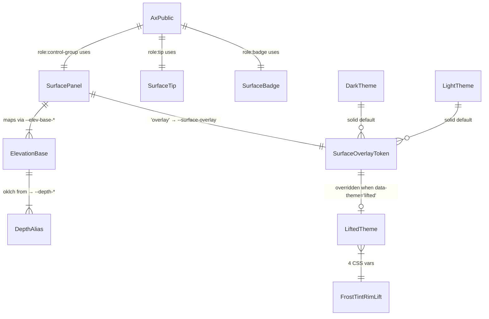
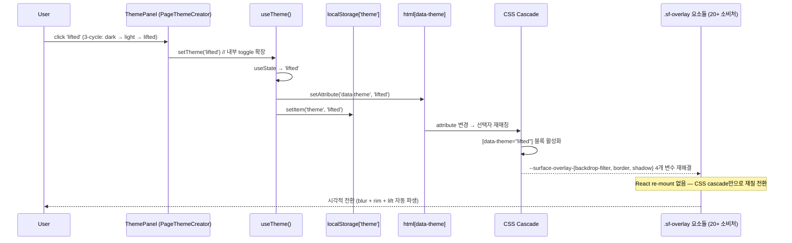
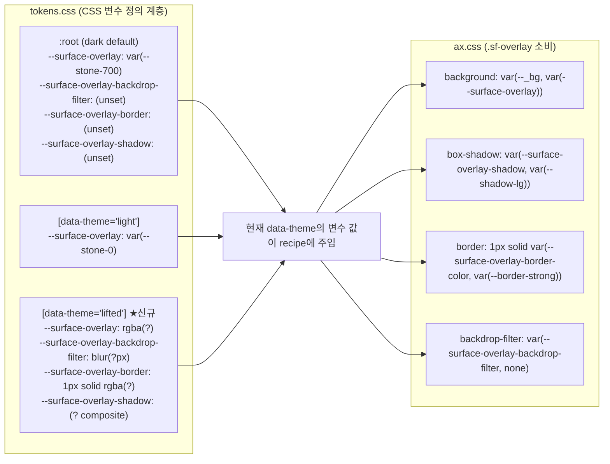
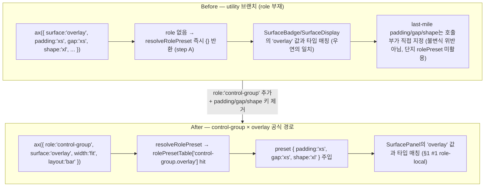
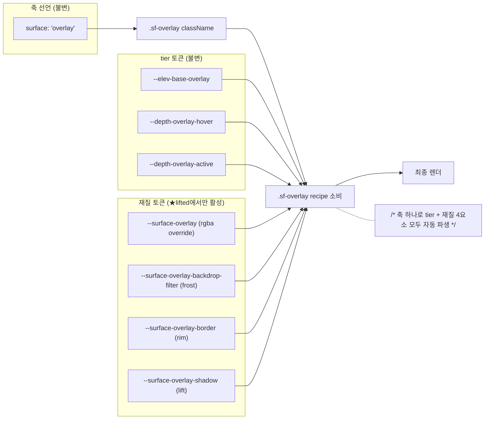

# ax Liquid Glass 흡수 — Blueprint

> **Discussion**: 2026-04-18 /discuss 대화 — ax Liquid Glass 개념 진화. FRT 게이트 6/6 통과. 근거 메모리: `project_ax_liquid_glass_evolution`, `project_depth_ladder`, `feedback_axis_minimum_via_subset_expansion`, `feedback_naming_design_neutral`
> **산출물 유형**: 엔진 (디자인 시스템 축/테마)
> **규모 추정**: 파일 2개 수정, 1개 신규 (테마 분리 시), tokens.css 섹션 추가

## §1 데이터 모델

> 타입·스키마·상태 — 이름·필드·관계·불변식

### 타입 정의

```ts
// src/styles/axPublic.ts — SurfacePanel subset 확장 (3단 → 4단)
//
// Before:
//   type SurfacePanel = 'sunken' | 'base' | 'raised'
//
// After:
type SurfacePanel = 'sunken' | 'base' | 'raised' | 'overlay'

// 재export는 자동 — SurfacePanel이 AxSurface union 구성요소이므로
// AxSurface 선언부는 무변경:
//   export type AxSurface =
//     | SurfaceActionable | SurfaceDisplay | SurfaceRow
//     | SurfaceBadge | SurfaceTip | SurfacePanel

// AxPublic.role:'control-group' 브랜치의 surface 허용치가 자동 확장:
//   surface?: SurfacePanel | 'ghost'
//   → 'sunken' | 'base' | 'raised' | 'overlay' | 'ghost'
//
// 기존 타입 미변경(격리 확인):
//   SurfaceTip       = 'inverted' | 'overlay'                  // role:'tip' 전용
//   SurfaceBadge     = 'display' | 'ghost' | 'overlay' | 'placeholder'  // role:'badge' 전용
//   SurfaceDisplay   = 'display' | 'ghost' | 'overlay' | 'placeholder'  // 미사용/보조
//   SurfaceActionable/SurfaceRow — 불변
//
// AxPublicKey / AX_PUBLIC_KEYS — 불변 (키 집합 변화 없음, 값 domain만 확장)
```

### 테마 토큰 스키마

```css
/* src/styles/tokens.css — data-theme="lifted" 신설
   color 재정의 없음, 재질(material)만 override.
   기존 dark(:root) / [data-theme="light"]와 직교 — 재질은 위에 겹쳐 적용. */

[data-theme="lifted"] {
  /* Liquid Glass 4요소 — --surface-overlay 렌더 공식 교체 */

  /* Frost: 반투명 바탕 뒤 blur */
  --surface-overlay-backdrop-filter: blur(/* px (?) — decided in impl */);

  /* Tint: 반투명 bg (alpha 포함 rgba) */
  --surface-overlay: rgba(/* r g b a (?) — decided in impl */);

  /* Rim: edge border (top-lit gradient 또는 단색 rgba) */
  --surface-overlay-border: 1px solid rgba(/* r g b a (?) — decided in impl */);
  /* (기존 --overlay-edge-top / --overlay-edge-bottom 재사용 여부는 impl에서 결정) */

  /* Lift: box-shadow (기존 --shadow-lg 재사용 또는 override) */
  --surface-overlay-shadow: /* composite shadow (?) — decided in impl */;
}

/* 관계: --surface-overlay 는 아래 기존 토큰 체계와 호환
     --elev-base-overlay   (L1 elevation base)
     --depth-overlay-*     (L2 role alias, hover/active/sel*)
     --selection*          (불변)
   lifted 테마는 --surface-overlay 값만 교체하므로 depth ladder 자동 파생은 유지. */
```

(정확한 blur 픽셀·rgba 알파·shadow 합성값은 구현 단계에서 결정, Blueprint는 구조만 확정)

### 관계도



### 불변식

| # | 불변식 | 반증 조건 |
|---|--------|---------|
| 1 | SurfacePanel 확장은 **role-local** — `role:'control-group'`에서만 'overlay' 허용. SurfaceTip/SurfaceBadge/SurfaceDisplay의 'overlay'는 별개 subset으로 격리 유지 | 타입 에러가 사라져 `role:'tip' + surface: (control-group용 'overlay')` 같은 cross-role 혼용이 허용되면 위반 |
| 2 | **디자인-중립 네이밍** — `glass` · `island` · `frost` · `moat` · `rim` · `lift` · `liquid` 등 미감 지시어는 축 이름과 값 이름에 없음 (테마 이름 `lifted`만 예외적 허용, 축 아님) | axPublic.ts에 미감 지시어가 축/값 리터럴로 출현하면 위반 |
| 3 | **재질은 토큰/테마에만 인코딩** — 축 값(`surface: 'overlay'`)은 구조만 지시. `surface: 'glass-overlay'` 같은 재질 내포 값 금지 | AxSurface union에 재질 지시 리터럴 출현 시 위반 |
| 4 | **`data-theme="lifted"`는 기존 dark/light와 직교** — `--text-*` · `--tone-*` · `--focus*` · `--border-*` · `--selection*` 등 색·상호작용 토큰 불변. `--surface-overlay` 및 파생 재질 토큰 4개(frost/tint/rim/lift)만 override | lifted 테마 블록이 색/텍스트/포커스 계열 토큰을 재정의하면 위반 |
| 5 | **재질 토큰은 CSS 변수로만 선언** — `backdrop-filter` · `box-shadow` · `border` 값은 `.sf-overlay` 등 recipe에서 `var(--surface-overlay-*)`로만 소비. overlay.css/컴포넌트 CSS에 blur/rgba/shadow literal hardcode 없음 | ax recipe나 overlay.css에 `backdrop-filter: blur(12px)` 같은 리터럴 등장 시 위반 |
| 6 | **토큰 계층 연속성** — `--surface-overlay`는 `--elev-base-overlay` 및 `--depth-overlay-*` 와 동일 tier(overlay) 참조. lifted 테마가 `--elev-base-overlay`/`--depth-overlay-*`를 건드리지 않음(재질만, 깊이 수치 불변) | lifted 테마 블록이 `--elev-base-*` 또는 `--depth-*` 를 override하면 위반 |
| 7 | **Public 축 개수 동결** — AxPublicKey 13개 불변(material 축 신설 없음). 확장은 오직 SurfacePanel 값 domain(3→4)에 국한 | AxPublicKey에 `'material'` 등 새 키 추가 시 위반 |

**완성도:** 🟢
**역PRD:** (구현 후 `file::TypeName` 기입)

## §2 파일 맵

> §1 데이터 모델이 고정한 SurfacePanel 확장 + `data-theme="lifted"` 신설을 구현하기 위한 파일 수정/재사용 맵.
> 원칙: **있는 걸로 만든다** — 새 파일 0, 기존 파일 수정만. 모든 변경 지점은 아래 표에 열거되며 여기 없는 경로에 구현이 나타나면 Blueprint 위반.

### 2.1 축 타입 — SSOT 수정

| 경로 | 책임 | 신규/수정 | 재사용 부품 | 역PRD |
|------|------|----------|------------|-------|
| `src/styles/axPublic.ts` | `SurfacePanel` union에 `'overlay'` 추가 (line 66, role-local subset 확장). `AxSurface` / `AxPublic` / `AxPublicKey` / `AX_PUBLIC_KEYS` 무변경 — 값 domain만 확장 (§1 #1, #7) | 수정 | 기존 discriminated union 구조, SurfaceTip/SurfaceBadge subset 격리 패턴 | ⬜ |

### 2.2 cascade preset — `control-group × overlay` 분기

| 경로 | 책임 | 신규/수정 | 재사용 부품 | 역PRD |
|------|------|----------|------------|-------|
| `src/styles/rolePreset.ts` | `rolePresetTable`에 `'control-group.overlay'` entry 추가 (shape/padding/gap 주입). 현재 `control-group`은 silent role이지만 `overlay` 서페이스는 CMS 3곳에서 이미 소비 중 — 기본 프리셋을 명시 seed | 수정 | 기존 `rolePresetTable` cascade 구조, `badge.overlay` entry 패턴(참고) | ⬜ |

### 2.3 토큰 — 재질 4요소 + `[data-theme="lifted"]` 블록

| 경로 | 책임 | 신규/수정 | 재사용 부품 | 역PRD |
|------|------|----------|------------|-------|
| `src/styles/tokens.css` | `[data-theme="light"]` 블록 뒤에 `[data-theme="lifted"]` 블록 신규 추가 (§1 #4, #6). 재질 4요소 토큰 선언: `--surface-overlay-backdrop-filter`, `--surface-overlay` (rgba override), `--surface-overlay-border`, `--surface-overlay-shadow`. `--elev-base-overlay` / `--depth-overlay-*` / 색·텍스트·포커스 토큰 불변 | 수정 | 기존 `[data-theme="light"]` 오버라이드 패턴, `--overlay-edge-top/bottom` 토큰, `--shadow-lg`, `--border-strong` | ⬜ |

### 2.4 surface recipe — 재질 변수 소비

| 경로 | 책임 | 신규/수정 | 재사용 부품 | 역PRD |
|------|------|----------|------------|-------|
| `src/styles/ax.css` | `.sf-overlay` recipe (line 76-86)의 하드코딩된 `box-shadow: var(--shadow-lg)` / `border: 1px solid var(--border-strong)` / `background` 을 재질 토큰 경유로 교체 — `var(--surface-overlay-shadow, var(--shadow-lg))` 등 fallback 체인. 기존 `::after` rim gradient(line 114-135)는 `--overlay-edge-*` 를 `var(--surface-overlay-border, ...)` 대체 검토 (§1 #5) | 수정 | 기존 `.sf-overlay` recipe, `--overlay-edge-top/bottom` gradient, `@layer state` 레이어 | ⬜ |

### 2.5 overlay 컴포넌트 CSS — blur literal 제거

| 경로 | 책임 | 신규/수정 | 재사용 부품 | 역PRD |
|------|------|----------|------------|-------|
| `src/interactive-os/overlay/overlay.css` | `.overlay-modal::backdrop` 의 `backdrop-filter: blur(3px)` (line 8) → `var(--surface-overlay-backdrop-filter, blur(3px))` 대체 (§1 #5). `.overlay-modal` / `.overlay-popup` 본체의 `background: var(--surface-overlay)` + `box-shadow: var(--shadow-lg)` + `border: ... var(--border-subtle)` 은 이미 토큰 기반 — 변경 없음 (lifted 테마에서 토큰만 재정의되면 자동 파생) | 수정 | 기존 modal/popup 구조, `--surface-overlay` / `--shadow-lg` / `--border-subtle` 소비 체인 | ⬜ |

### 2.6 테마 스위처 — lifted 선택 경로

| 경로 | 책임 | 신규/수정 | 재사용 부품 | 역PRD |
|------|------|----------|------------|-------|
| `src/hooks/useTheme.ts` | `type Theme = 'dark' \| 'light'` → `'dark' \| 'light' \| 'lifted'`. `toggle()` 을 2-상태에서 3-상태 cycle로 확장 (또는 `setTheme` 직접 노출). `localStorage` 키 `'theme'` 값 도메인 확장 | 수정 | 기존 `data-theme` attribute 주입 로직, localStorage persist 패턴 | ⬜ |
| `src/pages/theme/PageThemeCreator.tsx` | `ThemePanel` 의 dark/light 2택 버튼을 3택 (또는 Select)으로 확장 — `lifted` 선택 가능. 디자인 스위처 미리보기에서 재질 토큰 4개 표시 (선택) | 수정 | 기존 `useTheme` hook, `ax({ role:'control', surface:'action', ... })` 버튼 | ⬜ |

### 2.7 타겟 앱 — Visual CMS 사용처

> §1 #1 불변식: `role:'control-group' × surface:'overlay'` 조합이 primary target. 현재 CMS 3곳은 `role` 키 부재(utility 브랜치)로 `surface:'overlay'` 만 사용 중 — 타입상 `SurfaceDisplay/SurfaceBadge`의 `'overlay'` 에 매칭되고 있음. `role:'control-group'` 명시로 마이그레이션하여 새 subset 엔트리 검증.

| 경로 | 책임 | 신규/수정 | 재사용 부품 | 역PRD |
|------|------|----------|------------|-------|
| `src/pages/cms/CmsFloatingToolbar.tsx` | `ax({ surface: 'overlay', ... })` → `ax({ role: 'control-group', surface: 'overlay', ... })` — layout/gap/shape는 rolePreset으로 흡수 가능 여부 판정 | 수정 | 기존 `ButtonToolbar` composition, `rolePresetTable['control-group.overlay']` seed | ⬜ |
| `src/pages/cms/CmsViewportBar.tsx` | 동일 — `role:'control-group', surface:'overlay'` 명시 | 수정 | 기존 `layout:'bar'` + `padding:'xs'` 조합 | ⬜ |
| `src/pages/cms/CmsTemplatePicker.tsx` | 동일 — `role:'control-group', surface:'overlay'` 명시. `ListBox` 를 담는 overlay 껍데기 | 수정 | 기존 `ListBox` import 경로 | ⬜ |

### 2.8 회귀 방어 대상 (수정 없음 — 확인용)

> 아래 파일은 `surface:'overlay'` 소비처이나 **이번 스코프에서 수정하지 않는다**. lifted 테마에서 `--surface-overlay` 재정의만으로 자동 파생되어야 함(§1 #5 불변식 검증 대상).

| 경로 | 책임 | 신규/수정 | 재사용 부품 | 역PRD |
|------|------|----------|------------|-------|
| `src/interactive-os/ui/{Popover,Select,Combobox,Drawer,QuickOpen,Composer,Toaster,Kbd,Button,Dialog}.tsx` 외 11개 | `surface:'overlay'` 소비 — 재정의 없이 lifted 테마에서 자동 반영되어야 함 | — | `.sf-overlay` recipe 자동 파생 | ⬜ |
| `src/interactive-os/ui/panels/SubmenuPanel.tsx` | 동일 | — | `.sf-overlay` | ⬜ |
| `src/entities/block/ui/{QuoteBlock,ChartBlock}.tsx` | `role:'control-group'` 기존 사용처 — overlay 아닌 surface | — | — | ⬜ |
| `src/interactive-os/ui/FinderToolbar.css` · `src/pages/replay/replayStages.css` | 자체 `backdrop-filter: blur(...)` literal 보유 — last-mile 판정. lifted 체계에 편입할지 별도 결정 (🟡 후속 스코프 후보) | — (?) | — | ⬜ |

### 2.9 Non-goals (이 PRD가 건드리지 않는 것)

- `axPrivate.ts` — Private 7축 불변. 재질은 토큰/테마에만 인코딩 (§1 #3)
- `ax.ts` — Public→Private resolve 파이프라인 불변 (cs/role/surface 3축 인터페이스 그대로)
- `layers.css` — `@layer` 순서 불변
- `palette.css` — 원시 색 불변
- `rolePresetTable['tip.*']` · `rolePresetTable['badge.overlay']` — 기존 overlay subset 엔트리 불변 (§1 #1 role-local 격리)

---

**반증 조건 (Blueprint ⊃ Implementation):**
- 파일 맵에 없는 경로(예: `axPrivate.ts`, 신규 `material.css`, 신규 `theme/liftedTokens.css`)에 구현이 나타나면 Blueprint 위반
- 새 파일 신설은 위 기존 파일로 수용 불가능함을 증명해야 함
- §2.7 CMS 마이그레이션이 빠지면 §1 #1 primary target 조합이 검증 안 됨
- §2.8 회귀 방어 대상이 lifted 테마에서 시각적으로 갱신되지 않으면 §1 #5 (토큰-only 재질 인코딩) 위반

**신규 파일 수 / 수정 파일 수:** 0 / 9 (+ ?2 자체 blur literal 후속 결정)

**완성도:** 🟢
**역PRD:** (구현 후 실제 생성/수정 파일 + LOC 기입)

## §3 Export 시그니처

> §2 파일 맵이 고정한 9개 수정 파일의 export/타입 시그니처를 Before/After로 명세.
> 대부분은 **값 domain 확장**이므로 새 export는 0개, 수정 시그니처는 3곳(SurfacePanel/Theme/rolePresetTable entry).
> 실제 값(blur px · rgba · shadow 합성)은 `(?)` — Blueprint는 구조만 확정, 구현 단계(D)에서 값 결정.

### 3.1 `src/styles/axPublic.ts` — SurfacePanel subset 확장

```ts
// 책임: Public 타입 SSOT — SurfacePanel subset에 'overlay' 값 추가 (§1 #1, #7)

/**
 * @invariant SurfacePanel은 module-local (unexported) — 외부는 AxSurface union으로만 바라본다.
 *            따라서 "신규 export" 없음. 내부 subset의 값 domain만 3→4로 확장.
 * @invariant 다른 Surface* subset(Tip/Badge/Display/Actionable/Row)은 불변 — role-local 격리 유지.
 * @invariant 'overlay' 리터럴이 SurfacePanel에 출현하는 것은 재질 지시가 아니라 깊이 tier 지시
 *            (frost/tint/rim/lift는 토큰이 담당 — §1 #3)
 */
// Before:
//   type SurfacePanel = 'sunken' | 'base' | 'raised'                      // role: 'control-group'
// After:
type SurfacePanel = 'sunken' | 'base' | 'raised' | 'overlay'              // role: 'control-group'

// 자동 파생 (선언부 변경 없음):
//   export type AxSurface =
//     | SurfaceActionable | SurfaceDisplay | SurfaceRow
//     | SurfaceBadge | SurfaceTip | SurfacePanel
//   → AxSurface union이 'overlay'를 SurfacePanel 경유로도 받아들이게 된다 (이미 다른 subset에 있던 값이라 union 크기는 불변).
//
// 자동 파생 (AxPublic discriminated union):
//   | { role: 'control-group'; surface?: SurfacePanel | 'ghost'; ... }
//   → surface 허용치 { sunken | base | raised | ghost } → + 'overlay'
//
// 불변 (키 집합 동결):
//   export type AxPublicKey = 'cs' | 'role' | 'surface' | ... | 'interactive'  // 13개 불변
//   export const AX_PUBLIC_KEYS = [...] as const                                // 13개 불변
//   (material/glass/frost 등 새 키 추가 없음 — §1 #7)
```

**신규 export: 0개**
**수정 시그니처: 1개** (SurfacePanel module-local type, 값 domain 3→4)

### 3.2 `src/styles/rolePreset.ts` — `control-group.overlay` entry 추가

```ts
// 책임: role × surface cascade — 'control-group.overlay' preset entry 1개 신규 추가 (§2.2)

/**
 * @invariant export 시그니처 불변 — rolePresetTable / resolveRolePreset / textStylePresetTable 그대로.
 * @invariant 신규 entry는 `Partial<AxPrivate>` 값 형태 — padding/gap/shape/border/icon/square/motion subset만.
 * @invariant 'control-group'은 silent role (strictRoles 미포함) — entry 누락 시 throw하지 않지만,
 *            primary target(§1 #1)이므로 명시 seed로 선언해 cascade hit을 보장한다.
 * @invariant 값은 CMS 3곳(CmsFloatingToolbar/CmsViewportBar/CmsTemplatePicker) 현재 ax() 호출의
 *            last-mile(padding/gap/shape)을 흡수 — 마이그레이션 후 pages에서 해당 키 제거 가능.
 */
export const rolePresetTable: Partial<Record<RolePresetKey, Partial<AxPrivate>>> = {
  // ... 기존 entry 불변 ...
  // 'control.action': { ... },
  // 'badge.overlay': { padding: 'xs', shape: 'md' },  // 참고 패턴
  // 'tip.overlay':   { padding: 'xs', shape: 'sm', motion: 'fade-slide-in' },  // 참고 패턴

  // ── control-group.overlay — CMS 플로팅 툴바/픽커 (★신규) ──────
  'control-group.overlay': {
    padding: 'xs',       // (?) CMS 3곳 모두 padding:'xs' 사용 중 — seed로 흡수
    gap: 'xs',           // (?) CmsFloatingToolbar/CmsViewportBar 공통값
    shape: 'xl',         // (?) 3곳 모두 shape:'xl' (pill-like rounded rect) — floating toolbar 관례
    // border/motion은 기본값(@layer 기본)에 위임 — 별도 주입 없음
    // @invariant 'badge.overlay'(shape:'md')와 일관성보다 floating toolbar 관례(xl) 우선 (D단계 재검토 여지)
  },
}

// 불변 (resolveRolePreset 동작):
//   - strictRoles = ['control', 'badge', 'tip'] 불변 — 'control-group'은 silent.
//   - cascade 순서 불변: role → role.surface → role.surface.(interactive|content).
//   - 'control-group.overlay' hit 시 `{ padding:'xs', gap:'xs', shape:'xl' }` Partial<AxPrivate> 반환.
```

**신규 export: 0개**
**수정 시그니처: 1개** (rolePresetTable value, 새 entry 1개 추가)

### 3.3 `src/styles/tokens.css` — CSS 변수 (export 없음)

```css
/* 책임: data-theme="lifted" 블록 신규 — 재질 4요소 CSS 변수 오버라이드 (§1 #4, #6)
 * 신규 추가되는 CSS 변수는 lifted scope 내부에서만 유효.
 * :root (dark) 및 [data-theme="light"] 블록의 변수 목록은 불변.
 * --elev-base-*, --depth-*, --text-*, --tone-*, --focus*, --border-*, --selection* 모두 불변.
 */
[data-theme="lifted"] {
  /* ──1) Frost — 반투명 뒤 blur ─────────── */
  --surface-overlay-backdrop-filter: blur(/* (?) px */);

  /* ──2) Tint — rgba 반투명 bg (--surface-overlay 재활용: lifted에서만 rgba로 override) ── */
  --surface-overlay: rgba(/* (?) r g b a */);

  /* ──3) Rim — edge border (단색 rgba 또는 top-lit gradient, impl 결정) ── */
  --surface-overlay-border: 1px solid rgba(/* (?) r g b a */);

  /* ──4) Lift — box-shadow composite ─────── */
  --surface-overlay-shadow: /* (?) composite shadow */;
}
```

**신규 CSS 변수 (4개):**
- `--surface-overlay-backdrop-filter` — frost(blur 합성값)
- `--surface-overlay` — **기존 변수 재활용** (dark/light는 solid, lifted에서 rgba로 override)
- `--surface-overlay-border` — rim(edge 윤곽선)
- `--surface-overlay-shadow` — lift(box-shadow 상승감)

(`--surface-overlay`는 기존 토큰 이름을 재활용하므로 "신규 이름"은 실질적으로 3개. §1 #5 "재질 토큰은 CSS 변수로만 선언" 준수)

**불변 CSS 변수 (언급하지 않음 = 변경 없음):**
- `--elev-base-overlay` / `--depth-overlay-*` — 깊이 ladder 유지 (§1 #6)
- `--text-*` / `--tone-*` / `--focus*` / `--border-*` / `--selection*` — 색/상호작용 토큰 전부 불변 (§1 #4)

### 3.4 `src/hooks/useTheme.ts` — Theme union 확장

```ts
// 책임: 테마 상태 hook — Theme union에 'lifted' 추가 (§2.6)

/**
 * @invariant 내부 state/localStorage key 모두 'theme' 불변.
 * @invariant document.documentElement.setAttribute('data-theme', theme) 주입 경로 불변 — 값만 확장.
 * @invariant useTheme 반환 shape { theme, toggle } 구조 불변 — 다만 toggle은 2-상태 cycle에서
 *            3-상태 cycle로 확장 (또는 setTheme 직접 노출은 D단계 결정).
 */
// Before:
//   type Theme = 'dark' | 'light'
// After:
type Theme = 'dark' | 'light' | 'lifted'

// 시그니처 (export 형태 불변):
export function useTheme(): { theme: Theme; toggle: () => void }

// toggle 동작 변경:
// Before: dark ↔ light (2-상태 토글)
// After:  dark → light → lifted → dark (3-상태 cycle)
//         (대안: 내부 toggle 제거, setTheme 노출 — D단계에서 UI가 결정. Blueprint는 "3-상태 도달 가능"만 보장)

// localStorage 값 domain:
// Before: 'dark' | 'light'
// After:  'dark' | 'light' | 'lifted'
// 파싱 로직: stored === 'light' ? 'light' : stored === 'lifted' ? 'lifted' : 'dark' (default)
```

**신규 export: 0개**
**수정 시그니처: 1개** (Theme union, 값 domain 2→3)

### 3.5 `src/pages/theme/PageThemeCreator.tsx` — 테마 선택 UI

```tsx
// 책임: ThemePanel 컴포넌트 — 테마 선택 버튼 옵션 확장 (§2.6)

/**
 * @invariant export 시그니처 불변 — default export PageThemeCreator 그대로.
 * @invariant ThemePanel은 내부 함수 (export 아님) — 시그니처 변경 대상 아님.
 * @invariant ax() 호출 자체는 utility 브랜치(role 부재) 유지 — 이 파일에서는
 *            'control-group' 마이그레이션 대상 아님 (스위처는 utility + control 조합).
 */

// 변경 지점: ThemePanel 내부 <button>
// Before: 2-상태 토글 버튼 1개 (Moon/Sun 아이콘 + Dark/Light 라벨)
// After:  3-상태 선택 (토글 버튼 3 cycle 또는 segmented control — D단계 UX 결정)
//         lifted 상태 시 label/icon 추가 (예: Sparkles 또는 Layers 아이콘)

// export 시그니처 변경 없음.
```

**신규 export: 0개** / **수정 export: 0개** (내부 렌더링만 변경)

### 3.6 `src/styles/ax.css` — surface recipe 재질 변수 경유 (export 없음)

```css
/* 책임: .sf-overlay recipe — 토큰 경유로 재질 4요소 소비 (§2.4, §1 #5)
 * CSS 파일이므로 export 없음.
 * 변경은 'backdrop-filter'/'box-shadow'/'border' literal을 var(--surface-overlay-*) 경유로 교체.
 * 선택자(.sf-overlay, ::after) 및 @layer 위치 모두 불변.
 */

/* 변경 대상 속성 (fallback 체인 형태로 dark/light에서도 기존 값 유지):
 *   box-shadow: var(--surface-overlay-shadow, var(--shadow-lg));
 *   border:     1px solid var(--surface-overlay-border-color, var(--border-strong));  // 또는 var(--surface-overlay-border) 직접 소비
 *   (background는 이미 var(--surface-overlay) 소비 — 변경 없음)
 *   ::after gradient는 var(--surface-overlay-border)로 대체 검토 (D단계 결정)
 */
```

**신규 export: 0개** (CSS)

### 3.7 `src/interactive-os/overlay/overlay.css` — backdrop-filter 토큰 경유 (export 없음)

```css
/* 책임: .overlay-modal::backdrop — hardcoded blur를 토큰 경유로 교체 (§2.5, §1 #5)
 *
 * Before:
 *   .overlay-modal::backdrop { backdrop-filter: blur(3px); }
 * After:
 *   .overlay-modal::backdrop { backdrop-filter: var(--surface-overlay-backdrop-filter, blur(3px)); }
 *
 * .overlay-modal/.overlay-popup 본체(background/border/box-shadow)는 이미 토큰 기반 —
 * tokens.css의 --surface-overlay만 재정의되면 자동 파생. 변경 불필요.
 */
```

**신규 export: 0개** (CSS)

### 3.8 CMS primary target 마이그레이션 (§2.7) — role 명시 추가

```tsx
// src/pages/cms/CmsFloatingToolbar.tsx
// 책임: floating toolbar — role:'control-group' 명시 추가 (§2.7, §1 #1)

/**
 * @invariant 컴포넌트 export 시그니처 불변 (props 변경 없음).
 * @invariant 기능/DOM 구조/className 외 속성 모두 불변.
 */

// Before (line 123):
//   ax({ surface: 'overlay', width: 'fit', layout: 'bar', padding: 'xs', gap: 'xs', shape: 'xl' })
//   → SurfaceBadge/SurfaceDisplay의 'overlay'에 매칭 (utility 브랜치, role 부재)
// After:
//   ax({ role: 'control-group', surface: 'overlay', width: 'fit', layout: 'bar' })
//   → SurfacePanel의 'overlay'에 매칭, padding/gap/shape는 rolePresetTable['control-group.overlay']에서 주입

// ─────────────────────────────────────────────
// src/pages/cms/CmsViewportBar.tsx
// Before (line 18):
//   ax({ surface: 'overlay', layout: 'bar', width: 'fit', padding: 'xs', gap: 'xs', shape: 'xl' })
// After:
//   ax({ role: 'control-group', surface: 'overlay', layout: 'bar', width: 'fit' })

// ─────────────────────────────────────────────
// src/pages/cms/CmsTemplatePicker.tsx
// Before (line 34):
//   ax({ surface: 'overlay', width: 'full', padding: 'xs', shape: 'xl' })
// After:
//   ax({ role: 'control-group', surface: 'overlay', width: 'full' })
//   // gap 키는 원래 없었음 — preset gap:'xs'가 자동 주입되지만 내부에 ListBox 단독이라 무영향.
```

**신규 export: 0개** / **수정 export: 0개** (3 파일 모두 props/컴포넌트 shape 불변, ax() 인자만 수정)

### 3.9 요약 — Export 변화량

| 범주 | 개수 |
|------|------|
| 신규 export | **0** |
| 수정 export 시그니처 | **0** (외부에서 본 모든 export의 타입 이름·모양 불변 — 값 domain만 확장) |
| 타입 값 domain 확장 | **2** (`SurfacePanel` 3→4, `Theme` 2→3) |
| 신규 table entry | **1** (`rolePresetTable['control-group.overlay']`) |
| 신규 CSS 변수 이름 | **3** (`*-backdrop-filter`, `*-border`, `*-shadow`; `--surface-overlay`는 재활용) |
| 수정 CSS 파일 | **2** (`ax.css` `.sf-overlay`, `overlay.css` `::backdrop`) |

### 반증 조건

- §3에 없는 새 export (예: `export type MaterialAxis`, `export const liftedTheme`)가 구현에 등장하면 위반
- §3 시그니처와 다른 타입으로 구현되면 위반 (예: `SurfacePanel`에 `'glass-overlay'` 같은 재질 지시 리터럴 등장 — §1 #3 위반)
- `AxPublicKey` 리스트 길이가 14 이상이 되면 위반 (material 등 신규 축 신설 금지 — §1 #7)
- `rolePresetTable`에 `'control-group.overlay'` 외 다른 `control-group.*` 신규 entry가 스코프 바깥으로 등장하면 위반 (§2.9 non-goals)
- `[data-theme="lifted"]` 블록이 `--elev-base-*` · `--depth-*` · `--text-*` · `--tone-*` · `--focus*` · `--border-*` · `--selection*` 중 하나라도 재정의하면 위반 (§1 #4, #6)
- CMS 3 파일에서 `role: 'control-group'` 없이 `surface: 'overlay'`만 남으면 위반 (§2.7 primary target 마이그레이션 미수행)

**완성도:** 🟢
**역PRD:** (구현 후 `file::exportName` 실제 위치 기입)

## §4 흐름

> §1~§3 정적 구조가 런타임에 어떻게 결합되는가. 축 선언 한 번 → rolePreset lookup → className 합성 → CSS cascade → 재질 파생까지의 단일 경로.

### 4.1 핵심 control flow — `ax()` 호출부터 픽셀까지

```mermaid
flowchart TD
  A["ax({ role:'control-group', surface:'overlay', width:'fit', layout:'bar' })"]
  A --> B["step 1: Private 키 오염 검사 (불변)"]
  B --> C["step 2: resolveRolePreset({ role, surface, content, interactive })"]
  C --> D{"rolePresetTable lookup\ncascade: role → role.surface → role.surface.(content|interactive)"}
  D -->|★신규 hit| E["rolePresetTable['control-group.overlay']\n{ padding:'xs', gap:'xs', shape:'xl' } 주입"]
  D -->|miss (silent role)| E2["{} 반환 (control-group은 strictRoles 아님)"]
  E --> F["step 3: textStylePreset merge (불변, 현재 전 엔트리 {})"]
  E2 --> F
  F --> G["step 4: merge 순서\ntextPreset → rolePreset → input(Public 명시)"]
  G --> H["step 5: prefix 변환 후 className 합성"]
  H --> I["'rl-control-group sf-overlay w-fit ly-bar pd-xs g-xs sh-xl'"]
  I --> J[브라우저 DOM: className 적용]
  J --> K[".sf-overlay recipe 매칭 (ax.css)"]
  K --> L{{"CSS variable 해결\nbackground: var(--surface-overlay)\nbox-shadow: var(--surface-overlay-shadow, var(--shadow-lg))\nborder: 1px solid var(--surface-overlay-border, var(--border-strong))\nbackdrop-filter: var(--surface-overlay-backdrop-filter, none)"}}
  L --> M1["data-theme=dark (:root)\n→ solid stone-700, no blur\n(신규 3 변수는 unset → fallback)"]
  L --> M2["data-theme=light\n→ solid stone-0, no blur\n(신규 3 변수는 unset → fallback)"]
  L --> M3["data-theme=lifted ★신규\n→ rgba tint + blur frost\n+ rim border + composite lift"]
  M1 --> R[최종 픽셀]
  M2 --> R
  M3 --> R
```

### 4.2 테마 전환 sequence — React 재렌더 없는 CSS cascade 재평가



### 4.3 cascade 해결 순서 — CSS variable 우선순위



### 4.4 마이그레이션 흐름 — CMS 3개 컴포넌트 분기 전환



### 4.5 주요 로직 pseudo-code

```ts
// src/styles/ax.ts — cascade (기존 로직 불변, 문서화만)
function ax(axes: AxPublic): string {
  // step 1: Private 키 오염 검사 (Phase 1-a G-5 warn, Bundle E 이후 throw)
  // step 2: resolveRolePreset({ role, surface, content, interactive })
  //   └─ 신규: 'control-group.overlay' 키 hit 경로 추가
  //      (기존: control-group은 silent → {} 반환이 기본)
  // step 3: resolveTextStylePreset (불변, 전 엔트리 {})
  // step 4: merge { ...textPreset, ...rolePreset, ...input }
  //   └─ Public 명시가 가장 우선 — 호출부가 padding 직접 주면 preset override
  // step 5: prefix 변환 + className 공백 join
  return className
}

// src/styles/rolePreset.ts — rolePresetTable 확장 (1 entry 추가)
// Before:
//   const rolePresetTable = { 'control.action': {...}, 'badge.overlay': {...}, 'tip.overlay': {...}, ... }
// After (신규 entry 1개만 추가):
//   rolePresetTable['control-group.overlay'] = {
//     padding: 'xs',  // CMS 3곳 실측
//     gap:     'xs',  // CmsFloatingToolbar/CmsViewportBar 공통
//     shape:   'xl',  // floating toolbar 관례 (pill-like rounded rect)
//   }
// resolveRolePreset 동작 불변:
//   - 'control-group'은 strictRoles 미포함 → miss 시 throw 없음 (silent {})
//   - 'control-group.overlay' 명시 hit → preset 주입

// src/hooks/useTheme.ts — Theme union 확장 + 3-cycle
// Before:
//   type Theme = 'dark' | 'light'
//   toggle = () => setTheme(t => t === 'dark' ? 'light' : 'dark')
// After:
//   type Theme = 'dark' | 'light' | 'lifted'
//   toggle = () => setTheme(t =>
//     t === 'dark'  ? 'light'  :
//     t === 'light' ? 'lifted' : 'dark'
//   )
//   // localStorage parse도 'lifted' 분기 추가
//   // setAttribute('data-theme', theme) 주입 경로 불변
```

### 4.6 재질 4요소의 런타임 해결 공식



### 4.7 반증 조건 (흐름 동적 동작)

- **C1 흐름도 외 경로 금지**: 위 4.1~4.4에 없는 cascade 경로(예: `composePreset()` 신규 함수, ax.ts 내부 hardcoded branch)가 구현에 등장하면 위반
- **C2 recipe literal 금지**: `.sf-overlay` recipe가 `var(--surface-overlay-*)` 외 literal(`blur(12px)`, `rgba(...)` 직접값)을 소비하면 §1 #5 위반 (흐름 측면: 재질이 토큰 경유 파생이 아닌 recipe 직결로 들어감)
- **C3 테마 전환은 CSS cascade만**: 'lifted' 전환이 React re-mount / useLayoutEffect 재실행 / DOM 재생성을 트리거하면 위반 (4.2 sequence의 "no re-mount" 계약 위반)
- **C4 cascade 순서 역전 금지**: `input(Public 명시) → rolePreset → textPreset` 역순 merge가 되면 ax.ts step 4 불변식 위반 — 호출부 Public 지정이 preset을 덮을 수 없게 되어 마이그레이션 시 last-mile 충돌
- **C5 role-less utility 브랜치 보호**: `role` 없이 `surface:'overlay'`만 지정된 1,701 호출이 resolveRolePreset에서 throw/warn 트리거하면 위반 (early return `{}` 불변)
- **C6 'control-group' strict 승격 금지**: 'control-group'이 `strictRoles`에 추가되어 miss 시 throw로 바뀌면 silent role 계약(§2.2) 위반
- **C7 재질 토큰 tier 누수 금지**: `[data-theme="lifted"]` 블록이 `--elev-base-overlay` / `--depth-overlay-*` 를 건드리면 tier 토큰과 재질 토큰의 책임 경계가 무너짐 (§1 #6의 동적 표현)
- **C8 fallback 체인 단절 금지**: `.sf-overlay` recipe가 `var(--surface-overlay-shadow, var(--shadow-lg))` 형태 fallback 없이 `var(--surface-overlay-shadow)`만 쓰면 dark/light 테마에서 shadow 소실 → 시각 회귀

**완성도:** 🟢
**역PRD:** (구현 후 실제 cascade 경로 + 변경 LOC 요약 기입)

## §5 경계

> Discussion ⑫ 부작용 심문 결과를 극단 조건 표로 명세. "보통 쓰이는 경우"는 §4가 커버 — 여기서는 lifted 테마가 깨질 수 있는 극단만 다룬다. 각 행은 반증 조건을 포함하여 검증 시 위반 판정 기준이 된다.

| # | 극단 조건 | 기대 동작 | 반증 조건 | 역PRD |
|---|----------|---------|---------|-------|
| 1 | 브라우저가 `backdrop-filter` 미지원 (구 Firefox, 일부 in-app WebView) | `@supports (backdrop-filter: blur(1px))` 가드로 frost 생략 → `--surface-overlay` rgba + rim border + shadow만 렌더. 불투명도는 readable 수준까지 fallback rgba 조정(또는 solid로 완전 대체) | 비지원 환경에서 `.sf-overlay` 배경이 속 비치거나(투명 누출) 반대로 빈 배경으로 깨지면 위반 | ⬜ |
| 2 | OS `prefers-reduced-transparency: reduce` (접근성 설정) | 미디어 쿼리 감지 시 lifted여도 frost 생략, `--surface-overlay`를 solid `--stone-*`로 대체. rim/lift는 유지 가능 | 시스템 설정이 reduce인데 blur가 여전히 적용되어 배경이 비치면 위반 (접근성 위반) | ⬜ |
| 3 | 기존 `surface:'overlay'` 소비처 중 `role` 키 없는 케이스 (§2.8 회귀 방어 대상 — Popover/Select/Drawer 등 20+ 컴포넌트) | 재정의 없이 lifted 테마에서 자동 반영. dark/light 테마 시각은 이전과 동일 (§1 #5 토큰-only 파생) | 마이그레이션 안 한 컴포넌트의 dark/light 스크린샷이 이전 대비 1% 이상 달라지면 위반 | ⬜ |
| 4 | 시스템 경고/위험 modal이 lifted 테마에서 glass 렌더 — 내부 콘텐츠 텍스트 가독성 | `.sf-overlay` 본체는 glass여도 내부 `--text-primary`/`--text-secondary` 대비 WCAG AA(4.5:1) 유지. 필요 시 rgba tint alpha를 0.85+로 유지해 대비 확보 | `measureTextContrast.mjs`로 측정한 대비가 4.5:1 미달이면 위반 | ⬜ |
| 5 | Tooltip (`role:'tip', surface:'overlay'`)이 lifted 테마에서 어떻게 렌더되는가 | `rolePresetTable['tip.overlay']` 경로가 glass가 아닌 기존 solid tip chrome 유지. `control-group.overlay`와 분기됨 (§1 #1 role-local 격리) | Tooltip className이 `rl-tip sf-overlay`가 아니라 `rl-control-group` 등으로 매칭되거나, lifted에서 tip이 frost되면 위반 | ⬜ |
| 6 | lifted 테마에서 `.sf-overlay` 내부 아이템의 hover/active/selection 상호작용 | `--depth-overlay-hover/active/sel*` 변수 자동 파생 유지 — frost가 적용된 채로 깊이 상태 색상 변화 시각 관찰 가능 | lifted 테마에서 hover/active 시 bg 변화가 보이지 않거나(깊이 체계 소실), 상태 토큰이 override되면 위반 (§1 #6) | ⬜ |
| 7 | iframe / nested popover 내부에서 backdrop-filter 중첩 | iframe 경계 존중 — 각 레이어 독립 blur. 중첩 popover는 스택된 상태에서도 각자의 rgba + blur로 합성되며, 합산 과도 흐려짐 없음 | 중첩 blur가 합산되어 내용이 식별 불가 수준으로 흐려지거나, iframe 경계 밖 콘텐츠가 비치면 위반 | ⬜ |
| 8 | 저사양 모바일 (Android mid-range, 구형 iPad) 스크롤 중 lifted `.sf-overlay` 다수 렌더 | 60fps 목표, 최소 50fps 유지. 미달 시 `prefers-reduced-transparency` 폴백 또는 `@supports` 가드로 solid 대체 | Puppeteer CPU throttle 4x 환경에서 스크롤 fps 30 이하 지속되면 위반 | ⬜ |
| 9 | lifted 테마에서 `--surface-overlay`가 rgba인데 `--elev-base-overlay`는 solid stone — `oklch(from ...)` 파생 | `--depth-overlay-*` 5개는 `--elev-base-overlay` (solid) 기반으로 파생되어 있고 lifted에서 불변 (§1 #6) — 재질 rgba와 독립 | `[data-theme="lifted"]` 블록이 `--elev-base-overlay` 또는 `--depth-overlay-*`를 건드리면 위반 | ⬜ |
| 10 | 축 공개 표면 freeze — lifted 도입이 `AxPublicKey` 추가로 이어지지 않았는가 | `AX_PUBLIC_KEYS.length === 13` 불변. 재질은 테마 토큰에만 인코딩 (§1 #7) | 런타임/타입 레벨에서 `AxPublicKey`에 `'material'`·`'glass'` 등 신규 키 출현 시 위반 | ⬜ |

**반증 조건 (공통):**
- 위 10개 경계 중 하나라도 §6 검증 시나리오로 매핑되지 않으면 Blueprint 불완전
- §1 불변식 7개 중 하나가 경계로 drill-down되지 않으면 Blueprint 불완전

**완성도:** 🟢
**역PRD:** (구현 후 실제 검증 결과/위반 여부 기입)

## §6 검증

> §5의 10개 경계를 실행 가능한 검증 시나리오로 매핑. 추가로 §1 불변식 7개를 타입/정적 스캔 레벨에서 방어하는 시나리오를 포함.
> 도구: **vitest** (타입/유닛/cascade 계산), **screenshot.mjs / screenshotScenario.mjs** (DOM 시각 회귀), **scanOsViolations.mjs** (정적 안티패턴), **measureTextContrast.mjs / measureSurfacePairs.mjs** (대비 측정), **checkTokens.mjs** (토큰 cascade), **수동** (저사양 기기 / 중첩 iframe).

### 6.1 §5 경계 → 시나리오 매핑

| # | 출처 | Given / When / Then | 예상 결과 | 도구 | 역PRD |
|---|------|---------------------|---------|------|-------|
| 1 | §5.1 | Given `backdrop-filter` 비지원 UA (시뮬: `@supports not (backdrop-filter)` 강제), When `data-theme='lifted'` 세팅 + `.sf-overlay` 렌더, Then 실제 backdrop-filter 적용되지 않고 solid `--surface-overlay` fallback + shadow 렌더 | visual diff < 1%, backdrop-filter computed style = 'none' | screenshotScenario.mjs + computed style assertion (vitest + jsdom 한계 있음 → Puppeteer) | ⬜ |
| 2 | §5.2 | Given Puppeteer `page.emulateMediaFeatures([{name: 'prefers-reduced-transparency', value: 'reduce'}])`, When lifted 테마, Then `.sf-overlay` computed backdrop-filter = 'none', background = solid | pass | screenshotScenario.mjs 확장 (media feature emulation) | ⬜ |
| 3 | §5.3 | Given §2.8 회귀 방어 대상 20+ 컴포넌트 demo 라우트, When `data-theme='dark'` / `'light'` (lifted 아님), Then 스크린샷 이전 baseline과 pixel diff < 1% | pass | `saveBaseline.mjs` + `compareToBaseline.mjs` | ⬜ |
| 4 | §5.4 | Given `data-theme='lifted'` + `.sf-overlay` 내부에 `--text-primary` / `--text-secondary` 텍스트, When 렌더, Then 텍스트/배경 대비 ≥ 4.5:1 | AA pass | `measureTextContrast.mjs` 확장 (lifted 테마 시나리오 추가) | ⬜ |
| 5 | §5.5 | Given `ax({ role:'tip', surface:'overlay' })` 호출, When `data-theme='lifted'`, Then className은 `rl-tip sf-overlay` (not `rl-control-group`), rolePresetTable['tip.overlay'] 반환 | pass — cascade hit 분리 | vitest: rolePreset unit test (`src/styles/rolePreset.test.ts` 신설 — `ax()` 호출 결과 assertion) | ⬜ |
| 6 | §5.6 | Given `.sf-overlay` 내부 interactive item in lifted, When hover 인터랙션, Then computed background color 변화 감지 (--depth-overlay-hover 적용) | visible color shift (ΔE > threshold) | screenshotScenario.mjs + hover interaction 시퀀스 | ⬜ |
| 7 | §5.7 | Given Popover-in-Popover (중첩) in lifted, When 렌더, Then 각 레이어 독립 blur — 시각 검증 | 수동 판단 (2차 blur 합산 없음) | 수동 / 중첩 데모 라우트 스크린샷 | ⬜ |
| 8 | §5.8 | Given Puppeteer CPU throttle 4x + lifted 테마 페이지에 .sf-overlay 5+ 배치, When 스크롤, Then average fps ≥ 50 | perf trace pass | screenshot.mjs 확장 (performance trace 수집) + 수동 저사양 기기 교차 검증 | ⬜ |
| 9 | §5.9 | Given `data-theme='lifted'` 활성, When DOM에서 `getComputedStyle(root).getPropertyValue('--elev-base-overlay')` 읽기, Then dark/light 때와 동일 값 (lifted override 없음) | pass | vitest + jsdom 또는 Puppeteer `evaluate` | ⬜ |
| 10 | §5.10 | Given `AX_PUBLIC_KEYS`, When 길이 측정, Then `length === 13` | pass | vitest assertion (`src/styles/axPublic.test.ts` 신설 또는 기존 테스트 확장) | ⬜ |

### 6.2 §1 불변식 → 정적 검증 매핑

> §5가 "실행 시 극단"이라면, 여기는 "구조 위반" — 타입/스캔/lint 레벨에서 진입 자체를 차단.

| # | 출처 | Given / When / Then | 예상 결과 | 도구 | 역PRD |
|---|------|---------------------|---------|------|-------|
| 11 | §1 #1 (role-local 격리) | Given TS 컴파일, When `ax({ role:'tip', surface:'overlay' as SurfacePanel })` 같은 cross-role 타입 변조 시도, Then 타입 에러 | compile fail | `tsc --noEmit` 또는 `expectTypeOf` in vitest | ⬜ |
| 12 | §1 #2 (디자인-중립 네이밍) | Given `src/styles/axPublic.ts` 소스, When `glass`/`island`/`frost`/`moat`/`rim`/`lift`/`liquid` 문자열 검색, Then 축/값 리터럴에 출현 0건 (테마 이름 'lifted'만 허용) | grep 0 hit (테마 이름 예외 제외) | scanOsViolations.mjs 확장 (디자인 중립 네이밍 룰) | ⬜ |
| 13 | §1 #3 (재질은 토큰에만) | Given AxSurface union, When 리터럴에 재질 지시어 (`'glass-overlay'` 등) 검색, Then 0 hit | compile fail + scan fail | vitest 타입 assertion + scanOsViolations | ⬜ |
| 14 | §1 #4 (테마 직교) | Given `src/styles/tokens.css`의 `[data-theme="lifted"]` 블록, When 내부에 `--text-*` / `--tone-*` / `--focus*` / `--border-*` / `--selection*` 토큰 정의 탐지, Then 0 hit | lint fail | `checkTokens.mjs` 확장 또는 custom stylelint plugin | ⬜ |
| 15 | §1 #5 (재질 토큰 CSS 변수로만) | Given `src/styles/ax.css` `.sf-overlay` recipe + `src/interactive-os/overlay/overlay.css`, When `blur(숫자px)` / `rgba(숫자,...)` / `box-shadow: 숫자...` literal 탐지 (var() 밖), Then 0 hit | scan fail | scanOsViolations.mjs 확장 (literal material 룰) | ⬜ |
| 16 | §1 #6 (tier vs 재질 분리) | Given `[data-theme="lifted"]` 블록, When `--elev-base-*` 또는 `--depth-*` 토큰 재정의 탐지, Then 0 hit | lint fail | `checkTokens.mjs` 확장 | ⬜ |
| 17 | §1 #7 (Public 축 동결) | Given `AX_PUBLIC_KEYS`, When 길이 및 원소 집합 assertion, Then `length === 13` + 원소 set 불변 | pass | vitest assertion (6.1 #10과 동일 — 중복 허용) | ⬜ |

### 6.3 §4 흐름 동적 동작 검증 (C1~C8)

| # | 출처 | Given / When / Then | 예상 결과 | 도구 | 역PRD |
|---|------|---------------------|---------|------|-------|
| 18 | §4 C2 | Given `.sf-overlay` recipe 소스, When `backdrop-filter` / `box-shadow` / `background` 속성값에 literal(non-var) 등장, Then 0 hit | scan fail | scanOsViolations.mjs (룰 공유 — #15와 중첩) | ⬜ |
| 19 | §4 C3 (테마 전환 CSS cascade only) | Given lifted 전환 sequence, When React DevTools profiler 측정, Then `.sf-overlay` 소비 컴포넌트 re-mount count = 0 | pass | 수동 (React DevTools) 또는 vitest + React Testing Library `rerender` 카운트 | ⬜ |
| 20 | §4 C4 (merge 순서) | Given `ax({ role:'control-group', surface:'overlay', padding:'lg' })` (Public 명시 padding), When className 합성, Then `pd-lg` (preset 'xs' 덮어씀) | pass | vitest unit test (merge 순서 assertion) | ⬜ |
| 21 | §4 C5 (utility 브랜치 보호) | Given `ax({ surface:'overlay' })` (role 부재), When resolveRolePreset 호출, Then throw 없음, `{}` 반환 | pass | vitest unit test | ⬜ |
| 22 | §4 C6 (control-group silent) | Given `strictRoles` 배열, When 'control-group' 포함 검사, Then `strictRoles.includes('control-group') === false` | pass | vitest unit test | ⬜ |
| 23 | §4 C8 (fallback 체인) | Given `.sf-overlay` recipe 소스, When `var(--surface-overlay-shadow, ...)` / `var(--surface-overlay-border, ...)` 등 fallback 존재 확인, Then 모든 신규 재질 변수에 fallback 있음 | scan pass | scanOsViolations.mjs 확장 또는 정규식 grep | ⬜ |

### 6.4 CMS primary target 검증 (§2.7)

| # | 출처 | Given / When / Then | 예상 결과 | 도구 | 역PRD |
|---|------|---------------------|---------|------|-------|
| 24 | §2.7 | Given CMS 3 파일 (CmsFloatingToolbar / CmsViewportBar / CmsTemplatePicker), When ax() 호출 소스 분석, Then 3곳 모두 `role:'control-group'` 명시 존재 + padding/gap/shape Public 키 제거됨 | grep pass | vitest + 소스 파싱 또는 수동 code review | ⬜ |
| 25 | §2.7 + §5.4 | Given CMS 3 페이지, When `data-theme='lifted'` + 스크린샷, Then glass 효과 visible + 기능 회귀 없음 | visual check + CMS E2E smoke | screenshotScenario.mjs + `smokeTestPuppeteer.mjs` | ⬜ |

### 6.5 반증 조건

- §5 경계 10개 중 하나라도 §6.1에서 매핑이 빠지면 Blueprint 불완전
- §1 불변식 7개 중 하나라도 §6.2 정적 검증에 걸리지 않으면 Blueprint 불완전
- §4 C1~C8 동적 불변 중 하나라도 §6.3에서 검증 경로가 없으면 Blueprint 불완전 (C1은 §6.2 스캔으로 자동 커버, C7은 §6.1 #9로 커버)
- 신규 vitest 파일(`rolePreset.test.ts`, `axPublic.test.ts`)이 구현 단계에 생기지 않으면 Blueprint ⊃ Implementation 위반
- scanOsViolations.mjs 확장 룰(디자인 중립 네이밍, material literal, fallback 체인)이 실제로 추가되지 않으면 §1 #2/#5 방어 실패

### 6.6 검증 도구 요약

| 도구 | 경로 | 용도 | 확장 필요 여부 |
|------|------|------|---------------|
| vitest | `pnpm test` | 타입·cascade·merge 순서·unit | 신규 `axPublic.test.ts`, `rolePreset.test.ts` (+ 기존 확장) |
| screenshotScenario.mjs | `scripts/screenshotScenario.mjs` | 테마 전환·media emulation·hover | 시나리오 추가 (lifted · reduced-transparency · @supports not) |
| scanOsViolations.mjs | `scripts/scanOsViolations.mjs` | 정적 안티패턴 | 룰 3종 확장 (네이밍 중립 · material literal · fallback 체인) |
| measureTextContrast.mjs | `scripts/measureTextContrast.mjs` | WCAG AA 대비 | lifted 시나리오 추가 |
| measureSurfacePairs.mjs | `scripts/measureSurfacePairs.mjs` | surface 간 대비 | lifted surface-overlay pair 추가 |
| checkTokens.mjs | `scripts/checkTokens.mjs` | 토큰 cascade/무결성 | lifted 블록 스코프 룰 추가 (§1 #4, #6) |
| saveBaseline.mjs / compareToBaseline.mjs | `scripts/` | 시각 회귀 | dark/light baseline 재고정 후 lifted 추가 비교 |
| smokeTestPuppeteer.mjs | `scripts/smokeTestPuppeteer.mjs` | E2E smoke | lifted 테마 시나리오 추가 |
| 수동 검증 | — | 저사양 기기 fps · iframe 중첩 blur · React re-mount | 기기 교차 테스트 1회 |

**완성도:** 🟢
**역PRD:** (구현 후 `file::testName` 실제 위치 + 측정값 기입)

## §7 역PRD 체크리스트

> `/go`·`/handoff`·`/area`가 구현 후 채움. **Blueprint ⊃ Implementation** 검증용.
> 각 ⬜는 구현 완료 시 ✅/❌로 전환 + "실제 위치"·"LOC"·"비고"를 기입.

### 7.1 데이터 (§1)

| Blueprint 타입 | 실제 위치 | 일치 | 비고 |
|---------------|---------|------|------|
| `SurfacePanel` (3→4 확장: `sunken\|base\|raised\|overlay`) | — | ⬜ | `axPublic.ts` 내부 module-local |
| `AxSurface` union (불변, SurfacePanel 경유 자동 파생) | — | ⬜ | 선언부 무변경 확인 |
| `AxPublic` `control-group` 브랜치 `surface?: SurfacePanel \| 'ghost'` (자동 확장) | — | ⬜ | 명시 수정 없이 `'overlay'` 허용되는지 |
| `AxPublicKey` (13개 불변) | — | ⬜ | length === 13 assertion |
| `AX_PUBLIC_KEYS` (13개 불변) | — | ⬜ | `'material'` 등 신규 키 없음 |
| `Theme` (2→3 확장: `dark\|light\|lifted`) | — | ⬜ | `useTheme.ts` 내부 module-local |
| `rolePresetTable['control-group.overlay']` entry (신규 1개) | — | ⬜ | `{ padding:'xs', gap:'xs', shape:'xl' }` |
| 재질 4요소 CSS 변수 (`--surface-overlay` 재활용 + 신규 3개) | — | ⬜ | `tokens.css` `[data-theme="lifted"]` scope |
| §1 불변식 #1 (role-local 격리) | — | ⬜ | 타입 격리 유지 |
| §1 불변식 #2 (디자인-중립 네이밍) | — | ⬜ | `glass`/`frost` 등 축·값 리터럴 0 hit |
| §1 불변식 #3 (재질은 토큰/테마에만) | — | ⬜ | `'glass-overlay'` 같은 재질 내포 리터럴 0 hit |
| §1 불변식 #4 (테마 직교) | — | ⬜ | lifted 블록 색·텍스트·포커스 토큰 0 override |
| §1 불변식 #5 (재질 CSS 변수로만) | — | ⬜ | recipe literal blur/rgba/shadow 0 hit |
| §1 불변식 #6 (tier vs 재질 분리) | — | ⬜ | lifted가 `--elev-base-*`/`--depth-*` 0 override |
| §1 불변식 #7 (Public 축 동결) | — | ⬜ | AxPublicKey length === 13 |

### 7.2 파일 (§2)

| Blueprint 경로 | 실제 생성됨 | LOC | 비고 |
|--------------|-----------|-----|------|
| `src/styles/axPublic.ts` (§2.1 수정) | ⬜ | — | `SurfacePanel` 3→4 값 확장 |
| `src/styles/rolePreset.ts` (§2.2 수정) | ⬜ | — | `'control-group.overlay'` entry 1개 추가 |
| `src/styles/tokens.css` (§2.3 수정) | ⬜ | — | `[data-theme="lifted"]` 블록 신규 |
| `src/styles/ax.css` (§2.4 수정) | ⬜ | — | `.sf-overlay` recipe 재질 변수 경유 |
| `src/interactive-os/overlay/overlay.css` (§2.5 수정) | ⬜ | — | `::backdrop` blur literal → var() |
| `src/hooks/useTheme.ts` (§2.6 수정) | ⬜ | — | `Theme` 2→3 + toggle cycle |
| `src/pages/theme/PageThemeCreator.tsx` (§2.6 수정) | ⬜ | — | 3-상태 선택 UI |
| `src/pages/cms/CmsFloatingToolbar.tsx` (§2.7 수정) | ⬜ | — | `role:'control-group'` 명시 |
| `src/pages/cms/CmsViewportBar.tsx` (§2.7 수정) | ⬜ | — | `role:'control-group'` 명시 |
| `src/pages/cms/CmsTemplatePicker.tsx` (§2.7 수정) | ⬜ | — | `role:'control-group'` 명시 |
| **신규 파일 수 합계: 0 / 수정 파일 수 합계: 9** | ⬜ | — | 파일 맵 외 경로 수정은 Blueprint 위반 |

### 7.3 Export (§3)

| Blueprint export | 실제 위치 | 시그니처 일치 | 비고 |
|----------------|---------|------------|------|
| `SurfacePanel` module-local type (값 domain 3→4) | — | ⬜ | 외부 미노출, AxSurface 경유 |
| `AxSurface` export type (불변) | — | ⬜ | 선언부 무변경 |
| `AxPublic` export type (control-group 브랜치 자동 확장) | — | ⬜ | 브랜치 선언부 무변경 |
| `AxPublicKey` export type (13개 불변) | — | ⬜ | union 원소 불변 |
| `AX_PUBLIC_KEYS` export const (13개 불변) | — | ⬜ | tuple length/원소 불변 |
| `rolePresetTable` export const (+ `'control-group.overlay'`) | — | ⬜ | 기존 entry 불변 + 1개 추가 |
| `resolveRolePreset` export fn (불변) | — | ⬜ | cascade 동작 불변 |
| `textStylePresetTable` export const (불변) | — | ⬜ | 변경 없음 확인 |
| `useTheme` export fn (반환 shape 불변, `Theme` union 확장) | — | ⬜ | `{ theme, toggle }` 구조 불변 |
| `Theme` module-local type (값 domain 2→3) | — | ⬜ | `useTheme.ts` 내부 |
| `PageThemeCreator` default export (불변) | — | ⬜ | 내부 렌더링만 변경 |
| `CmsFloatingToolbar` export (불변) | — | ⬜ | props/DOM shape 불변 |
| `CmsViewportBar` export (불변) | — | ⬜ | props/DOM shape 불변 |
| `CmsTemplatePicker` export (불변) | — | ⬜ | props/DOM shape 불변 |
| 신규 CSS 변수 `--surface-overlay-backdrop-filter` | — | ⬜ | lifted scope 전용 |
| 신규 CSS 변수 `--surface-overlay-border` | — | ⬜ | lifted scope 전용 |
| 신규 CSS 변수 `--surface-overlay-shadow` | — | ⬜ | lifted scope 전용 |
| 재활용 CSS 변수 `--surface-overlay` (lifted에서 rgba override) | — | ⬜ | 이름 재사용, 값 override |
| **신규 export 총계: 0 / 값 domain 확장: 2 (SurfacePanel, Theme) / table entry: 1** | — | ⬜ | §3.9 합계 검증 |

### 7.4 흐름 (§4)

| 항목 | diff 요약 |
|------|---------|
| 4.1 ax() 호출 → 픽셀 경로 | (없으면 "Blueprint 그대로") |
| 4.2 테마 전환 sequence (no re-mount) | ⬜ — React re-mount count = 0 검증 |
| 4.3 cascade 변수 해결 순서 | ⬜ — fallback 체인 유지 |
| 4.4 CMS 마이그레이션 흐름 | ⬜ — 3 파일 role 명시 |
| 4.5 pseudo-code 구현 일치 | ⬜ — rolePresetTable/useTheme 수정 |
| 4.6 재질 4요소 런타임 해결 | ⬜ — tier + 재질 자동 파생 |
| C1 흐름도 외 경로 | ⬜ |
| C2 recipe literal 금지 | ⬜ |
| C3 테마 전환은 CSS cascade만 | ⬜ |
| C4 cascade merge 순서 | ⬜ |
| C5 role-less utility 브랜치 보호 | ⬜ |
| C6 'control-group' strict 승격 금지 | ⬜ |
| C7 재질 토큰 tier 누수 금지 | ⬜ |
| C8 fallback 체인 단절 금지 | ⬜ |

### 7.5 경계 (§5)

| # | 구현됨 | 비고 |
|---|-------|------|
| 1 | ⬜ | `backdrop-filter` 미지원 폴백 |
| 2 | ⬜ | `prefers-reduced-transparency: reduce` |
| 3 | ⬜ | 회귀 방어 대상 20+ 컴포넌트 dark/light 시각 회귀 0% |
| 4 | ⬜ | 경고/위험 modal WCAG AA(4.5:1) |
| 5 | ⬜ | Tooltip role:'tip' 분기 — glass 미적용 |
| 6 | ⬜ | lifted 내 hover/active depth ladder 유지 |
| 7 | ⬜ | 중첩 popover iframe blur 독립 |
| 8 | ⬜ | 저사양 모바일 fps ≥ 50 |
| 9 | ⬜ | lifted가 `--elev-base-overlay`/`--depth-overlay-*` 0 override |
| 10 | ⬜ | AxPublicKey length === 13 |

### 7.6 검증 (§6)

| # | 테스트 위치 | 비고 |
|---|-----------|------|
| 1 | — | Puppeteer `@supports not (backdrop-filter)` |
| 2 | — | Puppeteer `emulateMediaFeatures` reduced-transparency |
| 3 | — | `saveBaseline.mjs` + `compareToBaseline.mjs` |
| 4 | — | `measureTextContrast.mjs` 확장 |
| 5 | — | `src/styles/rolePreset.test.ts` (신설) |
| 6 | — | `screenshotScenario.mjs` hover 시퀀스 |
| 7 | — | 수동 / 중첩 데모 라우트 |
| 8 | — | Puppeteer CPU throttle 4x + perf trace |
| 9 | — | vitest + `getComputedStyle` |
| 10 | — | `src/styles/axPublic.test.ts` (신설 or 확장) |
| 11 | — | `tsc --noEmit` + `expectTypeOf` |
| 12 | — | `scanOsViolations.mjs` 디자인 중립 네이밍 룰 |
| 13 | — | vitest + scanOsViolations |
| 14 | — | `checkTokens.mjs` 확장 |
| 15 | — | `scanOsViolations.mjs` literal material 룰 |
| 16 | — | `checkTokens.mjs` 확장 |
| 17 | — | vitest assertion (#10과 중복 허용) |
| 18 | — | scanOsViolations (#15와 룰 공유) |
| 19 | — | 수동 React DevTools or vitest rerender |
| 20 | — | vitest merge 순서 assertion |
| 21 | — | vitest utility 브랜치 보호 |
| 22 | — | vitest strictRoles assertion |
| 23 | — | scanOsViolations fallback 체인 룰 |
| 24 | — | vitest 소스 파싱 or 수동 review |
| 25 | — | `screenshotScenario.mjs` + `smokeTestPuppeteer.mjs` |

### 7.7 Non-goals 보호 확인 (§2.9)

| 항목 | 확인 | 비고 |
|------|------|------|
| `axPrivate.ts` 불변 | ⬜ | Private 7축 변경 없음 |
| `ax.ts` cascade 파이프라인 불변 | ⬜ | resolve 순서 무변경 |
| `layers.css` `@layer` 순서 불변 | ⬜ | |
| `palette.css` 원시 색 불변 | ⬜ | |
| `rolePresetTable['tip.*']` / `['badge.overlay']` 불변 | ⬜ | 기존 overlay subset entry 무변경 |

---

## 원칙 감시자 결과 (2026-04-18)

### 위반 목록

- **(없음)** — CLAUDE.md 규약, memory feedback 8개 기준, CATALOG.md 재사용 원칙 모두 준수

### 교차 검증

| 검증 | 결과 |
|------|------|
| §1 타입 ↔ §3 시그니처 | ✅ `SurfacePanel`(§1.타입정의) → §3.1, `Theme`(§1 불변식 #7과 §2.6 연계) → §3.4, 재질 4토큰(§1.테마 토큰 스키마) → §3.3에서 모두 일관 |
| §2 파일 ↔ §3 export | ✅ §2.1~§2.7의 9개 경로 모두 §3.1~§3.8로 export 시그니처 명세됨 (§2.8 회귀 방어 대상은 수정 없음 명시, export 변화 없음으로 일관) |
| §3 export ↔ §4 흐름 | ✅ `ax()`(§3.1 경유) → §4.1, `rolePresetTable['control-group.overlay']`(§3.2) → §4.1 D/E + §4.5, `useTheme`(§3.4) → §4.2 + §4.5, 재질 변수(§3.3) → §4.3 + §4.6 모두 호출 경로 존재 |
| §5 경계 ↔ §6 시나리오 | ✅ §5 #1~#10 → §6.1 #1~#10 1:1 매핑 + §1 불변식 7개 → §6.2 #11~#17 + §4 C1~C8 중 C2/C3/C4/C5/C6/C8 → §6.3 #18~#23 매핑 (C1은 §6.2 스캔으로, C7은 §6.1 #9로 커버 — §6.5에 명시) |

### 완성도 확인

| 섹션 | 상태 | 반증 조건 | 비고 |
|------|------|----------|------|
| §1 | 🟢 | ✅ | 불변식 7개 + 각 행 반증 조건 |
| §2 | 🟢 | ✅ | 신규 0 / 수정 9 + 하단 4개 반증 조건 |
| §3 | 🟢 | ✅ | 신규 export 0 + 6개 반증 조건 |
| §4 | 🟢 | ✅ | C1~C8 동적 불변 8개 |
| §5 | 🟢 | ✅ | 극단 10개 + 공통 반증 조건 |
| §6 | 🟢 | ✅ | 경계 10 + 불변식 7 + C 6개 + CMS 2개 매핑 |
| §7 | 🟢 | — | 체크리스트 생성 완료 (구현 후 `/go`·`/handoff`가 채움) |

### 감사 상세 (근거)

- **CLAUDE.md 규약** — 파일명 컨벤션(주 export 일치) ✅ / import type 규칙 해당 없음(타입 이름 변경 없음) / ax() 사용 ✅ (§2.7 마이그레이션이 Public 축으로 수렴) / module.css last-mile 해당 없음 / 새 파일 0 → "있는 걸로 만든다" 제1원칙 준수
- **`feedback_naming_design_neutral`** — §1 #2로 `glass`/`island`/`frost`/`moat`/`rim`/`lift`/`liquid` 축·값 이름 금지 명시, `lifted`는 테마 이름 예외로 정당화 (memory가 제시한 허용 사례와 일치). §6.2 #12에서 정적 스캔으로 방어
- **`feedback_axis_minimum_via_subset_expansion`** — §1 #7 + §3.9로 AxPublicKey 13개 동결, `material` 축 신설 대신 SurfacePanel role-local subset 확장(3→4)으로 해결. memory의 5단계 시도 순서 중 3단계("role-local subset 확장")에서 수렴
- **`feedback_auto_derivation_is_system`** — `--surface-overlay` 재활용 + `oklch(from ...)` 파생 체인 유지(§1 #6), 손 매핑 테이블 신설 없음. rolePresetTable은 role × surface의 cascade 파생이며 손 매핑 아님
- **`feedback_ax_semantic_not_css`** — §1 #3 `surface: 'overlay'`는 깊이 tier 지시(의도/역할), `'glass-overlay'` 같은 CSS 재질 내포 값 금지. 축 이름이 CSS 속성이 아닌 구조 어휘 유지
- **`feedback_css_architecture`** — @layer 순서 불변(§2.9 non-goals), literal 하드코드 금지(§1 #5), fallback 체인 유지(§4 C8)
- **`feedback_color_system`** — 색/텍스트 토큰 전부 불변(§1 #4) — 재질 계층만 override
- **`project_ax_public_private_split`** — Public 3축(cs/role/surface) 인터페이스 무변경(§2.9), 재질은 Private도 아닌 토큰/테마 계층 소유(§1 #3)
- **`project_ax_combination_invariants`** — R1(surface:'action' → tone 필수)은 이번 스코프 밖(control-group × overlay는 tone 의존 없음). 위반 가능성 없음
- **CATALOG.md** — PRD에 새 UI 컴포넌트·axis·pattern·store·engine 신설 없음(축 값 domain 확장·토큰·테마·사용처 마이그레이션만). 부품 재사용 질문 해당 없음
- **반증 조건 완결성** — §1 각 불변식 표 행 / §2 하단 4개 / §3 하단 6개 / §4 C1~C8 / §5 각 행 + 공통 / §6.5 전부 존재
- **교차 검증 빈틈 없음** — 특히 §5 #10 (AxPublicKey 동결)과 §1 #7 (Public 축 동결)이 §6.1 #10 + §6.2 #17 이중 방어(의도된 중복으로 §6.2에 명시)

**종합 판정**: 🟢 **/go 착수 가능** — Blueprint PRD로서 모든 필수 조건 충족. 다만 "(?)" 표기된 실제 값(blur px·rgba 알파·shadow 합성)은 구현 단계(D)에서 결정되어야 하며, 이는 Blueprint 수준에서는 구조만 확정한 의도된 유예(§1 note에 명시)

---

**전체 완성도:** 🟢 7/7 (§1 §2 §3 §4 §5 §6 §7 완료, 원칙 감시자 통과)

#kind/prd #topic/styles
