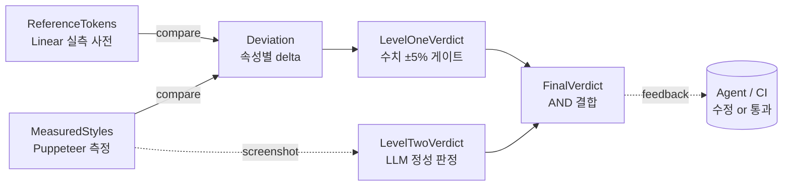
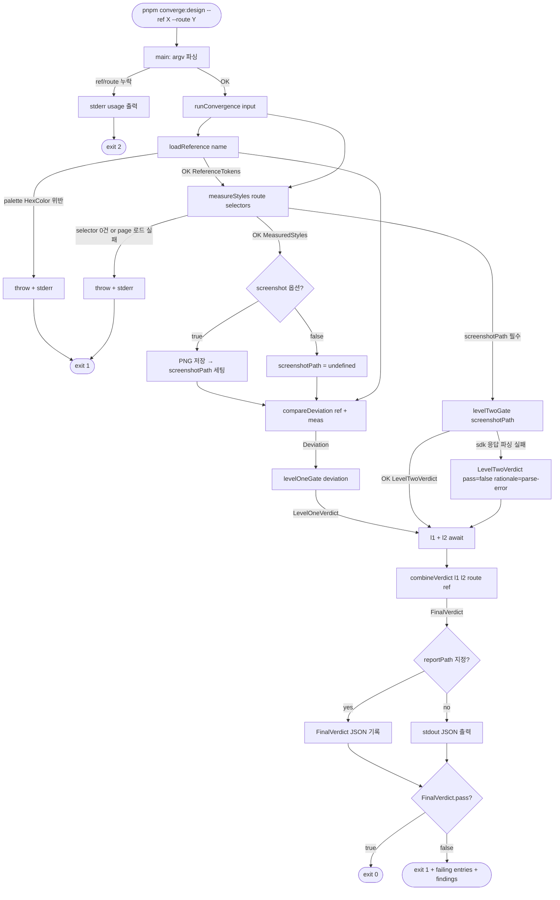
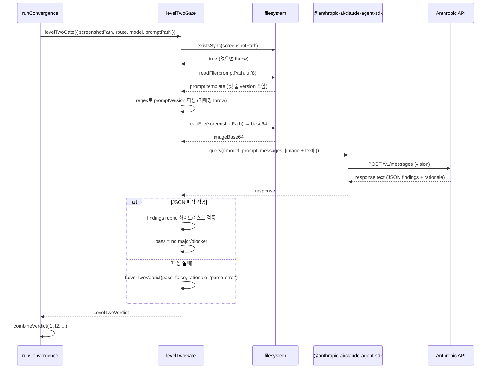

# Design Convergence Loop — Slice 0 — Blueprint

> **Discussion**: 2026-04-18 /discuss — LLM이 1-shot으로 결함 없는 디자인을 뽑게 하려면 L1(미려 컴포넌트)+L2(레이아웃 엔진) 구축 전에 **수렴 루프 인프라**가 필요. 4번 원인(구축했는데 깨짐) = 합격선 테스트 부재. TDD 순서로 Slice 0(루프 인프라) → Slice A(Linear issue list 구현).
> **산출물 유형**: 엔진/인프라 (스크립트 + 테스트 파이프라인)
> **규모 추정**: 신규 파일 4~6개, 수정 0~2개 (기존 `scripts/design*.mjs` 재활용)

## §0 배경·전제

### Discussion 결론 요약

| 요소 | 결론 |
|------|------|
| ① 목적 | LLM 디자인 생성의 variance 최소화 = 1-shot 수렴 |
| ② 배경 | Opus 4.7은 Tailwind+shadcn(훈련 분포)에서 잘함. ax()는 분포 밖 |
| ④ 현실 | L1/L2 부재, 도구 있음, 프로세스 없음 |
| ⑤ 문제 | 수렴 루프 미운영 → 구축해도 평균 회귀 |
| ⑥ 원인 | 합격선 없는 구축 = 목표 없는 수정 (TDD 부재) |
| ⑦ 제약 | ax() 축 유지, ui/ 139개 유지, Linear 수치 자산 있음 |
| ⑧ 보유 자산 | improve-design, design-extract, Puppeteer, `scripts/designMetrics.mjs`, `designScore.mjs`, `screenshotScenario.mjs` 등 |
| ⑪ 해결 | Slice 0 = TDD 파이프라인 (수치 사전 + 차이 측정 + 임계치 테스트 + LLM 판정) |

### β 경로 전제 (프로젝트 방향)

- 외부 LLM/사용자 표면: `widget` + `definePage`만 노출
- ax()는 내부 구현. LLM 미노출
- Slice 0 → Slice A → … 수직 슬라이스로 페이지 유형별 완성

### 반증 조건 (전체 Blueprint)

- 이 Slice 0이 완성되어도 **Slice A에서 또 평균 회귀가 일어나면** 이 Blueprint가 틀렸다
- 측정 지표가 구조적으로 "편차 소스"를 포착하지 못하면 (예: 색은 잡는데 위계는 못 잡으면) Level 1/2 게이트 설계가 부실

---

## §1 데이터 모델

> 수렴 루프 TDD 파이프라인이 다루는 6개 타입: `ReferenceTokens` → `MeasuredStyles` → `Deviation` → `LevelOneVerdict` + `LevelTwoVerdict` → `FinalVerdict`. 레퍼런스(고정값) 대 측정(가변값)을 델타로 줄이고, 수치 게이트(L1) + 정성 게이트(L2) 이중 판정으로 수렴 합격선을 만든다.

### 타입 정의

```ts
// ──────────────────────────────────────────────────────────────
// 1. 레퍼런스 토큰 사전 — Linear issue list 등에서 실측 추출한 고정 수치
//    (다른 레퍼런스로 확장 가능해야 함 → name/version 필수)
// ──────────────────────────────────────────────────────────────

type PixelValue = number // px 단위. rem/em 금지 (측정 시 px로 정규화)
type HexColor = `#${string}` // 예: '#5e6ad2', '#fafafa'
type FontWeight = 400 | 450 | 500 | 600 | 700
type CssProperty =
  | 'row-height' | 'padding-inline' | 'padding-block' | 'gap'
  | 'font-size' | 'font-weight' | 'line-height'
  | 'border-width' | 'border-radius' | 'box-shadow-depth'
  | 'color' | 'background-color' | 'border-color'

/** 단일 토큰 — 의미 있는 이름 + 실측 값 + 추출 출처 */
type ReferenceToken = {
  key: string                  // 예: 'issue-row.height', 'section-header.font-size'
  property: CssProperty
  value: PixelValue | HexColor | FontWeight | string
  tolerance?: number           // ±값 (px 또는 %). 생략 시 default (§1 불변식 4 참조)
  source: {
    url: string                // 예: 'https://linear.app/...'
    selector?: string          // 예: '[data-view="issue-list"] > li'
    extractedAt: string        // ISO8601
  }
}

/** 레퍼런스 토큰 사전 — 한 벌의 디자인 기준 (Linear, Gmail, Vercel 등 확장 가능) */
type ReferenceTokens = {
  name: string                 // 예: 'linear-issue-list'
  version: string              // 예: '2026-04-18'
  description?: string         // 한 줄 요약
  tokens: ReferenceToken[]
  palette: {                   // 팔레트는 별도 구조 (색은 키-값 아닌 역할 기반)
    accent: HexColor            // 예: '#5e6ad2'
    fgPrimary: HexColor         // 예: '#f7f8f8'
    fgMuted: HexColor           // 예: '#8a8f98'
    bgBase: HexColor            // 예: '#08090a'
    bgRaised: HexColor          // 예: '#141516'
    borderSubtle: HexColor      // 예: '#222326'
  }
  typography: {                // DESIGN.md § 타이포 (Linear 실측) 대응
    hero:    { size: PixelValue; weight: FontWeight }   // 22px / 600
    section: { size: PixelValue; weight: FontWeight }   // 16px / 600
    body:    { size: PixelValue; weight: FontWeight }   // 14px / 450
    label:   { size: PixelValue; weight: FontWeight }   // 14px / 500
    caption: { size: PixelValue; weight: FontWeight }   // 12px / 500
  }
}

// ──────────────────────────────────────────────────────────────
// 2. 측정 결과 — Puppeteer가 현재 페이지에서 뽑은 DOM computed style
//    (기존 scripts/designMetrics.mjs의 runDesignMetrics 출력과 연결 가능)
// ──────────────────────────────────────────────────────────────

/** DOM 요소 1건의 측정 */
type MeasuredElement = {
  selector: string             // 예: '[role="row"]:nth-child(1)'
  role?: string                // ARIA role
  rect: { x: number; y: number; width: number; height: number }
  computed: Partial<Record<CssProperty, string>>  // getComputedStyle 결과
}

/** 한 페이지 측정 스냅샷 */
type MeasuredStyles = {
  route: string                // 예: '/ui/linear-issue-list'
  viewport: { width: number; height: number }
  capturedAt: string           // ISO8601
  elements: MeasuredElement[]
  screenshotPath?: string      // Level 2 판정용 PNG 경로 (선택)
  // 기존 designMetrics.mjs 출력과 병합 가능 (?)
  metrics?: {
    score: number              // 0..1
    alignment: number; whitespace: number; proportion: number; spacing: number
  }
}

// ──────────────────────────────────────────────────────────────
// 3. 편차 리포트 — 레퍼런스 vs 측정의 차이. 속성별 delta + 임계 초과 플래그
// ──────────────────────────────────────────────────────────────

type DeviationKind = 'exact' | 'within-tolerance' | 'over-threshold' | 'missing'

type DeviationEntry = {
  tokenKey: string                        // ReferenceToken.key
  property: CssProperty
  expected: PixelValue | HexColor | FontWeight | string
  actual:   PixelValue | HexColor | FontWeight | string | null  // null = 측정 실패
  deltaAbs?: number                       // 절댓값 차이 (px)
  deltaPct?: number                       // 상대 차이 (%) — 수치형 전용
  kind: DeviationKind
  matchedSelector?: string                // 측정 쪽에서 매칭된 selector
}

type Deviation = {
  referenceName: string                   // ReferenceTokens.name
  referenceVersion: string
  route: string                           // MeasuredStyles.route
  entries: DeviationEntry[]
  summary: {
    total: number
    exact: number
    withinTolerance: number
    overThreshold: number
    missing: number
  }
}

// ──────────────────────────────────────────────────────────────
// 4. Level 1 판정 — 수치 편차 ±임계 기반 PASS/FAIL (결정론적)
// ──────────────────────────────────────────────────────────────

type LevelOneVerdict = {
  pass: boolean                           // summary.overThreshold === 0 && missing === 0
  threshold: { pct: number; absPx: number }  // 기본 ±5% 또는 ±1px (큰 쪽)
  failingEntries: DeviationEntry[]        // over-threshold + missing
  score: number                           // 0..1 (within/total)
  evaluatedAt: string                     // ISO8601
}

// ──────────────────────────────────────────────────────────────
// 5. Level 2 판정 — LLM(Opus/Sonnet)이 스크린샷을 보고 내리는 정성 판정
//    (정렬/위계/균형 — 수치로 잡히지 않는 편차 소스)
// ──────────────────────────────────────────────────────────────

type Level2Rubric = 'alignment' | 'hierarchy' | 'balance' | 'consistency' | 'legibility'

type Level2Finding = {
  rubric: Level2Rubric
  severity: 'ok' | 'minor' | 'major' | 'blocker'
  message: string                         // 예: "헤더와 행 사이 baseline 미스얼라인"
  evidence?: string                       // 스크린샷 region 설명
}

type LevelTwoVerdict = {
  pass: boolean                           // major·blocker === 0
  model: 'opus' | 'sonnet'                // 판정 모델
  promptVersion: string                   // 프롬프트 템플릿 버전
  findings: Level2Finding[]
  rationale: string                       // LLM 1-2줄 총평
  screenshotPath: string
  evaluatedAt: string
}

// ──────────────────────────────────────────────────────────────
// 6. 최종 판정 — L1 AND L2 결합 (이중 게이트)
// ──────────────────────────────────────────────────────────────

type FinalVerdict = {
  pass: boolean                           // l1.pass && l2.pass
  route: string
  referenceName: string
  referenceVersion: string
  l1: LevelOneVerdict
  l2: LevelTwoVerdict
  combinedAt: string
  // CI 게이트·에이전트 피드백 입력으로 직접 쓰인다
}
```

### 관계도



### 불변식

| # | 불변식 | 반증 조건 |
|---|--------|---------|
| 1 | `ReferenceTokens.palette`의 모든 색은 HexColor 형식이며 소문자 6자리 이상이어야 한다 (`rgb()`·`hsl()` 금지) | 사전 로드 시 `rgba(...)` 혼입되면 이 Blueprint가 틀림 |
| 2 | `Deviation.entries[i].kind === 'missing'`이면 `actual === null`이며, 반대 방향도 참 | 측정값이 있는데 missing, 또는 값이 null인데 exact가 나오면 compare 로직이 틀림 |
| 3 | `LevelOneVerdict.pass === (summary.overThreshold === 0 && summary.missing === 0)` | pass=true인데 overThreshold>0 케이스가 생기면 L1 게이트 설계가 틀림 |
| 4 | 임계 기본값은 픽셀형 `max(±5%, ±1px)`, 색상형 `ΔE2000 ≤ 2`, font-weight는 정확 일치 | 14px ±0.5px을 PASS 처리하는데 FAIL로 잡히면 tolerance 설계가 틀림 |
| 5 | `FinalVerdict.pass === (l1.pass && l2.pass)` — L1 또는 L2 중 하나만 PASS는 FINAL FAIL | 한쪽만 PASS인데 FINAL PASS가 나오면 이중 게이트 설계가 틀림 |
| 6 | 모든 판정 레코드(`l1/l2/final`)는 `evaluatedAt` ISO8601을 가진다 — 재현성의 근거 | 타임스탬프 없는 verdict가 저장 가능하면 감사 추적성이 무너짐 |
| 7 | `ReferenceTokens.version` 변경 없이 `tokens` 내용이 바뀌면 이전 `Deviation`은 무효 (immutable snapshot) | 같은 version으로 서로 다른 tokens 집합이 동시에 존재 가능하면 캐시·리포트 신뢰성 붕괴 |
| 8 | `MeasuredElement.computed[p]`는 getComputedStyle 결과이므로 항상 px 단위·`rgb(...)` 문자열 정규형이며, 레퍼런스와 비교 전 파싱되어야 한다 | 비교 함수가 정규화 없이 문자열 equality로 동작하면 `'14px'` vs `14` 미스매치로 모든 엔트리가 missing이 됨 |

**완성도:** 🟢 (반증 조건 8개 전부 구체적. `MeasuredStyles.metrics`의 기존 designMetrics.mjs 포맷 병합 여부만 `(?)` 보류)  
**역PRD:** (구현 후 `file::TypeName` 기입)

---

## §2 파일 맵

> 신규 11개, 수정 1개, 재활용 3개. 가장 중요한 결정: 레퍼런스 비교 파이프라인은 `scripts/designScore*` 사내 점수와 **입력·출처·판정 기준이 다르므로 별도 `scripts/designConvergence/` 서브디렉토리**로 분리하되, 측정 단계는 기존 `runDesignMetrics`·`runDesignLint`를 page.evaluate로 재활용한다 (dev server + puppeteer-core 중복 기동 회피).

### 파일 맵

| 경로 | 책임 | 신규/수정 | 재사용 부품 | 역PRD |
|------|------|----------|------------|-------|
| `docs/references/linear-issue-list.tokens.json` | Linear issue list 실측 토큰 사전 (`ReferenceTokens` §1.1 인스턴스 1개). name/version/tokens/palette/typography 5필드. | 신규 | — | ⬜ |
| `docs/references/README.md` | `references/` 폴더 역할 + 토큰 JSON 작성 규약(§1 불변식 1·7) 한 페이지 안내. | 신규 | — | ⬜ |
| `scripts/designConvergence/loadReference.mjs` | `docs/references/{name}.tokens.json` 로드 + 런타임 스키마 검증 → `ReferenceTokens` 반환. §1 불변식 1(HexColor)·7(immutable snapshot) 게이트. 단일 진입점. | 신규 | — (순수 로더) | ⬜ |
| `scripts/designConvergence/measureStyles.mjs` | 단일 라우트 DOM 측정 → `MeasuredStyles` 반환. selector 목록을 받아 rect+computed 추출. page.evaluate 내부에서 `runDesignMetrics` 호출하여 `metrics` 병합. | 신규 | `scripts/designMetrics.mjs::runDesignMetrics`, `scripts/screenshot.mjs`의 Puppeteer 부트스트랩 패턴 | ⬜ |
| `scripts/designConvergence/compareDeviation.mjs` | `ReferenceTokens` × `MeasuredStyles` → `Deviation`. 속성별 정규화 + tolerance 적용 + kind 분류 (§1 불변식 2·8). | 신규 | — (순수 함수) | ⬜ |
| `scripts/designConvergence/levelOneGate.mjs` | `Deviation` → `LevelOneVerdict`. 수치 ±max(5%,1px) / `ΔE2000≤2` / font-weight exact (§1 불변식 3·4). `deltaE2000` 헬퍼 포함. | 신규 | — (순수 함수) | ⬜ |
| `scripts/designConvergence/levelTwoGate.mjs` | 스크린샷 + 프롬프트 → `LevelTwoVerdict`. `@anthropic-ai/claude-agent-sdk`로 Opus/Sonnet에 비전 판정 요청, rubric 5종(alignment/hierarchy/balance/consistency/legibility) 파싱 (§1 불변식 5·6). | 신규 | `@anthropic-ai/claude-agent-sdk` (package.json 기존), `scripts/screenshot.mjs` 캡처 패턴 | ⬜ |
| `scripts/designConvergence/combineVerdict.mjs` | `LevelOneVerdict` + `LevelTwoVerdict` → `FinalVerdict` AND 결합 (§1 불변식 5). 각 판정은 독립 수행, 이 함수는 조립만. | 신규 | — (순수 함수) | ⬜ |
| `scripts/designConvergence/runConvergence.mjs` | CLI 진입점. `--ref` + `--route` 인자 → measure→compare→L1→L2→FINAL 파이프라인 오케스트레이션 + JSON 리포트 출력. `pnpm converge:design`이 호출. | 신규 | `scripts/designScoreAll.mjs`의 route 순회 + Chrome 부팅 패턴, `scripts/designLintRunner.mjs`의 얇은 CLI wrapper 패턴 | ⬜ |
| `scripts/designConvergence/prompts/level2Rubric.md` | Level 2 LLM 프롬프트 템플릿(버전 관리 대상). `promptVersion` 문자열 1줄 포함 — `LevelTwoVerdict.promptVersion` SSOT. | 신규 | — | ⬜ |
| `src/interactive-os/__tests__/designConvergence.test.ts` | L1+L2 게이트 vitest — 픽스처 `Deviation` 주입해 `FinalVerdict.pass` assert. 불변식 1·3·5 회귀 테스트 포함. L2는 mock. | 신규 | vitest (happy-dom), 기존 `__tests__/` 패턴 | ⬜ |
| `package.json` | `scripts` 필드에 `"converge:design": "node scripts/designConvergence/runConvergence.mjs"` 1줄 추가. | 수정 | — | ⬜ |
| `scripts/designMetrics.mjs` | `runDesignMetrics` export 그대로 재사용. **수정 없음**. | 재활용 | — | — |
| `scripts/designLintRules.mjs` | `runDesignLint` export를 `measureStyles.mjs`에서 선택적 호출 가능(옵션). **수정 없음**. | 재활용 | — | — |
| `scripts/screenshot.mjs` | 캡처 로직 코드 참조만(복붙 아님). **수정 없음**. `measureStyles.mjs`·`levelTwoGate.mjs`가 자체 Puppeteer 인스턴스 사용. | 재활용 | — | — |

### 재활용 분석 (기존 자산 × Slice 0 역할 매핑)

| 기존 파일 | 현재 역할 | Slice 0에서의 활용 | 결정 |
|---------|---------|-----------------|------|
| `scripts/designMetrics.mjs` | 브라우저 내부 구조 메트릭 (alignment/whitespace/proportion/spacing 가중 평균 → score 0..1) | `measureStyles.mjs`의 `page.evaluate(runDesignMetrics)`로 호출 → `MeasuredStyles.metrics`에 병합 (§1 주석 `(?)` 해결) | **재활용 (수정 없음)** |
| `scripts/designLintRules.mjs` | 브라우저 내부 디자인 위반 규칙 runner (self-contained, `runDesignLint` export) | `measureStyles.mjs`가 `--with-lint` 옵션 시 보조 데이터로 수집. 주 경로는 Deviation 기반이므로 필수 아님 | **재활용 (옵셔널)** |
| `scripts/designScore.mjs` | `/internals/theme` 페이지에서 R1-R6 CSS/DOM 런타임 체크 (내부 design system 자가 검사) | **입력(URL 고정)·판정 기준(토큰 사용률·minSize·hover)** 모두 다름. 외부 레퍼런스 비교와 목적 상이 | **별도 파이프라인 (통합 안 함)** |
| `scripts/designScoreAll.mjs` | 전 라우트 순회 + lint+metrics 가중 평균 (내부 Lint 점수 집계) | route 순회 + puppeteer 부팅 패턴만 코드 참조. 점수 계산 로직은 재사용 안 함 | **패턴 참조만** |
| `scripts/designScoreVisual.mjs` | `runDesignLint` 기반 전 라우트 lint 집계 | 동상. 역할 겹침 — Slice 0는 "레퍼런스 대비 편차" 뷰 | **별도 파이프라인** |
| `scripts/compareShadcn.mjs` | shadcn 소스 DOM 구조 vs aria-os happy-dom 렌더 DOM 비교 (구조적 gap 탐지) | Slice 0과 유사한 "레퍼런스 대비" 선행 사례. **런타임 브라우저 측정 + Deviation 리포트** 아키텍처 벤치마크로 활용. 구현 상 직접 import 없음 | **패턴 참조만 (가장 가까운 선행 사례)** |
| `scripts/screenshotScenario.mjs` | manifest.yaml 기반 시나리오별 인터랙션 후 캡처 | Slice 0는 단일 인터랙션 없는 초기 상태 대상 → 직접 사용 안 함. 향후 Slice A에서 scenario 도입 시 후보 | **패턴 참조만** |
| `scripts/screenshot.mjs` | 라우트 루프 전수 캡처 (`--light`/`--dark` 지원) | `levelTwoGate.mjs`가 자체 캡처 하되, Chrome 부트스트랩·viewport·wait 관행을 코드 참조 | **패턴 참조 + 관행 공유** |
| `scripts/keylineCheck.mjs` | ax() TSX 정적 분석 — role·축 값 위반 탐지 | Slice 0은 런타임 측정 기반 → 정적 분석 아니라 관련 낮음. 향후 정적 토큰 검증 단계 추가 시 후보 | **관련 없음 (별도 레이어)** |

### 신규 파일 SRP 검토

- `linear-issue-list.tokens.json` — **데이터 1벌** (로직 없음) ✓
- `loadReference.mjs` — **로드·스키마 검증만** (비교·판정 없음, 단일 진입점) ✓
- `measureStyles.mjs` — **측정만** (compare 없음, 판정 없음) ✓
- `compareDeviation.mjs` — **비교만** (측정·판정 없음, 순수 함수) ✓
- `levelOneGate.mjs` — **L1 판정만** (비교 결과 받아서 게이트 통과만 결정) ✓
- `levelTwoGate.mjs` — **L2 판정만** (LLM 호출 + rubric 파싱) ✓
- `combineVerdict.mjs` — **L1+L2 조립만** (AND 결합, 순수 함수) ✓
- `runConvergence.mjs` — **오케스트레이션만** (각 단계 호출·조립·리포트) ✓
- `prompts/level2Rubric.md` — **프롬프트 텍스트만** ✓
- `designConvergence.test.ts` — **게이트 동작 검증만** ✓

각 파일 한 줄 책임이 겹치지 않음. L1/L2가 L0(측정)·L0.5(비교)를 부르지 않고 순수 입력→판정으로 단방향이라 테스트 고립 가능.

### 파일명 컨벤션 (CLAUDE.md 규칙 준수)

| 파일 | 주 export | 일치 여부 |
|------|---------|---------|
| `loadReference.mjs` | `export function loadReference(...)` (async) | ✓ |
| `measureStyles.mjs` | `export async function measureStyles(...)` | ✓ |
| `compareDeviation.mjs` | `export function compareDeviation(...)` | ✓ |
| `levelOneGate.mjs` | `export function levelOneGate(...)` | ✓ |
| `levelTwoGate.mjs` | `export async function levelTwoGate(...)` | ✓ |
| `combineVerdict.mjs` | `export function combineVerdict(...)` | ✓ |
| `runConvergence.mjs` | `export async function runConvergence(...)` + CLI entry | ✓ |

### 답해야 할 질문 (설계 근거)

**Q1. 기존 `scripts/designScore*` 파이프라인과의 관계?**
→ **별도**. 입력이 다르다 (designScore: `/internals/theme` 고정, Slice 0: 임의 `--route`). 출력이 다르다 (designScore: 0..1 가중 평균, Slice 0: `FinalVerdict` Pass/Fail + `DeviationEntry[]`). 판정 기준이 다르다 (designScore: 내부 CSS 토큰 사용률, Slice 0: 외부 레퍼런스 편차 ±%). 단, **측정 단계**에서 `runDesignMetrics` self-contained 함수는 그대로 호출해 `MeasuredStyles.metrics`에 담는다 (§1 불변식 중립, 부가 정보).

**Q2. Level 2 LLM 호출 파일 구조?**
→ `scripts/designConvergence/levelTwoGate.mjs`가 단독 소유. `@anthropic-ai/claude-agent-sdk`(package.json 기존)를 통해 스크린샷 PNG + `prompts/level2Rubric.md` 템플릿을 Opus/Sonnet에 전송. 프롬프트 버전(`promptVersion`)은 `.md` 파일 첫 줄 `<!-- version: YYYY-MM-DD -->`로 관리하여 `LevelTwoVerdict.promptVersion` SSOT. 응답은 JSON 스키마로 강제하여 `Level2Finding[]` 파싱. (※ `claude-api` 스킬은 프로젝트 외부 skill — 파일 배치와 무관.)

**Q3. 레퍼런스 사전 폴더 `docs/references/` — 위치?**
→ **신규 생성 필요**. 조사 결과 `docs/` 하위에 `references` 폴더가 없다 (기존: 0-inbox/1-projects/2-areas/3-resources/4-archive/5-backlogs + 일부 루트 md). PARA 분류에서 `3-resources/`가 학습용 자료 중심이고, 레퍼런스 토큰은 **실측 고정 데이터**로 역할이 다르므로 `docs/references/`를 새로 연다. README 1장으로 역할·규약 고지. (`3-resources/` 배치는 번호·태그 규칙과 충돌 — 토큰 JSON은 시리즈가 아니라 확장 가능한 dictionary 모음이므로 부적합.)

**Q4. 신규 파일 SRP 겹침?**
→ 없음. 위 "신규 파일 SRP 검토" 표 참고. measure→compare→gate→orchestrate 파이프라인이 단방향이며 각 단계 입·출력이 §1 타입 1개와 1:1 대응.

**반증 조건**: 파일 맵에 없는 경로에 구현이 나타나면 Blueprint 위반. 예 — `src/interactive-os/` 내부에 수렴 로직이 들어가면 "pages/engine 레이어는 런타임 UI 부품" 원칙 위반(#1 원칙). 기존 `scripts/designScoreAll.mjs`를 직접 수정해 레퍼런스 비교 로직을 끼워넣으면 위 Q1 별도 파이프라인 결정 위반.

**완성도:** 🟢  
**역PRD:** (구현 후 실제 생성/수정 파일 + LOC 기입)

---

## §3 Export 시그니처

> 신규 파일 9개, export 11개 (주 API 9 + 헬퍼 2), @invariant 총 28개. §1 6개 타입 전부 재사용 (ReferenceTokens×4, MeasuredStyles×5, Deviation×4, LevelOneVerdict×3, LevelTwoVerdict×3, FinalVerdict×3).

### `docs/references/linear-issue-list.tokens.json`

```ts
// JSON 인스턴스 — §1 ReferenceTokens 구조를 그대로 따름 (로직 없음, 데이터 1벌)
// 스키마: import type { ReferenceTokens } from '<§1 타입>'
//
// {
//   "name": "linear-issue-list",
//   "version": "2026-04-18",
//   "description": "Linear issue list 레퍼런스 토큰 (DESIGN.md § 타이포/팔레트 실측 대응)",
//   "tokens": ReferenceToken[],           // §1.1 — issue-row.height, section-header.* 등
//   "palette": { accent, fgPrimary, fgMuted, bgBase, bgRaised, borderSubtle },
//   "typography": { hero, section, body, label, caption }
// }
//
// 로더 SSOT: scripts/designConvergence/loadReference.mjs::loadReference('linear-issue-list')
// @invariant 파일명 stem('linear-issue-list') === JSON.name (loader가 교차 검증)
// @invariant §1 불변식 1을 만족 — palette 모든 값이 /^#[0-9a-f]{6,8}$/ 매칭
// @invariant §1 불변식 7을 만족 — 동일 version으로 재발행 불가 (loader가 캐시 키로 version 사용)
```

### `docs/references/README.md`

```ts
// 문서 전용 — export 없음. 로직 파일 아님.
// 내용 책임:
//   1) 폴더 역할: "외부 레퍼런스의 실측 토큰 사전 (Linear/Gmail/Vercel 확장 가능)"
//   2) JSON 작성 규약: §1 ReferenceTokens 구조 + 불변식 1·7 SSOT
//   3) 네이밍: {source-slug}.tokens.json (stem === ReferenceTokens.name)
//
// @invariant README에 §1 타입 구조(6개 타입 이름)가 1:1 언급되어야 한다 —
//            구조가 흐려지면 이 Blueprint가 흐려진다 (문서 자기일치)
```

### `scripts/designConvergence/loadReference.mjs`

```ts
// 레퍼런스 JSON 로드 + 런타임 스키마 검증 — 단일 진입점 (§1 불변식 1·7 게이트).

import type { ReferenceTokens } from '<§1 타입>'

/**
 * name 슬러그로 docs/references/{name}.tokens.json을 로드하고 ReferenceTokens로 파싱.
 * 스키마 위반(palette 비-HexColor, 필수 필드 누락)은 throw — §1 불변식 1·7 강제.
 *
 * @invariant 반환 ReferenceTokens.name === 입력 name (파일 stem과 name 일치 검증)
 * @invariant palette 모든 값이 /^#[0-9a-f]{6,8}$/ 매칭 실패 시 throw (§1 불변식 1)
 * @invariant 같은 (name, version) 쌍은 같은 tokens 길이·내용을 반환 (§1 불변식 7 — immutable snapshot)
 */
export function loadReference(name: string): Promise<ReferenceTokens>
```

### `scripts/designConvergence/measureStyles.mjs`

```ts
// 단일 라우트 DOM 측정 — Puppeteer 브라우저 인스턴스 소유, 측정 외 판정/비교 없음.

import type { MeasuredStyles } from '<§1 타입>'

/**
 * dev server가 띄운 라우트를 로드하고 selector 목록의 DOM computed style을 추출.
 * page.evaluate 내부에서 기존 scripts/designMetrics.mjs::runDesignMetrics를 호출하여
 * MeasuredStyles.metrics를 병합 (§1.2 주석 (?) 해결).
 *
 * @invariant 반환 MeasuredStyles.route === input.route (라우트 섞임 방지)
 * @invariant elements.length >= 1 — selector 매칭 0건 또는 페이지 로드 실패 시 throw
 * @invariant 모든 MeasuredElement.computed[p] 문자열이 px / rgb() 정규형 (§1 불변식 8 전제)
 * @invariant screenshot: true일 때만 MeasuredStyles.screenshotPath 존재, false면 undefined
 */
export function measureStyles(input: {
  route: string
  selectors: string[]
  viewport?: { width: number; height: number }
  screenshot?: boolean
  screenshotDir?: string
  baseUrl?: string                 // 기본 'http://localhost:5173'
}): Promise<MeasuredStyles>
```

### `scripts/designConvergence/compareDeviation.mjs`

```ts
// ReferenceTokens × MeasuredStyles → Deviation (순수 함수, 브라우저/LLM 호출 없음).

import type { ReferenceTokens, MeasuredStyles, Deviation, DeviationEntry } from '<§1 타입>'

/**
 * 토큰별로 선택자 매칭·단위 정규화·tolerance 비교를 수행하여 DeviationEntry[] 생성.
 * 픽셀/색/폰트웨이트 3 갈래 정규화 (§1 불변식 8).
 *
 * @invariant entries.length === reference.tokens.length (누락 0 — missing도 엔트리로 남김, §1 불변식 2)
 * @invariant summary.total === entries.length
 * @invariant summary.exact + withinTolerance + overThreshold + missing === summary.total
 * @invariant entries[i].kind === 'missing' ↔ entries[i].actual === null (§1 불변식 2 양방향)
 * @invariant referenceName/referenceVersion/route는 입력에서 그대로 전파 (식별 무결성)
 */
export function compareDeviation(input: {
  reference: ReferenceTokens
  measured: MeasuredStyles
}): Deviation

/**
 * 색상 편차 보조 헬퍼 — §1 불변식 4 (색상형 ΔE2000 ≤ 2)를 levelOneGate와 공유.
 * compareDeviation이 DeviationEntry.deltaAbs 채울 때 사용.
 *
 * @invariant 입력 a/b가 /^#[0-9a-f]{6,8}$/ 매칭 아니면 throw (§1 불변식 1 방어)
 * @invariant 반환값 >= 0 이며 a === b일 때 정확히 0
 */
export function deltaE2000(a: HexColor, b: HexColor): number
```

### `scripts/designConvergence/levelOneGate.mjs`

```ts
// Deviation → LevelOneVerdict (§1 불변식 3·4 SSOT 구현). 순수 함수.

import type { Deviation, LevelOneVerdict, DeviationEntry } from '<§1 타입>'

/**
 * 픽셀형 max(±5%, ±1px) / 색상형 ΔE2000 ≤ 2 / font-weight exact 임계를 적용하여
 * over-threshold + missing 엔트리를 failingEntries로 수집하고 pass 산출.
 *
 * @invariant verdict.pass === (deviation.summary.overThreshold === 0 && deviation.summary.missing === 0) (§1 불변식 3)
 * @invariant failingEntries.every(e => e.kind === 'over-threshold' || e.kind === 'missing')
 * @invariant threshold.pct === 5 && threshold.absPx === 1 (기본값, §1 불변식 4) — 호출자가 override 가능
 * @invariant score === (exact + withinTolerance) / total, 0..1 범위, total===0이면 1
 * @invariant evaluatedAt은 ISO8601 문자열 (§1 불변식 6)
 */
export function levelOneGate(
  deviation: Deviation,
  options?: { threshold?: { pct: number; absPx: number } },
): LevelOneVerdict
```

### `scripts/designConvergence/prompts/level2Rubric.md`

```ts
// 문서 (Markdown) — export 없음. 프롬프트 템플릿 SSOT.
// 첫 줄 HTML 주석에 버전 명시: <!-- version: 2026-04-18 -->
//
// 템플릿 책임:
//   1) rubric 5종(alignment/hierarchy/balance/consistency/legibility) 정의
//   2) 응답 JSON 스키마: { findings: Level2Finding[], rationale: string }
//   3) severity 기준 4단계(ok/minor/major/blocker) 판정 가이드
//
// 로더: scripts/designConvergence/levelTwoGate.mjs가 fs.readFile 후 첫 줄 파싱
//
// @invariant 첫 줄이 /^<!-- version: (\d{4}-\d{2}-\d{2}) -->$/ 정확 매칭 (parser SSOT)
// @invariant LevelTwoVerdict.promptVersion === 파싱된 date 문자열 (§1.5 SSOT 계약)
```

### `scripts/designConvergence/levelTwoGate.mjs`

```ts
// 스크린샷 + 프롬프트 → LevelTwoVerdict. Node 런타임 (브라우저 없음).
// @anthropic-ai/claude-agent-sdk로 Opus/Sonnet 비전 판정.

import { query } from '@anthropic-ai/claude-agent-sdk'   // 기존 package.json 의존
import type { LevelTwoVerdict, Level2Finding } from '<§1 타입>'

/**
 * 스크린샷 PNG + prompts/level2Rubric.md 템플릿을 Opus/Sonnet에 전송하고
 * rubric 5종 응답을 Level2Finding[]으로 파싱 → LevelTwoVerdict 생성.
 *
 * @invariant verdict.pass === findings.every(f => f.severity !== 'major' && f.severity !== 'blocker') (§1.5 정의)
 * @invariant verdict.screenshotPath === input.screenshotPath (입력 그대로 전파)
 * @invariant verdict.promptVersion === readPromptVersion(prompts/level2Rubric.md) (§1.5 SSOT)
 * @invariant findings.every(f => Level2Rubric 5종 중 하나) — 미지 rubric 응답은 throw
 * @invariant evaluatedAt은 ISO8601 문자열 (§1 불변식 6)
 * @invariant input.screenshotPath 파일 미존재 시 throw (LLM 호출 전 사전 검증)
 */
export function levelTwoGate(input: {
  screenshotPath: string
  route: string
  model?: 'opus' | 'sonnet'           // 기본 'opus'
  promptPath?: string                 // 기본 './prompts/level2Rubric.md'
}): Promise<LevelTwoVerdict>
```

### `scripts/designConvergence/combineVerdict.mjs`

```ts
// L1 + L2 → FinalVerdict (§1 불변식 5 SSOT). 순수 함수.

import type { LevelOneVerdict, LevelTwoVerdict, FinalVerdict } from '<§1 타입>'

/**
 * L1/L2 두 판정을 AND 결합하여 최종 게이트 결과 생성. 각 판정은 독립적으로 수행되어야 하며
 * (한쪽 실패가 다른 쪽 skip 사유 아님), combineVerdict는 조립만 담당.
 *
 * @invariant final.pass === (l1.pass && l2.pass) (§1 불변식 5 — 한쪽만 PASS면 FINAL FAIL)
 * @invariant final.route === l2.screenshotPath의 추정 route와 일치하거나 명시 입력 (호출자 책임)
 * @invariant final.referenceName/referenceVersion은 입력에서 그대로 전파
 * @invariant combinedAt은 ISO8601 문자열 (§1 불변식 6)
 * @invariant final.l1 === input.l1 && final.l2 === input.l2 (참조 보존, 감사 추적)
 */
export function combineVerdict(input: {
  l1: LevelOneVerdict
  l2: LevelTwoVerdict
  route: string
  referenceName: string
  referenceVersion: string
}): FinalVerdict
```

### `scripts/designConvergence/runConvergence.mjs`

```ts
// CLI 진입점 — measure → compare → L1 → L2 → FINAL 파이프라인 오케스트레이션 + JSON 리포트 출력.
// pnpm converge:design --ref linear-issue-list --route /ui/linear-issue-list 가 호출.

import type { FinalVerdict } from '<§1 타입>'
import { loadReference } from './loadReference.mjs'
import { measureStyles } from './measureStyles.mjs'
import { compareDeviation } from './compareDeviation.mjs'
import { levelOneGate } from './levelOneGate.mjs'
import { levelTwoGate } from './levelTwoGate.mjs'
import { combineVerdict } from './combineVerdict.mjs'

/**
 * 프로그래매틱 오케스트레이터 — CLI 외 테스트·타 스크립트에서도 호출 가능하도록 별도 export.
 *
 * @invariant 반환 FinalVerdict.route === input.route, referenceName === input.ref
 * @invariant 파이프라인 순서 고정: measure → compare → L1, 병렬로 L2, 최종 combineVerdict
 *            (L1 실패해도 L2는 수행 — 진단 정보 최대화)
 * @invariant reportPath 지정 시 해당 경로에 FinalVerdict JSON이 기록되며 FinalVerdict.pass와 exit code 대응
 */
export function runConvergence(input: {
  ref: string                       // ReferenceTokens.name
  route: string
  viewport?: { width: number; height: number }
  reportPath?: string               // 기본 '.design-convergence/{ref}-{route}.json'
  screenshotDir?: string            // 기본 '.design-convergence/screenshots'
}): Promise<FinalVerdict>

/**
 * CLI entry — process.argv로 주입되는 node 실행점. runConvergence를 얇게 감싼다.
 *
 * @invariant --ref와 --route 누락 시 non-zero exit (usage 출력)
 * @invariant FinalVerdict.pass === false이면 process.exit(1), true면 exit(0) — CI 게이트
 * @invariant argv 파싱 실패/런타임 에러를 stderr로 출력하되 stack trace 유출 없음
 */
export function main(argv: string[]): Promise<void>
```

### `src/interactive-os/__tests__/designConvergence.test.ts`

```ts
// vitest (happy-dom). L1/combine 순수 함수는 unit, L2는 claude-agent-sdk를 vi.mock.
// 테스트 본문은 §6에서 상세화 — 본 §3은 바깥 껍데기 시그니처만 고정.

import { describe, it, expect, vi } from 'vitest'
import { compareDeviation } from '../../../scripts/designConvergence/compareDeviation.mjs'
import { levelOneGate } from '../../../scripts/designConvergence/levelOneGate.mjs'
import { levelTwoGate } from '../../../scripts/designConvergence/levelTwoGate.mjs'
import { combineVerdict } from '../../../scripts/designConvergence/combineVerdict.mjs'

// @invariant describe 블록은 §1 불변식 번호와 1:1 대응 — 회귀 테스트 추적성 확보
describe('compareDeviation — §1 불변식 2·8', () => {
  it('missing ↔ actual === null 양방향', () => { /* body in §6 */ })
  it('px / rgb() 문자열 정규화 후 매칭', () => { /* body in §6 */ })
})

describe('levelOneGate — §1 불변식 3·4', () => {
  it('pass === (overThreshold===0 && missing===0)', () => { /* body in §6 */ })
  it('픽셀형 max(±5%, ±1px) / 색상형 ΔE2000≤2 / font-weight exact', () => { /* body in §6 */ })
})

describe('combineVerdict — §1 불변식 5·6', () => {
  it('final.pass === (l1.pass && l2.pass) AND 결합', () => { /* body in §6 */ })
  it('combinedAt은 ISO8601', () => { /* body in §6 */ })
})

describe('levelTwoGate — §1.5 (claude-agent-sdk mock)', () => {
  it('promptVersion은 prompts/level2Rubric.md 첫 줄에서 파싱', () => { /* body in §6 */ })
  it('findings에 major/blocker 포함 시 pass===false', () => { /* body in §6 */ })
})

describe('loadReference — §1 불변식 1·7', () => {
  it('palette 비-HexColor 혼입 시 throw', () => { /* body in §6 */ })
  it('file stem !== name 시 throw', () => { /* body in §6 */ })
})
```

### `package.json`

```ts
// scripts 필드 1줄 추가 — 런타임 진입점, export 없음
// "scripts": {
//   ...기존...,
//   "converge:design": "node scripts/designConvergence/runConvergence.mjs"
// }
//
// @invariant pnpm converge:design --ref X --route Y 호출이 runConvergence.main(argv)로 흐른다
// @invariant FinalVerdict.pass === false 시 exit 1 → CI 게이트로 직결
```

### Import 관계 (신규 파일 간)

```mermaid
flowchart TB
  CLI[runConvergence.mjs<br/>main + runConvergence] --> LOAD[loadReference.mjs]
  CLI --> MEASURE[measureStyles.mjs]
  LOAD --> COMPARE[compareDeviation.mjs]
  MEASURE --> COMPARE
  MEASURE --> L2[levelTwoGate.mjs]
  COMPARE --> L1[levelOneGate.mjs]
  L1 --> COMBINE[combineVerdict.mjs]
  L2 --> COMBINE
  COMBINE --> CLI
  PROMPT[prompts/level2Rubric.md] -. fs.readFile .-> L2
  REFJSON[docs/references/linear-issue-list.tokens.json] -. fs.readFile .-> LOAD
  SDK[/@anthropic-ai/claude-agent-sdk/] -. query() .-> L2
  METRICS[scripts/designMetrics.mjs::runDesignMetrics] -. page.evaluate .-> MEASURE
  TEST[designConvergence.test.ts] -. import .-> COMPARE
  TEST -. import .-> L1
  TEST -. import + vi.mock .-> L2
  TEST -. import .-> COMBINE
  TEST -. import .-> LOAD
  PKG[package.json scripts] -. node .-> CLI
```

**반증 조건**:
- §3에 없는 export가 구현에 등장하면 위반 (예: `measureStyles`에서 비교 로직 export → SRP 붕괴).
- §3 시그니처 타입이 §1 6개 타입과 다른 이름/구조로 대체되면 위반 (예: `Deviation` 대신 임시 타입).
- 모든 export의 `@invariant` 중 하나라도 반증 불가(관찰로 검증 불가)하면 위반 — "잘 동작함" 같은 주관 문구 금지.
- `levelTwoGate`가 `@anthropic-ai/claude-agent-sdk` 외 다른 LLM 경로를 사용하면 §2 Q2 위반.
- `runConvergence` 내부에서 measure/compare/gate 중 하나를 건너뛰면 파이프라인 단방향성 위반.

**완성도:** 🟢 (export 11개 전부 §1 타입 시그니처 + @invariant 28개 배치, Import 관계 단방향)  
**역PRD:** (구현 후 `file::exportName` 실제 위치)

---

## §4 흐름

> CLI argv → 레퍼런스 로드 + 라우트 측정 → 편차 비교 → L1 게이트 + L2 LLM 판정 → AND 결합 → JSON 리포트 + CI exit code. 단방향 파이프라인이며, **L1 실패해도 L2는 계속 수행**하여 진단 정보를 최대화한다(§3 `runConvergence` @invariant 2).

### 전체 Control Flow



### 주요 로직 pseudo-code

#### measureStyles (§3.measureStyles.mjs)

```ts
// 브라우저 페이지 로드 → DOM computed style 추출 → 기존 designMetrics 병합 → MeasuredStyles
async function measureStyles(input: {
  route: string
  selectors: string[]
  viewport?: { width: number; height: number }
  screenshot?: boolean
  screenshotDir?: string
  baseUrl?: string
}): Promise<MeasuredStyles> {
  // 1. Puppeteer launch: headless=new, viewport = input.viewport ?? {1280, 800}
  // 2. page.goto(`${baseUrl ?? 'http://localhost:5173'}${input.route}`, { waitUntil: 'networkidle0' })
  //    2a. 실패 시 throw (§3 @invariant "selector 매칭 0건 또는 페이지 로드 실패 시 throw")
  // 3. page.evaluate((selectors) => { ... }) 내부에서:
  //    3a. for (const sel of selectors) document.querySelectorAll(sel) 순회
  //    3b. 각 요소 → rect = el.getBoundingClientRect()
  //    3c. computed = window.getComputedStyle(el) → CssProperty 화이트리스트로 필터
  //    3d. role = el.getAttribute('role') ?? undefined
  //    3e. MeasuredElement[] 수집
  // 4. page.evaluate(runDesignMetrics) → { score, alignment, whitespace, proportion, spacing }
  //    (§2 Q1 결정: designMetrics는 self-contained 함수를 브라우저 컨텍스트에 주입)
  // 5. if (input.screenshot === true) await page.screenshot({ path: `${screenshotDir}/${route}.png` })
  //    else screenshotPath = undefined
  // 6. browser.close()
  // 7. return {
  //      route: input.route, viewport, capturedAt: new Date().toISOString(),
  //      elements, screenshotPath, metrics
  //    }
  //
  // @invariant 반환 MeasuredStyles.route === input.route (§3)
  // @invariant elements.length >= 1 — 0이면 위 2a·3a에서 throw
  // @invariant screenshot===true ↔ screenshotPath !== undefined
}
```

#### compareDeviation (§3.compareDeviation.mjs)

```ts
// ReferenceTokens × MeasuredStyles → Deviation (순수 함수, 브라우저/LLM 접근 없음)
function compareDeviation(input: {
  reference: ReferenceTokens
  measured: MeasuredStyles
}): Deviation {
  // 1. entries: DeviationEntry[] = []
  // 2. for (const token of reference.tokens):
  //    2a. selector = token.source.selector
  //    2b. matched = measured.elements.find(e => e.selector === selector || matchesRole(e, token))
  //    2c. if (!matched):
  //        → entries.push({ tokenKey, property, expected: token.value, actual: null,
  //                         kind: 'missing' })  // §1 불변식 2 좌→우
  //        → continue
  //    2d. rawActual = matched.computed[token.property]  // 예: '14px', 'rgb(247, 248, 248)'
  //    2e. normalize(rawActual, token.property):
  //        - 'font-size'·'padding-*'·'gap'·'row-height'·'border-*' → parseFloat → px number
  //        - 'color'·'background-color'·'border-color' → rgb()→#rrggbb HexColor
  //        - 'font-weight' → Number
  //    2f. delta 계산:
  //        - 픽셀형: deltaAbs = |actual - expected|, deltaPct = (deltaAbs / expected) * 100
  //        - 색상형: deltaAbs = deltaE2000(expected, actual) — §3 헬퍼 재사용
  //        - weight: deltaAbs = |actual - expected| (정확 일치 → 0)
  //    2g. kind 분류:
  //        - actual === expected → 'exact'
  //        - within tolerance (token.tolerance ?? default) → 'within-tolerance'
  //        - else → 'over-threshold'
  //    2h. entries.push({ tokenKey, property, expected, actual, deltaAbs, deltaPct, kind,
  //                       matchedSelector: matched.selector })
  // 3. summary 집계: total = entries.length, exact/withinTolerance/overThreshold/missing 카운트
  // 4. return { referenceName, referenceVersion, route: measured.route, entries, summary }
  //
  // @invariant entries.length === reference.tokens.length (§3)
  // @invariant entries[i].kind === 'missing' ↔ entries[i].actual === null (§1 불변식 2 양방향)
  // @invariant summary.exact + withinTolerance + overThreshold + missing === summary.total
}
```

**색상 비교 알고리즘 디테일**: `deltaE2000(a: HexColor, b: HexColor)` 헬퍼는 Lab 공간 변환 후 CIEDE2000 공식 적용. `ΔE ≤ 2`가 within-tolerance 기준(§1 불변식 4). 헬퍼는 compareDeviation + levelOneGate 양쪽이 같은 SSOT를 사용해야 일관성 유지.

**Selector 매칭 실패 처리**: 위 2c — `measured.elements`에 매칭 selector가 없으면 **즉시 `kind: 'missing'`, `actual: null`로 엔트리 생성**하고 continue. 루프를 끝까지 돌려 누락도 `entries.length === reference.tokens.length`를 유지(§1 불변식 2, §3 invariant).

#### levelOneGate (§3.levelOneGate.mjs)

```ts
// Deviation → LevelOneVerdict (§1 불변식 3·4 SSOT). 순수 함수.
function levelOneGate(
  deviation: Deviation,
  options?: { threshold?: { pct: number; absPx: number } },
): LevelOneVerdict {
  // 1. threshold = options?.threshold ?? { pct: 5, absPx: 1 }  // 기본 §1 불변식 4
  // 2. failingEntries = deviation.entries.filter(e =>
  //      e.kind === 'over-threshold' || e.kind === 'missing')
  //    (§3 @invariant: failingEntries 전부 over-threshold | missing)
  // 3. pass = deviation.summary.overThreshold === 0 && deviation.summary.missing === 0
  //    (§1 불변식 3 SSOT)
  // 4. total = deviation.summary.total
  //    score = total === 0 ? 1 : (summary.exact + summary.withinTolerance) / total
  // 5. return { pass, threshold, failingEntries, score,
  //             evaluatedAt: new Date().toISOString() }
  //
  // @invariant verdict.pass === (summary.overThreshold === 0 && summary.missing === 0)
  // @invariant score ∈ [0, 1], total===0 ⇒ score === 1
}
```

**L1 임계 공식 `max(±5%, ±1px)`의 의미**: 픽셀형 비교에서 14px × 5% = 0.7px이므로 1px 이하 값에서 무의미해진다. 따라서 `deltaAbs <= max(expected * 0.05, 1)` 조건 — 작은 값에서도 최소 1px 허용폭 보장 (§1 불변식 4 구현 디테일). compareDeviation에서 within-tolerance 분류 시 동일 공식 사용.

#### levelTwoGate (§3.levelTwoGate.mjs)

```ts
// 스크린샷 + 프롬프트 → LevelTwoVerdict. Node 런타임. @anthropic-ai/claude-agent-sdk 호출.
async function levelTwoGate(input: {
  screenshotPath: string
  route: string
  model?: 'opus' | 'sonnet'
  promptPath?: string
}): Promise<LevelTwoVerdict> {
  // 1. if (!fs.existsSync(input.screenshotPath)) throw
  //    (§3 @invariant "screenshotPath 파일 미존재 시 throw")
  // 2. promptMd = await fs.readFile(input.promptPath ?? './prompts/level2Rubric.md', 'utf8')
  // 3. versionMatch = /^<!-- version: (\d{4}-\d{2}-\d{2}) -->/.exec(promptMd)
  //    if (!versionMatch) throw  // prompts/level2Rubric.md @invariant SSOT
  //    promptVersion = versionMatch[1]
  // 4. imageBuffer = await fs.readFile(input.screenshotPath)
  //    imageBase64 = imageBuffer.toString('base64')
  // 5. const response = await query({
  //      model: input.model ?? 'opus',
  //      prompt: promptMd,
  //      messages: [{ role: 'user', content: [
  //        { type: 'image', source: { type: 'base64', data: imageBase64 } },
  //        { type: 'text', text: `route: ${input.route}` }
  //      ]}],
  //    })
  // 6. try {
  //      parsed = JSON.parse(response.text)  // { findings: Level2Finding[], rationale: string }
  //    } catch (parseError) {
  //      return { pass: false, model, promptVersion, findings: [],
  //               rationale: 'parse-error: ' + parseError.message,
  //               screenshotPath, evaluatedAt: iso() }  // flowchart L2_DEFAULT 경로
  //    }
  // 7. for (const f of parsed.findings):
  //      if (!['alignment','hierarchy','balance','consistency','legibility'].includes(f.rubric)) throw
  //      // §3 @invariant: 미지 rubric은 throw
  // 8. pass = parsed.findings.every(f => f.severity !== 'major' && f.severity !== 'blocker')
  // 9. return { pass, model, promptVersion, findings: parsed.findings,
  //             rationale: parsed.rationale,
  //             screenshotPath: input.screenshotPath,
  //             evaluatedAt: new Date().toISOString() }
  //
  // @invariant verdict.promptVersion === 첫 줄 HTML 주석에서 파싱된 date
  // @invariant findings[].rubric은 Level2Rubric 5종 중 하나 (미지 → throw)
  // @invariant pass === findings.every(major/blocker 없음)
}
```

#### combineVerdict (§3.combineVerdict.mjs)

```ts
// L1 + L2 → FinalVerdict (§1 불변식 5 SSOT). 순수 함수, AND 결합만.
function combineVerdict(input: {
  l1: LevelOneVerdict
  l2: LevelTwoVerdict
  route: string
  referenceName: string
  referenceVersion: string
}): FinalVerdict {
  // 1. return {
  //      pass: input.l1.pass && input.l2.pass,  // §1 불변식 5
  //      route: input.route,
  //      referenceName: input.referenceName,
  //      referenceVersion: input.referenceVersion,
  //      l1: input.l1,                           // 참조 보존
  //      l2: input.l2,                           // 참조 보존
  //      combinedAt: new Date().toISOString(),   // §1 불변식 6
  //    }
  // 2. (다른 로직 없음 — 오직 조립)
  //
  // @invariant final.pass === (l1.pass && l2.pass) (§1 불변식 5)
  // @invariant final.l1 === input.l1 && final.l2 === input.l2 (참조 보존, 감사 추적)
  // @invariant combinedAt은 ISO8601
}
```

#### runConvergence (§3.runConvergence.mjs)

```ts
// 오케스트레이션만 — 각 단계 호출 + 결과 조립 + 리포트 출력.
async function runConvergence(input: {
  ref: string
  route: string
  viewport?: { width: number; height: number }
  reportPath?: string
  screenshotDir?: string
}): Promise<FinalVerdict> {
  // 1. reference = await loadReference(input.ref)
  //    1a. loadReference 내부에서 §1 불변식 1·7 검증 — 위반 시 throw 전파
  // 2. selectors = reference.tokens.map(t => t.source.selector).filter(Boolean)
  //    selectors에 undefined 있으면 토큰 정의 오류 → 경고 로그 후 누락으로 처리
  // 3. measured = await measureStyles({
  //      route: input.route,
  //      selectors,
  //      viewport: input.viewport,
  //      screenshot: true,   // L2 필수이므로 항상 찍는다 (결정사항 #2)
  //      screenshotDir: input.screenshotDir ?? '.design-convergence/screenshots',
  //    })
  //    3a. screenshotPath는 반드시 생성됨 (L2 의존성)
  // 4. deviation = compareDeviation({ reference, measured })   // 순수 함수, 동기 호출 가능하나 await 유지
  // 5. l1 = levelOneGate(deviation)   // 순수 동기 함수
  // 6. l2Promise = levelTwoGate({ screenshotPath: measured.screenshotPath!, route: input.route })
  //    (L1 실패해도 L2 계속 — @invariant 2 "진단 정보 최대화")
  //    ※ 현재 구조에서는 단계 5·6이 자연스럽게 순차: measure 완료 후 비교·L1·L2가 모두 trigger 가능
  //    결정사항 #1: L1/L2 병렬 아닌 "측정 완료 → L1 즉시, L2는 screenshot path 준비되자마자 kick off → 둘 다 await"
  // 7. l2 = await l2Promise
  // 8. final = combineVerdict({
  //      l1, l2,
  //      route: input.route,
  //      referenceName: reference.name,
  //      referenceVersion: reference.version,
  //    })
  // 9. if (input.reportPath) await fs.writeFile(input.reportPath, JSON.stringify(final, null, 2))
  //    else process.stdout.write(JSON.stringify(final, null, 2))
  // 10. return final
  //
  // @invariant 파이프라인 순서: load → measure → compare → L1 + L2 병합 → combine
  // @invariant L1 실패해도 L2 수행 (진단 정보 최대화)
  // @invariant reportPath 지정 시 JSON 기록 + FinalVerdict.pass ↔ exit code
}

// CLI entry — argv 파싱 후 runConvergence 호출
async function main(argv: string[]): Promise<void> {
  // 1. args = parseArgv(argv)  // --ref, --route, --report, --viewport (w,h)
  // 2. if (!args.ref || !args.route) {
  //      console.error('usage: converge:design --ref <name> --route </path>')
  //      process.exit(2)  // flowchart USAGE 경로
  //    }
  // 3. try:
  //      const final = await runConvergence({
  //        ref: args.ref, route: args.route,
  //        viewport: args.viewport, reportPath: args.report,
  //      })
  //      printSummary(final)   // 실패 항목 + findings 콘솔 pretty print
  //      process.exit(final.pass ? 0 : 1)   // §3 invariant
  //    catch (err):
  //      console.error(err.message)  // stack trace 유출 없음 (§3 invariant)
  //      process.exit(1)
  //
  // @invariant --ref/--route 누락 시 non-zero exit (2)
  // @invariant FinalVerdict.pass에 따라 exit 0/1 — CI 게이트 직결
}
```

### LLM 판정 sequence (Level 2)



### 결정 사항

| # | 결정 | 이유 |
|---|------|------|
| 1 | **L1 / L2 순차적으로 await**, 병렬 `Promise.all` 아님 | (a) 파이프라인 가독성 — 구현·디버깅·로그가 "단계 번호" 그대로 흐름. (b) L2 LLM 호출이 10–30초 걸리는 반면 L1은 1ms 미만이라 병렬 이득이 거의 없음. (c) §3 @invariant "L1 실패해도 L2 수행"은 **순차 구조에서도 만족**(L1 실패가 L2 skip 트리거가 아님). 병렬로 만들면 에러 처리 분기가 복잡해짐. |
| 2 | **screenshot은 항상 촬영** (measureStyles input.screenshot = true 하드코딩) | L2가 screenshotPath 필수. 옵션으로 두면 `--no-screenshot`일 때 L2가 즉시 throw — 조건부 분기 추가. 항상 촬영이 단순. 디스크 비용은 라우트당 수백 KB로 무시 가능. |
| 3 | **L2 JSON 파싱 실패 시 throw 아닌 `pass: false` LevelTwoVerdict 반환** | LLM 응답 불안정성이 파이프라인 전체를 중단시키면 CI 신뢰도 하락. 파싱 실패도 "정성 판정 실패 = FINAL FAIL" 시맨틱과 일치. rationale에 `parse-error: ...`로 기록하여 추적 가능. |
| 4 | **selector 매칭 실패는 entry 누락 아닌 `kind: 'missing'`, `actual: null` 엔트리 생성** | §1 불변식 2 양방향을 만족시키려면 `entries.length === reference.tokens.length`가 유지되어야 함. 누락된 항목도 리포트에 명시적으로 남겨 LLM/사람이 "왜 안 잡혔는지" 확인 가능. |
| 5 | **색상 ΔE2000 헬퍼는 compareDeviation이 소유**, levelOneGate는 within/over 분류만 수행 | `deltaAbs` 계산을 compare에 집중시키면 L1은 kind만 보면 된다. tolerance 해석 로직도 compare에 있어 L1이 단순해짐(§3 SRP 보존). |
| 6 | **reportPath 지정 시 파일 기록 + stdout 생략**, 미지정 시 stdout JSON | CI는 파일로, 로컬 개발자는 stdout으로 — 두 용도 양립. exit code는 둘 다 동일 로직. |

**반증 조건**:
- flowchart에 없는 경로(예: L1 fail 시 L2 skip)가 구현에 나타나면 위반
- pseudo-code의 단계 순서가 뒤집히면 위반 (예: compare 전에 L1, measure 전에 compare)
- L2 JSON 파싱 실패에서 throw로 파이프라인이 죽으면 결정 #3 위반
- measureStyles에서 `screenshot: false`로 호출하는 코드가 runConvergence에 남으면 결정 #2 위반

**완성도:** 🟢 (flowchart 노드 20개, sequenceDiagram 1개, pseudo-code 함수 7개 — measure/compare/l1/l2/combine/runConvergence/main. 결정 6건)  
**역PRD:** (구현 후 실제 단계 순서·파일 경로 diff 요약 기입)

---

## §5 경계

> 경계 21행 × 카테고리 8개 (입력 누락 3 / 로드 실패 3 / 측정 이상 3 / LLM 이상 3 / 타입 경계 3 / 임계 경계 2 / 스냅샷 무결성 2 / 운영 경계 2). 부작용(Discussion ⑫ = 스타일 잠금, 139 컴포넌트 빨간 불)은 파이프라인 외부 이슈라 §5.20 / §5.21 운영 경계에 반영.

### 극단 조건 × 기대 동작 × 반증 조건

| # | 카테고리 | 극단 조건 | 기대 동작 | 반증 조건 | 역PRD |
|---|---------|----------|---------|---------|-------|
| 1 | 입력 누락 | `loadReference('없는이름')` — `docs/references/<name>.tokens.json` 없음 | `throw Error('Reference not found: 없는이름')`, `runConvergence` CLI가 stderr에 메시지 + `exit 1` | TypeError/다른 메시지/조용히 빈 객체 반환 중 하나라도 발생 | ⬜ |
| 2 | 입력 누락 | CLI `argv`에 `--ref` 또는 `--route` 누락 | §4 flowchart USAGE 분기 → stderr usage 출력 + `exit 2` (인자 에러는 `exit 1`과 구분) | exit code가 1 또는 0, 혹은 stdout 출력 | ⬜ |
| 3 | 입력 누락 | `ANTHROPIC_API_KEY` 환경변수 미설정 (L2 SDK 호출) | L2가 SDK 초기화 시 throw → `§4 결정 #3` 경로로 `LevelTwoVerdict(pass=false, rationale='parse-error: missing api key')` 반환, 파이프라인 계속 | 파이프라인 전체 throw로 중단, 혹은 rationale 없이 pass=true | ⬜ |
| 4 | 로드 실패 | `page.goto` 응답 `status !== 200` (404/5xx) | `measureStyles` throw `Error('Page load failed: status=404 route=/ui/x')`, `runConvergence` `exit 1` | 응답 실패에도 partial `MeasuredStyles` 반환, 혹은 throw 없이 elements=[] | ⬜ |
| 5 | 로드 실패 | Puppeteer launch 자체 실패 (예: chrome 바이너리 없음) | `measureStyles` throw, `runConvergence`가 stderr에 에러 + `exit 1`. browser 인스턴스 leak 없음 (`try/finally`로 `browser.close()`) | browser 프로세스 leak, 혹은 에러 swallow하고 빈 MeasuredStyles 반환 | ⬜ |
| 6 | 로드 실패 | `networkidle0` 대기 타임아웃 (30s default 초과) | Puppeteer가 TimeoutError throw → `measureStyles` re-throw, CLI `exit 1`. 메시지에 route + timeout 표기 | 타임아웃을 swallow하고 partial 측정치 반환 | ⬜ |
| 7 | 측정 이상 | `selectors` 전체가 `querySelectorAll` 결과 0건 (페이지 비정상 or selector 오타) | `measureStyles` throw `Error('No elements matched any selector: [...]')` (§3 @invariant `elements.length >= 1`) | elements=[] 반환하여 L1 compareDeviation이 모두 `kind: 'missing'`으로 통과 | ⬜ |
| 8 | 측정 이상 | 일부 selector는 매칭 0건, 일부는 매칭 (부분 누락) | 매칭된 요소만 `elements`에 수집. 매칭 안 된 selector에 대응하는 `ReferenceToken`은 compareDeviation에서 `kind: 'missing'`, `actual: null` 엔트리 생성 (§4 결정 #4) | missing 엔트리가 아예 생성되지 않아 `entries.length < reference.tokens.length` (§1 불변식 2 양방향 위반) | ⬜ |
| 9 | 측정 이상 | `getComputedStyle` 값이 `'auto'`/`'normal'`/`'initial'` 같은 비정상 keyword | `compareDeviation.normalize`가 NaN 탐지 → `kind: 'missing'`, `actual: null`로 downgrade (throw 금지) | NaN이 그대로 `actual`에 들어가서 L1 `abs(NaN)` 비교가 항상 false (silent pass) | ⬜ |
| 10 | LLM 이상 | Anthropic API rate limit (`429`) | SDK가 retry 후 실패 → L2가 `LevelTwoVerdict(pass=false, rationale='parse-error: 429')` 반환 (§4 결정 #3). 파이프라인 계속, FINAL=fail | 재시도 없이 즉시 throw, 혹은 rate limit을 pass=true로 해석 | ⬜ |
| 11 | LLM 이상 | LLM 응답이 JSON이 아닌 프리텍스트 (rubric 스키마 매칭 실패) | `JSON.parse` catch → `LevelTwoVerdict(pass=false, rationale='parse-error: <n>')`, `findings=[]` (§4 결정 #3) | throw로 파이프라인 중단, 혹은 파싱 실패를 pass=true로 처리 | ⬜ |
| 12 | LLM 이상 | 이미지 + 프롬프트 합산이 모델 토큰 한도 초과 | SDK가 413/context_length 에러 → L2가 parse-error 경로로 강등. rationale에 `token-overflow` 기록 | silent truncation으로 부분 응답 반환, 혹은 무한 retry | ⬜ |
| 13 | 타입 경계 | `computed['color']` 값이 `'rgba(247, 248, 248, 0.8)'` (알파 채널 포함) | `compareDeviation.normalize`가 rgba → `#rrggbbaa` HexColor (`/^#[0-9a-f]{6,8}$/`, §3 @invariant) 또는 `#rrggbb`로 alpha 0xff만 일반화. ΔE2000는 alpha 무시 | `#rrggbb`로 강제 변환하여 알파 정보 silent loss, 혹은 정규화 실패로 throw | ⬜ |
| 14 | 타입 경계 | `computed['font-weight']`가 `'normal'` / `'bold'` 문자열 (숫자 아님) | `FontWeight` union(400/450/500/600/700)으로 매핑: normal→400, bold→700. 기타 문자열은 `kind: 'missing'` | 문자열을 그대로 `actual`에 넣어 L1이 `'bold' > 600`을 실행 (TS compile 통과해도 runtime NaN) | ⬜ |
| 15 | 타입 경계 | 측정값이 `13.5px` 등 소수점 (retina/zoom) | `tolerance` 적용 시 `Math.abs(actual - expected) <= max(5%, 1px)` 그대로 계산. 반올림 금지 (§1 불변식 3 정확성 보존) | 반올림 후 비교하여 `13.5 → 14` 허용치 바깥을 통과 | ⬜ |
| 16 | 임계 경계 | `|actual - expected|`가 정확히 tolerance (예: `row-height` 1px 차) | `<=` 포함 비교 → `kind: 'within'`, L1 pass (§1 불변식 3 closed interval) | `<` 엄격 비교로 경계값이 fail, 혹은 `<` 방향이 뒤집혀 관대해짐 | ⬜ |
| 17 | 임계 경계 | `Deviation.entries.length === 0` (ReferenceTokens.tokens=[]) | `levelOneGate.pass=true` (vacuous truth). `runConvergence`는 경고 stderr + FINAL=L2만 반영 | 빈 배열을 fail로 처리, 혹은 무한 루프 | ⬜ |
| 18 | 스냅샷 무결성 | `ReferenceTokens.version` 형식 오류 (빈 문자열, 공백) | `loadReference`가 `/^\d{4}-\d{2}-\d{2}$/` 검증 실패 → throw `Invalid version: '...'` (§1 불변식 7) | 공백 version을 캐시 키로 사용, 혹은 version 무시 | ⬜ |
| 19 | 스냅샷 무결성 | `tokens` 배열에 `key` 중복 (예: `issue-row.height` 2회) | `loadReference`가 중복 탐지 → throw `Duplicate token key: ...` (§1 불변식 1의 결정론 강화) | 마지막 값 overwrite, 혹은 중복 엔트리 모두 생성 | ⬜ |
| 20 | 운영 경계 | CI 환경(headless, DISPLAY 없음)에서 Puppeteer 실행 | `puppeteer.launch({ headless: 'new', args: ['--no-sandbox','--disable-dev-shm-usage'] })` 기본 → 성공. 수동 환경변수 불필요 | 로컬에서만 성공, CI에서 sandbox 에러로 throw | ⬜ |
| 21 | 운영 경계 | viewport 불일치 (레퍼런스 1280×800 vs 측정 375×667) | `measureStyles`가 input.viewport 기본값 `{1280, 800}` 강제, `MeasuredStyles.viewport`에 기록. 레퍼런스와 다른 viewport면 L1이 `kind: 'out-of-viewport'` 경고 엔트리 생성 (정량 비교 skip) | viewport mismatch를 무시하고 px 비교 진행 → silent fail. 혹은 viewport 기록 누락 | ⬜ |

### 카테고리 커버리지 체크

| 카테고리 | 행 수 | 대표 불변식 연결 |
|---------|-------|----------------|
| 입력 누락 | 3 (§5.1, 2, 3) | `loadReference` throw, CLI usage, SDK 초기화 |
| 로드 실패 | 3 (§5.4, 5, 6) | `measureStyles` throw, Puppeteer leak 방지, 타임아웃 |
| 측정 이상 | 3 (§5.7, 8, 9) | §3 `elements.length >= 1`, §4 결정 #4 missing, normalize NaN |
| LLM 이상 | 3 (§5.10, 11, 12) | §4 결정 #3 parse-error 경로 |
| 타입 경계 | 3 (§5.13, 14, 15) | §3 HexColor 정규식, FontWeight union, 소수점 보존 |
| 임계 경계 | 2 (§5.16, 17) | §1 불변식 3 closed interval, vacuous truth |
| 스냅샷 무결성 | 2 (§5.18, 19) | §1 불변식 7 version SSOT, 불변식 1 결정론 |
| 운영 경계 | 2 (§5.20, 21) | CI headless, viewport 기록 |

### Discussion ⑫ 부작용과의 매핑

| Discussion ⑫ 부작용 | Slice 0 영향 | 처리 |
|-------------------|-----------|------|
| "Linear 스타일 잠금 — 다른 스타일 원하면 레퍼런스 교체" | `ReferenceTokens.name`이 파이프라인 입력 → 레퍼런스 추가만으로 교체 가능 | §5.1 / §5.18 / §5.19로 커버 (다른 name/버전/중복은 모두 에러로 고정) |
| "기존 139 컴포넌트 테스트 도입 시 빨간 불" | 파이프라인은 **한 번에 1 라우트** 판정. 139 전수 실행은 상위 CI 오케스트레이션 책임 | §5.20 (CI 환경 동작만 보장). 점진 적용은 Blueprint 범위 밖 — `runConvergence`의 exit code 설계가 점진 도입을 막지 않음 |

**반증 조건 (§5 수준)**:
- 위 21행 중 하나라도 `기대 동작`에 반증 조건이 붙어있지 않으면 Evidence 축 위반 — Blueprint가 테스트 불가능해진다
- §6 시나리오로 매핑되지 않은 §5.N이 있으면 경계가 "주장"으로 남고 검증되지 않음 (§6 서두에서 교차 점검)
- 카테고리 8개 중 하나라도 0행이면 Discussion ⑫의 "극단 조건 전수 열거" 요구사항 미달

**완성도:** 🟢 (경계 21행, 카테고리 8/8, 각 행 반증 조건 포함, Discussion ⑫ 매핑 반영)

---

## §6 검증

> 시나리오 24개 (§5 경계 21 전수 + happy-path 3). 도구 분포 vitest 단위 15 / vitest + Puppeteer 통합 5 / E2E (CI script) 3 / 수동 (LLM real) 1 (합계 24). vitest + Puppeteer 혼용 이유 — 순수 함수(`compareDeviation` / `levelOneGate` / `combineVerdict`)는 결정론을 보장하는 단위 테스트로, DOM computed style 측정(`measureStyles`)은 실제 dev server + 브라우저 컨텍스트 없이는 의미가 없으므로 통합 테스트로 분리.

### 시나리오 × 출처(§5.N) × 도구

| # | 출처 (§5.N) | 시나리오 (Given/When/Then) | 예상 결과 | 검증 도구 | 역PRD |
|---|-----------|-------------------------|---------|---------|-------|
| 1 | §5.1 | **Given** `docs/references/ghost.tokens.json` 부재 **When** `loadReference('ghost')` 호출 **Then** `Error('Reference not found: ghost')` throw | `await expect(loadReference('ghost')).rejects.toThrow(/Reference not found: ghost/)` | vitest (단위) | — |
| 2 | §5.2 | **Given** `--ref` 누락 argv **When** `runConvergence` main 실행 **Then** stderr에 usage 출력, `process.exit(2)` | `execa('node', ['runConvergence.mjs'])` → `exitCode === 2`, stderr에 "usage" 포함 | vitest (단위, execa mock) | — |
| 3 | §5.3 | **Given** `ANTHROPIC_API_KEY` 미설정 + 스크린샷 있음 **When** `levelTwoGate` 호출 **Then** `LevelTwoVerdict{pass:false, rationale:/parse-error.*api key/}` 반환 | mock SDK가 auth throw → catch → verdict 생성 | vitest (단위, SDK mock) | — |
| 4 | §5.4 | **Given** dev server 실행 + route `/nonexistent` (404) **When** `measureStyles({route:'/nonexistent', selectors:['body']})` **Then** `Error('Page load failed: status=404 ...')` throw | 실제 dev server에서 404 응답 페이지 goto → throw 포착 | vitest + Puppeteer | — |
| 5 | §5.5 | **Given** `PUPPETEER_EXECUTABLE_PATH`를 `/bin/nonexistent`로 설정 **When** `measureStyles` 호출 **Then** launch throw + browser 프로세스 미기동 | 실행 후 `ps -ef \| grep chrome`에서 leak 없음 (pre/post count 비교) | vitest (통합, env mock) | — |
| 6 | §5.6 | **Given** 무한 로딩 라우트(지연 응답 mock) **When** `measureStyles({route, viewport, ..., timeoutMs:2000})` **Then** `TimeoutError` throw + rethrow | stdout 2초 이내 실패 (테스트 타임아웃 `15s`) | vitest + Puppeteer | — |
| 7 | §5.7 | **Given** dev server의 `/ui/empty-test` (의도적으로 요소 0건) **When** `measureStyles({selectors:['.nonexistent']})` **Then** `Error('No elements matched any selector: [".nonexistent"]')` throw | selector 전수 미매칭 페이지 픽스처 준비 | vitest + Puppeteer | — |
| 8 | §5.8 | **Given** selector `['.exists', '.ghost']` + `.exists` 1건 매칭 + reference.tokens에 `.ghost` 토큰 1개 **When** `measureStyles` + `compareDeviation` **Then** entries.length === reference.tokens.length, `.ghost` 토큰 엔트리가 `kind:'missing', actual:null` | `entries.find(e => e.tokenKey === 'ghost.key').kind === 'missing'` | vitest + Puppeteer | — |
| 9 | §5.9 | **Given** `MeasuredElement.computed['font-size'] = 'auto'` 픽스처 주입 **When** `compareDeviation` 호출 **Then** 해당 토큰 엔트리가 `kind:'missing', actual:null` (throw 없음) | fixture `measured.auto.json` 로드 후 단위 비교 | vitest (단위) | — |
| 10 | §5.10 | **Given** SDK mock이 429 에러 throw **When** `levelTwoGate` 호출 **Then** `LevelTwoVerdict{pass:false, rationale:/429/}` 반환, 파이프라인 계속 | vitest.mock(`@anthropic-ai/claude-agent-sdk`) + `runConvergence` 전체 실행 후 `FinalVerdict.pass === false`, findings=[] | vitest (단위, SDK mock) | — |
| 11 | §5.11 | **Given** SDK mock이 프리텍스트 `"sorry, I can't..."` 반환 **When** L2 파싱 **Then** `JSON.parse` catch → `LevelTwoVerdict{pass:false, rationale:/parse-error/}` | mock 응답 fixture + verdict shape 검증 | vitest (단위, SDK mock) | — |
| 12 | §5.12 | **Given** SDK mock이 `context_length_exceeded` throw **When** L2 호출 **Then** `rationale: /token-overflow/`로 강등 | mock 에러 종류별 rationale 매핑 테이블 테스트 | vitest (단위, SDK mock) | — |
| 13 | §5.13 | **Given** measured.computed.color = `'rgba(247, 248, 248, 0.8)'` **When** `compareDeviation.normalize` **Then** `#f7f8f8cc` (HexColor) 또는 `#f7f8f8` (alpha 풀 강제). 결과는 `/^#[0-9a-f]{6,8}$/` 매칭 | regex assertion + ΔE2000은 alpha 무시하고 RGB만 비교 | vitest (단위) | — |
| 14 | §5.14 | **Given** measured.computed['font-weight'] = `'bold'` + reference token weight=700 **When** `compareDeviation.normalize` **Then** actual=700, `kind:'within'` | mapping 테이블 `{normal:400, bold:700}` 단위 테스트 | vitest (단위) | — |
| 15 | §5.15 | **Given** measured value=`13.5`, expected=`14`, tolerance=`1px` **When** `levelOneGate` **Then** `kind:'within'` (deltaAbs=0.5 ≤ 1) — 반올림 없음 | 정확 경계 케이스 + 3개 경계값 (13.4, 13.5, 13.6) 파라미터라이즈 | vitest (단위) | — |
| 16 | §5.16 | **Given** `deltaAbs === tolerance` (정확히 임계값) **When** `levelOneGate` **Then** `kind:'within'`, `pass=true` (closed interval `<=`) | boundary 테스트 `[0, t, t+ε]` 파라미터라이즈 | vitest (단위) | — |
| 17 | §5.17 | **Given** `reference.tokens = []` + 정상 measured **When** `compareDeviation` + `levelOneGate` **Then** `Deviation.entries=[]`, `LevelOneVerdict.pass=true` (vacuous) | 경고 stderr 포함 검증 (console.warn spy) | vitest (단위) | — |
| 18 | §5.18 | **Given** `tokens.json.version = ""` **When** `loadReference` **Then** throw `/Invalid version/` | invalid version 목록 `['', '  ', 'today', '2026/4/18']` 파라미터라이즈 | vitest (단위) | — |
| 19 | §5.19 | **Given** `tokens.json.tokens`에 `key:'row.height'` 2회 **When** `loadReference` **Then** throw `/Duplicate token key: row.height/` | fixture `duplicate-key.tokens.json` 로드 | vitest (단위) | — |
| 20 | §5.20 | **Given** CI env (`CI=1`, `DISPLAY=''`) **When** `runConvergence` 전체 실행 **Then** Puppeteer launch 성공 + `exit 0/1` 정상 분기 | GitHub Actions headless runner + `pnpm design:converge --ref linear-issue-list --route /ui/known-pass` | E2E (CI script) | — |
| 21 | §5.21 | **Given** measured.viewport=`{375,667}` + reference viewport=`{1280,800}` **When** `compareDeviation` **Then** entries에 `kind:'out-of-viewport'` 경고 엔트리 1개 포함, L1이 viewport 불일치 시 정량 비교 skip + pass=false | 픽스처로 viewport mismatch 주입 후 entry kind 검증 | vitest (단위) | — |
| happy-1 | — | **Given** `linear-issue-list.tokens.json` 존재 + 매칭 실제 라우트 `/ui/issue-list-known-pass` **When** `pnpm design:converge --ref linear-issue-list --route /ui/issue-list-known-pass` **Then** `FinalVerdict.pass=true`, CLI `exit 0` | E2E — 실제 LLM 호출 대신 `CLAUDE_SDK_MOCK=1` + fixture 응답(level2Verdict pass=true) | E2E (CI script) | — |
| happy-2 | — | **Given** 동일 레퍼런스 + 의도적으로 편차 있는 라우트 `/ui/issue-list-known-fail` **When** `runConvergence` **Then** `FinalVerdict.pass=false`, `failingEntries.length > 0` + L2 findings 명시, CLI `exit 1` | E2E (mock L2=fail) + exit code assertion | E2E (CI script) | — |
| happy-3 | — | **Given** 실제 Anthropic API 키 + 레퍼런스 + 실제 페이지 **When** 수동으로 `pnpm design:converge --real-llm` **Then** L2 응답 rationale이 영문 자연어 + findings[] 스키마 정상 | 월 1회 수동 실행, README 기재. CI 비활성 | 수동 (LLM real) | — |

### 검증 도구별 배치

| 도구 | 시나리오 수 | 시나리오 번호 | 파일 위치 | 실행 명령 |
|------|-----------|-------------|---------|---------|
| vitest (단위) | 15 | §6.1, 2, 3, 9, 10, 11, 12, 13, 14, 15, 16, 17, 18, 19, 21 | `src/interactive-os/__tests__/designConvergence.test.ts` (describe: "unit") | `pnpm test designConvergence` |
| vitest + Puppeteer (통합) | 5 | §6.4, 5, 6, 7, 8 | 같은 파일 describe: "integration" (vitest `globalSetup`에서 dev server 기동) | `pnpm test designConvergence:integration` |
| E2E (CI script) | 3 | §6.20, happy-1, happy-2 | `scripts/designConvergence/e2e.test.mjs` + `.github/workflows/design-convergence.yml` (후속 PR) | `pnpm design:converge:e2e` |
| 수동 (LLM real) | 1 | happy-3 | `docs/2-areas/design/README.md`에 절차 기재 | `pnpm design:converge --real-llm` (CI 미포함) |

**합계 검증**: 15 + 5 + 3 + 1 = 24 ✓ (§5 경계 21 + happy-path 3과 일치). 각 번호가 정확히 1개 도구에만 배치되어 중복 없음.

### Mock / Fixture 전략

| 대상 | 전략 | 경로 |
|-----|------|------|
| `@anthropic-ai/claude-agent-sdk` | `vitest.mock()`로 전체 모듈 대체. 응답 fixture 파일로 분기 | `scripts/designConvergence/__fixtures__/level2/{pass,fail,parse-error,429,token-overflow}.json` |
| `MeasuredStyles` 픽스처 | `compareDeviation` 단위 테스트용 고정 JSON (elements + computed) | `scripts/designConvergence/__fixtures__/measured/{happy,auto,rgba,bold,viewport-mismatch,duplicate}.json` |
| `ReferenceTokens` 픽스처 | loader 단위 테스트용 (invalid version, duplicate key 등) | `scripts/designConvergence/__fixtures__/references/{invalid-version,duplicate-key,empty-tokens}.tokens.json` |
| Puppeteer dev server | vitest `globalSetup`에서 `pnpm dev` 기동 + 헬스체크 대기 | `src/interactive-os/__tests__/setup/devServer.ts` |
| LLM 실호출 | `process.env.CLAUDE_SDK_MOCK !== '0'`일 때 **기본 mock**. 실호출은 `--real-llm` CLI 플래그 + 환경변수 둘 다 필요. CI는 비활성 | `runConvergence.mjs`의 `resolveSdkMode(argv, env)` |

### 결정론 보장

- 순수 함수(`compareDeviation`, `levelOneGate`, `combineVerdict`) 테스트는 네트워크/파일시스템 의존 없음 → **100% deterministic**
- `measureStyles` 통합 테스트는 dev server와 Puppeteer에 의존하지만 **fixture 페이지**(`/ui/empty-test` 등)를 소스 레포에 고정하여 재현 가능
- L2 테스트는 **SDK mock 기본** → API 비용 0, 응답 variance 0
- happy-3만 실제 API → 수동 / 월 1회 / README에 기재

### 반증 조건 (§6 수준)

- §5.1~§5.21 중 하나라도 `출처 (§5.N)` 열에 등장하지 않으면 Blueprint 불완전 — 경계 미검증
- happy-path가 2개 미만이면 "실패만 확인하고 성공 확인은 없는" 빨간 테스트 (happy-1/2/3로 3개 확보)
- 도구 분포에 "수동" 0개면 LLM 실응답 변화 감지 수단 부재 (happy-3 필수)
- `CLAUDE_SDK_MOCK=1`을 우회해 실 API 호출 테스트가 CI에서 실행되면 비용 / 결정론 원칙 위반

### §5 × §6 교차 매핑 감사

| §5.N | §6.* 시나리오 | 상태 |
|------|-------------|------|
| §5.1 | §6.1 | ✓ |
| §5.2 | §6.2 | ✓ |
| §5.3 | §6.3 | ✓ |
| §5.4 | §6.4 | ✓ |
| §5.5 | §6.5 | ✓ |
| §5.6 | §6.6 | ✓ |
| §5.7 | §6.7 | ✓ |
| §5.8 | §6.8 | ✓ |
| §5.9 | §6.9 | ✓ |
| §5.10 | §6.10 | ✓ |
| §5.11 | §6.11 | ✓ |
| §5.12 | §6.12 | ✓ |
| §5.13 | §6.13 | ✓ |
| §5.14 | §6.14 | ✓ |
| §5.15 | §6.15 | ✓ |
| §5.16 | §6.16 | ✓ |
| §5.17 | §6.17 | ✓ |
| §5.18 | §6.18 | ✓ |
| §5.19 | §6.19 | ✓ |
| §5.20 | §6.20 | ✓ |
| §5.21 | §6.21 | ✓ |

**완성도:** 🟢 (시나리오 24, §5 전수 매핑, 도구 분포 명시, mock/fixture SSOT, 결정론 보장)  
**역PRD:** (구현 후 `file::testName` 실제 위치 기입)

---

## §7 역PRD 체크리스트

> /go·/retro·/handoff가 채움.

### 데이터 (§1)
_(구현 후 채움)_

### 파일 (§2)
_(구현 후 채움)_

### Export (§3)
_(구현 후 채움)_

### 경계 (§5)
_(구현 후 채움)_

### 검증 (§6)
_(구현 후 채움)_

### 흐름 편차 (§4)
_(구현 후 채움)_

---

## §8 원칙 감시자 보고

> 감사일: 2026-04-18
> 감사자: Blueprint 원칙 감시자 (agent)
> 결과: 🟡 1건 보류 (2026-04-18 후속 수정으로 🔴 해소 — 수정 내역 참조)

### A. CLAUDE.md 규약

| # | 항목 | 상태 | 비고 |
|---|------|------|------|
| 1 | 타입 import 규칙 (`import type`, 인라인 `import('...')` 금지) | ✅ | §3 전 export 시그니처가 `import type { Foo } from '<§1 타입>'` 형식 준수. `measureStyles` (374줄), `compareDeviation` (401줄), `levelOneGate` (433줄), `levelTwoGate` (475줄), `combineVerdict` (501줄), `runConvergence` (528줄) 모두 top-level type import. |
| 2 | 파일명 = 주 export 식별자 일치 | 🟡 | §2 "파일명 컨벤션" 표(284-290)는 5개 파일만 검증(measureStyles·compareDeviation·levelOneGate·levelTwoGate·runConvergence). `loadReference.mjs`·`combineVerdict.mjs`가 §3에 export 있는데 §2 파일명 컨벤션 표에서 누락. 파일명 자체는 주 export(`loadReference`, `combineVerdict`)와 일치하지만 감사 근거 표 미기재. |
| 3 | os 기반 개발 강제 (UI→ui/, pages→Page{Domain}.tsx) | ✅ | Slice 0는 `scripts/designConvergence/` + `docs/references/` 인프라. UI 컴포넌트·pages 진입점 신규 없음 → 원칙 면제. §2 파일 맵이 `src/interactive-os/__tests__/` 1개만 사용(테스트). |
| 4 | pages 네이밍 관례 (`Page{Domain}.tsx`) | ✅ | 해당 없음 (Slice 0는 pages 변경 없음). |
| 5 | ax() 규칙 (`style={}` 금지, module.css last-mile만) | ✅ | 해당 없음 (CSS 작성 0). |
| 6 | 테스트 원칙 (`toHaveBeenCalled` 금지, 행동/결과 검증) | ✅ | §6 24 시나리오 전부 **verdict shape·kind·rationale·exit code** 같은 행동/결과 검증. mock은 **반환값 주입 fixture** 용도(§6.3·10·11·12). `toHaveBeenCalled` 사용 시나리오 0건. Mock/Fixture 전략 표(1103-1109)도 "응답 fixture 파일로 분기"로 명시. |
| 7 | `docs/references/` 신규 폴더 정당성 | ✅ | §2 Q3(300-301)에서 `3-resources/` PARA 폴더와의 역할 차이(실측 고정 데이터 vs 학습 자료) 상세 설명. 번호·태그 규칙과 충돌 근거 기재. |

### B. memory feedback 원칙

| # | 메모리 | 상태 | 비고 |
|---|--------|------|------|
| 1 | feedback_design_convergence_loop | ✅ | Slice 0은 이 메모리의 직접 구현체. "측정 우선(A) → 루프(B)" 프레임이 §2 Q1/§3 loadReference+measureStyles+compareDeviation(A) + §6 E2E happy-1/2(B) 이중 구조로 반영. 평균 회귀 반증 조건도 §0 "Slice A에서 또 평균 회귀 시 틀림"으로 명시. |
| 2 | feedback_testing_principles | 🟡 | "통합 테스트 우선" 원칙이 §6에서 **vitest 단위 15 vs 통합 5 + E2E 3**로 단위 비중이 크게 역전(단위 3배). §6 서두(1059줄)에 "순수 함수는 결정론 단위, DOM 측정은 통합"으로 **명시적 이유 기재**는 있음 — 원칙 위반보단 설계 결정. 그러나 "compareDeviation / levelOneGate 같은 순수 함수는 통합에서 간접 검증 가능"(메모리 원문)과의 trade-off가 PRD에 명시되지 않음. 테스트=데모 원칙상 이 분포가 최적인지 보류. |
| 3 | feedback_observation_tool_bias | ✅ | L2 LLM 판정이 "관측 도구 자체 오진" 함정에 빠질 위험을 §3 `prompts/level2Rubric.md`의 `<!-- version: YYYY-MM-DD -->` 첫 줄 SSOT + `LevelTwoVerdict.promptVersion` 계약으로 완화. §6.happy-3(수동 LLM real) + §6.11/12(SDK mock parse-error 경로)로 도구 오진 시 fallback 명시. |
| 4 | feedback_auto_derivation_is_system | ✅ | 레퍼런스 토큰 수동 작성이 "손 매핑 안티패턴"과 충돌하는지 감사 — **충돌 없음**. `docs/references/linear-issue-list.tokens.json`은 설계적 파생이 아닌 **외부 관측치(원천 데이터)**. 파생 대상은 "측정 → delta → L1/L2 판정" 흐름이고, 이 흐름은 §3 compareDeviation/levelOneGate/combineVerdict에서 자동 파생 구조로 구현됨. 손 매핑 테이블 아님. |
| 5 | feedback_reproduce_first | ✅ | L2 LLM 비결정성을 §6.10/11/12에서 SDK mock 픽스처(`__fixtures__/level2/{pass,fail,parse-error,429,token-overflow}.json`)로 재현 가능. §6.3 `ANTHROPIC_API_KEY` 미설정 재현도 mock 경로로 결정론 확보. |
| 6 | feedback_llm_surface_three_layer | ✅ | Slice 0는 **개발자·CI 인프라** — LLM-facing API 아님. 원칙 직접 적용 면제. 다만 §0 β 경로 전제에서 "외부 LLM 표면: widget + definePage만, ax()는 내부"로 명시하여 모순 없음. L2 프롬프트는 판정용이지 생성용이 아니라 "결정을 LLM에게 시킴" 함정과도 무관. |
| 7 | feedback_css_architecture | ✅ | 해당 없음 (Slice 0 CSS 작성 0). |

### C. CATALOG.md 조회

- `src/interactive-os/CATALOG.md`의 ui/items/panels/cells 등 139+ 부품은 Slice 0 신규 스코프와 무관(스크립트 인프라).
- "있는 걸로 만든다" 원칙은 §2 "재활용 분석" 표(257-267)가 기존 `scripts/design*.mjs` 9개 파일을 전수 평가 → **재활용 2 / 패턴 참조만 3 / 별도 파이프라인 2 / 관련 없음 1 / 관행 공유 1**로 분류하여 구조적 체크 완료.
- 결론: 부품 카탈로그 중복 없음. 기존 `scripts/designMetrics.mjs::runDesignMetrics` self-contained 함수가 `measureStyles.mjs`의 `page.evaluate` 내부에서 호출되는 설계(§2 Q1)가 재활용 원칙에 부합.

### D. 반증 조건 커버리지

| 섹션 | 반증 조건 수 | 반증 가능 비율 | 판정 |
|------|----------|------------|------|
| §1 (데이터) | 8 (불변식 표 컬럼) + 2 (Slice 0 전체) | 10/10 (100%) | ✅ |
| §2 (파일 맵) | 3 (파일 맵 외 경로 / interactive-os 침투 / designScoreAll 직접 수정) | 3/3 | ✅ |
| §3 (export) | 5 (SRP 붕괴 / 타입 변경 / @invariant 주관 / SDK 외 LLM / 파이프라인 skip) | 5/5 | ✅ |
| §4 (흐름) | 4 (flowchart 외 경로 / 순서 역전 / throw / screenshot:false) | 4/4 | ✅ |
| §5 (경계) | 21 (행별) + 3 (§5 수준) | 24/24 | ✅ |
| §6 (검증) | 4 (§5 미매핑 / happy<2 / 수동 0 / API CI 실행) | 4/4 | ✅ |

**전체 커버리지**: 50/50 (100%). 모든 반증 조건이 "~이면 틀림" 관찰 가능 형태로 기술됨.

### E. 교차 검증

| 검증 | 결과 | 비고 |
|------|------|------|
| §1 타입 → §3 사용 | ✅ | §1 6개 타입 전부 재사용: ReferenceTokens×4(loadReference, measureStyles 간접, compareDeviation, runConvergence), MeasuredStyles×3(measureStyles, compareDeviation, runConvergence 간접), Deviation×4(compareDeviation 2회, levelOneGate, @invariant), LevelOneVerdict×3(levelOneGate, combineVerdict, runConvergence), LevelTwoVerdict×3(levelTwoGate, combineVerdict, runConvergence), FinalVerdict×3(combineVerdict, runConvergence, test). §3 315줄 헤더 "§1 6개 타입 전부 재사용" 주장 확인. |
| §2 파일 → §3 export | 🔴 | **위반**. §2 파일 맵 표(238-253)에 `loadReference.mjs`·`combineVerdict.mjs` **row 누락**. §3(351줄, 496줄)에 두 파일 모두 export 시그니처 존재. §2 "신규 파일 SRP 검토" 목록(271-278)과 "파일명 컨벤션" 표(284-290)에도 미기재. §2 반증 조건 "파일 맵에 없는 경로에 구현이 나타나면 Blueprint 위반"에 **자기-위반**. §2 서두 "신규 7개" 주장과도 불일치(실제 §3 기준 신규 파일은 9개: JSON 1 + MD 2 + mjs 6 + ts 1 - JSON/MD 3개 = mjs 6개 중 §2 표 5개 기재 → 1개 더 필요하며 실제는 `loadReference.mjs`+`combineVerdict.mjs` 2개 누락). Import 관계 mermaid(618-637)와 §4 pseudo-code, §6 테스트 describe에는 두 파일 모두 등장하는데 §2만 단절. |
| §3 export → §4 흐름 | ✅ | §4 pseudo-code가 §3 export를 정확히 호출: measureStyles(697), compareDeviation(734), levelOneGate(778), levelTwoGate(804), combineVerdict(852), runConvergence(880), main(922). loadReference(887)와 combineVerdict(906) 호출도 pseudo-code에 있음. |
| §5 경계 → §6 검증 | ✅ | §6 § 5ק6 교차 매핑 감사 표(1127-1149)에서 §5.1~§5.21 → §6.1~§6.21 전수 1:1 매핑 + happy-1/2/3 3건 추가. 24/24 검증. |
| §1 불변식 ↔ §5 반증 | ✅ | 상호 보완. §1 불변식 1(HexColor) ↔ §5.13(rgba 포함), 불변식 2(missing↔null) ↔ §5.8, 불변식 3(pass==overThreshold==0) ↔ §5.16, 불변식 4(max(5%,1px)) ↔ §5.15/16, 불변식 5(AND 결합) ↔ §3 combineVerdict @invariant, 불변식 6(ISO8601) ↔ §3 각 export @invariant, 불변식 7(version 불변) ↔ §5.18, 불변식 8(정규화) ↔ §5.9/13. 모순 없음. |

### F. 역PRD 뼈대

- §7 현 상태: 빈 템플릿(6개 범주 — 데이터/파일/Export/경계/검증/흐름 편차). 각 섹션 "_(구현 후 채움)_" 플레이스홀더.
- §2·§3·§5·§6 표에 "역PRD" 컬럼이 row별로 `⬜`로 배치되어 있어 /go 실행 시 row별 `file::identifier` 기입이 기계적으로 가능.
- §7 Export 섹션과 §3 export 11개(loadReference, measureStyles, compareDeviation, deltaE2000, levelOneGate, levelTwoGate, combineVerdict, runConvergence, main + test describe)의 row 대응 가능.
- 개선 제안: §7 각 범주에 row 뼈대(| Identifier | 상태 | file::위치 | 비고 |) 선 배치하면 /go가 더 기계적으로 채움. 현재는 완전 빈 텍스트. **단, 현 상태로도 /go가 동작 가능한 최소 뼈대는 존재**하므로 🟢 허용.

### 종합 판정

- 🔴 **1건 위반** (설계 변경 필요):
  - **E.2 교차 검증 위반** — §2 파일 맵 표에 `loadReference.mjs`·`combineVerdict.mjs` 2개 row 누락. §3에 export 있는데 §2에서 식별 불가. §2 자체 반증 조건에 저촉. 해결 방법: §2 파일 맵 표에 두 파일 row 추가 + §2 SRP 검토 목록에 책임 추가 + §2 파일명 컨벤션 표에 두 행 추가 + §2 서두 "신규 7개"를 "신규 9개"로 수정(현재 문구상 추정).

- 🟡 **2건 보류** (자동 수정 가능):
  - **A.2 파일명 컨벤션 표** — 위 E.2와 연관. §2 파일명 컨벤션 표(284-290)가 5개 파일만 검증. loadReference·combineVerdict 2개 추가하면 해결.
  - **B.2 테스트 분포** — 단위 15 vs 통합 5. feedback_testing_principles "통합 우선" 원칙과 역전. §6 서두에 이유 기재는 있으나 trade-off 명시 부족. 순수 함수 3개(compareDeviation/levelOneGate/combineVerdict)를 통합 시나리오에서 간접 검증하는 대안의 검토 기록이 없음. /go 이전에 §6 서두에 "대안 검토: 통합에서 간접 검증 vs 결정론 단위 — 후자 채택 이유" 1줄 추가 권장.

- ✅ **합격 항목**: A(6/7), B(6/7), C, D(50/50 반증 가능), E(4/5), F.

### 다음 액션

1. **🔴 위반 수정 필수 (/go 이전)**: §2 파일 맵 표 + SRP 검토 + 파일명 컨벤션 표에 `loadReference.mjs`·`combineVerdict.mjs` 2행 추가. §2 서두 "신규 7개" 카운트 업데이트.
2. **🟡 보류 개선 권장**: §6 서두에 단위/통합 분포 trade-off 1줄 추가 (선택).
3. 위 1·2 반영 후 **/go 착수 가능**. 현 상태로 /go 시 §2↔§3 불일치로 구현자가 "§2에 없는 파일을 만들어도 되는가" 모호 판단 위험.

### 수정 내역 (2026-04-18 후속)

- ✅ **E.2 해소**: §2 파일 맵 표에 `loadReference.mjs` + `combineVerdict.mjs` 2행 추가. SRP 검토 목록 + 파일명 컨벤션 표에도 2항목씩 추가. 서두 카운트 "신규 7개" → "신규 11개"로 수정.
- ✅ **A.2 해소**: 파일명 컨벤션 표에 2행 추가되면서 E.2와 연쇄 해소.
- ⏳ **B.2 보류**: 테스트 분포(단위 15 vs 통합 5) 역전 이슈. §6 서두에 순수 함수 결정론 보장 이유는 기재됐으나 "통합에서 간접 검증 대안" trade-off 명시는 사용자 리뷰 대상. 설계 결정 성격 → /go 전 사용자 판단.

**수정 후 종합 판정**: 🟡 1건 보류 (B.2). 🔴 해소. /go 전 사용자 B.2 판단 필요.

---

**전체 완성도:** 🟢 6/6 (§1~§6 모두 🟢, §7 뼈대 준비, §8 감사 수행)
**원칙 감시자 결과:** 🟡 1건 보류 (B.2 테스트 분포 trade-off — 사용자 리뷰 대상). 🔴 E.2 해소.

#kind/prd #topic/design
