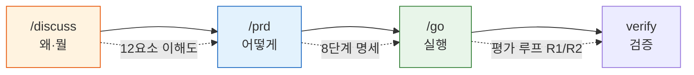
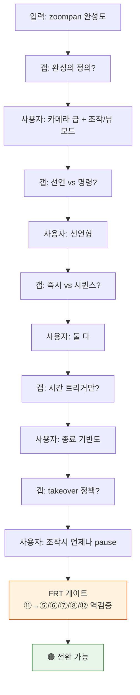
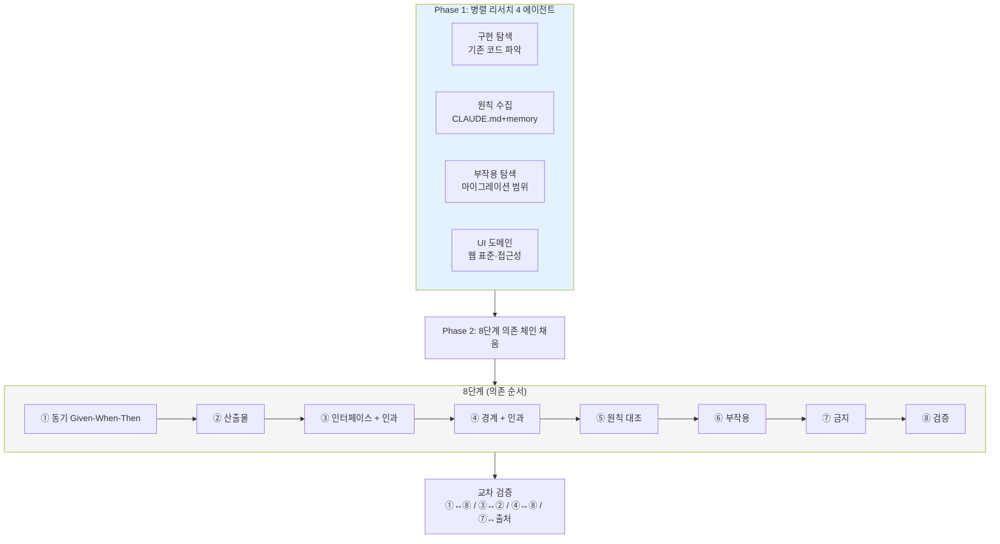
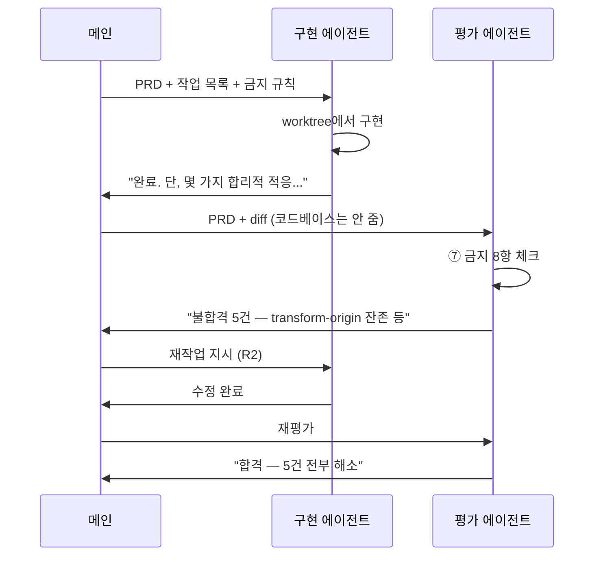
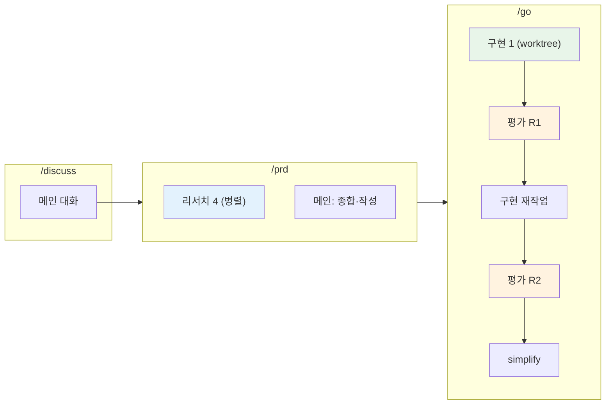
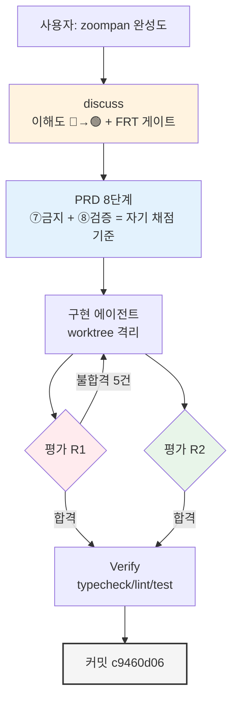

# Camera 프리미티브 — 어떻게 만들었는가

> 작성일: 2026-04-17
> 맥락: ZoomPane+ZoomPanCanvas 통합 작업(commit c9460d06)의 제작 과정 해설

> - 한 세션에서 discuss → PRD → go 3단 파이프라인으로 Camera를 만들었다
> - 메인은 코드를 쓰지 않았다. 4개 리서치 에이전트 + 1개 구현 에이전트 + 2라운드 평가 에이전트가 썼다
> - 왜 PRD를 거치고 평가 루프를 돌리는가? "한 번에 제대로"를 위해서다
> - 핵심 장치는 이해도 테이블(discuss)·FRT 게이트(transition)·8단계 PRD·평가 루프 4개다

---

## "한 번에 제대로" 원칙이 파이프라인을 강제했다

AI 협업에서 "빠르게 실패하고 고치자"는 작동하지 않는다. 코드는 revert해도 **대화 컨텍스트의 오염은 되돌아가지 않는다**. 그래서 실행 전에 디테일을 채우는 3단 파이프라인이 필요하다.

| 단계 | 입력 | 출력 | 역할 |
|------|------|------|------|
| discuss | "zoompan 완성도" | 12요소 이해도 테이블 + FRT 게이트 | 숨은 의도 추출 |
| prd | discuss 결과 | 8단계 PRD 파일 | 실행 가능한 명세 |
| go | PRD | 코드 + 커밋 | 자율 구현 |

→ 각 단계가 다음 단계의 입력을 **구조적으로 강제**한다. PRD 없이 go로 넘어가면 에이전트가 해석 여지를 독자적으로 메운다.

---

## Discuss가 "완성도" 한 단어에서 설계 결정 9개를 추출했다

대화를 시작할 때 사용자의 입력은 **"zoompan 완성도"** 4글자였다. 이 시점의 이해도는 20% 🔴였다. 12요소 이해도 테이블이 갭 질문을 생성하며 5턴 만에 🟢로 올라왔다.

5턴 동안 추출된 설계 결정:
1. 통합(ZoomPane+ZoomPanCanvas) / 2. 선언형+명령형 양쪽 / 3. interact/view 모드 분리 / 4. advance = time|end|signal / 5. target = Rect|Selector|Ref / 6. 사용자 조작 시 pause(α: 복귀 안 함) / 7. translate+scale 모델 / 8. autoplay 기본 true / 9. reduced-motion duration=0

→ 이 9개가 없었으면 에이전트가 9개 분기마다 추측했을 것이다.

---

## PRD 8단계가 에이전트 자율 실행을 가능하게 했다

Discuss 결과를 그대로 에이전트에 넘기면 "왜"만 있고 "어떻게"가 없다. PRD는 **③ 인터페이스 13행·④ 경계 9행·⑦ 금지 8항·⑧ 검증 12행**까지 명시해서 구현 여지를 좁혔다.

핵심은 **⑦ 금지 8항**이다. "하지 말 것"을 명시해서 평가 루프가 자동 체크리스트가 된다:
- #8 transform-origin 금지 → R1 평가에서 "L561 잔존" 감지
- #4 상수 duration 테이블 금지 → R1 평가에서 "400 폴백" 감지
- ②마이그레이션 명시 → R1 평가에서 "zoomActiveRef 12곳 잔존" 감지

→ PRD가 **자기 채점 기준**을 함께 제공하므로 평가 루프가 수렴한다.

---

## 평가 루프가 에이전트의 "합리적 적응"을 잡아냈다

구현 에이전트는 완료 보고에 "zoomActiveRef 유지 — 합리적 적응"이라고 썼다. PRD를 읽지 않은 평가자가 diff만 보고 판정했다.

**평가 에이전트에게 코드베이스를 주지 않은 이유**: 코드를 읽으면 맥락에 설득당해 관대해진다. diff + PRD만 주면 **PRD 위반**만 본다.

R1 감지한 5건 위반:
| # | 위반 | 출처 |
|---|------|------|
| 1 | transformOrigin 잔존 | ⑦#8 금지 |
| 2 | zoomActiveRef 미제거 | ②산출물·⑥#3·⑧#12 |
| 3 | duration 상수 폴백 | ⑦#4 금지 |
| 4 | setMode prop 중복 | ③#10 |
| 5 | Lightbox 경로 이탈 | ⑥#2 |

→ 전부 PRD 텍스트 grep만으로 잡히는 위반. 평가자는 코드 해석 없이 기계적으로 판정했다.

---

## 에이전트 7명이 병렬로 일했고 메인은 0줄 코드를 썼다

메인의 역할은 판단·디스패치·검증이다.

| 에이전트 | 역할 | 산출물 |
|----------|------|--------|
| 리서치 구현 탐색 | 기존 코드 파악 | 파일 맵 + 패턴 |
| 리서치 원칙 수집 | memory feedback | 관련 원칙 12개 |
| 리서치 부작용 | 마이그레이션 범위 | 영향 파일 목록 |
| 리서치 UI 도메인 | 웹 표준 | 입력 매핑·접근성 |
| 구현 | Camera.tsx + 마이그레이션 | 1172+ 라인 |
| 평가 R1 | PRD 대비 diff 채점 | 불합격 5건 |
| 평가 R2 | 재작업 검증 | 합격 |

**병렬 리서치의 효과**: 4개 에이전트가 동시에 다른 영역을 조사했다. 직렬로 했으면 4배 시간. 또한 각자 전문 영역만 보므로 보고서 품질이 높다.

→ 메인은 **오케스트레이터**. 텍스트 생성 비용은 에이전트가 지불하고, 메인은 컨텍스트를 보존한다.

---

## 최종 구조: 파이프라인이 곧 품질 게이트였다

각 게이트가 걸러낸 것:
- **discuss FRT 게이트** → 증거 필드 금지어("적절히"/"없음"/"TBD") 검사로 모호한 결론 차단
- **PRD 교차 검증** → ①↔⑧ 매핑·③↔② 일치성으로 구조적 누락 차단
- **평가 R1** → ⑦ 금지 위반 5건 기계적 감지
- **verify** → typecheck·lint로 마지막 회귀 차단

→ 각 게이트가 직전 단계의 오류를 잡으므로 **뒤로 갈수록 문제가 작아진다**. 이것이 "한 번에 제대로"의 실체다.

---

## 부록: 사용한 도구·스킬

- `/discuss` — 12요소 이해도 테이블
- `/prd` — 8단계 + 교차 검증
- `/go` — Cast→Execute→Verify 오케스트레이터
- Agent(general-purpose, Explore, code-simplifier) — 병렬 리서치·구현·평가
- isolation: worktree — 구현 에이전트 격리
- TaskCreate/TaskUpdate — 진행 추적
- Monitor — 장시간 명령 스트리밍

**커밋**: [c9460d06](c9460d06) `feat(ui): Camera 프리미티브 — ZoomPane/ZoomPanCanvas 통합` (12 files, +1172 / -392)
