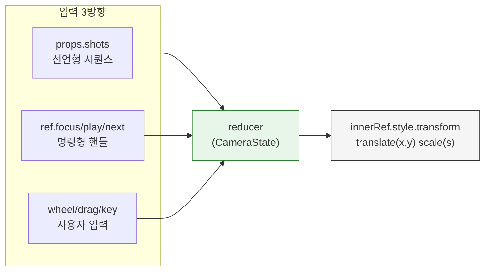
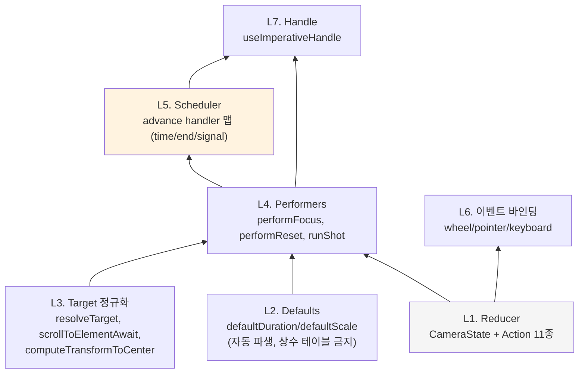
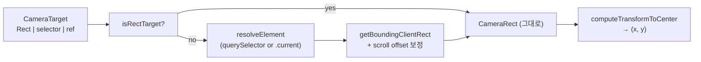
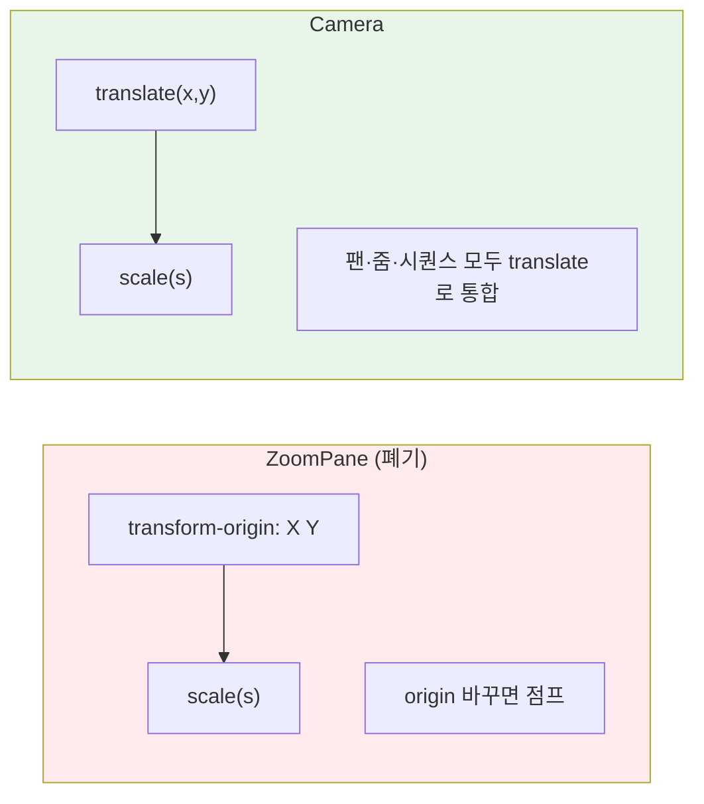
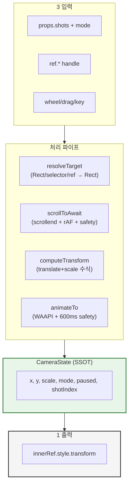

# Camera — 뷰포트 프리미티브 해설

> 작성일: 2026-04-17
> 대상: `src/interactive-os/ui/Camera.tsx` (598줄)

> - Camera는 **하나의 reducer**와 **translate+scale 변환**으로 3가지 뷰포트 역할을 수행한다
> - 외부 인터페이스는 **props(선언형) + ref(명령형) + 사용자 입력** 3방향이며 모두 동일 state에 모인다
> - 왜 분리된 두 컴포넌트(ZoomPane/ZoomPanCanvas)가 아니라 하나인가? 모든 변환이 같은 state·같은 DOM에 축적되기 때문이다
> - 내부 구조의 핵심은 **advance handler 맵**(switch 없는 shot 스케줄링)과 **WAAPI + 600ms safety**다

---

## 하나의 state가 3방향 입력을 받아 하나의 transform으로 수렴한다

Camera의 모든 동작은 `CameraState`로 수렴한다:

```ts
interface CameraState {
  x: number         // translate x
  y: number         // translate y
  scale: number     // scale factor
  mode: 'interact' | 'view'
  paused: boolean   // 시퀀스 일시정지 (shotIndex 보존)
  shotIndex: number // 현재 시퀀스 위치
  signalTick: number // advance:'signal' 감지용
}
```

3방향 입력:



**단일 수렴점**: 어느 방향에서 들어오든 결과는 `translate(x,y) scale(s)` 문자열 하나. 그래서 사용자가 드래그하다가 시퀀스가 넘어와도, 또는 시퀀스 중에 휠을 돌려도 상태가 깨지지 않는다.

→ 두 컴포넌트를 분리했던 이전 구조에서는 이 수렴이 불가능했다. 지금은 state 하나가 SSOT다.

---

## 외부 인터페이스: props로 선언, ref로 명령, DOM으로 조작

세 가지 사용 패턴이 있다.

### ① 선언형 (view 모드 + shots)

```tsx
<Camera mode="view" shots={[
  { target: '[data-line="10"]', advance: 'time', at: 0, scale: 1.5 },
  { target: '[data-line="20"]', advance: 'end', hold: 1000 },
  { target: '[data-line="30"]', advance: 'signal' },
]}>
  <CodeBlock />
</Camera>
```

마운트되면 shots[0]부터 순차 재생. `advance`가 다음 shot 트리거를 결정한다:
- `'time'` — `at` 타임라인 오프셋(ms)에 실행
- `'end'` — 직전 shot 애니메이션 완료 + `hold` ms 후
- `'signal'` — 외부에서 `ref.next()` 호출 전까지 대기

### ② 명령형 (ref handle)

```tsx
const cameraRef = useRef<CameraHandle>(null)
// ...
cameraRef.current?.focus('[data-line="42"]', { scale: 2, duration: 400 })
cameraRef.current?.reset()  // → (0, 0, 1)
cameraRef.current?.play()   // paused=false
cameraRef.current?.stop()   // shotIndex=0
cameraRef.current?.next()   // advance:'signal' cue
cameraRef.current?.setMode('interact')
```

`focus(target, opts)`가 핵심. target은 3종 유니온:

```ts
type CameraTarget = CameraRect | string /* selector */ | RefObject<HTMLElement>
```

내부에서 selector·ref는 `getBoundingClientRect()`로 Rect로 정규화된다.

### ③ DOM 조작 (interact 모드)

소비자가 아무것도 안 해도 사용자가 wheel·drag·키보드로 자유 조작:

| 입력 | 동작 |
|------|------|
| 휠 | 팬 (deltaX/Y) |
| 휠 + Ctrl | 줌 (포인터 중심) |
| 좌클릭 드래그 | 팬 |
| `+` / `-` | 줌 (10%) |
| 화살표 | 팬 (30px) |

**어느 입력이든 `paused: true` 디스패치**. 시퀀스가 돌고 있었으면 멈추고 `shotIndex`는 보존된다. "언제나 pause" 원칙(PRD ⑦#3).

→ 3개 소비자(FileViewer·Lightbox·replay)가 각자 자연스러운 패턴으로 쓴다. Lightbox는 `focus` + interact 모드, FileViewer/replay는 `focus`·`reset`을 delta 처리에서 호출.

---

## 내부 구조: 5개 모듈이 의존 사다리로 쌓였다

`Camera.tsx`의 598줄은 다음 순서로 의존한다:



### L1 Reducer — 11개 Action이 3방향 입력을 흡수한다

```ts
type Action =
  | { type: 'USER_PAN'; dx; dy }       // 휠/드래그/화살표
  | { type: 'USER_PAN_SET'; x; y }     // 드래그 절대 위치
  | { type: 'USER_ZOOM'; scale; x; y } // 휠+Ctrl/+/-
  | { type: 'PAUSE' | 'PLAY' | 'STOP' }
  | { type: 'SET_MODE'; mode }
  | { type: 'SHOT_END' }               // 시퀀스 진행
  | { type: 'SIGNAL' }                 // next() 호출
  | { type: 'FOCUS_APPLY'; x; y; scale } // 애니메이션 완료 후
  | { type: 'RESET' }
```

USER_* 는 `paused: true`를 **항상** 붙인다. reducer 레벨에서 불변식 보장.

### L2 Defaults — 자동 파생(상수 테이블 금지)

```ts
function deriveDurationFromDistance(distancePx: number): number {
  return Math.min(600, Math.max(200, 200 + distancePx * 0.5))
}
```

`shot.duration`이 없으면 viewport 중심 → target 중심 거리에서 200~600ms로 파생. `prefers-reduced-motion`이면 0. **`?? 400` 상수 폴백 금지**(PRD ⑦#4).

### L3 Target 정규화 — Rect로 단일화



추가로 `scrollToElementAwait`는 ZoomPane에서 이관됐다 — `scrollend` + rAF 폴링 + 600ms safety의 3중 대기. target이 viewport 밖에 있으면 먼저 스크롤 → 위치 재측정 → 그 다음 transform.

### L4 Performers — scroll → measure → animate 순차화

`performFocus`와 `runShot` 모두 동일 시퀀스:

```
1. resolveTargetWithRetry (rAF 1회 재시도)
2. (element 있으면) scrollToElementAwait
3. 재측정 (스크롤 후 rect 좌표 달라짐)
4. computeTransformToCenter → (x, y)
5. defaultDuration(distance)
6. animateTo (WAAPI + 600ms safety)
7. dispatch FOCUS_APPLY
```

→ target 부재 시 warn + skip(시퀀스는 다음 shot으로). 애니메이션 취소 시 safety 타임아웃이 구원.

### L5 Scheduler — switch 없는 handler 맵 (PRD ⑦#1)

```ts
const advanceHandlers: Record<ShotAdvance, AdvanceHandler> = {
  time: (shot, runShot, advanceShot) => {
    const timer = setTimeout(async () => {
      await runShot(shot); advanceShot()
    }, shot.at ?? 0)
    return () => clearTimeout(timer)
  },
  end: (shot, runShot, advanceShot) => {
    let cancelled = false
    runShot(shot).then(() => {
      if (!cancelled) setTimeout(advanceShot, shot.hold ?? 0)
    })
    return () => { cancelled = true }
  },
  signal: (shot, runShot, advanceShot) => {
    const startTick = stateRef.current.signalTick
    runShot(shot)
    const check = () => {
      if (stateRef.current.signalTick > startTick) advanceShot()
      else raf = requestAnimationFrame(check)
    }
    let raf = requestAnimationFrame(check)
    return () => cancelAnimationFrame(raf)
  },
}
```

각 handler는 (1) shot 실행, (2) 다음 shot 트리거, (3) cleanup 반환. `useEffect`가 `shotIndex` 변경 시 이 handler를 호출·cleanup.

**signal 방식의 트릭**: `signalTick`은 `ref.next()`마다 증가. handler는 시작 tick을 기억하고 rAF로 폴링. 렌더 루프에 묶이지 않고 cheap.

### L6 이벤트 바인딩 — `passive: false`로 휠 preventDefault

```ts
el.addEventListener('wheel', onWheel, { passive: false })
```

React 합성 이벤트로는 wheel preventDefault가 안 돼서 native listener 사용. `touchAction: 'none'`으로 터치 제스처 차단. pointer capture로 드래그가 버튼 밖으로 나가도 유지.

### L7 Handle — imperative SSOT

```ts
useImperativeHandle(ref, () => ({
  focus, play, stop, next, setMode, pause, reset,
}), [performFocus, performReset])
```

`props.mode`는 **초기값**으로만 사용되고, 이후는 `handle.setMode`가 유일 경로. `useEffect([mode])` dispatch 없음 — 그걸 넣으면 imperative setMode가 override됨.

→ 598줄이지만 레이어별 책임이 명확해서 독립 수정 가능.

---

## 왜 translate+scale인가 — transform-origin을 버린 이유

이전 ZoomPane은 `transform-origin: Xpx Ypx; transform: scale(s)` 모델이었다. 이 경우 사용자가 팬하려면 origin을 움직여야 하는데, origin은 시각적으로 불연속 점프를 만든다. 그래서 Camera는 **translate + scale**로 수렴했다.

`computeTransformToCenter`의 수식:

```
rect 중심 (cx, cy)을 container 중심으로 옮기는 transform:
  post-transform: (px, py) → (x + px*scale, y + py*scale)
  조건: x + cx*scale = cr.width/2
  → x = cr.width/2 - cx*scale
  → y = cr.height/2 - cy*scale
```

scale은 항상 `(0,0)` 기준. 원하는 중심점 보정은 translate가 흡수. 사용자 드래그는 `translate(x+dx, y+dy)`로 그대로 누적.



→ `translate: Math.round(px)` + `will-change: transform` 조합으로 subpixel 블러도 억제(PRD ⑥#4).

---

## 소비 사례 — 3개 컴포넌트가 각자 다르게 쓴다

### FileViewer — ref 명령형만

```tsx
const zoomRef = useRef<CameraHandle>(null)
// dispatch가 command를 풀어 ref 호출
case 'zoom': zoomRef.current?.focus(`[data-line="${cmd.line}"]`, { scale: cmd.scale })
case 'zoom-reset': zoomRef.current?.reset()
return <Camera ref={zoomRef}>{code}</Camera>
```

replay delta가 `{type:'zoom', line, scale}` 커맨드를 dispatch → Camera handle 호출. mode는 기본 `'interact'`지만 FileViewer는 사용자 조작 없이 프로그래밍 focus만 쓴다.

### Lightbox — interact 모드 + 초기 focus

```tsx
const cameraRef = useRef<CameraHandle>(null)
useEffect(() => {
  cameraRef.current?.focus(rect, { scale: initialScale, duration: 0 })
}, [])
return <Camera ref={cameraRef} mode="interact">{svg}</Camera>
```

마운트 시 한 번 fit, 이후 사용자 휠/드래그만. `duration: 0`으로 즉시 적용.

### replay — Camera는 FileViewer 경유

PageReplay/SessionDetailModal은 Camera를 **직접 쓰지 않는다**. FileViewer가 포함하고 있으므로 `fileViewerRef.dispatch({type:'zoom', ...})`만 호출. 이전 `zoomActiveRef` 플래그가 사라졌다.

→ 같은 컴포넌트가 "수동 뷰어", "자동 피팅 캔버스", "시퀀스 플레이어" 3가지로 변신한다. 모드 prop과 입력 경로(shots/ref/user)의 조합 덕분.

---

## 요약: 598줄의 본질은 "하나의 state, 세 입력, 한 수렴점"이다



설계 원칙이 구현을 강제한 지점:
| 원칙 | 구현 |
|------|------|
| 선언적 OCP (⑦#1) | advance = handler 맵 (switch 없음) |
| 자동 파생 (⑦#4) | deriveDurationFromDistance (상수 테이블 없음) |
| 언제나 pause (⑦#3) | 모든 USER_* action이 `paused: true` 강제 |
| translate 모델 (⑦#8) | computeTransformToCenter 수식으로 origin 제거 |
| Focus 결과 지향 | target 부재 시 rAF 재시도 → warn+skip |

→ Camera는 단순히 "줌+팬" 컴포넌트가 아니라, **3방향 입력을 하나의 transform으로 수렴시키는 상태 기계**다.

#kind/explain
