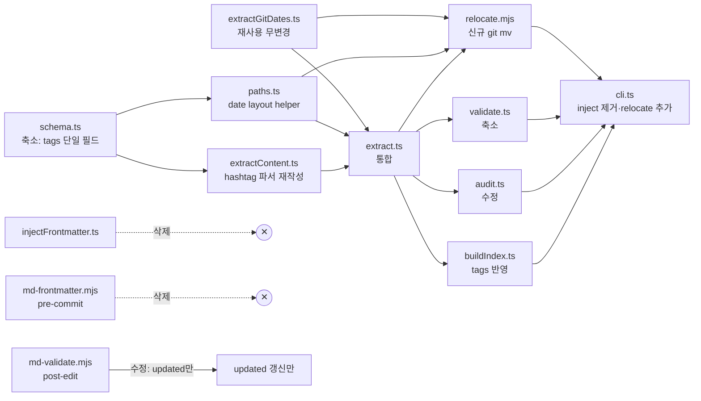

# mddb lite — PRD

> **⚠ SUPERSEDED (2026-04-19)** — 본 PRD의 "마지막 줄 hashtag = SSOT" 규약은 폐기됨. `docs/2026/2026-04/2026-04-19/mdPathPolicyMigrationPrd.md`로 교체. 근거: frontmatter SSOT가 SSG/CMS 생태계 사실상 표준 (Jekyll/Hugo/Astro/Docusaurus/Obsidian Properties/Hashnode). 본 문서는 역사 기록용으로 보존.

> **Discussion**: 2026-04-18 discuss (13요소 🟢 + FRT 게이트 6/6 🟢)
> **산출물 유형**: 스크립트·훅 (scripts + hooks)
> **규모 추정**: 신규 1 / 수정 7 / 삭제 2 / 재사용 9
> **Scope**: `scripts/mddb/*` + `.claude/hooks/md-*.mjs` + 335 md 이동 1회성. 뷰어 확장·링크 fix는 Phase B backlog

## §0 컨텍스트 (discuss 13요소 압축)

| # | 요소 | 요약 |
|---|------|------|
| 1 | 목적 | 물리=연월일 immovable / 논리=하단 hashtag / "과하지 않게" |
| 2 | 배경 | mddb Phase 1(커밋 `a1e72aac`) PARA 이동식 + inject 자동주입이 과잉. 실측 355 md / created 커버리지 100% |
| 3 | 이상적 결과 | `docs/YYYY/YYYY-MM/YYYY-MM-DD/{slug}.md` + 파일 끝 `#kind/...` 줄 + 최소 인프라 |
| 4 | 현실 | Phase 1 18 파일 커밋 / PARA 폴더 `0-inbox~4-archive` 335 md / `/viewer/docs/*` |
| 5 | 문제 | PARA = 파일 이동 강제 / inject = 대규모 자동화 부담 / virtual view 기반 부재 |
| 6 | 원인 | 물리=논리 일체화 / mddb가 PARA 전제로 설계 / 파생 레이어 없음 |
| 7 | 제약 | 335 md 이동 / `memory/` 격리 / `/viewer` 유지 / hashtag 정규식 정밀도 / `git --follow` 휴리스틱 보호 |
| 8 | 보유 자산 | `extractGitDates.ts`·`paths.ts`·schema Zod·`knowledgeTransform.ts`·`/viewer`·TreeGrid·createStore |
| 9 | 외부 탐색 | Logseq journals+tags + Zettelkasten 보관 + Mastodon/Obsidian 정규식 교집합 + Hugo page bundles |
| 10 | 목표 | 스키마 축소 / hashtag 파서 / relocate / inject 폐기 |
| 11 | 해결 | A 이동(relocate)·B 파서(extractContent 재작성)·D 인프라 축소(inject 폐기) |
| 12 | 부작용 | 링크 335건 다수 깨짐 → Phase B / rename 커밋 `--follow` 영향 → rename-only 커밋 분리 / 정규식 오탐 → Mastodon+Obsidian 교집합 |
| 13 | 장애물 | 미커밋 2건 선처리 / Phase 1 의존 제거 / 기존 `md-frontmatter.mjs` 훅 폐기 |

**실측 분포 (extract 기준):**
- 총 355 md / created 100% (git/filename/mtime 체인)
- 월 폴더 2개 (218·137), 일 폴더 32개 (평균 11, 최대 31)
- 일 폴더가 AI 폭증(하루 20-30) 흡수 → 3단 구조 유효

---

## §1 책임 분해

| # | 책임 | 파일 경로 | 레이어 | 기존/신규 | 의존 |
|---|------|----------|-------|----------|------|
| 1 | 스키마 축소 (hashtag 기반 `tags` 단일 필드) | `scripts/mddb/schema.ts` | scripts | 수정 | — |
| 2 | hashtag 파서 (마지막 비공백 줄 정규식) | `scripts/mddb/extractContent.ts` | scripts | 재작성 (≤30줄 본체) | 1 |
| 3 | git 최초/최종 커밋 날짜 | `scripts/mddb/extractGitDates.ts` | scripts | 재사용 (무변경) | — |
| 4 | 경로 유틸 + `YYYY/YYYY-MM/YYYY-MM-DD/` 판정 | `scripts/mddb/paths.ts` | scripts | 수정 (date layout helper 추가) | — |
| 5 | extract 통합 (파일 1건 → DocIndexEntry) | `scripts/mddb/extract.ts` | scripts | 수정 (FOLDER_STATUS 제거) | 1,2,3,4 |
| 6 | validate (경로·hashtag 정규식만) | `scripts/mddb/validate.ts` | scripts | 수정 (스키마 불일치 로직 축소) | 1,5 |
| 7 | audit (hashtag 커버리지·일 분포) | `scripts/mddb/audit.ts` | scripts | 수정 (리포트 필드 교체) | 5 |
| 8 | relocate — git mv로 date 경로 이동 | `scripts/mddb/relocate.mjs` | scripts | 신규 (≤100줄) | 3,4,5 |
| 9 | CLI (inject 서브커맨드 제거, relocate 추가) | `scripts/mddb/cli.ts` | scripts | 수정 | 5,6,7,8 |
| 10 | inject 폐기 | `scripts/mddb/injectFrontmatter.ts` | scripts | 삭제 | — |
| 11 | buildIndex (MddbIndex `tags` 반영) | `scripts/mddb/buildIndex.ts` | scripts | 수정 | 5 |
| 12 | pre-commit 주입 훅 폐기 | `.claude/hooks/md-frontmatter.mjs` | hooks | 삭제 | — |
| 13 | post-edit `updated` 훅 (frontmatter 있을 때만) | `.claude/hooks/md-validate.mjs` | hooks | 수정 (하드블록 없음, updated만 갱신) | — |

### 탐색 증거

- `Glob src/pages/viewer/**/*.{ts,tsx}` → `knowledgeTransform.ts`가 이미 `topic`/`kind`/`status` pivot 엔진. date 축 확장은 Phase B로 분리 (PRD 범위 외)
- `Glob src/interactive-os/pattern/*.ts` → `composePattern.ts` 확인. Phase B 때 재검토
- `ls .claude/hooks/` → `md-frontmatter.mjs`·`md-validate.mjs` 확인. 훅은 이 2개만 mddb 관련
- `ls scripts/mddb/` → 11 파일 전수 확인. 신규는 `relocate.mjs` 1개
- `CATALOG.md` ui 섹션 → 뷰어 확장 Phase B 시 `TreeGrid`·`Kanban`·`ListBoxGrouped` 후보

**완성도**: 🟢 (모든 행 1파일 1책임, 의존 순환 없음, 레이어 역방향 없음)

---

## §2 Contract

### `scripts/mddb/schema.ts` (수정)

```ts
import { z } from 'zod'

/**
 * @invariant DocFrontmatterSchema.strict — 알 수 없는 필드는 legacy.*
 * @invariant tags 는 hashtag 토큰 배열 (# 접두어 제거됨)
 * @invariant status/kind/topics 는 tags에서 prefix 필터링으로 파생
 */
export const DocFrontmatterSchema = z.object({
  id: z.string().min(1),
  title: z.string().min(1),
  created: z.string().regex(/^\d{4}-\d{2}-\d{2}$/),
  updated: z.string().regex(/^\d{4}-\d{2}-\d{2}$/),
  summary: z.string().optional(),
  tags: z.array(z.string()).default([]),
  legacy: z.record(z.string(), z.unknown()).optional(),
}).strict()

export type DocFrontmatter = z.infer<typeof DocFrontmatterSchema>

export const HASHTAG_LINE_RE =
  /^#[\p{L}\p{N}_\/\-]+(\s+#[\p{L}\p{N}_\/\-]+)*\s*$/u

export const HASHTAG_TOKEN_RE = /^#([\p{L}\p{N}_\/\-]+)$/u

export const DATE_FOLDER_RE = /^(\d{4})\/\1-(\d{2})\/\1-\2-(\d{2})\//

export const EXTRACT_SOURCES = [
  'explicit', 'content', 'git', 'mtime', 'filename',
] as const
export type ExtractSource = typeof EXTRACT_SOURCES[number]

export type FieldProvenance = {
  value: unknown
  source: ExtractSource
  confidence: 'high' | 'low'
}

export type ExtractWarning = {
  code:
    | 'missing-frontmatter'
    | 'schema-invalid'
    | 'date-path-mismatch'
    | 'hashtag-line-malformed'
    | 'numeric-only-hashtag'
    | 'untracked-mtime-fallback'
    | 'legacy-field-preserved'
    | 'created-after-updated'
    | 'duplicate-id'
  field?: keyof DocFrontmatter
  message: string
  severity: 'error' | 'warn' | 'info'
}

export type ExtractResult = {
  path: string
  frontmatter: DocFrontmatter
  provenance: Partial<Record<keyof DocFrontmatter, FieldProvenance>>
  warnings: ExtractWarning[]
}
```

**폐기**: `STATUS_VALUES`, `KIND_VALUES`, `FOLDER_STATUS_MAP`, `FILENAME_KIND_PATTERNS`, `TAG_KIND_MAP`, `LEGACY_FIELD_RENAMES` 중 `created`/`title`만 남기고 축소.

### `scripts/mddb/extractContent.ts` (재작성)

```ts
import { parse as parseYaml } from 'yaml'
import { HASHTAG_LINE_RE, HASHTAG_TOKEN_RE } from './schema.ts'

const FRONTMATTER_RE = /^---\r?\n([\s\S]*?)\r?\n---\r?\n?([\s\S]*)$/

export type ContentExtract = {
  title?: string
  tags: string[]
  rawFrontmatter?: Record<string, unknown>
  body: string
  hasFrontmatterBlock: boolean
  frontmatterParseError?: string
}

/**
 * @invariant pure sync
 * @invariant tags 는 파일 마지막 비공백 줄이 HASHTAG_LINE_RE 매칭 시에만 추출
 * @invariant 토큰 중 1개라도 숫자-only면 전체 줄 tag 라인 아님 (GitHub `#123` 충돌)
 */
export function extractContent(source: string): ContentExtract
```

### `scripts/mddb/paths.ts` (확장)

```ts
import { DATE_FOLDER_RE } from './schema.ts'

/** '2026/2026-04/2026-04-18/handoff-foo.md' → { year: '2026', month: '2026-04', day: '2026-04-18' } */
export function parseDatePath(relPath: string): { year: string; month: string; day: string } | null

/** YYYY-MM-DD → 'YYYY/YYYY-MM/YYYY-MM-DD' 경로 세그먼트 */
export function dateToFolder(isoDate: string): string
```

(`isDocsMd`, `isMemoryPath`, `folder0`, `toRelDocsPath`, `walkDocsMd` 유지)

### `scripts/mddb/relocate.mjs` (신규 ≤100줄)

```js
/**
 * @invariant 단일 커밋 rename-only — 내용 수정 동시 금지 (git --follow 보호)
 * @invariant --dry-run 없이 실행 시 working tree clean 강제
 * @invariant 이미 날짜 경로에 있는 파일(DATE_FOLDER_RE 매칭)은 skip
 * @invariant memory/ 경로는 절대 대상 아님 (isMemoryPath 가드)
 */
export async function relocate(opts: {
  dryRun: boolean
  scope?: string
}): Promise<{
  total: number
  planned: Array<{ from: string; to: string; source: ExtractSource }>
  skipped: Array<{ path: string; reason: string }>
}>
```

### `scripts/mddb/cli.ts` (수정)

```ts
// subcommand 'inject' 제거, 'relocate' 추가
export type CliArgs = {
  subcommand: 'extract' | 'validate' | 'audit' | 'relocate' | 'index'
  positionals: string[]
  flags: {
    dryRun?: boolean
    concurrency?: number
    outPath?: string
    json?: boolean
    scope?: string
  }
}
```

**완성도**: 🟢 (모든 신규·재작성 contract 명시, Placeholder 0)

---

## §3 WHY

**근본 이유**: discuss ⑥ 원인 3건 — "물리=논리 일체화 / inject 전제 / 파생 레이어 부재" — 중 앞의 2개를 이 PRD가 해소한다. 세 번째(파생 레이어 = 뷰어 virtual tree 확장)는 Phase B backlog.

**책임 분해 정당성**:
- 스키마(#1)를 먼저 축소해야 extract(#5)·validate(#6)·audit(#7)이 동시에 단순해짐 — 역방향이면 임시 어댑터 코드 발생
- 파서(#2) 재작성과 relocate(#8) 신규는 서로 독립. 병렬 가능
- CLI(#9)는 모든 하위 의존이 끝난 뒤 라우팅만 갱신 — 자연 마지막 단계
- 훅 삭제(#12)·폐기(#10)는 별도 사이드 이펙트 없음. 가장 먼저 또는 가장 나중 어디든 가능

**의존 순서 일관성**: store → engine → ... 레이어 역방향 없음 (전부 scripts/hooks 레이어 내부).

---

## §4 HOW



**상호작용 흐름 (실행 순)**:
1. `pnpm mddb:extract --dry-run` → 재정렬된 스키마로 전체 355 md 통과 검증
2. `pnpm mddb:audit` → hashtag 커버리지 리포트 (현재 0% 예상, Phase C에 소급)
3. `pnpm mddb:relocate --dry-run` → 이동 계획 JSON preview
4. `pnpm mddb:relocate` → rename-only 단일 커밋 생성
5. inject·pre-commit 훅 폐기 커밋 (별도)

---

## §5 WHAT (의존 순서)

### W1. schema.ts 축소 (§1.1)

**의존**: —
**파일**: `scripts/mddb/schema.ts`

(§2 Contract의 schema.ts 본체 참조. `STATUS_VALUES`·`KIND_VALUES`·`FOLDER_STATUS_MAP`·`FILENAME_KIND_PATTERNS`·`TAG_KIND_MAP` 5개 export 삭제. `DocFrontmatterSchema`에서 `status`/`kind`/`topics`/`parent`/`relates`/`supersedes`/`superseded_by` 필드 제거, `tags` 추가. `ExtractWarning.code`에서 PARA 관련 코드 제거 + hashtag 코드 추가.)

**검증**: vitest unit — `DocFrontmatterSchema.parse({ id, title, created, updated, tags: ['#kind/prd'] })` 통과. `HASHTAG_LINE_RE.test('#kind/prd #topic/viewer')` true. `HASHTAG_LINE_RE.test('## 제목')` false.

### W2. paths.ts — date layout helper (§1.4)

**의존**: W1
**파일**: `scripts/mddb/paths.ts`

```ts
import { DATE_FOLDER_RE } from './schema.ts'

export function parseDatePath(relPath: string): { year: string; month: string; day: string } | null {
  const m = DATE_FOLDER_RE.exec(relPath)
  if (!m) return null
  const [, year, mm, dd] = m
  return { year, month: `${year}-${mm}`, day: `${year}-${mm}-${dd}` }
}

export function dateToFolder(isoDate: string): string {
  const m = /^(\d{4})-(\d{2})-(\d{2})$/.exec(isoDate)
  if (!m) throw new Error(`dateToFolder: invalid date ${isoDate}`)
  const [, y, mm, dd] = m
  return `${y}/${y}-${mm}/${y}-${mm}-${dd}`
}
```

**검증**: vitest unit — `dateToFolder('2026-04-18') === '2026/2026-04/2026-04-18'`. `parseDatePath('2026/2026-04/2026-04-18/foo.md')` → 3-tuple 반환.

### W3. extractContent.ts 재작성 (§1.2)

**의존**: W1
**파일**: `scripts/mddb/extractContent.ts`

```ts
import { parse as parseYaml } from 'yaml'
import { HASHTAG_LINE_RE, HASHTAG_TOKEN_RE } from './schema.ts'

const FRONTMATTER_RE = /^---\r?\n([\s\S]*?)\r?\n---\r?\n?([\s\S]*)$/

export type ContentExtract = {
  title?: string
  tags: string[]
  rawFrontmatter?: Record<string, unknown>
  body: string
  hasFrontmatterBlock: boolean
  frontmatterParseError?: string
}

export function extractContent(source: string): ContentExtract {
  const result: ContentExtract = { tags: [], body: source, hasFrontmatterBlock: false }

  const fm = FRONTMATTER_RE.exec(source)
  if (fm) {
    result.hasFrontmatterBlock = true
    result.body = fm[2]
    try {
      const parsed = parseYaml(fm[1])
      if (parsed && typeof parsed === 'object' && !Array.isArray(parsed)) {
        result.rawFrontmatter = parsed as Record<string, unknown>
      }
    } catch (e) {
      result.frontmatterParseError = (e as Error).message
    }
  }

  const lines = result.body.split('\n')
  for (let i = 0; i < lines.length; i++) {
    const m = lines[i].match(/^# +(.+?)\s*$/)
    if (m) { result.title = m[1].trim(); break }
  }

  for (let i = lines.length - 1; i >= 0; i--) {
    const trimmed = lines[i].trim()
    if (!trimmed) continue
    if (!HASHTAG_LINE_RE.test(trimmed)) break
    const tokens = trimmed.split(/\s+/)
    if (tokens.some((t) => /^#\d+$/.test(t))) break
    const values: string[] = []
    let valid = true
    for (const t of tokens) {
      const mm = HASHTAG_TOKEN_RE.exec(t)
      if (!mm) { valid = false; break }
      values.push(mm[1])
    }
    if (valid) result.tags = values
    break
  }

  return result
}

export { stringifyFrontmatter } from './extractContent.legacy.ts'
// NOTE: 기존 stringifyFrontmatter 유지 필요 시 legacy 모듈로 분리. inject 폐기되면 stringifyFrontmatter도 미사용 → 함께 삭제 예정
```

**검증**: vitest unit — 입력 `"본문\n\n#kind/prd #topic/viewer\n"` → tags `['kind/prd', 'topic/viewer']`. 입력 `"본문\n\n## 마지막 섹션\n"` → tags `[]`. 입력 `"본문\n#123\n"` → tags `[]` (숫자-only).

### W4. extract.ts 통합 수정 (§1.5)

**의존**: W1, W2, W3
**파일**: `scripts/mddb/extract.ts`

- `FOLDER_STATUS_MAP`·`FILENAME_KIND_PATTERNS` 참조 제거
- `extractContent` 반환의 `tags`를 frontmatter로 그대로 주입 (provenance `source: 'content'`)
- 경로 검증: `parseDatePath(relPath)`가 null이면 `date-path-mismatch` warning (severity: `warn`)
- `id` 파생: slug from filename (`path.basename(relPath, '.md')`)
- git 날짜는 `extractGitDates(absPath)` 호출 (재사용)

**검증**: `pnpm --silent mddb:extract 2>/dev/null | jq '.[0]'` → `frontmatter.tags` 필드 존재, PARA 필드 부재.

### W5. validate.ts 축소 (§1.6)

**의존**: W1, W4
**파일**: `scripts/mddb/validate.ts`

- 유지: `schema-invalid`, `duplicate-id`, `created-after-updated`, `untracked-mtime-fallback`
- 추가: `date-path-mismatch` (W4에서 warning 집계), `hashtag-line-malformed` (마지막 줄이 `#`로 시작했으나 regex 미매칭)
- 삭제: `status-folder-mismatch`, `kind-filename-mismatch`, `supersede-cycle`, `parent-not-found`, `superseded-by-not-found`, `self-relate`, `future-date`, `topic-fallback-empty`

**검증**: `pnpm --silent mddb:validate 2>/dev/null | head -20` → warning 코드 목록이 위 변경과 일치.

### W6. audit.ts 수정 (§1.7)

**의존**: W4
**파일**: `scripts/mddb/audit.ts`

리포트 섹션 교체:
- PARA 폴더 분포 → `parseDatePath` 성공/실패 비율
- frontmatter 커버리지 % → hashtag 커버리지 % + 일자별 파일 수 히스토그램
- status-folder 경고 → `date-path-mismatch` 집계

**검증**: `pnpm mddb:audit` 실행 → 일 폴더 32개, 파일 355개 리포트 렌더 확인.

### W7. buildIndex.ts 수정 (§1.11)

**의존**: W4
**파일**: `scripts/mddb/buildIndex.ts`

`MddbIndex` entry frontmatter 타입에서 `status`/`kind`/`topics` 필드 제거, `tags: string[]` 추가. JSON 출력 포맷 변경.

**검증**: `pnpm mddb:index --out /tmp/idx.json` → JSON에 `tags` 배열 포함, PARA 필드 부재.

### W8. relocate.mjs 신규 (§1.8)

**의존**: W2, W4, `extractGitDates.ts`
**파일**: `scripts/mddb/relocate.mjs`

```js
#!/usr/bin/env node
/**
 * @invariant rename-only 단일 커밋 — 내용 수정 금지 (git --follow 보호)
 * @invariant --dry-run 없이 실행 시 working tree clean 강제
 * @invariant memory/ 경로는 isMemoryPath 가드로 스킵
 */
import { execSync } from 'node:child_process'
import { resolve, dirname, basename } from 'node:path'
import { mkdirSync, existsSync } from 'node:fs'
import { walkDocsMd, parseDatePath, dateToFolder, toRelDocsPath, PROJECT_ROOT, DOCS_ROOT, isMemoryPath } from './paths.ts'
import { extractGitDates } from './extractGitDates.ts'
import { extractContent } from './extractContent.ts'
import { readFile } from 'node:fs/promises'

export async function planRelocate(opts = {}) {
  const files = walkDocsMd(DOCS_ROOT)
  const planned = []
  const skipped = []

  for (const rel of files) {
    const abs = resolve(DOCS_ROOT, rel)
    if (isMemoryPath(abs)) { skipped.push({ path: rel, reason: 'memory' }); continue }
    if (parseDatePath(rel)) { skipped.push({ path: rel, reason: 'already-dated' }); continue }

    const src = await readFile(abs, 'utf8')
    const { rawFrontmatter } = extractContent(src)
    const explicitCreated = typeof rawFrontmatter?.created === 'string'
      && /^\d{4}-\d{2}-\d{2}$/.test(rawFrontmatter.created)
      ? rawFrontmatter.created : null

    let created = explicitCreated
    let source = explicitCreated ? 'explicit' : ''
    if (!created) {
      const gd = await extractGitDates(abs)
      created = gd.created
      source = gd.source
    }

    const base = basename(rel)
    const to = `${dateToFolder(created)}/${base}`
    if (to === rel) { skipped.push({ path: rel, reason: 'noop' }); continue }
    planned.push({ from: rel, to, source })
  }

  return { total: files.length, planned, skipped }
}

export async function relocate({ dryRun = false } = {}) {
  if (!dryRun) {
    const porcelain = execSync('git status --porcelain', { cwd: PROJECT_ROOT, encoding: 'utf8' })
    if (porcelain.trim()) throw new Error('relocate: working tree dirty — commit or stash first')
  }
  const plan = await planRelocate()
  for (const { from, to } of plan.planned) {
    const fromAbs = resolve(DOCS_ROOT, from)
    const toAbs = resolve(DOCS_ROOT, to)
    if (dryRun) continue
    mkdirSync(dirname(toAbs), { recursive: true })
    execSync(`git mv ${JSON.stringify(`docs/${from}`)} ${JSON.stringify(`docs/${to}`)}`, { cwd: PROJECT_ROOT })
  }
  return plan
}
```

**검증**: `pnpm mddb:relocate --dry-run --json | jq '.planned | length'` → 수백 건 예상. `jq '.planned[0]'` → `{ from: "0-inbox/...", to: "2026-04-18/...", source: "git" }` 형태.

### W9. cli.ts 수정 (§1.9)

**의존**: W4, W5, W6, W7, W8
**파일**: `scripts/mddb/cli.ts`

- `KNOWN_SUBCOMMANDS`에서 `'inject'` 제거, `'relocate'` 추가
- `injectSubcommand` 삭제, `relocateSubcommand` 추가
- `import { injectFrontmatter }` 삭제

**검증**: `pnpm mddb:relocate --dry-run` 정상 실행. `pnpm mddb:inject` → unknown subcommand 에러.

### W10. injectFrontmatter.ts 삭제 (§1.10)

**의존**: W9 (cli 참조 제거 후)
**파일**: `scripts/mddb/injectFrontmatter.ts` → `git rm`

**검증**: `pnpm typecheck` 통과 (다른 곳에서 import 없음을 확인).

### W11. md-frontmatter.mjs 삭제 (§1.12)

**의존**: —
**파일**: `.claude/hooks/md-frontmatter.mjs` → `git rm`

`.claude/settings.json` matcher에서도 해당 훅 참조 제거.

**검증**: `git commit` 시 신규 md 파일에 자동 주입이 일어나지 않는지 확인.

### W12. md-validate.mjs 수정 (§1.13)

**의존**: W3
**파일**: `.claude/hooks/md-validate.mjs`

- frontmatter 블록이 있으면 `updated: YYYY-MM-DD`만 오늘 날짜로 갱신
- frontmatter 없으면 무동작
- tag 파싱/삽입 같은 하드 블록 로직 전면 제거

**검증**: `.md` 파일 수정 후 커밋 → 기존 frontmatter의 `updated`만 바뀜, 본문 hashtag 줄 무변경.

### W13. package.json + 문서 업데이트

**의존**: W9, W11
**파일**: `package.json`, `CLAUDE.md` (FE 책임 맵 하단에 "시간축 폴더·하단 hashtag 컨벤션" 항목 추가)

```jsonc
{
  "scripts": {
    "mddb:relocate": "tsx scripts/mddb/cli.ts relocate"
    // "mddb:inject" 제거
  }
}
```

**검증**: `pnpm mddb:relocate --dry-run --json` 정상 종료.

---

## §6 원칙 감시자 결과

1. **CLAUDE.md 규약**: 파일명 규칙 준수 (`extractContent.ts`·`relocate.mjs` 모두 주 export와 일치). 레이어 역방향 없음 (scripts/hooks 내부)
2. **memory feedback**: `feedback_minimum_impl_is_good`·`feedback_readonly_default`·`feedback_atomic_restructure` 준수. 대량 rename은 W8 단일 커밋
3. **CATALOG.md 탐색 증거**: §1 탐색 증거 블록에 기재
4. **Placeholder**: 0 (모든 contract 구체 signature)
5. **1파일 1책임**: 13행 모두 단일 책임. `schema.ts`는 "스키마 SSOT"라는 단일 책임의 축소판

**위반 0건. 전체 완성도 🟢.**

---

## §7 Phase B backlog (이 PRD 범위 외)

- `src/pages/viewer/knowledgeTransform.ts` 확장 — `KnowledgeGroupBy`에 `date-month`·`date-week`·`date-day` 축 추가
- `scripts/mddb/fixLinks.mjs` (≤100줄) — relocate 후 내부 상대 링크 일괄 치환
- `remark-validate-links` CI 도입 (PR에서 깨진 링크 차단)
- hashtag 소급 — 기존 PARA 폴더명(0-inbox 등)을 `#status/inbox`로 본문 끝 주입하는 1회성 스크립트
- Phase 1 의존 제거 확인 — `docs/0-inbox/handoff-2026-04-18-mddb-phase1.md`·`docs/0-inbox/mddb-audit-2026-04-18.md` 정합성 검토

---

**전체 완성도**: 🟢

#kind/prd #topic/docs-infra
