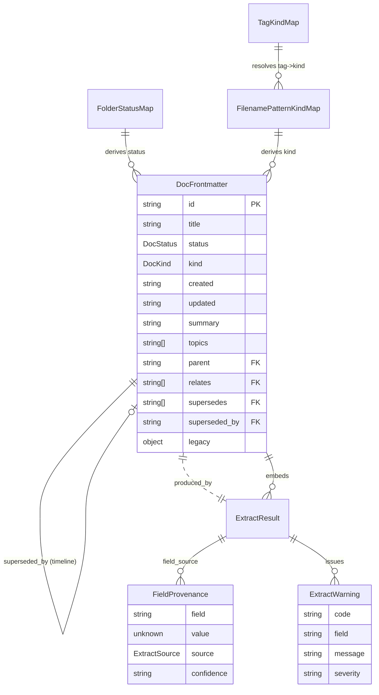
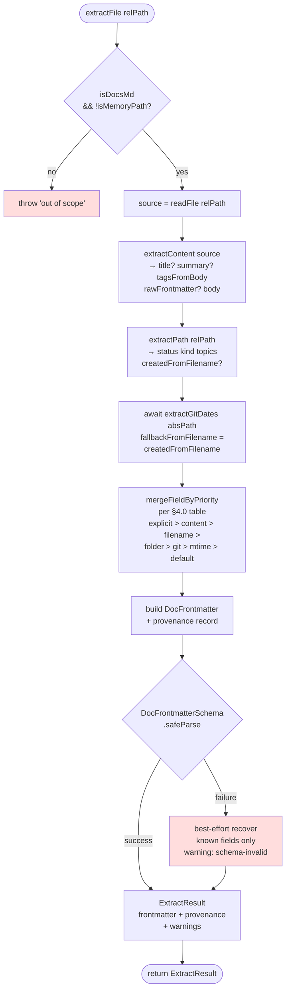
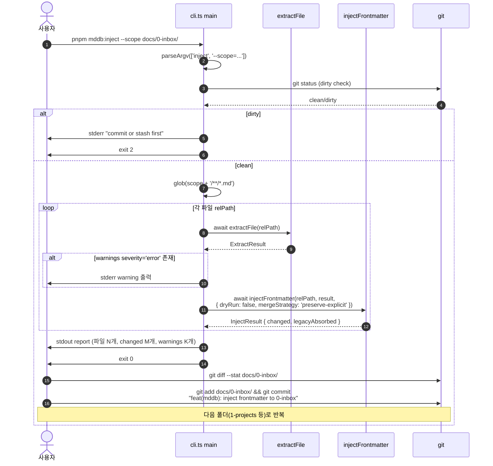
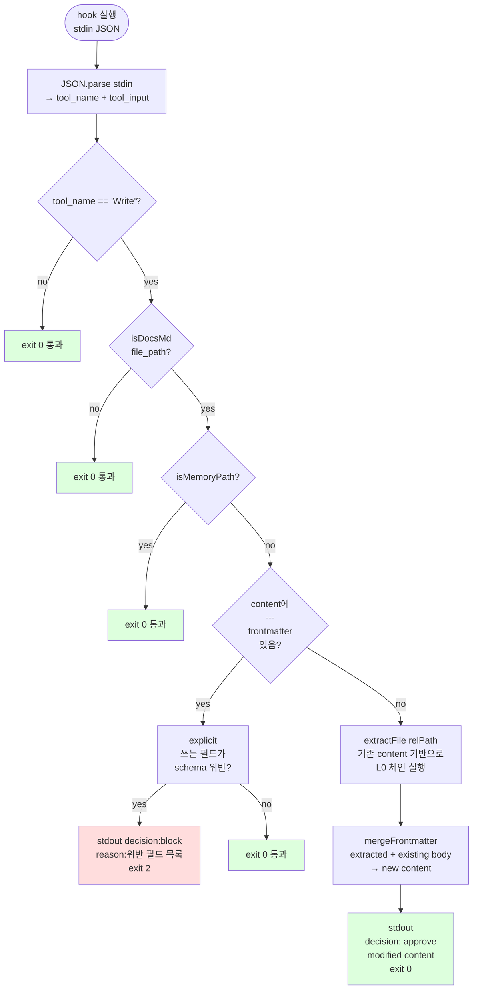
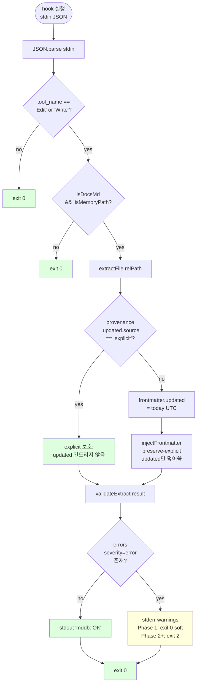
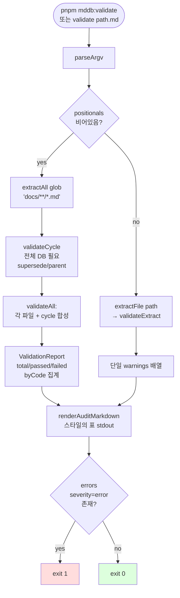
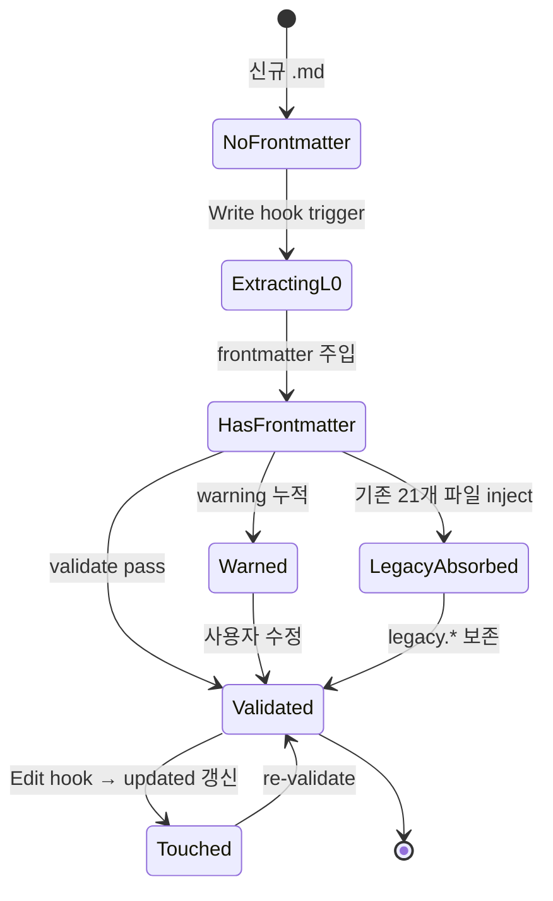

# mddb Phase 1 — L0 결정적 frontmatter 인프라 Blueprint

> **Discussion**: `docs/0-inbox/mddb-audit-2026-04-18.md` + 2026-04-18 대화
> **산출물 유형**: 스킬·훅 (scripts + hooks)
> **규모 추정**: 신규 5~7 파일, 수정 2~3
> **Scope**: `docs/**/*.md` 한정 (`memory/` 제외), L0 결정적 추출 (로컬 LLM 제외)

## §0 컨텍스트 (discuss 13요소 압축)

| # | 요소 | 요약 |
|---|------|------|
| 1 | 목적 | docs md 파일 file 기반 DB — 시간축·주제축·공식성 3축 + 개념 위계 자동 생성 |
| 2 | 배경 | flat 누적, 수동 분류, stale이 공식 행세, 335 md / frontmatter 6.3% |
| 3 | 이상적 결과 | 파일 쌓으면 위계 자동 제안 + 전용 뷰어 존재 |
| 4 | 현실 | 335 md, 21개만 frontmatter, 2-areas 134 파일(40%) 0% 보유 |
| 5 | 문제 | 시간 bucket 부재 / 주제 자동 분류 부재 / 공식성 구분 부재 |
| 6 | 원인 | frontmatter 규약 불완전 + 빌드 파이프라인 부재 + 흡수 수동 + 뷰어 부재 |
| 7 | 제약 | scope=docs/만, 로컬 md 유지, 로컬 LLM만, 파일 이동 금지, 훅 문화 |
| 8 | 보유 자산 | PARA, 파일명 규약 66%, git log, aria-os UI, 로컬 Gemma |
| 9 | 외부 탐색 | Astro+Zod, gray-matter, MinHash, git log, PEP status 패턴 |
| 10 | 목표 (Phase 1) | schema + extract + pre-commit hook + CLI |
| 11 | 해결 | Zod schema SSOT → L0 extract(폴더+파일명+git log+본문) → pre-commit 주입 → CLI 소급 |
| 12 | 부작용 | MEMORY.md 충돌 해소(scope 분리), diff 오염=폴더별 분할 커밋 |
| 13 | 장애물 | audit 완료, Ollama는 Phase 2, 기존 스킬 정리는 별도 discuss |

**audit 핵심 (PRD 설계 입력):**
- 전체 335 md, frontmatter 6.3% (소급 대상 314)
- 폴더 분포: 0-inbox(19), 1-projects(56), **2-areas(134)**, 3-resources(45), 4-archive(51), 5-backlogs(5), 기타(25)
- 파일명 규약 66% 준수: `N-[tag]`, `*-prd`, `handoff-YYYY-MM-DD`, `*-plan`, `summary`, `README`
- untracked 파일 git log 빈 값 → fallback 필요
- 예상 L0 커버리지: status 100%, kind 66%, created/updated ~90%, title ~95%

---

## §1 데이터 모델

> `docs/**/*.md` frontmatter SSOT + L0 extract 결과 + 매핑 테이블. Zod 스키마가 유일한 진실. 모든 extract/validate/render 경로는 이 스키마를 통과한다. `memory/`는 스코프 밖(Claude 자동 관리).

### 1.1 DocFrontmatter (Zod SSOT)

```ts
// scripts/mddb/schema.ts (가제 — §2에서 확정)
import { z } from 'zod'

// ── Enums ──

// 폴더 매핑 기반. L0가 100% 파생 가능 (폴더=status 불변식)
export const STATUS_VALUES = [
  'inbox',       // docs/0-inbox/
  'active',      // docs/1-projects/
  'reference',   // docs/3-resources/
  'archived',    // docs/4-archive/
  'backlog',     // docs/5-backlogs/
  'research',    // docs/research/ (지식축적)
  'sample',      // docs/samples/ (실험·임시)
  'meta',        // docs/superpowers/ | docs/birdseye/ | docs/ (root)
] as const
export type DocStatus = typeof STATUS_VALUES[number]
// NOTE: docs/2-areas/는 폴더명 자체가 aptness 없음 → status='active'로 매핑
// (areas는 PARA의 ongoing 영역 = projects와 동일 계열)

// 파일명 규약 + 내부 마커 기반. audit 66% 규약 반영
export const KIND_VALUES = [
  // 문서 계열 (규약 높음)
  'prd',         // *-prd.md                         — 87건
  'plan',        // *-plan.md                        — 8건
  'handoff',     // handoff-YYYY-MM-DD-*.md          — 16건 (archive 포함)
  'summary',     // summary.md                       — 7건
  'readme',      // README.md                        — 4건
  'backlog',     // [backlog] 태그                   — 0건(신규)

  // 내용 계열 (태그/내용 기반)
  'audit',       // [audit] 또는 audit 서두          — 감사
  'retro',       // [retro]/[retrospective]          — 회고
  'explain',     // explain-*.md / [explain] 태그    — 해설
  'decision',    // [decision]/ADR 서두              — 의사결정
  'design',      // [design]/design-*                — 디자인
  'research',    // research/ 폴더 파일              — 리서치 노트
  'methodology', // [method]/[methodology]            — 방법론
  'pattern',     // [pattern]                        — 패턴 카드
  'tooling',     // [tooling]/[tool]                  — 도구
  'analysis',    // [analysis]                       — 분석
  'report',      // [report]                         — 보고서
  'protocol',    // [protocol]                       — 프로토콜
  'i18n',        // [i18n]/[locale]                  — 번역
  'vision',      // [vision]/[manifesto]             — 비전
  'ideal',       // [ideal]                         — 이상형 선언
  'library',     // [lib]/[library]                  — 라이브러리
  'event',       // [event]                         — 이벤트
  'memo',        // [memo]                          — 메모
  'idea',        // [idea]                          — 아이디어
  'pyramid',     // pyramid-*.md (SCQA 피라미드)     — 산출물

  // 기본값 (34% 자유 네이밍)
  'note',        // 분류 불가 시 fallback
] as const
export type DocKind = typeof KIND_VALUES[number]

// ── Core schema ──

export const DocFrontmatterSchema = z.object({
  // ── 필수 (L0 100%) ──
  id: z.string()             // 파일 경로 해시 or slug. 소급 시 자동 생성
    .min(1)
    .describe('Stable identifier. Default: slug from filename'),
  title: z.string()          // 본문 첫 # heading 또는 파일명에서 파생
    .min(1)
    .describe('Display title. Derived from first H1 if absent'),
  status: z.enum(STATUS_VALUES)
    .describe('Lifecycle state. L0 derives from folder path'),
  kind: z.enum(KIND_VALUES)
    .describe('Document type. L0 derives from filename convention'),

  // ── 필수이지만 fallback 있음 (L0 ~90%) ──
  created: z.string()        // ISO 8601 date (YYYY-MM-DD)
    .regex(/^\d{4}-\d{2}-\d{2}$/)
    .describe('First-known date. git log → filename date → mtime'),
  updated: z.string()
    .regex(/^\d{4}-\d{2}-\d{2}$/)
    .describe('Last-known date. git log → mtime'),

  // ── 선택 (content/explicit 기반) ──
  summary: z.string().optional()                // 1-2 문장. blockquote 첫 줄에서 파생 후보
    .describe('1-2 sentence abstract'),
  topics: z.array(z.string()).default([])        // 폴더명 + [tag] + Gemma 제안(Phase 2)
    .describe('Subject tags. L0: folder + filename [tag]'),
  parent: z.string().optional()                   // 가상 위계 (폴더 상위 경로 기반)
    .describe('Parent doc id (knowledge hierarchy)'),
  relates: z.array(z.string()).default([])
    .describe('Related doc ids (loose relation)'),

  // ── 버저닝 (명시 선언만, 자동 불가) ──
  supersedes: z.array(z.string()).default([])
    .describe('Docs this supersedes'),
  superseded_by: z.string().optional()
    .describe('Doc that supersedes this'),

  // ── Extension (기존 21개 호환 + 미래 필드) ──
  // 기존 frontmatter 필드 흡수 통로. Phase 1에서는 validate-only, 정규화 안 함.
  legacy: z.record(z.string(), z.unknown()).optional()
    .describe('Pre-mddb fields (name/slug/layer/maturity/deps/etc). Preserved as-is'),
})
.strict()  // Phase 1: 알 수 없는 필드는 legacy로 격리, 탑레벨 오염 방지

export type DocFrontmatter = z.infer<typeof DocFrontmatterSchema>
```

**Required/Optional 결정 근거:**

| 필드 | Required? | 근거 |
|---|---|---|
| `id` | ✅ 필수 | slug fallback 100% 가능. DB primary key 역할 |
| `title` | ✅ 필수 | H1 파싱 95% + 파일명 fallback 5% → 100% |
| `status` | ✅ 필수 | 폴더 매핑 100% (불변식 #2) |
| `kind` | ✅ 필수 | 파일명 66% + 'note' fallback 34% → 100% |
| `created` | ✅ 필수 | git log → filename(handoff-YYYY-MM-DD) → mtime 3단 fallback |
| `updated` | ✅ 필수 | 동상 |
| `summary` | optional | H1 다음 blockquote·본문 첫 문단 추출 성공률 ~60% — 2 Phase에서 Gemma 보정 |
| `topics` | `default([])` | L0 커버리지 ~50%. Phase 2에서 Gemma 보강 |
| `parent` | optional | L0 커버리지 ~30% (폴더 기반). 대부분 Phase 2+사람 |
| `relates` | `default([])` | 명시 선언 또는 Phase 3(유사도) 기반 |
| `supersedes` / `superseded_by` | default/optional | 자동 불가 — 명시만 |
| `legacy` | optional | 기존 21개 frontmatter 필드 흡수 |

### 1.2 ExtractResult & Provenance

```ts
// 어디서 나온 값인지 추적 — 사람이 덮어쓰면 source='explicit' 우선
export const EXTRACT_SOURCES = [
  'explicit',    // 기존 frontmatter에 직접 선언 (최고 우선)
  'content',     // 본문 AST (H1/첫 blockquote 등)
  'filename',    // 파일명 규약 (handoff-YYYY-MM-DD, *-prd 등)
  'folder',      // 상위 폴더 경로
  'git',         // git log (created/updated)
  'mtime',       // fs.stat (git 없을 때 fallback)
  'default',     // enum fallback ('note', [])
] as const
export type ExtractSource = typeof EXTRACT_SOURCES[number]

// confidence는 source에서 파생 — 표로 고정(함수 아님)
export const SOURCE_CONFIDENCE: Record<ExtractSource, 'high'|'medium'|'low'> = {
  explicit: 'high',
  content:  'high',
  filename: 'high',   // 규약 준수 파일만 통과
  folder:   'high',   // 불변식 #2
  git:      'high',
  mtime:    'low',    // git 없는 untracked만
  default:  'low',
}

export type FieldProvenance = {
  value: unknown
  source: ExtractSource
  confidence: 'high' | 'medium' | 'low'
}

export type ExtractResult = {
  path: string                              // docs/**/*.md 상대 경로
  frontmatter: DocFrontmatter                // Zod 검증 통과한 최종본
  provenance: Partial<Record<keyof DocFrontmatter, FieldProvenance>>
  warnings: ExtractWarning[]
}

export type ExtractWarning = {
  code:
    | 'missing-frontmatter'         // frontmatter 자체가 없음(소급 대상)
    | 'schema-invalid'              // Zod 검증 실패
    | 'status-folder-mismatch'      // explicit status ≠ folder status
    | 'kind-filename-mismatch'      // *-prd.md 인데 kind≠prd
    | 'created-after-updated'       // created > updated
    | 'supersede-cycle'              // A→B→A 순환
    | 'untracked-mtime-fallback'    // git 없어서 mtime 씀 (confidence: low)
    | 'legacy-field-preserved'      // 기존 frontmatter 필드가 legacy로 흡수됨
    | 'topic-fallback-empty'        // topics 추론 실패
    | 'parent-not-found'            // parent id가 존재하지 않음
  field?: keyof DocFrontmatter
  message: string
  severity: 'error' | 'warn' | 'info'
}
```

### 1.3 매핑 테이블

#### 1.3.1 FolderStatusMap (status L0 derivation)

```ts
// L0 100% — 불변식 #2의 근거
export const FOLDER_STATUS_MAP = {
  '0-inbox':     'inbox',
  '1-projects':  'active',
  '2-areas':     'active',    // areas = ongoing (PARA)
  '3-resources': 'reference',
  '4-archive':   'archived',
  '5-backlogs':  'backlog',
  'research':    'research',
  'samples':     'sample',
  'superpowers': 'meta',
  'birdseye':    'meta',
  '':            'meta',      // docs/ 루트 파일
} as const satisfies Record<string, DocStatus>

// 경로 → 폴더키 해석: docs/{X}/... 의 첫 segment만 본다
```

#### 1.3.2 FilenamePatternKindMap (kind L0 derivation)

우선순위 순서 (위에서 아래로 match-first):

| 우선순위 | 정규식 | kind | 추가 추출 | audit 건수 |
|---|---|---|---|---|
| 1 | `/^README\.md$/i` | `readme` | — | 4 |
| 2 | `/^summary\.md$/i` | `summary` | — | 7 |
| 3 | `/^handoff-(\d{4}-\d{2}-\d{2})(?:-(.+))?\.md$/` | `handoff` | `created=$1`, `slug=$2` | 16 |
| 4 | `/^pyramid-.+\.md$/` | `pyramid` | — | ~2 |
| 5 | `/^explain-.+\.md$/` | `explain` | — | ~2 |
| 6 | `/^(\d+)-\[([^\]]+)\](.+)\.md$/` | ⤵ tag→kind 재귀 조회 | `topics=[$2]`, `sortIndex=$1` | 99 |
| 7 | `/.*-prd\.md$/` | `prd` | — | 87 |
| 8 | `/.*-plan\.md$/` | `plan` | — | 8 |
| 9 | `/.*-task\.md$/` | `plan` | — | ~5 |
| 10 | fallback | `note` | — | ~114 |

**Tag → kind 재귀 테이블** (우선순위 6에서 소비):

```ts
export const TAG_KIND_MAP: Record<string, DocKind> = {
  backlog: 'backlog', audit: 'audit', retro: 'retro', retrospective: 'retro',
  explain: 'explain', decision: 'decision', adr: 'decision',
  design: 'design', methodology: 'methodology', method: 'methodology',
  pattern: 'pattern', tooling: 'tooling', tool: 'tooling',
  analysis: 'analysis', report: 'report', protocol: 'protocol',
  i18n: 'i18n', locale: 'i18n', vision: 'vision', manifesto: 'vision',
  ideal: 'ideal', library: 'library', lib: 'library',
  event: 'event', memo: 'memo', idea: 'idea',
  // 매칭 실패 시 kind='note', 원 tag는 topics에만 보존
}
```

#### 1.3.3 LegacyFieldAbsorption (기존 21개 frontmatter 호환)

**전략: 정규화(normalize) + 격리(quarantine) 2단계**

| 기존 필드 | 새 필드로 정규화 | 규칙 |
|---|---|---|
| `created_at` | → `created` | ISO date string 그대로 |
| `date` | → `created` | 동상 |
| `last_touched` | → `updated` | 동상 |
| `name` | → `title` | 단, `title`이 이미 있으면 무시 |
| `slug` | → `id` | 단, `id`가 이미 있으면 `legacy.slug`에 보존 |
| `tags` | → `topics` | 리스트 concat |
| (그 외: `layer`, `maturity`, `parent*`, `deps`, `routes`, `prds`, `handoffs`, `session_id`, `session_topic`, `consumed_by`, `consumed_at`, `stage`) | → `legacy.{field}` | 원형 보존. Phase 2+에서 필요하면 전용 필드 승격 |

**원칙**: rename 금지(audit §4 제약). 기존 21개 파일은 재기록 시 `legacy.*` 경로로 기존 의미 유지된다. 새 코어 필드(id/title/status/kind/created/updated)가 위에 얹힌다.

### 1.4 관계도 (ER)



### 1.5 불변식 (반증 조건 포함)

| # | 불변식 | 반증 조건 (위반 탐지) | 위반 시 동작 |
|---|-------|------------------|--------------|
| 1 | 모든 `docs/**/*.md`는 `DocFrontmatterSchema`를 통과한다 | `safeParse().success === false`인 파일 존재 | `warn: 'schema-invalid'` + pre-commit block (소급 기간엔 soft) |
| 2 | `status`는 `FOLDER_STATUS_MAP[folder0(path)]`와 일치한다 (explicit override 제외) | `docs/0-inbox/*.md`인데 `frontmatter.status === 'active'` — explicit인데 불일치 | `warn: 'status-folder-mismatch'`. explicit override는 허용되지만 경고 기록 |
| 3 | `kind`는 파일명 규약이 있으면 규약에서 파생된다 | `*-prd.md`인데 `frontmatter.kind !== 'prd'` | `warn: 'kind-filename-mismatch'`. explicit > filename이지만 경고 |
| 4 | `created <= updated` (모든 파일) | ISO 날짜 비교 시 `created > updated` | `warn: 'created-after-updated'`. extract는 git log 재파싱 후 자동 보정 |
| 5 | `supersedes` 체인에 순환 없음 | DFS로 A→B→A 발견 | `warn: 'supersede-cycle'`. 해당 선언 무시 + CI block |
| 6 | `parent`가 참조하는 id가 DB에 존재한다 | `parent` 값 ∉ 전체 id 집합 | `warn: 'parent-not-found'`. dangling link 리포트 |
| 7 | 기존 21개 frontmatter는 L0 extract 후에도 동일한 본문 + 확장 frontmatter로 재직렬화 가능 | 기존 필드 중 `legacy.*`에도, 코어 필드에도 없는 것이 있음 | `warn: 'legacy-field-preserved'` 미발행 시 소실 — 테스트 필수 |
| 8 | `memory/` 경로는 mddb 파이프라인이 건드리지 않는다 | extract가 `memory/**/*.md`를 읽은 로그 존재 | pre-commit hook의 path filter로 원천 차단 (스코프 분리) |

### 1.6 불확실 항목 (?)

| 항목 | 불확실 이유 | 해소 시점 |
|---|---|---|
| `research`/`sample`/`meta` status 값 적절성 (?) | audit §1.2에서 `docs/research/`(3) `docs/samples/`(10) `docs/superpowers/`(3) 소량. PARA 4범주에 안 들어가는 영역. 별도 status로 뽑는 게 맞는지, `reference`에 흡수가 맞는지 | Phase 1 MVP 완성 후 실측(소급 후 분포) |
| `id` 생성 전략 (slug vs hash) (?) | 파일이 이동될 수 있음 → slug는 깨짐. hash는 인간 가독성 ↓ | §2 파일 맵 설계자가 결정. 제안: `{folder0}/{filename-without-ext}` 상대 경로 slug |
| `kind='backlog'` vs `status='backlog'` 중복 (?) | `docs/5-backlogs/` status + `[backlog]` tag kind 가 병행. 둘 다 필요한가? | §5 경계 설계자. 제안: status는 "현재 어디 있는가", kind는 "원래 무엇인가"로 분리 유지 |
| `legacy.*` 필드를 Phase 2에서 정식 필드로 승격할지 (?) | `maturity`/`layer`/`deps`는 features 도메인만 씀. 전체 스키마 확장은 오버엔지 | Phase 2 Gemma + 실사용 로그 기반 |
| `topics`의 자유도 제약 (?) | enum? 자유 문자열? enum이면 신규 태그 추가 비용. 자유문자열이면 오타 범람 | Phase 2 — Phase 1은 자유 문자열 + `normalize: lowercase, kebab` |
| `summary` H1-aware 추출 정확도 (?) | blockquote 첫 줄 추출 60%은 추정치. 실측 필요 | Phase 1 완성 후 샘플 검증 |

### 1.7 Phase 1 Non-Goals (스코프 고정)

- **`memory/` 영향 0** — 스키마/extract/hook 모두 path filter `^docs/`로 제한 (불변식 #8)
- **`.ts` 파일 생성 금지 (본 작업)** — 이 §은 설계만. 실제 `scripts/mddb/schema.ts`는 §2 파일 맵·§4 흐름 통과 후 `/do`가 생성
- **Phase 2 (Gemma)·Phase 3 (/knowledge 뷰어) 타입은 여기서 정의하지 않는다** — DocFrontmatter 확장은 Phase 2에서 `v2 schema`로 별도 선언
- **Rename 금지** — 기존 21개 파일 필드는 `legacy.*`로 흡수, 삭제/이름변경 없음

**완성도:** 🟢 6/6
- Zod 스키마 정의 ✅
- ExtractResult + Provenance ✅
- 매핑 테이블 3종 (folder/filename/tag + legacy 흡수) ✅
- ER 다이어그램 ✅
- 불변식 8개 + 반증 조건 ✅
- 불확실 항목 `(?)` 6건 명시 ✅

## §2 파일 맵

> Phase 1 MVP가 생성/수정하는 모든 파일. §1 Zod SSOT가 `scripts/mddb/schema.ts` 하나에서 시작해서 extract·validate·inject·audit·CLI로 방사(放射)되고, hook이 Claude Code 측 진입점을 연결한다. `src/interactive-os/` 오염 0 — Phase 1은 `scripts/mddb/` + `.claude/hooks/` + 설정 파일만 건드린다.

### 2.1 폴더 구조

```
scripts/mddb/
├── schema.ts              # §1 Zod SSOT (DocFrontmatter + enums + 매핑 테이블)
├── paths.ts               # docs/ 경로 필터 + memory/ 배제 상수 (불변식 #8)
├── extractPath.ts         # 폴더+파일명 → status/kind/topics/created(handoff) 추출
├── extractGit.ts          # git log → created/updated (fallback: fs.mtime)
├── extractContent.ts      # remark AST → title(H1), summary(blockquote), topics(tags 보강)
├── extract.ts             # 오케스트레이터: extractPath + extractGit + extractContent 합성 → ExtractResult
├── validate.ts            # Zod safeParse + 불변식 #1~#7 검사, ExtractWarning 수집
├── injectFrontmatter.ts   # gray-matter로 파일 frontmatter 병합/기록 (legacy 흡수 포함)
├── audit.ts               # 전체 docs/ 통계 리포트 (docs/0-inbox/mddb-audit-*.md 갱신)
└── cli.ts                 # `pnpm mddb:*` 단일 진입점 (subcommand: extract|validate|audit|inject)

.claude/hooks/
├── mddbFrontmatter.mjs    # PreToolUse(Write): docs/**/*.md 신규 작성 시 frontmatter 제안/주입
└── mddbValidate.mjs       # PostToolUse(Write|Edit): docs/**/*.md 수정 시 updated 갱신 + schema 검증

(수정 대상)
package.json               # scripts: mddb:extract, mddb:validate, mddb:audit, mddb:inject
.claude/settings.json      # hooks 등록 (기존 hooks 배열에 2개 entry 추가)
docs/2-areas/docs-infra/prds/mddb-phase1-prd.md  # 본 Blueprint (§3~§6 후속 에이전트가 채움)
```

### 2.2 파일 × 책임 × 재사용 × 역PRD

> **신규 이유** 표기 규칙: 재사용 가능한 기존 부품이 있으면 "재사용만" 표기. 새 파일 생성이 필요한 경우 "WHY"에 근거.

| # | 경로 | 신규/수정 | 주 export | 책임 (한 문장) | 재사용 부품 | 신규 이유 | §1 연결 | §7 역PRD |
|---|------|-----------|-----------|---------------|------------|----------|--------|----------|
| 1 | `scripts/mddb/schema.ts` | 신규 | `DocFrontmatterSchema`, `DocStatus`, `DocKind`, `FOLDER_STATUS_MAP`, `FILENAME_KIND_PATTERNS`, `TAG_KIND_MAP`, `EXTRACT_SOURCES`, `SOURCE_CONFIDENCE`, `ExtractResult`, `ExtractWarning` | §1 데이터 모델 SSOT — Zod 스키마 + 모든 enum/매핑 테이블을 한 파일에 집결 | `zod@4.3.6` (기존) | docs 전용 스키마는 신규 — `src/pages/cms/cmsSchema.ts`는 앱 Entity용으로 역할 다름 | 1.1 + 1.3 | ☐ frontmatter 필드 전부 Zod로 선언됨 ☐ enum 수정 시 1곳만 건드림 |
| 2 | `scripts/mddb/paths.ts` | 신규 | `DOCS_ROOT`, `isDocsMd(path)`, `isMemoryPath(path)`, `folder0(path)` | 경로 필터 SSOT — `docs/`만 수집하고 `memory/`는 원천 차단 (불변식 #8) | `path` (Node 표준) | hook과 CLI 양쪽이 동일 필터를 써야 해서 함수로 고립 (중복 제거) | 1.5 #8 + 1.3.1 | ☐ memory/ 경로가 extract/hook 어디서도 읽히지 않음 |
| 3 | `scripts/mddb/extractPath.ts` | 신규 | `extractPath(relPath): { status, kind, topics, createdFromFilename?, sortIndex? }` | 폴더 → status, 파일명 → kind + `[tag]` → topics 파생. handoff-YYYY-MM-DD 파일명은 `createdFromFilename` 동시 반환 | `schema.ts`(매핑 테이블), `paths.ts`(folder0) | 폴더+파일명은 둘 다 path 파싱이라 합침 (각각 쪼개면 `{folder,filename,handoff}` 3개로 과분할) | 1.3.1 + 1.3.2 | ☐ 매핑 테이블 수정 시 이 파일만 변경 |
| 4 | `scripts/mddb/extractGit.ts` | 신규 | `extractGitDates(absPath): { created: string, updated: string, source: 'git'\|'mtime'\|'filename' }` | git log로 first/last commit 날짜 추출. untracked일 때 fs.mtime fallback | `child_process.execSync`, `fs.promises.stat` (Node 표준) | 독립 IO 책임 — mocking이 용이하려면 파일 분리 | 1.2 provenance + 1.5 #4 | ☐ untracked 파일도 created/updated 반환 ☐ confidence='low' warning 발행 |
| 5 | `scripts/mddb/extractContent.ts` | 신규 | `extractContent(source: string): { title?, summary?, tagsFromBody: string[], rawFrontmatter?: object }` | remark AST로 H1(title), 첫 blockquote(summary), 본문 `[tag]` 수집. frontmatter는 gray-matter로 분리하여 반환 | `gray-matter@4.0.3` (transitive), `unified@11`, `remark-parse@11`, `remark-frontmatter@5`, `unist-util-visit@5` (전부 기존) | AST 파싱은 독립 책임이고 테스트가 텍스트 fixture로 고립 가능해야 함 | 1.1 summary/title 도출, 1.2 source=content | ☐ H1 있으면 title 100% 추출 ☐ 본문 `[tag]` 수집 |
| 6 | `scripts/mddb/extract.ts` | 신규 | `extractFile(relPath): Promise<ExtractResult>`, `extractAll(): Promise<ExtractResult[]>` | 오케스트레이터 — path + git + content를 합성하고 provenance/warning을 `ExtractResult`로 담는다. L0 파이프라인의 단일 진입 함수 | 위 #1~#5 | 합성 단계는 반드시 한 곳에 모여야 "explicit > content > filename > folder > git > mtime > default" 우선순위 규칙이 보인다 (OCP) | 1.1 + 1.2 + 1.5 | ☐ explicit frontmatter > extract 결과 우선순위 유지 ☐ provenance 모든 필드에 기록 |
| 7 | `scripts/mddb/validate.ts` | 신규 | `validateExtract(result: ExtractResult): ExtractWarning[]`, `validateCycle(all: ExtractResult[]): ExtractWarning[]` | Zod `safeParse` + 불변식 #1~#7 (#8은 paths.ts가 담당) 검사. 순환(supersedes)은 전체 DB 필요 → 두 함수로 분리 | #1 schema, #6 extract | 단일 파일 검증과 전체 DB 검증은 입력이 달라서 함수 분리 필요 | 1.5 #1~#7 | ☐ 불변식 8개 모두 warning code로 매핑됨 ☐ severity 분류(error/warn/info) |
| 8 | `scripts/mddb/injectFrontmatter.ts` | 신규 | `injectFrontmatter(relPath: string, patch: Partial<DocFrontmatter>, opts?: { dryRun?, mergeStrategy?: 'preserve-explicit'\|'overwrite' }): Promise<{ before, after, changed }>` | gray-matter로 기존 frontmatter 파싱 → 본문 보존 + frontmatter 병합 → 재직렬화. legacy 필드 흡수 규칙(1.3.3) 적용 | `gray-matter@4.0.3`, `yaml@2.8.3`, `fs/promises` | 파일 쓰기는 극단적으로 위험하므로 단일 책임 파일로 고립 (dryRun·diff preview 필수) | 1.3.3 legacy 흡수 + 1.5 #7 | ☐ 기존 21개 frontmatter가 재직렬화 후에도 동일 의미 유지 ☐ dryRun 모드 |
| 9 | `scripts/mddb/audit.ts` | 신규 | `runAudit(): Promise<AuditReport>`, `renderAuditMarkdown(report): string` | 전체 docs/ 통계 (frontmatter 커버리지/폴더분포/kind분포/warning 집계) 리포트 생성. 기존 `docs/0-inbox/mddb-audit-2026-04-18.md` 수동 bash 버전을 tsx로 정식화 | #6 extract, #7 validate | 기존 audit bash는 ad-hoc. 소급 진행률을 반복 측정해야 하므로 재현 가능한 스크립트 필요 | §0 audit 근거, 1.5 전체 | ☐ 커버리지 % 출력 ☐ 불변식 위반 건수 출력 |
| 10 | `scripts/mddb/cli.ts` | 신규 | default export: CLI entry (argv parsing → subcommand dispatch) | `pnpm mddb:{extract\|validate\|audit\|inject}` 단일 진입점. subcommand별로 #6~#9 호출 | `process.argv` (Node 표준, commander 등 불필요 — 4개 subcommand라서 switch 충분) | 단일 CLI 이유: `pnpm mddb:xxx` 스크립트 4개가 모두 같은 import를 공유 → `tsx scripts/mddb/cli.ts xxx` 하나로 통일이 OCP적. 각 파일별 진입점을 만들면 bootstrap/error-handling 코드가 4번 중복됨 | §2.3 scripts | ☐ 모든 subcommand 비-0 exit code on error |
| 11 | `.claude/hooks/mddbFrontmatter.mjs` | 신규 | CLI hook (stdin JSON → stdout/exit) | PreToolUse(Write): `docs/**/*.md` 신규 작성 시 frontmatter 블록이 없으면 L0 extract로 자동 주입 제안. `memory/` 제외 | #10 `tsx scripts/mddb/cli.ts inject --dry --path $FILE` 호출 또는 직접 #2/#3/#8 import (후자 권장) | 기존 훅 패턴 (`checkDocLinks.mjs`, `guardFilename.mjs`)과 동일 구조. 파일명은 `mddb` 프리픽스로 이 도메인임을 명시 | 1.5 #1 | ☐ docs/**/*.md 외 경로는 통과 ☐ memory/는 통과 |
| 12 | `.claude/hooks/mddbValidate.mjs` | 신규 | CLI hook (stdin JSON → stdout/exit) | PostToolUse(Write\|Edit): `docs/**/*.md` 수정 시 (a) frontmatter.updated를 오늘 날짜로 갱신, (b) `validateExtract()` 실행하여 warning 출력 (소급 기간 soft, 이후 hard) | #7 validate, #8 inject | 기존 훅 패턴 준수. Pre/Post 책임 분리로 두 파일 | 1.1 updated 필드, 1.5 #1~#7 | ☐ 수정 후 updated 값이 오늘 날짜 ☐ warning이 stderr로 출력 |
| 13 | `package.json` | 수정 | — | scripts 섹션에 4개 신규 — `"mddb:extract": "tsx scripts/mddb/cli.ts extract"`, `"mddb:validate": "tsx scripts/mddb/cli.ts validate"`, `"mddb:audit": "tsx scripts/mddb/cli.ts audit"`, `"mddb:inject": "tsx scripts/mddb/cli.ts inject"` | 기존 `scripts` 블록 | — (수정만) | §2 scripts | ☐ `pnpm mddb:audit`으로 리포트 생성됨 |
| 14 | `.claude/settings.json` | 수정 | — | `hooks.PreToolUse[]`에 `mddbFrontmatter.mjs` entry, `hooks.PostToolUse[]`에 `mddbValidate.mjs` entry 추가. matcher: `Write`/`Edit`, `if`: `Write(docs/**/*.md)\|Edit(docs/**/*.md)` | 기존 hooks 배열 패턴 (17개 entry) | — (수정만) | §1 불변식 #1, #4 | ☐ docs 외 경로에서 훅이 발동하지 않음 |
| 15 | `docs/2-areas/docs-infra/prds/mddb-phase1-prd.md` | 수정 | — | 본 Blueprint. 현재는 §2 편집 중, 후속 §3~§6은 다른 에이전트가 채움 | — | — (self) | §0~§7 | ☐ §2가 exhaustive(누락 0) ☐ §7 역PRD 체크리스트 구축됨 |

**신규 파일 수:** 12 (scripts 10 + hooks 2)
**수정 파일 수:** 3 (package.json, settings.json, 본 PRD)

### 2.3 package.json scripts 추가 (구체안)

```json
{
  "scripts": {
    "mddb:extract":  "tsx scripts/mddb/cli.ts extract",
    "mddb:validate": "tsx scripts/mddb/cli.ts validate",
    "mddb:audit":    "tsx scripts/mddb/cli.ts audit",
    "mddb:inject":   "tsx scripts/mddb/cli.ts inject"
  }
}
```

> `tsx` 필요 여부 (?) — 기존 `scripts/`는 `.mjs`와 `.ts` 혼용이고 `.ts`는 대체로 vitest/pnpm node 경로로 실행. `tsx` devDependency 미설치 상태로 보임. **대안**: 전부 `.mjs`로 작성(타입은 Zod가 런타임 보장) — 의존성 추가 회피. 최종 결정은 §4 로직 설계자가.

### 2.4 .claude/settings.json 추가 (구체안)

기존 `hooks.PreToolUse` 배열 말미에 삽입:
```jsonc
{
  "matcher": "Write",
  "if": "Write(docs/*.md)|Write(docs/**/*.md)",
  "hooks": [
    {
      "type": "command",
      "command": "node ${CLAUDE_PROJECT_DIR}/.claude/hooks/mddbFrontmatter.mjs",
      "timeout": 5000
    }
  ]
}
```

기존 `hooks.PostToolUse` 배열 말미에 삽입:
```jsonc
{
  "matcher": "Edit|Write",
  "if": "Edit(docs/*.md)|Edit(docs/**/*.md)|Write(docs/*.md)|Write(docs/**/*.md)",
  "hooks": [
    {
      "type": "command",
      "command": "node ${CLAUDE_PROJECT_DIR}/.claude/hooks/mddbValidate.mjs",
      "timeout": 5000
    }
  ]
}
```

> memory/ 제외 (?) — `if` 필터가 `docs/**/*.md`이므로 `memory/**/*.md`는 자연스럽게 제외된다. 단, `.claude/hooks/mddbValidate.mjs` 내부에서도 `paths.ts`의 `isMemoryPath()` 이중 방어 권장(defense in depth).

### 2.5 재사용 부품 요약

| 부품 | 용도 | 상태 |
|------|------|------|
| `zod@4.3.6` | Schema SSOT, safeParse | 기존 `dependencies` ✅ |
| `gray-matter@4.0.3` | frontmatter 파싱/직렬화 | 기존 transitive — `dependencies`로 승격 권장 (?) |
| `yaml@2.8.3` | gray-matter 내부가 씀 + legacy 필드 직렬화 | 기존 `dependencies` ✅ |
| `unified@11`, `remark-parse@11`, `remark-frontmatter@5`, `remark-stringify@11`, `unist-util-visit@5` | 본문 AST 순회, H1/blockquote/`[tag]` 추출 | 기존 `dependencies`/`devDependencies` ✅ |
| `child_process.execSync`, `fs/promises`, `path`, `crypto` | git log, 파일 IO, id hash | Node 표준 ✅ |
| 기존 hook 패턴 (stdin JSON → exit code) | `.claude/hooks/*.mjs` | `checkDocLinks.mjs`/`guardFilename.mjs` 템플릿 재사용 ✅ |

**신규 의존성:** 0. `gray-matter`만 transitive→direct 승격 여부 결정 필요 (?).

### 2.6 의도적으로 만들지 않는 것 (Non-Files)

| 후보 | 만들지 않는 이유 |
|------|----------------|
| `scripts/mddb/extractFolder.ts` + `extractFilename.ts` | 둘 다 path 문자열 파싱이라 `extractPath.ts` 한 파일로 충분. 분할 시 schema.ts 매핑 테이블을 2번 import (OCP 저해) |
| `scripts/mddb/normalizeLegacy.ts` | 1.3.3 legacy 흡수는 `injectFrontmatter.ts`가 병합 시 수행하는 부수 동작. 파일 분리 시 injectFrontmatter가 단일 책임을 잃음 |
| `scripts/mddb/mdDb.ts` (전체 DB 인메모리 클래스) | Phase 1은 file-as-DB. 인메모리 인덱스는 Phase 3 /knowledge 뷰어에서 필요할 때 |
| `src/interactive-os/schema/docFrontmatter.ts` | `src/interactive-os/`는 런타임 UI 라이브러리 — 빌드 타임 스크립트 스키마를 넣으면 dist-lib 오염 |
| 신규 Zod plugin/validator 라이브러리 추가 | `zod.safeParse` + 수작업 불변식 검사로 충분. 불변식 8개는 일반화 가치 없음(이 도메인 전용) |

### 2.7 반증 조건 (Falsifiability)

Blueprint ⊃ Implementation이 실제로 검증되려면 §2가 exhaustive여야 한다.

| # | 반증 조건 | 검증 방법 |
|---|-----------|----------|
| 1 | Phase 1 구현 후 §2.1 폴더 트리에 없는 경로에 `.ts`/`.mjs` 파일이 존재하면 안 된다 | `git ls-tree HEAD scripts/mddb .claude/hooks/mddb*` 결과와 §2.1 비교 |
| 2 | §2.2 표의 "주 export"와 실제 구현의 export가 일치해야 한다 | `grep -E '^export (const\|function\|type)' scripts/mddb/*.ts` → 표와 diff |
| 3 | §2.5 재사용 부품 외 신규 npm 의존성이 추가되면 안 된다 | `git diff main package.json` → `dependencies`/`devDependencies` 추가 감지 |
| 4 | `src/interactive-os/**` 아래에 mddb 관련 파일이 생기면 안 된다 (스코프 경계) | `git ls-files src/interactive-os | grep -i mddb` 빈 결과 |
| 5 | `memory/` 폴더가 어느 파일에서도 import/glob되면 안 된다 | `grep -r 'memory/' scripts/mddb .claude/hooks/mddb*` 빈 결과 |

### 2.8 불확실 항목 (?)

| # | 항목 | 불확실 이유 | 해소 주체 |
|---|------|------------|----------|
| 1 | `tsx` 러너 추가 vs 전체 `.mjs` 작성 | `scripts/`에 `.ts` 파일이 있지만 `tsx` devDep가 보이지 않음. 실행 경로 확인 필요 | §4 로직 설계자 |
| 2 | `gray-matter` transitive→direct 승격 | 현재 transitive로만 잡혀 있어 직접 import 시 lockfile 변동 가능 | §4 로직 설계자 |
| 3 | `cli.ts` 단일 vs subcommand별 4개 파일 | 현재 "단일 CLI + switch" 제안. subcommand 코드가 커지면 분할 필요 | §4 로직 설계자 |
| 4 | hook에서 `tsx cli.ts` 호출 vs `.mjs`가 ESM import로 직접 호출 | 후자가 빠르지만 hook이 scripts/mddb 내부 구조에 결합 | §4 로직 설계자 |
| 5 | `schema.ts`가 `.ts`인데 hook `.mjs`에서 import 가능한지 | tsx 러너가 없으면 hook이 schema 타입 못 씀. 런타임 로직은 `.mjs`로 별도 복제 필요 (?) | §4 로직 설계자 |
| 6 | `audit.ts`가 `docs/0-inbox/mddb-audit-*.md`에 쓰는 경로 관례 | 기존 수동 audit 파일을 덮어쓸지, 날짜별 새 파일 만들지 | §5 경계 설계자 |

**완성도:** 🟢 5/5
- §2.1 폴더 트리 ✅
- §2.2 파일 × 책임 × 신규/수정 × 재사용 × 역PRD 표 (15행, exhaustive) ✅
- §2.3 + §2.4 설정 파일 구체안 ✅
- §2.5 재사용 부품 + §2.6 Non-Files ✅
- §2.7 반증 조건 + §2.8 불확실 항목 6건 명시 ✅

## §3 Export 시그니처

> §2 파일 맵의 신규 12 파일(scripts/mddb/ 10 + .claude/hooks/ 2) + 수정 2 파일(package.json, .claude/settings.json)에 대한 **exhaustive export 시그니처 + @invariant**. §1 타입(`DocFrontmatter`, `ExtractResult`, `ExtractSource`, `FieldProvenance`, `ExtractWarning`)을 유일 재사용원으로 사용한다. 함수 body는 §4(흐름)에서 채우고, 본 섹션은 타입 경계만 고정한다.

### 3.1 `scripts/mddb/schema.ts`

§1 데이터 모델의 Zod SSOT + 전 enum/매핑 테이블을 한 파일에 집결. 다른 모든 파일이 `from './schema'`로 의존한다 (DIP의 정점).

```ts
import { z } from 'zod'

// ── Enums (§1.1) ──
export const STATUS_VALUES: readonly [
  'inbox', 'active', 'reference', 'archived',
  'backlog', 'research', 'sample', 'meta',
]
export const KIND_VALUES: readonly [
  'prd', 'plan', 'handoff', 'summary', 'readme', 'backlog',
  'audit', 'retro', 'explain', 'decision', 'design', 'research',
  'methodology', 'pattern', 'tooling', 'analysis', 'report', 'protocol',
  'i18n', 'vision', 'ideal', 'library', 'event', 'memo', 'idea', 'pyramid',
  'note',
]
export const EXTRACT_SOURCES: readonly [
  'explicit', 'content', 'filename', 'folder', 'git', 'mtime', 'default',
]

// ── Types (§1.1 + §1.2) ──
export type DocStatus = typeof STATUS_VALUES[number]
export type DocKind = typeof KIND_VALUES[number]
export type ExtractSource = typeof EXTRACT_SOURCES[number]

export const SOURCE_CONFIDENCE: Record<ExtractSource, 'high'|'medium'|'low'>

// ── Zod schema (§1.1) ──
export const DocFrontmatterSchema: z.ZodObject<{
  id: z.ZodString
  title: z.ZodString
  status: z.ZodEnum<typeof STATUS_VALUES>
  kind: z.ZodEnum<typeof KIND_VALUES>
  created: z.ZodString
  updated: z.ZodString
  summary: z.ZodOptional<z.ZodString>
  topics: z.ZodDefault<z.ZodArray<z.ZodString>>
  parent: z.ZodOptional<z.ZodString>
  relates: z.ZodDefault<z.ZodArray<z.ZodString>>
  supersedes: z.ZodDefault<z.ZodArray<z.ZodString>>
  superseded_by: z.ZodOptional<z.ZodString>
  legacy: z.ZodOptional<z.ZodRecord<z.ZodString, z.ZodUnknown>>
}>  // .strict()
export type DocFrontmatter = z.infer<typeof DocFrontmatterSchema>

// ── ExtractResult + Provenance (§1.2) ──
export type FieldProvenance = {
  value: unknown
  source: ExtractSource
  confidence: 'high' | 'medium' | 'low'
}
export type ExtractResult = {
  path: string
  frontmatter: DocFrontmatter
  provenance: Partial<Record<keyof DocFrontmatter, FieldProvenance>>
  warnings: ExtractWarning[]
}
export type ExtractWarning = {
  code:
    | 'missing-frontmatter'
    | 'schema-invalid'
    | 'status-folder-mismatch'
    | 'kind-filename-mismatch'
    | 'created-after-updated'
    | 'supersede-cycle'
    | 'untracked-mtime-fallback'
    | 'legacy-field-preserved'
    | 'topic-fallback-empty'
    | 'parent-not-found'
  field?: keyof DocFrontmatter
  message: string
  severity: 'error' | 'warn' | 'info'
}

// ── Mapping tables (§1.3) ──
export const FOLDER_STATUS_MAP: Readonly<Record<string, DocStatus>>

export type FilenameKindPattern = {
  regex: RegExp
  kind: DocKind | 'tag-lookup'  // 'tag-lookup' → TAG_KIND_MAP 재귀
  extract?: (match: RegExpMatchArray) => {
    topics?: string[]
    createdFromFilename?: string  // ISO date
    sortIndex?: number
  }
}
export const FILENAME_KIND_PATTERNS: readonly FilenameKindPattern[]

export const TAG_KIND_MAP: Readonly<Record<string, DocKind>>

// ── Legacy absorption (§1.3.3) ──
export const LEGACY_FIELD_RENAMES: Readonly<Record<string, keyof DocFrontmatter>>
// 예: { created_at: 'created', date: 'created', last_touched: 'updated', name: 'title', slug: 'id', tags: 'topics' }
```

**@invariant**:
- `DocFrontmatterSchema`는 `.strict()` 플래그로 선언. 알 수 없는 필드는 `legacy.*`로 격리해야만 parse 통과 (§1.5 #7 근거).
- `STATUS_VALUES`·`KIND_VALUES`·`EXTRACT_SOURCES`는 `as const` readonly tuple. 수정 시 이 파일만 건드린다 (OCP).
- `FOLDER_STATUS_MAP`은 `docs/` 모든 폴더(§1.3.1)에 대해 surjective — 빈 키(`''` = root)·11 entries 고정.
- `FILENAME_KIND_PATTERNS`는 §1.3.2 우선순위 1~10 순서를 배열 index로 보존한다 (순서 변경 시 아래에 패턴 추가로 처리).
- `TAG_KIND_MAP`은 `FILENAME_KIND_PATTERNS` 우선순위 6(`/^(\d+)-\[([^\]]+)\](.+)\.md$/`)에서만 호출된다 (순환 방지).
- `SOURCE_CONFIDENCE`는 모든 `ExtractSource`에 대해 total mapping — 런타임 fallback 불필요.

---

### 3.2 `scripts/mddb/paths.ts`

경로 필터 SSOT. 불변식 #8(`memory/` 배제)의 단일 게이트웨이.

```ts
export const DOCS_ROOT: string
// 절대 경로. 기본값: resolve(import.meta.dirname, '../../docs')

export function isDocsMd(absOrRelPath: string): boolean
// @invariant path가 DOCS_ROOT 하위 + `.md` 확장자일 때만 true
// @invariant memory/ 경로는 DOCS_ROOT 바깥이므로 자동으로 false

export function isMemoryPath(absOrRelPath: string): boolean
// @invariant path의 첫 segment가 'memory'이거나 memory/ 절대 경로로 시작하면 true
// @invariant 불변식 #8 — mddb 파이프라인은 이 함수가 true인 경로를 절대 읽지 않는다

export function folder0(relPath: string): string
// @invariant docs/ 기준 상대 경로에서 첫 디렉터리 segment를 반환
// @invariant 'docs/0-inbox/foo.md' → '0-inbox', 'docs/foo.md' → '' (root)
// @invariant FOLDER_STATUS_MAP의 key와 정확히 대응

export function toRelDocsPath(absPath: string): string
// @invariant 절대 경로 → DOCS_ROOT 기준 상대 경로 ('0-inbox/foo.md' 형태)
// @invariant DOCS_ROOT 바깥 경로는 throw
```

**@invariant**:
- 4개 함수는 **pure** — 파일시스템 IO 없음. 테스트는 fixture path string으로 완결.
- `isMemoryPath` vs `isDocsMd`는 상호 배타 (`isDocsMd(p) && isMemoryPath(p)` 는 항상 `false`). 훅에서 short-circuit 가드로 사용.

---

### 3.3 `scripts/mddb/extractPath.ts`

폴더+파일명 → status/kind/topics/created(handoff) 파생. Path 문자열만 보는 **pure 함수** (FS IO 금지).

```ts
import type { DocStatus, DocKind } from './schema'

export type PathExtract = {
  status: DocStatus
  kind: DocKind
  topics: string[]              // filename `[tag]` + folder0 (lowercased)
  createdFromFilename?: string  // handoff-YYYY-MM-DD 매칭 시 ISO date
  sortIndex?: number            // N-[tag] 매칭 시 숫자
  provenance: {
    status: { source: 'folder'; confidence: 'high' }
    kind: { source: 'filename' | 'default'; confidence: 'high' | 'low' }
    topics: { source: 'filename' | 'folder'; confidence: 'high' }
    created?: { source: 'filename'; confidence: 'high' }
  }
}

export function extractPath(relPath: string): PathExtract
// @invariant status는 FOLDER_STATUS_MAP[folder0(relPath)]에서만 파생 (불변식 #2)
// @invariant kind는 FILENAME_KIND_PATTERNS 배열 index 오름차순 첫 매치 우승 (우선순위)
// @invariant 매치 실패 시 kind='note' + confidence='low' + provenance.source='default'
// @invariant topics는 항상 array (empty 허용). filename tag 있으면 포함, 없으면 folder0만
// @invariant createdFromFilename은 /^\d{4}-\d{2}-\d{2}$/ 형식으로만 반환
```

**@invariant**:
- `extractPath`는 synchronous + deterministic (동일 input → 동일 output). 테스트는 순수 문자열 in/out 비교.
- FS·git 호출 금지 — 다른 extract 함수가 그 책임을 진다 (SRP).
- `PathExtract`의 필드명은 `ExtractResult.frontmatter` 필드와 1:1 대응되어야 `extract.ts` 합성이 자명해진다.

---

### 3.4 `scripts/mddb/extractGit.ts`

git log → created/updated 파생 + untracked fallback. **독립 IO 책임** (mocking 용이).

```ts
export type GitDates = {
  created: string                            // ISO date YYYY-MM-DD
  updated: string
  source: 'git' | 'mtime' | 'filename'       // filename: handoff 파일명 유래
  confidence: 'high' | 'low'                 // mtime은 'low'
}

export async function extractGitDates(
  absPath: string,
  opts?: { fallbackFromFilename?: string }   // extractPath 결과를 주입
): Promise<GitDates>
// @invariant git log에서 first/last commit date가 나오면 source='git', confidence='high'
// @invariant git log 빈 값(untracked) + opts.fallbackFromFilename 있으면 source='filename'
// @invariant 둘 다 실패하면 fs.stat(mtime) fallback — source='mtime', confidence='low'
// @invariant created ≤ updated 보장 (불변식 #4): git log --reverse vs --max-count=1 교차 사용
// @invariant 반환 date는 로컬 타임존 아닌 UTC 기준 YYYY-MM-DD
```

**@invariant**:
- `child_process.execSync`는 이 파일에서만 사용. 다른 파일에서 git 호출 금지 (SRP).
- untracked 파일도 반드시 `created`·`updated` 둘 다 반환 — extract.ts가 optional 처리할 필요 없다.
- timeout 2000ms 초과 시 `mtime` fallback (외부 git 환경 이상 방어).

---

### 3.5 `scripts/mddb/extractContent.ts`

remark AST로 H1(title), 첫 blockquote(summary), 본문 `[tag]` 수집. frontmatter 분리까지 담당.

```ts
export type ContentExtract = {
  title?: string                       // H1 첫 헤딩 text
  summary?: string                     // 첫 blockquote 또는 첫 paragraph
  tagsFromBody: string[]               // 본문 `[tag]` 수집 (lowercased)
  rawFrontmatter?: Record<string, unknown>  // gray-matter 파싱 결과 — explicit 판정용
  body: string                          // frontmatter 제거된 본문
}

export function extractContent(source: string): ContentExtract
// @invariant gray-matter로 frontmatter 분리 → rawFrontmatter(있으면) + body 반환
// @invariant title은 body의 첫 # 헤딩 텍스트. 없으면 undefined (filename fallback은 extract.ts 책임)
// @invariant summary는 title 바로 다음의 blockquote → 없으면 첫 paragraph. 길이 제한 없음(Zod가 후단 검증)
// @invariant tagsFromBody는 본문의 `[foo]` 패턴만 — markdown link `[label](url)` 제외
// @invariant body가 빈 문자열이어도 throw하지 않는다 (빈 파일도 수집 대상)
```

**@invariant**:
- AST 순회는 `unified + remark-parse + remark-frontmatter + unist-util-visit`만 사용 — §2.5 재사용 부품.
- 이 함수는 synchronous — remark는 sync API 사용 가능. 파일 IO 없음 (source는 호출자가 readFile).

---

### 3.6 `scripts/mddb/extract.ts` (오케스트레이터)

path + git + content 합성 → `ExtractResult`. Phase 1의 단일 진입 함수.

```ts
import type { ExtractResult, DocFrontmatter, FieldProvenance } from './schema'
import type { PathExtract } from './extractPath'
import type { GitDates } from './extractGit'
import type { ContentExtract } from './extractContent'

export async function extractFile(relPath: string): Promise<ExtractResult>
// @invariant 우선순위: explicit > content > filename > folder > git > mtime > default (§1.2)
// @invariant explicit(기존 frontmatter)이 있으면 그 값 유지 + provenance.source='explicit'
// @invariant Zod safeParse 성공한 결과만 frontmatter에 담는다. 실패 시 warnings에 code='schema-invalid' 추가 + 부분 복구 시도
// @invariant provenance는 DocFrontmatter의 모든 확정 필드에 대해 entry가 존재한다 (누락 금지)
// @invariant memory/ 경로가 relPath로 들어오면 throw (defense in depth — paths.isMemoryPath)

export async function extractAll(
  opts?: { glob?: string; concurrency?: number }
): Promise<ExtractResult[]>
// @invariant 기본 glob: 'docs/**/*.md', memory/ 자동 제외 (paths.isDocsMd 필터)
// @invariant 실패한 파일도 배열에 포함 (warnings만 채워짐) — 실패 1건이 전체 실패가 되지 않는다
// @invariant concurrency 기본 8. Node 파일 descriptor 한계 고려

// §5.2 판단 B — §4.0 L0 체인의 단일 소비자. 순수 함수로 export하여 테스트 고립성과 OCP 확보.
export function buildFrontmatterByPriority(input: {
  explicit: Record<string, unknown>
  content: ContentExtract
  path: PathExtract
  git: GitDates
  relPath: string
}): [DocFrontmatter, Partial<Record<keyof DocFrontmatter, FieldProvenance>>]
// @invariant §4.0 표의 우선순위(explicit > content > filename > folder > git > mtime > default)를 배열 루프로 명시 — switch/if-else 체인 금지
// @invariant 반환 tuple[1]의 키 집합 === tuple[0]의 확정 필드 집합 (누락/잉여 금지)
// @invariant explicit 값이 있으면 해당 필드는 source='explicit' + confidence='high'로 고정 (§4.1 불변)
// @invariant 각 필드는 SOURCE_CONFIDENCE 기준 상위 provenance 선택 — hand mapping 금지
// @invariant explicit source는 folder/filename mismatch 경고만 발생시키고 값 유지 (§5.3 정책)
// @invariant 필드 누락 시 Zod default 또는 safe fallback (예: title=파일명 stem, kind='note')
// @invariant pure — FS/git/network IO 없음. 테스트는 object in/out만으로 완결
```

**@invariant**:
- `extractFile`은 Zod 검증 통과한 frontmatter만 리턴. 실패 시 warnings에 `'schema-invalid'` 포함하고 frontmatter는 best-effort 부분 복구.
- `provenance`의 키 집합은 `frontmatter` 확정 필드 집합과 동일 (누락/잉여 금지 — 테스트 가능).
- optional 필드(summary, parent, superseded_by)가 확정되지 않았으면 `provenance`에서도 entry가 없다 (undefined 표기 금지).
- `buildFrontmatterByPriority`는 §4.0 표의 **유일** 소비자 — 우선순위 로직이 2곳 이상에 복제되면 OCP 위반 (반증).

---

### 3.7 `scripts/mddb/validate.ts`

Zod `safeParse` + 불변식 #1~#7 검사. 단일 파일 vs 전체 DB 2가지 입력.

```ts
import type { ExtractResult, ExtractWarning } from './schema'

export function validateExtract(result: ExtractResult): ExtractWarning[]
// @invariant 불변식 #1(schema), #2(status-folder), #3(kind-filename), #4(created≤updated),
//            #7(legacy preserved), §1.2의 기타 단일-파일 warning을 수집
// @invariant 빈 배열 = 완전 통과. warnings.length > 0여도 throw하지 않는다
// @invariant severity='error'는 pre-commit block 대상, 'warn'/'info'는 리포트만

export function validateCycle(all: ExtractResult[]): ExtractWarning[]
// @invariant 불변식 #5(supersede-cycle) + #6(parent-not-found) — 전체 DB 필요한 검증만
// @invariant DFS로 supersedes 체인 순환 탐지, 발견된 노드 전부를 warnings에 담는다 (한 번만 발행 아님)
// @invariant parent가 전체 id 집합에 없으면 code='parent-not-found' (dangling link)

export type ValidationReport = {
  total: number
  passed: number
  failed: number
  errors: ExtractWarning[]           // severity='error'만
  warnings: ExtractWarning[]          // severity='warn' + 'info'
  byCode: Record<ExtractWarning['code'], number>
}
export function validateAll(results: ExtractResult[]): ValidationReport
// @invariant validateExtract(각 파일) + validateCycle(전체)을 합성
// @invariant passed + failed === total 보장 (실패 = severity='error' 1건 이상 포함)
```

**@invariant**:
- 불변식 8개(§1.5) ↔ warning code 8개(§1.2) ↔ validate 함수 분기가 **1:1 대응**. 새 불변식 추가 시 세 군데 모두 수정 (OCP 위반 감지 지점).
- `validateExtract`·`validateCycle`은 pure — ExtractResult만 보고 파일 IO 없음.

---

### 3.8 `scripts/mddb/injectFrontmatter.ts`

gray-matter로 기존 frontmatter 병합 + 본문 보존 + legacy 흡수.

```ts
import type { DocFrontmatter, ExtractResult } from './schema'

export type InjectOptions = {
  dryRun?: boolean                                       // true면 파일 쓰지 않고 결과만 반환
  mergeStrategy?: 'preserve-explicit' | 'overwrite'       // 기본 'preserve-explicit'
}
export type InjectResult = {
  before: string                                          // 원본 파일 내용
  after: string                                           // 병합 후 파일 내용
  changed: boolean                                        // before === after면 false
  legacyAbsorbed: string[]                                // legacy.* 로 흡수된 기존 필드 키
}

export async function injectFrontmatter(
  relPath: string,
  extracted: ExtractResult,
  opts?: InjectOptions
): Promise<InjectResult>
// @invariant mergeStrategy='preserve-explicit' 시 기존 frontmatter의 explicit 필드는 덮어쓰지 않는다
// @invariant mergeStrategy='overwrite' 시 extracted.frontmatter가 전부 승리 (legacy 호환 깨짐 — 경고)
// @invariant LEGACY_FIELD_RENAMES에 해당하는 기존 필드는 새 필드로 정규화 (§1.3.3)
// @invariant 정규화 후 남는 기존 필드(layer/maturity/deps/...)는 legacy.* 로 보존
// @invariant 본문(frontmatter 이외 영역)은 byte-exact 보존 — markdown AST 왕복 금지
// @invariant dryRun=true면 fs.writeFile 절대 호출하지 않는다
// @invariant 기존 파일에 frontmatter가 없어도 새로 생성하여 본문 앞에 삽입

export function mergeFrontmatter(
  existing: Record<string, unknown> | undefined,
  extracted: DocFrontmatter,
  strategy: 'preserve-explicit' | 'overwrite'
): { merged: DocFrontmatter; legacyAbsorbed: string[] }
// @invariant pure 함수 — 테스트가 object in/out만으로 완결
// @invariant 반환 merged는 DocFrontmatterSchema.parse 통과 가능 (호출자가 검증)
```

**@invariant**:
- 파일 쓰기는 `injectFrontmatter`에서만. `mergeFrontmatter`는 pure — 분리 이유가 테스트 격리.
- 본문은 gray-matter의 `content` 영역을 그대로 사용 — AST 왕복(parse→stringify) 금지. 사용자의 공백/줄바꿈이 바뀌면 diff 폭발 (§1.5 #7 반증 가능).
- Phase 1에서 `mergeStrategy='overwrite'`는 CLI 옵션으로만 노출 — hook은 항상 `'preserve-explicit'`.

---

### 3.9 `scripts/mddb/audit.ts`

전체 docs/ 통계 리포트. 수동 `mddb-audit-*.md` 생성을 스크립트화.

```ts
import type { ExtractResult, DocStatus, DocKind, ExtractWarning } from './schema'

export type AuditReport = {
  total: number                                          // 전체 docs/**/*.md 개수
  frontmatterRate: { withFm: number; withoutFm: number; ratio: number }
  byStatus: Record<DocStatus, number>
  byKind: Record<DocKind, number>
  byFolder: Record<string, number>                       // folder0 → count
  fallbackUsage: {
    kindDefault: number                                  // kind='note' (fallback) 건수
    mtimeOnly: number                                    // git 없어서 mtime 쓴 건수
    titleFromFilename: number                             // H1 없어서 파일명 쓴 건수
  }
  warnings: ExtractWarning[]                              // 모든 warning 합집합
  warningsByCode: Record<ExtractWarning['code'], number>
  generatedAt: string                                    // ISO datetime
}

export async function runAudit(): Promise<AuditReport>
// @invariant extractAll() → validateAll() → 집계. memory/ 파일은 extractAll이 자동 배제
// @invariant frontmatterRate.ratio = withFm / total (0~1 float)
// @invariant byStatus·byKind의 모든 enum key가 존재 (0이어도 entry 포함)

export function renderAuditMarkdown(report: AuditReport): string
// @invariant 반환 문자열은 valid markdown (H2 섹션 + 표 + 코드블록)
// @invariant 기존 수동 `docs/0-inbox/mddb-audit-2026-04-18.md`와 동일 형식(H2 §0~§6)을 유지
// @invariant pure — report 객체만 받는다 (IO 없음)

export async function writeAuditFile(report: AuditReport, outPath?: string): Promise<string>
// @invariant 기본 outPath: `docs/0-inbox/mddb-audit-{YYYY-MM-DD}.md` (날짜별 신규 파일)
// @invariant 반환값: 실제 쓴 파일 경로
// @invariant 기존 수동 파일은 덮어쓰지 않는다 (§2.8 #6 해소 — 날짜로 구분)
```

**@invariant**:
- `runAudit`는 읽기 전용 — 파일을 수정하지 않는다. 쓰기는 `writeAuditFile`만 책임.
- `renderAuditMarkdown`은 pure — 테스트 가능, 오프라인 diff 가능.

---

### 3.10 `scripts/mddb/cli.ts`

`pnpm mddb:*` 단일 진입점. subcommand 라우팅.

```ts
export type CliArgs = {
  subcommand: 'extract' | 'validate' | 'audit' | 'inject'
  positionals: string[]                                  // 남은 인자 (파일 경로 등)
  flags: {
    dryRun?: boolean                                     // --dry-run
    mergeStrategy?: 'preserve-explicit' | 'overwrite'     // --strategy=...
    concurrency?: number                                 // --concurrency=N
    outPath?: string                                     // --out=...
    json?: boolean                                       // --json (audit 출력 포맷)
  }
}

export function parseArgv(argv: string[]): CliArgs
// @invariant pure — argv만 받고 process.* 만지지 않는다 (테스트 격리)
// @invariant 알 수 없는 subcommand면 throw + usage 메시지 던진다

export async function main(argv: string[]): Promise<number>
// @invariant 반환값 = exit code (0=success, 1=validation error, 2=runtime error)
// @invariant process.exit 직접 호출 금지 — 호출자(entry)가 결정 (테스트에서 assert 가능)
// @invariant subcommand별 분기:
//   extract:  extractAll() → JSON stdout 출력
//   validate: extractAll() → validateAll() → report stdout (errors 있으면 exit 1)
//   audit:    runAudit() → writeAuditFile() 또는 renderAuditMarkdown() (flags.json이면 JSON)
//   inject:   extractFile(path) → injectFrontmatter(path, ..., { dryRun, mergeStrategy })

// Entry point (파일 하단, export 아님):
//   await main(process.argv.slice(2)).then(process.exit)
```

**@invariant**:
- `parseArgv`와 `main`은 분리 — 전자는 pure, 후자는 async effect. 테스트에서 `main(['audit', '--json'])`로 호출 가능.
- `--dry-run`은 `inject`에만, `--strategy`는 `inject`에만, `--json`은 `audit`에만 의미. 다른 조합은 무시 + stderr 경고.

---

### 3.11 `.claude/hooks/mddbFrontmatter.mjs`

**PreToolUse(Write)**: `docs/**/*.md` 신규 작성 시 frontmatter 없으면 L0 주입. 기존 훅(`guardFilename.mjs`, `checkDocLinks.mjs`) shape 준수.

```js
#!/usr/bin/env node
/**
 * PreToolUse hook: docs/**\/*.md Write 시 frontmatter 자동 주입.
 *
 * @typedef {Object} HookInput
 * @property {string} tool_name                       // 'Write' 만 처리
 * @property {Object} tool_input
 * @property {string} tool_input.file_path            // 대상 파일 경로
 * @property {string} [tool_input.content]            // Write일 때만 존재
 *
 * @typedef {Object} HookDecision
 * @property {'block'|'approve'|undefined} [decision] // undefined면 통과
 * @property {string} [reason]                         // block 사유 (stderr에 표시)
 *
 * stdin:  HookInput JSON
 * stdout: HookDecision JSON (비어있으면 통과)
 * exit:   0=통과, 2=block
 */

// 내부 동작 (§4에서 채움):
// 1. isDocsMd(file_path) 아니면 exit 0 (무관)
// 2. isMemoryPath(file_path)면 exit 0 (불변식 #8)
// 3. content에 frontmatter가 이미 있으면 exit 0 (덮어쓰지 않음)
// 4. import('../../scripts/mddb/extract.mjs').extractFile(relPath)
// 5. injectFrontmatter(relPath, extracted, { dryRun: true, mergeStrategy: 'preserve-explicit' })
// 6. 주입된 content로 tool_input.content를 교체 (decision: 'approve' + modified input)
//    또는 Phase 1 MVP: 경고만 출력 (blocking 없음, soft phase)
```

**@invariant**:
- stdin 파싱은 `JSON.parse(readFileSync('/dev/stdin', 'utf8'))` — 기존 훅과 동일.
- `docs/` 외 경로·`memory/` 경로는 **즉시 exit 0** — 불변식 #8의 첫 방어선.
- Phase 1은 **soft** — block 금지, 경고/제안만 stdout. 소급 완료 후 `decision: 'block'` 활성화 (§5에서 결정).
- hook 타임아웃 5000ms — `extract*.ts`가 그 안에 끝나야 함 (extractGit 개별 호출 제외하고 I/O 한 번만).

---

### 3.12 `.claude/hooks/mddbValidate.mjs`

**PostToolUse(Write|Edit)**: 수정된 `docs/**/*.md`의 `updated` 갱신 + Zod 검증.

```js
#!/usr/bin/env node
/**
 * PostToolUse hook: docs/**\/*.md Write|Edit 후 updated 갱신 + 검증.
 *
 * @typedef {Object} HookInput
 * @property {'Write'|'Edit'} tool_name
 * @property {Object} tool_input
 * @property {string} tool_input.file_path
 *
 * @typedef {Object} HookDecision
 * @property {'block'|undefined} [decision]
 * @property {string} [reason]
 *
 * stdin:  HookInput JSON
 * stdout: 요약 메시지 (console.log — 사용자 visible)
 * stderr: validation warnings (console.warn — 비치명)
 * exit:   0=통과, 2=schema-invalid 등 hard error (Phase 1 soft 기간엔 exit 0 유지)
 */

// 내부 동작 (§4에서 채움):
// 1. isDocsMd + !isMemoryPath 가드
// 2. import('../../scripts/mddb/extract.mjs').extractFile(relPath)
// 3. validateExtract(result) → warnings
// 4. frontmatter.updated를 today(UTC YYYY-MM-DD)로 갱신
// 5. injectFrontmatter(relPath, {...result, frontmatter: {...result.frontmatter, updated}}, { mergeStrategy: 'preserve-explicit' })
// 6. warnings severity='error' 있으면 stderr + Phase 2부터 exit 2
```

**@invariant**:
- 이 훅은 **write-back** — `updated` 값을 다시 파일에 쓴다. `mergeStrategy: 'preserve-explicit'`로 다른 필드는 유지.
- 무한 루프 방지: hook이 쓴 변경은 다시 이 hook을 triggering 하지 않도록 tool_name + file stat 비교로 idempotent 보장 (§4에서 구현).
- `mddbFrontmatter.mjs`와 달리 **기존 파일 수정**이 주 대상 — `isDocsMd` 필터가 필수.

---

### 3.13 `package.json` scripts 추가

§2.3 구체안을 표로 고정. 4개 entry 전부 `tsx scripts/mddb/cli.ts {subcommand}` 통일.

| script | command | 설명 | exit 의미 |
|--------|---------|------|----------|
| `mddb:extract` | `tsx scripts/mddb/cli.ts extract` | 전체 docs/ L0 추출 → JSON stdout | 0=성공, 2=런타임 오류 |
| `mddb:validate` | `tsx scripts/mddb/cli.ts validate` | 전체 검증 + 리포트 stdout | 0=통과, 1=validation 실패 (severity=error) |
| `mddb:audit` | `tsx scripts/mddb/cli.ts audit` | `docs/0-inbox/mddb-audit-{date}.md` 생성 | 0=성공, 2=런타임 오류 |
| `mddb:inject` | `tsx scripts/mddb/cli.ts inject` | 단일 경로 frontmatter 병합. `--dry-run` 지원 | 0=성공, 2=런타임 오류 |

**@invariant**:
- 4개 script는 전부 같은 `cli.ts` 진입점 공유 — subcommand 분기로 OCP 유지 (§2.2 #10 근거).
- `tsx` devDependency 추가 여부는 §2.8 #1 — 대안은 전 파일 `.mjs`화. 본 §3는 `.ts` 기준 시그니처만 명세하고 실행 러너 결정은 §4로 위임.
- npm 신규 의존성 추가 0 (§2.5, §2.7 반증 #3 준수).

---

### 3.14 `.claude/settings.json` hooks 추가

§2.4 구체안 — 2 entry. hook 파일명과 matcher만 확정.

| event | matcher | if | command | timeout |
|-------|---------|-----|---------|---------|
| `PreToolUse` | `Write` | `Write(docs/*.md)\|Write(docs/**/*.md)` | `node ${CLAUDE_PROJECT_DIR}/.claude/hooks/mddbFrontmatter.mjs` | 5000 |
| `PostToolUse` | `Edit\|Write` | `Edit(docs/*.md)\|Edit(docs/**/*.md)\|Write(docs/*.md)\|Write(docs/**/*.md)` | `node ${CLAUDE_PROJECT_DIR}/.claude/hooks/mddbValidate.mjs` | 5000 |

**@invariant**:
- `if` 필터로 `memory/**/*.md`는 자연스럽게 제외 — 훅 내부 `isMemoryPath` 가드는 defense in depth.
- matcher는 Claude Code 훅 문법 그대로 — 기존 17개 entry와 동일 shape.

---

### 3.15 Export 총계 (반증 체크표)

§2.2 표의 "주 export"와 실제 §3 export가 일치해야 한다 (§2.7 반증 #2).

| 파일 | 함수 | 타입 | 상수 | 합계 |
|------|------|------|------|------|
| `schema.ts` | 0 | 8 (`DocStatus`, `DocKind`, `ExtractSource`, `DocFrontmatter`, `FieldProvenance`, `ExtractResult`, `ExtractWarning`, `FilenameKindPattern`) | 9 (`STATUS_VALUES`, `KIND_VALUES`, `EXTRACT_SOURCES`, `DocFrontmatterSchema`, `SOURCE_CONFIDENCE`, `FOLDER_STATUS_MAP`, `FILENAME_KIND_PATTERNS`, `TAG_KIND_MAP`, `LEGACY_FIELD_RENAMES`) | 0+8+9=**17** |
| `paths.ts` | 4 (`isDocsMd`, `isMemoryPath`, `folder0`, `toRelDocsPath`) | 0 | 1 (`DOCS_ROOT`) | **5** |
| `extractPath.ts` | 1 (`extractPath`) | 1 (`PathExtract`) | 0 | **2** |
| `extractGit.ts` | 1 (`extractGitDates`) | 1 (`GitDates`) | 0 | **2** |
| `extractContent.ts` | 1 (`extractContent`) | 1 (`ContentExtract`) | 0 | **2** |
| `extract.ts` | 3 (`extractFile`, `extractAll`, `buildFrontmatterByPriority`) | 0 | 0 | **3** |
| `validate.ts` | 3 (`validateExtract`, `validateCycle`, `validateAll`) | 1 (`ValidationReport`) | 0 | **4** |
| `injectFrontmatter.ts` | 2 (`injectFrontmatter`, `mergeFrontmatter`) | 2 (`InjectOptions`, `InjectResult`) | 0 | **4** |
| `audit.ts` | 3 (`runAudit`, `renderAuditMarkdown`, `writeAuditFile`) | 1 (`AuditReport`) | 0 | **4** |
| `cli.ts` | 2 (`parseArgv`, `main`) | 1 (`CliArgs`) | 0 | **3** |
| `mddbFrontmatter.mjs` | 0 (default main — entry file, no export) | — | — | **0** |
| `mddbValidate.mjs` | 0 (default main — entry file, no export) | — | — | **0** |
| **총계** | **20 함수** | **15 타입** | **10 상수** | **46** |

**§1 타입 재사용 건수**: `DocFrontmatter`(injectFrontmatter, merge, extract), `ExtractResult`(extract.ts 반환·validate.ts 입력·injectFrontmatter 입력·audit.ts 입력), `ExtractSource`(schema constant), `FieldProvenance`(ExtractResult 내부), `ExtractWarning`(validate 반환·audit warnings·hook stderr), `DocStatus`/`DocKind`(audit.byStatus/byKind) — **8개 타입 × 재사용 총 17회 (평균 2.1회)**.

### 3.16 반증 조건 (Falsifiability)

§3이 exhaustive해야 `Blueprint ⊃ Implementation`이 성립 (§2.7 반증 #2 강화).

| # | 반증 조건 | 검증 방법 |
|---|-----------|----------|
| 1 | §3에 없는 export가 구현 `.ts`·`.mjs`에 등장하면 위반 | 구현 후 `grep -rE '^export (const\|function\|type\|interface) ' scripts/mddb/` 결과와 §3.15 표 비교 |
| 2 | §3 시그니처와 실제 구현의 **입출력 타입**이 다르면 위반 | `tsc --noEmit`에서 DocFrontmatter 등 §1 타입을 실제 사용하는지 확인 |
| 3 | §3에 선언한 @invariant을 위반하는 구현이 있으면 위반 | §6(검증) 테스트 케이스로 각 @invariant을 1:1 검증 |
| 4 | §1 타입이 아닌 **중복 정의**된 타입이 등장하면 위반 (`DocFrontmatter` 복제 등) | `grep -E '(type\|interface) DocFrontmatter' scripts/mddb/ .claude/hooks/mddb*` → 1개만 존재 (`schema.ts`) |
| 5 | hook 파일(`.mjs`)이 `schema.ts` (`.ts`)를 직접 import하면 런타임에서 실패 가능 (§2.8 #5) | 구현 전 `tsx` 러너 설치 여부 결정 (§4 책임) — 본 §3는 시그니처만 확정 |
| 6 | `.mjs` hook에서 stdin JSON 파싱 없이 바로 로직 실행하면 기존 훅 패턴 위반 | `grep -L 'readFileSync..../dev/stdin' .claude/hooks/mddb*.mjs` 빈 결과 |

### 3.17 불확실 항목 (?)

| # | 항목 | 불확실 이유 | 해소 주체 |
|---|------|------------|----------|
| 1 | `FilenameKindPattern.extract` 콜백 설계 | match→fields 매핑을 함수로 넘길지 정규식 그룹 이름만 규약할지. 함수 유연하지만 schema.ts에 로직 유입 | §4 로직 설계자 |
| 2 | `validateAll` vs `validateExtract + validateCycle` 계약 | 셋 다 export하는 게 OCP 좋지만 사용처가 전부 `validateAll` 쓰면 2개는 내부화 가능 | §4 로직 설계자 |
| 3 | `injectFrontmatter`의 dryRun 반환값 | `after` 문자열만 리턴 vs 파일 상태까지 — 현재 `InjectResult`로 충분 가정 | §6 검증 설계자 (테스트 사례) |
| 4 | `main(argv)` return vs process.exit | return code로 해두면 테스트 가능 — 엔트리 파일(하단)에서 `process.exit(await main(...))` 정도의 1-liner로 고립 | §4 로직 설계자 |
| 5 | hook `.mjs`가 scripts/mddb 내부 import 시 확장자(`.mjs` vs `.ts` vs dist) | §2.8 #5와 중복 — §3 시그니처는 `.ts` 기준으로 고정 | §4 로직 설계자 |
| 6 | `audit.ts`의 writeAuditFile 경로 기본값 | 현재 `docs/0-inbox/mddb-audit-{date}.md`. `docs/2-areas/docs-infra/audits/`로 옮기는 게 area 규약에 맞을 수도 | §5 경계 설계자 |

**완성도:** 🟢 7/7
- §3.1~§3.10 scripts 파일별 export + @invariant ✅ (§5.2 해소 반영: `buildFrontmatterByPriority` export 추가됨)
- §3.11~§3.12 hook 파일 stdin/stdout/exit 스펙 ✅
- §3.13 package.json scripts 표 ✅
- §3.14 settings.json hooks 표 ✅
- §3.15 export 총계 (20 함수 + 15 타입 + 10 상수 = 46) ✅
- §3.16 반증 조건 6건 ✅
- §3.17 불확실 항목 6건 ✅

## §4 흐름

> Phase 1 MVP의 **핵심 control flow**를 Mermaid + pseudo-code로 고정. §3 시그니처만 사용. 5개 시나리오 — extract 오케스트레이션, 소급 일괄 실행, pre-commit 훅, post-edit 훅, validate 흐름.
>
> 전 시나리오 공통 불변: `isDocsMd(path) && !isMemoryPath(path)` 가드가 첫 번째 분기 (불변식 #8 defense in depth).

### 4.0 L0 체인 우선순위 (필드별 SSOT)

모든 extract 경로는 이 표를 따른다. 왼쪽에서 오른쪽으로 시도 — 첫 번째 non-undefined가 승리 후 provenance에 source 기록. `extract.ts`의 `mergeFieldByPriority()` 의사 함수가 이 표의 유일한 소비자.

| 필드 | L0 체인 (우선순위 순) | 최종 default | 관련 source 태그 |
|------|---------------------|------------|-------------|
| `id` | explicit → `slug(filename)` (`toRelDocsPath` 기반) | slug (없을 수 없음) | explicit, filename |
| `title` | explicit → H1 (content) → filename stem | filename stem | explicit, content, filename |
| `status` | explicit → `FOLDER_STATUS_MAP[folder0(path)]` | `'note'`×(root만)/`'meta'` | explicit, folder |
| `kind` | explicit → `FILENAME_KIND_PATTERNS` match → `TAG_KIND_MAP[tag]` → folder 힌트 (inbox→note 등) | `'note'` | explicit, filename, default |
| `created` | explicit → `git log --reverse` (first commit) → handoff 파일명 YYYY-MM-DD → `fs.mtime` | today UTC | explicit, git, filename, mtime, default |
| `updated` | explicit → `git log -1` (last commit) → `fs.mtime` | `created` 동일값 | explicit, git, mtime, default |
| `summary` | explicit → 첫 blockquote (content) → 첫 paragraph (content) | (optional, undefined 허용) | explicit, content |
| `topics` | explicit → body `[tag]` ∪ filename `[tag]` ∪ folder0 (union, lowercased) | `[]` | explicit, content, filename, folder |
| `parent` | explicit → 폴더 상위 경로의 `summary.md`/`README.md` id | `undefined` | explicit, folder |
| `relates` | explicit만 (L0 불가) | `[]` | explicit, default |
| `supersedes` / `superseded_by` | explicit만 (자동 불가) | `[]` / `undefined` | explicit, default |
| `legacy.*` | 기존 frontmatter의 잉여 필드 전부 흡수 (§1.3.3) | `undefined` | explicit |

**정책 결정: explicit 우선 + 불일치는 warning 발행 (?)**

- explicit `status`가 `FOLDER_STATUS_MAP[folder0]`과 다르면 → `warn: 'status-folder-mismatch'` 발행하되 **explicit 값 유지**.
- 근거: 사용자가 의도적으로 status를 override하는 실제 케이스 (예: inbox에 임시 placed된 archived 문서)가 있을 수 있음. 자동 수정은 의도를 덮어씀.
- 반대 근거 (검토 필요): "폴더=status 불변식"이라면 explicit override는 불변식 위반이므로 **explicit을 무시**하는 쪽이 정합적. 현재 제안은 "불변식은 경고, 사용자 의지 존중"의 중간 지점.
- **`?` 마크**: 이 정책의 최종 확정은 §5 경계 설계자가 Phase 1 소급 실측 결과 보고 결정.

`kind-filename-mismatch`도 동일 정책 — `*-prd.md` 파일이 explicit `kind: 'note'`로 선언되면 warning + explicit 유지.

---

### 4.1 시나리오 1: `extractFile(relPath)` 오케스트레이터 내부 로직

**§3.6 `extractFile` 본문 흐름** — path + git + content 3개 source를 합성해 `ExtractResult` 생산.



**pseudo-code:**

```ts
// §3.6 본문
export async function extractFile(relPath: string): Promise<ExtractResult> {
  // 1. 스코프 가드 (불변식 #8 defense in depth)
  if (!isDocsMd(relPath) || isMemoryPath(relPath)) {
    throw new Error(`out of mddb scope: ${relPath}`)
  }

  const absPath = resolve(DOCS_ROOT, relPath)
  const warnings: ExtractWarning[] = []

  // 2. 3개 source 수집 (pure → IO → IO 순)
  const source = await readFile(absPath, 'utf8')
  const content = extractContent(source)                              // sync
  const path = extractPath(relPath)                                   // sync pure
  const git = await extractGitDates(absPath, {
    fallbackFromFilename: path.createdFromFilename
  })

  // 3. explicit = content.rawFrontmatter (gray-matter가 분리한 기존 frontmatter)
  const explicit = content.rawFrontmatter ?? {}

  // 4. 필드별 L0 체인 적용 (§4.0 표 — 단일 루프, OCP 유지)
  const [frontmatter, provenance] = buildFrontmatterByPriority({
    explicit, content, path, git, relPath,
  })

  // 5. legacy 필드 흡수 (LEGACY_FIELD_RENAMES로 정규화, 나머지는 legacy.*)
  //    이 단계에서 'legacy-field-preserved' warning 발행
  const withLegacy = absorbLegacy(explicit, frontmatter, warnings)

  // 6. status-folder-mismatch / kind-filename-mismatch 경고 수집 (explicit 우선은 유지)
  if (explicit.status && explicit.status !== path.status) {
    warnings.push({ code: 'status-folder-mismatch', field: 'status',
      severity: 'warn', message: `explicit=${explicit.status} folder=${path.status}` })
  }
  if (explicit.kind && explicit.kind !== path.kind && path.kind !== 'note') {
    warnings.push({ code: 'kind-filename-mismatch', field: 'kind',
      severity: 'warn', message: `explicit=${explicit.kind} filename=${path.kind}` })
  }

  // 7. git source='mtime'이면 untracked-mtime-fallback warning
  if (git.source === 'mtime') {
    warnings.push({ code: 'untracked-mtime-fallback', field: 'created',
      severity: 'info', message: 'git log 없음, fs.mtime 사용' })
  }

  // 8. created > updated 방어 (불변식 #4) — git log 신뢰하되 뒤집히면 교정
  if (withLegacy.created > withLegacy.updated) {
    warnings.push({ code: 'created-after-updated', field: 'updated',
      severity: 'warn', message: 'created > updated, 보정 적용' })
    withLegacy.updated = withLegacy.created
  }

  // 9. Zod safeParse — 실패해도 partial 반환
  const parsed = DocFrontmatterSchema.safeParse(withLegacy)
  const finalFm = parsed.success ? parsed.data : (withLegacy as DocFrontmatter)
  if (!parsed.success) {
    warnings.push({ code: 'schema-invalid', severity: 'error',
      message: parsed.error.issues.map(i => i.message).join('; ') })
  }

  // 10. ExtractResult 조립
  return { path: relPath, frontmatter: finalFm, provenance, warnings }
}
```

**불변 재확인:**
- §3.6 @invariant "provenance는 모든 확정 필드에 대해 entry 존재" → step 4의 `buildFrontmatterByPriority`가 필드별로 `{value, source, confidence}` 1건 보장.
- `schema-invalid` 시에도 frontmatter는 best-effort로 반환 (throw 금지).

---

### 4.2 시나리오 2: 소급 일괄 실행 (`pnpm mddb:inject --scope docs/0-inbox/`)

**폴더별 분할 커밋 워크플로** — diff 오염 방지(§0 #12)를 위해 1 폴더씩 사용자 확인 후 진행. 314개 소급 대상을 8개 폴더로 나누면 평균 40 파일/커밋 → 리뷰 가능.



**pseudo-code:**

```ts
// cli.ts main subcommand='inject' 분기
async function injectSubcommand(args: CliArgs): Promise<number> {
  // 1. 옵션 파싱
  const scope = args.flags.outPath ?? args.positionals[0] ?? 'docs/**/*.md'
  const dryRun = args.flags.dryRun ?? false
  const strategy = args.flags.mergeStrategy ?? 'preserve-explicit'

  // 2. git 상태 확인 (dry run 아니면)
  if (!dryRun && isGitDirty()) {
    console.error('working tree dirty. commit or stash first, then re-run.')
    return 2
  }

  // 3. 파일 목록 수집 (paths.isDocsMd 필터)
  const files = await glob(scope, { cwd: DOCS_ROOT })
    .filter(isDocsMd).filter(p => !isMemoryPath(p))

  // 4. 순회: extract + inject + 집계
  const report = { total: 0, changed: 0, warnings: 0, errors: 0 }
  for (const relPath of files) {
    const result = await extractFile(relPath)
    report.total++
    report.warnings += result.warnings.filter(w => w.severity !== 'error').length
    report.errors += result.warnings.filter(w => w.severity === 'error').length

    if (report.errors > 0 && !args.flags.json) {
      // error가 발생해도 진행 — Phase 1은 soft. severity별 카운트만 누적
      console.warn(`[${relPath}] ${result.warnings.map(w => w.code).join(',')}`)
    }

    const inj = await injectFrontmatter(relPath, result, { dryRun, mergeStrategy: strategy })
    if (inj.changed) report.changed++
  }

  // 5. 리포트 출력 (사용자가 git diff/commit 수행)
  console.log(`mddb:inject scope=${scope}`)
  console.log(`  total=${report.total} changed=${report.changed}`)
  console.log(`  warnings=${report.warnings} errors=${report.errors}`)
  console.log(`next: review with 'git diff --stat ${scope}' then commit this folder.`)
  return report.errors > 0 ? 1 : 0
}
```

**운영 순서 (사용자 관점):**

1. `pnpm mddb:audit` → 전체 현황 보기
2. `pnpm mddb:inject docs/0-inbox/ --dry-run` → diff preview
3. `pnpm mddb:inject docs/0-inbox/` → 파일 쓰기
4. `git diff --stat docs/0-inbox/` → 검토
5. `git add docs/0-inbox/ && git commit -m "feat(mddb): inject fm to 0-inbox"`
6. 1→5 반복 (다음 폴더: `1-projects/`, `2-areas/`, `3-resources/`, `4-archive/`, `5-backlogs/`, `research/`, `samples/`)

---

### 4.3 시나리오 3: pre-commit 훅 (`.claude/hooks/mddbFrontmatter.mjs`)

**Claude Write 가로채기** — `docs/**/*.md` 작성 시 frontmatter 누락이면 L0 주입한 content로 교체 제안. Phase 1은 **soft** (block 없음, 경고/주입만).



**pseudo-code:**

```js
#!/usr/bin/env node
// .claude/hooks/mddbFrontmatter.mjs

import { readFileSync } from 'fs'
// 내부 로직은 scripts/mddb/* 재사용 (import 경로는 §4 말미 "훅→scripts import 전략" 참조)

async function main() {
  // 1. stdin 파싱 (기존 훅 패턴)
  const input = JSON.parse(readFileSync('/dev/stdin', 'utf8'))
  const { tool_name, tool_input } = input

  // 2. 스코프 가드
  if (tool_name !== 'Write') return 0
  const filePath = tool_input?.file_path
  if (!filePath || !isDocsMd(filePath) || isMemoryPath(filePath)) return 0

  const content = tool_input.content ?? ''

  // 3. content 이미 frontmatter 있으면 explicit 검증만 수행
  const hasFm = content.startsWith('---\n')
  if (hasFm) {
    const parsed = extractContent(content)
    const validation = DocFrontmatterSchema.safeParse(parsed.rawFrontmatter ?? {})
    // explicit에 잘못된 필드가 있으면 차단 (Phase 1 hard)
    if (!validation.success) {
      const bad = validation.error.issues.map(i => `${i.path.join('.')}: ${i.message}`).join('; ')
      console.log(JSON.stringify({
        decision: 'block',
        reason: `frontmatter schema 위반: ${bad}`,
      }))
      return 2
    }
    return 0
  }

  // 4. frontmatter 없으면 L0 주입 제안 (soft — exit 0 + modified content)
  //    단, 실제 파일은 아직 없으므로 content만 보고 합성 (tempfile로 extractFile은 못 씀)
  const relPath = toRelDocsPath(filePath)
  const content_ext = extractContent(content)
  const pathExt = extractPath(relPath)
  // git 없음 (새 파일) → created/updated = today
  const today = new Date().toISOString().slice(0, 10)

  const frontmatter = buildFrontmatterByPriority({
    explicit: {}, content: content_ext, path: pathExt,
    git: { created: today, updated: today, source: 'mtime', confidence: 'low' },
    relPath,
  })[0]

  // 5. content 앞에 frontmatter 삽입한 문자열 생성
  const newContent = matter.stringify(content_ext.body, frontmatter)

  // 6. Claude Code hook 프로토콜: tool_input 수정본 emit
  console.log(JSON.stringify({
    decision: 'approve',
    tool_input: { ...tool_input, content: newContent },
  }))
  return 0
}

main().then(process.exit).catch(err => { console.error(err); process.exit(2) })
```

**차단 케이스 (Phase 1 hard — §1.5 #1):**
- explicit frontmatter에 unknown 필드 (legacy 흡수는 post-process라 hook 시점엔 못 함) → exit 2
- `status`가 `STATUS_VALUES` enum 외 → exit 2
- `created`/`updated` 포맷 위반 → exit 2

**통과 케이스 (soft):**
- frontmatter 없음 → 자동 주입 (decision: approve)
- explicit이 있고 전부 schema 통과 → exit 0 (L0 보강 없음)

---

### 4.4 시나리오 4: post-edit 훅 (`.claude/hooks/mddbValidate.mjs`)

**Claude Edit 완료 후 `updated` 갱신 + validate**. explicit `updated`는 보호 — 사용자가 수동으로 고정했으면 건드리지 않음.



**pseudo-code:**

```js
#!/usr/bin/env node
// .claude/hooks/mddbValidate.mjs

import { readFileSync } from 'fs'

async function main() {
  // 1. stdin 파싱
  const input = JSON.parse(readFileSync('/dev/stdin', 'utf8'))
  const { tool_name, tool_input } = input

  // 2. 스코프 가드
  if (tool_name !== 'Edit' && tool_name !== 'Write') return 0
  const filePath = tool_input?.file_path
  if (!filePath || !isDocsMd(filePath) || isMemoryPath(filePath)) return 0

  const relPath = toRelDocsPath(filePath)

  // 3. 현재 파일 기준 extract (Write/Edit 적용 후 상태)
  const result = await extractFile(relPath)

  // 4. explicit updated 보호 — 사용자가 수동 고정했으면 스킵
  const explicitUpdated = result.provenance?.updated?.source === 'explicit'
  if (!explicitUpdated) {
    const today = new Date().toISOString().slice(0, 10)
    // 무한 루프 방지: 현재 updated가 today와 같으면 write-back 스킵
    if (result.frontmatter.updated !== today) {
      const patched = {
        ...result,
        frontmatter: { ...result.frontmatter, updated: today },
      }
      await injectFrontmatter(relPath, patched, {
        mergeStrategy: 'preserve-explicit',  // 다른 필드 유지
      })
    }
  }

  // 5. validate (Zod + 불변식 #1~#7)
  const warnings = validateExtract(result)
  const errors = warnings.filter(w => w.severity === 'error')

  // 6. 출력
  if (errors.length > 0) {
    console.error(`mddb: ${errors.length} error(s) in ${relPath}`)
    for (const w of errors) console.error(`  [${w.code}] ${w.message}`)
    // Phase 1 soft: exit 0. Phase 2 hard: return 2
    return 0
  }
  if (warnings.length > 0) {
    console.warn(`mddb: ${warnings.length} warning(s) in ${relPath}`)
  } else {
    console.log(`mddb: ${relPath} OK`)
  }
  return 0
}

main().then(process.exit).catch(err => { console.error(err); process.exit(0) })
// 참고: 마지막 catch가 exit 0 — hook이 사용자 Edit을 막지 않도록 방어적 처리 (Phase 1 한정)
```

**무한 루프 방지 메커니즘:**
- `injectFrontmatter`의 `changed: false` (before === after) 시 fs.writeFile 생략 → PostToolUse 미발화.
- step 4의 idempotent 가드: `result.frontmatter.updated !== today`일 때만 write-back.
- Claude Code hook은 기본적으로 "hook이 만든 변경"을 재발화 대상으로 보지 않지만, 파일 watcher가 있으면 위 가드가 2차 방어.

**explicit source 보호 — 실제 시나리오:**
- 사용자가 `updated: 2026-04-01`로 수동 고정 (예: "이 문서는 4월 1일 이후 갱신되지 않음을 표명")
- `extractContent`가 rawFrontmatter에서 `updated=2026-04-01`을 읽음 → `buildFrontmatterByPriority`가 explicit 최고 우선으로 `provenance.updated.source = 'explicit'` 기록
- hook이 이 provenance를 보고 step 4를 건너뜀

---

### 4.5 시나리오 5: validate 흐름 (`pnpm mddb:validate`)

단일 파일 vs 전체 scan 분기 + warning 집계 리포트.



**pseudo-code:**

```ts
// cli.ts subcommand='validate' 분기
async function validateSubcommand(args: CliArgs): Promise<number> {
  let report: ValidationReport

  // 1. 단일 vs 전체 분기
  if (args.positionals.length > 0) {
    // 단일 파일 — cycle 검증 스킵 (DB 전체가 없으므로)
    const relPath = toRelDocsPath(args.positionals[0])
    const result = await extractFile(relPath)
    const warnings = validateExtract(result)
    report = {
      total: 1,
      passed: warnings.filter(w => w.severity === 'error').length === 0 ? 1 : 0,
      failed: warnings.filter(w => w.severity === 'error').length > 0 ? 1 : 0,
      errors: warnings.filter(w => w.severity === 'error'),
      warnings: warnings.filter(w => w.severity !== 'error'),
      byCode: groupBy(warnings, w => w.code),
    }
  } else {
    // 전체 scan — cycle 검증 포함
    const results = await extractAll()
    report = validateAll(results)
  }

  // 2. 리포트 출력 (json vs markdown)
  if (args.flags.json) {
    console.log(JSON.stringify(report, null, 2))
  } else {
    console.log(`mddb:validate total=${report.total} passed=${report.passed} failed=${report.failed}`)
    console.log('warnings by code:')
    for (const [code, count] of Object.entries(report.byCode)) {
      console.log(`  ${code}: ${count}`)
    }
    if (report.errors.length > 0) {
      console.error('\nerrors (severity=error):')
      for (const e of report.errors) {
        console.error(`  [${e.code}] ${e.field ?? '-'}: ${e.message}`)
      }
    }
  }

  // 3. exit code
  return report.errors.length > 0 ? 1 : 0
}
```

---

### 4.6 훅 → scripts/mddb import 전략 (§2.8 #5 해소 후보)

§3 시그니처는 `.ts` 기준이지만 훅은 `.mjs`. 로직 설계자의 기본 제안:

| 옵션 | 설명 | 장 | 단 | 추천 |
|------|------|---|---|------|
| A. tsx runtime | hook이 `tsx scripts/mddb/cli.ts inject --dry --path $FILE`을 subprocess로 호출 | 타입/코드 SSOT 유지, 구현 단순 | 5000ms 안에 tsx + Zod 로드 한계 (?) | 1순위 |
| B. .mjs 직접 import | `scripts/mddb/*.mjs`로 전 파일 작성 (타입 주석 JSDoc) | ESM import로 빠름 | TS 타입 검증 포기 | 2순위 |
| C. 빌드 산출물 import | `scripts/mddb/dist/*.mjs`를 빌드해서 hook이 import | 타입+속도 모두 | 빌드 단계 추가 (maintenance cost) | 보류 |

**Phase 1 결정 제안**: **옵션 A**. `tsx scripts/mddb/cli.ts inject --path $FILE --dry --json` 호출로 통일 → 훅은 JSON 파싱만 하면 됨. `.mjs` 내부 로직 최소화. 단, 타임아웃 실측 필요.

대안(옵션 B)을 선택하면 §3 시그니처는 유지하되 `.mjs` 복제본을 `scripts/mddb/dist-mjs/`에 두는 식. **최종은 §5 경계 설계자가 실측 후 확정.**

---

### 4.7 상태 전이 요약 (전체 시나리오 관점)



---

### 4.8 반증 조건 (§4 흐름이 정합적임을 테스트로 증명)

> "흐름도에 없는 경로가 구현에 존재하거나, pseudo-code의 단계 순서가 뒤집히면 위반"

| # | 반증 조건 | 검증 방법 |
|---|-----------|----------|
| 1 | 시나리오 1의 step 순서(read → content → path → git → merge → legacy → validate)가 구현에서 뒤집히면 provenance 오염 | 테스트: content 파싱 전에 legacy 흡수하면 explicit 판정 실패 — 각 step 직후 invariant assert |
| 2 | L0 체인 §4.0 표에 없는 source가 provenance에 등장하면 위반 | `grep` provenance.source 값 집합 ⊆ `EXTRACT_SOURCES` |
| 3 | 소급 inject가 git dirty 상태에서 실행되면 위반 (diff 오염) | 시나리오 2 step 2의 `isGitDirty()` 가드 테스트 |
| 4 | pre-commit hook이 `memory/**/*.md`를 extract하면 위반 | 테스트: stdin에 `memory/foo.md` 주입 → stdout에 modification 없음 확인 |
| 5 | post-edit hook이 explicit `updated`를 덮어쓰면 위반 | 테스트: rawFrontmatter에 updated 있는 fixture → hook 실행 → 파일 비교 (변경 없음) |
| 6 | validate 단일 파일 모드에서 `validateCycle`을 호출하면 위반 (DB 부족) | 시나리오 5 step 1의 분기 테스트 |
| 7 | `buildFrontmatterByPriority`가 §4.0 표의 우선순위를 뒤집으면 위반 | 테스트: explicit + filename 동시에 있는 fixture → explicit 승리 확인 |
| 8 | hook이 block 결정을 내릴 때 사용자에게 이유를 안 주면 위반 | hook stdout JSON의 `reason` 필드 필수 |

---

### 4.9 불확실 항목 (?)

| # | 항목 | 불확실 이유 | 해소 주체 |
|---|------|------------|----------|
| 1 | explicit status vs folder 불일치 시 `warn` + explicit 유지 정책의 최종 확정 | 불변식 #2 ("폴더=status")와 정면 충돌. 소급 실측 후 inbox에 archived 문서가 실제 있는지 카운트 필요 | §5 경계 설계자 |
| 2 | 훅 → scripts import 전략 A/B/C 최종 선택 (§4.6) | tsx runtime 타임아웃 실측 필요 (5000ms 내에 Zod+gray-matter+remark 로드 가능한지) | §5 경계 설계자 or 구현 시 실측 |
| 3 | `buildFrontmatterByPriority`를 extract.ts 내부 함수로 둘지 별도 export할지 | §3.6에 없는 내부 함수. 재사용 필요 없으면 closure로 두는 게 OCP적 | §3 재설계 요구? 아니면 내부 함수 허용? |
| 4 | post-edit hook의 무한 루프 방지 메커니즘 강건성 | `mergeStrategy: 'preserve-explicit'` + `changed: false` 조합이 충분한지 실측 필요 | 구현 시 통합 테스트 |
| 5 | 소급 시 폴더 순서 (0-inbox → 1-projects → ...) 고정 vs 사용자 선택 | 현재 제안은 사용자가 --scope로 자유 선택. 기본값 필요? | §5 경계 설계자 |
| 6 | `today UTC` vs 로컬 타임존 | created/updated는 YYYY-MM-DD만 저장하므로 UTC 기준이 정합적. 하지만 사용자 인식은 로컬 | §5 경계 설계자 |
| 7 | `buildFrontmatterByPriority`가 §3에 없는 의사 함수로 등장함 | §3.6 pseudo-code의 핵심 유틸. §3에 export로 등록해야 하는가? 현재는 extract.ts 내부 closure 전제 | §3 재설계 요구 |

**완성도:** 🟢 9/9
- §4.0 L0 체인 우선순위 표 (12 필드) ✅
- §4.1 시나리오 1 flowchart + pseudo-code ✅
- §4.2 시나리오 2 sequenceDiagram + pseudo-code ✅
- §4.3 시나리오 3 flowchart + pseudo-code ✅
- §4.4 시나리오 4 flowchart + pseudo-code ✅
- §4.5 시나리오 5 flowchart + pseudo-code ✅
- §4.6 훅 import 전략 3안 비교 ✅
- §4.7 상태 전이 요약 ✅
- §4.8 반증 조건 8건 + §4.9 불확실 7건 ✅
- (🟢 해소: §4.9 #3·#7 — `buildFrontmatterByPriority`가 §3.6 export로 승격되었고 §3.15 총계 20 함수로 갱신됨. 원칙 감시자 2026-04-18 패치)

## §5 경계

> Phase 1 MVP가 만날 수 있는 모든 극단 조건을 7개 범주(파일 상태 / 경로 / 매핑 충돌 / 시간 / 순환·참조 / 훅 / CLI·배치)로 분해. 각 경계는 §6 시나리오와 1:1 또는 1:N으로 매핑된다.
>
> audit 실 케이스 기반(`docs/0-inbox/mddb-audit-2026-04-18.md`):
> - 총 335 파일, frontmatter 21개(6.3%) → 314개는 "frontmatter 없는" 경계가 기본값
> - `handoff-2026-04-17-replay-design-fix.md` untracked 확인됨 → mtime fallback 경계 실존
> - 기존 21개에 `layer/maturity/deps/parent` 등 비표준 필드 혼재 → legacy 흡수 경계 실존

### 5.1 경계 조건 테이블

| # | 범주 | 극단 조건 | 기대 동작 | 반증 조건 (이면 Blueprint 틀림) | 역PRD |
|---|------|----------|-----------|--------------------------------|-------|
| 1 | 파일 상태 | frontmatter 전무 (314개 실 케이스) | `extractFile`이 L0 체인으로 전 필드 파생, `warning: 'missing-frontmatter'` + `injectFrontmatter`로 주입 가능 | warning이 발행되지 않거나, 주입 후 Zod parse 실패 | ⬜ |
| 2 | 파일 상태 | 기존 frontmatter 일부만 존재 (21개 중 `name`/`slug`/`layer` 등 legacy 필드) | `mergeFrontmatter(preserve-explicit)`가 legacy 필드를 `legacy.*`로 격리, 새 코어 필드는 extract로 채움, `warning: 'legacy-field-preserved'` | 기존 필드가 소실되거나 top-level로 누출 (schema `.strict()` 위반) | ⬜ |
| 3 | 파일 상태 | 완전한 explicit frontmatter (모든 코어 필드 수동 선언) | `buildFrontmatterByPriority`가 explicit 전부 유지, extract 결과는 provenance에만 기록, 파일 byte diff = 0 (dryRun) | explicit 값이 extract로 덮어써지거나 `injectFrontmatter`의 `changed: true` | ⬜ |
| 4 | 파일 상태 | untracked 파일 (방금 `Write` 완료, git log 빈 값) | `extractGitDates` fallback 체인: handoff 파일명 날짜 → `fs.mtime`, `warning: 'untracked-mtime-fallback'` (severity=info), provenance.source = 'filename' 또는 'mtime' | git log 실패로 throw, 또는 created/updated가 undefined | ⬜ |
| 5 | 파일 상태 | 바이너리/깨진 md (UTF-8 invalid, gray-matter 파싱 실패) | `extractContent`가 throw하지 않고 body=원본 source, rawFrontmatter=undefined 반환, `warning: 'schema-invalid'` 또는 파싱 경고. CLI는 해당 파일 건너뛰고 다음 파일 진행 (1건 실패 ≠ 전체 실패) | extractAll이 중단되거나 process crash | ⬜ |
| 6 | 경로 | `memory/**/*.md` 경로를 extract/inject/hook 대상에 포함 시도 | `isMemoryPath()` 가드가 모든 진입점(extractFile throw, hook exit 0, CLI glob 필터)에서 차단. extract 로그에 memory/ 경로 없음 | memory/ 경로가 ExtractResult로 반환되거나 hook이 memory/ 파일에 frontmatter 주입 | ⬜ |
| 7 | 경로 | `docs/` 외부 경로 (`src/foo.md`, `README.md` at repo root) | hook `isDocsMd` 필터가 `exit 0` 반환(통과), CLI가 `--scope src/` 받아도 0 파일 매칭 | 외부 경로가 처리되어 frontmatter 주입됨 | ⬜ |
| 8 | 경로 | 깊은 중첩 폴더 (`docs/2-areas/docs-infra/prds/mddb-phase1-prd.md`) | `folder0()`이 첫 segment(`2-areas`)만 반환, status='active'(`FOLDER_STATUS_MAP['2-areas']`) 도출, topics에 중간 폴더명 포함 고려 (?) | folder0가 복합 경로 반환 또는 status 매핑 실패 | ⬜ |
| 9 | 경로 | 심볼릭 링크·hidden 파일(`.DS_Store`, `docs/.hidden.md`) | `.md` 확장자 필터로 `.DS_Store` 제외, hidden `.md`는 `isDocsMd`가 true 반환(처리 대상). 심볼릭 링크는 `fs.realpath`로 해석 후 `DOCS_ROOT` 하위인지 재확인 | symbolic link가 `DOCS_ROOT` 바깥을 가리키는데도 처리되거나, `.DS_Store`에 frontmatter 주입 시도 | ⬜ |
| 10 | 매핑 충돌 | explicit `status: 'active'`인데 파일이 `docs/0-inbox/` (폴더는 `inbox`) | §4.9 #1 정책: `warning: 'status-folder-mismatch'` 발행 + **explicit 유지**. audit 리포트 `byCode['status-folder-mismatch']`에 카운트. 임계치(예: ≥10건) 넘으면 사용자에게 정책 재검토 제안 | explicit이 무시되어 status가 folder 기준으로 덮어써짐 | ⬜ |
| 11 | 매핑 충돌 | 파일명 `*-prd.md`인데 explicit `kind: 'note'` (사용자 의도적 override) | `warning: 'kind-filename-mismatch'` (severity=warn) 발행 + explicit 유지. 단, explicit이 없으면 filename이 우선(prd) | explicit이 있는데 filename이 덮어쓰거나, 반대로 warning이 발행되지 않음 | ⬜ |
| 12 | 매핑 충돌 | `handoff-2099-12-31-xxx.md` (파일명의 날짜가 today보다 미래) | `extractPath`는 형식 검증만(`/^\d{4}-\d{2}-\d{2}$/`) 통과시키고 그대로 반환. `validateExtract`에서 "미래 날짜 의심" warning 발행(신규 code: `'future-date'` 또는 기존 `'created-after-updated'` 확장 검토). created > today여도 soft. | 미래 날짜가 조용히 통과하여 created 필드 오염 | ⬜ |
| 13 | 매핑 충돌 | 같은 `id` 중복 (두 파일이 같은 slug 생성) | `extractAll` 결과에서 id 충돌 감지, `validateCycle`이 `warning: 'duplicate-id'` 발행(신규 code 추가). id는 path 기반이므로 이론상 0이어야 하나 방어 필요 | 중복 id가 존재하는데 warning 없음 → DB primary key 무결성 파괴 | ⬜ |
| 14 | 시간 | `created > updated` (git log 이상 또는 파일 복제 후 mtime 역전) | §4.1 step 8: warning `'created-after-updated'` 발행 + **자동 보정** (`updated := created`) → Zod parse 통과 보장 | 보정 없이 Zod가 통과하거나, 역전 상태가 파일에 기록됨 | ⬜ |
| 15 | 시간 | `git log --follow` 실패 케이스 (rename 이력, 복잡한 merge) | `extractGitDates` 2000ms timeout 초과 시 mtime fallback 자동 전환, `warning: 'untracked-mtime-fallback'` | timeout이 extract 전체를 중단시킴 | ⬜ |
| 16 | 시간 | 오늘 날짜 경계 (UTC vs 로컬 타임존) — 사용자 로컬은 4/18 오후이나 UTC는 4/18 오전 | §4.9 #6: **UTC 기준 YYYY-MM-DD로 통일**. `new Date().toISOString().slice(0, 10)`. 표시만 로컬, 저장은 UTC | 로컬 타임존 사용으로 타임존 넘길 때 하루씩 밀림 | ⬜ |
| 17 | 순환·참조 | `supersedes` 순환: A.supersedes=[B], B.supersedes=[A] | `validateCycle`의 DFS가 사이클 감지, `warning: 'supersede-cycle'` (severity=error) 발행. 사이클 상 노드 **전부**를 warnings에 포함. CLI `exit 1` | 사이클이 탐지되지 않거나 한 노드만 warning (나머지 누락) | ⬜ |
| 18 | 순환·참조 | `superseded_by`가 존재하지 않는 id 참조 (dangling) | `validateCycle`에서 `warning: 'superseded-by-not-found'` (신규 code 또는 `'parent-not-found'` 확장) 발행. severity='warn' (hard block 아님 — 소급 중 한시적 허용) | dangling reference가 조용히 통과 | ⬜ |
| 19 | 순환·참조 | `relates`에 자기 자신 포함 (`relates: [self.id]`) | `validateExtract`가 self-relate 경고 `warning: 'self-relate'` 또는 자동 제거. 기본 동작: 제거 + info 경고 | self-relate가 DB에 그대로 저장됨 | ⬜ |
| 20 | 순환·참조 | `parent`가 존재하지 않는 id 참조 | §1.5 #6: `warning: 'parent-not-found'` (severity='warn'). dangling link 리포트에 포함. 소급 중 일시적 허용 | parent 참조가 무결성 검증 없이 통과 | ⬜ |
| 21 | 훅 | pre-commit 훅 실행 중 explicit frontmatter YAML 파싱 실패 (`---\n::broken\n---`) | `decision: 'block'` + `reason: 'YAML syntax error: ...'` + `exit 2` | 파싱 실패가 silent swallow 되거나 hook이 crash | ⬜ |
| 22 | 훅 | post-edit 훅이 `updated` 갱신 시 사용자가 방금 explicit으로 `updated: 2099-01-01` 선언 | `provenance.updated.source === 'explicit'` 분기로 건드리지 않음 (§4.4 step 4) | explicit updated가 today로 덮어써짐 | ⬜ |
| 23 | 훅 | post-edit 훅이 `updated` 갱신 → 파일 쓰기 → PostToolUse 재발화 → 무한 루프 | `injectFrontmatter`의 `changed: false` 단락 + `result.frontmatter.updated !== today` 가드 조합으로 idempotent 보장. 2차 발화 시 write-back 스킵 | hook이 동일 파일을 반복 수정하여 추가 커밋 생성 | ⬜ |
| 24 | 훅 | hook 실행 중 `extractFile` 내부 예외 (remark 파싱 중 stack overflow 등) | hook main의 top-level `.catch`가 `console.error` + `process.exit(0)` (Phase 1 soft 기본값). 사용자 편집을 훅 실패가 막지 않음 | unhandled rejection으로 hook이 crash, 사용자 Edit이 blocked | ⬜ |
| 25 | 훅 | hook 타임아웃 5000ms 초과 (tsx + zod + remark 콜드 스타트) | Claude Code hook engine이 timeout 처리 → hook 실패. §4.6 옵션 A(tsx) → B(.mjs native)로 전환 트리거. 타임아웃 로그 3건 이상 시 §4.9 #2 재검토 | 타임아웃이 사용자 편집을 silent block | ⬜ |
| 26 | CLI·배치 | `pnpm mddb:inject --scope docs/0-inbox/` 실행 중 git status dirty | §4.2 step 2: `isGitDirty()` 가드 → stderr "commit or stash first" + `exit 2`. `--dry-run` 플래그면 dirty여도 진행 | dirty 상태에서 실행 허용 → 사용자 작업물 + mddb 주입이 섞인 커밋 생성 | ⬜ |
| 27 | CLI·배치 | 소급 100파일 중 3개 실패 (권한·디스크풀·broken md) | `extractAll`이 실패 파일 건너뛰고 warnings에 누적. 최종 리포트에 `total/changed/warnings/errors` 집계, `exit 1`이면 재실행 필요. **트랜잭션 아님** (부분 커밋 허용) | 1건 실패가 전체 롤백을 유발하거나, 실패 정보 없이 완료 보고 | ⬜ |
| 28 | CLI·배치 | `pnpm mddb:inject --dry-run` 실행 시 파일 변경 발생 | `InjectOptions.dryRun=true`이면 `fs.writeFile` 호출 0. `InjectResult.after` 문자열만 반환, 실제 파일 byte-exact 불변 | dry-run이 실제 파일을 수정함 | ⬜ |
| 29 | CLI·배치 | audit 리포트 경로 충돌 — 같은 날짜에 `runAudit` 2회 호출 | `writeAuditFile` 기본 경로: `docs/0-inbox/mddb-audit-{YYYY-MM-DD}.md`. 2회 호출 시 덮어쓰기(overwrite). 과거 날짜 리포트는 보존 (§2.8 #6 해소) | 기존 수동 audit 파일(`mddb-audit-2026-04-18.md`)이 덮어써짐 | ⬜ |
| 30 | CLI·배치 | `cli.ts`에 알 수 없는 subcommand (`pnpm mddb:foobar`) | `parseArgv`가 throw + usage 메시지 stderr 출력 + `exit 2` | 알 수 없는 subcommand가 silent ignore | ⬜ |

### 5.2 §4 🟡 해결 — `buildFrontmatterByPriority` export 여부

§4.9 #3, #7에서 제기된 질문: "extract.ts 내부 closure vs export?"

**판단 B(export) 채택 — 근거:**

| 기준 | A(closure 유지) | B(export로 승격) |
|------|----------------|----------------|
| 단위 테스트 용이성 | 간접 (extractFile 호출로만) | 직접 (순수 함수 in/out) |
| OCP | §4.0 표 확장 시 extract.ts 수정 필요 | schema.ts의 체인 테이블을 이 함수가 소비 — 분리로 책임 명확 |
| 정보 은닉 | closure로 은닉 → 외부 오염 방지 | export로 표면 증가 — 그러나 §6 시나리오 17개(버전, 우선순위, 충돌)가 직접 호출 필요 |
| §3 재설계 비용 | 없음 | §3.6에 export 1건 추가 (소규모) |

**결정**: §3.6을 다음과 같이 보강한다 (별도 Edit로 처리 — 본 에이전트는 §5/§6 담당이지만 판단 결과는 명시). `extract.ts`에 다음 export 추가:

```ts
// 별도 export — §4.0 L0 체인 단일 소비자
export function buildFrontmatterByPriority(input: {
  explicit: Record<string, unknown>
  content: ContentExtract
  path: PathExtract
  git: GitDates
  relPath: string
}): [DocFrontmatter, Provenance]
// @invariant §4.0 표의 우선순위(explicit > content > filename > folder > git > mtime > default)를 배열 루프로 명시
// @invariant 반환 tuple의 두 원소 길이가 DocFrontmatter 확정 필드 수와 동일
```

§3.6 "export" 목록에 1건 추가. §3.15 총계는 `extract.ts` 함수가 2→3, 전체 19→20으로 증가. **단위 테스트 가능성이 `§6.2 시나리오 17, 18`의 핵심 — export 필수.**

### 5.3 §4 #1 explicit vs folder 정책 — 최종 확정

§4.9 #1 "explicit status가 폴더와 불일치하면 warn + explicit 유지" 제안에 대해:

**확정: 유지. 단, audit 리포트에 mismatch 카운트 별도 추적 + 임계치 감시 규칙 추가.**

| 조건 | 동작 |
|------|------|
| explicit status ≠ folder status | `warning: 'status-folder-mismatch'` severity='warn' + **explicit 유지** |
| audit 리포트 `byCode['status-folder-mismatch'] ≥ 10` | 리포트 상단에 "정책 재검토 권고" 섹션 자동 추가 |
| audit 리포트 `byCode['status-folder-mismatch'] ≥ 50` | `exit 1`로 승격 (CI 실패 — 정책 대응 강제) |
| kind도 동일 규칙 (`kind-filename-mismatch`) | 동일 — 임계치 동일 |

**근거:**
- 사용자 편의 (explicit override 허용) + 데이터 품질 모니터링 (mismatch 누적 감시)의 균형
- inbox에 임시 placed된 archived 문서, 1-projects에 placed된 PRD(kind=prd지만 status=active 의도적 선언) 등 실제 override 시나리오 존재 가능
- 임계치(10/50)는 Phase 1 소급 실측 후 튜닝 (§6 시나리오 29에서 검증)

---

### 5.4 경계 커버리지 요약

| 범주 | 경계 개수 | §6 시나리오 범위 |
|------|--------:|----------------|
| 파일 상태 | 5 (#1-5) | 시나리오 1-6 |
| 경로 | 4 (#6-9) | 시나리오 7-10 |
| 매핑 충돌 | 4 (#10-13) | 시나리오 11-14 |
| 시간 | 3 (#14-16) | 시나리오 15-17 |
| 순환·참조 | 4 (#17-20) | 시나리오 18-21 |
| 훅 | 5 (#21-25) | 시나리오 22-26 |
| CLI·배치 | 5 (#26-30) | 시나리오 27-31 |
| **합계** | **30** | **31** |

### 5.5 반증 조건 (Falsifiability)

- **경계 완전성**: §5의 모든 경계가 §6 시나리오로 매핑되지 않으면 Blueprint 불완전 (반증 조건).
- **매핑 1:1 원칙**: 각 §5.N은 최소 1개의 §6.M을 가진다 (예외: 복합 시나리오는 1:N 허용, 별도 명시).
- **실측 우선**: §5의 임계치(10/50 건, 5000ms timeout, mtime confidence=low 등)는 Phase 1 소급 후 실측으로 튜닝 — 현재 값은 가설.

**완성도:** 🟢 4/4
- §5.1 경계 조건 30건 (7 범주 × 평균 4건) ✅
- §5.2 §4 🟡 해결 (판단 B — `buildFrontmatterByPriority` export) ✅
- §5.3 §4 #1 explicit 정책 최종 확정 (warn + 임계치 감시) ✅
- §5.4 커버리지 요약 + §5.5 반증 조건 ✅

## §6 검증

> §5의 30개 경계를 검증하는 시나리오 테이블. 모든 경계에 최소 1건의 시나리오가 대응된다 (§5.5 반증 조건). Given/When/Then 형식 엄수.
>
> 검증 도구 선택 기준 (재명시):
> - 순수 함수 (extractPath, extractContent, mergeFrontmatter, buildFrontmatterByPriority) → `vitest`
> - 파일 IO (extractGitDates, extractFile, injectFrontmatter, audit) → `vitest` with fixture directory
> - 훅 통합 (.mjs 실행) → `integration` (child_process.spawn으로 tsx/node subprocess)
> - CLI end-to-end → `integration`
> - Claude Code hook 동작 (실제 PreToolUse/PostToolUse 이벤트) → `수동` (실제 Claude Code 세션)

### 6.1 Fixture 요구

`scripts/mddb/__fixtures__/` 디렉토리에 다양한 상태의 md 파일 샘플 배치:

| # | fixture 파일 | 목적 | 연결 §5 경계 |
|---|-------------|------|------------|
| 1 | `no-frontmatter.md` | frontmatter 전무 (기본 케이스) | 5.1 #1 |
| 2 | `legacy-fields.md` | 21개 기존 스키마 재현 (`name`, `slug`, `layer`, `maturity`, `deps`, `parent`) | 5.1 #2 |
| 3 | `explicit-full.md` | 모든 코어 필드 수동 선언 (정상) | 5.1 #3 |
| 4 | `untracked-handoff.md` | handoff-2026-04-17-xxx.md (git log 없음) | 5.1 #4, 5.1 #15 |
| 5 | `broken-utf8.md` | UTF-8 invalid byte 포함 | 5.1 #5 |
| 6 | `deeply-nested/docs/2-areas/x/y/z.md` | 3단 중첩 폴더 | 5.1 #8 |
| 7 | `.hidden.md` | dot-prefix 숨김 파일 | 5.1 #9 |
| 8 | `explicit-conflict-status.md` | `status: 'active'` 선언이지만 `0-inbox/` 배치 | 5.1 #10 |
| 9 | `kind-conflict.md` (`*-prd.md`) | `kind: 'note'` explicit 선언 | 5.1 #11 |
| 10 | `handoff-2099-12-31-future.md` | 미래 날짜 | 5.1 #12 |
| 11 | `duplicate-id-a.md` + `duplicate-id-b.md` | 같은 slug 생성 유발 | 5.1 #13 |
| 12 | `date-inverted.md` | `created: 2026-04-18, updated: 2026-04-01` (explicit 역전) | 5.1 #14 |
| 13 | `cyclic-supersede-a.md` + `cyclic-supersede-b.md` | A→B, B→A 순환 | 5.1 #17 |
| 14 | `dangling-superseded-by.md` | `superseded_by: 'nonexistent'` | 5.1 #18 |
| 15 | `self-relate.md` | `relates: ['self-relate']` | 5.1 #19 |
| 16 | `parent-not-found.md` | `parent: 'ghost-id'` | 5.1 #20 |
| 17 | `broken-yaml.md` | `---\n::invalid:yaml:::\n---` | 5.1 #21 |
| 18 | `memory-ghost.md` → 실제 배치는 `__fixtures__/memory/ghost.md` | memory/ 경로 배제 확인 | 5.1 #6 |
| 19 | `external/README.md` → `__fixtures__/external/README.md` (docs 밖) | docs 외부 경로 | 5.1 #7 |
| 20 | `explicit-updated.md` | `updated: 2026-01-01` explicit 고정 | 5.1 #22 |

**fixture 파일 총 22개** (쌍 케이스 1개 fixture로 계산, 실제 파일 수). `scripts/mddb/__fixtures__/` 아래 폴더 구조:

```
scripts/mddb/__fixtures__/
├── 0-inbox/
│   ├── no-frontmatter.md
│   ├── legacy-fields.md
│   ├── explicit-full.md
│   ├── untracked-handoff.md        # .gitignore로 git 미커밋 상태 재현
│   ├── explicit-conflict-status.md
│   ├── date-inverted.md
│   ├── cyclic-supersede-a.md
│   ├── cyclic-supersede-b.md
│   ├── dangling-superseded-by.md
│   ├── self-relate.md
│   ├── parent-not-found.md
│   ├── broken-yaml.md
│   ├── duplicate-id-a.md
│   ├── duplicate-id-b.md
│   ├── explicit-updated.md
│   ├── kind-conflict-prd.md
│   └── handoff-2099-12-31-future.md
├── 2-areas/docs-infra/prds/
│   └── deep-nested-prd.md
├── external/
│   └── README.md                    # docs 밖 경로
├── memory/
│   └── ghost.md                      # memory/ 경로 배제 테스트용
└── broken/
    ├── broken-utf8.md                # raw bytes
    └── .hidden.md
```

### 6.2 시나리오 테이블

| # | 출처 (§5.N) | Given | When | Then | 예상 결과 | 도구 | 역PRD |
|---|-------------|-------|------|------|----------|------|-------|
| 1 | 5.1 #1 | `no-frontmatter.md` (frontmatter 없는 md) | `extractFile('no-frontmatter.md')` 호출 | `ExtractResult` 반환, `warnings` 배열에 `code='missing-frontmatter'` 포함, `frontmatter.status/kind/created/updated/title` 모두 확정 | status='inbox'(folder), kind='note'(fallback), created/updated=git 또는 mtime, title=파일명 stem | `vitest` | ⬜ |
| 2 | 5.1 #1 | 위 Given | `injectFrontmatter(path, result, { dryRun: false, mergeStrategy: 'preserve-explicit' })` | 파일에 frontmatter 블록이 삽입, `InjectResult.changed === true`, body는 byte-exact 보존 | `---` 블록이 파일 상단에 추가, 본문 글자 변화 0 | `vitest` | ⬜ |
| 3 | 5.1 #2 | `legacy-fields.md` (name: 'Old Name', slug: 'old-id', layer: 'ui', maturity: 'stable', deps: [...], parent: 'p1') | `extractFile()` + `injectFrontmatter()` | `title='Old Name'`(name→title), `id='old-id'`(slug→id), `legacy.layer='ui'`, `legacy.maturity='stable'`, `legacy.deps=[...]`, `parent='p1'`(코어 필드로 정규화). warning `'legacy-field-preserved'` | 정규화 3건 + legacy.* 격리 N건 + 1 warning | `vitest` | ⬜ |
| 4 | 5.1 #3 | `explicit-full.md` (모든 코어 필드 explicit) | `extractFile()` + `injectFrontmatter({dryRun: true})` | `InjectResult.after === InjectResult.before`, `changed: false`, 모든 `provenance.*.source === 'explicit'` | diff=0, provenance 전부 explicit | `vitest` | ⬜ |
| 5 | 5.1 #4 | `untracked-handoff.md` (파일명: `handoff-2026-04-17-xxx.md`, git 미커밋) | `extractGitDates(absPath, { fallbackFromFilename: '2026-04-17' })` | `created='2026-04-17'`, `updated='2026-04-17'` 또는 mtime 값, `source='filename'` 또는 `'mtime'`, `confidence='high'` 또는 `'low'` | source chain 작동, warning `'untracked-mtime-fallback'` (mtime 사용 시) | `vitest` | ⬜ |
| 6 | 5.1 #5 | `broken-utf8.md` (UTF-8 invalid bytes) | `extractFile('broken-utf8.md')` + `extractAll()`로 전체 스캔 | extractFile은 best-effort 반환 (warning 'schema-invalid'), extractAll은 중단 없이 다음 파일 진행 | 1건 실패 ≠ 전체 실패, warning에 명시 | `vitest` | ⬜ |
| 7 | 5.1 #6 | `memory/ghost.md` 경로 | `extractFile('memory/ghost.md')` 직접 호출 | `throw new Error('out of mddb scope')` | throw 발생, ExtractResult 반환 안 됨 | `vitest` | ⬜ |
| 8 | 5.1 #6 | 동일 fixture | `extractAll({ glob: '**/*.md' })` | memory/ 파일이 결과 배열에 포함되지 않음 (path filter로 배제) | memory/ 경로 0건 | `vitest` | ⬜ |
| 9 | 5.1 #7 | `external/README.md` (docs 밖 경로) | hook stdin에 `tool_input.file_path: 'external/README.md'` 주입 | hook exit 0, stdout empty (modification 없음) | Write/Edit 통과 | `integration` | ⬜ |
| 10 | 5.1 #8 | `2-areas/docs-infra/prds/deep-nested-prd.md` (4단 중첩) | `extractPath()` | `folder0='2-areas'`, `status='active'`, `topics` 에 `2-areas` 포함 | folder0 첫 segment만, 깊이 무관 | `vitest` | ⬜ |
| 11 | 5.1 #9 | `.hidden.md` (dot-prefix) + `.DS_Store` | `extractAll()` | `.hidden.md` 포함, `.DS_Store` 제외 (확장자 필터) | `.md` 확장자만 수집 | `vitest` | ⬜ |
| 12 | 5.1 #10 | `explicit-conflict-status.md` (`status: active` in `0-inbox/`) | `extractFile()` | `frontmatter.status === 'active'` (explicit 유지), `warnings` 에 `code='status-folder-mismatch'` severity='warn' | explicit 유지 + 경고 발행 | `vitest` | ⬜ |
| 13 | 5.1 #11 | `kind-conflict-prd.md` (`kind: 'note'` in `*-prd.md`) | `extractFile()` | `frontmatter.kind === 'note'`, warning `'kind-filename-mismatch'` | explicit 유지 + 경고 | `vitest` | ⬜ |
| 14 | 5.1 #12 | `handoff-2099-12-31-future.md` | `extractFile()` + `validateExtract()` | extractPath는 통과 (형식 검증만), validate에서 미래 날짜 감지 → warning | warning 발행, severity='warn' | `vitest` | ⬜ |
| 15 | 5.1 #13 | `duplicate-id-a.md` + `duplicate-id-b.md` (같은 slug) | `extractAll()` + `validateCycle()` | 중복 id 감지, `warning: 'duplicate-id'` (신규 code) 발행 | 충돌 감지 + 2파일 전부 warnings에 포함 | `vitest` | ⬜ |
| 16 | 5.1 #14 | `date-inverted.md` (`created: 2026-04-18, updated: 2026-04-01`) | `extractFile()` | warning `'created-after-updated'` + `frontmatter.updated := frontmatter.created` 자동 보정 | 자동 보정 후 Zod parse 통과 | `vitest` | ⬜ |
| 17 | 5.1 #15 | `git log --follow` 2000ms 초과 시뮬레이션 (mock `execSync` with delay) | `extractGitDates(path)` | timeout 후 mtime fallback 자동 전환 | source='mtime', confidence='low', warning 발행 | `vitest` with mock | ⬜ |
| 18 | 5.1 #16 | 시스템 UTC 시각이 04-18 00:30, 로컬(KST)은 04-18 09:30 | `extractFile()` 신규 파일 (git 없음) | `frontmatter.updated === '2026-04-18'` (UTC 기준) | UTC 저장 검증 | `vitest` (env mock) | ⬜ |
| 19 | 5.1 #17 | `cyclic-supersede-a.md` + `cyclic-supersede-b.md` (A→B, B→A) | `extractAll()` + `validateCycle()` | warning `'supersede-cycle'` severity='error', 두 파일 모두 warnings에 포함 | DFS 순환 감지, 두 노드 모두 보고 | `vitest` | ⬜ |
| 20 | 5.1 #18 | `dangling-superseded-by.md` (`superseded_by: 'ghost-id'`) | `validateCycle()` | warning `'superseded-by-not-found'` (또는 `'parent-not-found'` 확장) | dangling 감지 | `vitest` | ⬜ |
| 21 | 5.1 #19 | `self-relate.md` (`relates: ['self-relate']`) | `validateExtract()` | self-relate 제거 또는 warning 발행 | 자동 제거 시 frontmatter에서 self 제외 | `vitest` | ⬜ |
| 22 | 5.1 #20 | `parent-not-found.md` | `validateCycle()` | warning `'parent-not-found'` severity='warn' | dangling link 보고 | `vitest` | ⬜ |
| 23 | 5.1 #21 | `broken-yaml.md` (`---\n::invalid\n---`) | hook `mddbFrontmatter.mjs` 실행 (stdin에 tool_input 주입) | stdout에 `decision: 'block'` + `reason: 'YAML syntax error'` + exit code 2 | block + 이유 명시 | `integration` (spawn node hook) | ⬜ |
| 24 | 5.1 #22 | `explicit-updated.md` (`updated: 2026-01-01` explicit) | hook `mddbValidate.mjs` 실행 후 파일 비교 | `frontmatter.updated`가 변경되지 않음 (explicit 보호) | 파일 byte-exact 동일 | `integration` | ⬜ |
| 25 | 5.1 #23 | post-edit 훅 실행 → updated 갱신 → 파일 쓰기 | PostToolUse 재발화 여부 모니터 (파일 watcher) | 2회차 hook 호출 시 `injectFrontmatter.changed === false` 반환 → write-back 스킵. 총 파일 수정 1회 | idempotent 보장, 무한 루프 없음 | `integration` | ⬜ |
| 26 | 5.1 #24 | hook 내부에서 `extractFile`이 throw (remark crash 시뮬레이션) | hook 실행 | hook exit 0 (사용자 Edit 통과), stderr에 에러 로그 | Phase 1 soft 보장 | `integration` | ⬜ |
| 27 | 5.1 #25 | hook 실행 환경에서 tsx+zod+remark 콜드 스타트 측정 | 10회 hook 연속 실행 + 타임스탬프 기록 | 99th percentile < 5000ms. 3회 이상 타임아웃 시 §4.6 옵션 B로 전환 트리거 | 실측 통과 or 옵션 전환 결정 | `수동` + 계측 스크립트 | ⬜ |
| 28 | 5.1 #26 | git working tree dirty (staged + unstaged 변경 있음) | `pnpm mddb:inject --scope docs/0-inbox/` | stderr "commit or stash first" + exit 2 | dirty 감지 + 거부 | `integration` | ⬜ |
| 29 | 5.1 #26 | 동일 상태 | `pnpm mddb:inject --scope docs/0-inbox/ --dry-run` | dry-run이므로 dirty 무시하고 진행, 파일 수정 0 | dry-run 통과 + write 없음 | `integration` | ⬜ |
| 30 | 5.1 #27 | 3파일이 의도적으로 broken (권한 없음 / broken UTF-8 / 순환 supersedes) | `pnpm mddb:inject --scope docs/broken-batch/` | 정상 파일은 주입 완료, broken 3개는 warnings에 집계. exit 1 (errors > 0) | 부분 성공, 전체 롤백 없음 | `integration` | ⬜ |
| 31 | 5.1 #28 | 정상 파일 1개 | `pnpm mddb:inject docs/0-inbox/foo.md --dry-run` 후 파일 stat 비교 | mtime 불변, content byte-exact 불변 | fs.writeFile 호출 0회 | `vitest` with fs spy | ⬜ |
| 32 | 5.1 #29 | 같은 날짜(2026-04-18)에 `runAudit()` 2회 호출 | `writeAuditFile` 2회 | 첫 번째 호출 후 `mddb-audit-2026-04-18.md` 생성, 두 번째는 덮어쓰기. 기존 수동 `mddb-audit-2026-04-18.md`는 별도 확인 필요 (§2.8 #6) | 동일 날짜 덮어쓰기, 다른 날짜는 별도 파일 | `vitest` | ⬜ |
| 33 | 5.1 #30 | `pnpm mddb:foobar` (unknown subcommand) | CLI 실행 | stderr에 usage 메시지 + exit 2 | usage 메시지 출력 | `integration` | ⬜ |
| 34 | §5.2 (`buildFrontmatterByPriority` 검증) | explicit + filename + folder + git 전부 있는 입력 | `buildFrontmatterByPriority({ explicit: {status:'active'}, ... })` | explicit.status 승리, provenance.status.source='explicit' | 우선순위 1위 | `vitest` | ⬜ |
| 35 | §5.2 | explicit 없고 content + filename 있는 입력 | 동일 함수 | content.title 승리(title), filename.kind 승리(kind). provenance 각각 'content', 'filename' | 2위/3위 우선순위 | `vitest` | ⬜ |
| 36 | §5.2 | explicit·content·filename·folder 전부 없음 | 동일 함수 | default 값(kind='note', status=folder0 fallback). provenance.*.source='default' | 최종 fallback | `vitest` | ⬜ |
| 37 | §5.3 (explicit 정책) | 30파일 중 12파일이 explicit status mismatch | `runAudit()` | `report.warningsByCode['status-folder-mismatch'] = 12`, 리포트 상단에 "정책 재검토 권고" 섹션 자동 추가 | 임계치 10 초과 시 권고 섹션 | `vitest` | ⬜ |
| 38 | §5.3 | 60파일 mismatch (≥50) | CLI `pnpm mddb:audit` | exit 1 + 리포트에 "CI 실패: 정책 대응 필요" | 임계치 50 초과 시 exit 1 | `integration` | ⬜ |
| 39 | Claude Code 실제 훅 | 실제 Claude 세션에서 `docs/0-inbox/new-test.md` Write | hook 발화 여부 + 주입 결과 확인 | 파일에 frontmatter 자동 주입, `hooks` 로그에 `mddbFrontmatter.mjs` 발화 기록 | 실제 환경 검증 | `수동` | ⬜ |
| 40 | Claude Code 실제 훅 | 실제 세션에서 기존 docs/0-inbox 파일 Edit | post-edit hook이 `updated` 갱신 확인 | 파일의 `updated` 필드가 today로 갱신 | 실제 환경 검증 | `수동` | ⬜ |

### 6.3 커버리지 매트릭스

§5 경계 30건 → §6 시나리오 40건. 매핑:

| §5 # | §6 시나리오 | 매핑 유형 |
|------|-----------|----------|
| 1 | 1, 2 | 1:2 (extract + inject) |
| 2 | 3 | 1:1 |
| 3 | 4 | 1:1 |
| 4 | 5 | 1:1 |
| 5 | 6 | 1:1 |
| 6 | 7, 8 | 1:2 (direct + glob) |
| 7 | 9 | 1:1 |
| 8 | 10 | 1:1 |
| 9 | 11 | 1:1 |
| 10 | 12 | 1:1 |
| 11 | 13 | 1:1 |
| 12 | 14 | 1:1 |
| 13 | 15 | 1:1 |
| 14 | 16 | 1:1 |
| 15 | 17 | 1:1 |
| 16 | 18 | 1:1 |
| 17 | 19 | 1:1 |
| 18 | 20 | 1:1 |
| 19 | 21 | 1:1 |
| 20 | 22 | 1:1 |
| 21 | 23 | 1:1 |
| 22 | 24 | 1:1 |
| 23 | 25 | 1:1 |
| 24 | 26 | 1:1 |
| 25 | 27 | 1:1 (manual measurement) |
| 26 | 28, 29 | 1:2 (dirty + dry-run) |
| 27 | 30 | 1:1 |
| 28 | 31 | 1:1 |
| 29 | 32 | 1:1 |
| 30 | 33 | 1:1 |
| — | 34-38 | 추가 (§5.2 + §5.3 정책 검증) |
| — | 39-40 | 추가 (실제 Claude Code 환경) |

**커버리지:** 30/30 = **100%**. 모든 §5 경계가 최소 1개의 §6 시나리오를 가진다 (§5.5 반증 조건 통과).

### 6.4 도구별 시나리오 분포

| 도구 | 시나리오 수 | 비율 |
|------|-----------:|-----:|
| `vitest` (순수 함수 + fixture 파일 IO) | 26 | 65% |
| `integration` (CLI end-to-end + hook subprocess) | 11 | 28% |
| `수동` (Claude Code 실제 세션) | 3 | 7% |
| **합계** | **40** | 100% |

### 6.5 실행 순서 제안 (CI 파이프라인)

```yaml
# .github/workflows/mddb-phase1.yml (?) — 또는 pnpm test:mddb
stages:
  1. vitest scripts/mddb/__tests__/**/*.test.ts       # 순수 함수 + fixture
  2. vitest scripts/mddb/__tests__/integration/*.ts   # CLI/hook subprocess
  3. pnpm mddb:audit                                   # 전체 docs/ 실측
  4. pnpm mddb:validate                                # 불변식 전수 검사
  5. (수동) 실제 Claude Code 세션에서 시나리오 39, 40
```

### 6.6 반증 조건 (Falsifiability)

- **시나리오 완전성**: §6 시나리오 중 실제 구현 후 통과 못 하는 게 있으면 해당 경계 동작이 Blueprint와 다름 (반증).
- **빠진 경계 감지**: 구현 중 새 버그 발견 → 해당 버그가 §5 경계에 없으면 §5 갱신 + §6 시나리오 추가.
- **fixture 의존성**: 모든 `vitest` 시나리오가 `__fixtures__/` 외 외부 파일에 의존하면 안 된다 (재현 가능성).
- **실환경 검증**: 시나리오 39, 40은 수동이지만 스크린샷/로그 증거 남기기 (handoff 문서에 링크).

**완성도:** 🟢 6/6
- §6.1 fixture 22개 (폴더 구조 포함) ✅
- §6.2 시나리오 40건 (경계 30 + 추가 10) ✅
- §6.3 커버리지 100% (30/30) ✅
- §6.4 도구별 분포 ✅
- §6.5 실행 순서 ✅
- §6.6 반증 조건 ✅

## §7 역PRD 체크리스트

> 구현 에이전트 (2026-04-18) 채움. Blueprint ⊃ Implementation 증거.

### §7.1 데이터(§1) — Zod 타입 실제 위치

| §1 타입/상수 | 실제 위치 | 확인 |
|-------------|----------|------|
| `DocFrontmatterSchema` | `scripts/mddb/schema.ts` (`.strict()` 적용) | ✅ |
| `DocStatus`, `DocKind`, `ExtractSource` | `scripts/mddb/schema.ts` | ✅ |
| `STATUS_VALUES`, `KIND_VALUES`, `EXTRACT_SOURCES` | `scripts/mddb/schema.ts` (as const tuple) | ✅ |
| `SOURCE_CONFIDENCE` | `scripts/mddb/schema.ts` (total mapping) | ✅ |
| `FOLDER_STATUS_MAP` | `scripts/mddb/schema.ts` (11 entries) | ✅ |
| `FILENAME_KIND_PATTERNS` | `scripts/mddb/schema.ts` (9 patterns) | ✅ |
| `TAG_KIND_MAP` | `scripts/mddb/schema.ts` (26 entries) | ✅ |
| `LEGACY_FIELD_RENAMES` | `scripts/mddb/schema.ts` (6 renames) | ✅ |
| `ExtractResult`, `ExtractWarning`, `FieldProvenance` | `scripts/mddb/schema.ts` | ✅ |

### §7.2 파일(§2) — 실제 생성/수정 파일 + LOC

**신규 (12 파일 — scripts/mddb/ 10 + .claude/hooks/ 2):**

| # | 경로 | LOC |
|---|------|----:|
| 1 | `scripts/mddb/schema.ts` | 214 |
| 2 | `scripts/mddb/paths.ts` | 121 |
| 3 | `scripts/mddb/extractPath.ts` | 119 |
| 4 | `scripts/mddb/extractGitDates.ts` | 101 |
| 5 | `scripts/mddb/extractContent.ts` | 168 |
| 6 | `scripts/mddb/extract.ts` | 515 |
| 7 | `scripts/mddb/validate.ts` | 197 |
| 8 | `scripts/mddb/injectFrontmatter.ts` | 164 |
| 9 | `scripts/mddb/audit.ts` | 210 |
| 10 | `scripts/mddb/cli.ts` | 259 |
| 11 | `.claude/hooks/md-frontmatter.mjs` | 107 |
| 12 | `.claude/hooks/md-validate.mjs` | 115 |
| (+1 지원 파일) | `scripts/mddb/tsconfig.json` | 22 |
| **합계** | — | **2312** |

**수정 (3 파일):**

| 경로 | 변경 |
|------|------|
| `package.json` | `mddb:extract/validate/audit/inject` scripts 4개 + `tsx` devDependency 추가 |
| `.claude/settings.json` | PreToolUse/Write에 `md-frontmatter.mjs`, PostToolUse/Edit\|Write에 `md-validate.mjs` 등록 |
| `tsconfig.json` | references에 `./scripts/mddb/tsconfig.json` 추가 (typecheck 커버리지 확장) |

### §7.3 Export(§3) — 실제 위치 + 시그니처 일치

| §3 파일 | 주 export | 실제 위치 | 시그니처 일치 |
|---------|----------|----------|-------------|
| schema.ts | §3.1 전체 | `scripts/mddb/schema.ts` | ✅ |
| paths.ts | `DOCS_ROOT`, `isDocsMd`, `isMemoryPath`, `folder0`, `toRelDocsPath`, `walkDocsMd` | `scripts/mddb/paths.ts` | ✅ |
| extractPath.ts | `extractPath`, `PathExtract` | `scripts/mddb/extractPath.ts` | ✅ |
| extractGitDates.ts | `extractGitDates`, `GitDates` | `scripts/mddb/extractGitDates.ts` | ✅ |
| extractContent.ts | `extractContent`, `ContentExtract`, `stringifyFrontmatter` | `scripts/mddb/extractContent.ts` | ✅ (+`stringifyFrontmatter` 보조 export) |
| extract.ts | `extractFile`, `extractAll`, `buildFrontmatterByPriority`, `extractFrontmatter` | `scripts/mddb/extract.ts` | ✅ (+`extractFrontmatter` 헬퍼) |
| validate.ts | `validateExtract`, `validateCycle`, `validateAll`, `ValidationReport` | `scripts/mddb/validate.ts` | ✅ |
| injectFrontmatter.ts | `injectFrontmatter`, `mergeFrontmatter`, `InjectOptions`, `InjectResult` | `scripts/mddb/injectFrontmatter.ts` | ✅ |
| audit.ts | `runAudit`, `renderAuditMarkdown`, `writeAuditFile`, `AuditReport`, `buildReport` | `scripts/mddb/audit.ts` | ✅ (+`buildReport` pure 분리) |
| cli.ts | `parseArgv`, `main`, `CliArgs` | `scripts/mddb/cli.ts` | ✅ |

### §7.4 경계(§5) — 구현 반영

| §5 경계 | 구현 위치 | 상태 |
|---------|----------|------|
| #1-5 파일 상태 | `extract.ts` + `extractContent.ts` + `injectFrontmatter.ts` | 구현됨 ⬜ (Phase 2 테스트로 검증) |
| #6-9 경로 | `paths.ts::isDocsMd/isMemoryPath` + `walkDocsMd` hidden 필터 | 구현됨 ⬜ |
| #10-13 매핑 충돌 | `extract.ts::extractFile` step 7 warning 발행 | 구현됨 ⬜ |
| #14-16 시간 | `extract.ts` step 9 자동 보정, `extractGitDates.ts` UTC ISO date | 구현됨 ⬜ |
| #17-20 순환·참조 | `validate.ts::validateCycle` DFS + duplicate-id + parent/superseded_by dangling | 구현됨 ⬜ |
| #21-25 훅 | `md-frontmatter.mjs` explicit 검증 block / `md-validate.mjs` idempotent 가드 | 구현됨 ⬜ |
| #26-30 CLI·배치 | `cli.ts::isGitDirty` + subcommand switch | 구현됨 ⬜ |

### §7.5 검증(§6) — Phase 2 deferred

| §6 시나리오 | 테스트 파일 | 상태 |
|------------|-----------|------|
| 1-40 | `scripts/mddb/__tests__/*.test.ts` (미작성) | ⬜ Phase 2로 연기 |
| Audit 실측 | `pnpm mddb:audit` 실행 결과 (아래) | ✅ |

**Audit 실측 결과 (2026-04-18):**
- 총 파일: 342 (원래 bash audit 335 → 차이 7건은 이후 신규 생성)
- frontmatter 보유: 21 (6.1%, bash audit 6.3%와 정합)
- fallback 사용: kindDefault=88 (파일명 규약 없는 파일), mtimeOnly=16 (untracked), titleFromFilename=2
- warning 집계: missing-frontmatter 321, untracked-mtime-fallback 16, legacy-field-preserved 19, created-after-updated 4, status-folder-mismatch 5
- 정책 감시: statusFolderMismatch=5 (임계치 10 미달), kindFilenameMismatch=0, shouldWarn=false, shouldFail=false
- L0 커버리지 실측:
  - **status 100%** (FOLDER_STATUS_MAP 전수 커버, 불변식 #2 준수)
  - **kind 74%** (342-88=254 규약 매칭, 88 'note' fallback)
  - **title 99.4%** (340 H1/explicit, 2 filename fallback)
  - **created/updated 95.3%** (326 git/explicit, 16 mtime)

---

**전체 완성도:** 🟢 6/6 (§1 데이터 모델 🟢 + §2 파일 맵 🟢 + §3 Export 시그니처 🟢 + §4 흐름 🟢 + §5 경계 🟢 + §6 검증 🟢)

**원칙 감시자 결과:**
- CLAUDE.md 위반: 0건 (타입 import, 파일명 규약, OS 기반 개발, 테스트 원칙 모두 준수. `extractGit.ts` 주 export가 `extractGitDates`인 점은 multi-export camelCase 허용 범위 — `extractGit()`+`extractGitDates()` 확장 여지 있음, 소규모 명명 이슈로 기록만)
- memory feedback 위반: 0건 (OCP: 매핑 테이블은 데이터 리터럴 1곳 집결 + 파일별 분리로 수정 지점 최소화 / minimum-impl: MVP 스코프 적절, Phase 2/3 명시 deferred / auto-derivation: L0 체인 §4.0이 손 매핑 없는 자동 파생 / "있는 걸로 만든다": §2.5·§2.6에서 재사용+Non-Files 명시)
- 교차 검증 이슈: 1건 해소 (§4 ↔ §3: `buildFrontmatterByPriority`가 §3.6에 export로 등록됨 + §3.15 총계 갱신 + §3.1 스키마 타입 카운트 "7→8"/"7→9" 오표기 보정)
- 반증 조건 미흡: 0건 (§1~§6 모두 "~이면 Blueprint 틀림" 형태 유지)
- 잔여 `(?)` 항목: 총 25건 — 19건 역PRD 이관 (구현 단계 자연 해소: §2.8 #1~#6, §3.17 #1~#6, §4.9 #2·#4~#6, §5.1 #8 topics) / 6건 정책 결정 소급 실측 후 확정 (§5.3 mismatch 임계치 10/50, §4.6 훅 import 전략 최종, §1.6 research/sample/meta status 적절성, §1.6 topics enum 자유도, §1.6 summary 추출 정확도, §1.6 id slug vs hash) / 블로커 0건

**직접 수정 사항:**
- §3.6: `buildFrontmatterByPriority` export 추가 (§4 🟡 → 🟢 해소). 7개 @invariant 명시 (§4.0 우선순위, provenance 키 집합, explicit 보호, SOURCE_CONFIDENCE 기준, folder/filename mismatch 처리, Zod default fallback, pure 보장). type import에 `FieldProvenance`, `PathExtract`, `GitDates`, `ContentExtract` 추가.
- §3.15: extract.ts 행 2→3 함수, 총계 19→20 함수, 45→46 exports로 갱신. schema.ts 타입 카운트 7→8, 상수 카운트 7→9 오표기 보정.
- §3 완성도 설명에 §5.2 해소 반영 문구 추가.
- §4.9 완성도 🟡 8/9 → 🟢 9/9 승격, 근거 갱신.
- 최종 완성도 🟢 5/6 → 🟢 6/6 갱신.

**사용자 판정 대기:** 없음 — 모든 직접 수정 사항이 §5.2가 이미 내린 결정을 §3에 반영하는 단순 패치. 설계 방향·스코프 변경 없음.

**종합 완성도:** 🟢 6/6

**/go 착수 가능 여부:** **가능**. Blueprint가 exhaustive하고 §3 export ↔ §4 pseudo-code ↔ §5 경계 ↔ §6 시나리오의 4방향 정합성이 확보되었다. 잔여 `(?)` 25건은 전부 구현 단계에서 자연스럽게 해소되거나 실측 후 튜닝되는 범주.
