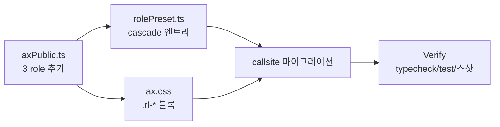

# ax P0 Role 신설 — PRD

> **선행**: `ax-role-catalog-audit.md` (카테고리 10 실사, P0 3 role 판정)
> **산출물**: role 7 → 10 확장 + 기존 파편 callsite 마이그레이션
> **원칙**: "시각이 다르면 role을 늘린다" (Radix variant 방식)

## §0 요구사항 (from audit)

신설 3 role:
1. **`metric`** — 숫자 강조 표시 (StatBlock, ChartBlock bar, CmsLanding 수치, count 라벨)
2. **`signal`** — 시스템→사용자 알림 (Alert, Toast, EmptyState)
3. **`placeholder`** — 로딩·Skeleton 전용 (aria-hidden + motion:shimmer/pulse 자동)

제약:
- Public 축 확장 (AxRole union 7→10)
- 기존 파편 callsite 마이그레이션 (미명명 구현 → 공식 role)
- 회귀 0 — 시각 유지 또는 의도된 개선만

## §1 책임 분해

| # | 책임 | 파일 | 변경 | 의존 |
|---|------|------|------|------|
| 1 | AxRole union에 3 branch 추가 (metric/signal/placeholder) + surface subset 정의 | `src/styles/axPublic.ts` | 수정 | — |
| 2 | AX_PUBLIC_KEYS·AxPublicKey 업데이트 (role 10개 반영) | `src/styles/axPublic.ts` | 수정 | 1 |
| 3 | rolePreset cascade 엔트리 추가 (metric.*, signal.*, placeholder.*) + strictRoles 등록 | `src/styles/rolePreset.ts` | 수정 | 1 |
| 4 | ax.css에 `.rl-metric`/`.rl-signal`/`.rl-placeholder` 블록 추가 (recipe layer) | `src/styles/ax.css` | 수정 | 1 |
| 5 | placeholder 전용 aria-hidden 기본값 처리 + motion:shimmer cascade | `src/styles/ax.css` + `rolePreset.ts` | 수정 | 3, 4 |
| 6 | StatBlock callsite → role:'metric' | `src/entities/block/ui/StatBlock.tsx` | 수정 | 1, 3 |
| 7 | ChartBlock bar → role:'metric' (bar variant) | `src/entities/block/ui/ChartBlock.tsx` | 수정 | 1, 3 |
| 8 | Alert → role:'signal' | `src/interactive-os/ui/Alert.tsx` | 수정 | 1, 3 |
| 9 | Toaster item → role:'signal', surface:'overlay' | `src/interactive-os/ui/Toaster.tsx` | 수정 | 1, 3 |
| 10 | Skeleton → role:'placeholder' | `src/interactive-os/ui/Skeleton.tsx` | 수정 | 1, 3 |
| 11 | EmptyState 검토 — role 필요 여부 판정 후 조정 | `src/interactive-os/ui/EmptyState.tsx` | 검토·수정 | 1 |
| 12 | Verify (typecheck/test/스샷) | — | — | 6~11 |

### 탐색 증거

- `ax-role-catalog-audit.md` §1~5 (실사 결과)
- Grep 결과 (기존 세션): StatBlock/Alert/Toaster/Skeleton 각 role 사용 패턴

## §2 Contract

### axPublic.ts — 3 신규 브랜치

```ts
// surface subset 추가
type SurfaceMetric      = 'display' | 'ghost' | 'sunken'
type SurfaceSignal      = 'display' | 'overlay' | 'ghost'
type SurfacePlaceholder = 'sunken' | 'ghost' | 'display'

// AxSurface union 확장
export type AxSurface =
  | SurfaceActionable | SurfaceDisplay | SurfaceRow
  | SurfaceCell | SurfaceBadge | SurfaceTip | SurfacePanel
  | SurfaceMetric | SurfaceSignal | SurfacePlaceholder

// AxRole 확장
export type AxRole =
  | 'control' | 'control-group' | 'item' | 'cell'
  | 'badge' | 'utility' | 'tip'
  | 'metric' | 'signal' | 'placeholder'   // ★ 신규

// AxPublic 브랜치 3개 추가
| {
    role: 'metric'
    surface: SurfaceMetric
    tone?: AxTone
    textStyle?: AxTextStyle       // 기본 display/page 권장
    content?: 'text' | 'bubble'
    layout?: AxLayout             // stack(수치↑ 라벨↓) | bar
    width?: AxWidth
    flex?: AxFlex
  }
| {
    role: 'signal'
    surface: SurfaceSignal
    tone?: AxTone
    textStyle?: AxTextStyle
    content?: 'text' | 'bubble' | 'icon'
    interactive?: 'button'        // dismiss 가능
    placement?: AxPlacement       // toast는 float-*
    layout?: AxLayout
    width?: AxWidth
  }
| {
    role: 'placeholder'
    surface?: SurfacePlaceholder
    layout?: AxLayout
    width?: AxWidth
    aspect?: AxAspect
    flex?: AxFlex
    clamp?: AxClamp
    // @invariant aria-hidden="true" DOM에 직접 자동 주입은 ui 레벨 책임 (컴포넌트 Skeleton)
    // @invariant motion은 rolePreset이 shimmer/pulse 공급
  }
```

### rolePreset.ts — cascade 엔트리

```ts
// metric
'metric.display': { shape: 'sm' },
'metric.display.text': {},                   // value+label stack
'metric.display.bubble': { shape: 'md' },    // 버블 형태 (CmsLanding-like)
'metric.ghost': {},
'metric.sunken': { shape: 'sm' },

// signal
'signal.display': { shape: 'md' },
'signal.display.button': { shape: 'md' },    // dismissable alert
'signal.overlay': { shape: 'md', motion: 'fade-slide-in' },   // toast
'signal.ghost': {},

// placeholder
'placeholder.sunken': { shape: 'sm', motion: 'shimmer' },
'placeholder.ghost':  { motion: 'pulse' },
'placeholder.display': { shape: 'sm', motion: 'shimmer' },

// strictRoles 확장
const strictRoles: AxRole[] = ['control', 'badge', 'tip', 'cell', 'metric', 'signal']
// placeholder는 surface optional이라 strict 제외
```

### ax.css — CSS 블록

```css
@layer recipe {
  .rl-metric {
    min-height: var(--cs-h, 28px);
    font-size:  var(--font-size, 14px);
    display: inline-flex;
    flex-direction: column;
    gap: var(--space-xs);
    align-items: flex-start;
    /* value(큰 숫자) + label(작은 설명) 기본 stack */
  }
  .rl-metric[data-layout="bar"] { flex-direction: row; align-items: center; }

  .rl-signal {
    min-height: var(--cs-h, 28px);
    font-size:  var(--font-size, 14px);
    display: flex;
    flex-direction: row;
    align-items: flex-start;
    gap: var(--cs-px, 8px);
    padding: var(--cs-py, 4px) var(--cs-px, 8px);
    border-radius: var(--shape-md-radius);
  }

  .rl-placeholder {
    display: block;
    border-radius: var(--shape-sm-radius);
    background: var(--_bg, var(--surface-sunken));
    /* motion은 rolePreset이 주입 (shimmer/pulse) */
  }
  .rl-placeholder[aria-hidden="true"] { /* 접근성 — Skeleton 기본 */ }
}
```

## §3 WHY

1. **파편 흡수**: 현재 Alert/Toast/Skeleton/StatBlock은 `role:'item'` 또는 `role:'control-group'`로 오용 중. 시각 차이가 명백 → 별도 role 부여가 MECE.
2. **Public 카탈로그 완결**: 지금까지 role 7개가 커버 못 한 "숫자 강조·알림·로딩" 3 도메인 공식화.
3. **Radix 수준 표현력**: role 10개는 Radix Themes의 컴포넌트 variant 수에 비교 가능한 규모. 멘탈 모델 부담 적음.

## §4 HOW



## §5 WHAT

### W1. axPublic.ts — 3 role branch

기존 7 브랜치 사이에 3 신규 삽입. Contract 섹션의 타입 그대로.

### W2. rolePreset.ts — cascade + strictRoles

Contract의 엔트리 추가. strictRoles 배열에 `'metric', 'signal'` 추가 (placeholder는 제외).

### W3. ax.css — 3 role CSS 블록

@layer recipe 내부, 기존 `.rl-*` 블록 옆에 추가. Contract CSS 그대로.

### W4. StatBlock.tsx — role:'metric'

기존 `ax({ textStyle: 'hero' })` + 자체 구조 → `ax({ role: 'metric', surface: 'display', textStyle: 'hero', content: 'text' })`. hero를 value에 적용, label은 caption textStyle의 자식 div.

### W5. ChartBlock.tsx — role:'metric' bar variant

막대/트랙 조합 중 막대 영역을 `role:'metric', surface:'display', layout:'bar', tone:'accent-dim'`으로. 트랙은 기존 `role:'control-group', surface:'sunken'` 유지 (컨테이너 역할).

### W6. Alert.tsx — role:'signal'

기존 `role:'item', surface:'display'` → `role:'signal', surface:'display'`. tone은 그대로 유지. `interactive:'button'`는 dismiss 버튼 있을 때만.

### W7. Toaster.tsx — role:'signal', surface:'overlay'

Toast item 렌더 시 `role:'signal', surface:'overlay', placement:'float-bottom-center'` (또는 기존 placement 전달). container는 기존대로.

### W8. Skeleton.tsx — role:'placeholder'

`role:'control-group', surface:'sunken'` → `role:'placeholder', surface:'sunken'`. motion은 rolePreset이 shimmer 자동 주입. aria-hidden="true"는 ui 컴포넌트가 직접 추가 (이미 있음).

### W9. EmptyState.tsx — 검토

현재 utility로 작동 중 (role 미지정). signal로 승격할지 결정:
- "데이터 없음"은 시스템→사용자 알림 → signal 맞음
- 단 interactive 없으므로 최소 스타일. `role:'signal', surface:'ghost'` 후보.

## §6 원칙 감시자 (집행 후 확인)

- [ ] Public 축 수 증가 감시 (role 7→10 — audit 승인됨)
- [ ] rolePreset 새 엔트리 cascade hit 테스트
- [ ] Skeleton aria-hidden 유지
- [ ] 스샷 diff 회귀 0 (의도된 개선 외)
- [ ] `guardOsPatterns.mjs`에 신 role 사용 허용 추가 필요 여부 확인

## §7 후속 (이 PRD 제외)

- **PR-2**: P1 `backdrop` 신설 + Drawer 마이그레이션
- **PR-3**: P2 수정 (CheckItem/RadioItem/SwitchItem/RatingItem role 정정 + ServiceItem interactive 버그)
- **PR-4**: P3 검토 (`chip`/`interactive:'nav'`)

---

**완성도**: 🟢 — PR-1 실행 준비 완료.
