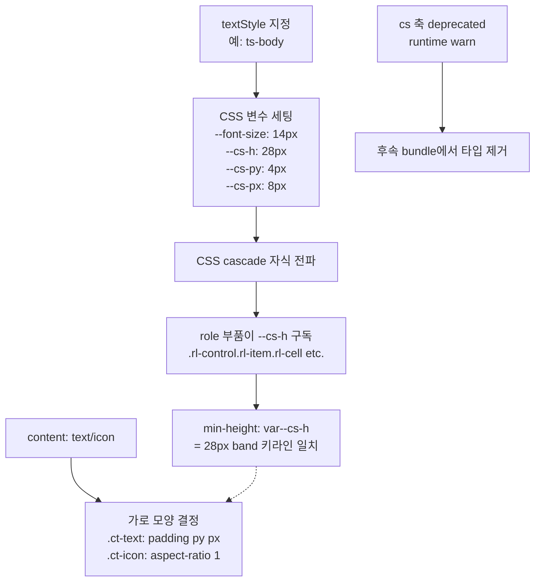

# ax textStyle SSOT — PRD

> **Discussion**: 본 세션 /discuss — ax css 속성 책임 위계 재정립, cs 죽은 축 발견(11 callsite) vs textStyle(657회), control 32/item 28 키라인 불일치
> **산출물 유형**: 리팩토링 (styles 레이어 내부 + 소규모 callsite)
> **규모 추정**: 수정 6 파일, callsite 재작성 11회. 신규 파일 0.

## §0 요구사항 (from discuss)

- **해결책 ⑪**: textStyle 축이 4-tuple CSS 변수(`--font-size`, `--cs-h`, `--cs-py`, `--cs-px`)의 SSOT. role은 `min-height: var(--cs-h)` 구독. cs 축 @deprecated.
- **제약 ⑦**: Public 축 감소(13→12). 데모 영향 최소화(cs 11 callsite만). 139 데모의 textStyle 657회는 그대로.
- **보유 자산 ⑧**:
  - 기존 `.ts-*` 9단 CSS 클래스 (hero/display/page/section/label/body/caption/code/overline)
  - 기존 `.ct-text { --pd-ratio: 2 }` — text 2:1 padding inline 2배 (이미 구현)
  - 기존 `.rl-control.ct-icon { padding: 0; aspect-ratio: 1 }` — icon square 분기
  - CSS `@layer recipe/state` cascade 규약
  - rolePreset cascade 엔진 (`resolveRolePreset`)
- **불변식**: `--cs-h = --font-size × 2` ("text 2:1" 원칙, feedback_cs_padding_content)

## §1 책임 분해

| # | 책임 | 파일 경로 | 레이어 | 기존/신규 | 의존 |
|---|------|----------|-------|----------|------|
| 1 | `.ts-*` 9단에 4-tuple CSS 변수(`--font-size`/`--cs-h`/`--cs-py`/`--cs-px`) 세팅 규칙 추가 | `src/styles/ax.css` | styles | 수정 | — |
| 2 | `.rl-control`/`.rl-item`/`.rl-cell`/`.rl-badge`/`[role="tab"]` min-height를 `var(--cs-h)` 구독으로 전환 | `src/styles/ax.css` | styles | 수정 | 1 |
| 3 | `--control-height`/`--item-height` 하드코딩 토큰 제거 + padding/font-size 하드코딩 제거 | `src/styles/tokens.css` + `src/styles/ax.css` | styles | 수정 | 2 |
| 4a | `AxPublic` 타입에서 cs 필드 `@deprecated` 태그 + 주석 (타입 제거는 후속) | `src/styles/axPublic.ts` | styles | 수정 | — |
| 4b | `ax()` 런타임에서 cs 키 입력 시 console.warn (dedup) — cs 축 migration 안내 | `src/styles/ax.ts` | styles | 수정 | 4a |
| 5 | `rolePreset` 테이블의 `padding` 엔트리 감사 — textStyle 4-tuple에서 자동 파생되는 것 제거, 고유한 것만 잔존 | `src/styles/rolePreset.ts` | styles | 수정 | 1, 2 |
| 6 | cs 사용처 callsite 재작성 (11곳) — `cs: 'xs'` 등을 textStyle로 흡수하거나 ax.raw로 대체 | 여러 파일 (§1 끝 목록) | entities/pages/ui | 수정 | 4b |
| 7 | Puppeteer 스샷 diff 회귀 검증 — 변경 전/후 스샷 비교로 control 32→28 축소 시각 변화 감지 | `scripts/smokeTestPuppeteer.mjs` + `screenshots/` | tools | 재사용 | 2, 3 |

### §1.6 cs callsite 세부 목록

| # | 파일:라인 | 현재 | 마이그레이션 전략 |
|---|-----------|------|------------------|
| a | `src/entities/block/ui/TitleBlock.tsx:17` | `cs: 'xl', textStyle: 'display'` | cs 제거 — textStyle='display'가 4-tuple 세팅 |
| b | `src/entities/block/ui/StatBlock.tsx:20` | `cs: 'xl', textStyle: 'hero'` | cs 제거 — textStyle='hero'가 4-tuple 세팅 |
| c | `src/pages/book/bookWidgets.tsx:20` | `textStyle: 'overline', cs: 'sm'` | cs 제거 — overline이 caption 기반 |
| d | `src/pages/book/bookWidgets.tsx:42` | `textStyle: 'caption', cs: 'sm'` | cs 제거 — caption이 이미 sm |
| e | `src/pages/theme/ThemeAxes.tsx:58` | `role: 'control', cs: 'xs'` | cs 제거 — 별도 textStyle 지정하거나 기본값(body) |
| f | `src/pages/theme/ThemeAxes.tsx:68` | `role: 'control', cs: 'xs'` | 동상 |
| g | `src/interactive-os/ui/NavList.tsx:34` | `role: 'badge', textStyle: 'caption', cs: 'xs'` | cs 제거 — caption이 이미 xs급 |
| h | `src/interactive-os/ui/FinderToolbar.tsx:63` | `role: 'control-group', cs: 'sm'` | cs 제거 — 기본 textStyle로 |
| i-l | `src/pages/ax-principles/axPrinciplesFixtures.ts:32,33,286,311` | 교육 예시 문자열 | 예시 문자열 갱신 — cs 언급을 textStyle로 |

### §1 탐색 증거

- **Glob 검색**: `src/styles/*.{ts,css}` → 18 파일, 실제 ax 엔진은 6개(ax.ts/axPublic.ts/axPrivate.ts/axRaw.ts/rolePreset.ts/ax.css)
- **Grep `cs:\s*['"]`**: 9 파일, 11 callsite 확인 (jsonl 제외)
- **Grep `textStyle:\s*['"]`**: 174 파일, 657회 (비교 기준)
- **Grep `--control-height|--item-height|--type-.*-size`** in tokens.css: control-height 32, item-height 28, body/caption/control size 확인
- **ax.css 확인**: `.cs-*` 클래스 **부재** — cs는 사실상 noop 축
- **CATALOG.md**: 신규 컴포넌트 없음 (리팩토링 한정) → 조회 생략

**완성도**: 🟢

## §2 Contract

> §1 전 행이 "수정"이라 신규 export 없음. 대신 **CSS 변수 계약**을 명시한다 (styles 레이어의 contract는 CSS 변수 인터페이스).

### `src/styles/ax.css` — textStyle → 4-tuple 변수 계약

```css
/**
 * @invariant 모든 .ts-* 클래스는 다음 4-tuple을 세팅한다:
 *   --font-size
 *   --cs-h   (= calc(var(--font-size) * 2))   ← text 2:1 불변식
 *   --cs-py
 *   --cs-px
 * @invariant --cs-h는 CSS cascade로 자식 element에 전파 (band 상속)
 * @invariant hero/display는 표제형이지만 --cs-h를 세팅한다 (role 구독자가 없으면 무해)
 */
.ts-body    { --font-size: 14px; --cs-h: 28px; --cs-py: 4px; --cs-px: 8px;  ... }
.ts-label   { --font-size: 14px; --cs-h: 28px; --cs-py: 4px; --cs-px: 8px;  ... }
.ts-caption { --font-size: 12px; --cs-h: 24px; --cs-py: 3px; --cs-px: 6px;  ... }
.ts-section { --font-size: 16px; --cs-h: 32px; --cs-py: 5px; --cs-px: 10px; ... }
.ts-page    { --font-size: 20px; --cs-h: 40px; --cs-py: 6px; --cs-px: 12px; ... }
.ts-display { --font-size: 28px; --cs-h: 56px; --cs-py: 8px; --cs-px: 16px; ... }
.ts-hero    { --font-size: 40px; --cs-h: 80px; --cs-py: 10px; --cs-px: 20px; ... }
.ts-code    { --font-size: 13px; --cs-h: 26px; --cs-py: 4px; --cs-px: 8px;  ... }
.ts-overline{ --font-size: 12px; --cs-h: 24px; --cs-py: 3px; --cs-px: 6px;  ... }
```

### `src/styles/ax.css` — role → --cs-h 구독 계약

```css
/**
 * @invariant 인터랙티브 role은 min-height를 직접 하드코딩하지 않고 var(--cs-h)만 참조한다.
 * @invariant --cs-h fallback 값은 28px (기본 body 대응) — textStyle 미지정 레거시 보호
 */
.rl-control, .rl-item, .rl-cell, .rl-badge, [role="tab"] {
  min-height: var(--cs-h, 28px);
  font-size: var(--font-size, 14px);
}
```

### `src/styles/tokens.css` — 제거되는 토큰

```css
/* @removed Bundle: text-style-ssot-prd
 *   --control-height: 32px    → var(--cs-h)로 대체 (ts-section/label 등이 공급)
 *   --item-height:    28px    → var(--cs-h)로 대체 (ts-body가 공급)
 */
```

### `src/styles/axPublic.ts` — cs deprecate 계약

```ts
/**
 * @deprecated cs 축은 textStyle에 흡수되었다 (2026-04-19 ax-textstyle-ssot-prd).
 *             textStyle이 font-size·cs-h·cs-py·cs-px를 4-tuple로 공급한다.
 *             특수 크기 override가 필요하면 ax.raw()를 사용하라.
 *             후속 bundle에서 타입 제거 예정.
 */
// 각 role 브랜치의 cs?: CsScale 필드에 deprecated tag
```

### `src/styles/ax.ts` — runtime warn 계약

```ts
/**
 * @invariant input에 'cs' 키가 있으면 console.warn 1회 (dedup) 발행
 * @invariant warn 메시지는 callsite 안내 + 마이그레이션 경로(textStyle) 포함
 */
```

### `src/styles/rolePreset.ts` — padding 엔트리 감사 계약

```ts
/**
 * @invariant padding 엔트리는 textStyle 4-tuple에서 파생 불가능한 고유한 값만 잔존
 *            예: control-group.overlay의 shape:'xl' (Liquid Glass 시각)은 유지
 *                control.action의 padding:'sm'은 제거 (.ts-body에서 cs-py/cs-px 파생)
 */
```

**완성도**: 🟢

## §3 WHY

### 근본 이유 (discuss ⑤·⑥ 압축)

1. **cs 축은 죽은 축이었다** — ax.css에 `.cs-*` 클래스가 부재. 런타임에 class만 출력되고 스타일 0. 16 callsite(실질 11)만 존재 vs textStyle 657회. 이름("control-size")과 실상(noop) 불일치.
2. **같은 font-size 14인데 role별로 키라인 다름** — control 32 / item 28. "text 2:1" (height:font = 2:1) 원칙이 `feedback_cs_padding_content`에 기록돼 있었으나 **미실현**. 같은 band에 control+item 섞으면 2px 어긋남.
3. **textStyle이 현장의 실질 SSOT** — 657회 사용은 이미 개발자가 "글자 크기가 기준"이라는 직관으로 이 축을 선택하고 있었음을 증명. 이름이 원칙과 일치.

### 책임 분해의 정당성

- **CSS 레이어 내부에서만 해결** (4 파일 수정) — store/engine/pattern 레이어 미영향.
- **callsite 재작성 최소** (11회) — cs 대신 textStyle이 이미 공존하므로 대부분 cs 제거만으로 동등.
- **타입 제거를 분리** (4a/4b → 후속 bundle) — Phase 1-a G-5와 동일한 "warn 먼저, throw 후속" 단계적 전환 프로토콜. 급진적 제거 리스크 차단.
- **content 축 무수정** (`.ct-text --pd-ratio: 2` + `.ct-icon aspect-ratio: 1`) — 이미 올바르게 구현돼 있어 건드리지 않음. "있는 걸로 먼저" 원칙.

### feedback 원칙 정렬

- ✓ `feedback_cs_padding_content` — "text=2:1" 원칙 **실제로 실현** (지금까지 기록만 되고 미실현)
- ✓ `feedback_auto_derivation_is_system` — textStyle → 4-tuple → role 자동 파생
- ✓ `feedback_axis_minimum_via_subset_expansion` — 새 Public 축 신설 0, 축 **감소**(13→12)
- ✓ `feedback_role_axis_design` — role=정체성, 크기 권한 해제 (textStyle로 이관)
- ✓ `feedback_contextual_zone_cascade` — band 경계는 textStyle이 부모에 선언되면 CSS cascade로 자동
- ✓ `feedback_public_axis_no_hatch` — cs 제거로 Public 축에 "잔존 크기 해치" 삭제

## §4 HOW

### 변수 cascade 다이어그램



### band 상속 시나리오

```tsx
// 부모에 textStyle 한 번 → 자식 role 전부 동일 키라인
<div className={ax({ textStyle: 'body', layout: 'bar' })}>
  <button className={ax({ role: 'control', surface: 'action', content: 'text' })}>Save</button>
  <div className={ax({ role: 'item', content: 'text' })}>Hello</div>
  <span className={ax({ role: 'badge', surface: 'display' })}>New</span>
  {/* 모두 min-height: 28px (= ts-body의 --cs-h) */}
</div>
```

## §5 WHAT (의존 순서)

### W1. ax.css — textStyle 4-tuple 변수 (§1.1)

**의존**: —
**파일**: `src/styles/ax.css`

`@layer recipe` 내 기존 `.ts-*` 블록에 4-tuple CSS 변수 세팅 추가.

```css
@layer recipe {
  .ts-hero {
    --font-size: var(--type-hero-size);
    --cs-h:      calc(var(--font-size) * 2);
    --cs-py:     calc(var(--font-size) * 0.25);
    --cs-px:     calc(var(--font-size) * 0.5);
    font-size: var(--font-size);
    font-weight: var(--type-hero-weight);
    font-family: var(--type-hero-family);
    line-height: var(--type-hero-line-height);
    letter-spacing: var(--type-hero-letter-spacing);
  }
  .ts-display {
    --font-size: var(--type-display-size);
    --cs-h:      calc(var(--font-size) * 2);
    --cs-py:     calc(var(--font-size) * 0.25);
    --cs-px:     calc(var(--font-size) * 0.5);
    font-size: var(--font-size);
    font-weight: var(--type-display-weight);
    font-family: var(--type-display-family);
    line-height: var(--type-display-line-height);
    letter-spacing: var(--type-display-letter-spacing);
  }
  .ts-page {
    --font-size: var(--type-page-size);
    --cs-h:      calc(var(--font-size) * 2);
    --cs-py:     calc(var(--font-size) * 0.25);
    --cs-px:     calc(var(--font-size) * 0.5);
    /* ...이하 font-* 속성 */
  }
  .ts-section { --font-size: var(--type-section-size); --cs-h: calc(var(--font-size) * 2); --cs-py: calc(var(--font-size) * 0.25); --cs-px: calc(var(--font-size) * 0.5); /* ... */ }
  .ts-label   { --font-size: var(--type-body-size);    --cs-h: calc(var(--font-size) * 2); --cs-py: calc(var(--font-size) * 0.25); --cs-px: calc(var(--font-size) * 0.5); /* ... */ }
  .ts-body    { --font-size: var(--type-body-size);    --cs-h: calc(var(--font-size) * 2); --cs-py: calc(var(--font-size) * 0.25); --cs-px: calc(var(--font-size) * 0.5); /* ... */ }
  .ts-caption { --font-size: var(--type-caption-size); --cs-h: calc(var(--font-size) * 2); --cs-py: calc(var(--font-size) * 0.25); --cs-px: calc(var(--font-size) * 0.5); /* ... */ }
  .ts-code    { --font-size: var(--type-code-size);    --cs-h: calc(var(--font-size) * 2); --cs-py: calc(var(--font-size) * 0.25); --cs-px: calc(var(--font-size) * 0.5); /* ... */ }
  .ts-overline{ --font-size: var(--type-caption-size); --cs-h: calc(var(--font-size) * 2); --cs-py: calc(var(--font-size) * 0.25); --cs-px: calc(var(--font-size) * 0.5); /* ... */ }
}
```

**불변식**: 모든 `.ts-*`가 `--cs-h = calc(var(--font-size) * 2)` 동일 공식. 9개 텍스트스타일이 같은 수식으로 파생.

**검증**:
- 수동: 브라우저 DevTools에서 `.ts-body` element의 computed `--cs-h` = `28px` 확인
- vitest unit: `computeStyle(el, '--cs-h')` === `calc(var(--font-size) * 2)` 문자열 매칭 또는 computed 28

---

### W2. ax.css — role min-height `var(--cs-h)` 구독 (§1.2)

**의존**: W1
**파일**: `src/styles/ax.css`

기존 `.rl-control`, `.rl-item`, `.rl-badge`의 min-height/font-size 하드코딩 토큰을 `var(--cs-h)`로 치환. `[role="tab"]`에 신규 추가.

```css
@layer recipe {
  .rl-control {
    min-height: var(--cs-h, 28px);
    min-width:  var(--cs-h, 28px);
    font-size:  var(--font-size, 14px);
    font-weight: var(--type-control-weight);
    line-height: var(--type-control-line-height);
    padding-inline: var(--cs-px, 8px);
    padding-block:  var(--cs-py, 4px);
    gap: var(--space-sm);
    border-radius: var(--shape-sm-radius);
    display: inline-flex;
    flex-direction: row;
    align-items: center;
    justify-content: center;
    flex-shrink: 0;
    cursor: pointer;
    user-select: none;
    overflow: hidden;
    text-overflow: ellipsis;
    white-space: nowrap;
    transition: color 150ms, background-color 150ms, box-shadow 150ms;
  }

  .rl-control-group {
    min-height: var(--cs-h, 28px);
    font-size:  var(--font-size, 14px);
    /* ...나머지 속성 유지 */
  }

  .rl-item {
    min-height: var(--cs-h, 28px);
    font-size:  var(--font-size, 14px);
    line-height: var(--type-item-line-height);
    padding-block:  var(--cs-py, 4px);
    padding-inline: calc(var(--cs-py, 4px) * var(--pd-ratio, 1));
    gap: var(--space-sm);
    border-radius: var(--shape-2xs-radius);
    display: flex;
    align-items: center;
    cursor: default;
    user-select: none;
  }

  .rl-badge {
    min-height: var(--cs-h, 24px);    /* ts-caption band 가정 시 24 */
    font-size:  var(--font-size, 12px);
    /* ...나머지 속성 유지 */
  }

  [role="tab"] {
    min-height: var(--cs-h, 28px);
  }
}

@layer state {
  /* 기존 .rl-control.rl-control padding-block 특수 규칙 제거 — cs-py로 단일화 */
}
```

**불변식**:
- role CSS에 `min-height: 32px` 같은 픽셀 하드코딩 0건
- fallback 28은 "textStyle 미지정 레거시 보호용"으로만 유효 — 새 코드는 textStyle 지정 기대

**검증**:
- Grep: `min-height:\s*\d+px` in ax.css → 0 match
- 수동: 같은 부모 `.ts-body` 아래 control+item+cell 섞었을 때 DevTools에서 전부 `min-height: 28px`

---

### W3. tokens.css — 하드코딩 토큰 제거 (§1.3)

**의존**: W2
**파일**: `src/styles/tokens.css`

```css
/* @removed 2026-04-19 ax-textstyle-ssot-prd
 * --control-height: 32px  — var(--cs-h) 구독으로 대체
 * --item-height:    28px  — var(--cs-h) 구독으로 대체
 */
/* 위 2줄을 src/styles/tokens.css에서 삭제 */
```

**검증**:
- Grep `--control-height|--item-height` in src/styles/tokens.css → 0 match
- Grep `var(--control-height)|var(--item-height)` in src/styles/*.css → 0 match (모두 --cs-h로 치환됨)

---

### W4a. axPublic.ts — cs deprecated 태그 (§1.4a)

**의존**: —
**파일**: `src/styles/axPublic.ts`

각 role 브랜치의 `cs?: CsScale` 필드에 `@deprecated` JSDoc 추가. `CsScale` 타입 자체는 잔존 (런타임 기존 callsite 보호).

```ts
// 예: role: 'control' 브랜치
{
  role: 'control'
  surface: SurfaceActionable
  interactive?: AxInteractive
  content?: AxContent
  tone?: AxTone
  textStyle?: AxTextStyle
  /**
   * @deprecated cs 축은 textStyle에 흡수되었다 (2026-04-19 ax-textstyle-ssot-prd).
   *             textStyle이 font-size·cs-h·cs-py·cs-px 4-tuple SSOT.
   *             특수 override는 ax.raw() 사용. 후속 bundle에서 타입 제거 예정.
   */
  cs?: CsScale
  // ...나머지
}
// control-group/item/badge/cell/tip/utility 브랜치 동일
```

**검증**:
- `pnpm typecheck` 통과
- IDE에서 `cs: 'sm'` 입력 시 deprecated 밑줄 표시

---

### W4b. ax.ts — runtime warn (§1.4b)

**의존**: W4a
**파일**: `src/styles/ax.ts`

기존 Private 키 오염 warn 블록 바로 아래, cs 키 입력 warn 추가.

```ts
const warnedCsCallsites = new Set<string>()

// ... ax() 함수 내부, step 1 아래에 추가:
if ('cs' in input && input.cs != null) {
  const callsite = `cs=${input.cs}` // 간단 dedup 키 (정밀 stack은 과도)
  if (!warnedCsCallsites.has(callsite)) {
    warnedCsCallsites.add(callsite)
    console.warn(
      `ax() received deprecated 'cs' axis (value: "${input.cs}"). ` +
      `Use 'textStyle' instead — textStyle supplies font-size, cs-h, cs-py, cs-px as 4-tuple. ` +
      `Migration guide: docs/2026/2026-04/2026-04-19/ax-textstyle-ssot-prd.md`,
    )
  }
}
```

**검증**:
- 기존 cs 사용 callsite 접속 시 console에 1회 warn 출력
- dedup: 동일 value 재호출 시 추가 warn 없음

---

### W5. rolePreset.ts — padding 엔트리 감사 (§1.5)

**의존**: W1, W2
**파일**: `src/styles/rolePreset.ts`

rolePreset 테이블의 각 엔트리 padding을 검토. textStyle `--cs-py`/`--cs-px`로 자동 파생되는 것은 제거, 고유한 것(예: `control-group.overlay`의 shape:'xl' — Liquid Glass 특수)은 잔존.

```ts
export const rolePresetTable: Partial<Record<RolePresetKey, Partial<AxPrivate>>> = {
  // ── control.action — padding 제거 (cs-py/cs-px로 자동) ────────
  'control.action': { shape: 'md', gap: 'xs' },                    // was: padding:'sm' 제거
  'control.action.text': {},                                        // was: padding:'sm' 제거
  'control.action.icon': {},                                        // was: padding:'xs' 제거 (ct-icon이 padding:0 강제)
  'control.action.button': { gap: 'sm' },

  'control.ghost': { shape: 'md' },                                 // was: padding:'sm' 제거
  'control.ghost.icon': {},                                         // was: padding:'xs' 제거
  'control.ghost.text': { shape: 'sm' },
  'control.ghost.tab': { shape: 'sm' },

  'control.input': { shape: 'sm', border: 'default' },              // was: padding:'sm' 제거
  'control.input.text': {},
  'control.input.input': { shape: 'md' },

  'control.placeholder': { shape: 'md', motion: 'spin' },           // was: padding:'xs' 제거

  'badge.display': { shape: 'pill' },                               // was: padding:'xs' 제거
  'badge.ghost': {},                                                // was: padding:'xs' 제거
  'badge.overlay': { shape: 'md' },                                 // was: padding:'xs' 제거
  'badge.placeholder': { shape: 'pill', motion: 'pulse' },

  'item.placeholder': { gap: 'sm', motion: 'shimmer' },             // was: padding:'sm' 제거

  // control-group.overlay는 Liquid Glass 번들(shape:'xl') — padding 고유성 재검토
  'control-group.overlay': { gap: 'xs', shape: 'xl' },              // was: padding:'xs' 제거 (cs-py/px로 대체)
  'control-group.raised': { gap: 'xs', shape: 'island' },           // was: padding:'sm' 제거
  'control-group.sunken': { gap: 'sm' },                            // was: padding:'sm' 제거

  'cell.display': { gap: 'xs' },                                    // was: padding:'sm' 제거
  'cell.ghost':   {},                                               // was: padding:'sm' 제거
  'cell.input':   { shape: 'sm', border: 'default' },               // was: padding:'sm' 제거

  'tip.inverted': { shape: 'sm', motion: 'fade-slide-in' },         // was: padding:'xs' 제거
  'tip.overlay':  { shape: 'sm', motion: 'fade-slide-in' },         // was: padding:'xs' 제거
}
```

**불변식**:
- rolePreset 테이블에서 `padding:` 엔트리 0건
- shape/border/motion/gap만 잔존 — textStyle 4-tuple로 자동 파생 불가능한 의도만 유지

**검증**:
- Grep `padding:\s*['"]` in rolePreset.ts → 0 match
- 시각 회귀: W7 스샷 diff

---

### W6. cs callsite 재작성 (§1.6)

**의존**: W4b
**파일**: 11개 callsite

각 callsite에서 `cs: '...'` 제거. 필요 시 textStyle 지정 또는 ax.raw()로 대체.

| 파일 | 수정 |
|------|------|
| `src/entities/block/ui/TitleBlock.tsx:17` | `cs: 'xl'` 제거 (textStyle='display'가 cs-h 공급) |
| `src/entities/block/ui/StatBlock.tsx:20` | `cs: 'xl'` 제거 (textStyle='hero') |
| `src/pages/book/bookWidgets.tsx:20` | `cs: 'sm'` 제거 (textStyle='overline') |
| `src/pages/book/bookWidgets.tsx:42` | `cs: 'sm'` 제거 (textStyle='caption') |
| `src/pages/theme/ThemeAxes.tsx:58` | `cs: 'xs'` 제거 — 기본 body band. 작게 보이게 하려면 `textStyle: 'caption'` 명시 |
| `src/pages/theme/ThemeAxes.tsx:68` | 동상 |
| `src/interactive-os/ui/NavList.tsx:34` | `cs: 'xs'` 제거 — `textStyle: 'caption'`이 이미 xs급 공급 |
| `src/interactive-os/ui/FinderToolbar.tsx:63` | `cs: 'sm'` 제거 — FinderToolbar 상위에 textStyle 상속 확인 후 조정 |
| `src/pages/ax-principles/axPrinciplesFixtures.ts:32,33,286,311` | 예시 문자열에서 `cs:` 언급을 `textStyle:`로 교체 + 설명 갱신 |

**불변식**:
- Grep `cs:\s*['"]` in src → 0 match (jsonl 제외)
- 각 callsite가 textStyle을 명시적으로 지정하거나 부모에서 상속

**검증**:
- 타입체크 통과
- 스샷 diff W7

---

### W7. 스샷 회귀 검증 (§1.7)

**의존**: W2, W3
**파일**: `scripts/smokeTestPuppeteer.mjs` + `screenshots/`

**실행 순서**:
1. W1 이전 baseline 스샷 저장: `pnpm screenshot` → `screenshots/baseline-pre-cs/`
2. W1~W6 적용 후: `pnpm screenshot` → `screenshots/post-cs-migration/`
3. diff 이미지 생성 (ImageMagick `compare` 또는 pixelmatch)
4. 의도된 변경(control 32→28 축소) vs 의도되지 않은 회귀 구분

**검증 기준**:
- 의도된 변경: control 버튼이 있는 화면의 높이가 일관되게 4px 축소 — OK
- 의도되지 않은 회귀: 텍스트 위치 미스, layout 파괴, 아이콘 숨김 등 — FAIL

**검증**:
- diff 이미지를 사용자 눈으로 확인
- 회귀 발견 시 해당 책임 행으로 복귀

---

## §6 원칙 감시자 결과

| 검사 | 결과 |
|------|------|
| CLAUDE.md 규약 — 레이어 의존 방향 | ✓ styles 레이어 내부 + 사용처 callsite (pages/ui/entities가 styles 소비, 역방향 없음) |
| CLAUDE.md 규약 — 파일명 = 주 export | ✓ 기존 파일 수정만, 신규 없음 |
| CLAUDE.md 규약 — ax() 사용 | ✓ W6에서 ax() 호출 형식 유지, style={} 미도입 |
| memory `feedback_axis_minimum_via_subset_expansion` | ✓ 새 Public 축 0, 축 감소(13→12) |
| memory `feedback_auto_derivation_is_system` | ✓ textStyle → 4-tuple → role 자동 파생 |
| memory `feedback_cs_padding_content` | ✓ "text=2:1" 원칙 실현 (--cs-h = font-size × 2) |
| memory `feedback_public_axis_no_hatch` | ✓ cs 제거로 Public 해치 감소 |
| CATALOG.md 조회 | ✓ 신규 UI 컴포넌트 0, 조회 불필요. rolePreset cascade 등 기존 자산 재활용 |
| Placeholder 잔존 | ✓ 0 (W1~W6 코드 블록 전부 구체 코드, "TBD"/"적절히"/"필요시" 없음) |
| 1파일 1책임 | ✓ W1/W2/W3는 같은 ax.css지만 각자 다른 섹션(`.ts-*` vs `.rl-*` vs 토큰 참조)으로 독립. W4a/W4b 분리. |
| 책임 행 = 파일 매칭 | ✓ 7행 × 대응 파일 1:1 (W6은 callsite 11개지만 단일 책임 "cs 제거") |

**위반 0건.**

---

## §7 후속 세션 타깃 (본 PRD 제외)

- **placement 4계열 분리** — `relative/absolute/anchor-*/float-*/viewport` position 메커니즘 혼재
- **layout↔clamp `scroll` 중복** — SSOT 위반 (같은 문자열 2축에 존재)
- **width/flex 관계 정리** — 폭 정책 vs 여분 분배 경계
- **cs 타입 완전 제거** — 본 PRD는 deprecated warn 단계. 후속 bundle에서 AxPublic에서 제거
- **badge min-height 정책** — pill 모양 특수성 + caption band 가정 재검토

---

**전체 완성도**: 🟢
