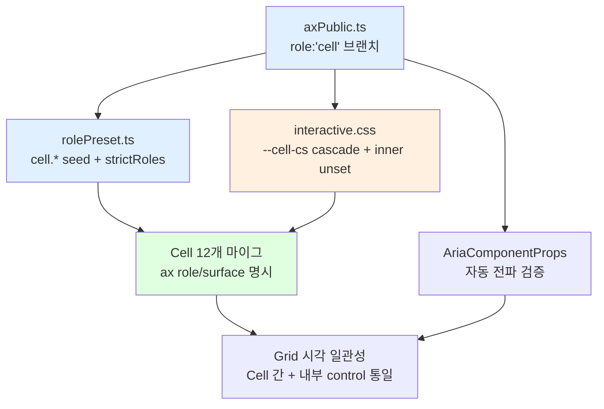

# role:'cell' 신설 — PRD

> **Discussion**: 본 대화 turn 1~6 (cell = 컨테이너 + 내부 control 묶음)
> **산출물 유형**: 엔진 (ax 디자인 시스템)
> **규모 추정**: 신규 0파일, 수정 4파일 (axPublic/rolePreset/CSS 1~2개), Cell 컴포넌트 마이그 12파일

## §0 요구사항 (from discuss)

- **해결책 ⑪**: `role:'cell'` 신설 (7번째 role). 컨테이너 + 내부 control 묶음 역할을 동시에 소유. 기본 `cs='sm'` (28/13, item과 동일 — 내부 부품 수용 호환성). cell.cs → 내부 control.cs cascade. control-group의 "내부 part min-height/shape unset + align-self: stretch" 패턴 이식
- **제약 ⑦**: Private 7축 유지 / rolePreset miss throw 정책 (Phase 1-a G-5 warn 완화 기간 활용) / Cell 컴포넌트 12개 마이그 / 1761 ax() 호출 seed 깨지 않기
- **보유 자산 ⑧**: control-group preset 패턴(`rolePreset.ts` L83-93), AxInteractive 'cell' 값 존재, rolePresetTable 구조, Cell 컴포넌트 12개 (`src/interactive-os/ui/cells/`)
- **승인된 원칙 (새 memory)**: `feedback_container_role_capacity` — 컨테이너 role의 기본 cs = 내부 부품 최소 수용 크기

## §1 책임 분해

| # | 책임 | 파일 경로 | 레이어 | 기존/신규 | 의존 |
|---|------|----------|-------|----------|------|
| 1 | `role:'cell'` 타입 브랜치 정의 + SurfaceCell subset + AxRole enum 확장 | `src/styles/axPublic.ts` | styles | 수정 | — |
| 2 | `cell.*` preset cascade 엔트리 seed (display/ghost/input) + strictRoles 추가 | `src/styles/rolePreset.ts` | styles | 수정 | 1 |
| 3 | CSS layer — `.ax-role-cell` 내부 `.ax-role-control` min-height/shape unset + `--cell-cs` cascade | `src/styles/interactive.css` | styles | 수정 | 1 |
| 4 | Cell 12개 컴포넌트 `role:'cell'` 마이그 (ax() 호출에 role/surface 명시) | `src/interactive-os/ui/cells/*.tsx` | ui | 수정 | 2, 3 |
| 5 | `AxPublic` 외부 타입 전파 검증 (`aria-os/ui` AriaComponentProps 자동 갱신) + scanOsViolations 영향 확인 | `src/interactive-os/ui/index.ts`, `scripts/scanOsViolations.*` | ui/scripts | 검증 | 1 |

### 탐색 증거

- `src/interactive-os/CATALOG.md` L81-85 — ui/cells 10개 명시 (EnumCell, ToggleCell 누락 — CATALOG 갱신 필요)
- `src/interactive-os/ui/cells/index.ts` — 실제 12개 export: TextCell, BadgeCell, CodeCell, EditableCell, EnumCell, SearchableCell, ToggleCell, PhaseCell, TierCell, VisualCell, SummaryCell, DocLinkCell
- `Grep("role.*'control-group'", src/styles)` → rolePreset.ts L83-93 (선례 preset), axPublic.ts L48-108 (브랜치 정의) — **CSS 구현은 별도 파일에 없음, interactive.css 신규 블록 필요**
- `Grep("ax({", TextCell.tsx)` → `ax({clamp:'1'})` role 없이 호출 / BadgeCell → `ax({tone, textStyle, shape, padding, content})` role 없이 호출 — 모든 Cell이 현재 role 미지정 = "utility"로 브랜드 → Phase 3 마이그는 `role:'cell' + surface` 추가
- `axPublic.ts` L22 — `AxInteractive = 'item' | 'tab' | 'check' | 'cell' | 'input' | 'button'` ('cell' 이미 존재, ARIA focus 동작용. role:'cell'은 디자인 SSOT 역할로 직교)

**완성도**: 🟢

## §2 Contract

### `src/styles/axPublic.ts` (수정)

```ts
// ── 3) surface 파티션 — cell subset 추가
type SurfaceCell = 'display' | 'ghost' | 'input'  // role: 'cell' (★신규)

export type AxSurface =
  | SurfaceActionable | SurfaceDisplay | SurfaceRow
  | SurfaceCell                                     // ★신규
  | SurfaceBadge | SurfaceTip | SurfacePanel

// ── 2) AxRole 7 브랜치 (★ 'cell' 신규)
export type AxRole =
  | 'control'
  | 'control-group'
  | 'item'
  | 'cell'       // ★신규 — grid 칸 컨테이너 + 내부 control 묶음
  | 'badge'
  | 'utility'
  | 'tip'

// ── 4) AxPublic discriminated union — cell 브랜치 삽입
/**
 * @invariant role:'cell' 브랜치는 surface 필수 — rolePreset 주입 진입점 (strictRoles)
 * @invariant cs 기본값은 'sm' (28/13) — 내부 부품(item 28, control 36) 수용 호환성
 * @invariant 내부 role:'control'은 cell.cs를 --cell-cs로 상속, min-height/shape unset (interactive.css §3)
 */
export type AxPublic =
  // … 기존 brances …
  // ⑤ cell — grid 칸 컨테이너 + 내부 control 묶음 (★신규)
  | {
      role: 'cell'
      surface: SurfaceCell
      interactive?: AxInteractive
      content?: AxContent
      tone?: AxTone
      textStyle?: AxTextStyle
      cs?: CsScale
      layout?: AxLayout
      width?: AxWidth
      flex?: AxFlex
      clamp?: AxClamp
    }
```

### `src/styles/rolePreset.ts` (수정)

```ts
// ── cell.* — grid 칸 컨테이너 preset (★신규) ──────────
// cs 기본: 'sm' (28/13, item과 동일). 내부 control은 --cell-cs 상속.
'cell.display': { padding: 'sm', gap: 'xs' },       // 기본 읽기 셀 (TextCell, BadgeCell 등)
'cell.ghost':   { padding: 'sm' },                   // 구분선 없는 투명 셀
'cell.input':   { padding: 'sm', shape: 'sm', border: 'default' },  // 편집 셀 (EditableCell, SearchableCell)

// ── strictRoles 확장 (resolveRolePreset §D)
// 'cell'을 strictRoles에 추가 — surface 필수, miss 시 Phase 1-a G-5 warn, Phase 2 throw 재승격
const strictRoles: AxRole[] = ['control', 'badge', 'tip', 'cell']  // ★ 'cell' 추가
```

### `src/styles/interactive.css` (수정)

```css
@layer ax-roles {
  /* role:'cell' — 컨테이너 + 내부 control 묶음 (★신규) */
  .ax-role-cell {
    --cell-cs: var(--cs);      /* cell의 cs를 자식 cascade용 var로 노출 */
  }

  /* 내부 role:'control'은 cell 높이 상속 — control-group 선례 이식 */
  .ax-role-cell > .ax-role-control,
  .ax-role-cell :is(.ax-role-control) {
    min-height: unset;
    align-self: stretch;
    --cs: var(--cell-cs);       /* control의 cs를 cell.cs로 override */
  }
}
```

### `src/interactive-os/ui/cells/*.tsx` (수정 — 마이그 패턴)

```ts
// Before: ax({ clamp: '1' })                     — role 미지정 (utility 브랜드)
// After:  ax({ role: 'cell', surface: 'display', clamp: '1' })
//
// @invariant 모든 Cell 컴포넌트는 role:'cell' 명시. surface는 내용 유형에 따라:
//            - display: TextCell, CodeCell, BadgeCell, PhaseCell, TierCell, SummaryCell,
//                       VisualCell, DocLinkCell, EnumCell
//            - input:   EditableCell, SearchableCell
//            - ghost:   ToggleCell (배경 없음)
```

**완성도**: 🟢

## §3 WHY

**근본 이유**: 현재 ax 시스템에서 "grid 칸" 개념이 role로 존재하지 않아 Cell 12개 컴포넌트가 `role` 없이(utility 브랜드) ax() 호출 중 → (a) Cell 간 높이/padding 불일관 (b) Cell 내부 Badge/Button/TextInput 크기가 Cell 맥락과 독립적으로 결정 → grid 전체 시각 일관성 붕괴.

**책임 분해 정당성**:
1. **axPublic.ts 1행** — 타입 SSOT. 외부 표면 (`aria-os/ui` AriaComponentProps) 자동 전파.
2. **rolePreset.ts 1행** — cascade 엔트리 = cell의 Private 파생 규칙 단일 소유. `feedback_role_axis_design` ("role이 크기 파생 공식 소유")의 확장.
3. **interactive.css 1행** — "컨테이너 내부 control unset"은 CSS 고유 책임. control-group 선례(rolePreset.ts L83-93)와 파일 위치 동일.
4. **Cell 마이그 1행** — 12파일 공통 기계적 변환. Phase 3로 분리하여 Phase 1~2와 독립 검증 가능.
5. **검증 1행** — 외부 표면·scanOsViolations는 선언적 영향, 별도 코드 수정 없이 검증.

각 행이 1 파일(또는 파일군) = 1 책임. 레이어 의존 정방향 (styles → ui). 순환 없음.

## §4 HOW



**Phase 구조:**
- **Phase 1 (타입/preset)**: §1.1 + §1.2 + §1.5 — 브랜치 추가, preset seed, 외부 표면 검증. 이 시점엔 CSS 효과 없음 (warn만).
- **Phase 2 (CSS cascade)**: §1.3 — cell 내부 control 스타일 cascade 활성화. 기존 Cell에 영향 없음 (role 미지정이라 `.ax-role-cell` 클래스 부재).
- **Phase 3 (마이그)**: §1.4 — Cell 12개를 빈도순으로 점진 마이그. 각 Cell이 `role:'cell'` 명시하면 CSS cascade 자동 발동.

## §5 WHAT (의존 순서)

### W1. axPublic.ts — role:'cell' 브랜치 추가 (§1.1)

**의존**: —
**파일**: `src/styles/axPublic.ts`

```ts
// L56~ 추가 — surface 파티션
type SurfaceCell = 'display' | 'ghost' | 'input'   // role: 'cell'

// L69 union에 삽입
export type AxSurface =
  | SurfaceActionable | SurfaceDisplay | SurfaceRow
  | SurfaceCell                                     // ★신규
  | SurfaceBadge | SurfaceTip | SurfacePanel

// L48 AxRole에 'cell' 추가 (6→7 브랜치)
export type AxRole =
  | 'control' | 'control-group' | 'item'
  | 'cell'                                          // ★신규
  | 'badge' | 'utility' | 'tip'

// L123 뒤에 cell 브랜치 삽입
  // ⑤ cell — grid 칸 컨테이너 + 내부 control 묶음 (★신규)
  | {
      role: 'cell'
      surface: SurfaceCell
      interactive?: AxInteractive
      content?: AxContent
      tone?: AxTone
      textStyle?: AxTextStyle
      cs?: CsScale
      layout?: AxLayout
      width?: AxWidth
      flex?: AxFlex
      clamp?: AxClamp
    }
```

**검증**: `pnpm typecheck` 통과 + `AxRole`에 'cell' 포함 + `AxPublic` union 브랜치 7개 확장 확인.

### W2. rolePreset.ts — cell.* seed + strictRoles (§1.2)

**의존**: W1
**파일**: `src/styles/rolePreset.ts`

```ts
// rolePresetTable (L38) 안에 삽입
  // ── cell.* — grid 칸 preset (★신규, cs 기본 sm: 28/13, 내부 부품 수용) ──
  'cell.display': { padding: 'sm', gap: 'xs' },
  'cell.ghost':   { padding: 'sm' },
  'cell.input':   { padding: 'sm', shape: 'sm', border: 'default' },

// resolveRolePreset §D (L199)의 strictRoles 확장
  const strictRoles: AxRole[] = ['control', 'badge', 'tip', 'cell']  // ★ 'cell' 추가
```

**검증**: vitest unit — `resolveRolePreset({ role: 'cell', surface: 'display' })` → `{ padding: 'sm', gap: 'xs' }` / `{ role: 'cell', surface: <unregistered> }` → Phase 1-a warn.

### W3. interactive.css — CSS cascade (§1.3)

**의존**: W1
**파일**: `src/styles/interactive.css`

```css
/* ── role:'cell' — 컨테이너 + 내부 control 묶음 (★신규) ── */
@layer ax-roles {
  .ax-role-cell {
    --cell-cs: var(--cs);
  }

  .ax-role-cell > .ax-role-control,
  .ax-role-cell :is(.ax-role-control) {
    min-height: unset;
    align-self: stretch;
    --cs: var(--cell-cs);
  }
}
```

**검증**: 수동 스샷 — TreeGrid 샘플에 `role:'cell'` 수동 주입 후 내부 Button(control 36)이 cell 28 높이로 축소되는지 확인.

### W4. Cell 컴포넌트 12개 마이그 (§1.4)

**의존**: W2, W3
**파일**: `src/interactive-os/ui/cells/*.tsx` (12파일)

**공통 패턴:**
```tsx
// 각 Cell의 최상위 wrapping span/div에 role:'cell' + surface 추가

// TextCell — display
<span className={ax({ role: 'cell', surface: 'display', clamp: '1' }) + ...}>
// BadgeCell — display (기존 pill/padding이 role preset과 충돌할 수 있음, rolePreset.display로 흡수)
<span className={ax({ role: 'cell', surface: 'display', tone, textStyle: 'caption', content: 'text' }) + ...}>
// EditableCell — input
<div className={ax({ role: 'cell', surface: 'input' }) + ...}>
// SearchableCell — input
<div className={ax({ role: 'cell', surface: 'input' }) + ...}>
// ToggleCell — ghost
<div className={ax({ role: 'cell', surface: 'ghost' }) + ...}>
// 나머지 CodeCell/EnumCell/PhaseCell/TierCell/VisualCell/SummaryCell/DocLinkCell — display
```

**빈도순 (Phase 3 내부 순서):**
1. TextCell, BadgeCell (가장 많이 쓰임 — TreeGrid 기본 cell)
2. CodeCell, EditableCell, SummaryCell
3. EnumCell, SearchableCell, ToggleCell
4. PhaseCell, TierCell, VisualCell, DocLinkCell

**검증**: 각 Cell의 `*.demo.tsx` 스샷 diff. typecheck + lint + `pnpm test` 통과.

### W5. 외부 표면 전파 검증 (§1.5)

**의존**: W1
**파일**: `src/interactive-os/ui/index.ts` (확인만), `scripts/scanOsViolations.mjs` (필요 시 룰 업데이트)

```bash
# 검증 명령
pnpm typecheck                       # AriaComponentProps에 role:'cell' 자동 반영
pnpm check:deps                      # 레이어 의존 위반 0
node scripts/scanOsViolations.mjs    # role:'cell'이 신규 allowlist에 자동 포함되는지
```

**검증**: LLM 시스템 프롬프트 생성(`aria-os/ui`) 경로에서 `role: 'cell'`이 discriminant로 노출되면 🟢.

## §6 원칙 감시자 결과

- [x] **CLAUDE.md 규약**: 파일명 규칙 ✓ (기존 파일 수정), 레이어 의존 정방향 (styles → ui) ✓, ax() 24축 확장 ✓
- [x] **memory feedback 준수**: `feedback_role_axis_design` (role이 크기 SSOT) ✓, `feedback_container_role_capacity` (내부 부품 수용 크기) ✓, `feedback_axis_minimum_via_subset_expansion` — 신규 축 아닌 role 브랜치 1개만 확장 ✓
- [x] **CATALOG.md 탐색 증거**: §1 "탐색 증거"에 기재 ✓. CATALOG에 EnumCell/ToggleCell 누락 발견 (후속 갱신)
- [x] **Placeholder 0**: "TBD"/"적절히"/"필요시" 검색 결과 없음 ✓
- [x] **1파일 1책임**: 5행 모두 단일 책임. W4만 12파일 = 공통 기계적 마이그 (1책임 다파일, 규약 내)

**위반**: 0건

---

**전체 완성도**: 🟢
