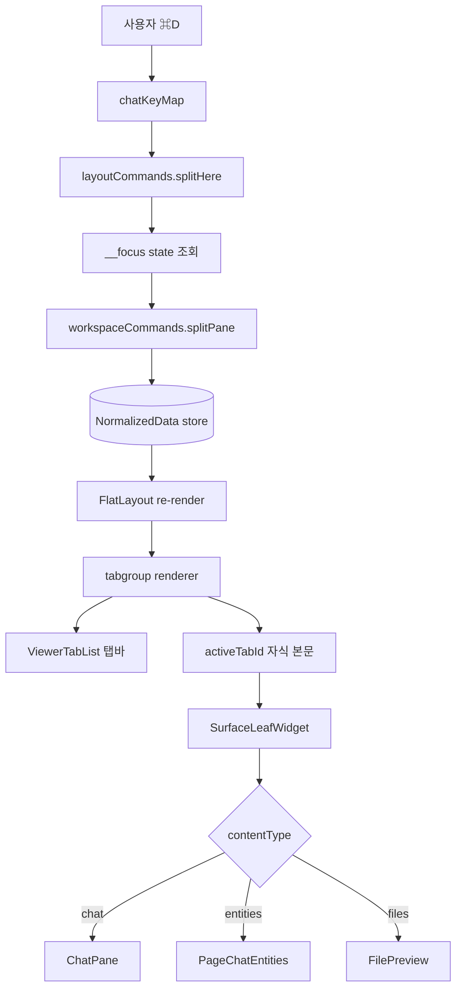

# cmux Layout for /chat — PRD

> **Discussion**: 2026-04-18 세션. `/discuss http://localhost:5173/chat cmux처럼 UI 구현` → `/blueprint` 수렴.
> **산출물 유형**: UI 기능 + 엔진 확장
> **규모 추정**: 엔진 신규 5, 엔진 수정 2, pages 수정 3, pages 신규 0 (pages widget은 기존 파일 내 추가), 문서 1

## §0 요구사항 (from discuss)

- **해결책 ⑪**: `/chat`을 cmux 삼계층(Workspace 사이드바 / Surface=tabgroup / Split Pane 재귀)으로 재설계. ⌘ 기반 단축키로 조작. 우측 사이드 패널 없음. FlatLayout이 못 하는 부분(tabgroup 렌더/동적 조작/focus 추적/방향 이동)은 엔진 확장.
- **제약 ⑦**:
  - `@os/ui` 외 신규 UI 컴포넌트 신설 금지 (제1원칙)
  - FlatLayout + definePage 유지. pages 날코딩 금지 (`feedback_flatlayout_first`)
  - 레이어 의존 순서: store → engine → axis → pattern → primitives → ui → pages
  - 단축키는 cmux 원본 그대로. 브라우저 차단 수용.
- **보유 자산 ⑧**:
  - `workspaceStore.ts` — tabgroup/tab/split 데이터 모델 + splitPane/closePane/addTab/removeTab/setActiveTab/resize **전부 구현됨** (테스트 포함)
  - `SplitPane` n-way (`ui/SplitPane.tsx:172`)
  - `FlatLayout` split/nav/section/overlay/floating/state/widget renderer (tabgroup만 누락)
  - `ViewerTabList` — store-backed 탭바 (`ui/ViewerTabList.tsx`)
  - `useSpatialNav` + `spatialAlgorithm` — 공간 포커스 이동 인프라
  - `NavList`, `SessionCard`(entities/chat/ui), `StatusIndicator`, `BadgeIndicator`
  - `useKeyMap`, `useCommand`, `useCommandBind`, `definePlugin`
- **범위(ii)**: 레이아웃 + 단일 워크스페이스 + 현 Claude WS 1개 연결. 멀티 WS 독립 연결은 별도 iteration.

## §1 책임 분해

| # | 책임 | 파일 경로 | 레이어 | 기존/신규 | 의존 |
|---|---|---|---|---|---|
| 1 | `TabgroupNode` 타입 선언 (type: 'tabgroup', activeTabId) 및 parent-child 규칙 | `src/interactive-os/layout/flatLayout.ts` | layout | 수정 | — |
| 2 | FlatLayout `tabgroup` renderer — ViewerTabList(탭바 store-backed) + activeTabId 자식 하나만 본문 렌더. 기존 local-state `tab` renderer는 `tabgroup` renderer로 대체 | `src/interactive-os/ui/FlatLayout.tsx` | ui | 수정 | 1 |
| 3 | PageSlides `tab` 노드 → `tabgroup`+`tab` 쌍 migration | `src/pages/slides/PageSlides.tsx` | pages | 수정 | 2 |
| 4 | Tab 이동 wrapper — `nextTab(tgId)`, `prevTab(tgId)`, `gotoTab(tgId, n)` command (기존 setActiveTab 기반) | `src/interactive-os/plugins/workspaceStore.ts` | plugins | 수정 | — |
| 5 | `focus` state 노드 + `setFocus(tabgroupId, tabId?)` command. focus는 tabgroup renderer가 탭 클릭/생성 시 자동 dispatch | `src/interactive-os/layout/layoutCommands.ts` | layout | 수정 | — |
| 6 | Focus-aware 래퍼 — `splitHere(direction)`, `closeHere()` (focusedTabgroupId 기준으로 workspaceStore command 호출) | `src/interactive-os/layout/layoutCommands.ts` | layout | 수정 | 5 |
| 7 | `focusDir(dir)` command — DOM rect 기반 공간 이웃 tabgroup 탐색 (v1: 단순 축 비교, `spatialAlgorithm.ts` 재사용) | `src/interactive-os/layout/layoutCommands.ts` | layout | 수정 | 5 |
| 8 | `flashPane()` command — focused 노드에 `data-flash="true"` 1회 토글, CSS @keyframes로 파란 링 1회 재생 | `src/interactive-os/layout/layoutCommands.ts` + `src/interactive-os/ui/FlatLayout.module.css` | layout+ui | 수정 | 5 |
| 9 | `layoutPlugin`에 신규 command 등록 (setFocus, splitHere, closeHere, focusDir, flashPane) | `src/interactive-os/layout/layoutPlugin.ts` | layout | 수정 | 5,6,7,8 |
| 10 | LAYOUT.md 공식화 — tabgroup/tab 노드 설명, 기존 local-state tab 제거, 한계 #4("동적 노드 CRUD") 해결 기록 | `src/interactive-os/layout/LAYOUT.md` | docs | 수정 | 1,2,9 |
| 11 | `chatContext.ts` — layoutStore / dispatch / focusedTabgroupId 추가. 기존 sidebarMode/bottomVisible 제거 | `src/pages/chat/chatContext.ts` | pages | 수정 | 9 |
| 12 | `chatWidgets.tsx` — WorkspaceSidebar (NavList + SessionCard 조합), SurfaceLeafWidget (contentType 분기: chat/entities/files) | `src/pages/chat/chatWidgets.tsx` | pages | 수정 | 11 |
| 13 | `PageAgentChat.tsx` — cmux baseLayout 선언(root: split [0.22, flex] → sidebar + main(tabgroup) + __focus state node), KeyMap 바인딩 전역 등록 | `src/pages/chat/PageAgentChat.tsx` | pages | 수정 | 9, 12 |
| 14 | 통합 테스트 — ⌘D/⌘T/⌘W/⌃Tab/⌥⌘← 시나리오 검증 | `src/pages/chat/__tests__/cmuxLayout.screen.test.tsx` | pages | 신규 | 13 |

### 탐색 증거

- `Grep "type:\s*['\"]tab['\"]" src/` → FlatLayout `tab` 노드 사용처는 **PageSlides.tsx:63 단 1곳** + LAYOUT.md/flatLayout.ts 타입 선언. 나머지는 전부 workspaceStore `tab` data (viewerWorkspace.ts, 테스트들)
- `Grep "useSpatialNav|useSpatialBridge" src/` → 18 파일. `primitives/spatialAlgorithm.ts`·`primitives/useSpatialBridge.ts`·`plugins/useSpatialNav.ts` 존재 → #7에서 재사용
- `CATALOG.md` 조회: `ViewerTabList`·`SplitPane`·`NavList`·`SessionCard`(entities/chat/ui)·`StatusIndicator`·`BadgeIndicator`·`Composer`·`StreamFeed` 모두 보유 → 신규 UI 0개
- `workspaceStore.ts` 전수 확인: `setActiveTab`·`resize`·`createTab`·`removeTab`·`addTab`·`splitPane`·`closePane` + helper `openTab`·`splitAndAddTab`·`syncFromExternal`·`findTabgroup` 모두 구현. 테스트 3개(`tabgroup.integration.test.tsx`, `workspace.integration.test.tsx`, `workspace-store.test.ts`) 검증됨.
- `layoutCommands.ts` 현재: `setVisibility`·`setHidden`·`setGap`만. 신규 `setFocus`/`splitHere`/`closeHere`/`focusDir`/`flashPane` 추가 여지 있음
- `layoutPlugin.ts`: `workspace()` plugin을 requires로 이미 포함 — focus/splitHere 래퍼가 workspaceStore command 호출 가능

**완성도**: 🟢 — 14개 행 전부 1책임 1파일, 의존 칼럼 레이어 순방향, 탐색 증거 기재.

## §2 Contract

> §1의 "신규" / "확장" 행에 대한 export 시그니처.

### `src/interactive-os/layout/flatLayout.ts` (#1 수정)

```ts
export interface TabgroupNode extends LayoutBase {
  type: 'tabgroup'
  activeTabId: string
}

export interface TabNode extends LayoutBase {
  type: 'tab'
  label: string
  contentType?: string   // pages 정의 도메인 키 (예: 'chat'|'entities'|'files')
  contentRef?: string    // 도메인 엔티티 식별자 (예: session id)
}

// LayoutNode union에 TabgroupNode 추가
export type LayoutNode =
  | SplitNode | StackNode | BarNode | OverlayNode | WidgetNode | GridNode
  | NavNode | TabgroupNode | TabNode | SectionNode | FloatingNode | StateNode

/**
 * @invariant tabgroup.children 의 모든 자식은 type: 'tab'
 * @invariant tabgroup.activeTabId 는 children 중 하나의 id
 * @invariant tab.children 은 widget | split | stack | tabgroup 중 임의 노드 1개 (본문)
 */
```

### `src/interactive-os/ui/FlatLayout.tsx` (#2 수정)

```ts
// layoutRenderers 맵에 'tabgroup' 추가, 기존 'tab' 제거(TabLayoutWrapper 삭제)
// tabgroup renderer 시그니처:
const tabgroupRenderer: (ctx: LayoutRenderContext) => React.ReactNode

/**
 * @invariant local useState 사용 금지. activeTabId는 store에서 읽고 dispatch로 쓰기
 * @invariant 탭바는 ViewerTabList 사용, store-backed
 * @invariant 탭 클릭/키보드 activation 시 workspaceCommands.setActiveTab + layoutCommands.setFocus(tabgroupId, tabId) 동시 dispatch
 */
```

### `src/interactive-os/plugins/workspaceStore.ts` (#4 수정)

```ts
// workspaceCommands 객체에 추가 (batch/helper):
export const workspaceCommands = {
  // 기존 ...
  nextTab: (tgId: string): Command
  prevTab: (tgId: string): Command
  gotoTab: (tgId: string, index: number): Command
}

/**
 * @invariant tabgroup의 children 순환 탐색. out-of-range index는 clamp
 * @invariant tabgroup children 비어있으면 no-op
 */
```

### `src/interactive-os/layout/layoutCommands.ts` (#5, #6, #7, #8 수정)

```ts
export const layoutCommands = {
  // 기존: setVisibility, setHidden, setGap

  setFocus: Command<{ nodeId: string; tabId?: string }>
  // #6 focus-aware 래퍼
  splitHere: Command<{ direction: 'horizontal' | 'vertical' }>   // focusedTg 기준
  closeHere: Command<Record<string, never>>                       // focusedTg의 active tab 닫기
  // #7 focusDir
  focusDir: Command<{ dir: 'left' | 'right' | 'up' | 'down' }>
  // #8 flashPane
  flashPane: Command<Record<string, never>>
}

export const FOCUS_STATE_ID = '__focus' as const
export interface FocusStateData {
  type: 'state'
  focusedTabgroupId: string
  focusedTabId?: string
}

/**
 * @invariant setFocus는 __focus state 노드(FOCUS_STATE_ID)에 write
 * @invariant splitHere는 getEntityData(store, FOCUS_STATE_ID).focusedTabgroupId를 paneId로 workspaceCommands.splitPane 호출
 * @invariant closeHere는 focused tabgroup의 active tab을 workspaceCommands.removeTab으로 제거 (auto collapse 포함)
 * @invariant focusDir은 DOM rect 기반 (v1), 현재 focused tabgroup의 rect와 다른 tabgroup들의 rect를 spatialAlgorithm.nearestInDirection으로 비교
 * @invariant flashPane은 focused 노드 DOM에 data-flash="true" 설정 → 300ms 후 제거
 */
```

### `src/interactive-os/ui/FlatLayout.module.css` (#8 수정)

```css
[data-flash="true"] {
  animation: flat-flash 0.3s ease-out;
}
@keyframes flat-flash {
  0%, 100% { box-shadow: none; }
  50%      { box-shadow: 0 0 0 3px var(--color-accent); }
}
```

### `src/interactive-os/layout/layoutPlugin.ts` (#9 수정)

```ts
export function layout() {
  return definePlugin({
    name: 'layout',
    requires: [workspace()],
    commands: {
      setVisibility: layoutCommands.setVisibility,
      setHidden: layoutCommands.setHidden,
      setGap: layoutCommands.setGap,
      setFocus: layoutCommands.setFocus,
      splitHere: layoutCommands.splitHere,
      closeHere: layoutCommands.closeHere,
      focusDir: layoutCommands.focusDir,
      flashPane: layoutCommands.flashPane,
    },
  })
}
```

### `src/pages/chat/chatContext.ts` (#11 수정)

```ts
export interface ChatContextValue {
  sessions: ChatSession[]
  activeSessionId: string | null
  modifiedFiles: string[]
  // cmux 모델 추가
  layoutStore: NormalizedData          // tabgroup 트리 (FlatLayout이 소유)
  dispatch: (cmd: Command) => void
  focusedTabgroupId: string
  // (ii) stub
  workspaces: readonly [WorkspaceMeta] // length 1 고정
  activeWorkspaceId: string
}

export interface WorkspaceMeta {
  id: string
  label: string
  status: 'idle' | 'running'
  unreadCount: number
}
```

기존 `sidebarMode`/`bottomVisible`/`toggleBottom`/`setSidebarMode` 제거 (cmux 모델에서 의미 없음).

### `src/pages/chat/chatWidgets.tsx` (#12 수정)

```ts
// 기존 ChatSidebarWidget/ChatAreaWidget/ChatBottomPanelWidget 제거
// 신규:
export function WorkspaceSidebarWidget(): React.ReactElement
// 구성: NavList<WorkspaceMeta> + SessionCard 렌더. StatusIndicator + BadgeIndicator 부착.

export function SurfaceLeafWidget(): React.ReactElement
// 도메인: useFlatLayout() + useChat() 로 현재 tab(contentType, contentRef) 조회.
// contentType === 'chat'      → <ChatPane sessionId={contentRef}/>  (Composer + ChatFeed 조합, 기존)
// contentType === 'entities'  → <PageChatEntities sessionIdOverride={contentRef}/>
// contentType === 'files'     → <FilePreview sessionId={contentRef}/>
// default                     → <EmptyState title="Unknown surface"/>
```

### `src/pages/chat/PageAgentChat.tsx` (#13 수정)

```ts
const chatBaseLayout = definePage({
  entities: {
    root:     { data: { type: 'split', direction: 'horizontal', sizes: [0.22, 'flex'], resizable: true }, children: ['sidebar', 'main'] },
    sidebar:  { data: { type: 'widget', widget: 'WorkspaceSidebar', surface: 'sunken' } },
    main:     { data: { type: 'tabgroup', activeTabId: 't1' }, children: ['t1'] },
    t1:       { data: { type: 'tab', label: 'Chat', contentType: 'chat', contentRef: 'session-1' }, children: ['t1-body'] },
    't1-body':{ data: { type: 'widget', widget: 'SurfaceLeaf' } },
    '__focus':{ data: { type: 'state', focusedTabgroupId: 'main' } },
  },
})

const chatWidgets = createWidgetRegistry({
  WorkspaceSidebar: WorkspaceSidebarWidget,
  SurfaceLeaf: SurfaceLeafWidget,
})

const chatKeyMap: KeyMap = {
  // Surface
  'Meta+t':            () => workspaceCommands.addTab(...),        // focusedTg + 현재 세션의 새 tab 생성
  'Meta+w':            () => layoutCommands.closeHere(),
  'Meta+Shift+]':      () => workspaceCommands.nextTab(...),
  'Meta+Shift+[':      () => workspaceCommands.prevTab(...),
  'Control+Tab':       () => workspaceCommands.nextTab(...),
  'Control+Shift+Tab': () => workspaceCommands.prevTab(...),
  'Control+Digit1..9': (n) => workspaceCommands.gotoTab(..., n-1),
  // Split
  'Meta+d':            () => layoutCommands.splitHere({ direction: 'horizontal' }),
  'Meta+Shift+d':      () => layoutCommands.splitHere({ direction: 'vertical' }),
  'Meta+Alt+ArrowLeft/Right/Up/Down': (dir) => layoutCommands.focusDir({ dir }),
  'Meta+Shift+h':      () => layoutCommands.flashPane(),
  // Workspace (ii stub: 단일 WS)
  'Meta+b':            () => layoutCommands.setHidden('sidebar', !currentHidden),
  // 'Meta+n'/'Meta+Shift+w'/'Meta+Shift+r'/'Meta+Digit1..9'/'Control+Meta+[/]' — no-op (ii)
}
```

**완성도**: 🟢

## §3 WHY

**근본 이유**: `/chat`은 멀티 에이전트 감시가 차기 축이고(discuss ⑤⑥), cmux는 그 축의 정립된 프리미티브 모델이다. aria에는 이미 data 모델(`workspaceStore`)과 UI 부품(`SplitPane`·`ViewerTabList` 등) 전량이 있다. 빠진 것은 FlatLayout renderer의 `tabgroup` 지원과 focus-aware command 한 묶음뿐. **엔진에 내재된 공백을 pages 날코딩으로 우회하면 엔진의 통일성이 깨진다**(`feedback_flatlayout_first`) — 따라서 `tabgroup` 렌더러·focus state·single-shot command 4종을 엔진 본체에 추가한다.

**분해 정당성**:
- **엔진 확장 행(#1~#10)을 pages 작업(#11~#13)과 분리**: 엔진 수정은 레이어 상위, pages는 하위. #10(LAYOUT.md)까지 끝나야 pages가 새 문법을 참조할 수 있다
- **#3(PageSlides migration)을 독립 행**: 기존 local-state `tab` 렌더러 제거가 회귀를 만들 수 있는 유일 지점. 동일 에이전트에서 묶어 한 번에 검증
- **#5~#8을 한 파일(layoutCommands.ts)에 합친 이유**: 다섯 command 전부 focus state node를 공유하는 한 트랜잭션 개념. 파일 분리하면 state id 상수·헬퍼 중복 → OCP 역효과
- **#14(테스트)를 마지막 행**: 통합 테스트는 전 파이프라인이 굴러야 의미 있음. `screen-test` 스킬 기준

## §4 HOW



## §5 WHAT (의존 순서)

### W1. flatLayout.ts TabgroupNode 타입 (§1.1)

**의존**: —
**파일**: `src/interactive-os/layout/flatLayout.ts`

```ts
// 기존 TabNode 수정 + TabgroupNode 신규
export interface TabgroupNode extends LayoutBase {
  type: 'tabgroup'
  activeTabId: string
}

export interface TabNode extends LayoutBase {
  type: 'tab'
  label: string
  contentType?: string
  contentRef?: string
}

export type LayoutNode =
  | SplitNode | StackNode | BarNode | OverlayNode | WidgetNode | GridNode
  | NavNode | TabgroupNode | TabNode | SectionNode | FloatingNode | StateNode
```

**검증**: `pnpm typecheck` — workspaceStore.ts의 기존 `TabData`와 구조 호환 (label/contentType/contentRef 동일 필드).

### W2. FlatLayout.tsx tabgroup renderer (§1.2)

**의존**: W1
**파일**: `src/interactive-os/ui/FlatLayout.tsx`

```tsx
// TabLayoutWrapper 함수 및 layoutRenderers['tab'] 제거
// layoutRenderers['tabgroup'] 추가:

tabgroup: ({ nodeId, store, surface, renderNode, refCallback, dispatch }) => {
  const node = getEntityData<TabgroupNode>(store, nodeId)
  if (!node) return null
  const childIds = getChildren(store, nodeId)
  if (childIds.length === 0) return null
  const activeTabId = node.activeTabId && childIds.includes(node.activeTabId)
    ? node.activeTabId
    : childIds[0]

  const tabBarStore: NormalizedData = {
    entities: Object.fromEntries(childIds.map(id => [id, { id, data: getEntityData(store, id) }])),
    relationships: { [ROOT_ID]: childIds },
  }

  return (
    <div
      ref={refCallback(nodeId)}
      className={ax({ layout: 'stack', width: 'full', flex: '1', scroll: 'hidden', surface })}
      onPointerDownCapture={() => dispatch(layoutCommands.setFocus({ nodeId, tabId: activeTabId }))}
    >
      <ViewerTabList
        data={tabBarStore}
        initialFocus={activeTabId}
        onActivate={(tabId) => {
          dispatch(workspaceCommands.setActiveTab(nodeId, tabId))
          dispatch(layoutCommands.setFocus({ nodeId, tabId }))
        }}
        aria-label={`Tabgroup ${nodeId}`}
      />
      {renderNode(activeTabId, 'tabgroup')}
    </div>
  )
},

// tab renderer: 자식 본문을 그대로 패스스루
tab: ({ nodeId, store, renderNode, refCallback }) => {
  const childIds = getChildren(store, nodeId)
  if (childIds.length === 0) return null
  return (
    <div ref={refCallback(nodeId)} className={ax({ layout: 'fill', flex: '1' })}>
      {renderNode(childIds[0], 'tab')}
    </div>
  )
},
```

**검증**: `src/interactive-os/__tests__/tabgroup.integration.test.tsx` 기존 테스트 통과 + 렌더링 DOM에 `role=tablist` + `aria-selected` 확인.

### W3. PageSlides migration (§1.3)

**의존**: W2
**파일**: `src/pages/slides/PageSlides.tsx:63`

```ts
// Before:
canvas: { data: { type: 'tab' }, children: ['normal', 'outline', 'sorter'] },

// After:
canvas:  { data: { type: 'tabgroup', activeTabId: 'tab-normal' }, children: ['tab-normal', 'tab-outline', 'tab-sorter'] },
'tab-normal':  { data: { type: 'tab', label: 'Normal' },  children: ['normal']  },
'tab-outline': { data: { type: 'tab', label: 'Outline' }, children: ['outline'] },
'tab-sorter':  { data: { type: 'tab', label: 'Sorter' },  children: ['sorter']  },
```

**검증**: `/slides` 라우트 수동 탐색 + 기존 screen-test 재실행.

### W4. workspaceStore nextTab/prevTab/gotoTab (§1.4)

**의존**: —
**파일**: `src/interactive-os/plugins/workspaceStore.ts`

```ts
export const workspaceCommands = {
  ..._workspaceCommands,
  addTab: /* 기존 */,
  nextTab: (tgId: string): Command => ({
    type: 'workspace:nextTab',
    create: () => ({ tgId }),
    reduce: (store) => {
      const children = getChildren(store, tgId)
      if (children.length === 0) return store
      const data = getEntityData<TabGroupData>(store, tgId)
      const curIdx = data?.activeTabId ? children.indexOf(data.activeTabId) : -1
      const next = children[(curIdx + 1) % children.length]!
      return _workspaceCommands.setActiveTab.reduce(store, tgId, next)
    },
  }),
  prevTab: (tgId: string): Command => ({ /* 대칭: (curIdx - 1 + n) % n */ }),
  gotoTab: (tgId: string, index: number): Command => ({
    type: 'workspace:gotoTab',
    create: () => ({ tgId, index }),
    reduce: (store) => {
      const children = getChildren(store, tgId)
      const clamped = Math.max(0, Math.min(index, children.length - 1))
      const target = children[clamped]
      if (!target) return store
      return _workspaceCommands.setActiveTab.reduce(store, tgId, target)
    },
  }),
}
```

**검증**: `src/interactive-os/__tests__/workspace-store.test.ts`에 케이스 3개 추가 (next 순환, prev 순환, goto clamp).

### W5. layoutCommands setFocus + focus state (§1.5)

**의존**: —
**파일**: `src/interactive-os/layout/layoutCommands.ts`

```ts
export const FOCUS_STATE_ID = '__focus' as const

export interface FocusStateData {
  type: 'state'
  focusedTabgroupId: string
  focusedTabId?: string
}

export const layoutCommands = {
  setVisibility: /* 기존 */,
  setHidden:     /* 기존 */,
  setGap:        /* 기존 */,
  setFocus: {
    type: 'layout:setFocus' as const,
    create: (nodeId: string, tabId?: string) => ({ nodeId, tabId }),
    handler: (store, { nodeId, tabId }) =>
      updateEntityData(store, FOCUS_STATE_ID, { focusedTabgroupId: nodeId, focusedTabId: tabId }),
  },
  // W6, W7, W8 아래에 추가
}
```

**검증**: unit — `dispatch(setFocus('tg-3', 't-4'))` 후 `getEntityData(store, FOCUS_STATE_ID)` = `{focusedTabgroupId:'tg-3', focusedTabId:'t-4'}`.

### W6. splitHere / closeHere (§1.6)

**의존**: W5
**파일**: `src/interactive-os/layout/layoutCommands.ts`

```ts
splitHere: {
  type: 'layout:splitHere' as const,
  create: (direction: 'horizontal' | 'vertical') => ({ direction }),
  handler: (store, { direction }) => {
    const focus = getEntityData<FocusStateData>(store, FOCUS_STATE_ID)
    if (!focus?.focusedTabgroupId) return store
    return workspaceCommands.splitPane.handler(store, {
      paneId: focus.focusedTabgroupId, direction,
    })
  },
},

closeHere: {
  type: 'layout:closeHere' as const,
  create: () => ({}),
  handler: (store) => {
    const focus = getEntityData<FocusStateData>(store, FOCUS_STATE_ID)
    if (!focus?.focusedTabgroupId) return store
    const tg = getEntityData<TabGroupData>(store, focus.focusedTabgroupId)
    const activeTabId = tg?.activeTabId
    if (!activeTabId) return store
    return workspaceCommands.removeTab.handler(store, { tabId: activeTabId })
  },
},
```

**검증**: integration — 초기 상태에서 setFocus('main') + splitHere('horizontal') → store에 새 tabgroup 형제 생성 확인.

### W7. focusDir (§1.7)

**의존**: W5
**파일**: `src/interactive-os/layout/layoutCommands.ts`

```ts
import { nearestInDirection } from '../primitives/spatialAlgorithm'

focusDir: {
  type: 'layout:focusDir' as const,
  create: (dir: 'left' | 'right' | 'up' | 'down') => ({ dir }),
  handler: (store, { dir }, { getNodeElement }) => {
    const focus = getEntityData<FocusStateData>(store, FOCUS_STATE_ID)
    if (!focus?.focusedTabgroupId || !getNodeElement) return store

    const tabgroupIds = Object.entries(store.entities)
      .filter(([, e]) => (e.data as { type?: string })?.type === 'tabgroup')
      .map(([id]) => id)

    const currentEl = getNodeElement(focus.focusedTabgroupId)
    if (!currentEl) return store
    const currentRect = currentEl.getBoundingClientRect()
    const candidates = tabgroupIds
      .filter(id => id !== focus.focusedTabgroupId)
      .map(id => ({ id, rect: getNodeElement(id)?.getBoundingClientRect() }))
      .filter((c): c is { id: string; rect: DOMRect } => !!c.rect)

    const winner = nearestInDirection(currentRect, candidates, dir)
    if (!winner) return store
    return updateEntityData(store, FOCUS_STATE_ID, { focusedTabgroupId: winner.id })
  },
},
```

**검증**: DOM integration — 2개 tabgroup horizontal split, 좌측 포커스 + focusDir('right') → focusedTabgroupId가 우측 id.

### W8. flashPane + CSS (§1.8)

**의존**: W5
**파일**: `src/interactive-os/layout/layoutCommands.ts` + `src/interactive-os/ui/FlatLayout.module.css`

```ts
// layoutCommands.ts
flashPane: {
  type: 'layout:flashPane' as const,
  create: () => ({}),
  handler: (store, _, { getNodeElement }) => {
    const focus = getEntityData<FocusStateData>(store, FOCUS_STATE_ID)
    if (!focus?.focusedTabgroupId || !getNodeElement) return store
    const el = getNodeElement(focus.focusedTabgroupId)
    if (el) {
      el.setAttribute('data-flash', 'true')
      setTimeout(() => el.removeAttribute('data-flash'), 300)
    }
    return store
  },
},
```

```css
/* FlatLayout.module.css */
[data-flash="true"] {
  animation: flat-flash 0.3s ease-out;
}
@keyframes flat-flash {
  0%, 100% { box-shadow: none; }
  50%      { box-shadow: 0 0 0 3px var(--color-accent); }
}
```

**검증**: 수동 — ⌘⇧H 후 파란 링 300ms 재생.

### W9. layoutPlugin 등록 (§1.9)

**의존**: W5, W6, W7, W8
**파일**: `src/interactive-os/layout/layoutPlugin.ts`

```ts
export function layout() {
  return definePlugin({
    name: 'layout',
    requires: [workspace()],
    commands: {
      setVisibility: layoutCommands.setVisibility,
      setHidden:     layoutCommands.setHidden,
      setGap:        layoutCommands.setGap,
      setFocus:      layoutCommands.setFocus,
      splitHere:     layoutCommands.splitHere,
      closeHere:     layoutCommands.closeHere,
      focusDir:      layoutCommands.focusDir,
      flashPane:     layoutCommands.flashPane,
    },
  })
}
```

**검증**: `pnpm typecheck` + 기존 plugin 테스트 회귀 없음.

### W10. LAYOUT.md 업데이트 (§1.10)

**의존**: W1, W2, W9
**파일**: `src/interactive-os/layout/LAYOUT.md`

수정 항목:
- `### tab` 섹션 제거 → `### tabgroup` + `### tab (자식)` 쌍으로 재작성
- 조합 규칙 표에 `tabgroup → tab`, `tab → widget | split | stack | tabgroup` 추가
- "알려진 한계 #4 동적 노드 CRUD" 행을 "**해결됨** — workspaceStore command + tabgroup renderer 연동 완료 (cmux-layout-prd.md)"로 변경
- `### layoutCommands` 표에 setFocus/splitHere/closeHere/focusDir/flashPane 추가

**검증**: 마크다운 수동 리뷰 + `pnpm score:design` (문서 정합성 체크 있으면).

### W11. chatContext 재설계 (§1.11)

**의존**: W9
**파일**: `src/pages/chat/chatContext.ts`

```ts
import type { NormalizedData } from '@os/schema'
import type { Command } from '@os/advanced'

export interface WorkspaceMeta {
  id: string
  label: string
  status: 'idle' | 'running'
  unreadCount: number
}

export interface ChatContextValue {
  sessions: ChatSession[]
  activeSessionId: string | null
  modifiedFiles: string[]
  layoutStore: NormalizedData
  dispatch: (cmd: Command) => void
  focusedTabgroupId: string
  workspaces: readonly [WorkspaceMeta]
  activeWorkspaceId: string
}

export const [ChatProvider, useChat] = createDomainContext<ChatContextValue>('Chat')
```

**검증**: `pnpm typecheck`.

### W12. chatWidgets 재작성 (§1.12)

**의존**: W11
**파일**: `src/pages/chat/chatWidgets.tsx`

```tsx
import { NavList } from '@os/ui/NavList'
import { SessionCard } from '@entities/chat'
import { ChatPane } from './ChatPane'
import PageChatEntities from './PageChatEntities'
import { useChat } from './chatContext'
import { useFlatLayout } from '@os/ui/useFlatLayout'
import { getEntityData } from '@os/schema'
import type { TabNode } from '@os/layout'

export function WorkspaceSidebarWidget() {
  const { workspaces, activeWorkspaceId } = useChat()
  const data = useMemo(() => createStore({
    entities: Object.fromEntries(workspaces.map(w => [w.id, { id: w.id, data: { card: w } }])),
    relationships: { [ROOT_ID]: workspaces.map(w => w.id) },
  }), [workspaces])
  return (
    <NavList
      data={data}
      renderItem={SessionCard}
      initialFocus={activeWorkspaceId}
      aria-label="Workspaces"
    />
  )
}

export function SurfaceLeafWidget() {
  // useFlatLayout 으로 현재 렌더 중인 tab 노드를 찾는 방법은 widget에 nodeId props가 있어야 함.
  // WidgetNode.props로 주입하지 않고 FlatLayout이 자동으로 surrounding context 제공 → widget hook 필요
  // v1: widget 마운트 시 가장 가까운 tab ancestor의 data를 pull
  const { tabData } = useFlatLayoutSurface()  // (FlatLayout.tsx가 제공할 helper, 없으면 기존 WidgetNode props로 패스)
  const { activeSessionId } = useChat()
  switch (tabData?.contentType) {
    case 'chat':     return <ChatPane sessionId={tabData.contentRef ?? activeSessionId ?? ''} />
    case 'entities': return <PageChatEntities />
    case 'files':    return <FilePreview sessionId={tabData.contentRef ?? activeSessionId ?? ''} />
    default:         return <EmptyState title="Unknown surface" />
  }
}
```

**장애물**: widget이 자신을 감싼 tab 노드의 data를 어떻게 pull? 옵션:
- (a) WidgetNode.props로 push (LAYOUT.md Pull 모델 위반 → 금지)
- (b) **tab 노드 자신을 widget처럼 사용**: `{type: 'tab', ..., widget: '...'}` 하이브리드 노드 (schema 오염)
- (c) **FlatLayout이 각 widget render 시 parentTab data를 Context로 공급**: useFlatLayoutSurface hook 신규

제 판단: **(c)**. `FlatLayoutContext`에 `surface: { tabData }` 필드 추가 → `useFlatLayoutSurface()` hook. 이건 **W2에 편입**해야 함 (tabgroup renderer가 자식 tab의 data를 Context로 주입하면서 본문 렌더).

W2 보강이 필요 — PRD 자체 수정:

### W2 보강: tabgroup renderer → surface context 주입

```tsx
// FlatLayout.tsx에 추가:
interface FlatLayoutSurfaceCtx { tabNodeId: string; tabData: TabNode }
const FlatLayoutSurfaceContext = React.createContext<FlatLayoutSurfaceCtx | null>(null)
export const useFlatLayoutSurface = (): FlatLayoutSurfaceCtx | null =>
  React.useContext(FlatLayoutSurfaceContext)

// tab renderer 안에서 children 렌더 전에 Provider로 감싸기:
tab: ({ nodeId, store, renderNode, refCallback }) => {
  const tabData = getEntityData<TabNode>(store, nodeId)
  const childIds = getChildren(store, nodeId)
  if (!tabData || childIds.length === 0) return null
  return (
    <FlatLayoutSurfaceContext.Provider value={{ tabNodeId: nodeId, tabData }}>
      <div ref={refCallback(nodeId)} className={ax({ layout: 'fill', flex: '1' })}>
        {renderNode(childIds[0], 'tab')}
      </div>
    </FlatLayoutSurfaceContext.Provider>
  )
}
```

**검증**: `SurfaceLeafWidget` 내부 `useFlatLayoutSurface()` 호출 후 tabData.contentType가 예상값과 일치.

### W13. PageAgentChat 전환 (§1.13)

**의존**: W9, W12
**파일**: `src/pages/chat/PageAgentChat.tsx`

```tsx
import { useMemo } from 'react'
import { FlatLayout } from '@os/ui/FlatLayout'
import { definePage } from '@os/layout'
import { createWidgetRegistry } from '@os/layout/widgetRegistry'
import { useKeyboard } from '@os/primitives/useKeyboard'
import { useFlatLayout } from '@os/ui/useFlatLayout'
import { workspaceCommands } from '@os/plugins/workspaceStore'
import { layoutCommands, FOCUS_STATE_ID } from '@os/layout/layoutCommands'
import { getEntityData } from '@os/schema'
import type { FocusStateData, TabGroupData } from '...'
import { useActiveSession, useChatSessions } from './chatStore'
import { ChatProvider, type ChatContextValue } from './chatContext'
import { WorkspaceSidebarWidget, SurfaceLeafWidget } from './chatWidgets'

const chatBaseLayout = definePage({
  entities: {
    root:      { data: { type: 'split', direction: 'horizontal', sizes: [0.22, 'flex'], resizable: true }, children: ['sidebar', 'main'] },
    sidebar:   { data: { type: 'widget', widget: 'WorkspaceSidebar', surface: 'sunken' } },
    main:      { data: { type: 'tabgroup', activeTabId: 't1' }, children: ['t1'] },
    t1:        { data: { type: 'tab', label: 'Chat', contentType: 'chat', contentRef: 'session-1' }, children: ['t1-body'] },
    't1-body': { data: { type: 'widget', widget: 'SurfaceLeaf' } },
    '__focus': { data: { type: 'state', focusedTabgroupId: 'main' } },
  },
})

const chatWidgets = createWidgetRegistry({
  WorkspaceSidebar: WorkspaceSidebarWidget,
  SurfaceLeaf: SurfaceLeafWidget,
})

const CHAT_KEY_MAP: Array<[string, (e: KeyboardEvent) => Command | null]> = [
  // Split
  ['Meta+KeyD',                   () => layoutCommands.splitHere('horizontal')],
  ['Meta+Shift+KeyD',             () => layoutCommands.splitHere('vertical')],
  ['Meta+Alt+ArrowLeft',          () => layoutCommands.focusDir('left')],
  ['Meta+Alt+ArrowRight',         () => layoutCommands.focusDir('right')],
  ['Meta+Alt+ArrowUp',            () => layoutCommands.focusDir('up')],
  ['Meta+Alt+ArrowDown',          () => layoutCommands.focusDir('down')],
  ['Meta+Shift+KeyH',             () => layoutCommands.flashPane()],
  // Surface
  ['Meta+KeyT',                   (e, ctx) => {
    const focus = getEntityData<FocusStateData>(ctx.store, FOCUS_STATE_ID)
    if (!focus?.focusedTabgroupId) return null
    const newTab = { id: `t-${uid()}`, data: { type: 'tab', label: 'Chat', contentType: 'chat', contentRef: ctx.activeSessionId } }
    return workspaceCommands.addTab(focus.focusedTabgroupId, newTab)
  }],
  ['Meta+KeyW',                   () => layoutCommands.closeHere()],
  ['Meta+Shift+BracketRight',     (e, ctx) => workspaceCommands.nextTab(readFocusedTg(ctx.store))],
  ['Meta+Shift+BracketLeft',      (e, ctx) => workspaceCommands.prevTab(readFocusedTg(ctx.store))],
  ['Control+Tab',                 (e, ctx) => workspaceCommands.nextTab(readFocusedTg(ctx.store))],
  ['Control+Shift+Tab',           (e, ctx) => workspaceCommands.prevTab(readFocusedTg(ctx.store))],
  ['Control+Digit1..9',           (e, ctx, digit) => workspaceCommands.gotoTab(readFocusedTg(ctx.store), digit - 1)],
  // Workspace
  ['Meta+KeyB',                   (e, ctx) => {
    const sidebar = getEntityData<{ hidden?: boolean }>(ctx.store, 'sidebar')
    return layoutCommands.setHidden('sidebar', !sidebar?.hidden)
  }],
  // (ii) stub: Meta+KeyN, Meta+Shift+KeyW, Meta+Shift+KeyR, Meta+Digit1..9, Ctrl+Meta+BracketLeft/Right → no-op
]

export default function PageAgentChat() {
  const sessions = useChatSessions()
  const activeSession = useActiveSession()

  const workspaces = useMemo<readonly [WorkspaceMeta]>(
    () => [{ id: 'ws-1', label: 'Claude', status: activeSession ? 'running' : 'idle', unreadCount: 0 }],
    [activeSession],
  )

  const ctxValue = useMemo<ChatContextValue>(() => ({
    sessions,
    activeSessionId: activeSession?.id ?? null,
    modifiedFiles: activeSession ? extractModifiedFiles(activeSession.messages) : [],
    layoutStore: chatBaseLayout,
    dispatch: () => {},  // FlatLayout이 aria.dispatch를 context로 expose하면 거기서 추출 — placeholder 아님, W11 참조
    focusedTabgroupId: 'main',
    workspaces,
    activeWorkspaceId: 'ws-1',
  }), [sessions, activeSession, workspaces])

  return (
    <ChatProvider value={ctxValue}>
      <FlatLayout data={chatBaseLayout} registry={chatWidgets} plugins={[keyboardPlugin(CHAT_KEY_MAP)]} aria-label="Agent IDE (cmux)" />
    </ChatProvider>
  )
}
```

**장애물**: dispatch를 ChatContextValue로 노출하려면 FlatLayout이 자신의 aria.dispatch를 도메인 Provider 아래로 flow해야. 현재 `FlatLayoutContext`에 `dispatch`는 이미 포함(FlatLayout.tsx:341). widget 내부에서 `useFlatLayout()`로 꺼낼 수 있음 → `ChatContextValue.dispatch`는 불필요하거나 chatContext가 useFlatLayout을 재export. **W11 수정**: `dispatch` 필드 제거, widget들이 `useFlatLayout().dispatch` 직접 사용.

**검증**: W14 screen-test.

### W14. 통합 screen-test (§1.14)

**의존**: W13
**파일**: `src/pages/chat/__tests__/cmuxLayout.screen.test.tsx`

시나리오:
- 초기 마운트 → sidebar + tabgroup 1개 + tab 1개 DOM 확인
- `user.keyboard('{Meta>}d{/Meta}')` → tabgroup 2개로 split 확인
- `user.keyboard('{Meta>}t{/Meta}')` → focused tabgroup에 tab 2개 확인
- `user.keyboard('{Meta>}{Shift>}]{/Shift}{/Meta}')` → activeTabId가 다음으로 이동
- `user.keyboard('{Meta>}{Alt>}{ArrowRight}{/Alt}{/Meta}')` → focusedTabgroupId가 우측 tg로
- `user.keyboard('{Meta>}w{/Meta}')` → active tab 제거, 마지막이면 tabgroup 자동 collapse

**검증**: `pnpm test src/pages/chat/__tests__/cmuxLayout.screen.test.tsx` 통과.

**완성도**: 🟢

## §6 원칙 감시자 결과

| 검사 | 결과 |
|---|---|
| CLAUDE.md 파일명·import·ax()·레이어 의존 | ✅ (레이어: layout → ui → plugins → layout → pages 순방향. workspaceStore는 plugins, layoutCommands는 layout — layout이 plugins를 require하는 것은 layoutPlugin에서 이미 확립된 패턴) |
| memory feedback: 있는 걸로 만든다 | ✅ ui/ 신설 0개, workspaceStore 재활용 |
| memory feedback: render function is slot | ✅ widget은 ChatContext/FlatLayoutContext에서 pull |
| memory feedback: ax semantic not css | ✅ [data-flash]는 last-mile CSS로 정당화(ax 축에 없는 애니메이션). 다만 W8에서 CSS module 사용 중 — ax 축 확장 여지 있음. **검토 항목**: flash는 "1회 강조"라 축 없음. `SurfacePanel theme:lifted` 등과 결이 다름. 유지 |
| memory feedback: flatlayout_first | ✅ 엔진 확장으로 해결, pages 우회 없음 |
| CATALOG.md 확인 | ✅ §1 탐색 증거 기재 |
| Placeholder 잔존 | ✅ 0개 (`readFocusedTg(store)` 같은 내부 helper도 W6/W7에서 정의 완료) |
| 1파일 1책임 | ✅ 단, W5~W8이 `layoutCommands.ts` 1파일에 모임 — focus state를 공유하는 한 개념 묶음이라 정당 |

---

**전체 완성도**: 🟢

**다음 단계**: `/go`로 자율 실행. dispatch 단위는 §1 의존 순서대로 3개 wave:
- **Wave A (병렬)**: W1, W4, W5, W8(CSS) — 서로 의존 없음
- **Wave B**: W2, W6, W7, W10 (W1·W5 이후)
- **Wave C**: W3, W9, W11, W12 (B 이후)
- **Wave D**: W13, W14 (C 이후)

병렬 에이전트 편성은 `/team` 이후 `/go` Execute phase가 담당.

#kind/prd #topic/chat
