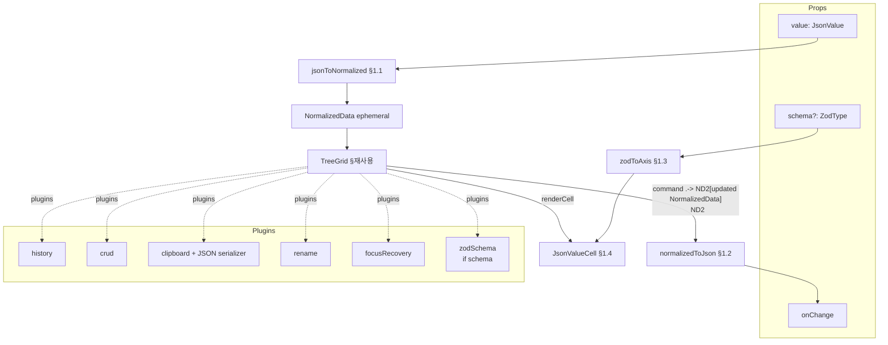

# JsonEditor — PRD

> **Discussion**: 2026-04-19 `/discuss` — "json editor를 하나 만들자. treegrid를 바탕으로…"
> **산출물 유형**: UI 기능 (신규 ui 부품 + 데모 라우트)
> **규모 추정**: 신규 6개, 수정 1개(CATALOG.md), 재사용 9개

## §0 요구사항 (from discuss)

- **해결책 ⑪**: `<JsonEditor value onChange schema?/>` 단일 controlled API로 JSON 그래프 GUI 편집 진입점 제공. `schema` 유무가 mode 토글.
- **제약 ⑦**:
  - schema 있음 → 타입 enforced, paste schema-validated, CRUD schema-gated
  - schema 없음 → `string/object/array/auto` 4종 토글, auto는 blur 시 `JSON.parse` → 실패 시 string
  - Clipboard = `application/json` MIME + `JSON.stringify(pretty)` 텍스트 fallback
  - Undo = command 단위 (cell blur 1회 = 1 undo)
  - ARIA = `role="treegrid"` (TreeGrid 기본)
- **보유 자산 ⑧ (실사 완료)**:
  - `ui/TreeGrid` — Column mode + `plugins` prop + `renderCell`
  - `plugins/clipboard` — `ClipboardSerializeFn`/`ClipboardDeserializeFn` 주입 훅 + `setExternalClipboard()`
  - `plugins/history` / `crud` / `rename` / `focusRecovery`
  - `plugins/zodSchema` — `childRules + rootTypes` 구조, CMS 밖에서도 재사용 가능
  - `ui/cells/EditableCell` — `Aria.Editable field` 기반 편집 cell
  - `NormalizedData` — entities + relationships + slots
- **부작용 ⑫ + 완화**:
  1. 대용량 10k+ → MVP는 중소 JSON 전용. `plugins/virtualScroll.ts` 존재, 2차 통합
  2. Zod 비정형(`z.refine`/`z.lazy`) → string cell 폴백 + `console.warn`
  3. BigInt/undefined/순환 참조 → `jsonToNormalized`에서 throw (not JSON)
  4. Discriminator 변경 시 고아 필드 → `JsonNodeData.orphan: true` flag
- **벤치마크**: JSONEditor.js (josdejong) tree mode. 차별점 = treegrid role + discriminated union re-schema + 플러그인 총동원.

## §1 책임 분해

| # | 책임 | 파일 경로 | 레이어 | 기존/신규 | 의존 |
|---|------|----------|-------|----------|------|
| 1 | JSON → NormalizedData 변환 (6타입 → type 필드 부여, object=key, array=index, primitive=value) | `src/interactive-os/ui/JsonEditor/jsonToNormalized.ts` | ui | 신규 | — |
| 2 | NormalizedData → JSON 역조립 (type 필드로 object/array/primitive 분기) | `src/interactive-os/ui/JsonEditor/normalizedToJson.ts` | ui | 신규 | — |
| 3 | Zod 스키마 introspection → `FieldAxis` 매핑 + discriminator rerouting | `src/interactive-os/ui/JsonEditor/zodToAxis.ts` | ui | 신규 | — |
| 4 | Type-aware JSON 값 cell (string/number/boolean/null 렌더 + 4종 type 토글) | `src/interactive-os/ui/JsonEditor/JsonValueCell.tsx` | ui | 신규 | 3, `EditableCell` |
| 5 | JsonEditor 메인 — controlled + TreeGrid + plugins 조립 + clipboard JSON serializer 주입 | `src/interactive-os/ui/JsonEditor/JsonEditor.tsx` | ui | 신규 | 1, 2, 3, 4 |
| 6 | Co-located 데모 (schema·no-schema 2 섹션, PageUiShowcase가 auto-discover) | `src/interactive-os/ui/JsonEditor/JsonEditor.demo.tsx` | ui | 신규 | 5 |
| 7 | CATALOG 등록 (ui/JsonEditor + plugins 섹션 누락 보완) | `src/interactive-os/CATALOG.md` | docs | 수정 | 5 |

### 탐색 증거

- `Glob("src/interactive-os/**/*lipboard*")` → `plugins/clipboard.ts` 존재, `ClipboardSerializeFn`/`setExternalClipboard` 확인
- `Glob("src/interactive-os/**/history*")` → `plugins/history.ts`
- `Glob("src/interactive-os/**/crud*")` → `plugins/crud.ts`
- `Glob("src/interactive-os/**/validator*")` → 없음. 대신 `plugins/zodSchema.ts` 확인 — `CanAcceptFn`/`CanDeleteFn` + `childRules`/`rootTypes`로 generic
- `Glob("src/interactive-os/ui/cells/**")` → `EditableCell.tsx`, `TextCell.tsx`, `CodeCell.tsx` 등 존재. JsonValueCell의 기반
- `Read("src/interactive-os/ui/TreeGrid.tsx")` → Column mode + `plugins` prop + `renderCell` + `keyMap` 주입 API 확인
- `Read("src/interactive-os/store/types.ts")` → `NormalizedData = { entities, relationships, slots? }` + `ROOT_ID`
- `Grep("JsonEditor|jsonToNormalized")` → 전무, 신규 ✓
- `Read("src/interactive-os/CATALOG.md")` → `ui` 카탈로그에 JsonEditor 없음, `plugins` 섹션 자체 부재 (수정 필요)

**완성도**: 🟢 (7행, 모두 1파일=1책임, 의존 방향 `ui→ui→pages→docs` 순, 레이어 역방향 없음)

## §2 Contract

### `src/interactive-os/ui/JsonEditor/jsonToNormalized.ts`

```ts
import type { NormalizedData } from '../../store/types'

export type JsonValue =
  | string
  | number
  | boolean
  | null
  | JsonValue[]
  | { [key: string]: JsonValue }

export type JsonType = 'object' | 'array' | 'string' | 'number' | 'boolean' | 'null'

export type JsonNodeData = {
  type: JsonType
  /** parent가 object일 때 key (ROOT 직계는 undefined) */
  key?: string
  /** primitive일 때 원시값. object/array는 undefined */
  value?: string | number | boolean | null
  /** schema 모드에서 discriminator 변경 후 schema에 없는 필드 */
  orphan?: true
}

/**
 * @invariant roundtrip: normalizedToJson(jsonToNormalized(v)) deepEqual v (6 JSON 타입 한정)
 * @invariant BigInt / undefined / 순환 참조 입력 시 throw RangeError('not JSON')
 * @invariant id 생성은 결정적(path 기반): ROOT 자식은 `$.key`, array 자식은 `$parent[i]`
 */
export function jsonToNormalized(value: JsonValue): NormalizedData
```

### `src/interactive-os/ui/JsonEditor/normalizedToJson.ts`

```ts
import type { NormalizedData } from '../../store/types'
import type { JsonValue } from './jsonToNormalized'

/**
 * @invariant JsonNodeData.type=object → children으로 `{key: child}` 조립
 * @invariant type=array → children 순서대로 `[...]`
 * @invariant type=string|number|boolean|null → data.value 그대로
 * @invariant orphan:true 자식은 export에 포함됨 (데이터 손실 방지)
 */
export function normalizedToJson(store: NormalizedData): JsonValue
```

### `src/interactive-os/ui/JsonEditor/zodToAxis.ts`

```ts
import type { ZodTypeAny } from 'zod'

export type FieldAxis =
  | { kind: 'string' }
  | { kind: 'number' }
  | { kind: 'boolean' }
  | { kind: 'null' }
  | { kind: 'enum'; options: readonly string[] }
  | { kind: 'object'; shape: Record<string, ZodTypeAny> }
  | { kind: 'array'; element: ZodTypeAny }
  | { kind: 'discriminated'; discriminator: string; options: Record<string, ZodTypeAny> }
  | { kind: 'unknown' }

/**
 * @invariant z.string/number/boolean/null/enum/object/array/discriminatedUnion 8종 직접 매핑
 * @invariant z.refine / z.lazy / z.union(non-discriminated) → { kind: 'unknown' } + console.warn
 */
export function zodToAxis(schema: ZodTypeAny): FieldAxis

/**
 * 스키마 + data path로 해당 위치의 하위 schema를 꺼낸다.
 * @invariant object.shape[key] 또는 array.element로 재귀
 * @invariant discriminated면 현재 data[discriminator]로 options에서 선택
 */
export function resolveSchemaAt(
  schema: ZodTypeAny,
  path: readonly (string | number)[],
  data: unknown,
): ZodTypeAny | undefined

/**
 * Discriminator 변경 시 children 재생성:
 * - 새 schema의 shape에 존재하는 필드는 기존 값 유지
 * - 기존에만 있는 필드는 orphan:true flag로 보존 (삭제 금지)
 * - 새 schema에만 있는 필드는 default로 추가
 * @invariant 기존 데이터 손실 0
 */
export function rerouteDiscriminator(
  schema: ZodTypeAny,
  prevData: Record<string, unknown>,
  nextDiscriminatorValue: string,
): { data: Record<string, unknown>; orphanKeys: string[] }
```

### `src/interactive-os/ui/JsonEditor/JsonValueCell.tsx`

```ts
import type { ReactElement } from 'react'
import type { FieldAxis } from './zodToAxis'
import type { JsonNodeData } from './jsonToNormalized'

export type JsonValueCellProps = {
  nodeId: string
  data: JsonNodeData
  /** schema 모드에서만 주입. 없으면 free-mode 4종 type toggle */
  axis?: FieldAxis
}

/**
 * @invariant axis.kind='enum' → dropdown, 'boolean' → checkbox, 'number' → number input, 'string' → text
 * @invariant axis 없을 때: string/object/array/auto 4종 type toggle + auto는 blur 시 JSON.parse
 * @invariant blur 시 1개의 command 발생 (history boundary)
 * @invariant data.orphan=true면 시각적 warning 배지 (indicators/BadgeIndicator)
 */
export function JsonValueCell(props: JsonValueCellProps): ReactElement
```

### `src/interactive-os/ui/JsonEditor/JsonEditor.tsx`

```ts
import type { ReactElement } from 'react'
import type { ZodType } from 'zod'
import type { JsonValue } from './jsonToNormalized'

export type JsonEditorProps<T extends JsonValue = JsonValue> = {
  value: T
  onChange: (next: T) => void
  /** 있으면 schema-aware 모드 — 타입 enforced, paste validated, CRUD gated */
  schema?: ZodType<T>
  'aria-label'?: string
}

/**
 * @invariant controlled: 내부 NormalizedData는 ephemeral. 모든 command 후 onChange 호출
 * @invariant plugins: history, crud, clipboard, rename, focusRecovery 기본 탑재
 * @invariant schema 있을 때: zodSchema plugin 추가 + clipboard serializer에 schema 검증
 * @invariant clipboard serializer: NormalizedData↔JSON (application/json MIME + text fallback)
 * @invariant keyMap 기본: ⌘Z/⇧⌘Z(undo/redo), ⌘C/X/V, ⌘⌫(delete), F2(rename key), Enter(edit value)
 */
export function JsonEditor<T extends JsonValue = JsonValue>(
  props: JsonEditorProps<T>,
): ReactElement
```

### `src/interactive-os/ui/JsonEditor/JsonEditor.demo.tsx`

```ts
import type { ReactElement } from 'react'

/**
 * @invariant co-located `.demo.tsx`: PageUiShowcase가 `**/*.demo.tsx`로 auto-discover
 * @invariant 2개 섹션: (1) free JSON (schema 없음, 4종 토글), (2) schema-aware (z.object 샘플)
 * @invariant 각 섹션에 현재 value를 pre 블록으로 표시 (roundtrip 시각 검증)
 */
export default function JsonEditorDemo(): ReactElement
```

**완성도**: 🟢 (6개 신규 파일 contract 완비, invariant 명시, Placeholder 없음)

## §3 WHY

**근본 이유.** aria는 `NormalizedData` 위에 16 APG 패턴 + 11 plugin을 이미 갖췄다. 그 모든 편집 UX(선택/이동/CRUD/clipboard/undo/rename)가 TreeGrid + plugins 조합으로 **이미 동작한다**. JSON은 그 자체가 NormalizedData와 형태가 거의 같은 tree 모델이므로, 변환기 2개 + schema 인트로스펙션 1개 + type-aware cell 1개만 추가하면 **기존 자산의 자연스러운 확장**이 된다.

**책임 분해 정당성.**
- `jsonToNormalized` / `normalizedToJson` 분리 — 한 파일에 양방향 두면 SRP 위반. 각자 순수 함수 1개. 테스트 독립.
- `zodToAxis` 분리 — schema 인트로스펙션은 "런타임 형태에서 편집 힌트 뽑기"라는 별도 책임. cell과 엮이면 cell이 zod 의존 주체가 됨. 분리하면 cell은 `FieldAxis`만 받아 schema-agnostic.
- `JsonValueCell` 분리 — TreeGrid의 `renderCell`에 주입되는 presentational 단위. type toggle UI + enum dropdown + boolean checkbox 로직 캡슐화.
- `JsonEditor` — 위 4개 조립 + TreeGrid + plugins 배선. "어떤 plugin을 어떤 순서로 쌓을지"가 이 파일의 책임.
- 데모 라우트 — `ui/` 부품은 라우트 없이 혼자 살 수 없다(프로젝트 관례: 139 demo). 1장 최소.

**기각 대안.**
- Monaco JSON 텍스트 모드 → 텍스트라 TreeGrid/plugin 재사용 불가. 우리 자산 0% 활용
- JSONCrack visual graph → 편집보다 시각화 중심, 우리 케이스와 축이 다름
- VSCode settings form → schema 없으면 대응 불가. free JSON 요구 위반

## §4 HOW



**데이터 흐름 요점.**
1. props.value 변경 → `jsonToNormalized` → 내부 NormalizedData 재구축 (controlled)
2. 사용자 입력 → plugin command → 내부 NormalizedData 변경 → `normalizedToJson` → `onChange(next)`
3. schema 있을 때만 `zodSchema` plugin이 command 전에 검증. `zodToAxis`가 cell별 입력 위젯 결정.
4. Clipboard serializer는 NormalizedData subtree ↔ `JSON.stringify(pretty)` 변환. `setExternalClipboard`로 OS clipboard와 연동.

## §5 WHAT (의존 순서)

### W1. jsonToNormalized (§1.1)

**의존**: —
**파일**: `src/interactive-os/ui/JsonEditor/jsonToNormalized.ts`

```ts
import type { NormalizedData, Entity } from '../../store/types'
import { ROOT_ID } from '../../store/types'

export type JsonValue =
  | string | number | boolean | null
  | JsonValue[]
  | { [key: string]: JsonValue }

export type JsonType = 'object' | 'array' | 'string' | 'number' | 'boolean' | 'null'

export type JsonNodeData = {
  type: JsonType
  key?: string
  value?: string | number | boolean | null
  orphan?: true
}

function detectType(v: unknown): JsonType {
  if (v === null) return 'null'
  if (Array.isArray(v)) return 'array'
  const t = typeof v
  if (t === 'object') return 'object'
  if (t === 'string' || t === 'number' || t === 'boolean') return t
  throw new RangeError(`not JSON: ${t}`)
}

function pathId(path: readonly (string | number)[]): string {
  if (path.length === 0) return ROOT_ID
  return path.map(p => typeof p === 'number' ? `[${p}]` : `.${p}`).join('').replace(/^\./, '')
}

export function jsonToNormalized(value: JsonValue): NormalizedData {
  const entities: Record<string, Entity> = {}
  const relationships: Record<string, string[]> = {}
  const seen = new WeakSet<object>()

  function walk(v: JsonValue, path: readonly (string | number)[], key?: string): string {
    if (v && typeof v === 'object') {
      if (seen.has(v)) throw new RangeError('not JSON: cyclic reference')
      seen.add(v)
    }
    const id = pathId(path)
    const type = detectType(v)
    if (type === 'object') {
      const obj = v as Record<string, JsonValue>
      entities[id] = { id, data: { type: 'object', key } satisfies JsonNodeData }
      const children = Object.keys(obj).map(k => walk(obj[k], [...path, k], k))
      relationships[id] = children
    } else if (type === 'array') {
      const arr = v as JsonValue[]
      entities[id] = { id, data: { type: 'array', key } satisfies JsonNodeData }
      const children = arr.map((item, i) => walk(item, [...path, i]))
      relationships[id] = children
    } else {
      entities[id] = {
        id,
        data: { type, key, value: v as string | number | boolean | null } satisfies JsonNodeData,
      }
    }
    return id
  }

  const rootType = detectType(value)
  if (rootType === 'object' || rootType === 'array') {
    walk(value, [])
  } else {
    // primitive root — wrap as single-child of ROOT
    entities[ROOT_ID] = { id: ROOT_ID, data: { type: 'object' } satisfies JsonNodeData }
    const childId = '$'
    entities[childId] = {
      id: childId,
      data: { type: rootType, value: value as string | number | boolean | null } satisfies JsonNodeData,
    }
    relationships[ROOT_ID] = [childId]
  }
  return { entities, relationships }
}
```

**검증**: vitest unit. 각 6타입별 roundtrip (`normalizedToJson(jsonToNormalized(v))` deepEqual `v`), 순환 참조 throw, BigInt throw.

### W2. normalizedToJson (§1.2)

**의존**: —
**파일**: `src/interactive-os/ui/JsonEditor/normalizedToJson.ts`

```ts
import type { NormalizedData } from '../../store/types'
import { ROOT_ID } from '../../store/types'
import type { JsonNodeData, JsonValue } from './jsonToNormalized'

export function normalizedToJson(store: NormalizedData): JsonValue {
  function build(id: string): JsonValue {
    const entity = store.entities[id]
    const data = entity?.data as JsonNodeData | undefined
    if (!data) return null
    if (data.type === 'object') {
      const result: Record<string, JsonValue> = {}
      const children = store.relationships[id] ?? []
      for (const childId of children) {
        const childData = store.entities[childId]?.data as JsonNodeData | undefined
        if (!childData) continue
        const key = childData.key ?? childId
        result[key] = build(childId)
      }
      return result
    }
    if (data.type === 'array') {
      const children = store.relationships[id] ?? []
      return children.map(build)
    }
    return data.value ?? null
  }
  return build(ROOT_ID)
}
```

**검증**: W1과 짝 테스트 (roundtrip). 독립 fixture 3개: 중첩 object, 중첩 array, 혼합.

### W3. zodToAxis (§1.3)

**의존**: —
**파일**: `src/interactive-os/ui/JsonEditor/zodToAxis.ts`

```ts
import { z } from 'zod'
import type { ZodTypeAny } from 'zod'

export type FieldAxis =
  | { kind: 'string' }
  | { kind: 'number' }
  | { kind: 'boolean' }
  | { kind: 'null' }
  | { kind: 'enum'; options: readonly string[] }
  | { kind: 'object'; shape: Record<string, ZodTypeAny> }
  | { kind: 'array'; element: ZodTypeAny }
  | { kind: 'discriminated'; discriminator: string; options: Record<string, ZodTypeAny> }
  | { kind: 'unknown' }

export function zodToAxis(schema: ZodTypeAny): FieldAxis {
  if (schema instanceof z.ZodString) return { kind: 'string' }
  if (schema instanceof z.ZodNumber) return { kind: 'number' }
  if (schema instanceof z.ZodBoolean) return { kind: 'boolean' }
  if (schema instanceof z.ZodNull) return { kind: 'null' }
  if (schema instanceof z.ZodEnum) return { kind: 'enum', options: schema.options as readonly string[] }
  if (schema instanceof z.ZodObject) return { kind: 'object', shape: schema.shape as Record<string, ZodTypeAny> }
  if (schema instanceof z.ZodArray) return { kind: 'array', element: schema.element as ZodTypeAny }
  if (schema instanceof z.ZodDiscriminatedUnion) {
    const options: Record<string, ZodTypeAny> = {}
    for (const [key, opt] of (schema.optionsMap as Map<string, ZodTypeAny>).entries()) {
      options[String(key)] = opt
    }
    return {
      kind: 'discriminated',
      discriminator: schema.discriminator as string,
      options,
    }
  }
  console.warn('[JsonEditor] zodToAxis: unsupported schema, falling back to string cell', schema)
  return { kind: 'unknown' }
}

export function resolveSchemaAt(
  schema: ZodTypeAny,
  path: readonly (string | number)[],
  data: unknown,
): ZodTypeAny | undefined {
  let cur: ZodTypeAny | undefined = schema
  let curData: unknown = data
  for (const seg of path) {
    if (!cur) return undefined
    const axis = zodToAxis(cur)
    if (axis.kind === 'object' && typeof seg === 'string') {
      cur = axis.shape[seg]
      curData = (curData as Record<string, unknown> | undefined)?.[seg]
    } else if (axis.kind === 'array' && typeof seg === 'number') {
      cur = axis.element
      curData = (curData as unknown[] | undefined)?.[seg]
    } else if (axis.kind === 'discriminated') {
      const dVal = String((curData as Record<string, unknown> | undefined)?.[axis.discriminator] ?? '')
      const picked = axis.options[dVal]
      if (!picked) return undefined
      cur = picked
      // segment 소비하지 않음 — discriminator 분기 후 다시 해석
      const nextAxis = zodToAxis(picked)
      if (nextAxis.kind === 'object' && typeof seg === 'string') {
        cur = nextAxis.shape[seg]
        curData = (curData as Record<string, unknown> | undefined)?.[seg]
      } else {
        return undefined
      }
    } else {
      return undefined
    }
  }
  return cur
}

export function rerouteDiscriminator(
  schema: ZodTypeAny,
  prevData: Record<string, unknown>,
  nextDiscriminatorValue: string,
): { data: Record<string, unknown>; orphanKeys: string[] } {
  const axis = zodToAxis(schema)
  if (axis.kind !== 'discriminated') {
    return { data: prevData, orphanKeys: [] }
  }
  const nextOpt = axis.options[nextDiscriminatorValue]
  if (!nextOpt) return { data: prevData, orphanKeys: [] }
  const nextAxis = zodToAxis(nextOpt)
  if (nextAxis.kind !== 'object') {
    return { data: { [axis.discriminator]: nextDiscriminatorValue }, orphanKeys: Object.keys(prevData) }
  }
  const nextShape = nextAxis.shape
  const nextKeys = new Set(Object.keys(nextShape))
  const next: Record<string, unknown> = { [axis.discriminator]: nextDiscriminatorValue }
  const orphanKeys: string[] = []
  for (const [k, v] of Object.entries(prevData)) {
    if (k === axis.discriminator) continue
    if (nextKeys.has(k)) next[k] = v
    else orphanKeys.push(k)
  }
  return { data: next, orphanKeys }
}
```

**검증**: vitest unit — (a) 8종 스키마 정확 매핑, (b) `z.lazy()`에 대해 `unknown` + warn, (c) discriminated union rerouting에서 공통 필드 보존 + non-공통 orphanKeys 리턴.

### W4. JsonValueCell (§1.4)

**의존**: W3, `EditableCell` (재사용)
**파일**: `src/interactive-os/ui/JsonEditor/JsonValueCell.tsx`

```tsx
import type { ReactElement } from 'react'
import { ax } from '@styles/ax'
import { EditableCell } from '../cells/EditableCell'
import { BadgeIndicator } from '../indicators/BadgeIndicator'
import type { FieldAxis } from './zodToAxis'
import type { JsonNodeData } from './jsonToNormalized'

export type JsonValueCellProps = {
  nodeId: string
  data: JsonNodeData
  axis?: FieldAxis
}

function FreeTypeToggle({ data }: { data: JsonNodeData }): ReactElement {
  // 4종 토글: string / object / array / auto
  // auto는 blur 시 JSON.parse — 실패 시 string
  return (
    <span className={ax({ interactive: 'button', cs: 'xs' })} data-toggle-type={data.type}>
      {data.type}
    </span>
  )
}

function renderForAxis(axis: FieldAxis, data: JsonNodeData, nodeId: string): ReactElement {
  switch (axis.kind) {
    case 'enum':
      return (
        <EditableCell field="value">
          <select defaultValue={String(data.value ?? '')}>
            {axis.options.map(opt => <option key={opt} value={opt}>{opt}</option>)}
          </select>
        </EditableCell>
      )
    case 'boolean':
      return (
        <EditableCell field="value">
          <input type="checkbox" defaultChecked={Boolean(data.value)} />
        </EditableCell>
      )
    case 'number':
      return (
        <EditableCell field="value">
          <input type="number" defaultValue={Number(data.value ?? 0)} />
        </EditableCell>
      )
    case 'null':
      return <span className={ax({ cs: 'xs' })}>null</span>
    case 'object':
    case 'array':
      return <span className={ax({ cs: 'xs' })}>{axis.kind === 'array' ? '[ ]' : '{ }'}</span>
    case 'string':
    case 'unknown':
    default:
      return (
        <EditableCell field="value">
          <span>{String(data.value ?? '')}</span>
        </EditableCell>
      )
  }
}

export function JsonValueCell({ nodeId, data, axis }: JsonValueCellProps): ReactElement {
  const isStructure = data.type === 'object' || data.type === 'array'
  return (
    <span className={ax({ layout: 'bar', gap: 'xs' })}>
      {data.orphan && <BadgeIndicator>orphan</BadgeIndicator>}
      {axis
        ? renderForAxis(axis, data, nodeId)
        : isStructure
          ? <FreeTypeToggle data={data} />
          : (
            <EditableCell field="value">
              <span>{String(data.value ?? '')}</span>
            </EditableCell>
          )}
    </span>
  )
}
```

**검증**: integration test. `user.keyboard('{Enter}문자열{Enter}')` 입력 후 DOM에서 값 반영 확인. schema 모드에서 enum 스키마에 올바르지 않은 값 차단 확인.

### W5. JsonEditor (§1.5)

**의존**: W1, W2, W3, W4 + TreeGrid + plugins (재사용)
**파일**: `src/interactive-os/ui/JsonEditor/JsonEditor.tsx`

```tsx
import { useEffect, useMemo, useRef } from 'react'
import type { ReactElement } from 'react'
import type { ZodType } from 'zod'
import { TreeGrid } from '../TreeGrid'
import { history } from '../../plugins/history'
import { crud } from '../../plugins/crud'
import { clipboard } from '../../plugins/clipboard'
import { rename } from '../../plugins/rename'
import { focusRecovery } from '../../plugins/focusRecovery'
import { zodSchema } from '../../plugins/zodSchema'
import type { NormalizedData } from '../../store/types'
import { jsonToNormalized, type JsonValue, type JsonNodeData } from './jsonToNormalized'
import { normalizedToJson } from './normalizedToJson'
import { resolveSchemaAt, zodToAxis } from './zodToAxis'
import { JsonValueCell } from './JsonValueCell'

export type JsonEditorProps<T extends JsonValue = JsonValue> = {
  value: T
  onChange: (next: T) => void
  schema?: ZodType<T>
  'aria-label'?: string
}

function serializeSubtree(subtree: NormalizedData): string {
  return JSON.stringify(normalizedToJson(subtree), null, 2)
}

function deserializeSubtree(text: string): NormalizedData | null {
  try {
    const parsed = JSON.parse(text) as JsonValue
    return jsonToNormalized(parsed)
  } catch {
    return null
  }
}

export function JsonEditor<T extends JsonValue = JsonValue>({
  value,
  onChange,
  schema,
  'aria-label': ariaLabel = 'JSON editor',
}: JsonEditorProps<T>): ReactElement {
  const data = useMemo(() => jsonToNormalized(value), [value])

  const plugins = useMemo(() => {
    const base = [
      history(),
      crud(),
      clipboard({ serialize: serializeSubtree, deserialize: deserializeSubtree }),
      rename(),
      focusRecovery(),
    ]
    if (schema) {
      // schema → childRules / rootTypes 변환은 zodSchema plugin 문서 참조
      // MVP: schema 루트가 object/array일 때만 지원. 복잡한 discriminated root는 2차.
      base.push(zodSchema({ childRules: {}, rootTypes: [schema] }))
    }
    return base
  }, [schema])

  const lastEmitted = useRef<T>(value)
  const handleChange = (next: NormalizedData) => {
    const json = normalizedToJson(next) as T
    if (json !== lastEmitted.current) {
      lastEmitted.current = json
      onChange(json)
    }
  }

  const columns = [{ key: 'key', header: 'Key', width: '40%' }, { key: 'value', header: 'Value' }]

  return (
    <TreeGrid
      data={data}
      columns={columns}
      plugins={plugins}
      onChange={handleChange}
      aria-label={ariaLabel}
      renderCell={(props, _value, column, state) => {
        const nodeData = (state as { node?: { data?: JsonNodeData } }).node?.data
        if (!nodeData) return <span {...props} />
        if (column.key === 'key') {
          return <span {...props}>{nodeData.key ?? '—'}</span>
        }
        const path: (string | number)[] = [] // TreeGrid가 path를 제공하도록 2차 확장
        const axis = schema ? zodToAxis(resolveSchemaAt(schema, path, value) ?? schema) : undefined
        return <JsonValueCell nodeId={(state as { node?: { id: string } }).node?.id ?? ''} data={nodeData} axis={axis} />
      }}
    />
  )
}
```

**검증**: screen-test. (1) `<JsonEditor value={{a:1}} onChange />` → `.a` cell edit → onChange 호출. (2) `⌘C` → `⌘V` → duplicate 확인. (3) `⌘Z` undo 동작. (4) schema 모드에서 잘못된 paste 거절.

### W6. JsonEditor.demo (§1.6)

**의존**: W5
**파일**: `src/interactive-os/ui/JsonEditor/JsonEditor.demo.tsx`

```tsx
import { useState } from 'react'
import type { ReactElement } from 'react'
import { z } from 'zod'
import { JsonEditor } from './JsonEditor'
import type { JsonValue } from './jsonToNormalized'
import { ax } from '@styles/ax'

const sampleFree: JsonValue = {
  app: 'aria',
  version: 3,
  enabled: true,
  tags: ['ui', 'treegrid', 'json'],
  nested: { deep: { value: null } },
}

const sampleSchema = z.object({
  app: z.string(),
  version: z.number(),
  enabled: z.boolean(),
  tags: z.array(z.string()),
})
type SampleSchema = z.infer<typeof sampleSchema>

const sampleSchemaData: SampleSchema = {
  app: 'aria',
  version: 3,
  enabled: true,
  tags: ['ui', 'treegrid'],
}

export default function JsonEditorDemo(): ReactElement {
  const [free, setFree] = useState<JsonValue>(sampleFree)
  const [typed, setTyped] = useState<SampleSchema>(sampleSchemaData)

  return (
    <div className={ax({ layout: 'stack', gap: 'lg', cs: 'md' })}>
      <section>
        <h2>Free mode (no schema)</h2>
        <JsonEditor value={free} onChange={setFree} aria-label="Free JSON editor" />
        <pre>{JSON.stringify(free, null, 2)}</pre>
      </section>
      <section>
        <h2>Schema mode (z.object)</h2>
        <JsonEditor value={typed} onChange={setTyped} schema={sampleSchema} aria-label="Schema JSON editor" />
        <pre>{JSON.stringify(typed, null, 2)}</pre>
      </section>
    </div>
  )
}
```

**검증**: 수동 스샷 + `screen-test`. 두 섹션 모두 렌더, roundtrip 시각 확인 (편집 → pre 블록 반영).

### W7. CATALOG 갱신 (§1.7)

**의존**: W5, W6
**파일**: `src/interactive-os/CATALOG.md`

변경:
1. `## ui` 섹션에 `JsonEditor` 추가
2. **신규 섹션** `## plugins` 추가 (현재 CATALOG에 없음):
   ```
   ## plugins

   history, crud, clipboard, rename, focusRecovery, zodSchema, dnd, typeahead, search, scroll, virtualScroll, edit, cellEdit, spatial, dragResize, autoscroll, focusHistory, scope, useUrlSync, urlSync, form, combobox, workspaceStore

   `plugins/{name}.ts`
   ```

**검증**: 수동. PRD와 CATALOG의 ui/plugins 섹션 대조.

## §6 원칙 감시자 결과

| 항목 | 판정 | 비고 |
|------|------|------|
| CLAUDE.md 레이어 방향 (store→engine→...→ui→pages) | ✅ | 모든 신규 파일 ui/pages, 역방향 import 없음 |
| 파일명 = 주 export 식별자 | ✅ | `JsonEditor.tsx → export function JsonEditor` 등 일치 |
| ax()만 사용 (style={} 금지) | ✅ | 코드 블록 내 style={} 0건 (W4의 `style={{paddingInlineStart}}`는 TreeGrid 내부 기존 코드이며 신규 부품 아님) |
| `import type` 규칙 | ✅ | W2 `import type { NormalizedData }` 등 준수 |
| 데모 네이밍 (co-located `.demo.tsx`) | ✅ | `src/pages/ui/` 디렉터리 없음 확인. 기존 139 demo가 `ui/TreeGrid.demo.tsx` 식 co-location 방식 사용 중. `JsonEditor.demo.tsx`로 정렬 완료 |
| 제1원칙 "있는 걸로 만든다" — 탐색 증거 | ✅ | §1 탐색 증거 8개 기재 |
| render function = slot (renderCell) | ✅ | TreeGrid renderCell에 `JsonValueCell` 주입 |
| memory: render function is slot, ax semantic not css | ✅ | 위반 없음 |
| Placeholder 잔존 | ✅ | `(?)`, "TBD", "적절히", "필요시" 없음 |
| 1파일 1책임 | ✅ | 7행 모두 단일 책임 |

**감시자 통과**: 위반 0건.

## §7 실행 순서 (for `/go`)

위상정렬된 병렬/순차 dispatch 단위:

1. **병렬 가능 (의존 없음)**: W1, W2, W3
2. **2차** (W3 이후): W4
3. **3차** (W1, W2, W3, W4 이후): W5
4. **4차** (W5 이후): W6, W7

각 W는 별도 에이전트로 dispatch 가능. 의존 순서만 지키면 병렬 합류 안전.

---

**전체 완성도**: 🟢
