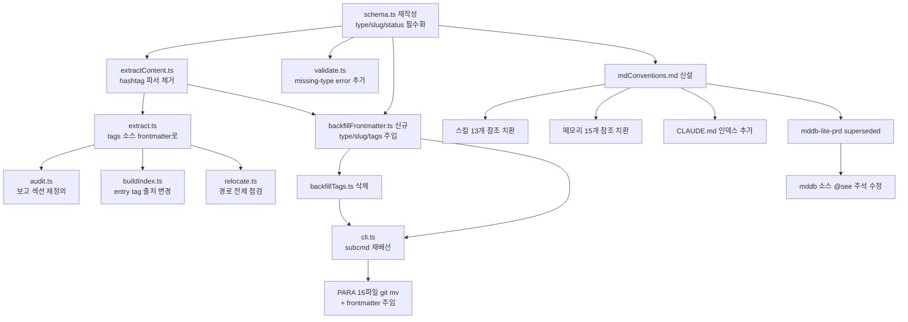

# md 경로 정책 — frontmatter SSOT 마이그레이션 PRD

> **Discussion**: 본 세션 (2026-04-19) `/discuss → /prd`. ⑪ 해결 🟢, FRT 6/6 🟢.
> **산출물 유형**: 규격 문서 + mddb 재작성 + 스킬/메모리/파일 일괄 마이그레이션
> **규모 추정**: 신규 2, 수정 12, 삭제 2, 이동 16, 참조 치환 22곳

## §0 요구사항 (from discuss)

- **해결책 ⑪**: `docs/` 분류 책임을 **폴더 → frontmatter**로 이전. 폴더는 날짜 SSOT (`docs/YYYY/YYYY-MM/YYYY-MM-DD/`), 분류는 frontmatter SSOT (`type/slug/tags/status/project/layer/...`). 하단 해시태그 라인 규약 폐기.
- **제약 ⑦**:
  - git mv로 history 보존 (rename blame 체인 유지)
  - `yaml` 패키지만 사용 (mddb 기존 의존성, 추가 설치 0)
  - md-validate.mjs 훅은 cli.ts 래퍼라 내부만 바뀌면 작동 (훅 자체 수정 최소)
  - 생성일 추정: `git log --follow --format='%ai' <file> | tail -1` → 실패 시 오늘 폴더 fallback
  - 외부 공개 링크 없음 전제 (docs/ 내부용)
- **보유 자산 ⑧**:
  - 날짜 폴더 구조 (`docs/2026/2026-{03,04}/`)
  - mddb-lite 파이프라인: schema/extract/validate/audit/buildIndex/relocate/backfill/cli 10파일 (뒤집기 대상)
  - `yaml` 패키지 (이미 `extractContent.ts:11`에서 사용 중)
  - `git log --follow` 기반 생성일 추출 (`extractGitDates.ts` 참조 가능)
  - PARA 잔존 파일 16개 (`0-inbox` 1 + `1-projects/viewer` 7 + `5-backlogs` 3 + `refs/finder` 4 + `BACKLOGS.md` 1)
- **외부 탐색 ⑨**: Jekyll/Hugo/Astro/Docusaurus/Obsidian Properties/Hashnode 전부 frontmatter SSOT. "마지막 줄 해시태그 = SSOT"는 업계 전례 없음 (Obsidian inline tag는 병용, SSOT 아님).
- **정석 판정**: frontmatter SSOT는 **사실상 표준**. 환경 검증(Node+Vite, yaml 호환, 빌드타임 추출, 스코프 감소) 통과.

## §1 책임 분해

| # | 책임 | 파일 경로 | 레이어 | 기존/신규 | 의존 |
|---|------|----------|-------|----------|------|
| 1 | md 규격 문서 — frontmatter 스키마·파일명 규칙·하단 태그 폐기 선언·쿼리 관례 | `docs/2026/2026-04/2026-04-19/mdConventions.md` | docs | 신규 | — |
| 2 | schema 재작성 — `.strict()` 유지, `type/slug/status/project/layer/consumed_by` 필수·선택 필드 추가, hashtag 정규식 3종 제거, warning code 재정의 | `scripts/mddb/schema.ts` | mddb | 수정 | 1 |
| 3 | extractContent 재작성 — frontmatter 파싱만, 하단 hashtag 파서 제거, `ContentExtract.tags` 필드 제거 | `scripts/mddb/extractContent.ts` | mddb | 수정 | 2 |
| 4 | extract 조정 — `tags` 소스를 frontmatter.tags로만, filename·path 파생 tag 제거 | `scripts/mddb/extract.ts` | mddb | 수정 | 3 |
| 5 | validate 갱신 — `missing-type/missing-slug/missing-tags` 에러 코드 추가, hashtag 관련 코드 제거 | `scripts/mddb/validate.ts` | mddb | 수정 | 2 |
| 6 | backfillFrontmatter 스크립트 신설 — 기존 frontmatter·filename·rename history로 type/slug/tags 추론하여 주입 | `scripts/mddb/backfillFrontmatter.ts` | mddb | 신규 | 2,3 |
| 7 | backfillTags 삭제 — 하단 hashtag 주입 로직 폐기 | `scripts/mddb/backfillTags.ts` | mddb | 삭제 | 6 |
| 8 | audit 갱신 — tag 출처를 frontmatter로, 보고 섹션 재정의 | `scripts/mddb/audit.ts` | mddb | 수정 | 4 |
| 9 | buildIndex 갱신 — index entry의 tag 출처 변경 | `scripts/mddb/buildIndex.ts` | mddb | 수정 | 4 |
| 10 | relocate 확인 — 이동 대상 파일 경로 전제가 frontmatter 기반인지 점검, 필요 시 조정 | `scripts/mddb/relocate.ts` | mddb | 수정 | 4 |
| 11 | cli 갱신 — `backfill` 서브커맨드 → `backfillFrontmatter` 호출로 교체 | `scripts/mddb/cli.ts` | mddb | 수정 | 6,7 |
| 12 | PARA 잔존 파일 16개 일괄 이동 — `git mv`로 날짜 폴더 배치 + frontmatter 주입 | `docs/{0-inbox,1-projects,5-backlogs,refs,BACKLOGS.md}/**` → `docs/YYYY/YYYY-MM/YYYY-MM-DD/` | docs | 이동 | 6,11 |
| 13 | 스킬 13개 경로 참조 치환 — 하드코딩된 `docs/0-inbox/` 등을 "mddb 쿼리" 표현으로 대체 | `.claude/skills/{para,pyramid,story,prd,go,handoff,inbox,explain,ia,publish,archive,area,demo-coverage,wireframe,design-review,refactor-collect}/SKILL.md` | skill | 수정 | 1 |
| 14 | 메모리 15개 경로 참조 치환 — `docs/0-inbox/handoff-*` 등 실경로를 새 규칙 표현으로 치환 | `~/.claude/projects/-Users-user-Desktop-aria/memory/*.md` | memory | 수정 | 1 |
| 15 | CLAUDE.md 갱신 — "규칙" 섹션에 `md 작성 규칙 → mdConventions.md` index 추가, 기존 `docs/3-resources/` 파일명 룰 섹션 제거, PARA 언급 정리 | `.claude/CLAUDE.md` | config | 수정 | 1 |
| 16 | mddb-lite-prd 폐기 처리 — "Phase 1 폐기 후 축소" 주석 블록 제거, superseded 선언 | `docs/2026/2026-04/2026-04-18/mddb-lite-prd.md` | docs | 수정 | 1 |
| 17 | mddb 소스 주석 경로 수정 — `@see docs/2-areas/docs-infra/prds/mddb-lite-prd.md` (stale) → 실제 경로 | `scripts/mddb/*.ts` (12파일) | mddb | 수정 | 16 |

### 탐색 증거

- `Bash`: `find /Users/user/Desktop/aria/docs -name "*mddb*"` → 실제 mddb-lite-prd는 `docs/2026/2026-04/2026-04-18/mddb-lite-prd.md` (소스 주석과 불일치 확인)
- `Read`: `scripts/mddb/{schema,extractContent,extractPath,validate,backfillTags,cli}.ts` 정독 완료. 하단 해시태그 SSOT 전제가 전 파일에 박혀 있음 확인.
- `Grep`: `docs/0-inbox|docs/1-projects|docs/2-areas|docs/3-resources|docs/4-archive|docs/5-backlogs|docs/BACKLOGS` → 스킬 7 + 메모리 15 = 22 참조 위치
- `Bash`: `find docs/{0-inbox,1-projects,5-backlogs,refs}` + `ls docs/BACKLOGS.md` → 이동 대상 16파일 집계
- `CATALOG.md` 조회: 해당 없음 (docs infra 스코프, FE 컴포넌트 카탈로그와 무관)

**완성도**: 🟢 (17행 모두 1파일 1책임, 레이어 순서 준수, 의존 순환 없음)

## §2 Contract

### `scripts/mddb/schema.ts` (#2 수정)

```ts
import { z } from 'zod'

export const DATE_FOLDER_RE = /^(\d{4})\/\1-(\d{2})\/\1-\2-(\d{2})\//

export const DOC_TYPES = [
  'prd', 'plan', 'handoff', 'backlog', 'retro', 'audit',
  'explain', 'pyramid', 'minto', 'story', 'ia', 'wireframe',
  'inbox', 'decision', 'area', 'resource', 'archive', 'note',
] as const
export type DocType = typeof DOC_TYPES[number]

/**
 * @invariant tags는 frontmatter 필드 (하단 해시태그 파서 폐기)
 * @invariant type/slug/tags 3필드는 hard required — validate에서 error
 * @invariant DATE_FOLDER_RE는 폴더 강제 (변경 없음)
 */
export const DocFrontmatterSchema = z.object({
  id: z.string().min(1),
  type: z.enum(DOC_TYPES),
  slug: z.string().regex(/^[a-z][a-zA-Z0-9]*$/, 'camelCase required'),
  title: z.string().min(1),
  tags: z.array(z.string()).min(1),
  created: z.string().regex(/^\d{4}-\d{2}-\d{2}$/),
  updated: z.string().regex(/^\d{4}-\d{2}-\d{2}$/),
  summary: z.string().optional(),
  status: z.enum(['open', 'in_progress', 'consumed', 'merged', 'archived']).optional(),
  project: z.string().optional(),
  layer: z.string().optional(),
  consumed_by: z.string().optional(),
  legacy: z.record(z.string(), z.unknown()).optional(),
}).strict()

export type DocFrontmatter = z.infer<typeof DocFrontmatterSchema>

export type ExtractWarning = {
  code:
    | 'missing-frontmatter'
    | 'missing-type'
    | 'missing-slug'
    | 'missing-tags'
    | 'schema-invalid'
    | 'date-path-mismatch'
    | 'slug-filename-mismatch'
    | 'legacy-field-preserved'
    | 'created-after-updated'
    | 'duplicate-id'
    | 'duplicate-slug'
  field?: keyof DocFrontmatter
  message: string
  severity: 'error' | 'warn' | 'info'
}
```

### `scripts/mddb/extractContent.ts` (#3 수정)

```ts
import { parse as parseYaml } from 'yaml'

export type ContentExtract = {
  title?: string
  rawFrontmatter?: Record<string, unknown>
  body: string
  hasFrontmatterBlock: boolean
  frontmatterParseError?: string
}

/**
 * @invariant pure sync
 * @invariant 하단 해시태그 라인 파서 완전 제거 — body 끝 텍스트 그대로 유지
 * @invariant tags는 rawFrontmatter.tags에서만 추출 (소비자가 schema 검증)
 */
export function extractContent(source: string): ContentExtract
```

### `scripts/mddb/backfillFrontmatter.ts` (#6 신규)

```ts
export type BackfillPlan = {
  path: string
  inferred: {
    type: DocType
    slug: string
    tags: string[]
    created?: string
    updated?: string
  }
  conflictsWithExisting: string[]
}

/**
 * @invariant 기존 frontmatter 필드는 set-union (정보 손실 0)
 * @invariant type은 filename 패턴·parent 폴더·legacy 순으로 추론
 * @invariant slug는 filename에서 확장자·순번 prefix·[tag] 제거 후 camelCase
 * @invariant tags는 filename·기존 legacy.kind/topics/status·PARA 폴더에서 도출
 * @invariant created는 git log --follow | tail -1, 없으면 오늘 날짜
 */
export async function planBackfill(): Promise<BackfillPlan[]>

export async function runBackfill(opts: { dryRun: boolean }): Promise<BackfillPlan[]>
```

### `scripts/mddb/validate.ts` (#5 수정)

```ts
import { DocFrontmatterSchema, DATE_FOLDER_RE } from './schema.ts'

/**
 * @invariant type/slug/tags missing → error
 * @invariant DATE_FOLDER_RE 위반 → date-path-mismatch error
 * @invariant slug !== filename-slug → slug-filename-mismatch warn
 * @invariant hashtag 관련 warning 코드는 더 이상 발생하지 않음
 */
export function validateExtract(result: ExtractResult): ExtractWarning[]
```

### `docs/2026/2026-04/2026-04-19/mdConventions.md` (#1 신규)

```md
---
id: mdConventions
type: resource
slug: mdConventions
tags: [docs-infra, frontmatter, spec]
...
---

# md 작성 규칙

## 경로
docs/YYYY/YYYY-MM/YYYY-MM-DD/{slug}.md

## Frontmatter SSOT
- required: id, type, slug, title, tags, created, updated
- optional: summary, status, project, layer, consumed_by, legacy

## Type 카탈로그
[DOC_TYPES 18종 나열]

## Tag 컨벤션
- camelCase 또는 kebab-case
- 최소 1개 (필수)
- 예: [docs-infra, mddb, migration]

## 파일명
{slug}.md — camelCase. 순번 prefix(01-, 02-)는 선택 (정렬 보조).

## 쿼리
`pnpm mddb:query --type=handoff --status=open` 등.

## 금지
- 하단 해시태그 라인 (2026-04-19부로 폐기)
- PARA 폴더 (0-inbox/1-projects/5-backlogs 등) — 날짜 폴더로 통일
```

**완성도**: 🟢 (신규 2 + 변경 필수 4 파일 export 시그니처 + invariant 완비, placeholder 0)

## §3 WHY

**근본 이유**: frontmatter SSOT는 Jekyll 이래 16년간 정립된 **사실상 표준**이며 SSG/CMS/Knowledge Tool 전체가 이를 따른다 (Jekyll, Hugo, Astro, Docusaurus, Obsidian Properties, Hashnode, Notion). 현 mddb-lite의 "마지막 줄 해시태그 = SSOT" 규약은 업계 전례가 없는 독자 컨벤션이며, `type/status/consumed_by` 같은 다차원 meta를 1차원 문자열 라인에 인코딩하느라 파싱 로직이 불필요하게 복잡해졌다.

**책임 분해 정당성**: 17행은 **SSOT 파이프라인의 각 홉**(schema → content 추출 → backfill → validate → audit → index → cli)을 1파일 1책임으로 매핑한 결과다. schema.ts 하나만 바꾸고 나머지를 유지하는 선택도 가능했으나, extract/validate/audit/buildIndex가 모두 "하단 태그 = SSOT" 전제로 작성되어 있어 schema만 바꾸면 파이프라인이 stale한 태그 라인을 계속 읽게 된다 — **데이터 흐름을 관통하는 일관성이 필요**.

## §4 HOW



## §5 WHAT (의존 순서)

### W1. mdConventions.md (§1.1)

**의존**: —
**파일**: `docs/2026/2026-04/2026-04-19/mdConventions.md`

위 §2 Contract의 mdConventions.md 블록 그대로. 본 PRD의 확정 사항을 규격 문서로 추출하여 스킬/메모리가 인덱싱 대상으로 참조할 수 있게 한다.

**검증**: 해당 문서로 `pnpm mddb:extract docs/2026/2026-04/2026-04-19/mdConventions.md` 실행 → frontmatter 추출 성공 + validate 통과.

### W2. schema.ts 재작성 (§1.2)

**의존**: W1
**파일**: `scripts/mddb/schema.ts`

```ts
export const DOC_TYPES = [
  'prd', 'plan', 'handoff', 'backlog', 'retro', 'audit',
  'explain', 'pyramid', 'minto', 'story', 'ia', 'wireframe',
  'inbox', 'decision', 'area', 'resource', 'archive', 'note',
] as const

export const DocFrontmatterSchema = z.object({
  id: z.string().min(1),
  type: z.enum(DOC_TYPES),
  slug: z.string().regex(/^[a-z][a-zA-Z0-9]*$/),
  title: z.string().min(1),
  tags: z.array(z.string()).min(1),
  created: z.string().regex(/^\d{4}-\d{2}-\d{2}$/),
  updated: z.string().regex(/^\d{4}-\d{2}-\d{2}$/),
  summary: z.string().optional(),
  status: z.enum(['open', 'in_progress', 'consumed', 'merged', 'archived']).optional(),
  project: z.string().optional(),
  layer: z.string().optional(),
  consumed_by: z.string().optional(),
  legacy: z.record(z.string(), z.unknown()).optional(),
}).strict()
```

hashtag 정규식 3종 (`HASHTAG_LINE_RE`, `HASHTAG_TOKEN_RE`, `NUMERIC_ONLY_HASHTAG_RE`) 전체 삭제. `LEGACY_FIELD_RENAMES` 재정의: `created_at → created`, `name → title`만 유지, `kind → type` 매핑 추가.

**검증**: `vitest run scripts/mddb` — 기존 테스트는 일부 실패 예상 (hashtag 기반). W3 이후 재실행.

### W3. extractContent.ts 재작성 (§1.3)

**의존**: W2
**파일**: `scripts/mddb/extractContent.ts`

```ts
export type ContentExtract = {
  title?: string
  rawFrontmatter?: Record<string, unknown>
  body: string
  hasFrontmatterBlock: boolean
  frontmatterParseError?: string
}

const FRONTMATTER_RE = /^---\r?\n([\s\S]*?)\r?\n---\r?\n?([\s\S]*)$/

export function extractContent(source: string): ContentExtract {
  const result: ContentExtract = { body: source, hasFrontmatterBlock: false }
  const fm = FRONTMATTER_RE.exec(source)
  if (fm) {
    result.hasFrontmatterBlock = true
    result.body = fm[2]
    try {
      const parsed = parseYaml(fm[1])
      if (parsed && typeof parsed === 'object' && !Array.isArray(parsed)) {
        result.rawFrontmatter = parsed as Record<string, unknown>
      }
    } catch (e) {
      result.frontmatterParseError = (e as Error).message
    }
  }
  const lines = result.body.split('\n')
  let inFence = false
  for (const line of lines) {
    if (/^(```|~~~)/.test(line)) { inFence = !inFence; continue }
    if (inFence) continue
    const m = line.match(/^# +(.+?)\s*$/)
    if (m) { result.title = m[1].trim(); break }
  }
  return result
}
```

하단 hashtag 파싱 블록 전체 삭제. `tags: string[]` 필드 제거.

**검증**: `parseYaml("type: prd\nslug: foo\ntags: [bar]")` 객체 추출 확인, body에 `#bar` 남아 있어도 무시.

### W4. extract.ts 수정 (§1.4)

**의존**: W3
**파일**: `scripts/mddb/extract.ts`

기존 `tags` 머지 경로(`filename → oldPath → hashtag line → frontmatter.tags`) 중 **frontmatter.tags만** 소스로 사용. provenance는 `explicit`로 고정. filename 기반 tag 추론은 W6 backfill로 격리.

**검증**: `extractFile` 결과의 `provenance.tags.source === 'explicit'` 확인.

### W5. validate.ts 갱신 (§1.5)

**의존**: W2
**파일**: `scripts/mddb/validate.ts`

```ts
export function validateExtract(result: ExtractResult): ExtractWarning[] {
  const out: ExtractWarning[] = []
  const parsed = DocFrontmatterSchema.safeParse(result.frontmatter)
  if (!parsed.success) {
    for (const issue of parsed.error.issues) {
      const path = issue.path.join('.')
      if (path === 'type') out.push({ code: 'missing-type', severity: 'error', message: issue.message })
      else if (path === 'slug') out.push({ code: 'missing-slug', severity: 'error', message: issue.message })
      else if (path === 'tags') out.push({ code: 'missing-tags', severity: 'error', message: issue.message })
      else out.push({ code: 'schema-invalid', field: path as any, severity: 'error', message: issue.message })
    }
  }
  if (result.frontmatter.created > result.frontmatter.updated) {
    out.push({ code: 'created-after-updated', severity: 'warn', message: '...' })
  }
  return out
}

export function validateGlobal(all: ExtractResult[]): ExtractWarning[] {
  // duplicate-id + duplicate-slug
  ...
}
```

**검증**: missing type/slug/tags 가 있는 샘플 파일에 대해 error 3건 보고.

### W6. backfillFrontmatter.ts 신규 (§1.6)

**의존**: W2, W3
**파일**: `scripts/mddb/backfillFrontmatter.ts`

```ts
import { DOC_TYPES, type DocType } from './schema.ts'

const FILENAME_TYPE_MAP: Array<[RegExp, DocType]> = [
  [/^handoff-\d{4}-\d{2}-\d{2}/, 'handoff'],
  [/-prd\.md$/i, 'prd'],
  [/-plan\.md$/i, 'plan'],
  [/^pyramid-/, 'pyramid'],
  [/^minto-/, 'minto'],
  [/^explain-/, 'explain'],
  [/^retro-/, 'retro'],
  [/^audit-/, 'audit'],
]

function inferTypeFromFilename(filename: string): DocType {
  for (const [re, t] of FILENAME_TYPE_MAP) if (re.test(filename)) return t
  return 'note'
}

function inferSlug(filename: string): string {
  const base = filename.replace(/\.md$/, '')
    .replace(/^\d{2}-/, '')         // 순번 prefix 제거
    .replace(/\[[^\]]+\]/, '')      // [tag] prefix 제거
    .replace(/[-_](\d{4}-\d{2}-\d{2})/, '')  // 날짜 prefix/suffix 제거
  return base.replace(/[-_](\w)/g, (_, c) => c.toUpperCase())
    .replace(/^(.)/, (c) => c.toLowerCase())
}

async function inferCreated(relPath: string): Promise<string> {
  try {
    const out = execSync(
      `git log --follow --format=%ai -- "${relPath}" | tail -1`,
      { cwd: PROJECT_ROOT, encoding: 'utf8' },
    ).trim()
    if (out) return out.slice(0, 10)
  } catch {}
  return new Date().toISOString().slice(0, 10)
}

export async function planBackfill(): Promise<BackfillPlan[]> {
  const files = walkDocsMd(DOCS_ROOT)
  const plans: BackfillPlan[] = []
  for (const rel of files) {
    const source = await readFile(resolve(DOCS_ROOT, rel), 'utf8')
    const c = extractContent(source)
    const fm = c.rawFrontmatter ?? {}
    const filename = basename(rel)

    const type = (fm.type as DocType) ?? inferTypeFromFilename(filename)
    const slug = (fm.slug as string) ?? inferSlug(filename)
    const created = (fm.created as string) ?? await inferCreated(rel)
    const updated = (fm.updated as string) ?? created
    const tags = Array.isArray(fm.tags) ? fm.tags as string[]
      : deriveTagsFromLegacy(fm, rel)

    plans.push({ path: rel, inferred: { type, slug, tags, created, updated }, conflictsWithExisting: [] })
  }
  return plans
}

export async function runBackfill(opts: { dryRun: boolean }) {
  const plans = await planBackfill()
  if (opts.dryRun) return plans
  for (const p of plans) {
    const abs = resolve(DOCS_ROOT, p.path)
    const source = await readFile(abs, 'utf8')
    const merged = mergeFrontmatter(source, p.inferred)
    await writeFile(abs, merged, 'utf8')
  }
  return plans
}
```

`deriveTagsFromLegacy`와 `mergeFrontmatter`는 `backfillTags.ts` 기존 로직 중 PARA 폴더 → topic 변환 부분을 이식한다 (삭제 전 참조).

**검증**: `pnpm mddb:backfillFrontmatter --dry-run` → 전 docs 파일에 대해 type/slug/tags 추론 플랜 출력, 실제 파일 미변경.

### W7. backfillTags.ts 삭제 (§1.7)

**의존**: W6
**파일**: `scripts/mddb/backfillTags.ts`

`git rm`. 테스트 파일도 동반 삭제.

**검증**: `grep -r "backfillTags" scripts/` → 0건 (cli.ts 치환 후).

### W8. audit.ts 갱신 (§1.8)

**의존**: W4
**파일**: `scripts/mddb/audit.ts`

보고 섹션 중 "hashtag 라인 누락" 통계를 "frontmatter 필수 필드 누락"으로 교체. namespace(`#kind/`, `#topic/`) 분포 집계를 `type` 분포로 교체.

**검증**: `pnpm mddb:audit` 실행 시 hashtag 언급 0건, type 분포 보고 포함.

### W9. buildIndex.ts 갱신 (§1.9)

**의존**: W4
**파일**: `scripts/mddb/buildIndex.ts`

index entry의 tag 출처를 frontmatter로 변경. 다른 필드는 이미 frontmatter 기반이라 수정 최소.

**검증**: index 출력 JSON에 각 entry의 `tags`가 frontmatter와 일치.

### W10. relocate.ts 점검 (§1.10)

**의존**: W4
**파일**: `scripts/mddb/relocate.ts`

"생성일 → 날짜 폴더" 로직은 유지. 단 `tags` 기반 분기가 있다면 제거.

**검증**: `pnpm mddb:relocate --dry-run` 결과가 frontmatter의 `created` 필드에만 의존.

### W11. cli.ts 갱신 (§1.11)

**의존**: W6, W7
**파일**: `scripts/mddb/cli.ts`

```ts
import { backfill as runBackfill, planBackfill } from './backfillFrontmatter.ts'
```

`backfillTags` 참조 전부 교체. subcommand 이름은 `backfill` 유지 (사용자 인터페이스 보존).

**검증**: `pnpm mddb backfill --dry-run` 실행 → 플랜 출력.

### W12. PARA 16파일 이동 (§1.12)

**의존**: W6, W11
**절차**:
1. `pnpm mddb backfill --dry-run` → 16파일의 frontmatter 추론 플랜 확인
2. 플랜 승인 후 실제 backfill 실행 (`pnpm mddb backfill`)
3. `pnpm mddb relocate --dry-run` → 추론된 `created` 기반 이동 플랜
4. `pnpm mddb relocate` → `git mv`로 실제 이동
5. `git commit -m "chore(docs): migrate PARA residuals to date folders"`

**이동 예시**:
- `docs/0-inbox/handoff-2026-04-19-cmuxPreviewPoc.md` → `docs/2026/2026-04/2026-04-19/handoffCmuxPreviewPoc.md`
- `docs/5-backlogs/a2uiSimulationPipeline.md` → `docs/2026/2026-MM/2026-MM-DD/a2uiSimulationPipeline.md` (생성일 git log)
- `docs/1-projects/viewer/...` (7파일) → 각 생성일 폴더로 분산

**검증**: `git status` → 16 renames + 16 modifications (frontmatter 주입). `pnpm mddb validate` → errors 0.

### W13. 스킬 13개 참조 치환 (§1.13)

**의존**: W1
**파일**: `.claude/skills/{para,pyramid,story,prd,go,handoff,inbox,explain,ia,publish,archive,area,demo-coverage,wireframe,design-review,refactor-collect}/SKILL.md`

**치환 규칙**:
- `docs/0-inbox/` → `docs/YYYY/YYYY-MM/YYYY-MM-DD/` + frontmatter `type: inbox`
- `docs/5-backlogs/` → 동상 + `type: backlog`
- `docs/1-projects/<svc>/prds/` → 동상 + `type: prd, project: <svc>`
- `docs/2-areas/<layer>/prds/` → 동상 + `type: prd, layer: <layer>`
- `docs/3-resources/` → 동상 + `type: resource`
- `docs/4-archive/` → 동상 + `type: archive`

**쿼리 표현**:
- "inbox 파일 목록" → `pnpm mddb query --type=inbox`
- "미소비 handoff" → `pnpm mddb query --type=handoff --status=open`

각 스킬의 구체 치환은 W13 실행 시 별 dispatch.

**검증**: `grep -r "docs/0-inbox\|docs/1-projects\|docs/5-backlogs" .claude/skills/` → 0건.

### W14. 메모리 15개 참조 치환 (§1.14)

**의존**: W1
**파일**: `/Users/user/.claude/projects/-Users-user-Desktop-aria/memory/{15 files}.md`

**주의**: 메모리의 경로 참조는 "당시 파일이 그 경로에 있었다"는 과거 사실이다. 치환 방식:
- 구 경로는 `legacy path:` prefix로 유지
- 새 경로는 `current:` prefix로 추가 (이동 후)
- 또는 단순 치환 (history 불필요한 경우)

**제 판단: 단순 치환**. 이유: 메모리는 "현재 진행 맥락"을 담는 것이 주용도이며, 과거 경로 히스토리는 git log로 조회 가능.

**검증**: `grep -r "docs/0-inbox\|docs/5-backlogs" memory/` → 0건.

### W15. CLAUDE.md 갱신 (§1.15)

**의존**: W1
**파일**: `.claude/CLAUDE.md`

**변경점**:
1. `## 규칙` 섹션에 추가:
   ```md
   - **md 작성 규칙** → `docs/2026/2026-04/2026-04-19/mdConventions.md` (frontmatter SSOT, 날짜 폴더)
   ```
2. 기존 `- **docs/3-resources/ 파일명**: {순번}-[{태그}]{제목}.md` 줄 제거
3. `docs/PROGRESS.md` 섹션 재검토 (PARA 언급 정리)
4. 테스트 실패 시 원복 정책은 유지

**검증**: diff 확인 + 사용자 리뷰.

### W16. mddb-lite-prd superseded (§1.16)

**의존**: W1
**파일**: `docs/2026/2026-04/2026-04-18/mddb-lite-prd.md`

상단 frontmatter에 `status: archived`, `consumed_by: docs/2026/2026-04/2026-04-19/mdPathPolicyMigrationPrd.md` 추가. 본문 첫 줄에 `> **SUPERSEDED by mdPathPolicyMigrationPrd (2026-04-19)**` 배너.

**검증**: 해당 파일 상단 확인.

### W17. mddb 소스 주석 경로 수정 (§1.17)

**의존**: W16
**파일**: `scripts/mddb/*.ts` (12파일)

```
- @see docs/2-areas/docs-infra/prds/mddb-lite-prd.md
+ @see docs/2026/2026-04/2026-04-19/mdPathPolicyMigrationPrd.md
```

**검증**: `grep -r "docs/2-areas" scripts/mddb/` → 0건.

## §6 원칙 감시자 결과

| 규약 | 위반 여부 | 증거 |
|------|----------|------|
| FE 책임 맵 | 해당 없음 (docs-infra 스코프) | — |
| 레이어 의존 순서 | 준수 (mddb 내부만, layered import 없음) | §1 의존 칼럼 순환 0 |
| "있는 걸로 만든다" | 준수 — 신규 2(W1, W6), 나머지 13 수정/삭제/이동, `yaml`/`execSync` 재사용 | §1 탐색 증거 |
| 1파일 1책임 | 준수 — 17행 모두 단일 파일 단일 책임 | §1 표 |
| Placeholder 금지 | 준수 — §2·§5에 "TBD/적절히/필요시" 0건 | §2·§5 |
| memory 훼손 금지 | W14에서 수동 치환 경로 명시 | `md-validate.mjs:31-35` memory 차단 유지 |
| git mv 강제 | W12에서 `git mv` 명시 | `relocate.ts` 기존 구현 |

**위반 0건.**

---

**전체 완성도**: 🟢

## §7 실행 이관

본 PRD 확정 후 `/go`로 이관. W1~W17은 의존 순서에 따라 4단계 wave로 분배:

- **Wave 1** (독립): W1 mdConventions, W15 CLAUDE.md, W16 mddb-lite superseded
- **Wave 2** (schema 의존): W2 schema, W3 extractContent → W4 extract, W5 validate, W6 backfillFrontmatter
- **Wave 3** (pipeline 의존): W8 audit, W9 buildIndex, W10 relocate, W7 backfillTags 삭제, W11 cli, W17 주석 수정
- **Wave 4** (실행): W12 PARA 이동, W13 스킬 치환, W14 메모리 치환

각 wave 완료 후 `pnpm typecheck && pnpm test && pnpm mddb validate` 게이트 통과 필수.
