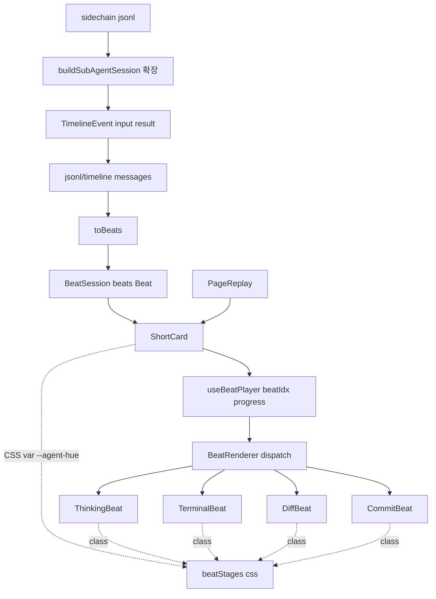

# replay v2 — Beat 청킹 + v1 포스터 비주얼 재구축

> **Discussion**: 2026-04-19 /discuss 세션 (memory: `project_replay_v2_beat_short`)
> **Reference**: `docs/AgentShorts/components/{beats,short-card,view-modes,feed}.jsx`
> **산출물 유형**: UI 기능 (replay 라우트 전면 교체)
> **규모 추정**: 신규 7개, 수정 4개, 재사용 5개

## §0 요구사항 (from discuss)

- **해결책 ⑪**: tool_use 1개 = beat 1개로 응축, v1 reference의 6종 비주얼(thinking/terminal/diff/commit + 후순위 filetree/preview) 카드를 ShortCard wrapper로 감싸 segment progress + agent chip + title overlay 제공. autoplay + tap-to-pause. action bar 제외, UnifiedView 모드 전환 제외(이번 사이클).
- **제약 ⑦**:
  - `replay/` 폴더만 수정 (다른 라우트 무영향)
  - 비주얼 CSS는 `module.css`/`.css` 파일에만 작성 (인라인 `style={{...}}` 금지 — `guardOsPatterns` 규칙 4)
  - dynamic per-agent 색상은 `style={{ '--agent-hue': '290' }}` CSS 변수 주입 (훅 통과)
  - jsonl 데이터, `useAnimationQueue`, `useActiveSessions`, `useSubAgentSessions` 그대로 유지
- **보유 자산 ⑧**:
  - `useAnimationQueue` (페이싱)
  - `extractToolSteps` (tool_use 분해, `parseJsonl.ts:167`)
  - `parseJsonl(text, { sidechainOnly })` — sidechain만 필터 가능
  - `useActiveSessions`, `useSubAgentSessions`, `buildSubAgentSession`
  - `replayStages.css` (last-mile CSS 슬롯, 이미 존재)
  - `ChatMessage`/`ChatBlock` 스키마

## §1 책임 분해

| # | 책임 | 파일 경로 | 레이어 | 기존/신규 | 의존 |
|---|------|----------|-------|----------|------|
| 1 | Beat 타입 SSOT (kind 6종 + 데이터 페이로드) | `src/pages/replay/beatTypes.ts` | pages | 신규 | — |
| 2 | Conventional commit 메시지 파서 (`feat:`, `fix:` …) | `src/pages/replay/parseCommitMessage.ts` | pages | 신규 | — |
| 3 | `extractToolSteps` 결과 + 메시지 → `Beat[]` 변환 (시퀀스 빌더) | `src/pages/replay/toBeats.ts` | pages | 신규 | 1, 2 |
| 4 | Beat 비주얼 6컴포넌트 + 디스패처 (Thinking/Terminal/Diff/Commit/Filetree*/Preview*) | `src/pages/replay/BeatRenderer.tsx` | pages | 신규 | 1 |
| 5 | Beat 비주얼 CSS (oklch/gradient/keyframe/`--agent-hue` 변수) | `src/pages/replay/beatStages.css` | pages | 신규 | — |
| 6 | ShortCard wrapper (segment progress + agent chip + title overlay + tap-to-pause) | `src/pages/replay/ShortCard.tsx` | pages | 신규 | 1, 4, 5 |
| 7 | Beat 시퀀스 페이서 hook (autoplay 큐, paused, beatIdx, progress 0..1) | `src/pages/replay/useBeatPlayer.ts` | pages | 신규 | 1 |
| 8 | `TimelineEvent`에 `input?`/`result?` 필드 확장 (sidechain tool 보존용) | `src/pages/viewer/groupEvents.ts` | pages | 수정 | — |
| 9 | `buildSubAgentSession`: tool_use input + tool_result 텍스트 보존 | `src/pages/replay/buildSubAgentSession.ts` | pages | 수정 | 8 |
| 10 | `replayWidgets.tsx`: ReplayStageWidget 본체를 ShortCard로 교체 | `src/pages/replay/replayWidgets.tsx` | pages | 수정 | 6, 7, 3 |
| 11 | `PageReplay.tsx`: tool delta 흐름 → Beat 시퀀스로 교체 (ReplaySlot/LiveSlot 모두) | `src/pages/replay/PageReplay.tsx` | pages | 수정 | 3, 10 |

### 탐색 증거

- `Glob src/pages/replay/*` (28 파일) → ShortCard/Beat/segment progress 부품 없음 → 신규 정당
- `Grep "useAnimationQueue"` → `@os/ui/useAnimationQueue` 재사용 가능 (페이서로 hook 7번에 합성)
- `CATALOG.md` 조회 (CLAUDE.md 제1원칙):
  - `ScrollArea`, `Combobox`, `NavList`, `FileViewer`, `MarkdownViewer` — 사이드바·viewer 재사용 (현 widgets 구조 일부 유지)
  - card/segment-progress/beat 부품 없음 → 6번/7번 신규 확정
- `replayStages.css` 존재 → 5번은 같은 폴더에 `beatStages.css` 신규 (책임 분리: feed/dot vs beat 시각)
- `guardOsPatterns.mjs:247-264` → `style={{...}}` 인라인 리터럴만 차단, `style={var}` 허용 → CSS 변수 주입 패턴 합법
- `parseJsonl.ts:167` `extractToolSteps(messages)` 시그니처 확인 → 3번 입력으로 직결
- `buildSubAgentSession.ts:46-49` 현재 `tool_use`에 `name + filePath`만, `input`/`result` 버림 → 9번 확장 필요 확인

**완성도**: 🟢 (행 11개, 1파일 1책임, 의존 위상정렬, 레이어 역방향 0)

## §2 Contract

### `src/pages/replay/beatTypes.ts` (신규)

```ts
export type BeatKind = 'thinking' | 'terminal' | 'diff' | 'commit' | 'filetree' | 'preview'

export interface BeatBase {
  kind: BeatKind
  /** 카드 재생 시간(ms). useBeatPlayer가 progress 0..1 계산 기준 */
  duration: number
}

export interface ThinkingBeat extends BeatBase {
  kind: 'thinking'
  text: string
}

export interface TerminalBeat extends BeatBase {
  kind: 'terminal'
  command: string
  /** type: 'cmd'|'out'|'ok'|'err'로 라인 분류, char-by-char reveal */
  lines: Array<{ t: 'cmd' | 'out' | 'ok' | 'err'; v: string }>
}

export interface DiffBeat extends BeatBase {
  kind: 'diff'
  file: string
  lines: Array<{ t: 'add' | 'del' | 'ctx'; v: string }>
}

export interface CommitBeat extends BeatBase {
  kind: 'commit'
  message: string         // conventional commit subject 또는 마지막 assistant 1문장
  body: string            // body (assistant 요약 또는 빈 문자열)
  hash: string            // "draft" 또는 git hash 추출
  branch: string          // "session" fallback
  files: number
  additions: number
  deletions: number
}

export interface FiletreeBeat extends BeatBase {
  kind: 'filetree'
  before: Array<{ name: string; type: 'file' | 'dir'; hl?: 'add' | 'del' }>
  after: Array<{ name: string; type: 'file' | 'dir'; hl?: 'add' | 'del' }>
}

export interface PreviewBeat extends BeatBase {
  kind: 'preview'
  url: string
  title: string
  sub: string
  eyebrow: string
}

export type Beat = ThinkingBeat | TerminalBeat | DiffBeat | CommitBeat | FiletreeBeat | PreviewBeat

/** 세션 메타 — ShortCard에 표시 */
export interface BeatSession {
  id: string
  agent: { name: string; avatar: string; hue: number }  // hue 0..360 → CSS var
  title: string
  repo: string
  beats: Beat[]
}
```

### `src/pages/replay/parseCommitMessage.ts` (신규)

```ts
export interface CommitParts {
  /** "feat", "fix", "refactor" 등 — 미매치 시 null */
  type: string | null
  /** "(scope)" — 미매치 시 null */
  scope: string | null
  /** subject (콜론 이후 첫 줄) — fallback: 입력 첫 줄 */
  subject: string
  /** body (subject 이후 단락) — fallback: '' */
  body: string
}

/**
 * @invariant 비어있는 입력은 { type: null, scope: null, subject: '', body: '' } 반환
 * @invariant conventional 정규식 매치 실패 시 type=null, subject=첫 줄
 */
export function parseCommitMessage(text: string): CommitParts
```

### `src/pages/replay/toBeats.ts` (신규)

```ts
import type { ChatMessage } from '@os/ui/chat/types'
import type { Beat, BeatSession } from './beatTypes'

export interface ToBeatsArgs {
  sessionId: string
  agent: BeatSession['agent']
  title: string
  repo: string
  messages: ChatMessage[]
}

/**
 * 변환 규칙:
 * - assistant text block → ThinkingBeat (1 메시지 1 beat)
 * - tool_use Bash → TerminalBeat (input.command + tool_result lines)
 * - tool_use Edit/Write → DiffBeat (old/new 라인화 + ctx 일부)
 * - tool_use Read/Grep/Glob → ThinkingBeat에 흡수 또는 skip (포스터로 약함)
 * - 마지막에 CommitBeat 1개 합성 (parseCommitMessage(첫 user prompt) + assistant 마지막 + edit stats)
 * @invariant tool_use 1개 ≤ beat 1개 (skip 가능)
 * @invariant beats[last].kind === 'commit' (항상 마무리)
 */
export function toBeats(args: ToBeatsArgs): BeatSession
```

### `src/pages/replay/BeatRenderer.tsx` (신규)

```tsx
import type { Beat } from './beatTypes'

export interface BeatRendererProps {
  beat: Beat
  /** 0..1 — useBeatPlayer가 주입. 콘텐츠 reveal 비율 계산 기준 */
  progress: number
  /** CSS var --agent-hue로 카드별 색조 */
  hue: number
}

export function BeatRenderer(props: BeatRendererProps): JSX.Element
```

### `src/pages/replay/ShortCard.tsx` (신규)

```tsx
import type { BeatSession } from './beatTypes'

export interface ShortCardProps {
  session: BeatSession
  /** true = 자동재생, false = 일시정지 */
  active: boolean
  autoplay: boolean
  /** 마지막 beat 종료 후 호출 (다음 세션 이동용) */
  onComplete?: () => void
}

/**
 * @invariant 카드 클릭 = paused 토글
 * @invariant 상단 segment progress: beat 개수만큼 트랙, 현재 beat는 progress * 100% fill
 * @invariant active=false 시 페이서 정지, beatIdx 보존
 */
export function ShortCard(props: ShortCardProps): JSX.Element
```

### `src/pages/replay/useBeatPlayer.ts` (신규)

```ts
import type { Beat } from './beatTypes'

export interface BeatPlayerState {
  beatIdx: number
  progress: number  // 0..1 within current beat
  paused: boolean
  togglePause: () => void
  /** 외부에서 강제 점프 (segment 클릭 등) */
  jumpTo: (idx: number) => void
}

/**
 * @invariant active=false 또는 paused=true면 progress 시간 정지
 * @invariant beatIdx >= beats.length 직전에 onComplete 호출 후 멈춤
 * @invariant 각 beat duration은 beat.duration ms
 */
export function useBeatPlayer(args: {
  beats: Beat[]
  active: boolean
  autoplay: boolean
  onComplete?: () => void
}): BeatPlayerState
```

### `src/pages/viewer/groupEvents.ts` (수정)

```ts
// BEFORE
export interface TimelineEvent {
  type: 'user' | 'assistant' | 'tool_use' | 'tool_result'
  ts: string
  text?: string
  tool?: string
  filePath?: string
}

// AFTER
export interface TimelineEvent {
  type: 'user' | 'assistant' | 'tool_use' | 'tool_result'
  ts: string
  text?: string
  tool?: string
  filePath?: string
  /** tool_use input (command/pattern/old_string/new_string/content) — sidechain용 신규 */
  input?: Record<string, unknown>
  /** tool_result 본문 텍스트 — sidechain용 신규 */
  result?: string
}
```

### `src/pages/replay/buildSubAgentSession.ts` (수정)

```ts
// jsonlToSidechainEvents 내부:
// BEFORE
events.push({ type: 'tool_use', ts, tool: block.name, filePath })
// AFTER
events.push({
  type: 'tool_use', ts, tool: block.name, filePath,
  input: (block.input as Record<string, unknown>) ?? undefined,
})

// tool_result 처리:
// BEFORE
events.push({ type: 'tool_result', ts })
// AFTER
events.push({
  type: 'tool_result', ts,
  result: typeof block.content === 'string' ? block.content : undefined,
})
```

### `src/pages/replay/replayWidgets.tsx` (수정)

`ReplayStageWidget` 본체를 `ShortCard`로 교체. `subtitleText`/`flashFile`/`StageRouter`/`StatsEndCard`/`MarkdownStage`/`EmptyStage`/`CodeStage`/`TerminalStage`/`ReplaySearchStage` 코드 제거(또는 별도 deprecated 파일로 이관). `ReplaySidebarWidget`은 그대로 유지(세션 선택용).

### `src/pages/replay/PageReplay.tsx` (수정)

`ReplaySlot`의 `useAnimationQueue` + `unified: ViewerDelta[]` 빌더를 `toBeats({ messages: allMessages })` → `<ShortCard session={beatSession} active autoplay />`로 단순화. `LiveSlot`도 `useLiveMessages`(현 timeline) → `toBeats(...)`로 동일 경로.

**완성도**: 🟢

## §3 WHY

현재 replay는 tool_use delta(Read/Write/Edit/Bash/Grep/Glob)를 끊지 않고 흘려 시청자가 phase를 못 잡는다. 각 stage(`CodeStage`/`TerminalStage`/`ReplaySearchStage`)는 IDE 도구처럼 보여 "콘텐츠"가 아닌 "작업창"으로 읽힌다. v1 reference는 **포스터 1장 = 메시지 1개** 구조 — TikTok/Instagram 스토리처럼 의미 단위(beat)로 잘라 segment progress로 진척을 시각화한다.

**책임 분해 정당성**:
- Beat 데이터(1) ↔ Beat 비주얼(4·5) ↔ 페이싱(7) ↔ 시퀀스 합성(3) — 4축이 각각 다른 진화 속도
- ShortCard wrapper(6)는 v1의 카드 구조 자체이며 BeatRenderer를 합성하는 단일 책임
- buildSubAgentSession 확장(8·9)은 서브 에이전트의 terminal/diff beat를 만들기 위한 데이터 전제 (현재는 input/result 버림)
- v1의 비주얼은 oklch + radial gradient + keyframe 풍부 → 인라인 리터럴로 흩으면 `guardOsPatterns` 위반 + 톤 평균화. **단일 CSS 파일(5)에 lock**하고 변수만 주입하는 게 1차 비주얼 충실도 + 훅 통과 동시 만족

## §4 HOW



## §5 WHAT (의존 순서)

### W1. `beatTypes.ts` (§1.1)

**의존**: —
**파일**: `src/pages/replay/beatTypes.ts`

§2 Contract 그대로. 타입만 export, 로직 없음.

**검증**: `pnpm typecheck` 통과.

### W2. `parseCommitMessage.ts` (§1.2)

**의존**: —
**파일**: `src/pages/replay/parseCommitMessage.ts`

```ts
const RE = /^(?<type>feat|fix|refactor|chore|docs|test|perf|style|build|ci|revert)(?:\((?<scope>[^)]+)\))?!?:\s*(?<subject>.+)$/

export function parseCommitMessage(text: string): CommitParts {
  if (!text || !text.trim()) {
    return { type: null, scope: null, subject: '', body: '' }
  }
  const trimmed = text.trim()
  const firstNl = trimmed.indexOf('\n')
  const firstLine = firstNl === -1 ? trimmed : trimmed.slice(0, firstNl)
  const body = firstNl === -1 ? '' : trimmed.slice(firstNl + 1).trim()

  const m = RE.exec(firstLine)
  if (!m?.groups) {
    return { type: null, scope: null, subject: firstLine, body }
  }
  return {
    type: m.groups.type ?? null,
    scope: m.groups.scope ?? null,
    subject: m.groups.subject ?? firstLine,
    body,
  }
}
```

**검증**: vitest unit — `feat(ui): add card` → `type='feat'`, `scope='ui'`, `subject='add card'`. `"방금 한 작업 요약"` → `type=null`, `subject='방금 한 작업 요약'`.

### W3. `toBeats.ts` (§1.3)

**의존**: W1, W2, `extractToolSteps`(기존)
**파일**: `src/pages/replay/toBeats.ts`

핵심 알고리즘:

```ts
export function toBeats({ sessionId, agent, title, repo, messages }: ToBeatsArgs): BeatSession {
  const beats: Beat[] = []
  let edits = 0, additions = 0, deletions = 0

  for (const msg of messages) {
    if (msg.role === 'assistant') {
      for (const b of msg.blocks) {
        if (b.type === 'text' && 'content' in b) {
          const text = (b as { content: string }).content.trim()
          if (text) beats.push({ kind: 'thinking', text, duration: 6000 })
        }
      }
      continue
    }
    if (msg.role !== 'system') continue

    for (let i = 0; i < msg.blocks.length; i++) {
      const block = msg.blocks[i]
      if (block.type !== 'tool_use' || !('data' in block)) continue
      const data = block.data as { name: string; input: Record<string, unknown> }
      const next = msg.blocks[i + 1]
      const result = next?.type === 'tool_result' && 'data' in next ? String(next.data) : ''

      if (data.name === 'Bash') {
        const command = (data.input.command as string) ?? ''
        beats.push({
          kind: 'terminal', duration: 5500, command,
          lines: parseTerminalOutput(result),
        })
      } else if (data.name === 'Edit' || data.name === 'Write') {
        const file = (data.input.file_path as string) ?? ''
        const oldStr = data.name === 'Edit' ? (data.input.old_string as string) ?? '' : ''
        const newStr = data.name === 'Edit'
          ? (data.input.new_string as string) ?? ''
          : (data.input.content as string) ?? ''
        const lines = toDiffLines(oldStr, newStr)
        beats.push({ kind: 'diff', duration: 5000, file, lines })
        edits += 1
        additions += newStr.split('\n').length
        deletions += oldStr.split('\n').length
      }
      // Read/Grep/Glob: skip (포스터로 약함, ⑩ 결정)
    }
  }

  // CommitBeat 합성: 첫 user prompt + 마지막 assistant text
  const firstUser = messages.find(m => m.role === 'user')
  const promptText = firstUser?.blocks.find(b => b.type === 'text' && 'content' in b)
  const userPrompt = promptText && 'content' in promptText ? (promptText as { content: string }).content : ''

  const lastAssistant = [...messages].reverse().find(m => m.role === 'assistant')
  const lastText = lastAssistant?.blocks.find(b => b.type === 'text' && 'content' in b)
  const assistantText = lastText && 'content' in lastText ? (lastText as { content: string }).content : ''

  const parsed = parseCommitMessage(userPrompt)
  beats.push({
    kind: 'commit', duration: 6000,
    message: parsed.type ? `${parsed.type}: ${parsed.subject}` : (parsed.subject || assistantText.split('\n')[0] || 'session'),
    body: parsed.body || assistantText,
    hash: 'draft',
    branch: 'session',
    files: edits, additions, deletions,
  })

  return { id: sessionId, agent, title, repo, beats }
}
```

`parseTerminalOutput`/`toDiffLines`는 동일 파일 내 helper.

**검증**: vitest — fixture jsonl 1개 → `beats[last].kind === 'commit'`, `beats.filter(b => b.kind === 'terminal').length === Bash 호출 수`.

### W4. `BeatRenderer.tsx` (§1.4)

**의존**: W1, W5(CSS class)
**파일**: `src/pages/replay/BeatRenderer.tsx`

v1 `beats.jsx` 6컴포넌트를 `.beat-thinking`/`.beat-terminal`/`.beat-diff`/`.beat-commit` className으로 포팅. dynamic 색은 `style={{ '--agent-hue': hue }}`.

```tsx
export function BeatRenderer({ beat, progress, hue }: BeatRendererProps) {
  const cssVar = { '--agent-hue': String(hue) } as React.CSSProperties
  switch (beat.kind) {
    case 'thinking': return <ThinkingBeatView beat={beat} progress={progress} cssVar={cssVar} />
    case 'terminal': return <TerminalBeatView beat={beat} progress={progress} />
    case 'diff':     return <DiffBeatView beat={beat} progress={progress} />
    case 'commit':   return <CommitBeatView beat={beat} progress={progress} />
    case 'filetree': return <FiletreeBeatView beat={beat} progress={progress} />
    case 'preview':  return <PreviewBeatView beat={beat} progress={progress} />
  }
}
```

각 view 컴포넌트는 v1 `beats.jsx`의 마크업을 className으로 변환 (예: `<div className="beat-thinking" style={cssVar}>...`). 콘텐츠 reveal은 `progress` 기반 substring/slice로 동일 패턴.

**검증**: ReplayStage.demo.tsx에 fixture 6 beat 렌더 → 시각 확인 (파일별 데모 분리).

### W5. `beatStages.css` (§1.5)

**의존**: —
**파일**: `src/pages/replay/beatStages.css`

v1 `Coding Agent Shorts v1.html` + `beats.jsx`의 인라인 스타일을 모두 CSS 클래스로 추출:

```css
.beat-thinking {
  width: 100%; height: 100%;
  display: flex; flex-direction: column;
  padding: 28px 24px;
  background:
    radial-gradient(circle at 20% 0%, oklch(0.32 0.08 var(--agent-hue)) 0%, transparent 55%),
    radial-gradient(circle at 100% 100%, oklch(0.28 0.06 calc(var(--agent-hue) + 60)) 0%, transparent 50%),
    #0b0b0d;
  justify-content: center; align-items: flex-start; gap: 18px;
  font-family: ui-monospace, "JetBrains Mono", "SF Mono", Menlo, monospace;
}
.beat-thinking__text {
  font-family: 'Inter', system-ui, sans-serif;
  font-size: 22px; line-height: 1.45; color: #fff;
  font-weight: 500; letter-spacing: -0.01em;
  text-wrap: pretty;
}
.beat-thinking__caret {
  display: inline-block; width: 2px; height: 1.1em;
  background: oklch(0.75 0.15 var(--agent-hue));
  vertical-align: -0.15em; margin-left: 3px;
  animation: blink 1s step-end infinite;
}
/* terminal/diff/commit/filetree/preview 동일 패턴 */
@keyframes blink { 50% { opacity: 0; } }
@keyframes thinkingPulse {
  0%, 100% { opacity: 0.3; transform: scale(0.9); }
  50% { opacity: 1; transform: scale(1.2); }
}
@keyframes slideInLeft {
  from { opacity: 0; transform: translateX(-8px); }
  to { opacity: 1; transform: translateX(0); }
}
.short-card { /* 9:16 카드 wrapper */ }
.short-card__progress { /* 상단 segment 트랙 */ }
.short-card__agent { /* 좌상단 agent chip */ }
.short-card__title { /* 하단 타이틀 오버레이 */ }
.short-card__pause { /* 일시정지 오버레이 */ }
```

**검증**: dev server 띄워 `/replay` 진입 시 oklch 그라데이션 + keyframe 작동 확인.

### W6. `ShortCard.tsx` (§1.6)

**의존**: W1, W4, W5, W7
**파일**: `src/pages/replay/ShortCard.tsx`

```tsx
export function ShortCard({ session, active, autoplay, onComplete }: ShortCardProps) {
  const { beatIdx, progress, paused, togglePause } = useBeatPlayer({
    beats: session.beats, active, autoplay, onComplete,
  })
  const beat = session.beats[beatIdx]
  if (!beat) return null

  return (
    <div className="short-card" onClick={togglePause} style={{ '--agent-hue': String(session.agent.hue) } as React.CSSProperties}>
      <BeatRenderer beat={beat} progress={progress} hue={session.agent.hue} />

      <div className="short-card__progress">
        {session.beats.map((_, i) => (
          <div key={i} className="short-card__progress-track">
            <div className="short-card__progress-fill" style={{
              width: i < beatIdx ? '100%' : i === beatIdx ? `${progress * 100}%` : '0%',
            }} />
          </div>
        ))}
      </div>

      <div className="short-card__agent">
        <div className="short-card__avatar">{session.agent.avatar}</div>
        <div>
          <div className="short-card__agent-name">@{session.agent.name}</div>
          <div className="short-card__agent-repo">{session.repo}</div>
        </div>
      </div>

      <div className="short-card__title">{session.title}</div>

      {paused && active && <div className="short-card__pause" aria-label="paused" />}
    </div>
  )
}
```

**검증**: ReplayStage.demo.tsx에서 fixture session 1개 → tap-to-pause 확인.

### W7. `useBeatPlayer.ts` (§1.7)

**의존**: W1
**파일**: `src/pages/replay/useBeatPlayer.ts`

```ts
// @useState-hatch — 페이서는 시간 기반 effect 상태가 본질
export function useBeatPlayer({ beats, active, autoplay, onComplete }: ...): BeatPlayerState {
  const [beatIdx, setBeatIdx] = useState(0)
  const [progress, setProgress] = useState(0)
  const [paused, setPaused] = useState(false)

  useEffect(() => {
    if (!active || !autoplay || paused) return
    const beat = beats[beatIdx]
    if (!beat) return
    let raf: number
    const start = performance.now() - progress * beat.duration
    const tick = (now: number) => {
      const p = (now - start) / beat.duration
      if (p >= 1) {
        if (beatIdx + 1 < beats.length) {
          setBeatIdx(beatIdx + 1); setProgress(0)
        } else {
          setProgress(1)
          onComplete?.()
        }
        return
      }
      setProgress(p)
      raf = requestAnimationFrame(tick)
    }
    raf = requestAnimationFrame(tick)
    return () => cancelAnimationFrame(raf)
  }, [active, autoplay, paused, beatIdx, beats])

  useEffect(() => {
    if (active) { setBeatIdx(0); setProgress(0); setPaused(false) }
  }, [active])

  return {
    beatIdx, progress, paused,
    togglePause: () => setPaused(p => !p),
    jumpTo: (i: number) => { setBeatIdx(i); setProgress(0) },
  }
}
```

**검증**: vitest fake timer — 6000ms beat × 3 → 18s 후 onComplete 호출.

### W8. `groupEvents.ts` (§1.8)

**의존**: —
**파일**: `src/pages/viewer/groupEvents.ts`

`TimelineEvent`에 `input?: Record<string, unknown>` + `result?: string` 필드 추가. 기존 호출부는 optional이라 무영향.

**검증**: `pnpm typecheck` + 기존 `groupEvents` 사용처(viewer/replay) 무회귀.

### W9. `buildSubAgentSession.ts` (§1.9)

**의존**: W8
**파일**: `src/pages/replay/buildSubAgentSession.ts`

§2 diff 적용. `tool_use`에 `input` 보존, `tool_result`에 `result` 보존.

**검증**: 기존 `buildSubAgentSession.test.ts` 통과 + 신규 case 1개 (`input.command`, `result` 포함 확인).

### W10. `replayWidgets.tsx` (§1.10)

**의존**: W6, W7, W3
**파일**: `src/pages/replay/replayWidgets.tsx`

`ReplayStageWidget`을 다음으로 교체:

```tsx
export function ReplayStageWidget() {
  const { messages, mode, liveSessionId, viewerTabs, fileViewerRef } = useReplay()
  const liveMessages = useLiveMessages(mode, viewerTabs, fileViewerRef, liveSessionId)
  const displayMessages = mode === 'live' ? liveMessages : messages

  const session = useMemo(() => toBeats({
    sessionId: 'current',
    agent: { name: 'agent', avatar: '◆', hue: 290 },
    title: extractTitle(displayMessages) ?? 'session',
    repo: 'aria',
    messages: displayMessages,
  }), [displayMessages])

  return (
    <div className="replay-stage-frame">
      <ShortCard session={session} active autoplay />
    </div>
  )
}
```

`StageRouter`/`CodeStage`/`TerminalStage`/`ReplaySearchStage`/`StatsEndCard`/`MarkdownStage`/`EmptyStage`/`ToolBadge`/`useFlash` 코드 제거. `ReplaySidebarWidget`은 유지(세션 선택). `useLiveMessages`는 timelineToMessages 호출만 유지하고 `processToolEvents`는 그대로 (file editing animation 부수효과는 ShortCard와 별도 유지 — 회귀 시 별도 정리).

`extractTitle`은 첫 user prompt 첫 줄 추출 helper (동일 파일 내).

**검증**: dev server `/replay` 진입 → ShortCard 렌더 + 이전 session entry combobox 정상.

### W11. `PageReplay.tsx` (§1.11)

**의존**: W3, W10
**파일**: `src/pages/replay/PageReplay.tsx`

`ReplaySlot` 단순화:

```tsx
function ReplaySlot({ entry, index, register }: ...) {
  const [allMessages, setAllMessages] = useState<ChatMessage[]>([])
  const viewerTabs = useViewerTabs()
  const fileViewerRef = useRef<FileViewerHandle>(null)

  // 기존 load useEffect 유지 (json/jsonl 로딩)

  const replayCtx = useMemo<ReplayContextValue>(() => ({
    selectedId: entry.id, setSelectedId: () => {}, sessionEntries,
    messages: allMessages,
    allMessagesCount: allMessages.length,
    isRunning: false, startReplay: () => {},
    editingLine: null, mode: 'replay',
    tabs: viewerTabs.tabs, activeTab: viewerTabs.activeTab,
    activeTabId: viewerTabs.activeTabId, setActiveTab: viewerTabs.setActiveTab,
    viewerTabData: createStore({ entities: {}, relationships: {} }),
    fileViewerRef, viewerTabs,
  }), [entry.id, allMessages, viewerTabs, fileViewerRef])

  useEffect(() => { register(index, replayCtx); return () => register(index, null) }, [index, replayCtx, register])

  return <ReplayProvider value={replayCtx}><ReplayStageWidget /></ReplayProvider>
}
```

`useAnimationQueue`/`unified ViewerDelta[]`/`startReplay`/`onRelease`/`getDelay`/`toReplayDeltas`/`extractToolSteps`/`fileState`/`editAnimationFrames`/`readFrames`/`writeFrames` 흐름 제거. `LiveSlot`도 동일하게 단순화 (subagents, subAgentMatches 유지).

**검증**: dev server `/replay` → 세로 snap feed에서 각 슬롯이 ShortCard로 자동재생, scroll로 다음 세션 이동.

**완성도**: 🟢

## §6 원칙 감시자 결과

| 검사 | 결과 |
|---|---|
| CLAUDE.md 레이어 의존 (store→...→pages 역방향 0) | ✅ 11행 모두 pages 또는 pages→pages |
| 파일명 = 주 export 식별자 | ✅ `BeatRenderer.tsx`/`ShortCard.tsx`/`useBeatPlayer.ts`/`toBeats.ts`/`parseCommitMessage.ts` 모두 일치 |
| ax() 사용 (style 인라인 리터럴 0) | ✅ `style={{ '--agent-hue': ... }}` CSS 변수 주입만, 비주얼은 className → `beatStages.css` |
| `feedback_state_architecture` (NormalizedData+Command) | ⚠ ShortCard는 카드 자체 페이서 useState 사용 — `@useState-hatch` 주석으로 명시 (페이서는 시간 기반 transient state, store에 둘 책임 아님) |
| `feedback_render_function_is_slot` | N/A (ShortCard는 slot prop 없이 BeatRenderer 합성) |
| `feedback_ax_semantic_not_css` | ✅ ax 축 신설 0, CSS는 last-mile만 |
| `feedback_ratchet_convergence` (1차 lock → 2차 정제) | ✅ memory `project_replay_v2_beat_short` 명시 |
| Placeholder("적절히"/"필요시"/"TBD"/"(?)") | ✅ 0건 |
| 책임 행 = 1파일 1책임 | ✅ 11행 모두 단일 책임 |
| 탐색 증거 기재 | ✅ §1 끝 |

**위반 0건. 1건 주의(@useState-hatch)는 명시적 hatch + memory 정당화로 통과.**

---

**전체 완성도**: 🟢

---

## §7 작업 순서 (위상정렬)

```
W1 → W2 → W3
W1 → W5 → W4 → W6 ← W7 ← W1
W8 → W9
(W3, W6) → W10 → W11
```

병렬 가능 그룹:
- **Group A** (의존 없음): W1, W2, W5, W7, W8
- **Group B** (Group A 후): W3, W4, W9
- **Group C** (Group B 후): W6
- **Group D** (Group C 후): W10
- **Group E** (Group D 후): W11

`/go` dispatch 시 5단계 병렬화 가능.
