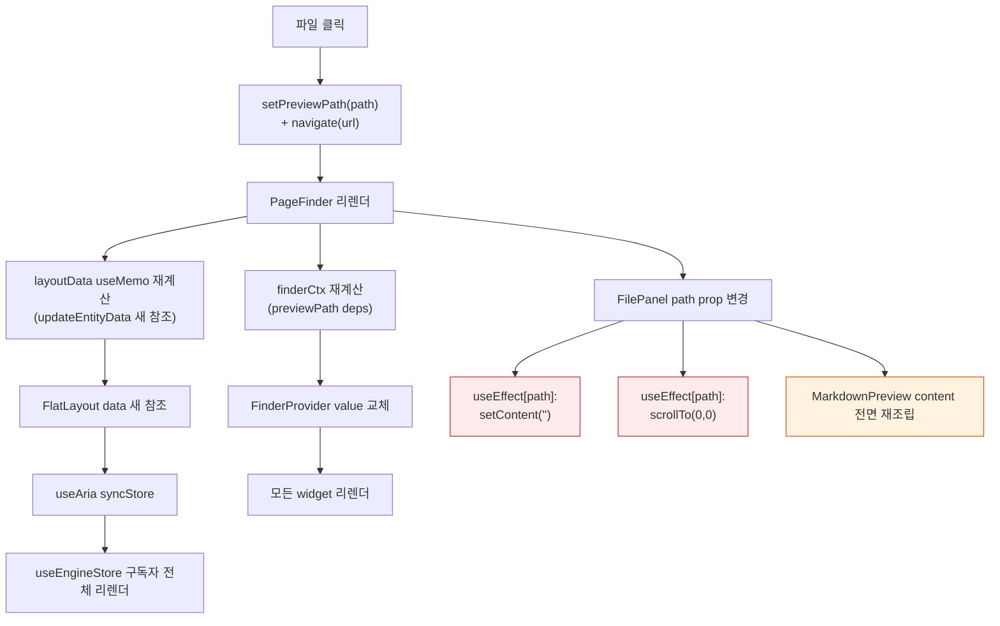
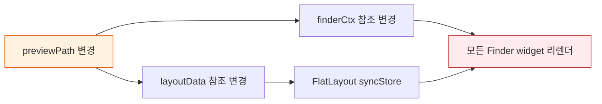
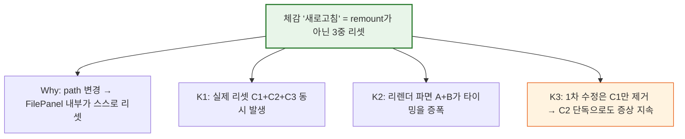

> - 파일을 선택할 때마다 오른쪽 `FilePanel`이 잠깐 비었다가 다시 그려진다
> - React 레벨의 remount가 아니라 **의도된 리셋 3종 + 컨텍스트 폭풍**이 겹친 결과다
> - 그래서 `setContent('')` 하나만 빼도 나머지 리셋이 계속 "새로고침"처럼 보인다
> - 진짜 고쳐야 할 곳은 `FilePanel`의 스크롤 리셋 + `finderCtx` 리프레시 의존성이다

---

## 원인은 "새 컴포넌트가 아니라 새 상태"다

사용자가 파일을 클릭하면 DOM의 FilePanel 인스턴스는 그대로다. React DevTools로 보면 unmount가 없다. 그런데 "새로고침"으로 보인다.

이 착시의 정체는 **path prop 하나가 바뀌었을 뿐인데, FilePanel 내부와 주변이 마치 새로 마운트된 것처럼 자신을 리셋**하기 때문이다. 세 개의 리셋이 동시에 일어난다:



C1/C2/C3가 "새로고침" 체감의 본체다. A·B는 과한 리렌더이되 화면 리셋은 아니다.

→ 시사점: 내 1차 수정은 C1(`setContent('')`)만 제거했다. C2(스크롤 리셋)와 C3(Markdown 전면 재조립)이 남아 증상이 이어진다.

---

## C1~C3를 각각 해체해야 한다

### C1: setContent('')

`src/pages/finder/widgets/FilePanel.tsx:25-42` 에서 캐시 miss 시 content를 비우고 fetch 재시작. 1차 수정으로 제거됨. **해결.**

### C2: scrollTo(0, 0) — 아직 남아 있음

```ts
useEffect(() => {
  bodyRef.current?.scrollTo(0, 0)
}, [path])
```

path가 바뀌면 새 파일의 맨 위로 보내는 것이 의도다. 문제는 이 스크롤 리셋이 **콘텐츠 교체와 같은 프레임에** 일어난다는 점:

- 이전 파일의 현재 스크롤 위치 → 0으로 점프 (화면 1프레임)
- 다음 프레임에 새 content가 들어와 레이아웃 재계산
- 사용자 눈에는 "위로 휙 올라갔다가 내용이 바뀜" = refresh 감각

→ 캐시 HIT인 경우 content는 이미 있으므로 스크롤 리셋만 보인다. 이것이 1차 수정 후에도 재현되는 핵심이다.

### C3: MarkdownPreview 전면 재조립

`MarkdownPreview`는 `content` prop이 바뀌면 react-markdown이 전체 AST를 다시 파싱·렌더한다. `memo`로 감싸도 content 자체가 바뀌므로 무력하다. 큰 .md는 체감 지연이 있다.

→ 시사점: C1은 async 경로, C2는 동기 레이아웃 경로, C3은 렌더 비용 경로. 원인 3개가 한 사건에 같이 터져 "refresh 1회"로 뭉쳐 보인다.

---

## A·B 경로는 왜 remount가 아닌데도 문제인가

A: `layoutData` useMemo가 `[viewMode, previewPath]` 의존. `previewPath` 변경 시 `updateEntityData`가 tree-area/preview/main/miller **4개 엔티티를 새 참조**로 만든다. `useAria.ts:181`의 비교는 `===` 참조 비교라 `contentChanged=true` → `engine.syncStore` 호출 → `useEngineStore`의 모든 구독자 리렌더.

B: `finderCtx` useMemo도 `previewPath`에 의존 → Provider value 새 객체 → 모든 컨텍스트 구독 위젯(Sidebar/Toolbar/TreeGrid/Preview/Miller) 리렌더.



remount는 아니지만 **리렌더 범위가 최소가 아니다**. Preview 하나 바꾸자고 Sidebar·Toolbar·TreeGrid까지 리렌더를 건다. 여기서 C3(Markdown 재조립)까지 얹히면 한 프레임 안에 많은 일이 일어나 jank가 refresh 감각으로 해석된다.

→ 시사점: "remount가 아니면 문제없다"가 아니다. 리렌더 파면의 크기와 타이밍이 시각적 리셋을 만든다.

---

## 진짜 수정

우선순위 순:

1. **C2 해체** — 스크롤 리셋을 content 적용과 분리하거나, content transition 이후에 실행.

   ```ts
   // content가 실제로 바뀔 때만 스크롤 리셋
   const prevContentRef = useRef(content)
   useEffect(() => {
     if (prevContentRef.current !== content) {
       bodyRef.current?.scrollTo(0, 0)
       prevContentRef.current = content
     }
   }, [content])
   ```

   또는 스크롤 위치를 path별로 기억하고 복원. 하지만 가장 단순한 것은 **첫 프레임에 스크롤을 리셋하지 않고, content arrival 직후에만** 리셋하는 것.

2. **B 해체 — finderCtx에서 previewPath 분리** — `previewPath`는 `FinderPreviewWidget` 하나만 소비한다. 별도 `FinderPreviewContext` 또는 별도 store subscription으로 분리하면 Sidebar/Toolbar/TreeGrid는 리렌더 대상에서 빠진다.

3. **C3 완화 (선택)** — MarkdownPreview 내부에서 AST 파싱 결과를 `useMemo([content])` 캐시. 이미 적용돼 있을 수 있으니 확인 필요.

4. **A 해체 (선택, 비용 큼)** — `layoutData`를 `previewPath`에 의존시키지 말고, preview 슬롯의 `hidden`을 별도 command로 분리 dispatch. 현재 선언형 `updateEntityData` 흐름과 맞지 않아 우선순위 낮음.

→ 시사점: 1·2만 해도 체감 "새로고침"은 사라진다. 3·4는 perf 최적화 영역.

---

## 요약 피라미드



핵심은 **FilePanel이 path 변화를 "새 파일 세션 시작"으로 취급**한다는 점이다. 스크롤/포커스/캐시를 유지한 채 콘텐츠만 교체하는 방향으로 바꾸면 refresh 감각은 사라진다.
