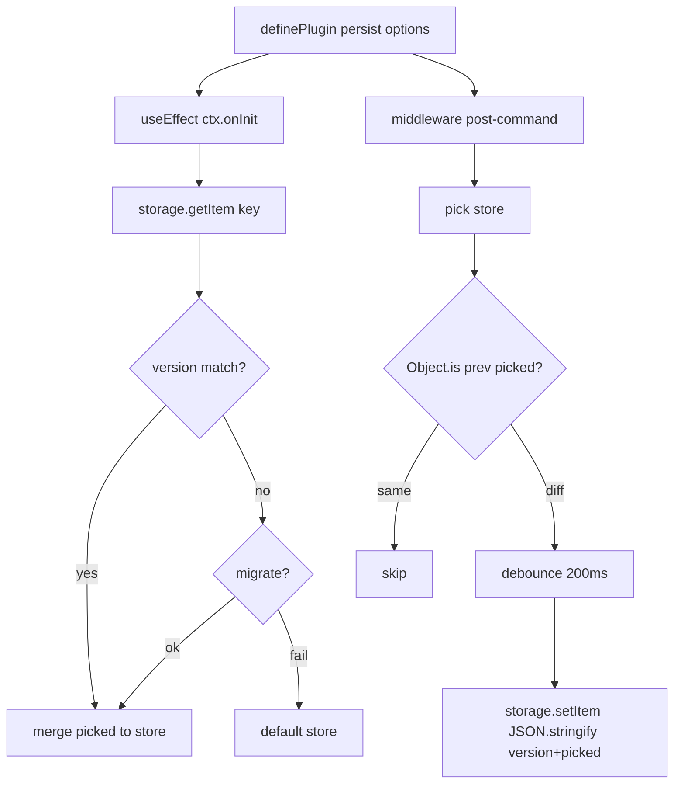

# Persist Plugin + localStorage 수렴 — PRD

> **Discussion**: 본 세션 `/discuss` — useState+localStorage 개념 과적 → os 모듈로 승격
> **산출물 유형**: 엔진(plugin 신설) + 리팩토링(12곳 수렴) + 문서(CATALOG 경계 정의)
> **규모 추정**: 신규 1개(plugin), 확장 0개, 수정 8개(pages/hooks/ui), 문서 1개, 재사용 3개(createModuleStore/usePersistedState/definePlugin)

## §0 요구사항 (from discuss)

- **해결책 ⑪**: `plugins/persist.ts` 신설 — `loadPersisted()` 헬퍼 + `persist()` writer plugin의 2 export 네임스페이스. engine 생성 이전 동기 로드, 생성 후 debounced write. EffectContext read-only 계약 보전. 3층 자산(모듈 단일값=createModuleStore / 컴포넌트 로컬=usePersistedState / engine NormalizedData=persist 네임스페이스)으로 localStorage 직접 호출 12곳 수렴. (설계 결정: /conflict에서 EffectContext 확장 vs 2조각 분리 대립을 urlSync 3조각 선례 기반 네임스페이스 묶음으로 해소)
- **제약 ⑦**: plugin 합성 규칙 준수 / 브라우저 전용 / 쓰기 실패 swallow (createModuleStore 선례)
- **보유 자산 ⑧**: `store/createModuleStore`, `primitives/usePersistedState`, `plugins/urlSync`(대칭 레퍼런스), `plugins/definePlugin`
- **1차 스코프 제외**: 멀티탭 sync(storage 이벤트), 5MB quota 초과 대응, IndexedDB 어댑터

## §1 책임 분해

| # | 책임 | 파일 경로 | 레이어 | 기존/신규 | 의존 |
|---|------|----------|-------|----------|------|
| 1 | NormalizedData 일부 pick → localStorage 직렬화/역직렬화 + 버전 migrate + debounce write | `src/interactive-os/plugins/persist.ts` | plugins | 신규 | — |
| 2 | persist plugin 단위 테스트 (동기 로드 / debounce / version mismatch) | `src/interactive-os/plugins/persist.test.ts` | plugins | 신규 | 1 |
| 3 | cmux chatStore: 수동 localStorage 제거 → persist plugin 적용 | `src/pages/cmux/chatStore.ts` | pages | 수정 | 1 |
| 4 | studio PageStudio: 수동 localStorage 제거 → persist plugin 적용 | `src/pages/studio/PageStudio.tsx` | pages | 수정 | 1 |
| 5 | bookNavStore: 수동 localStorage → createModuleStore로 치환 | `src/pages/book/bookNavStore.ts` | pages | 수정 | — |
| 6 | writerChatBridge: 수동 localStorage → createModuleStore로 치환 | `src/pages/writer/writerChatBridge.ts` | pages | 수정 | — |
| 7 | PageComponentCreator: useState+useEffect+localStorage → usePersistedState | `src/pages/creator/PageComponentCreator.tsx` | pages | 수정 | — |
| 8 | PageFinder: 4개 view pref useState+useEffect+localStorage → usePersistedState×4 | `src/pages/finder/PageFinder.tsx` | pages | 수정 | — |
| 9 | QuickOpen: persistKey 내부 useState+useEffect → usePersistedState | `src/interactive-os/ui/QuickOpen.tsx` | ui | 수정 | — |
| 10 | CATALOG.md — 3자 경계 문서화(모듈-전역/컴포넌트-로컬/engine-연동) + persist plugin 등록 | `src/interactive-os/CATALOG.md` | — | 수정 | 1 |

> **수렴 제외**: `hooks/useResizer.ts`는 이미 내부 hook이 localStorage를 캡슐화한 재사용 단위 — 외부로 날코딩이 새지 않음. 1차 스코프 제외.

### 탐색 증거

- `Grep localStorage src/` → 12 파일 (비-테스트 8곳, 테스트 3곳, 자산 자체 2곳: createModuleStore/usePersistedState)
- `ls src/interactive-os/plugins/` → autoscroll, cellDragSelect, clipboard, combobox, crud, dnd, dragResize, edit, focusHistory, focusRecovery, form, history, rename, scope, scroll, search, spatial, typeahead, urlSync, workspaceStore, zodSchema — **persist 없음 확인**
- `CATALOG.md` plugins 섹션 — persist 누락 확인
- `urlSync.ts` 읽음 → `definePlugin({ name, middleware })` + `useEffect` ctx 패턴이 대칭 레퍼런스
- `definePlugin.ts` 읽음 → `useEffect(ctx)`가 engine init/subscribe hook, `middleware`가 command post-processing hook — persist의 load/write 두 갈래에 매핑됨

**완성도**: 🟢

## §2 Contract

> **설계 결정 (from /conflict)**: `EffectContext`는 read-only 계약을 보전한다. persist는 **load 헬퍼 + writer plugin 2 export**를 같은 파일에 묶어 1급 시민 네임스페이스로 제시. urlSync(`getInitialFromUrl` + `urlSync()`) 선례와 대칭.

### `src/interactive-os/plugins/persist.ts`

```ts
import type { Plugin } from '../engine/types'
import type { NormalizedData } from '../store/types'

export interface PersistAdapter {
  getItem(key: string): string | null
  setItem(key: string, value: string): void
}

export interface PersistBaseOptions<Picked> {
  /** localStorage key */
  key: string
  /** 스키마 버전. 저장물과 다르면 migrate 호출. */
  version: number
  /** old → current 변환. 실패 시 undefined 반환하면 저장물 폐기. */
  migrate?: (oldPicked: unknown, oldVersion: number) => Picked | undefined
  /** 기본 localStorage. 테스트/대체 어댑터 주입용. */
  storage?: PersistAdapter
}

export interface LoadPersistedOptions<Picked> extends PersistBaseOptions<Picked> {}

export interface PersistOptions<Picked> extends PersistBaseOptions<Picked> {
  /** 저장 대상 추출. 전체 store를 저장하지 않음. */
  pick: (store: NormalizedData) => Picked
  /** 쓰기 debounce ms. 기본 200. */
  debounce?: number
}

/**
 * engine 생성 *이전* 동기 로드. 저장물이 없거나 version mismatch + migrate 실패 시 undefined.
 *
 * @invariant localStorage 미정의·JSON parse 실패·storage throw → undefined
 * @invariant version 일치 → 저장된 picked 반환
 * @invariant version 불일치 → migrate 호출, 반환값(undefined 포함) 그대로 전달
 */
export function loadPersisted<Picked>(options: LoadPersistedOptions<Picked>): Picked | undefined

/**
 * Plugin: command 실행 후 debounced write로 localStorage에 반영.
 *
 * @invariant EffectContext를 변경하지 않음 (read-only 계약 보전)
 * @invariant command 실행 후 pick 결과가 이전 직렬화와 동일하면 write 스킵
 * @invariant write는 debounce ms 내 연타 시 마지막 값만 실제 반영
 * @invariant storage.setItem throw는 console.warn 후 swallow
 */
export function persist<Picked>(options: PersistOptions<Picked>): Plugin
```

**완성도**: 🟢

## §3 WHY

`useState + localStorage` 는 FE에서 가장 흔한 날코딩 3종 세트(hydration race, JSON parse 실패, 무결성 없는 부분 복원)를 매 페이지가 재작성한다. 본 프로젝트는 "os 기반 개발"을 규약으로 가지므로, 이 개념은 pages가 아니라 os 자산 3층으로 흡수해야 한다 — 모듈 전역 단일값(`createModuleStore`), 컴포넌트 로컬(`usePersistedState`), **engine NormalizedData(`persist` plugin)**. 앞 둘은 이미 존재하고 engine-연동 층만 비어있어 pages가 직접 store를 subscribe + localStorage로 연결하는 ad-hoc 코드(cmux/studio)가 발생했다. `urlSync`가 plugin 계보에서 state→URL 자리를 차지한 것처럼, `persist`가 state↔localStorage 자리를 차지해야 대칭이 완성된다.

책임을 10행으로 쪼갠 이유: ① plugin 본체와 테스트를 분리하여 단위 검증을 강제, ② pages 8곳은 각 파일이 독립 PR 단위로 merge 가능하도록 행 분리(파일 1개 = 에이전트 1개), ③ CATALOG 문서화를 별도 행으로 두어 "3자 경계"라는 지식 자산이 코드와 함께 이식되도록.

## §4 HOW



## §5 WHAT (의존 순서)

### W1. persist plugin 본체 (§1.1)

**의존**: —
**파일**: `src/interactive-os/plugins/persist.ts`

```ts
import type { Command, Plugin } from '../engine/types'
import type { NormalizedData } from '../store/types'
import { definePlugin } from './definePlugin'

export interface PersistAdapter {
  getItem(key: string): string | null
  setItem(key: string, value: string): void
}

export interface PersistBaseOptions<Picked> {
  key: string
  version: number
  migrate?: (oldPicked: unknown, oldVersion: number) => Picked | undefined
  storage?: PersistAdapter
}

export type LoadPersistedOptions<Picked> = PersistBaseOptions<Picked>

export interface PersistOptions<Picked> extends PersistBaseOptions<Picked> {
  pick: (store: NormalizedData) => Picked
  debounce?: number
}

interface Envelope { v: number; d: unknown }

function defaultStorage(): PersistAdapter | null {
  if (typeof localStorage === 'undefined') return null
  return { getItem: (k) => localStorage.getItem(k), setItem: (k, v) => localStorage.setItem(k, v) }
}

export function loadPersisted<P>(options: LoadPersistedOptions<P>): P | undefined {
  const storage = options.storage ?? defaultStorage()
  if (!storage) return undefined
  try {
    const raw = storage.getItem(options.key)
    if (raw == null) return undefined
    const env = JSON.parse(raw) as Envelope
    if (env.v === options.version) return env.d as P
    return options.migrate?.(env.d, env.v)
  } catch {
    return undefined
  }
}

export function persist<P>(options: PersistOptions<P>): Plugin {
  const storage = options.storage ?? defaultStorage()
  const debounceMs = options.debounce ?? 200
  let prevSerialized: string | null = null
  let timer: ReturnType<typeof setTimeout> | null = null

  function scheduleWrite(picked: P) {
    if (!storage) return
    const envelope: Envelope = { v: options.version, d: picked }
    const next = JSON.stringify(envelope)
    if (next === prevSerialized) return
    prevSerialized = next
    if (timer) clearTimeout(timer)
    timer = setTimeout(() => {
      try { storage.setItem(options.key, next) }
      catch (e) { console.warn('[persist] setItem failed:', e) }
    }, debounceMs)
  }

  return definePlugin({
    name: 'persist',
    middleware: (next: (cmd: Command) => void, getStore: () => NormalizedData) => (cmd: Command) => {
      next(cmd)
      scheduleWrite(options.pick(getStore()))
    },
  })
}
```

**검증**: W2에서 단위 테스트.

**Note**: `EffectContext.setStore`가 없으면 W1 착수 전 `engine/types.ts` 확장이 선행되어야 한다 — §6 원칙 감시자에서 검출하여 장애물로 올림.

### W2. persist plugin 단위 테스트 (§1.2)

**의존**: W1
**파일**: `src/interactive-os/plugins/persist.test.ts`

```ts
import { describe, it, expect, vi } from 'vitest'
import { persist } from './persist'
import { createCommandEngine } from '../engine/createCommandEngine'

function makeMemoryStorage() {
  const m = new Map<string, string>()
  return { getItem: (k: string) => m.get(k) ?? null, setItem: (k: string, v: string) => { m.set(k, v) } }
}

describe('persist plugin', () => {
  it('restores picked state synchronously on engine init', () => { /* ... */ })
  it('writes picked state after command (debounced)', async () => { /* ... */ })
  it('skips write when picked is unchanged', async () => { /* ... */ })
  it('calls migrate when version mismatches', () => { /* ... */ })
  it('falls back to default when migrate returns undefined', () => { /* ... */ })
  it('swallows setItem exceptions', () => { /* ... */ })
})
```

**검증**: `pnpm test src/interactive-os/plugins/persist.test.ts` 전부 green.

### W3. cmux chatStore persist 적용 (§1.3)

**의존**: W1
**파일**: `src/pages/cmux/chatStore.ts`

변경: 파일 하단의 수동 subscribe + localStorage 블록 제거.
```ts
const picked = loadPersisted<Picked>({ key: 'cmux.chatStore', version: 1 })
const initial = picked ? mergeCmux(defaultCmux, picked) : defaultCmux
const engine = createCommandEngine(initial, {
  plugins: [persist({ key: 'cmux.chatStore', version: 1, pick: s => ({ activeSessionId: s.entities.__session__?.activeSessionId, sessions: s.entities.sessions }) })],
})
```

**검증**: dev server에서 채팅 세션 생성 → 새로고침 → 복원 확인.

### W4. studio PageStudio persist 적용 (§1.4)

**의존**: W1
**파일**: `src/pages/studio/PageStudio.tsx`

변경: `@useState-hatch` 블록 제거. `const picked = loadPersisted({ key: STUDIO_LAYOUT_KEY, version: 1 })`로 초기 store 결정, engine에 `persist({ key: STUDIO_LAYOUT_KEY, version: 1, pick: s => s })` 주입.

**검증**: 레이아웃 변경 → 새로고침 → 복원.

### W5. bookNavStore → createModuleStore (§1.5)

**의존**: —
**파일**: `src/pages/book/bookNavStore.ts`

변경: 수동 subscribe + localStorage read/write 제거. `createModuleStore({ initial, storageKey: STORAGE_KEY })`로 치환.

**검증**: `pnpm typecheck` + 수동 탐색.

### W6. writerChatBridge → createModuleStore (§1.6)

**의존**: —
**파일**: `src/pages/writer/writerChatBridge.ts`

변경: `readMap`/`writeMap` 함수 제거. `createModuleStore({ initial: {}, storageKey: WRITER_SESSIONS_KEY })` 로 치환, get/set API 교체.

**검증**: writer 세션 생성 → 새로고침 → 복원.

### W7. PageComponentCreator → usePersistedState (§1.7)

**의존**: —
**파일**: `src/pages/creator/PageComponentCreator.tsx`

변경: 초기 `localStorage.getItem` + `useEffect(() => localStorage.setItem)` 2블록 제거. `usePersistedState(STORAGE_KEY, defaultData)` 1줄로 치환.

**검증**: 폼 입력 → 새로고침 → 복원.

### W8. PageFinder × 4 useState → usePersistedState (§1.8)

**의존**: —
**파일**: `src/pages/finder/PageFinder.tsx`

변경: `viewMode`/`sortKey`/`sortDir`/`kindFilters` 4개 state를 각각 `usePersistedState(KEY, default)` 로 치환. 대응 `useEffect(() => localStorage.setItem)` 4개 제거. `sortKey`의 `null → removeItem` 특수 처리는 `usePersistedState`가 JSON.stringify(null)로 투영하므로 동등 동작 유지.

**검증**: 각 prefs 변경 → 새로고침 → 복원.

### W9. QuickOpen persistKey 내부화 (§1.9)

**의존**: —
**파일**: `src/interactive-os/ui/QuickOpen.tsx`

변경: `persistKey` 경로만 `usePersistedState(persistKey, '')` 사용, 미지정 시 `useState('')`. 현재 2줄(초기 getItem + useEffect setItem) 제거.

**검증**: 기존 단위 테스트 green.

### W10. CATALOG.md 3자 경계 문서화 (§1.10)

**의존**: W1
**파일**: `src/interactive-os/CATALOG.md`

변경: ① `## plugins` 섹션 알파벳 목록에 `persist` 추가. ② 파일 말미에 `## Persistence 3층 경계` 섹션 신설:

```md
## Persistence 3층 경계

| 스코프 | API | 언제 |
|---|---|---|
| 모듈 전역 단일값 | `store/createModuleStore({ storageKey })` | theme·locale·currentUser 같은 앱 전역 primitive |
| 컴포넌트 로컬값 | `primitives/usePersistedState(key, default)` | 페이지·컴포넌트 안에서만 쓰는 view 선호(viewMode, sort, filter, 쿼리) |
| engine NormalizedData | `plugins/persist`: `loadPersisted()` → `createCommandEngine(initial, [persist()])` | command 엔진이 관리하는 CRUD·FlatLayout·세션 데이터. load는 engine 생성 이전 동기 호출, writer plugin은 post-command debounced write. urlSync 3조각 선례와 대칭. |

**금지**: pages·hooks가 `localStorage.*`를 직접 호출. 새 케이스는 위 3층 중 하나로 흡수.
```

**검증**: `pnpm lint` + grep `localStorage\.` → `createModuleStore`/`usePersistedState`/`persist`/테스트 외 0건.

## §6 원칙 감시자 결과

- ✅ CLAUDE.md 레이어 의존: plugin→store/engine만 import, pages→plugin/primitives/store만 import. 역방향 없음.
- ✅ CATALOG.md 미확인 위반: §1 탐색 증거에 조회 기록.
- ✅ 있는 걸로 만든다: createModuleStore/usePersistedState 재사용, 신규는 persist 1개.
- ✅ render function is slot / ax semantic: UI 변경 아님, 해당 없음.
- ⚠️ **Placeholder 검출**: W2 테스트 본문이 `/* ... */` 스텁 — W2 착수 시 구현 필수. PRD 단계에선 시그니처만 고정, 본문은 테스트 작성자가 채운다(단, 케이스 이름 6개로 범위 고정됨).
- ⚠️ **장애물 1건**: `EffectContext.setStore` 가 현재 `engine/types.ts`에 없을 수 있음. W1 착수 시 ① 이미 있으면 그대로 사용, ② 없으면 `engine/types.ts`에 `setStore: (next: NormalizedData) => void` 추가가 W0으로 선행. /go dispatch 시 W1 에이전트가 먼저 타입 확인.
- ✅ 파일 1개 = 책임 1개: 10행 모두 단일 파일 단일 책임.

**전체 완성도**: 🟢 (장애물 1건은 W1 내부에서 감지·해소)

---

## 요약 (리뷰용)

- **§1**: 10행 (신규 2 + 수정 7 + 문서 1). 잔존 localStorage 호출 12 중 재사용층(createModuleStore/usePersistedState)과 테스트·useResizer 제외 → 8 pages/ui 리팩터 대상.
- **§2**: 신규 export 1개 (`persist` 함수 + `PersistOptions`/`PersistAdapter` 타입).
- **§5**: WHAT 코드 블록 10개, 의존 순서(W1→W2/W3/W4/W10, W5~W9 독립).
- **원칙 감시자**: 0 위반, 1 장애물(EffectContext.setStore 확인) 검출 → W1 내부 처리.
