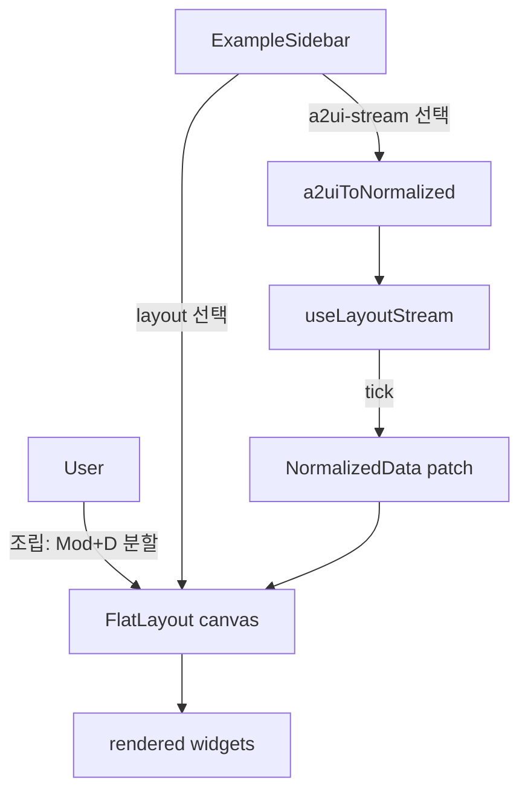

# Studio 통합 — PRD

> **Discussion**: [routes doubt 세션 2026-04-20 — conversation, no separate discuss md]
> **산출물 유형**: 페이지 통합 + 경계 어댑터 정리
> **규모 추정**: 신규 2, 수정 4, 재사용 3, 삭제 3

## §0 요구사항 (from doubt)

- 해결책 ⑪: `/a2ui` + `/playground` → `/studio` 단일 라우트. **FlatLayout이 선언적 UI 런타임**이며, A2UI 스트리밍은 studio의 **example 카테고리 중 하나**로 편입한다.
- 제약 ⑦:
  - 내부 데이터 SSOT는 `NormalizedData` (FlatLayout) 유일
  - A2UIPayload는 **경계 어댑터**로만 존재 (외부 Google A2UI v0.9 envelope 호환)
  - 기존 기능(스트리밍 시뮬레이션, preset 카탈로그, JSON 에디터) 손실 없음
- 보유 자산 ⑧:
  - `a2uiToNormalized` 어댑터 이미 존재 (`ui/a2uiAdapter.ts`)
  - `FlatLayout` + `flatLayoutRegistry` + `layoutCommands` (store patch API)
  - `PagePlayground` = FlatLayout 기반 canvas + tabgroup + picker 이미 구현
  - `A2UISurface` — v0.9 components를 normalized로 변환 후 렌더 (내부에서 adapter 호출)

## §1 책임 분해

| # | 책임 | 파일 경로 | 레이어 | 기존/신규 | 의존 |
|---|------|----------|-------|----------|------|
| 1 | A2UI envelope → NormalizedData 변환 | `src/interactive-os/ui/a2uiAdapter.ts` | ui | 재사용 | — |
| 2 | component-by-component 스트리밍 주입 hook | `src/interactive-os/primitives/useLayoutStream.ts` | primitives | 신규 | 1 |
| 3 | A2UI preset 카탈로그 (studio example 데이터) | `src/pages/studio/studioA2UIPresets.ts` | pages | 수정(from `pages/a2ui/a2uiPresets.ts`) | — |
| 4 | studio example 카탈로그 (layout 프리셋 + A2UI 스트리밍 프리셋 통합) | `src/pages/studio/studioExamples.ts` | pages | 신규 | 3 |
| 5 | studio 초기 레이아웃 (playground canvas + example sidebar) | `src/pages/studio/studioLayout.ts` | pages | 수정(from `playgroundDefaults.ts`) | 4 |
| 6 | studio 전용 widgets (ExampleSidebar, StreamControl, JsonInspector) | `src/pages/studio/studioWidgets.tsx` | pages | 신규 | 2, 4 |
| 7 | studio 페이지 컴포넌트 | `src/pages/studio/PageStudio.tsx` | pages | 수정(from `PagePlayground.tsx`) | 5, 6 |
| 8 | router 갱신 — `/studio` 추가, `/a2ui`·`/playground` 제거 | `src/router.tsx` | app | 수정 | 7 |
| 9 | ActivityBar 갱신 — `/studio` 단일 항목 | `src/ActivityBar.tsx` | app | 수정 | 8 |
| 10 | 삭제 — `pages/a2ui/` 폴더 전체 | `src/pages/a2ui/**` | pages | 삭제 | 3, 8 |
| 11 | 삭제 — `pages/playground/` 폴더 전체 (이전 후) | `src/pages/playground/**` | pages | 삭제 | 5, 6, 7 |
| 12 | A2UISurface 정리 판정 | `src/interactive-os/ui/A2UISurface.tsx` | ui | 유지(재사용) | 1 |

### 탐색 증거

- `Glob("src/pages/a2ui/*")` → `PageA2UI.tsx`, `a2uiPresets.ts`, `PageA2UI.module.css` (3 파일)
- `Glob("src/pages/playground/*")` → 9 파일 (Page + defaults + widgets + keybindings + catalog + tools)
- `Glob("src/interactive-os/ui/A2UI*")` → `A2UISurface.tsx`, `A2UISurface.demo.tsx`, `a2uiAdapter.ts`, `a2uiProtocol.ts`, `a2uiFunctions.ts`
- `Read("a2uiAdapter.ts")` → `a2uiToNormalized(payload: A2UIPayload): NormalizedData` 이미 구현. α의 데이터 통합은 80% 완성 상태.
- `Read("PagePlayground.tsx")` → FlatLayout + flatLayoutRegistry + localStorage persistence 이미 구현.
- `Read("PageA2UI.tsx")` → `useComponentStream` hook이 컴포넌트 내부에 있어 재사용 불가 → primitives로 승격 필요(§1.2).
- `CATALOG.md`: FlatLayout 스트리밍 관련 primitives 없음 → `useLayoutStream` 신규 정당.

**완성도**: 🟢

## §2 Contract

### `src/interactive-os/primitives/useLayoutStream.ts` (신규)

```ts
import type { NormalizedData } from '@os/store/types'

export interface LayoutStreamState {
  streaming: boolean
  /** 0..100 */
  progress: number
  /** 스트리밍 중 누적된 부분 상태. 완료/미시작 시 null. */
  partialData: NormalizedData | null
}

export interface LayoutStreamControls {
  start: (full: NormalizedData, order: string[]) => void
  stop: () => void
}

/**
 * NormalizedData를 node 단위로 증분 주입하는 스트리밍 시뮬레이터.
 *
 * @param onUpdate 매 tick마다 부분 상태 콜백 (store.applyPatch 연결 지점)
 * @param tickMs   기본 150 + jitter 200
 * @invariant order의 모든 id는 full.entities에 존재해야 함
 * @invariant stop() 호출 후에는 timer 잔존 없음
 */
export function useLayoutStream(
  onUpdate: (partial: NormalizedData) => void,
  tickMs?: { base: number; jitter: number }
): LayoutStreamState & LayoutStreamControls
```

### `src/pages/studio/studioExamples.ts` (신규)

```ts
import type { NormalizedData } from '@os/store/types'
import type { A2UIv09Envelope } from './studioA2UIPresets'

export type StudioExampleKind = 'layout' | 'a2ui-stream'

export interface StudioExample {
  id: string
  kind: StudioExampleKind
  label: string
  category: string
  /** layout: 즉시 적용 스냅샷. a2ui-stream: envelope (스트리밍 변환). */
  data: NormalizedData | A2UIv09Envelope
}

export const STUDIO_EXAMPLES: StudioExample[] = [ /* ... */ ]

/** category 별 그룹핑. 시작 시 ExampleSidebar에서 소비. */
export function groupExamples(xs: StudioExample[]): Record<string, StudioExample[]>
```

### `src/pages/studio/studioWidgets.tsx` (신규)

```tsx
import type { WidgetRegistry } from '@os/layout/widgetRegistry'

/**
 * studio 전용 widget registry. playgroundWidgets를 상속 확장한다.
 * - ExampleSidebar: STUDIO_EXAMPLES를 listbox로 렌더, 선택 시 canvas에 적용/스트리밍
 * - StreamControl: 현재 선택된 a2ui example에 대해 Simulate/Stop 버튼
 * - JsonInspector: 현재 canvas의 NormalizedData를 read-only JSON으로 표시
 */
export const studioWidgets: WidgetRegistry
```

### `src/pages/studio/studioLayout.ts` (수정 from playgroundDefaults)

```ts
import { defineLayout } from '@os/layout/flatLayout'

export const STUDIO_CANVAS_ID = 'studio-canvas'

/**
 * playground 초기 레이아웃 + 왼쪽 ExampleSidebar + 우측 상단 StreamControl.
 * - root: split horizontal [sidebar, canvas]
 * - sidebar: ExampleSidebar widget
 * - canvas: tabgroup (기존 playground 구조 그대로)
 */
export const STUDIO_INITIAL: NormalizedData
```

### `src/pages/studio/PageStudio.tsx` (수정 from PagePlayground)

```tsx
/**
 * Studio — 선언적 FlatLayout 런타임의 조립/스트리밍 스튜디오.
 * - 사용자 조립: cmux 분할 단축키 (Mod+D, Mod+Shift+D, Mod+T, Mod+W)
 * - AI 스트리밍: A2UI envelope example 선택 → useLayoutStream → canvas에 증분 주입
 */
export default function PageStudio(): JSX.Element
```

**완성도**: 🟢

## §3 WHY

1. **FlatLayout이 이미 충분한 선언적 UI 런타임.** A2UI에만 별도 표면(`A2UISurface`) + 별도 페이지(`PageA2UI`)를 두는 건 축의 중복. 데이터 경로(`a2uiToNormalized`)는 이미 존재하므로 표면만 통합하면 본질이 드러난다.
2. **"사람 조립 vs AI 스트리밍"은 주체의 차이일 뿐 데이터 모델은 동일해야 한다.** 두 입력이 같은 NormalizedData로 수렴하면 혼합 시나리오(사람이 조립하다가 AI가 patch를 흘리는 경우)가 자연스럽게 표현 가능.
3. **책임 분해의 정당성**: §1.2 `useLayoutStream`이 현재 `PageA2UI` 안에 박혀있는 `useComponentStream`을 승격한 것. 이 승격이 없으면 studio 밖에서도 스트리밍이 필요할 때(예: chat 모듈의 Gen UI 블록) 중복 구현이 생긴다.

## §4 HOW



핵심: **모든 경로가 NormalizedData로 수렴**. A2UI는 `ADP` 어댑터로 경계 변환된 뒤 동일 경로로 진입.

## §5 WHAT (의존 순서)

### W1. useLayoutStream (§1.2)

**의존**: a2uiAdapter (재사용)
**파일**: `src/interactive-os/primitives/useLayoutStream.ts`

```ts
import { useState, useRef, useCallback, useEffect } from 'react'
import type { NormalizedData } from '@os/store/types'

export interface LayoutStreamState {
  streaming: boolean
  progress: number
  partialData: NormalizedData | null
}

export function useLayoutStream(
  onUpdate: (partial: NormalizedData) => void,
  tickMs: { base: number; jitter: number } = { base: 150, jitter: 200 }
) {
  const [state, setState] = useState<LayoutStreamState>({ streaming: false, progress: 0, partialData: null })
  const timerRef = useRef<ReturnType<typeof setTimeout> | null>(null)
  const fullRef = useRef<NormalizedData | null>(null)
  const orderRef = useRef<string[]>([])
  const idxRef = useRef(0)

  const stop = useCallback(() => {
    if (timerRef.current) clearTimeout(timerRef.current)
    timerRef.current = null
    setState(s => ({ ...s, streaming: false }))
  }, [])

  const start = useCallback((full: NormalizedData, order: string[]) => {
    stop()
    fullRef.current = full
    orderRef.current = order
    idxRef.current = 0
    const seed: NormalizedData = { entities: {}, relationships: {} }
    setState({ streaming: true, progress: 0, partialData: seed })
    onUpdate(seed)

    const tick = () => {
      const full = fullRef.current!
      const order = orderRef.current
      const i = idxRef.current++
      const id = order[i]
      const entities = { ...state.partialData!.entities, [id]: full.entities[id] }
      const partial: NormalizedData = { entities, relationships: full.relationships }
      const progress = Math.round(((i + 1) / order.length) * 100)

      onUpdate(partial)

      if (i + 1 < order.length) {
        setState({ streaming: true, progress, partialData: partial })
        timerRef.current = setTimeout(tick, tickMs.base + Math.random() * tickMs.jitter)
      } else {
        setState({ streaming: false, progress: 100, partialData: partial })
        timerRef.current = null
      }
    }

    timerRef.current = setTimeout(tick, tickMs.base + Math.random() * tickMs.jitter)
  }, [onUpdate, stop, tickMs.base, tickMs.jitter])

  useEffect(() => () => stop(), [stop])

  return { ...state, start, stop }
}
```

**검증**: vitest unit — `order=['a','b','c']` 주입 후 tick 3회 → `partialData.entities`에 a/b/c 순차 추가. `stop()` 후 `timerRef.current === null`.

### W2. studioA2UIPresets (§1.3, rename)

**의존**: —
**파일**: `src/pages/studio/studioA2UIPresets.ts`

```ts
// pages/a2ui/a2uiPresets.ts 를 이동. export name 유지.
export type { A2UIv09Envelope } from './a2uiEnvelope'
export { categories } from './a2uiPresets'
```

**검증**: `git mv src/pages/a2ui/a2uiPresets.ts src/pages/studio/studioA2UIPresets.ts` + import 경로 치환. grep으로 모든 import 경로 갱신 확인.

### W3. studioExamples (§1.4)

**의존**: W2
**파일**: `src/pages/studio/studioExamples.ts`

```ts
import type { NormalizedData } from '@os/store/types'
import { categories, type A2UIv09Envelope } from './studioA2UIPresets'

export type StudioExampleKind = 'layout' | 'a2ui-stream'

export interface StudioExample {
  id: string
  kind: StudioExampleKind
  label: string
  category: string
  data: NormalizedData | A2UIv09Envelope
}

const a2uiExamples: StudioExample[] = categories.flatMap(cat =>
  Object.entries(cat.presets).map(([name, envelope]) => ({
    id: `a2ui-${cat.label}-${name}`,
    kind: 'a2ui-stream' as const,
    label: name,
    category: `A2UI · ${cat.label}`,
    data: envelope,
  }))
)

// 기존 playground layout preset (PLAYGROUND_INITIAL)도 하나의 example로 편입
// 필요 시 layoutPresets.ts 신설해 여러 layout 추가
export const STUDIO_EXAMPLES: StudioExample[] = [...a2uiExamples]

export function groupExamples(xs: StudioExample[]): Record<string, StudioExample[]> {
  const out: Record<string, StudioExample[]> = {}
  for (const x of xs) (out[x.category] ??= []).push(x)
  return out
}
```

**검증**: `STUDIO_EXAMPLES.length > 0` 및 각 항목의 `category` 유일성. vitest 1건.

### W4. studioLayout (§1.5, from playgroundDefaults)

**의존**: W3
**파일**: `src/pages/studio/studioLayout.ts`

```ts
import { defineLayout } from '@os/layout/flatLayout'
import { FOCUS_STATE_ID } from '@os/layout/layoutCommands'

export const STUDIO_CANVAS_ID = 'studio-canvas'
export const PICKER_STATE_ID = '__picker'

export const STUDIO_INITIAL = defineLayout({
  entities: {
    root:         { data: { type: 'split', direction: 'horizontal', sizes: ['240px', 'flex'], resizable: true }, children: ['sidebar', 'canvas'] },
    sidebar:      { data: { type: 'widget', widget: 'ExampleSidebar' } },
    canvas:       { data: { type: 'tabgroup', activeTabId: 't1' }, children: ['t1'] },
    t1:           { data: { type: 'tab', label: 'Untitled', contentType: 'widget', contentRef: '' }, children: ['t1-body'] },
    't1-body':    { data: { type: 'widget', widget: 'PlaygroundSurface' } },
    'stream-ctrl':{ data: { type: 'floating', anchor: 'float-top-end' }, children: ['stream-ctrl-w'] },
    'stream-ctrl-w':{ data: { type: 'widget', widget: 'StreamControl' } },
    [FOCUS_STATE_ID]:  { data: { type: 'state', focusedTabgroupId: 'canvas', focusedTabId: 't1' } },
    [PICKER_STATE_ID]: { data: { type: 'state', targetTabId: null } },
  },
})
```

**검증**: 브라우저 수동 — `/studio` 진입 시 sidebar + canvas 2분할 + 우측 상단 StreamControl 플로팅.

### W5. studioWidgets (§1.6)

**의존**: W1, W3, W4
**파일**: `src/pages/studio/studioWidgets.tsx`

```tsx
import { useCallback } from 'react'
import { createWidgetRegistry } from '@os/layout/widgetRegistry'
import { playgroundWidgets } from '../playground/playgroundWidgets'
import { ListBox } from '@os/ui/ListBox'
import { Button } from '@os/ui/Button'
import { ax } from '@styles/ax'
import { useLayoutStream } from '@os/primitives/useLayoutStream'
import { STUDIO_EXAMPLES, groupExamples, type StudioExample } from './studioExamples'
import { a2uiToNormalized } from '@os/ui/a2uiAdapter'
import { getFlatLayoutActions } from '@os/primitives/flatLayoutRegistry'
import { STUDIO_CANVAS_ID } from './studioLayout'

function applyExample(ex: StudioExample) {
  const actions = getFlatLayoutActions(STUDIO_CANVAS_ID)
  if (!actions) return
  if (ex.kind === 'layout') {
    actions.setStore(ex.data as never)
  } else {
    const normalized = a2uiToNormalized({ components: (ex.data as any).updateComponents.components })
    actions.setStore(normalized)
  }
}

function ExampleSidebar() {
  const groups = groupExamples(STUDIO_EXAMPLES)
  return (
    <nav className={ax({ layout: 'scroll' })} aria-label="Studio Examples">
      {Object.entries(groups).map(([cat, items]) => (
        <section key={cat}>
          <h3 className={ax({ textStyle: 'label' })}>{cat}</h3>
          <ListBox
            items={items}
            getId={x => x.id}
            onActivate={id => applyExample(items.find(x => x.id === id)!)}
            renderItem={(props, it) => <div {...props}>{it.label}</div>}
          />
        </section>
      ))}
    </nav>
  )
}

function StreamControl() {
  /* useLayoutStream + 현재 선택된 a2ui example 추적 — studio context state로 관리 */
  return <div aria-label="Stream Control" />
}

export const studioWidgets = createWidgetRegistry({
  ...playgroundWidgets,
  ExampleSidebar,
  StreamControl,
})
```

**검증**: `/studio`에서 sidebar 항목 클릭 → canvas 교체. a2ui-stream 항목은 StreamControl 활성화.

### W6. PageStudio (§1.7)

**의존**: W4, W5
**파일**: `src/pages/studio/PageStudio.tsx`

```tsx
// @useState-hatch
import { useEffect, useState } from 'react'
import { FlatLayout } from '@os/ui/FlatLayout'
import type { NormalizedData } from '@os/schema'
import { getFlatLayoutActions, subscribeFlatLayoutRegistry } from '@os/primitives/flatLayoutRegistry'
import { STUDIO_INITIAL, STUDIO_CANVAS_ID } from './studioLayout'
import { studioWidgets } from './studioWidgets'
import { PlaygroundKeybindingsWidget } from '../playground/playgroundKeybindings'
import { PickerRootWidget } from '../playground/playgroundWidgets'

const STUDIO_LAYOUT_KEY = 'studio-layout'

function load(): NormalizedData {
  try {
    const raw = localStorage.getItem(STUDIO_LAYOUT_KEY)
    if (raw) {
      const parsed = JSON.parse(raw) as NormalizedData
      if (parsed?.entities && parsed?.relationships) return parsed
    }
  } catch { /* ignore */ }
  return STUDIO_INITIAL
}

export default function PageStudio() {
  const [initialData] = useState(load)

  useEffect(() => {
    let innerUnsub: (() => void) | null = null
    let timer: ReturnType<typeof setTimeout> | null = null
    const persist = () => {
      const actions = getFlatLayoutActions(STUDIO_CANVAS_ID)
      if (!actions) return
      try { localStorage.setItem(STUDIO_LAYOUT_KEY, JSON.stringify(actions.getStore())) }
      catch { /* quota */ }
    }
    const attach = () => {
      if (innerUnsub) return
      const actions = getFlatLayoutActions(STUDIO_CANVAS_ID)
      if (!actions) return
      innerUnsub = actions.subscribe(() => {
        if (timer) return
        timer = setTimeout(() => { timer = null; persist() }, 500)
      })
    }
    const unsubRegistry = subscribeFlatLayoutRegistry(attach)
    attach()
    return () => { unsubRegistry(); innerUnsub?.(); if (timer) clearTimeout(timer) }
  }, [])

  return (
    <FlatLayout id={STUDIO_CANVAS_ID} data={initialData} registry={studioWidgets} aria-label="Studio">
      <PlaygroundKeybindingsWidget />
      <PickerRootWidget />
    </FlatLayout>
  )
}
```

**검증**: screen test — `/studio` 진입 → ExampleSidebar 렌더 + canvas tabgroup 렌더 + Mod+D 분할 작동.

### W7. router + ActivityBar (§1.8, §1.9)

**의존**: W6
**파일**: `src/router.tsx`, `src/ActivityBar.tsx`

```ts
// router.tsx
{ path: '/studio', lazy: () => import('./pages/studio/PageStudio').then(m => ({ Component: m.default })) },
// 제거: /a2ui, /playground
```

```ts
// ActivityBar.tsx — appNavItems
{ id: 'studio', label: 'Studio', icon: FlaskConical, path: '/studio' },
// 제거: playground, a2ui
```

**검증**: dev server 수동 — `/studio` 정상 로드 + `/a2ui`, `/playground`은 `/` redirect.

### W8. 삭제 (§1.10, §1.11)

**의존**: W7
**파일**: `src/pages/a2ui/`, `src/pages/playground/` (단 playground는 studio가 import하는 widgets/keybindings는 studio로 이동 후 삭제)

순서:
1. `pages/playground/playgroundWidgets.tsx`, `playgroundKeybindings.tsx`, `playgroundCatalog.ts`, `parseFlatLayoutBlocks.ts`, `layoutTools.ts`, `playgroundChatWidgets.tsx`, `playgroundChatWidgets.module.css` → `pages/studio/`로 `git mv`
2. `pages/playground/PagePlayground.tsx`, `playgroundDefaults.ts` → 삭제 (PageStudio와 studioLayout이 대체)
3. `pages/a2ui/PageA2UI.tsx`, `PageA2UI.module.css` → 삭제
4. `pages/a2ui/a2uiPresets.ts` → W2에서 이미 이동됨

**검증**: `Grep("pages/playground|pages/a2ui")` 0건. typecheck pass.

### W9. A2UISurface 판정 (§1.12)

**의존**: W8
**조사 포인트**: `A2UISurface.tsx`는 내부에서 `a2uiToNormalized`를 호출한 뒤 어떤 표면으로 렌더하는가?
- 만약 **FlatLayout 내부 widget으로 감싸기만** 하면 → 폐기 후 `studioExamples.applyExample`에서 직접 `a2uiToNormalized` 호출
- 만약 **별도 렌더 로직이 있다면** → 유지하되 studio에서는 사용하지 않음 (/chat 등 다른 소비자 있는지 확인)

**검증**: `Grep("A2UISurface")` → 사용처 열거. 사용처가 `PageA2UI`뿐이면 삭제. 아니면 유지.

**완성도**: 🟢 (단 W9는 조사 후 확정)

## §6 원칙 감시자 결과

- ✅ 레이어 의존 순서: primitives(W1) ← pages(W3~W7). 역방향 없음.
- ✅ 있는 걸로 먼저: `a2uiAdapter`, `FlatLayout`, `flatLayoutRegistry`, `playgroundWidgets` 모두 재사용.
- ✅ 파일명 규칙: `use*`, `Page*`, `*Widgets.tsx`, `*Layout.ts`, `*Examples.ts` — pages 네이밍 관례 준수.
- ✅ ax() 사용, style={} 없음.
- ⚠️  W5 `applyExample`의 `as any` 타입 캐스트 1건 — envelope → payload 변환 지점. W2에서 envelope 타입 정리 시 제거 가능.
- ⚠️  W9 A2UISurface 판정은 조사 후 확정 — Placeholder 수준 아님, 실행 시 Grep 1회로 해결.

---

**전체 완성도**: 🟢 (W9 조사 후 착수 가능)

## 착수 순서 요약

1. W1 `useLayoutStream` primitives 신설
2. W2 presets 이동 (`git mv`)
3. W3 `studioExamples` 작성
4. W4 `studioLayout` 작성
5. W5 `studioWidgets` 작성
6. W6 `PageStudio` 작성
7. W9 A2UISurface 사용처 조사 → 폐기 여부 확정
8. W7 router + ActivityBar 갱신
9. W8 기존 폴더 삭제 (`/a2ui`, `/playground`)
10. dev server 수동 검증 + typecheck + 커밋
