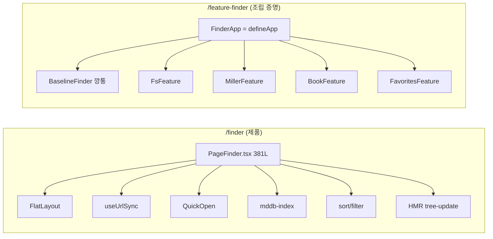
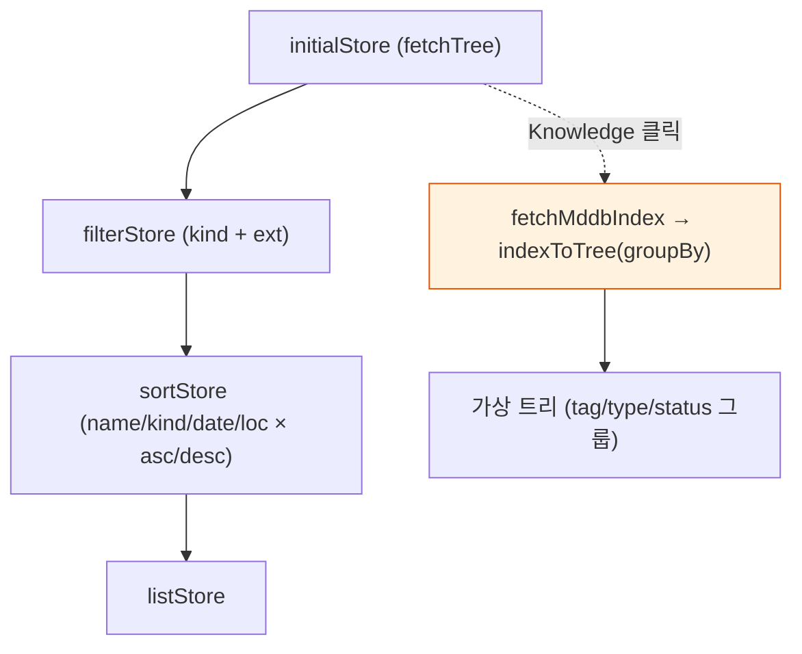
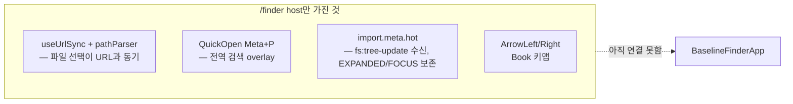
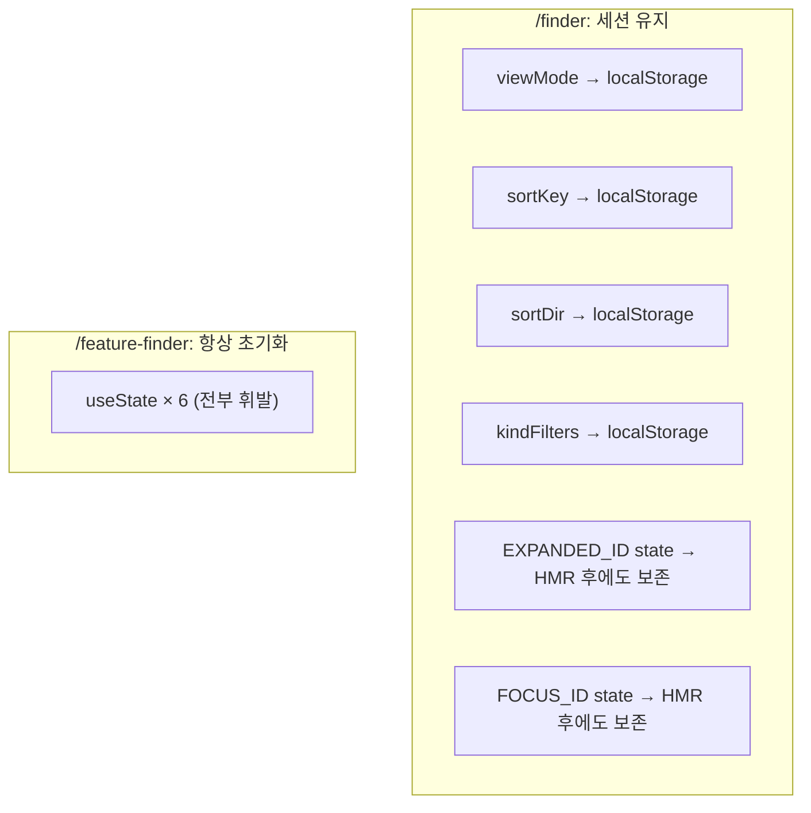
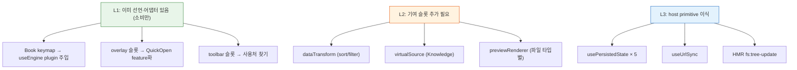

# Finder vs FeatureFinder — 같은 목적, 다른 레이어

> 작성일: 2026-04-21
> 맥락: `/finder` = production 앱, `/feature-finder` = `defineFeature`/`defineApp` 런타임 조립 실증

> - `/finder`는 381줄 PageFinder가 FlatLayout·URL·QuickOpen·mddb·HMR을 한 파일에 묶은 **세로형 통합체**다
> - `/feature-finder`는 20줄 `FinderApp = defineApp({baseline, features[]})`가 전부인 **가로형 조립체**다
> - 두 페이지는 같은 "파일 탐색" 목적이지만 축이 직교한다 — 비교해야 할 gap은 "기능 수"가 아니라 "조립 vs 소유"다
> - **즉답: /feature-finder는 viewMode·sidebar·dataSource 3축의 마켓플레이스 MVP일 뿐, /finder의 사용자 기능 8종은 아직 Feature로 분해되지 않았다**

---

## Why — 두 페이지는 다른 문제를 푼다

`/finder`는 **제품**이고, `/feature-finder`는 **아키텍처 증명**이다.

| 축 | /finder | /feature-finder |
|---|---|---|
| 정의 코드 | 381줄 단일 page | 20줄 `defineApp` + 4 feature |
| 레이아웃 | FlatLayout + widgetRegistry | BaselineFinderApp의 `ax({layout:'row'})` 직접 조립 |
| 기능 추가 방식 | PageFinder에 useState·useEffect 추가 | `features: [...]`에 push |
| Settings 토글 | ❌ | ✅ 런타임 install/uninstall |
| 1차 청자 | 사용자 | 마켓플레이스 설계 |

→ **시사점**: "/finder에 있는 것이 /feature-finder에 없다"를 gap으로 세면 방향을 잘못 본다. 진짜 질문은 "/finder 기능을 어떤 기여 슬롯(contribution slot)으로 분해해야 Feature가 되는가".

---

## Gap 1 — 데이터 파이프라인: sort/filter/knowledge는 Feature 슬롯이 없다

BaselineFinder가 선언한 슬롯은 6개(`sidebar/toolbar/mainHeader/treeContent/previewContent/overlay`)뿐이고, `AppDefinition` 기여 타입은 `dataSource/viewMode/sidebar` 3종뿐이다. `/finder`의 파생 파이프라인은 넣을 슬롯이 없다.

`/finder`에서 실질 구현 270줄 중:
- **sort**: `finderSort.ts` 58L + handler 10L + usePersistedState 2개
- **filter**: `finderFilter.ts` 84L + kindFilters UI + usePersistedState
- **knowledge**: `knowledgeFetch.ts` 40L + `knowledgeTransform.ts` 91L + sidebar 분기

BaselineFinderApp은 raw `data`를 그대로 `ViewRender`에 흘린다. sort/filter/knowledge가 feature가 되려면 **새 기여 타입**(예: `dataTransform`, `virtualSource`)이 필요하고, baseline의 load→transform→render 파이프라인도 확장돼야 한다.

→ **시사점**: 다음 설계 과제는 *feature 추가*가 아니라 **기여 슬롯 확장** — `dataTransform` 1종을 추가하면 sort/filter가 자동으로 feature화된다.

---

## Gap 2 — 크로스커팅 기능은 host에 박혀있다

URL sync, QuickOpen, HMR은 Feature 어디에도 속하지 않고 `/finder`가 직접 소유한다.

각각의 상태:
- **URL sync** — `useUrlSync({parser, onUrlChange})` 패턴으로 `usePlugin` 하나만 주입하면 되지만 BaselineFinderApp에 없음
- **QuickOpen** — `overlay` 슬롯이 선언돼 있지만 아무 feature도 기여 안 함
- **HMR refresh** — `FsFeature.dataSource.load`가 1회성. 재로드 훅 없음
- **Book 키맵** — `BookFeature.keymap`에 선언은 있지만 주석: *"engine 통합 단계에서 BaselineFinderApp이 activeView keymap을 useEngine plugin으로 주입하면 자동 활성"* — **선언만 있고 소비 측이 없음**

→ **시사점**: 가장 급한 1개는 **keymap plugin 주입**이다. 이미 선언/어댑터(`featureRegistryToPlugin`)는 존재하므로 BaselineFinderApp의 `useEngine` 경로 한 줄이 해금시킨다.

---

## Gap 3 — 지속성과 HMR: 세션 경계가 없다

`/finder`의 `usePersistedState` 4개(viewMode / sortKey / sortDir / kindFilters)와 HMR 핸들러가 BaselineFinderApp에는 전무하다. 새로고침 한 번이면 모든 설정이 증발한다.

BaselineFinderApp의 `useState`로 관리되는 것: `enabled / showSettings / rootPath / data / viewModeId / sizes` 6개 — **모두 메모리 전용**.

→ **시사점**: `usePersistedState`는 이미 범용 primitive이므로 host에서 바로 치환 가능. 설치된 feature 집합(`enabled`)의 persistence가 가장 중요 — 마켓플레이스의 본질이 "내가 설치한 것들"이다.

---

## Gap 4 — 레이아웃 엔진: FlatLayout이 깡통에 없다

`/finder`는 `FlatLayout(data, registry)`로 5 widget(Sidebar/Toolbar/TreeGrid/Preview/Miller)을 선언적으로 배치하고 `updateEntityData`로 `hidden` 토글한다. BaselineFinderApp은 `ax({layout:'stack'/'row'})` + 조건부 JSX로 직접 조립한다.

| 관점 | /finder | /feature-finder |
|---|---|---|
| 배치 선언 | `baseLayout` entity tree + widgetRegistry | JSX 중첩 + `sizes` SplitPane 1회 |
| 토글 방식 | `hidden` field 업데이트 | `hasSidebar && !hideSidebar` 삼항 |
| Resize | FlatLayout이 소유 | `useState<PaneSize[]>` 1곳만 |
| 확장성 | widget 등록 → registry | JSX 가지치기 증가 |

→ **시사점**: 이건 **아직 gap이 아님** — BaselineFinderApp은 의도적으로 최소 조립을 유지해 `defineFeature` 계약을 검증한다. FlatLayout 채택은 *깡통이 toolbar/mainHeader/overlay 슬롯을 소비할 때* 자연스럽게 들어가야 한다. 현재 그 슬롯들은 선언만 있고 소비 코드가 없다.

---

## 종합 — Gap을 어떤 순서로 닫을 것인가

관찰을 모으면 3 계층이 보인다.

| 우선순위 | 이유 |
|---|---|
| **L1 (소비 연결)** | 작업량 최소, 이미 만든 계약 검증 완료 |
| **L2 (슬롯 확장)** | `defineFeature`의 표현력 한계를 실제로 드러냄. `/finder` 포팅의 본게임 |
| **L3 (primitive 이식)** | feature 경계 없이도 host 업그레이드로 해결 가능, 병렬 진행 가능 |

→ **시사점**: "`/finder` 기능 = Feature" 1:1 맵이 아니다. 기능마다 (a) 슬롯 선언 필요 여부, (b) host primitive 이식 여부, (c) 단순 소비 연결 여부를 분리 판단해야 한다. 현재 `/feature-finder`는 **dataSource + viewMode + sidebar 3축의 증명을 완주했고**, 다음 마일스톤은 `dataTransform` 슬롯 추가로 sort/filter를 feature화하는 것이다.
