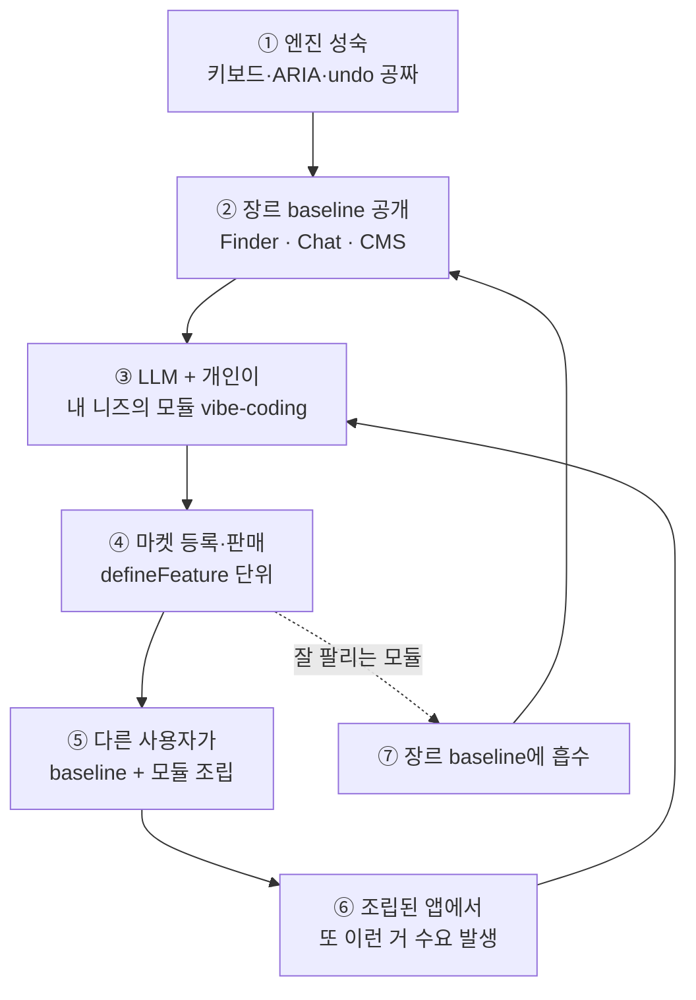

# Vision — 인지 인터페이스의 창작자 경제

> 작성일: 2026-04-21
> 맥락: 기존 vision.md(엔진 관점)에 **마켓 레이어**를 한 층 더 얹어, 어제 도입된 `defineFeature`/`defineApp`을 생태계의 원시(原始) 단위로 재해석한다.

> - 변하지 않는 것(키보드·ARIA)은 **엔진이 보장**, 장르(slack·CMS·kanban)는 **baseline이 제공**, 모듈은 **누구나 만들어 팔고 조립**한다
> - 잘 팔린 모듈은 장르 baseline으로 승격되어 지식이 역류한다 — "쌓이지 대체되지 않는다"의 구체적 메커니즘
> - 어제 PR #7의 `defineFeature`가 마켓 층의 첫 원시 단위. 지금 4-17~21의 모든 작업은 "팔 만한 물건이 실제로 팔 만하다"를 경화하는 공급자 사전공사
> - **즉답: 지향점은 vibe-coding SaaS가 아니라, 공급·수요·표준화가 한 루프로 도는 창작자 경제다**

## 1. 3층 변화 속도 모델

마켓이 성립하려면 "아래 층은 안 바뀐다"는 보장이 필요하다. 키보드 QWERTY가 100년 유지된 덕에 키캡 시장이 도는 것과 같다.

```
┌─────────────────────────────────────────────────────────────┐
│ ③ MODULE  (빠르게 변함, 개인·회사가 만듦)                      │ ← 마켓 거래 단위
│   "이 Finder의 Sort 모듈" · "이 CMS의 번역 패널"               │
│   = defineFeature 한 단위                                       │
│                        ↕ 조립                                   │
├─────────────────────────────────────────────────────────────┤
│ ② GENRE   (천천히 변함, 합의되면 유지)                          │ ← 장르 템플릿
│   chat · CMS · kanban · file-explorer · spreadsheet          │
│   = defineApp baseline                                          │
│                        ↕ 구현                                   │
├─────────────────────────────────────────────────────────────┤
│ ① PRIMITIVE (안 변함, 인류 합의)                                │ ← 엔진 보장
│   키보드 · ARIA 7축 · undo · focus · selection                 │
│   = Axes + Patterns + Plugins                                   │
└─────────────────────────────────────────────────────────────┘
```

## 2. 선순환 루프



⑦이 핵심이다. Slack의 threads가 모든 채팅앱 기본이 된 것처럼, 잘 팔린 모듈은 장르의 기본값으로 승격되어 ③→②→①로 지식이 역류한다.

## 3. 마켓 성립 조건 — 현재 진척도

| 조건 | 왜 필요 | 상태 |
|---|---|---|
| A. 모듈 단위 정의 | 팔 물건이 정의돼야 거래 | 🟢 `defineFeature`/`defineApp` 어제 도입 |
| B. 조립/해제 런타임 | 사서 바로 끼울 수 있어야 | 🟡 Settings 체크박스 UX 증명. keymap 실런타임 통합 미완 |
| C. 모듈 간 호환 표준 | 다른 사람 모듈끼리 안 싸워야 | 🟡 7 기여 타입 선언. 런타임 소비 일부만 |
| D. 모듈 생성 비용 0 | 공급이 생기려면 | 🔴 A2UI 선언 파이프라인 PoC(4-19)·LLM DX 풀세트 아직 |
| E. 디자인 일관성 자동 | 제각각이면 상품성 X | 🟡 ax() 24축 경화 집중(4-17~19) |
| F. 장르 baseline 카탈로그 | 어느 장르부터 열 것인가 | 🟡 Finder 완성. chat/CMS/kanban 쇼케이스 단계 |
| G. 배포·버저닝·샌드박싱 | 실제 상업 거래 | 🔴 |
| H. 수익 분배·권리 | 선순환의 금전적 동기 | 🔴 |

지금 4-17~21 PRD의 대부분이 **A~E**에 모여 있다. 마켓 인프라(G·H)를 열기 전에 "공급을 0원에 찍어내는 엔진"을 먼저 경화하는 순서. 공급 없는 마켓은 안 돈다.

## 4. 최종 지향점 (수정판)

기존 vision의 ⑦(vibe-coding SaaS)은 **혼자 쓰는 도구**였다. 마켓 층을 받으면 한 칸 더 올라간다:

> **⑧' 인지 인터페이스의 창작자 경제** —
> 엔진이 "변하지 않는 것"을 보장하고,
> 장르가 "이미 합의된 것"을 제공하고,
> 누구나 "자기 필요"를 모듈로 만들어 팔고,
> 누구나 사서 조립하며,
> 잘 팔린 모듈은 장르 기본값으로 승격되어 다음 세대가 그 위에서 다시 시작하는,
> **공급·수요·표준화가 한 루프로 돌아가는 생태계**

이 지향점에서 기존 축들을 재해석하면:

- **FE의 가치 재정의**: 조작 장인 → 블록 설계자 → 블록 판매자/구매자
- **vibe-coding SaaS**: 혼자 쓰는 도구 ❌ → 공급자·수요자가 만나는 시장 ⭕
- **A2UI protocol**: LLM용 입력 형식 → **유통 가능한 디지털 상품의 표준 규격** (JSON이라 샌드박싱·버저닝·diff·라이선스 부착 가능)
- **ARIA 준수**: 접근성 규제 대응 → **상품 품질 보증 라벨** (Unity "URP 호환"처럼)
- **렌더러 독립**: 기술적 확장 → **한 번 만든 모듈이 웹·앱·TUI에서 다 팔림** (market size × renderer count)

## 5. 루프를 닫으려면 비어 있는 것

A~E(팔 만한 물건) 다음 단계로 빠져 있는 것:

1. **모듈 manifest**: author, dependencies, compatible versions — `defineFeature`에 메타 필드
2. **Registry/배포**: npm(공개) vs Shopify(큐레이션) vs Figma(둘 다) 중 결정
3. **샌드박싱**: 남의 모듈이 내 데이터를 못 건드리게 — Plugin 권한 축 신설 가능성
4. **버저닝·호환성**: ①은 안 변해야 성립하지만 ②③은 변함 — semver + A2UI schema version
5. **발견·큐레이션 UX**: 마켓 자체가 interactive-os로 만든 앱이어야 함 (메타 dogfooding)
6. **수익 구조**: 무료/유료/구독/수수료 — Primitive 단의 게이팅 훅 필요 여부

## Insight — 마켓은 공급이 없으면 안 돌아간다

네 비전은 기존 수직 로드맵의 **지붕이 아니라 그 위에 한 층 더 있는 마켓 층**이다. 그리고 어제 `defineFeature`가 들어가면서 이 마켓 층의 **첫 원시 단위가 이미 정의**됐다. 지금 당장 마켓을 열지는 않더라도, "잘 팔릴 만한 물건을 먼저 만들 수 있는 도구"부터 경화하는 게 지금 4-17~21 전 작업이 수렴하는 이유로 해석된다. 공급을 0원에 찍어내는 엔진부터 닫는 것이 순서다.
