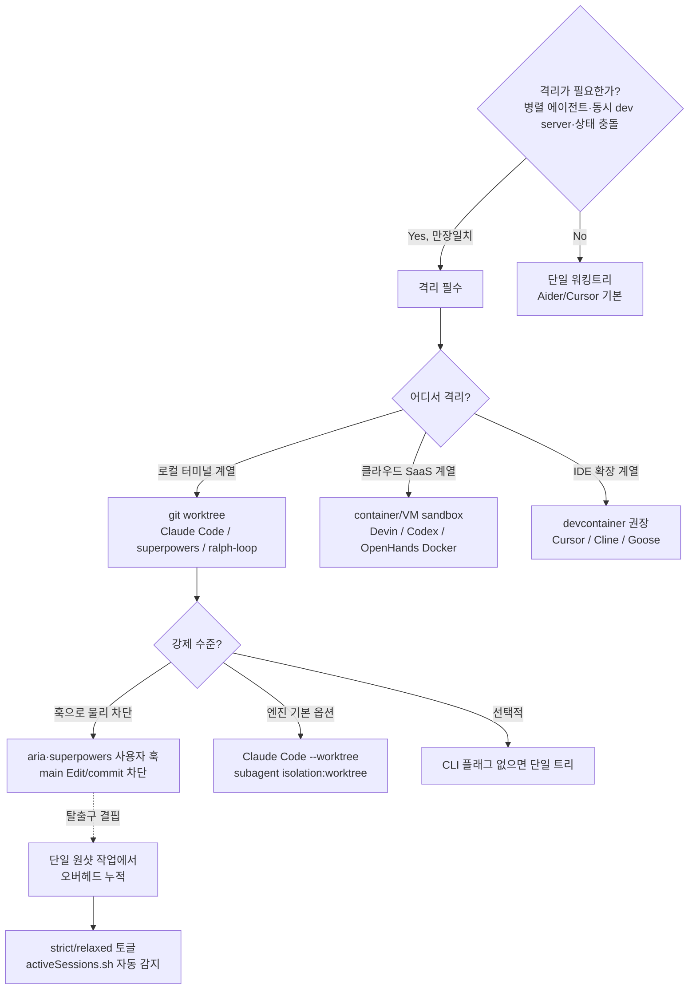
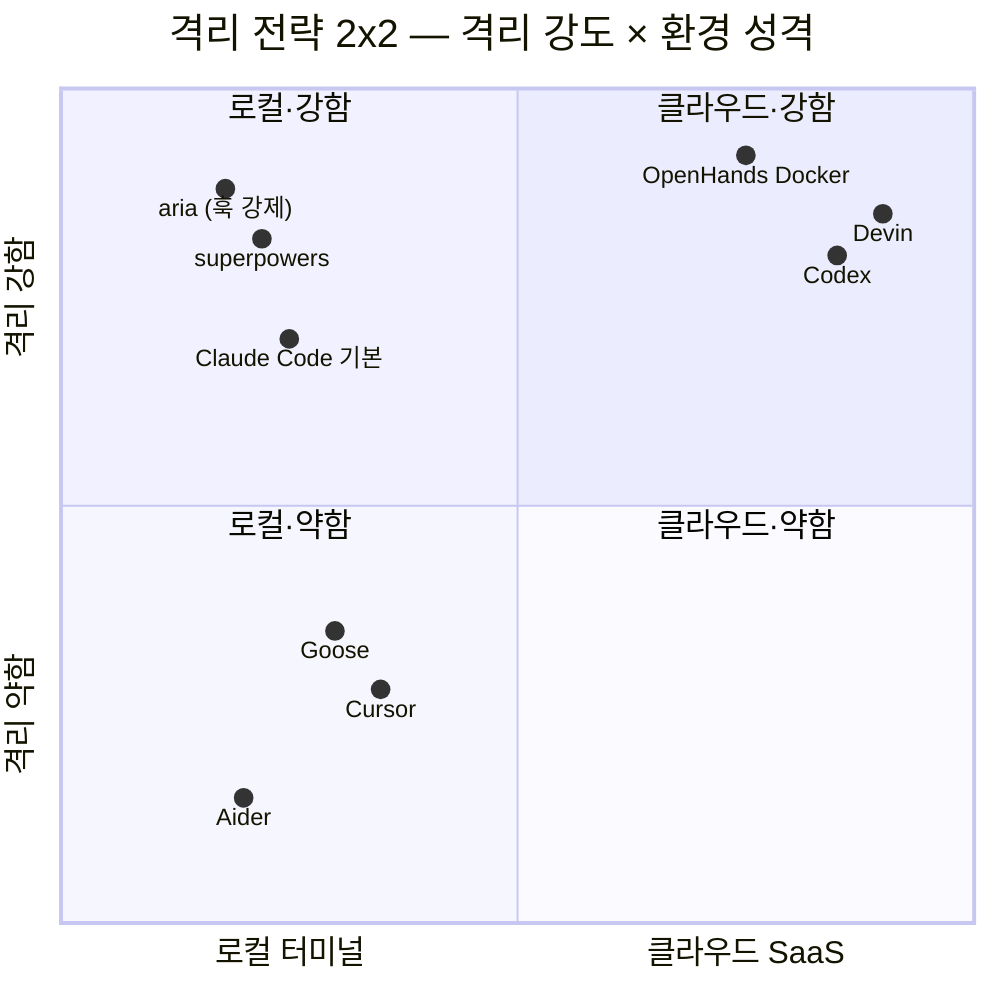

# 멀티에이전트 병렬 개발에서 git worktree 강제는 좋은 컨벤션인가

## TL;DR

1. **Claude Code 생태계 내부에서 worktree는 압도적 de facto 표준.** Anthropic이 v2.1.50부터 엔진에 `--worktree`·`isolation: worktree`·WorktreeCreate 훅을 직접 탑재했고, 주요 스킬 프레임워크(superpowers, parallel-code, parallel-worktrees)가 전부 worktree 위에서 빌드된다.
2. **전체 AI 에이전트 시장은 "격리 필수"로 만장일치, "어떻게"에서 2파로 갈린다.** 로컬-터미널파(Claude Code/Aider/Goose) → worktree, 클라우드-SaaS파(Devin/Codex/OpenHands) → container sandbox.
3. **aria의 "훅으로 강제"는 생태계와 정렬된 선택**이지만, 단일 세션에서도 worktree 오버헤드(create·cd·commit cycle, node_modules 중복)가 있어 `worktreeModeToggleBacklog`의 strict/relaxed 토글이 합리적 보완이다.
4. 진짜 논의할 만한 갭: **의존성 중복 설치**(pnpm store 공유로 일부 완화 가능), **stopRequireCommit 훅 미구현**, VS Code의 worktree 1급 지원이 2025-07에 겨우 들어왔다는 **tool 호환 리스크**.
5. Insight: aria 규약은 **원리적으로는 주류 정렬, 실무적으로는 "강제 99% + 탈출구 1%"가 빠진 상태**. backlog의 relaxed 모드를 도입하면 주류 패턴의 단점(로컬 원샷 작업에서의 오버헤드)을 해소하면서 격리 이득을 유지한다.

## Why — 왜 이 질문이 지금 중요한가

현재 브랜치가 `feat/wt-gateway-clean`, 미커밋 상태에 워크트리 훅 5개(requireWorktree / allocWorktreePort / sessionStartWorktree / worktreeRegistry / stopRequireCommit) + `scripts/wtList.mjs`가 새로 올라와 있다. `docs/2026/2026-04/2026-04-21/parallelWorktreePrd.md`는 **draft 🟢 완성도**로 9개 W를 계약·검증 단위로 분해했고, 동일 날짜의 `worktreeModeToggleBacklog.md`는 이미 "강제 1-모드의 한계"를 인지해 strict/relaxed 토글을 제안하고 있다.

즉 aria는 **"강제한다"를 먼저 찍고 → 이제 "얼마나 강제하나"의 스펙트럼을 열려는 단계**. 이 타이밍에 외부의 de facto와 대안 격리 전략을 끌어와야 (1) 현재 훅 세트가 업계와 정렬된 부품인지 (2) 토글 도입 시 어디를 참고할지가 판정 가능하다.

## How — 멀티에이전트 격리의 사고 지도

**핵심 축 2개:**

1. **격리 매체** — worktree(로컬) vs container(클라우드) vs 없음(단일 트리). 로컬 터미널 에이전트에선 worktree가 사실상 유일하게 성숙한 파일시스템 격리 수단.
2. **강제 수준** — 훅 차단(strict) / 엔진 옵션(default) / 선택(opt-in). 강제가 강할수록 실수는 줄지만 단일 원샷 작업 비용이 커진다.

## What — 구체 부품·API·인용

### Claude Code 공식 (엔진 내장)

- `--worktree` 플래그, `.claude/worktrees/` 디렉터리 관리 (v2.1.50+)
- subagent frontmatter의 `isolation: worktree` — Agent 도구 파라미터에도 노출됨
- `WorktreeCreate` / `WorktreeRemove` 훅으로 SVN/Perforce/Mercurial 확장 가능
- 변경 없으면 자동 cleanup, 변경 있으면 keep/remove 프롬프트
- 출처: [Claude Code Common Workflows](https://code.claude.com/docs/en/common-workflows), [Boris Cherny 발표](https://www.threads.com/@boris_cherny/post/DVAAnexgRUj/)

### 커뮤니티 de facto 스킬/툴

- [obra/superpowers `using-git-worktrees`](https://github.com/obra/superpowers/blob/main/skills/using-git-worktrees/SKILL.md): "Before touching any code, Superpowers creates an isolated development branch using Git worktrees. This isolation is fundamental."
- [johannesjo/parallel-code](https://github.com/johannesjo/parallel-code): Claude/Codex/Gemini를 worktree 3면에서 병렬
- [spillwavesolutions/parallel-worktrees](https://github.com/spillwavesolutions/parallel-worktrees): 전용 스킬
- AgentsMesh: "PTY sandbox + git worktree isolation"을 상용 플랫폼 primitive로 내세움

### 대안 격리: container sandbox

| 도구 | 격리 기본값 |
|---|---|
| Codex (OpenAI) | cloud container, 인터넷 차단 |
| Devin (Cognition) | cloud VM per ticket (shell+editor+browser) |
| OpenHands | Docker sandbox 필수, 세션 종료 시 destroy |
| Cursor | branch-only, 최대 8 parallel, 격리 약함 |
| Cline | VS Code extension, devcontainer 권장 |
| Aider | branch + auto-commit, 단일 트리 |
| Goose | 로컬, devcontainer 권장 |

출처: [OpenHands Docker Sandbox](https://docs.openhands.dev/sdk/guides/agent-server/docker-sandbox), [apidog OpenHands vs Devin](https://apidog.com/blog/openhands-the-open-source-devin-ai-alternative/), [morphllm Claude Code Alternatives](https://www.morphllm.com/comparisons/claude-code-alternatives)

### aria 내부 부품 (이미 있는 것)

- `.claude/hooks/requireWorktree.mjs` — PreToolUse Edit/Write 단계에서 main 차단 + 워크트리 생성 명령 제안
- `.claude/hooks/guardBash.mjs` — main branch commit/push 물리 차단 (`ALLOW_MAIN` 무시 불가)
- `.claude/hooks/sessionStartWorktree.mjs` — SessionStart에서 registry 자동 등록·포트 자동 할당
- `.claude/hooks/worktreeRegistry.mjs` — `.claude/worktrees.json` 단일 소스, stale PID 감지
- `.claude/hooks/allocWorktreePort.mjs` — 5173부터 증가하며 미사용 포트 반환
- `scripts/wtList.mjs` — `pnpm wt:list` / `pnpm wt:prune`

**미구현**: `stopRequireCommit.mjs` (PRD W6 정의만 있음), `vite.config.ts` 포트 자동 적용.

## What-if — aria에 적용하면

1. **현재 strict 1-모드 유지 + backlog 토글 도입**: `worktreeModeGate.mjs` 신규 훅이 `activeSessions.sh` 기반으로 병렬 세션 감지 시 strict, 단일 세션이면 relaxed. 사용자는 `pnpm wt:strict` / `pnpm wt:relaxed`로 명시 오버라이드.
2. **pnpm store 공유 강화**: 각 worktree가 `node_modules`를 재설치하는 부담은 `~/.pnpm-store` 공유로 대부분 해소 가능. `.npmrc`에 `store-dir=~/.pnpm-store` 이미 있으면 ok, 없으면 추가.
3. **VS Code 호환**: 2025-07부터 1급 지원. 오래된 IDE 확장·CI 스크립트가 "단일 root"를 가정하면 worktree 하위에서 path 이슈 가능 → CI·lint 설정이 상대경로 기반인지 점검.
4. **경쟁 대안 흡수는 불필요**: container sandbox는 클라우드 에이전트용 패턴. aria는 로컬 터미널 컨텍스트이므로 worktree가 정답, devcontainer 레이어 추가는 오버엔지니어링.

## 흥미로운 이야기

- **worktree는 2008년 제안·2015년 git 2.5에서 정식 도입**된 기능이지만, 10년간 "CLI 고수들의 별미"였다. 2025년 AI 에이전트 병렬화가 터지면서 갑자기 생태계 필수품이 됐다. matklad(rust-analyzer 저자)는 2024-07에 "How I Use Git Worktrees"를 쓰며 "one-repo-per-working-tree is a smell"이라고 선언했는데, 1년 뒤 Anthropic이 정확히 그 방향으로 엔진을 바꿨다.
- **Branch exclusivity 제약**("한 브랜치는 한 worktree에만")은 10년 묵은 디자인인데, 2025년 AI 워크플로우에선 오히려 **장점**이 됐다 — 두 에이전트가 같은 브랜치를 만질 가능성을 OS 레벨에서 차단.
- **IDE 업계의 뒤늦은 대응**: VS Code의 worktree 1급 지원이 2025-07에야 들어왔다. 그 전까지는 "worktree 루트마다 새 창 수동 오픈"이 패턴. JetBrains 계열은 여전히 베타 수준.
- **Cursor의 8-parallel 선언**은 격리 없이 병렬을 밀어붙인 최초의 대형 IDE인데, 커뮤니티 피드백은 반반. "동시 상태 충돌이 안 나는 건 아직 작업 크기가 작기 때문"이라는 경계론이 있다.

## Insight

**프로젝트 규약과의 정합성: 일치 (strong alignment).**

aria의 "훅으로 worktree 강제"는 Claude Code 생태계 de facto 핵심과 방향이 같고, superpowers 스킬이 동일 철학("격리는 fundamental")을 공유한다. 차별점은 **aria가 훅 레이어에서 물리 차단까지 밀어붙였다**는 점으로, 이는 superpowers의 "스킬 수준 권유"보다 한 단계 더 엄격하다.

단 하나의 주의: **주류 패턴에도 "탈출구"가 있다**. Claude Code 기본 동작은 `--worktree` 미지정 시 단일 트리에서 돈다(즉 강제가 아닌 기본값 선택). aria처럼 훅으로 100% 강제하면 단일 원샷 작업(예: 오타 수정, README 갱신)에서 create-branch-commit-cleanup 오버헤드가 **항상** 발생한다. `worktreeModeToggleBacklog`가 이미 이 문제를 인지해 strict/relaxed 토글을 제안한 것은 방향이 맞다.

한 줄: **"worktree 강제"는 주류이며 좋은 컨벤션이다. 다만 "100% 강제"는 주류에도 없으니, backlog의 토글을 구현하여 `강제 + 탈출구` 조합으로 완성하는 것이 정답.**

## 출처

- [Claude Code Common Workflows (official)](https://code.claude.com/docs/en/common-workflows) — `--worktree`, `isolation:worktree`, WorktreeCreate 훅 정식 API
- [Boris Cherny — built-in worktree 발표](https://www.threads.com/@boris_cherny/post/DVAAnexgRUj/) — "agents can run in parallel without interfering"
- [obra/superpowers — using-git-worktrees](https://github.com/obra/superpowers/blob/main/skills/using-git-worktrees/SKILL.md) — "isolation is fundamental"
- [Superpowers plugin review — builder.io](https://www.builder.io/blog/claude-code-superpowers-plugin)
- [johannesjo/parallel-code](https://github.com/johannesjo/parallel-code) — Claude/Codex/Gemini 3면 병렬
- [spillwavesolutions/parallel-worktrees](https://github.com/spillwavesolutions/parallel-worktrees)
- [frankbria/ralph-claude-code](https://github.com/frankbria/ralph-claude-code)
- [Parallel AI Coding with Git Worktrees — agentinterviews](https://docs.agentinterviews.com/blog/parallel-ai-coding-with-gitworktrees/)
- [Claude Code Worktrees Guide — claudefa.st](https://claudefa.st/blog/guide/development/worktree-guide)
- [OpenHands Docker Sandbox](https://docs.openhands.dev/sdk/guides/agent-server/docker-sandbox)
- [OpenHands vs Devin — apidog](https://apidog.com/blog/openhands-the-open-source-devin-ai-alternative/)
- [Claude Code Alternatives 2026 — morphllm](https://www.morphllm.com/comparisons/claude-code-alternatives)
- [Run AI Agents Inside DevContainer — codewithandrea](https://codewithandrea.com/articles/run-ai-agents-inside-devcontainer/)
- [Containers aren't a sandbox for AI agents — dev.to](https://dev.to/siddhantkcode/containers-arent-a-sandbox-for-ai-agents-215o)
- [Git Worktree Pros/Cons — Josh Tune](https://joshtune.com/posts/git-worktree-pros-cons/)
- [How I Use Git Worktrees — matklad](https://matklad.github.io/2024/07/25/git-worktrees.html)
- [git-worktree official docs](https://git-scm.com/docs/git-worktree)
