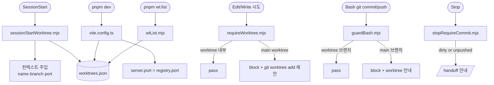

# 병렬 세션 Worktree 인프라 — PRD

> **Discussion**: 2026-04-21 대화 ⑪ 🟢 (main/worktree 혼재·merge 충돌·커밋 책임 공백 해소)
> **산출물 유형**: 스킬·훅 + 설정
> **규모 추정**: 신규 6, 수정 3, 재사용 3

## §0 요구사항 (from discuss)

- **⑪ 해결**: 항상 worktree + main push·commit 물리 차단 + 레지스트리 기반 포트·세션 가시성 + 종료 시 handoff 강제
- **⑦ 제약**: 기존 `.claude/hooks/` 인프라 유지, Claude Code v2.1.50 내장 `EnterWorktree` 활용, registry 로컬 전용
- **⑧ 보유 자산**: `guardBash.mjs`, `activeSessions.sh`, `.claude/agent-ops/`, handoff 스킬, using-git-worktrees 스킬, `.gitignore`에 `.claude/worktrees/` 이미 포함
- **기각 대안**: 해시 오프셋(가시성 0), devcontainer(오버헤드)
- **외부 레퍼런스**: Conductor, Claude Squad, Crystal — "always worktree, never main" de facto (2026)

## §1 책임 분해

FE 책임 맵 비해당(infra 영역) → `.claude/` 구조로 매핑.

| # | 책임 | 파일 경로 | 레이어 | 기존/신규 | 의존 |
|---|------|----------|-------|----------|------|
| 1 | 레지스트리 스키마·R/W·stale 청소 | `.claude/hooks/worktreeRegistry.mjs` | infra/hook-util | 신규 | — |
| 2 | 포트 연번 할당 (min free ≥ 5173) | `.claude/hooks/allocWorktreePort.mjs` | infra/hook-util | 신규 | 1 |
| 3 | main branch commit/push 차단 | `.claude/hooks/guardBash.mjs` | infra/hook | 확장 | — |
| 4 | 첫 Edit/Write 시 main worktree 차단 + 명령 제안 | `.claude/hooks/requireWorktree.mjs` | infra/hook | 신규 | 1 |
| 5 | SessionStart → worktree·포트 정보 주입 | `.claude/hooks/sessionStartWorktree.mjs` | infra/hook | 신규 | 1,2 |
| 6 | Stop → dirty/unpushed 시 /handoff 안내 | `.claude/hooks/stopRequireCommit.mjs` | infra/hook | 신규 | — |
| 7 | CLI 가시성 (registry 테이블 + stale 청소) | `scripts/wtList.mjs` | infra/script | 신규 | 1 |
| 8 | hook 4종 등록 + script 등록 | `.claude/settings.json`, `package.json` | infra/config | 수정 | 3,4,5,6,7 |
| 9 | vite dev 포트 registry 기반 자동 적용 | `vite.config.ts` | infra/config | 수정 | 1,2 |

### 탐색 증거

- `.claude/hooks/guardBash.mjs` 확인: BLOCKED 패턴 배열 구조 + `isMainBranch()` 유틸 이미 존재 → **확장 포인트 명확** (#3은 BLOCKED 배열에 추가만 하면 됨)
- `.gitignore` 확인: `.claude/worktrees/` 등재됨 → registry 경로는 `.claude/worktrees.json` (파일도 gitignore 규칙에 포함 시 패턴 조정 필요 → §5 W8에서 처리)
- `.claude/settings.json` hooks 섹션 확인: `PreToolUse`, `PostToolUse`, `Stop` 존재. `SessionStart` 신규 추가 필요
- `vite.config.ts` 확인: `server.port` 미지정 (Vite 기본 5173) → #9는 `server.port` 필드 주입만 하면 됨
- `scripts/activeSessions.sh` 존재 확인 → session_id 유틸로 재사용 (W1에서 import)
- handoff 스킬 존재 확인 → #6은 안내 메시지에서 `/handoff` 실행 유도만 함 (스킬 자체 재구현 금지)

### 검증

- 1파일 1책임 ✓ (각 hook 이벤트별 분리, registry/포트 유틸 분리)
- 의존 방향 ✓ (registry → 할당기 → 개별 hook, 역방향 없음)
- 재사용 명시 ✓ (#3 확장, #8·#9 수정)
- 신규 파일 경로는 `.claude/hooks/` / `scripts/` 기존 컨벤션과 일치

**완성도**: 🟢

## §2 Contract

### `.claude/hooks/worktreeRegistry.mjs`

```ts
export type WorktreeEntry = {
  name: string          // slug, e.g. "parallel-session"
  branch: string        // e.g. "feat/parallel-session"
  path: string          // absolute worktree path
  port: number          // allocated dev server port
  session_id: string | null
  dev_pid: number | null
  started_at: string    // ISO
}

export const REGISTRY_PATH: string  // `<repo>/.claude/worktrees.json`

/** @invariant 파일 없거나 JSON 파싱 실패 시 빈 배열 반환 (throw 금지) */
export function readRegistry(): WorktreeEntry[]

/** @invariant flock 없이 read→modify→write. 동시 쓰기는 마지막 writer 승리(1인 사용자 가정) */
export function writeRegistry(entries: WorktreeEntry[]): void

/** dev_pid 중 kill -0 실패한 항목의 dev_pid를 null로 리셋. worktree path가 사라진 항목은 제거 */
export function cleanStale(): WorktreeEntry[]

/** 현재 CWD가 속한 worktree entry. 없으면 null */
export function findCurrent(): WorktreeEntry | null

export function upsert(entry: WorktreeEntry): void
export function remove(name: string): void
```

### `.claude/hooks/allocWorktreePort.mjs`

```ts
/** @invariant 반환값은 registry에 아직 없는 최소 포트, 시작값 5173 */
export function allocPort(): number
```

### `.claude/hooks/requireWorktree.mjs`

```ts
// PreToolUse(Edit|Write) hook. stdin JSON 입력, stdout JSON 출력.
// 현재 CWD가 메인 worktree + 브랜치 main이면 block. 제안 메시지:
//   `git worktree add .claude/worktrees/<slug> -b feat/<slug>`
// slug는 tool_input.file_path에서 유추 (fallback: 타임스탬프)
// 이미 worktree이면 pass-through
```

### `.claude/hooks/sessionStartWorktree.mjs`

```ts
// SessionStart hook. stdout에 additional context (시스템 메시지) 주입:
//   "현재 worktree: <name> | branch: <branch> | dev port: <port>"
// registry에 없으면 메인 worktree로 간주하고 "worktree 밖(main). Edit 전에 생성 필요" 경고
// session_id를 registry 해당 entry에 upsert
```

### `.claude/hooks/stopRequireCommit.mjs`

```ts
// Stop hook. worktree 내부이고 dirty 또는 unpushed commit 있으면
// stdout에 "/handoff 로 종료하세요" 안내 (block 아님, 경고 수준)
// 메인 worktree는 scope 밖 (#3이 이미 commit/push 차단)
```

### `scripts/wtList.mjs`

```ts
// CLI entry. cleanStale() 후 readRegistry() 결과를 표로 출력:
//   NAME  BRANCH  PORT  PID  AGE
// 옵션: --json, --prune (stale entry 제거 후 write)
```

### `.claude/hooks/guardBash.mjs` (확장)

```ts
// BLOCKED 배열에 추가:
//   { pattern: /\bgit\s+commit\b/, reason: 'main 브랜치 commit 금지 — worktree에서 작업하세요', onlyMain: true, envOverride: 'ALLOW_MAIN' }
//   { pattern: /\bgit\s+push\b(?![^|]*--force)/, reason: 'main 브랜치 push 금지 — PR 경로만 허용', onlyMain: true, envOverride: 'ALLOW_MAIN' }
// envOverride 처리 로직 추가: process.env[envOverride] === '1'이면 skip
```

### `vite.config.ts` (수정)

```ts
import { findCurrent, readRegistry } from './.claude/hooks/worktreeRegistry.mjs'

const current = findCurrent()
const port = current?.port ?? 5173

export default defineConfig({
  server: { port, strictPort: true },
  // 기존 설정 유지
})
```

### `.claude/settings.json` (수정)

```json
{
  "hooks": {
    "PreToolUse": [
      { "matcher": "Edit|Write", "hooks": [{ "type": "command", "command": "node ${CLAUDE_PROJECT_DIR}/.claude/hooks/requireWorktree.mjs", "timeout": 2000 }] }
    ],
    "SessionStart": [
      { "hooks": [{ "type": "command", "command": "node ${CLAUDE_PROJECT_DIR}/.claude/hooks/sessionStartWorktree.mjs", "timeout": 2000 }] }
    ],
    "Stop": [
      { "hooks": [{ "type": "command", "command": "node ${CLAUDE_PROJECT_DIR}/.claude/hooks/stopRequireCommit.mjs", "timeout": 2000 }] }
    ]
  }
}
```

### `package.json` scripts

```json
{ "wt:list": "node scripts/wtList.mjs", "wt:prune": "node scripts/wtList.mjs --prune" }
```

**완성도**: 🟢

## §3 WHY

병렬 세션의 혼란은 3개 규율 공백에서 나온다: **진입(어디서 작업?)**, **종료(누가 커밋?)**, **관측(지금 어떤 상태?)**. 자율 판단에 맡기면 빠른 길(main)을 택하는 세션이 반드시 나온다(feedback_enforcement_multilayer). 따라서:

- **진입 규율** = PreToolUse hook + guardBash 확장으로 **물리 차단**
- **종료 규율** = Stop hook이 commit/push 누락을 경고하여 handoff로 유도
- **관측 규율** = 단일 registry 파일(JSON) + SessionStart 주입 + CLI 명령. Claude와 사용자가 같은 소스를 본다

책임을 6개 훅·유틸 + 2개 수정으로 쪼갠 이유: 각 hook event는 서로 다른 시점·context에서 호출되므로 파일을 합칠 수 없다. registry 유틸은 공통 의존이라 1파일로 응축.

## §4 HOW



## §5 WHAT (의존 순서)

### W1. worktreeRegistry.mjs (§1.1)

**의존**: —
**파일**: `.claude/hooks/worktreeRegistry.mjs`

```js
import { readFileSync, writeFileSync, existsSync } from 'fs'
import { execSync } from 'child_process'
import path from 'path'

const repoRoot = execSync('git rev-parse --show-toplevel', { encoding: 'utf8' }).trim()
export const REGISTRY_PATH = path.join(repoRoot, '.claude', 'worktrees.json')

export function readRegistry() {
  if (!existsSync(REGISTRY_PATH)) return []
  try { return JSON.parse(readFileSync(REGISTRY_PATH, 'utf8')) } catch { return [] }
}

export function writeRegistry(entries) {
  writeFileSync(REGISTRY_PATH, JSON.stringify(entries, null, 2))
}

export function cleanStale() {
  const entries = readRegistry()
  const alive = entries.filter((e) => existsSync(e.path)).map((e) => {
    if (e.dev_pid == null) return e
    try { process.kill(e.dev_pid, 0); return e } catch { return { ...e, dev_pid: null } }
  })
  writeRegistry(alive)
  return alive
}

export function findCurrent() {
  const cwd = process.cwd()
  const toplevel = (() => {
    try { return execSync('git rev-parse --show-toplevel', { encoding: 'utf8' }).trim() } catch { return cwd }
  })()
  return readRegistry().find((e) => path.resolve(e.path) === path.resolve(toplevel)) ?? null
}

export function upsert(entry) {
  const entries = readRegistry().filter((e) => e.name !== entry.name)
  entries.push(entry)
  writeRegistry(entries)
}

export function remove(name) {
  writeRegistry(readRegistry().filter((e) => e.name !== name))
}
```

**검증**: node -e "import('./.claude/hooks/worktreeRegistry.mjs').then(m=>console.log(m.readRegistry()))" → `[]`

### W2. allocWorktreePort.mjs (§1.2)

**의존**: W1
**파일**: `.claude/hooks/allocWorktreePort.mjs`

```js
import { readRegistry } from './worktreeRegistry.mjs'

export function allocPort() {
  const used = new Set(readRegistry().map((e) => e.port))
  let p = 5173
  while (used.has(p)) p++
  return p
}
```

**검증**: registry 비었을 때 5173, 5173 점유 시 5174.

### W3. guardBash.mjs 확장 (§1.3)

**의존**: — (기존 파일 확장)
**파일**: `.claude/hooks/guardBash.mjs`

기존 BLOCKED 배열 뒤에 추가, 상단 파싱 루프에 `envOverride` 처리를 넣는다.

```js
// BLOCKED 추가 항목
{ pattern: /\bgit\s+commit\b/, reason: 'main 브랜치 commit 금지 — worktree에서 작업 (git worktree add .claude/worktrees/<slug> -b feat/<slug>)', onlyMain: true, envOverride: 'ALLOW_MAIN' },
{ pattern: /\bgit\s+push\b/,   reason: 'main 브랜치 push 금지 — PR 경로만 허용',                                              onlyMain: true, envOverride: 'ALLOW_MAIN' },

// 루프 수정
for (const { pattern, reason, onlyMain, envOverride } of BLOCKED) {
  if (!pattern.test(cmd)) continue
  if (onlyMain && !isMainBranch()) continue
  if (envOverride && process.env[envOverride] === '1') continue
  process.stdout.write(JSON.stringify({ decision: 'block', reason }))
  process.exit(0)
}
```

**검증**: main에서 `git commit -m x` → block. `ALLOW_MAIN=1 git commit -m x` → pass. worktree 브랜치에서 `git commit` → pass.

### W4. requireWorktree.mjs (§1.4)

**의존**: W1
**파일**: `.claude/hooks/requireWorktree.mjs`

```js
#!/usr/bin/env node
import { readFileSync } from 'fs'
import { execSync } from 'child_process'
import { findCurrent } from './worktreeRegistry.mjs'

const input = JSON.parse(readFileSync('/dev/stdin', 'utf8'))
const filePath = input.tool_input?.file_path ?? ''

function isMainWorktree() {
  try {
    const gitDir = execSync('git rev-parse --git-dir', { encoding: 'utf8' }).trim()
    // worktree인 경우 .git/worktrees/<name>/... 또는 별도 gitdir 파일 → 길이·형태로 구분
    return !gitDir.includes('/worktrees/')
  } catch { return true }
}

function slugFromPath(p) {
  const base = p.split('/').filter(Boolean).slice(-2).join('-') || `wt-${Date.now()}`
  return base.replace(/[^a-zA-Z0-9-]/g, '-').toLowerCase().slice(0, 40)
}

if (findCurrent()) process.exit(0)
if (!isMainWorktree()) process.exit(0)

const slug = slugFromPath(filePath)
const reason = [
  'main worktree에서 직접 수정 금지. 병렬 세션 규약 위반.',
  '',
  '새 worktree 생성:',
  `  git worktree add .claude/worktrees/${slug} -b feat/${slug}`,
  `  cd .claude/worktrees/${slug}`,
  '',
  '또는 기존 worktree로 이동 후 다시 시도하세요. (pnpm wt:list)',
].join('\n')

process.stdout.write(JSON.stringify({ decision: 'block', reason }))
```

**검증**: main repo에서 Edit 호출 → block + 제안. worktree 내부에서 Edit → pass.

### W5. sessionStartWorktree.mjs (§1.5)

**의존**: W1, W2
**파일**: `.claude/hooks/sessionStartWorktree.mjs`

```js
#!/usr/bin/env node
import { readFileSync } from 'fs'
import { execSync } from 'child_process'
import { findCurrent, upsert, cleanStale } from './worktreeRegistry.mjs'
import { allocPort } from './allocWorktreePort.mjs'

const input = JSON.parse(readFileSync('/dev/stdin', 'utf8'))
const sessionId = input.session_id ?? null

cleanStale()
let entry = findCurrent()

const branch = (() => {
  try { return execSync('git rev-parse --abbrev-ref HEAD', { encoding: 'utf8' }).trim() } catch { return 'unknown' }
})()

if (!entry && branch !== 'main' && branch !== 'master') {
  // worktree지만 registry 미등록 → 자동 등록
  const toplevel = execSync('git rev-parse --show-toplevel', { encoding: 'utf8' }).trim()
  const name = toplevel.split('/').pop()
  entry = { name, branch, path: toplevel, port: allocPort(), session_id: sessionId, dev_pid: null, started_at: new Date().toISOString() }
  upsert(entry)
} else if (entry) {
  upsert({ ...entry, session_id: sessionId })
}

const msg = entry
  ? `worktree: ${entry.name} | branch: ${entry.branch} | dev port: ${entry.port}`
  : `worktree 밖(main 추정). Edit 시 hook이 worktree 생성을 요구합니다. pnpm wt:list로 현황 확인.`

process.stdout.write(JSON.stringify({ systemMessage: msg }))
```

**검증**: worktree 내부 세션 시작 → systemMessage에 name·branch·port. main 세션 → 경고.

### W6. stopRequireCommit.mjs (§1.6)

**의존**: —
**파일**: `.claude/hooks/stopRequireCommit.mjs`

```js
#!/usr/bin/env node
import { execSync } from 'child_process'
import { findCurrent } from './worktreeRegistry.mjs'

const entry = findCurrent()
if (!entry) process.exit(0)

const dirty = (() => {
  try { return execSync('git status --porcelain', { encoding: 'utf8' }).trim().length > 0 } catch { return false }
})()
const unpushed = (() => {
  try { return execSync(`git log @{u}..HEAD --oneline 2>/dev/null || git log HEAD --oneline --not --remotes`, { encoding: 'utf8' }).trim().length > 0 } catch { return false }
})()

if (!dirty && !unpushed) process.exit(0)

const reason = `worktree ${entry.name}에 미커밋(${dirty ? 'dirty' : 'clean'}) 또는 미푸시(${unpushed ? 'yes' : 'no'}) 상태. /handoff로 마무리하세요.`
process.stdout.write(JSON.stringify({ systemMessage: reason }))
```

**검증**: worktree에서 dirty 상태로 Stop → 경고. clean·pushed → 무음.

### W7. wtList.mjs (§1.7)

**의존**: W1
**파일**: `scripts/wtList.mjs`

```js
#!/usr/bin/env node
import { readRegistry, cleanStale, writeRegistry } from '../.claude/hooks/worktreeRegistry.mjs'

const args = new Set(process.argv.slice(2))
const entries = args.has('--prune') ? cleanStale() : readRegistry()

if (args.has('--json')) {
  console.log(JSON.stringify(entries, null, 2))
  process.exit(0)
}

if (entries.length === 0) { console.log('(no worktrees registered)'); process.exit(0) }

const pad = (s, n) => String(s).padEnd(n)
console.log(pad('NAME', 24) + pad('BRANCH', 28) + pad('PORT', 6) + pad('PID', 8) + 'AGE')
for (const e of entries) {
  const age = Math.round((Date.now() - new Date(e.started_at).getTime()) / 60000) + 'm'
  console.log(pad(e.name, 24) + pad(e.branch, 28) + pad(e.port, 6) + pad(e.dev_pid ?? '-', 8) + age)
}
```

**검증**: `pnpm wt:list` → 테이블. `pnpm wt:prune` → stale 제거.

### W8. settings.json · package.json · .gitignore (§1.8)

**의존**: W3, W4, W5, W6, W7
**파일**: `.claude/settings.json`, `package.json`, `.gitignore`

- `.claude/settings.json` PreToolUse에 `Edit|Write` matcher로 requireWorktree.mjs 추가. SessionStart 섹션 신설. Stop 섹션에 stopRequireCommit.mjs 추가.
- `package.json` scripts에 `"wt:list"`, `"wt:prune"` 추가.
- `.gitignore` 에 `.claude/worktrees.json` 추가 (기존 `.claude/worktrees/` 디렉토리 규칙은 파일에 적용 안 됨).

**검증**: `pnpm wt:list` 실행 성공, settings.json JSON lint 통과.

### W9. vite.config.ts (§1.9)

**의존**: W1, W2
**파일**: `vite.config.ts`

```ts
import { findCurrent } from './.claude/hooks/worktreeRegistry.mjs'

const current = findCurrent()
const port = current?.port ?? 5173

export default defineConfig({
  server: { port, strictPort: true },
  // ... 기존 설정
})
```

**검증**: worktree A에서 `pnpm dev` → 5174. worktree B → 5175. main → 5173.

## §6 원칙 감시자 결과

1. **CLAUDE.md 규약** ✓ — 파일명 = export 식별자, import type 준수, 레이어 무관(infra)
2. **memory feedback** ✓ — `feedback_enforcement_multilayer`(다층 물리 차단), `feedback_auto_derivation_is_system`(registry 자동 파생), `feedback_parallel_session_worktree`(주 규약)과 정합
3. **CATALOG.md** N/A — infra 영역
4. **Placeholder** 0건
5. **1파일 1책임** ✓ — registry R/W·할당·4 hook·script·설정 모두 분리

**전체 완성도**: 🟢
