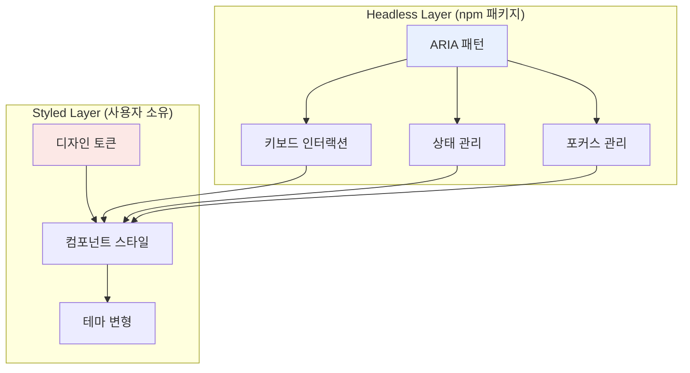
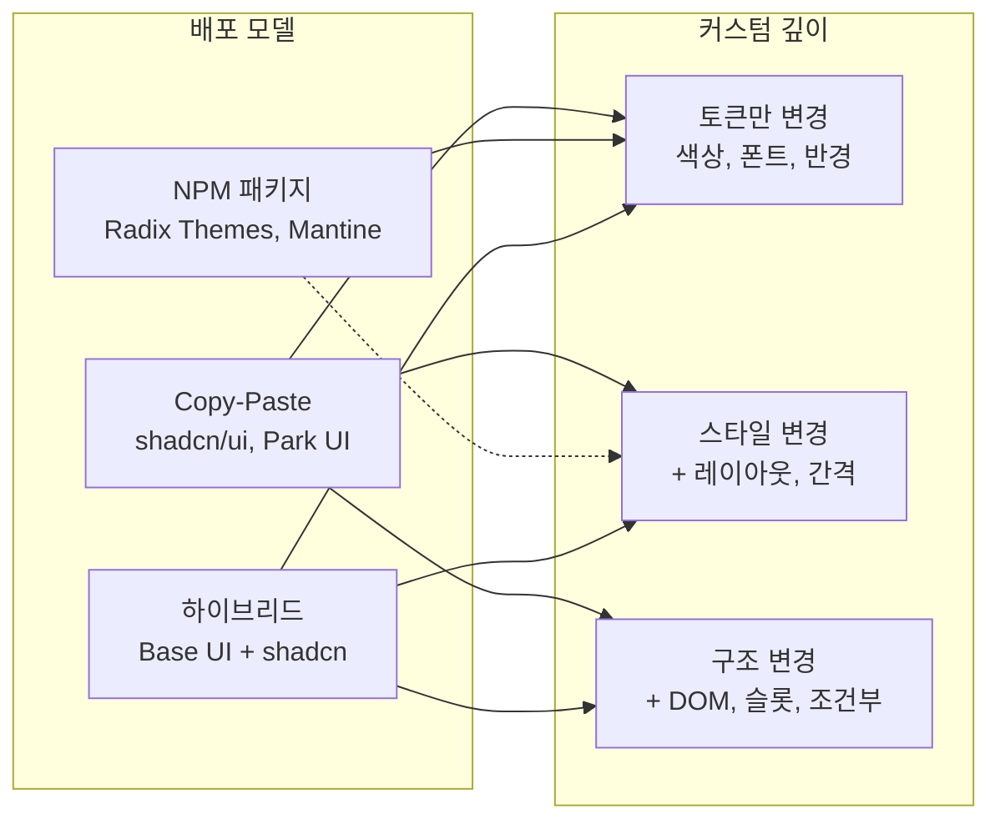
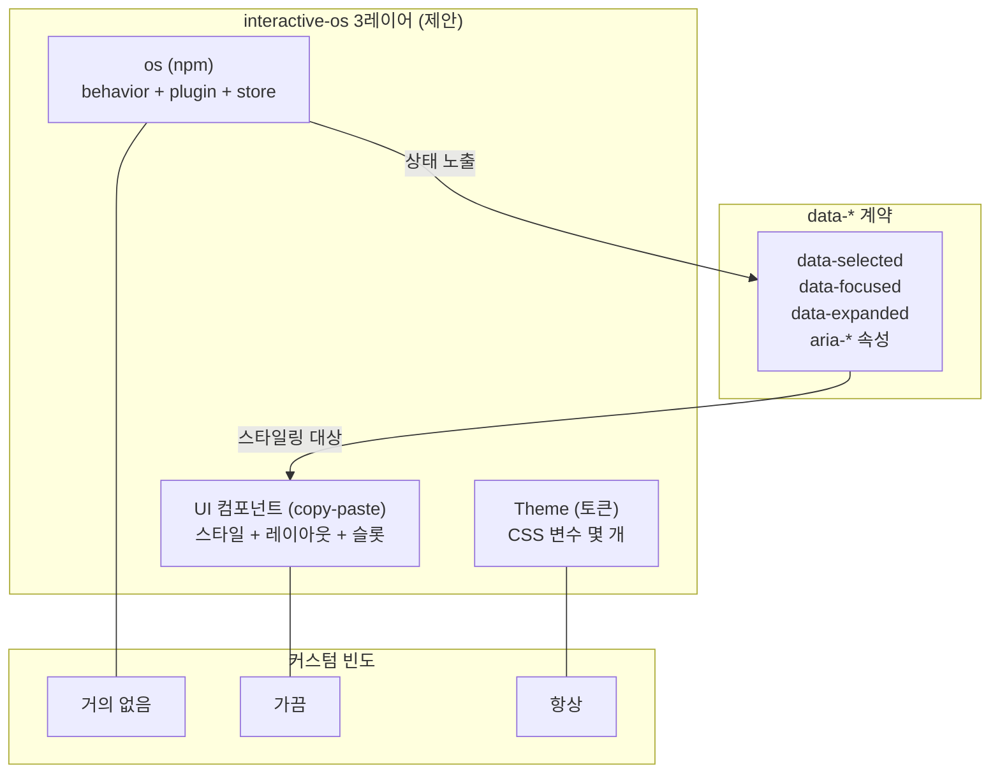

# Headless UI 위의 디자인 커스터마이제이션 패턴

> 작성일: 2026-03-22
> 맥락: interactive-os(headless) 위에 shadcn/ui 모델의 UI 레이어를 만들 때, 디자인 커스텀을 어떤 방식으로 제공할지 레퍼런스 조사

---

## Why — Headless와 Styled의 분리가 필요한 이유

모든 현대 UI 프레임워크는 **행동(behavior)**과 **외관(appearance)**을 분리하는 방향으로 수렴했다. 이유는 단순하다: 접근성, 키보드 인터랙션, 상태 관리는 보편적이지만, 디자인은 브랜드마다 다르기 때문이다.



이 분리를 실현하는 대표적 프로젝트 쌍:

| Headless (행동) | Styled (외관) | 배포 모델 |
|----------------|--------------|----------|
| Radix UI | shadcn/ui | copy-paste + CSS 변수 |
| Radix UI | Radix Themes | npm 패키지 + CSS 변수 |
| Ark UI (Zag.js) | Park UI | copy-paste + Panda CSS 토큰 |
| React Aria | (공식 styled 없음) | 직접 구축 |
| Kobalte (Solid) | Pigment / Solid UI | npm 또는 copy-paste |
| Base UI | shadcn/ui (2026~) | copy-paste + CSS 변수 |
| (자체) | Mantine | npm 패키지 + CSS Modules + 테마 객체 |

---

## How — 커스터마이제이션 메커니즘 5가지

조사 결과, headless UI 위에 디자인 커스텀을 제공하는 방식은 크게 5가지로 분류된다.

### 1. CSS 변수 기반 테마 토큰 (shadcn/ui, Radix Themes)

**구조:** 3계층 토큰 시스템

```css
/* Primitive — 원시 값 */
--blue-600: oklch(0.55 0.2 260);

/* Semantic — 의미 매핑 */
--color-primary: var(--blue-600);
--color-background: oklch(1 0 0);
--color-foreground: oklch(0.15 0 0);

/* Component — 컴포넌트별 (선택) */
--button-bg: var(--color-primary);
```

**테마 전환:** CSS 선택자로 primitive 값만 재정의

```css
:root { --background: 0 0% 100%; --foreground: 0 0% 3.6%; }
.dark { --background: 0 0% 3.6%; --foreground: 0 0% 98%; }
```

**장점:**
- 런타임 비용 0 — 브라우저가 CSS 변수를 자동 재계산
- 토큰 몇 개만 바꾸면 전체 테마 전환
- JS 프레임워크에 독립적

**단점:**
- 토큰 네이밍 컨벤션이 프로젝트마다 달라지면 호환성 깨짐
- 깊은 구조 변경(레이아웃, 슬롯 순서)은 불가

**shadcn/ui 구현 디테일:**
- `components.json`에 프로젝트 설정 (경로, Tailwind 버전, CSS 변수 사용 여부)
- `globals.css`에 `:root`/`.dark`로 토큰 정의
- Tailwind v4: `@theme inline` 블록으로 토큰→유틸리티 매핑
- OKLCH 색공간으로 지각적 균일성 확보

### 2. Copy-Paste 소스 소유 (shadcn/ui, Park UI, Solid UI)

**구조:** CLI로 컴포넌트 소스를 프로젝트에 복사

```bash
npx shadcn add button
# → src/components/ui/button.tsx 생성
```

**장점:**
- 완전한 소유권 — 구조, 스타일, 로직 모두 수정 가능
- 번들에 사용하는 것만 포함
- npm 의존성 잠금 없음

**단점:**
- 업스트림 버그 수정을 수동으로 반영해야 함
- 프로젝트마다 컴포넌트가 분기(drift)
- CLI 도구 자체의 유지보수 비용

**shadcn/ui CLI 동작:**
1. 레지스트리에서 컴포넌트 메타 + 소스 가져옴
2. `components.json`의 경로 설정에 따라 파일 배치
3. 필요한 npm 의존성(headless 라이브러리)은 자동 설치
4. CSS 변수가 포함된 경우 `globals.css`에 주입
5. `--dry-run`으로 미리보기, diff 확인 가능

### 3. data-* 속성 기반 상태 스타일링 (React Aria, Ark UI, Base UI)

**구조:** 컴포넌트가 상태를 `data-*` 속성으로 DOM에 노출

```html
<!-- React Aria -->
<div class="react-aria-ListBoxItem"
     data-selected data-focused data-hovered>

<!-- Ark UI -->
<div data-scope="accordion" data-part="item" data-state="open">
```

**스타일링:**

```css
/* Vanilla CSS */
.react-aria-ListBoxItem[data-selected] { background: var(--color-primary); }

/* Tailwind */
<ListBoxItem className="data-[selected]:bg-blue-500" />

/* React Aria Tailwind 플러그인 */
<ListBoxItem className="selected:bg-blue-500" />
```

**장점:**
- CSS-only로 모든 상태 스타일링 가능
- JS 프레임워크 스타일링 방식에 독립적
- 마우스/터치/키보드 모달리티 일관성

**단점:**
- data-* 속성 이름이 라이브러리마다 다름
- 커스텀 상태 추가 시 headless 레이어 수정 필요

### 4. Render Props / Slot API (React Aria, Base UI)

**구조:** 컴포넌트 내부 요소를 교체하거나 상태 기반 동적 스타일링

```jsx
// React Aria — className을 함수로
<ListBoxItem className={({isSelected}) =>
  isSelected ? 'bg-blue-500 text-white' : 'bg-white'
}>

// React Aria — children을 함수로
<ListBoxItem>
  {({isSelected}) => (
    <>
      {isSelected && <CheckIcon />}
      <span>Item</span>
    </>
  )}
</ListBoxItem>

// Base UI — slot으로 내부 요소 교체
<NumberField slots={{ incrementButton: MyCustomButton }} />
```

**장점:**
- 구조(DOM)까지 커스텀 가능
- 상태에 따른 조건부 렌더링
- 타입 안전한 상태 접근

**단점:**
- API 복잡도 증가
- render prop 패턴이 JSX를 장황하게 만듦

### 5. 테마 객체 + CSS Modules (Mantine)

**구조:** JS 테마 객체 → CSS 변수 자동 생성

```tsx
const theme = createTheme({
  primaryColor: 'blue',
  fontFamily: 'Inter',
  radius: { default: 'md' },
  components: {
    Button: { defaultProps: { size: 'md' } }
  }
});

<MantineProvider theme={theme}>
  <App />
</MantineProvider>
```

**장점:**
- 타입 안전한 테마 설정
- 컴포넌트 기본 props까지 테마에서 제어
- CSS 변수로 자동 변환 (`--mantine-*`)

**단점:**
- npm 패키지 의존 — 소스 소유가 아님
- 컴포넌트 내부 구조 변경 어려움
- 특정 프레임워크(React)에 묶임

---

## What — 프로젝트별 구체적 구현



### shadcn/ui (Radix + Tailwind)

| 항목 | 내용 |
|------|------|
| Headless | Radix UI (2026~: Base UI도 지원) |
| 배포 | CLI copy-paste (`npx shadcn add`) |
| 토큰 | CSS 변수, OKLCH, background/foreground 컨벤션 |
| 테마 전환 | `:root` / `.dark` CSS 변수 재정의 |
| 컴포넌트 수 | 50+ |
| 커스텀 범위 | 무제한 (소스 소유) |
| 설정 파일 | `components.json` |

### Park UI (Ark UI + Panda CSS)

| 항목 | 내용 |
|------|------|
| Headless | Ark UI (Zag.js 기반, React/Vue/Solid/Svelte) |
| 배포 | CLI copy-paste |
| 토큰 | Panda CSS semantic tokens, `@park-ui/panda-preset` |
| 테마 전환 | accent color + gray color + border radii 프리셋 |
| 컴포넌트 수 | 45+ |
| 커스텀 범위 | 무제한 (소스 소유) |
| 멀티 프레임워크 | React, Solid, Vue, Svelte |

### Radix Themes (Radix UI + 자체 디자인)

| 항목 | 내용 |
|------|------|
| Headless | Radix UI |
| 배포 | npm 패키지 |
| 토큰 | CSS 변수, 12-scale 색상 시스템 |
| 테마 전환 | `<Theme>` 컴포넌트 props (accent, gray, radius, scaling) |
| 커스텀 범위 | 토큰 수준 (구조 변경 제한적) |
| 특징 | "Day 1부터 프로페셔널한 디자인" 지향 |

### React Aria Components (Adobe)

| 항목 | 내용 |
|------|------|
| Headless | React Aria hooks |
| 배포 | npm 패키지 (unstyled) |
| 토큰 | 자체 CSS 변수 (`--trigger-width` 등 레이아웃용) |
| 스타일링 | data-* 속성 + render props + Tailwind 플러그인 |
| 커스텀 범위 | 구조까지 (render props로 DOM 제어) |
| 특징 | 공식 styled 레이어 없음 — 직접 구축 |

### Mantine

| 항목 | 내용 |
|------|------|
| Headless | 자체 (headless 분리 없음) |
| 배포 | npm 패키지 |
| 토큰 | JS 테마 객체 → `--mantine-*` CSS 변수 |
| 테마 전환 | `createTheme()` + `MantineProvider` |
| 커스텀 범위 | 토큰 + 컴포넌트 기본 props + CSS Modules |
| 특징 | 가장 "batteries included" — 100+ 컴포넌트 |

---

## If — interactive-os에 대한 시사점

### 1. 배포 모델: Copy-Paste가 맞다

interactive-os의 철학 = "모델은 공유, 렌더러는 독립". 이건 shadcn/ui 모델과 정확히 일치한다:
- **os = npm 패키지** (Radix 포지션) — 건드리면 안 됨
- **UI = copy-paste** (shadcn/ui 포지션) — 사용자가 소유
- **테마 = 토큰** — 대부분 여기만 변경

### 2. 토큰 설계: 3계층이 실전 표준

모든 성공적 테마 시스템이 primitive → semantic → component 3계층을 쓴다. interactive-os UI 레이어도 이 구조를 따라야 한다.

### 3. 상태 노출: data-* 속성이 핵심 인터페이스

React Aria, Ark UI, Base UI 모두 `data-*` 속성으로 컴포넌트 상태를 DOM에 노출한다. 이게 headless → styled 레이어의 **계약(contract)**이다. interactive-os가 이미 ARIA 속성을 DOM에 노출하고 있으므로, 이를 스타일링 계약으로 활용할 수 있는지 검증이 필요하다.

### 4. 멀티 프레임워크: 지금은 React, 나중을 위해 모델 분리

Ark UI(Zag.js)와 Park UI가 보여주는 패턴 — 상태 머신을 프레임워크 독립으로 만들고, React/Vue/Solid/Svelte 바인딩을 별도 제공. interactive-os의 "렌더러 독립 모델" 비전과 일치.

### 5. CLI: shadcn CLI 구조 참고

`components.json` (프로젝트 설정) + 레지스트리 (컴포넌트 메타/소스) + PostCSS 파이프라인 (토큰 주입). 이 구조가 copy-paste 모델의 실전 표준.



---

## Insights

- **shadcn/ui의 진짜 혁신은 copy-paste가 아니라 "레지스트리"**: 컴포넌트 메타데이터 + 의존성 그래프를 중앙에서 관리하고 CLI가 로컬에 정확히 배치하는 시스템. 소스를 복사하는 건 결과일 뿐, 레지스트리가 핵심 인프라다.

- **토큰 깊이의 역설**: 토큰 계층이 깊을수록(primitive → semantic → component → variant) 유연하지만, 디버깅이 어려워진다. 실전에서는 2계층(semantic + component)이 최적이라는 의견이 다수. 3계층의 primitive는 테마 빌더 도구에서만 노출하고, 일반 사용자는 semantic부터 시작하는 게 낫다.

- **Base UI + shadcn/ui 합류 (2026)**: shadcn/ui가 Radix UI뿐 아니라 Base UI도 headless 레이어로 지원하기 시작. 이는 "styled 레이어가 headless를 선택할 수 있다"는 모델의 실증. interactive-os도 이 포지션을 노릴 수 있다.

- **data-* vs ARIA 속성 이중 역할**: `aria-selected`, `aria-expanded` 같은 ARIA 속성은 접근성 용도이면서 동시에 CSS 선택자로 쓸 수 있다 (`[aria-selected="true"]`). React Aria는 이에 더해 `data-selected` 같은 data 속성도 별도 노출. interactive-os가 ARIA 속성을 이미 관리하므로, 추가 data 속성 없이 ARIA만으로 스타일링 계약을 만들 수 있을지가 검증 포인트.

- **Panda CSS의 슬롯 레시피 패턴**: Ark UI/Park UI에서 쓰는 `defineSlotRecipe`는 컴포넌트의 각 파트(trigger, content, item...)를 anatomy로 정의하고 슬롯별로 스타일을 지정. 이건 interactive-os의 Aria.Item 구조와 대응될 수 있다.

---

## Sources

| # | 출처 | 유형 | 핵심 내용 |
|---|------|------|----------|
| 1 | [shadcn/ui Theming](https://ui.shadcn.com/docs/theming) | 공식 문서 | CSS 변수 기반 테마, background/foreground 컨벤션 |
| 2 | [shadcn/ui CSS Variable Management (DeepWiki)](https://deepwiki.com/shadcn-ui/ui/4.6-css-variable-and-theme-management) | 분석 문서 | PostCSS 파이프라인, Tailwind v3/v4 전략, OKLCH |
| 3 | [shadcn/ui CLI](https://ui.shadcn.com/docs/cli) | 공식 문서 | `npx shadcn add` 동작, components.json, 레지스트리 |
| 4 | [React Aria Styling](https://react-aria.adobe.com/styling) | 공식 문서 | data-* 속성, render props, Tailwind 플러그인 |
| 5 | [Ark UI Styling](https://ark-ui.com/docs/guides/styling) | 공식 문서 | data-scope/data-part, 4가지 스타일링 방식 |
| 6 | [Park UI Customize](https://park-ui.com/docs/theme/customize) | 공식 문서 | semantic tokens, accent/gray 프리셋 |
| 7 | [Radix vs shadcn-ui (WorkOS)](https://workos.com/blog/what-is-the-difference-between-radix-and-shadcn-ui) | 블로그 | Radix Themes vs shadcn/ui 아키텍처 비교 |
| 8 | [CSS Variables Guide (FrontendTools)](https://www.frontendtools.tech/blog/css-variables-guide-design-tokens-theming-2025) | 가이드 | 3계층 토큰, 네이밍 컨벤션, 테마 전환 메커니즘 |
| 9 | [Copy vs Install (DEV)](https://dev.to/bitdev_/sharing-ui-components-copy-vs-install-4mii) | 블로그 | copy-paste vs npm 패키지 장단점 비교 |
| 10 | [Mantine Theme Object](https://mantine.dev/theming/theme-object/) | 공식 문서 | JS 테마 객체, --mantine-* CSS 변수, CSS Modules |
| 11 | [Base UI v1 (InfoQ)](https://www.infoq.com/news/2026/02/baseui-v1-accessible/) | 뉴스 | Base UI 1.0 출시, shadcn/ui 공식 지원 |
| 12 | [Pigment (Kobalte)](https://pigment.kobalte.dev/docs/core/overview/introduction) | 공식 문서 | Solid 생태계의 headless→styled 레이어 |
| 13 | [React UI Libraries 2026 (Makers Den)](https://makersden.io/blog/react-ui-libs-2025-comparing-shadcn-radix-mantine-mui-chakra) | 비교 분석 | 2025-2026 UI 라이브러리 트렌드 |
