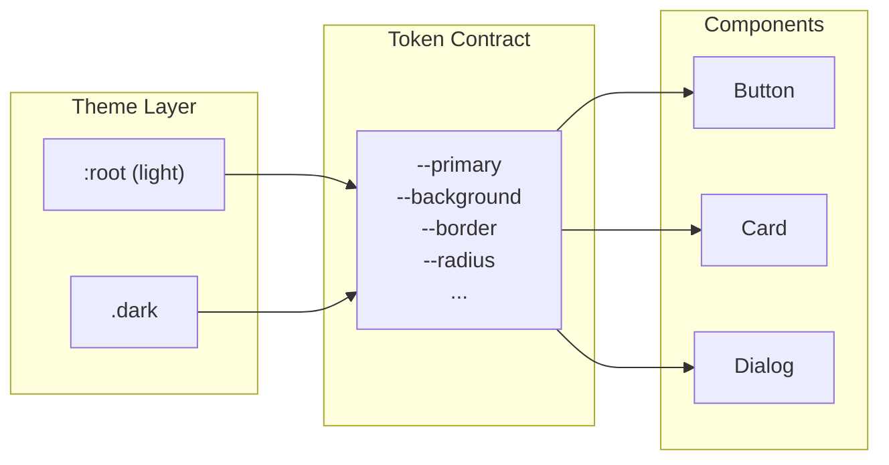
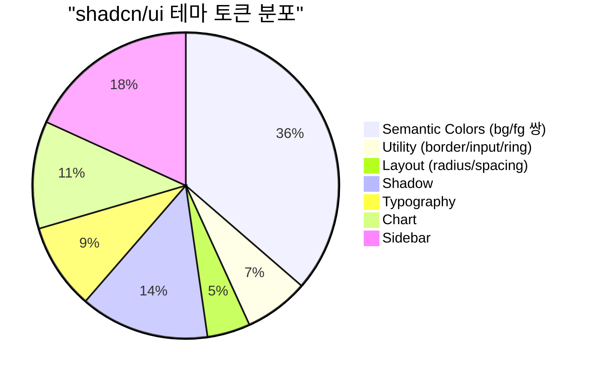

# shadcn/ui Theme Tokens — 테마 커스터마이징 가능한 CSS 변수 전체 목록

> 작성일: 2026-03-22
> 맥락: interactive-os UI 컴포넌트의 surface 기반 minimal design 전략에서, shadcn/ui가 노출하는 테마 토큰의 범위를 확정하기 위해 조사

---

## Why — 왜 CSS 변수 기반 테마인가

shadcn/ui는 Tailwind CSS 위에서 **CSS custom properties(변수)** 로 테마를 정의한다. 컴포넌트 코드는 변수만 참조하고, 테마 전환은 변수 값만 교체한다. 이 구조 덕분에:

- 컴포넌트 코드를 수정하지 않고 테마 변경 가능
- light/dark 전환 = `:root` vs `.dark` 블록의 변수 값 교체
- 새 테마 추가 = 변수 세트 하나 추가



---

## How — 변수 구조와 컨벤션

### bg/fg 쌍 규칙

shadcn/ui의 색상 변수는 **background + foreground 쌍**으로 구성된다:

```css
--primary: oklch(0.205 0 0);            /* 배경으로 사용 */
--primary-foreground: oklch(0.985 0 0);  /* 그 위의 텍스트 색 */
```

이 컨벤션이 모든 semantic color에 반복된다. 컴포넌트는 `bg-primary text-primary-foreground`처럼 쌍으로 사용.

### 색상 포맷: OKLCH

최신 shadcn/ui(Tailwind v4)는 **OKLCH** 색공간을 사용한다:
- `oklch(lightness chroma hue)` — 인간 지각 기반, 일관된 밝기 대비
- 무채색은 chroma=0, hue=0 (예: `oklch(0.97 0 0)`)

---

## What — 전체 토큰 목록

### 1. Semantic Color Tokens (테마 핵심)

| 변수 | 용도 | light 기본값 |
|------|------|-------------|
| `--background` | 페이지 배경 | `oklch(1 0 0)` |
| `--foreground` | 기본 텍스트 | `oklch(0.145 0 0)` |
| `--card` | 카드 배경 | `oklch(1 0 0)` |
| `--card-foreground` | 카드 텍스트 | `oklch(0.145 0 0)` |
| `--popover` | 팝오버 배경 | `oklch(1 0 0)` |
| `--popover-foreground` | 팝오버 텍스트 | `oklch(0.145 0 0)` |
| `--primary` | 주요 액션/강조 | `oklch(0.205 0 0)` |
| `--primary-foreground` | primary 위 텍스트 | `oklch(0.985 0 0)` |
| `--secondary` | 보조 액션 | `oklch(0.97 0 0)` |
| `--secondary-foreground` | secondary 위 텍스트 | `oklch(0.205 0 0)` |
| `--muted` | 비활성/약한 배경 | `oklch(0.97 0 0)` |
| `--muted-foreground` | 비활성 텍스트 | `oklch(0.556 0 0)` |
| `--accent` | 하이라이트/호버 | `oklch(0.97 0 0)` |
| `--accent-foreground` | accent 위 텍스트 | `oklch(0.205 0 0)` |
| `--destructive` | 위험/삭제 | `oklch(0.577 0.245 27.325)` |
| `--destructive-foreground` | destructive 위 텍스트 | `oklch(0.985 0 0)` |

### 2. Utility Tokens

| 변수 | 용도 | light 기본값 |
|------|------|-------------|
| `--border` | 기본 테두리 색 | `oklch(0.922 0 0)` |
| `--input` | 입력 필드 테두리 | `oklch(0.922 0 0)` |
| `--ring` | 포커스 링 색 | `oklch(0.708 0 0)` |

### 3. Layout Tokens

| 변수 | 용도 | 기본값 |
|------|------|--------|
| `--radius` | 기본 border-radius | `0.625rem` |
| `--spacing` | 기본 spacing 단위 | (Tailwind 기본) |

### 4. Shadow Tokens (tweakcn 확장)

| 변수 | 용도 |
|------|------|
| `--shadow-color` | 그림자 색상 |
| `--shadow-opacity` | 그림자 투명도 |
| `--shadow-blur` | 블러 반경 |
| `--shadow-spread` | 확산 반경 |
| `--shadow-offset-x` | 수평 오프셋 |
| `--shadow-offset-y` | 수직 오프셋 |

### 5. Typography Tokens

| 변수 | 용도 |
|------|------|
| `--font-sans` | 본문 폰트 |
| `--font-serif` | 세리프 폰트 |
| `--font-mono` | 고정폭 폰트 |
| `--letter-spacing` | 자간 |

### 6. Chart Tokens

| 변수 | 용도 |
|------|------|
| `--chart-1` ~ `--chart-5` | 데이터 시각화 색상 5개 |

### 7. Sidebar Tokens (앱 구조용)

| 변수 | 용도 |
|------|------|
| `--sidebar` / `--sidebar-foreground` | 사이드바 배경/텍스트 |
| `--sidebar-primary` / `--sidebar-primary-foreground` | 사이드바 주요 색 |
| `--sidebar-accent` / `--sidebar-accent-foreground` | 사이드바 강조 색 |
| `--sidebar-border` | 사이드바 테두리 |
| `--sidebar-ring` | 사이드바 포커스 링 |

---

### 토큰 수 요약



| 카테고리 | 변수 수 | 테마 간 변경 | 비고 |
|---------|--------|------------|------|
| Semantic Colors | 16 (8쌍) | light↔dark 전환 시 값 변경 | **핵심** |
| Utility | 3 | light↔dark 전환 시 값 변경 | border, input, ring |
| Layout | 2 | 보통 테마 간 동일 | radius, spacing |
| Shadow | 6 | 테마 간 변경 가능 | tweakcn 확장 |
| Typography | 4 | 보통 테마 간 동일 | 폰트, 자간 |
| Chart | 5 | light↔dark 전환 시 값 변경 | 시각화 전용 |
| Sidebar | 8 (4쌍) | light↔dark 전환 시 값 변경 | 앱 구조용 |
| **총합** | **44** | | |

---

## If — interactive-os에 대한 시사점

### 핵심: "테마에서 바뀌는 것"만 토큰으로 노출

shadcn/ui의 44개 변수 중 **테마 전환 시 실제로 값이 바뀌는 것**:

| 바뀌는 것 | 수량 | 비고 |
|----------|------|------|
| Semantic Colors | 16 | **필수** — 이것만으로 테마가 성립 |
| Utility (border/input/ring) | 3 | 색상과 동일 카테고리 |
| Chart | 5 | 시각화 필요 시 |
| Sidebar | 8 | 앱 구조에 사이드바 있으면 |
| **소계** | **32** | |

| 안 바뀌는 것 | 수량 | 비고 |
|-------------|------|------|
| radius | 1 | 테마 간 공유 (앱의 개성) |
| spacing | 1 | 테마 간 공유 |
| Shadow | 6 | 테마별 가능하지만 보통 고정 |
| Typography | 4 | 테마 간 공유 |

### surface 전략과의 매핑

surface 모델에서 필요한 토큰을 shadcn 기준으로 매핑하면:

| surface | shadcn 대응 | 비고 |
|---------|------------|------|
| base | `--background` / `--foreground` | 기본 |
| sunken | `--muted` / `--muted-foreground` | 한 단계 깊음 |
| elevated | `--card` / `--card-foreground` | 떠 있음 |
| overlay | `--popover` / `--popover-foreground` | 최상위 |
| outlined | `--border` + base 배경 | 선으로만 구분 |

**결론: shadcn의 semantic color 8쌍(16개) + radius + border가 surface 모델의 완전한 토큰 세트가 될 수 있다.**

---

## Insights

- **bg/fg 쌍 규칙이 핵심 발명**: 색상을 개별 지정하는 대신 "이 표면 위의 텍스트는 자동으로 이 색"이라는 계약. surface 모델과 자연스럽게 결합됨
- **실질적 테마 변경은 19개면 충분**: semantic 16 + border + input + ring. 나머지는 앱 개성(radius, font)이지 테마가 아님
- **OKLCH 채택**: 인간 지각 기반 색공간이라 "밝기만 바꾸면 dark theme" 같은 체계적 변환이 가능
- **sidebar 토큰은 과잉**: 대부분의 경우 메인 토큰과 동일하거나 muted 변형. interactive-os에서는 불필요할 가능성 높음

---

## Sources

| # | 출처 | 유형 | 핵심 내용 |
|---|------|------|----------|
| 1 | [Theming - shadcn/ui](https://ui.shadcn.com/docs/theming) | 공식 문서 | CSS 변수 전체 목록, bg/fg 컨벤션, OKLCH 포맷 |
| 2 | [tweakcn Theme Editor](https://tweakcn.com/) | 커뮤니티 도구 | shadow, typography 포함 확장 토큰 목록 |
| 3 | [shadcn/ui Themes](https://ui.shadcn.com/themes) | 공식 도구 | 프리셋 테마 8종(Blue, Green, Orange 등) |
| 4 | [Theming in shadcn UI - Medium](https://medium.com/@enayetflweb/theming-in-shadcn-ui-customizing-your-design-with-css-variables-bb6927d2d66b) | 블로그 | 커스텀 색상 추가 방법 |
