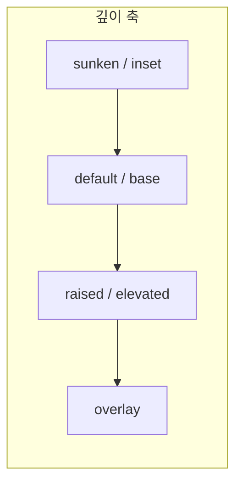
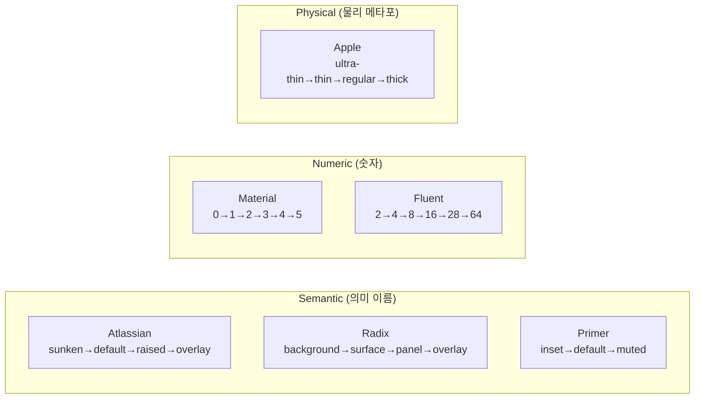

# Surface/Elevation 네이밍 체계 — 주요 디자인 시스템 비교

> 작성일: 2026-03-22
> 맥락: interactive-os의 surface level 이름을 업계 표준에 맞추기 위해, 주요 디자인 시스템의 네이밍 체계를 비교 조사

---

## Why — 왜 이름이 중요한가

surface level은 컴포넌트의 시각적 깊이를 결정하는 유일한 축이다. 이름이 직관적이지 않으면:
- 소비자가 매번 문서를 참조해야 함 (숫자 0~4는 의미를 담지 않음)
- 팀 간 소통에서 "surface-3이 뭐였지?" 같은 마찰 발생
- 새 레벨 추가 시 기존 숫자 체계가 깨질 위험

업계 주요 디자인 시스템들은 이 문제를 각기 다른 방식으로 해결하고 있다.

---

## How — 두 가지 네이밍 전략

### 전략 1: 의미 이름 (Semantic)

레벨 이름이 용도를 설명한다: `sunken`, `raised`, `overlay` 등.

**장점:** 자기 설명적, 코드 가독성 높음, 용례가 이름에 내장
**단점:** 레벨 수가 늘어나면 이름 짓기 어려움

**채택:** Atlassian, Radix Themes, Apple HIG

### 전략 2: 숫자 스케일 (Numeric)

레벨을 숫자로 표현: `elevation-0`, `shadow-8`, `level-2` 등.

**장점:** 확장 용이, 순서가 명확
**단점:** 의미 불투명, "elevation-3이 카드인지 모달인지" 외워야 함

**채택:** Material Design (elevation 0~5), Fluent 2 (shadow 2~64), USWDS (0~5)

---

## What — 시스템별 비교

### 1. Atlassian Design System

가장 정교한 semantic 네이밍. surface와 shadow를 쌍으로 묶는다.

| 레벨 | surface 토큰 | shadow 토큰 | 용례 |
|------|-------------|-------------|------|
| **sunken** | `elevation.surface.sunken` | — (shadow 없음) | 칸반 컬럼 배경, 인셋 영역 |
| **default** | `elevation.surface` | — (shadow 없음) | 페이지 기본, 평면 카드 |
| **raised** | `elevation.surface.raised` | `elevation.shadow.raised` | 이동 가능한 카드 (Jira, Trello) |
| **overlay** | `elevation.surface.overlay` | `elevation.shadow.overlay` | 모달, 드롭다운, 플로팅 툴바 |

**특징:**
- **4단계** — sunken, default, raised, overlay
- surface + shadow **쌍 매칭 필수** — "raised surface에는 반드시 raised shadow"
- hover/pressed 변형: `elevation.surface.raised.hovered`, `elevation.surface.raised.pressed`
- **규칙:** sunken은 default 위에서만 사용. raised/overlay 위에 sunken 금지.

### 2. Radix Themes

| 토큰 | 용례 |
|------|------|
| `--color-background` | 페이지 배경 |
| `--color-surface` | 폼 컴포넌트 배경 (input, checkbox, select) |
| `--color-panel-solid` | 카드, 테이블, 팝오버, 드롭다운 (불투명) |
| `--color-panel-translucent` | 위와 동일 (반투명, 기본값) |
| `--color-overlay` | 다이얼로그 뒤 배경 오버레이 |

**특징:**
- **4단계** — background, surface, panel, overlay
- panel에 solid/translucent 변형
- `surface`가 "폼 컴포넌트 전용"이라는 독특한 용법

### 3. Material Design 3

| 레벨 | dp 값 | 용례 |
|------|------|------|
| Level 0 | 0dp | 기본 |
| Level 1 | 1dp | 카드, 내비게이션 드로어 |
| Level 2 | 3dp | FAB, 버튼 |
| Level 3 | 6dp | 스낵바, FAB (pressed) |
| Level 4 | 8dp | 메뉴, 사이드 시트 |
| Level 5 | 12dp | 다이얼로그, 모달 |

**특징:**
- **6단계** 숫자 스케일 (0~5)
- M3에서는 shadow 대신 **surface tint** (색상 오버레이)로 깊이 표현
- surface container 변형: `surface`, `surface-container-lowest`, `surface-container-low`, `surface-container`, `surface-container-high`, `surface-container-highest`

### 4. Fluent 2 (Microsoft)

| 레벨 | shadow 값 | 용례 |
|------|----------|------|
| Shadow 2 | blur 2px | 카드 (경계선 없는) |
| Shadow 4 | blur 4px | 그리드 아이템, 리스트 |
| Shadow 8 | blur 8px | 플로팅 버튼, 앱 바 |
| Shadow 16 | blur 16px | hover 상태 카드 |
| Shadow 28 | blur 28px | 바텀 시트, 사이드 내비 |
| Shadow 64 | blur 64px | 다이얼로그, 패널 |

**특징:**
- **6단계** 숫자 스케일 (blur 값 기반)
- 숫자가 물리적 의미(blur px)를 담음

### 5. GitHub Primer

| 토큰 | 용례 |
|------|------|
| `bgColor-default` | 기본 배경 |
| `bgColor-muted` | 보조 배경, 대비 계산 기준 |
| `bgColor-inset` | 인셋/우물 영역 |

**특징:**
- **3단계** — default, muted, inset
- 의도적으로 최소화. overlay 레벨 없음 (별도 컴포넌트로 처리)

### 6. Apple HIG (Materials)

| 두께 | 용례 |
|------|------|
| ultra-thin | 최소 블러 |
| thin | 사이드바 |
| regular | 시트, 메뉴 |
| thick | 컨텍스트 강조 |
| ultra-thick | 최대 블러 |

**특징:**
- **5단계** — 물리적 두께 메타포 (thin~thick)
- 반투명 blur 기반, shadow가 아닌 "물질감"으로 깊이 표현
- 이 접근은 macOS/iOS 전용이라 웹에서 직접 채택하기 어려움

---

### 비교 요약

| 시스템 | 전략 | 단계 수 | surface+shadow 번들 | 이름 패턴 |
|--------|------|---------|-------------------|----------|
| **Atlassian** | semantic | **4** | **쌍 매칭** | sunken, default, raised, overlay |
| **Radix** | semantic | **4** | 개별 | background, surface, panel, overlay |
| **Material 3** | numeric | **6** | tint 기반 | level 0~5 |
| **Fluent 2** | numeric | **6** | 개별 | shadow 2~64 |
| **Primer** | semantic | **3** | 개별 | inset, default, muted |
| **Apple** | physical | **5** | 통합 | ultra-thin~ultra-thick |

---

## If — interactive-os에 대한 시사점

### 핵심 발견: Atlassian 모델이 가장 적합

interactive-os가 원하는 "surface 하나로 bg+border+shadow 번들"은 **Atlassian의 쌍 매칭 모델**과 정확히 일치한다:
- surface와 shadow를 같은 레벨 이름으로 묶음
- 4단계로 충분 (sunken, default, raised, overlay)
- hover/pressed 변형까지 체계화

### 이름 후보

현재 프로젝트의 `--surface-0~4`를 의미 이름으로 전환할 때:

| 현재 | Atlassian식 | Radix식 | 제안 |
|------|------------|---------|------|
| surface-0 | (해당 없음) | background | **base** |
| surface-1 | sunken | (해당 없음) | **sunken** |
| surface-2 | default | surface | **default** |
| surface-3 | raised | panel | **raised** |
| surface-4 | overlay | overlay | **overlay** |

- **base**: Atlassian에는 없지만, "페이지 배경"을 명시적으로 구분하는 것이 유용. Primer의 `default`와 비슷한 위치
- **sunken/raised/overlay**: Atlassian과 동일. 업계에서 가장 널리 사용되는 이름
- **outlined**: Atlassian/Radix 어디에도 별도 surface level로 존재하지 않음. border 처리는 surface level이 아닌 **스타일 변형**으로 다루는 것이 표준

### outlined에 대한 판단

조사 결과 어떤 시스템도 `outlined`를 독립 surface level로 정의하지 않는다. 대신:
- Atlassian: `default` surface + `border` 토큰 조합
- Radix: `panel` prop에 `variant="outline"` 같은 컴포넌트 수준 변형
- Material: `outlined` card는 elevation이 아닌 **card variant**

**결론:** outlined는 surface level이 아닌 컴포넌트 variant로 처리하는 것이 표준에 부합한다.

---

## Insights

- **4단계가 업계 합의점**: Atlassian(4), Radix(4), Primer(3). Material/Fluent의 6단계는 모바일 네이티브 맥락이라 웹에서는 과잉
- **"sunken"은 Atlassian이 확립한 용어**: 다른 시스템에서는 inset(Primer), muted(Primer) 등으로 부르지만, "sunken"이 가장 직관적으로 "아래로 들어간" 느낌을 전달
- **outlined는 surface가 아니다**: 모든 주요 시스템이 outlined를 elevation이 아닌 component variant로 분류. surface와 직교하는 별도 축
- **surface+shadow 쌍 매칭**: Atlassian만이 이걸 명시적 규칙으로 강제. 다른 시스템은 가이드라인으로만 권장. interactive-os의 `data-surface` 번들 접근이 이걸 CSS 레벨에서 강제하므로 더 강력
- **M3의 surface-container 세분화**: surface-container-lowest/low/medium/high/highest — 5단계 세분화는 토큰 폭발을 일으킴. interactive-os에서는 피해야 할 안티패턴

---

## Sources

| # | 출처 | 유형 | 핵심 내용 |
|---|------|------|----------|
| 1 | [Atlassian Elevation](https://atlassian.design/foundations/elevation/) | 공식 문서 | sunken→default→raised→overlay 4단계, surface+shadow 쌍 매칭 |
| 2 | [Radix Themes Color](https://www.radix-ui.com/themes/docs/theme/color) | 공식 문서 | background→surface→panel→overlay, panel solid/translucent 변형 |
| 3 | [Material Design 3 Elevation](https://m3.material.io/styles/elevation/tokens) | 공식 문서 | 6단계 숫자 스케일, surface tint 기반 |
| 4 | [Fluent 2 Elevation](https://fluent2.microsoft.design/elevation) | 공식 문서 | shadow 2~64 blur 기반 6단계 |
| 5 | [Primer Color Overview](https://primer.style/foundations/color/overview/) | 공식 문서 | bgColor-default/muted/inset 3단계 |
| 6 | [Apple HIG Materials](https://developer.apple.com/design/human-interface-guidelines/materials) | 공식 문서 | ultra-thin~ultra-thick 물리적 두께 메타포 |
| 7 | [Elevation Design Patterns](https://designsystems.surf/articles/depth-with-purpose-how-elevation-adds-realism-and-hierarchy) | 블로그 | 시스템 간 비교, semantic vs numeric 전략 분석 |
