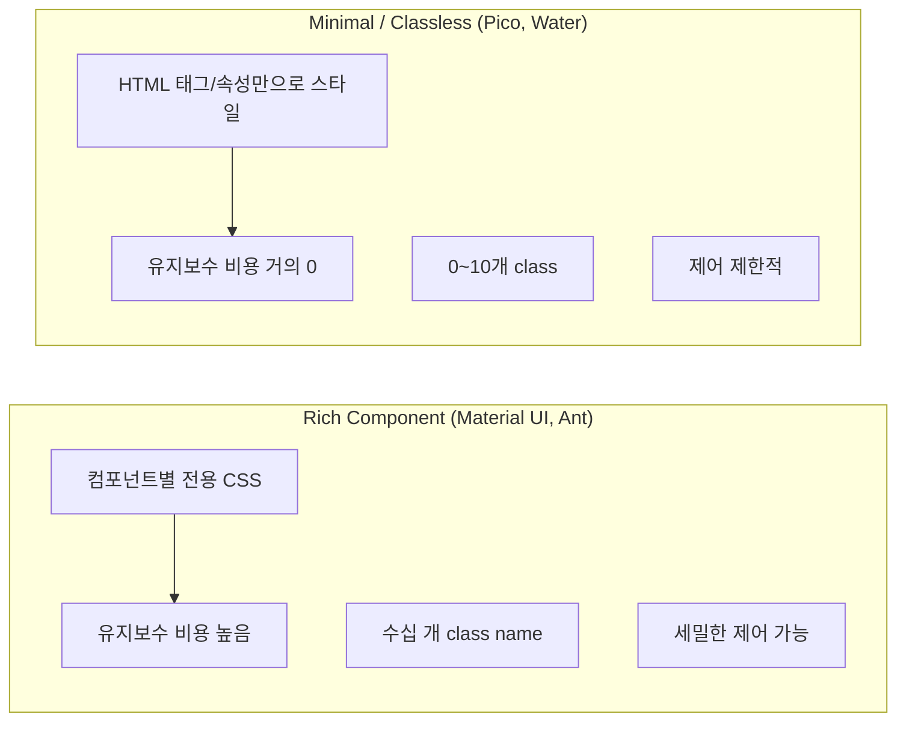

# Minimal CSS 접근법 — 최소한의 CSS로 기본 UI를 커버하는 방법론

> 작성일: 2026-03-22
> 맥락: interactive-os UI 컴포넌트의 base 디자인을 잡되, 22개 개별 CSS를 관리하지 않고 최소한의 공통 CSS로 전체를 커버하는 방법을 찾기 위해

---

## Why — 왜 minimal CSS인가

UI 컴포넌트 라이브러리의 스타일링에는 두 극단이 있다:



Rich 접근은 컴포넌트마다 `.btn-primary-lg-outlined` 같은 클래스를 만들어서 세밀하게 제어하지만, 22개 컴포넌트 × N개 변형 = 관리 불가. Minimal 접근은 이미 존재하는 시맨틱 정보(HTML 태그, ARIA 속성)를 CSS 셀렉터로 활용하여 추가 클래스 없이 스타일링한다.

---

## How — 세 가지 minimal 전략

### 전략 1: Classless CSS (HTML 태그 셀렉터)

Pico CSS, Water.css, Simple.css 등이 채택. HTML 태그 자체를 셀렉터로 사용한다.

```css
/* Pico CSS 접근 */
button { padding: 8px 16px; border-radius: 4px; }
input { border: 1px solid var(--border); }
nav > ul { display: flex; list-style: none; }
```

**장점:** 0 classes. HTML만 쓰면 스타일이 따라옴.
**한계:** `button`은 모든 button을 잡으므로, 용도별 구분이 어려움. `role` 기반 UI에는 맞지 않음.

### 전략 2: Data/ARIA Attribute 셀렉터

React Aria, Radix Primitives, Ariakit이 채택. 컴포넌트가 렌더링하는 ARIA/data 속성을 CSS 셀렉터로 사용한다.

```css
/* React Aria 접근 */
[data-hovered] { background: var(--hover); }
[data-focused] { outline: 2px solid var(--focus); }
[data-selected] { background: var(--selected); }
[data-pressed] { background: var(--pressed); }

/* Radix 접근 */
[data-state="open"] { border-bottom: 2px solid; }
[data-state="checked"] { background: var(--accent); }

/* ARIA 속성 직접 사용 */
[aria-selected="true"] { background: var(--selected); }
[aria-expanded="true"] > .chevron { transform: rotate(90deg); }
[role="tab"] { padding: 8px 16px; }
```

**장점:** 컴포넌트가 이미 접근성을 위해 렌더링하는 속성을 재사용. 추가 class 불필요. 상태 변환이 자동으로 시각에 반영.
**한계:** 속성이 없는 순수 시각 변형(size, variant)은 별도 메커니즘 필요.

### 전략 3: CSS Custom Properties 시스템 (Design Tokens)

Open Props가 대표. 클래스 대신 CSS 변수로 디자인 결정을 표현한다.

```css
/* Open Props 접근 — 변수가 시스템 */
:root {
  --size-1: 4px; --size-2: 8px; --size-3: 12px;
  --shadow-1: 0 1px 2px rgba(0,0,0,.1);
  --radius-2: 6px;
}

/* 소비자는 변수를 조합 */
.card {
  padding: var(--size-3);
  border-radius: var(--radius-2);
  box-shadow: var(--shadow-1);
}
```

**장점:** 테마 변경이 변수 교체만으로 완료. 일관성 강제.
**한계:** 변수 자체가 스타일을 적용하지는 않음. 셀렉터는 별도.

```mermaid
graph TD
    subgraph "Minimal CSS 전략 비교"
        C["Classless\n(태그 셀렉터)"]
        A["Attribute\n(ARIA/data 셀렉터)"]
        T["Tokens\n(CSS 변수)"]
    end
    C -->|"한계: role 기반 UI 불가"| X1["interactive-os에 부적합"]
    A -->|"이미 ARIA 렌더링"| Y1["interactive-os에 최적"]
    T -->|"이미 surface tokens"| Y2["interactive-os에 이미 채택"]
    A --- T
    style Y1 fill:#1A3A2A
    style Y2 fill:#1A3A2A
    style X1 fill:#3A1A1A
```



---

## What — 주요 사례 상세

### Pico CSS

- **크기:** ~10KB
- **클래스:** 10개 미만 (`.container`, `.grid` 정도)
- **커버리지:** 130+ CSS 변수로 테마. 20개 color theme. form, button, table, nav 자동 스타일링
- **dark mode:** `[data-theme="dark"]` 또는 `prefers-color-scheme`
- **셀렉터 전략:** 태그 (`button`, `input`, `table`) + 소수 class

### React Aria Components

- **클래스:** 컴포넌트별 기본 class (`react-aria-ListBoxItem`) + data attribute 상태
- **상태 속성:** `data-hovered`, `data-focused`, `data-selected`, `data-pressed`, `data-disabled`, `data-entering`, `data-exiting`
- **셀렉터 전략:** `.react-aria-Button[data-pressed]` 형태
- **특징:** render prop으로 `className` 함수 전달 가능 (`({isSelected}) => ...`)

### Radix Primitives

- **클래스:** `className` prop으로 자유 지정
- **상태 속성:** `data-state="open"`, `data-state="checked"`, `data-disabled`
- **셀렉터 전략:** `[data-state="open"]` 형태
- **특징:** unstyled primitives. 스타일 완전 위임. Radix Themes가 별도로 스타일 제공

### Open Props

- **크기:** 4KB (500+ props)
- **카테고리:** colors(228), gradients(30), shadows(11), sizes(15), animations, easing, typography, borders, aspect-ratios, z-index, masks
- **네이밍:** `--category-level` (예: `--gray-5`, `--size-3`, `--shadow-2`)
- **테마:** 낮은 숫자=밝은 값, 높은 숫자=어두운 값. adaptive alias로 `--text-1`이 테마에 따라 다른 값 참조

---

## If — interactive-os에 대한 시사점

### 현재 상태와의 매핑

interactive-os는 이미 **전략 2 + 전략 3의 혼합**을 사용하고 있다:

| 전략 | interactive-os 현황 | 상태 |
|------|-------------------|------|
| **ARIA 속성 셀렉터** | `components.css`에서 `[role="option"]`, `[aria-selected="true"]` 등 | 구조 있음, 값 부족 |
| **CSS 변수 시스템** | `tokens.css`에서 surface 6단계 + semantic color | 완성 |
| **Classless** | UI 컴포넌트가 className 안 씀 — `<Aria>` 래핑만 | 이미 달성 |

**결론: 구조는 이미 최적이다. 부족한 것은 `components.css`의 ARIA 셀렉터 값(padding, radius, height)뿐.**

### 구체적 적용 방향

#### 1. components.css = "Pico for ARIA"

Pico가 `button`, `input`을 자동 스타일링하듯, components.css가 `[role="option"]`, `[role="tab"]`을 자동 스타일링. 이미 이 구조이므로 **값만 개선**하면 된다.

#### 2. 상태 속성은 React Aria 패턴 차용

React Aria의 `data-hovered`, `data-focused`, `data-selected` 패턴과 interactive-os의 `[data-focused]`, `[aria-selected="true"]` 패턴이 거의 동일. 이미 올바른 방향.

#### 3. 토큰은 Open Props 수준으로 이미 완성

surface + semantic color + spacing + radius = Open Props의 핵심 카테고리와 일치. 추가 작업 불필요.

#### 4. 관리 단위

| 파일 | 역할 | 수정 빈도 |
|------|------|----------|
| `tokens.css` | 값(재료) — surface, color, spacing, radius | 테마 변경 시 |
| `components.css` | 규칙(문법) — ARIA 셀렉터로 공통 base | 디자인 시스템 변경 시 |
| `ui/*.module.css` | 예외(특수 레이아웃) — Kanban board, Slider track 등 | 해당 컴포넌트 변경 시 |

**22개 컴포넌트를 커버하는 데 필요한 CSS 파일: 사실상 1개 (`components.css`).** 나머지 9개 module.css는 레이아웃이 특수한 경우만.

---

## Insights

- **"Pico for ARIA"가 정확한 메타포**: Pico가 HTML 태그를 셀렉터로 쓰듯, interactive-os는 ARIA role/state를 셀렉터로 쓴다. 같은 철학, 다른 셀렉터 대상. 이 관점에서 components.css는 이미 classless framework
- **React Aria의 data-hovered는 overkill일 수 있다**: interactive-os는 `:hover` CSS pseudo-class를 직접 쓰고 있고, 이로 충분하다. data-hovered를 따로 관리할 이유가 없음
- **Open Props의 "적응형 alias" 패턴이 surface와 동일**: Open Props의 `--text-1`이 테마에 따라 다른 원색을 참조하는 것은 interactive-os의 `--surface-raised`가 dark/light에서 다른 zinc을 참조하는 것과 같은 패턴
- **Pico의 130개 CSS 변수 vs interactive-os의 ~30개**: Pico가 form까지 커버하기 때문에 변수가 많지만, interactive-os는 interactive component에 집중하므로 30개면 충분

---

## Sources

| # | 출처 | 유형 | 핵심 내용 |
|---|------|------|----------|
| 1 | [Pico CSS](https://picocss.com/) | 공식 사이트 | classless CSS framework, 10개 미만 class, 130+ CSS 변수 |
| 2 | [React Aria Styling](https://react-aria.adobe.com/styling) | 공식 문서 | data-hovered/focused/selected/pressed 속성 기반 스타일링 |
| 3 | [ARIA in CSS - CSS-Tricks](https://css-tricks.com/aria-in-css/) | 블로그 | ARIA 속성을 CSS 셀렉터로 사용하는 패턴과 근거 |
| 4 | [Open Props](https://open-props.style/) | 공식 사이트 | 500+ CSS custom properties, 4KB, adaptive theming |
| 5 | [Radix Primitives Styling](https://www.radix-ui.com/primitives/docs/guides/styling) | 공식 문서 | data-state 속성 기반 스타일링, unstyled primitives |
| 6 | [Classless CSS List](https://github.com/dbohdan/classless-css) | GitHub | classless CSS 프레임워크 목록과 비교 |
| 7 | [The wasted potential of CSS attribute selectors](https://elisehe.in/2022/10/16/attribute-selectors) | 블로그 | CSS attribute 셀렉터의 활용 가능성 분석 |
