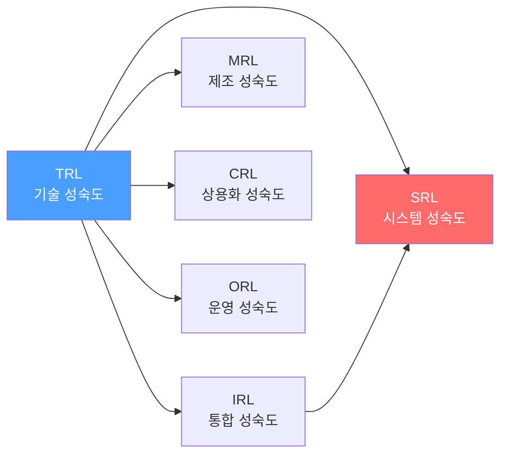
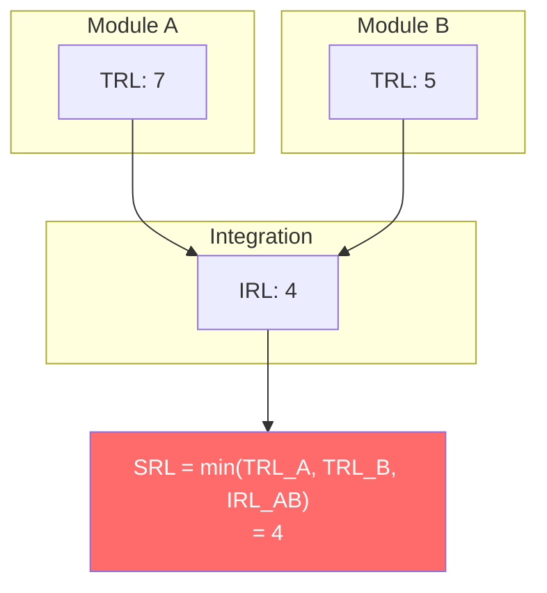

# 프로젝트 진척도/성숙도 추적 프레임워크 — 소프트웨어 모듈 단위

> 작성일: 2026-03-23
> 맥락: PROGRESS.md를 체크리스트에서 아키텍처 맵으로 전환하면서, 모듈별 성숙도를 표준화된 기준으로 표현하기 위한 조사

---

## Why — 왜 성숙도 프레임워크가 필요한가

"80% 완료"는 의미가 없다. 두 모듈이 똑같이 "80%"여도 하나는 API가 안정된 상태이고 다른 하나는 프로토타입일 수 있다. **진척도 = 완료 항목 수**가 아니라 **성숙도 = 현재 단계에서 어떤 수준인가**를 표현해야 의사결정에 쓸 수 있다.

NASA가 1970년대 우주 프로그램에서 이 문제를 처음 겪었다. "이 기술이 됩니까?"라는 질문에 "거의요"는 답이 아니었기 때문에 TRL(Technology Readiness Level)을 만들었다. 이후 제조(MRL), 통합(IRL), 시스템(SRL), 상용화(CRL), 운영(ORL) 등 14개 이상의 Readiness Level 프레임워크로 확산됐다.



---

## How — 주요 프레임워크 구조

### 1. NASA TRL (Technology Readiness Level)

가장 널리 채택된 원형. 9단계 스케일.

| TRL | 단계 | 소프트웨어 해석 |
|-----|------|----------------|
| 1 | 기초 원리 관찰 | 알고리즘/패턴 연구, "이런 게 가능할까?" |
| 2 | 기술 개념 수립 | 설계 문서, API 스케치 |
| 3 | 개념 증명 (PoC) | 핵심 함수 동작 확인, 실험적 코드 |
| 4 | 실험실 환경 검증 | 유닛 테스트 통과, 격리된 환경에서 동작 |
| 5 | 유사 환경 검증 | 통합 테스트 통과, 시뮬레이션 환경에서 동작 |
| 6 | 유사 환경 프로토타입 | 실제와 유사한 데이터/부하에서 프로토타입 동작 |
| 7 | 운영 환경 프로토타입 | 실제 사용자에게 제한 배포, 핵심 기능 완성 |
| 8 | 시스템 완성 | 전체 테스트 통과, 문서화 완료, 배포 준비 |
| 9 | 운영 검증 | 프로덕션에서 실증 완료 |

**소프트웨어 적응 (HBP Medical 버전):**

| TRL | 이름 | 핵심 기준 |
|-----|------|----------|
| 1 | Project Initiation | 소유자, 목표, 유스케이스 정의 |
| 2 | Conceptualization | 문제 분석, 핵심 함수 식별, 검증 기준 수립 |
| 3 | PoC Implementation | 핵심 함수 구현 + 검증 |
| 4 | Prototype Component | 컴포넌트 단위 부하 테스트, 기술 선택 확정 |
| 5 | Prototype Integration | 제한된 실사용자, 데이터 포맷 확정, 통합 평가 |
| 6 | Real-world Integration | 실세계 테스트, 부하 테스트, 사용자/시스템 문서 |
| 7 | Operational Integration | 실사용자 소수 운영, 모니터링, **API 동결** |
| 8 | Deployment | SLA 적용, 제한 사용자 운영 |
| 9 | Production | 목표 사용자 규모, 완전 운영 |

### 2. IRL (Integration Readiness Level)

모듈 간 **통합 성숙도**. TRL이 "이 모듈이 동작하는가?"라면 IRL은 "이 모듈들이 함께 동작하는가?".

| IRL | 단계 | 소프트웨어 해석 |
|-----|------|----------------|
| 1 | 인터페이스 식별 | 어떤 모듈과 연결되는지 파악 |
| 2 | 인터페이스 명세 | API 계약 정의 (타입, 프로토콜) |
| 3 | 인터페이스 호환성 확인 | 타입 레벨 호환 (tsc 통과) |
| 4 | 인터페이스 검증 | 통합 테스트로 연결 동작 확인 |
| 5 | 통합 환경 검증 | 여러 모듈을 함께 엮어 시나리오 테스트 |
| 6 | 통합 데모 | 실제 데이터로 모듈 간 흐름 실증 |
| 7 | 운영 통합 | 프로덕션 환경에서 모듈 간 연동 검증 |

### 3. SRL (System Readiness Level)

**SRL = f(TRL, IRL)**. 개별 모듈의 기술 성숙도(TRL)와 모듈 간 통합 성숙도(IRL)를 결합하여 시스템 전체의 준비도를 산출한다.



핵심 원리: **시스템의 준비도는 가장 약한 고리에 의해 결정된다.** 아무리 한 모듈이 TRL 9여도, 통합이 IRL 3이면 시스템은 배포할 수 없다.

### 4. CMMI (Capability Maturity Model Integration)

조직/프로세스 수준의 성숙도. 모듈이 아닌 **팀/조직**을 평가한다.

| Level | 이름 | 설명 |
|-------|------|------|
| 1 | Initial | 프로세스 없음, 영웅적 개인에 의존 |
| 2 | Managed | 프로젝트별 프로세스 존재 |
| 3 | Defined | 조직 표준 프로세스 정의됨 |
| 4 | Quantitatively Managed | 프로세스 측정 + 통계 관리 |
| 5 | Optimizing | 지속적 프로세스 개선 |

### 5. DORA Metrics

소프트웨어 **배포 성과** 측정. 성숙도 모델이 아니라 성과 지표.

| Metric | 측정 대상 | Elite 기준 |
|--------|----------|-----------|
| Deployment Frequency | 배포 빈도 | 일 다수 회 |
| Lead Time for Changes | 변경→배포 소요 시간 | < 1시간 |
| Change Failure Rate | 배포 실패율 | < 5% |
| Mean Time to Recovery | 장애 복구 시간 | < 1시간 |

### 6. Apache Project Maturity Model

오픈소스 프로젝트 성숙도. **8개 차원** × 각 차원별 5개 기준으로 평가.

차원: Code · Licenses · Releases · Quality · Community · Consensus · Independence · Branding

---

## What — 우리 프로젝트에 적용 가능한 모델 비교

| 프레임워크 | 평가 단위 | 스케일 | 우리 적합도 | 이유 |
|-----------|----------|--------|-----------|------|
| **TRL** | 기술/모듈 | 1-9 | **높음** | 모듈별 성숙 단계를 명확히 구분 |
| **IRL** | 모듈 간 인터페이스 | 1-7 | 중간 | 모듈 통합보다 단일 앱 구조 |
| SRL | 시스템 전체 | TRL×IRL | 낮음 | 멀티시스템이 아님 |
| CMMI | 조직/프로세스 | 1-5 | 낮음 | 1인 프로젝트, 프로세스 성숙도와 무관 |
| DORA | 배포 파이프라인 | 4단계 | 낮음 | 라이브러리 프로젝트, 배포 빈도 무의미 |
| Apache | OSS 프로젝트 | 8차원 | 낮음 | 커뮤니티/거버넌스 차원이 주력 |

---

## If — interactive-os에 대한 시사점

### TRL을 소프트웨어 모듈에 맞게 간소화

NASA TRL 9단계는 우주 프로그램용이라 과하다. 소프트웨어 모듈에는 **5단계면 충분**하다:

| Level | 이름 | 기준 | TRL 매핑 |
|-------|------|------|---------|
| 1 | **Concept** | 설계 문서/API 스케치만 존재 | TRL 1-2 |
| 2 | **Prototype** | 핵심 동작 확인, 유닛 테스트 존재 | TRL 3-4 |
| 3 | **Validated** | 통합 테스트 통과, API 안정, 엣지케이스 커버 | TRL 5-6 |
| 4 | **Integrated** | 실제 앱(CMS, Viewer 등)에서 사용 중, API 동결 | TRL 7-8 |
| 5 | **Production** | 프로덕션 배포 + 실사용자 검증 | TRL 9 |

### interactive-os 레이어별 현재 성숙도 (예시)

| Layer | Level | 근거 |
|-------|-------|------|
| ① Store | 4 Integrated | CMS, Viewer에서 실사용, API 변경 없음 |
| ② Engine | 4 Integrated | 동일 |
| ③ Plugins (8종) | 4 Integrated | 전체 앱에서 실사용 |
| ④ Behavior (17종) | 4 Integrated | 17 preset 모두 앱에서 검증됨 |
| ⑤ Hooks | 4 Integrated | useAria, useAriaZone 등 앱 전반 사용 |
| ⑥ UI (15종) | 3 Validated | 테스트 통과, 쇼케이스 존재, 외부 앱 적용은 아직 |
| ⑦ Infra | 4 Integrated | CI/CD, npm publish 운영 중 |
| ⑧ App Shell | 3 Validated | CMS, Viewer 동작하나 프로덕션 배포 전 |

### IRL 관점 — 레이어 간 통합

레이어 간 통합은 이미 높다 (Store→Engine→Plugin→Behavior→Hook→UI 체인이 동작). 별도 IRL 추적보다는 TRL 기반 성숙도만으로 충분.

### 권장: 5-Level 모델 + 커버리지

```
| Layer | Maturity | Coverage | Components |
|-------|----------|----------|------------|
| ① Store | Integrated | — | createStore · getEntity · ... |
```

- **Maturity**: 5단계 중 현재 위치 (Concept→Prototype→Validated→Integrated→Production)
- **Coverage**: 해당 레이어의 완성도 (예: "17/18 behaviors")
- **Components**: 구성 요소 나열

---

## Insights

- **TRL의 핵심 가치는 "다음에 뭘 해야 하는지"를 알려주는 것.** Level 3(Validated)이면 "실제 앱에 통합해봐야 한다", Level 4(Integrated)이면 "프로덕션 배포 준비"가 다음 스텝. 숫자 자체보다 **다음 행동을 유도하는 힘**이 프레임워크의 가치다.

- **SRL(System Readiness) = min(모든 모듈의 TRL, 모든 인터페이스의 IRL).** 가장 약한 고리 원리. 이걸 PROGRESS.md에 적용하면: 전체 프로젝트의 성숙도 = 가장 낮은 레이어의 성숙도. ⑥ UI가 Level 3이면 프로젝트 전체도 Level 3.

- **9단계는 과하다.** NASA TRL을 소프트웨어에 그대로 적용한 사례들(HBP Medical 등)은 존재하지만, 대부분 TRL 4-6 구간의 차이가 모호해진다. 소프트웨어에서 "실험실 환경"과 "유사 환경"의 구분은 하드웨어만큼 명확하지 않기 때문. 5단계면 충분.

- **CMMI/DORA는 다른 축.** CMMI는 조직 프로세스, DORA는 배포 성과를 측정한다. 모듈별 기술 성숙도와는 직교하는 차원이므로 혼합하면 안 된다.

---

## Sources

| # | 출처 | 유형 | 핵심 내용 |
|---|------|------|----------|
| 1 | [Technology Readiness Levels - NASA](https://www.nasa.gov/directorates/somd/space-communications-navigation-program/technology-readiness-levels/) | 공식 | TRL 9단계 원본 정의 |
| 2 | [HBP Medical TRL for Software](https://hbpmedical.github.io/development-guidelines/maturity/trls/) | 적용 사례 | 소프트웨어 특화 TRL 9단계 (Project Initiation → Production) |
| 3 | [14 Readiness Level Frameworks - ITONICS](https://www.itonics-innovation.com/blog/14-readiness-level-frameworks) | 개요 | TRL/MRL/IRL/SRL/CRL/ORL 등 14개 프레임워크 비교 |
| 4 | [From TRL to SRL - SEBoK](https://sebokwiki.org/wiki/From_TRL_to_SRL:_The_Concept_of_System_Readiness_Levels) | 학술 | SRL = f(TRL, IRL) 개념, 시스템 준비도 산출 |
| 5 | [Apache Project Maturity Model](https://community.apache.org/apache-way/apache-project-maturity-model.html) | OSS 표준 | 8차원 × 5기준 OSS 프로젝트 성숙도 평가 |
| 6 | [CMMI Institute](https://cmmiinstitute.com/) | 공식 | CMMI v3.0, 5단계 조직 성숙도 |
| 7 | [DORA Metrics - Four Keys](https://dora.dev/guides/dora-metrics-four-keys/) | 공식 | 소프트웨어 배포 성과 4대 지표 |
| 8 | [Open Source Maturity Model - FINOS](https://osr.finos.org/docs/bok/osmm/introduction) | OSS 표준 | 오픈소스 채택 성숙도 프레임워크 |
