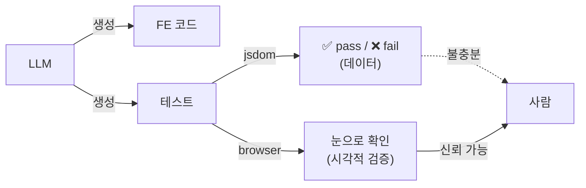
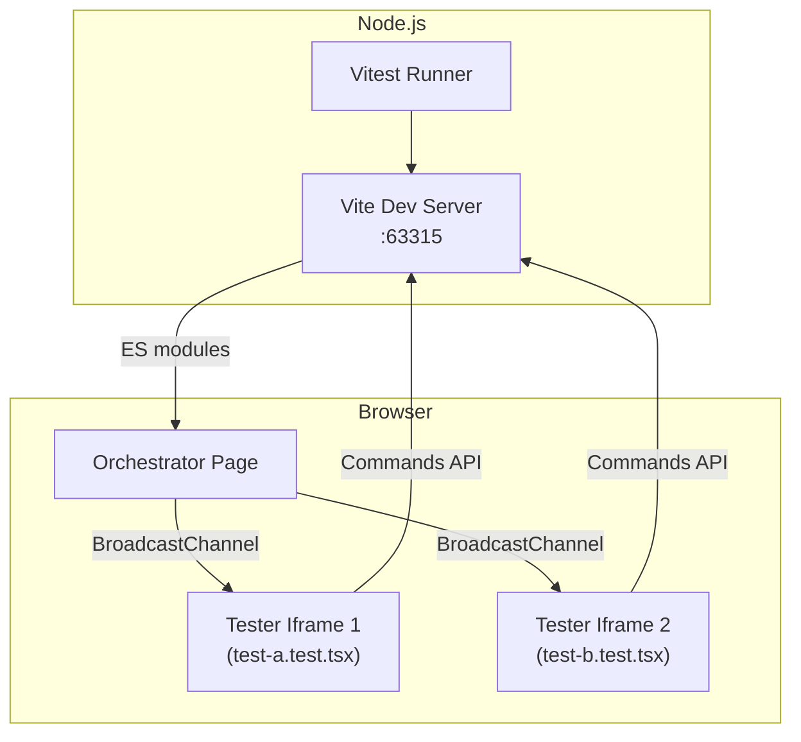
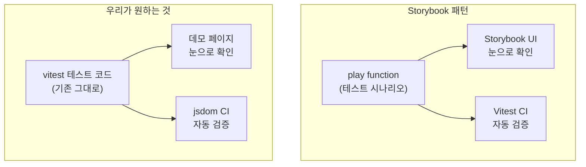

# Vitest Browser Mode 앱 내장 가능성 — 데모 페이지에서 테스트를 눈으로 보기

> 작성일: 2026-03-23
> 맥락: interactive-os 홈페이지의 auto test 기능을 위해, vitest 테스트 코드를 실제 데모 페이지에서 브라우저로 실행할 수 있는지 조사

> **Situation** — vitest 통합 테스트가 jsdom에서 돌아가며, pass/fail 텍스트로만 결과를 확인할 수 있다.
> **Complication** — LLM 시대 FE 코드는 눈으로 봐야 검증 가능한데, 테스트 결과를 시각적으로 확인할 방법이 없다.
> **Question** — vitest 테스트 코드를 변경 없이 데모 페이지 브라우저에서 실행하여 눈앞에서 볼 수 있는가?
> **Answer** — vitest browser mode + testerHtmlPath + preview provider 조합으로 가능하며, Storybook의 play function 패턴이 "같은 코드, 두 환경" 모델의 선례다.

---

## Why — 테스트를 눈으로 봐야 하는 이유

FE 테스트의 pass/fail은 데이터 검증일 뿐이다. 포커스가 이동했는지, 선택 상태가 시각적으로 올바른지, 인터랙션이 자연스러운지는 **사람이 봐야 판단할 수 있다**. LLM이 코드와 테스트를 모두 생성하는 환경에서, 시각적 검증 경로가 없으면 "테스트 통과 = 품질 보증"이라는 착각이 생긴다.



---

## How — vitest가 브라우저에서 테스트를 실행하는 구조

### 아키텍처



1. **Vite Dev Server**: 테스트 파일을 ES 모듈로 서빙 (포트 63315)
2. **Orchestrator Page**: 브라우저에서 테스트 실행을 조율
3. **Tester Iframe**: 각 테스트 파일이 iframe 안에서 실행 (파일 단위 격리)
4. **통신**: BroadcastChannel(iframe 간), Commands API(브라우저→Node.js)

### 3개 Provider

| Provider | 이벤트 메커니즘 | 특징 |
|----------|----------------|------|
| **Playwright** | Chrome DevTools Protocol | OS 수준 이벤트, 병렬 실행, CI 권장 |
| **WebdriverIO** | W3C WebDriver API | 크로스 브라우저 |
| **Preview** | `@testing-library/user-event` | 설치 불필요, 어떤 브라우저에서든 URL 열기만 하면 실행 |

### 핵심 설정 옵션

| 옵션 | 역할 | 앱 내장 관련성 |
|------|------|---------------|
| `testerHtmlPath` | 테스트가 실행되는 HTML 커스터마이징 | **높음** — 앱의 HTML 구조를 테스트 환경에 주입 가능 |
| `isolate: false` | iframe 격리 비활성화, 같은 페이지 컨텍스트 공유 | **높음** — 테스트가 앱 DOM에 직접 접근 |
| `provider: preview` | 외부 도구 없이 브라우저에서 실행 | **높음** — URL만 열면 테스트 실행 |
| `testerScripts` | 테스트 환경 초기화 전 스크립트 주입 | 중간 — 폴리필, 글로벌 설정 |
| `ui` | vitest UI 표시 여부 | 낮음 — 자체 UI를 쓸 거면 불필요 |

---

## What — 앱 내장을 위한 3가지 경로

### 경로 1: testerHtmlPath로 앱 HTML 주입

```typescript
// vitest.config.ts
export default defineConfig({
  test: {
    browser: {
      enabled: true,
      provider: preview(),
      testerHtmlPath: './index.html', // 앱의 index.html
      instances: [{ browser: 'chromium' }],
    }
  }
})
```

- vitest가 앱의 HTML을 tester iframe에 로드
- 테스트 코드가 앱의 실제 DOM 구조 안에서 실행
- **한계**: 여전히 iframe 안이므로 앱의 라우팅/전역 상태와 완전히 동일하진 않음

### 경로 2: Preview Provider + URL 직접 접근

Preview provider는 "어떤 브라우저에서든 링크를 열면 테스트 실행"을 지원한다.

- vitest 서버 시작 → URL 제공 → 데모 페이지에서 iframe으로 임베드
- 또는 데모 페이지에서 해당 URL을 직접 여는 링크 제공
- **장점**: 가장 단순, vitest 인프라 그대로
- **한계**: vitest 서버가 별도로 돌아야 함

### 경로 3: Storybook Play Function 패턴 차용

Storybook이 이미 해결한 문제: **같은 테스트 코드를 두 환경에서 실행**

```typescript
// Storybook play function 패턴
export const FilledForm: Story = {
  play: async ({ canvas, userEvent }) => {
    await userEvent.type(canvas.getByRole('textbox'), 'hello')
    await expect(canvas.getByText('hello')).toBeVisible()
  }
}

// 1) Storybook UI에서: 컴포넌트 옆에서 시각적으로 실행
// 2) Vitest CI에서: portable stories로 headless 실행
```

**Portable Stories** API:
- `composeStories(stories)` → 렌더 가능한 컴포넌트로 변환
- `story.run()` → mount + play function 실행
- Storybook 없이도 vitest에서 실행 가능

이 패턴의 핵심: **play function이라는 "테스트 시나리오" 단위가 Storybook UI(시각)와 vitest(CI) 양쪽에서 실행되는 구조**.



---

## If — 프로젝트에 대한 시사점

### 현실적 경로 판단

| 경로 | 실현 가능성 | 기존 코드 변경 | 앱 내장 |
|------|------------|---------------|---------|
| testerHtmlPath | 높음 | 없음 | iframe 수준 |
| Preview + URL | 높음 | 없음 | iframe 또는 링크 |
| Play function 패턴 | 중간 | 테스트 구조 변경 필요 | 직접 내장 가능 |
| vitest 실행 엔진 import | 낮음 | — | — |

**vitest 실행 엔진의 직접 import는 현재 공개 API로 지원되지 않는다.** `startVitest`/`createVitest`는 Node.js 전용 API이며, 브라우저에서 직접 import할 수 없다.

### 권장 접근

1. **1단계 (즉시 가능)**: vitest browser mode + preview provider로 테스트를 브라우저에서 실행. `testerHtmlPath`로 앱 HTML 주입. 데모 페이지에서 vitest 테스트 URL을 iframe으로 임베드.

2. **2단계 (구조 전환)**: 테스트를 실제 페이지 렌더로 전환 (CMS 패턴). vitest browser mode에서 실행하면 실제 페이지가 iframe 안에서 테스트됨.

3. **3단계 (이상적)**: Storybook play function 패턴에서 영감을 받아, 테스트 시나리오를 "실행 가능한 단위"로 추출. 이 단위가 vitest(CI)에서도 데모 페이지(브라우저)에서도 실행 가능하도록.

### 핵심 제약

- **vitest 서버 필요**: browser mode는 Vite dev server가 돌아야 함. 정적 배포된 홈페이지에서는 vitest를 직접 실행할 수 없음
- **iframe 경계**: testerHtmlPath를 써도 테스트는 iframe 안에서 실행. 앱의 전역 상태(라우팅 등)와 완전히 동일한 환경은 아님
- **Preview provider 한계**: headless 미지원, 다중 인스턴스 미지원

### 개방 질문

- 정적 배포 홈페이지에서 auto test를 원하면 vitest 의존을 벗어난 자체 runner가 필요한가?
- iframe이면 충분한가, 아니면 같은 DOM context가 필수인가?
- play function 패턴으로의 마이그레이션 비용 대비 가치는?

---

## Insights

- **Preview provider가 열쇠**: Playwright나 WebDriver 없이, URL만 열면 테스트가 실행된다. 외부 도구 의존이 없어서 "데모 페이지에 링크 하나" 수준으로 단순화 가능
- **Storybook이 이미 해결**: "같은 코드, 두 환경(시각적 + CI)" 문제를 play function + portable stories로 풀었다. 바퀴를 재발명하기 전에 이 패턴을 충분히 검토할 가치
- **testerHtmlPath의 가능성**: 앱의 index.html을 테스트 HTML로 쓸 수 있다면, 테스트가 앱의 실제 스타일/구조 안에서 실행됨. "데모와 다른 환경에서 테스트" 문제를 근본적으로 해소
- **isolate: false의 위험과 기회**: iframe 격리를 끄면 테스트 간 상태 오염이 가능하지만, 앱 DOM에 직접 접근할 수 있어 e2e에 가까운 테스트가 됨
- **Node API는 앱 내장 불가**: `startVitest`/`createVitest`는 Node.js 전용. 브라우저에서 vitest를 "import해서 쓴다"는 현재 불가능. iframe 임베드가 현실적 최선

---

## Sources

| # | 출처 | 유형 | 핵심 내용 |
|---|------|------|----------|
| 1 | [Vitest Advanced API](https://vitest.dev/advanced/api/) | 공식 문서 | startVitest/createVitest는 Node.js 전용 API |
| 2 | [Vitest Browser Mode Guide](https://vitest.dev/guide/browser/) | 공식 문서 | 3개 provider, iframe 아키텍처, testerHtmlPath |
| 3 | [Vitest Browser Mode Discussion #5828](https://github.com/vitest-dev/vitest/discussions/5828) | GitHub | Preview provider로 URL 열기만 하면 테스트 실행 |
| 4 | [Vitest 4.0 InfoQ](https://www.infoq.com/news/2025/12/vitest-4-browser-mode/) | 뉴스 | Browser mode stable 졸업, toMatchScreenshot |
| 5 | [Storybook Interaction Testing](https://storybook.js.org/docs/writing-tests/interaction-testing) | 공식 문서 | play function + interactions panel 시각적 재생 |
| 6 | [Storybook Play Function](https://storybook.js.org/docs/writing-stories/play-function) | 공식 문서 | play function 정의, canvas/userEvent 컨텍스트 |
| 7 | [Storybook Portable Stories Vitest](https://storybook.js.org/docs/api/portable-stories/portable-stories-vitest) | 공식 문서 | composeStories + .run()으로 Storybook 밖에서 실행 |
| 8 | [Storybook + Vitest Blog](https://storybook.js.org/blog/component-test-with-storybook-and-vitest/) | 블로그 | story를 vitest 테스트로 자동 변환 |
| 9 | [Vitest Browser Isolate Config](https://vitest.dev/config/browser/isolate) | 공식 문서 | isolate: false로 iframe 격리 비활성화 가능 (deprecated) |
| 10 | [Vitest PR #9095](https://github.com/vitest-dev/vitest/pull/9095) | GitHub | orchestrator→iframe 아키텍처, 파일 단위 병렬 실행 |

---

## Walkthrough

> 이 조사 결과를 프로젝트에서 직접 확인하려면?

1. **vitest browser mode 체험**: `vitest.config.ts`에 `browser: { enabled: true, provider: preview() }` 추가 후 `vitest --browser` 실행
2. **testerHtmlPath 실험**: 프로젝트의 `index.html`을 `testerHtmlPath`로 지정하고, 기존 테스트가 앱 HTML 안에서 실행되는지 확인
3. **Preview provider URL**: vitest 서버가 제공하는 URL을 브라우저에서 직접 열어 테스트 실행 관찰
4. **CMS 테스트 기준**: `src/__tests__/cms-detail-panel.test.tsx`를 browser mode로 실행해보면, 실제 CmsLayout이 브라우저에서 렌더되며 테스트가 돌아가는 것을 눈으로 확인 가능
