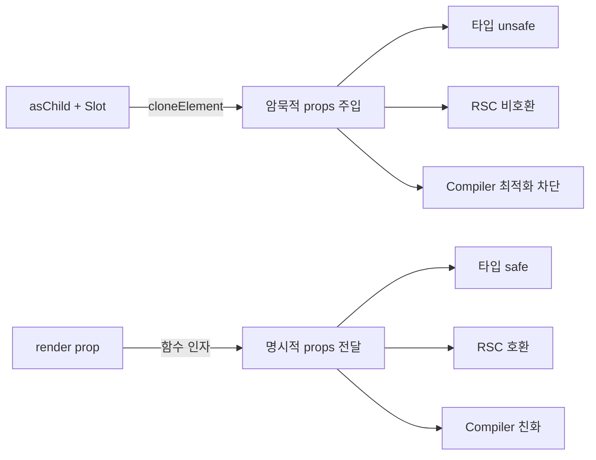
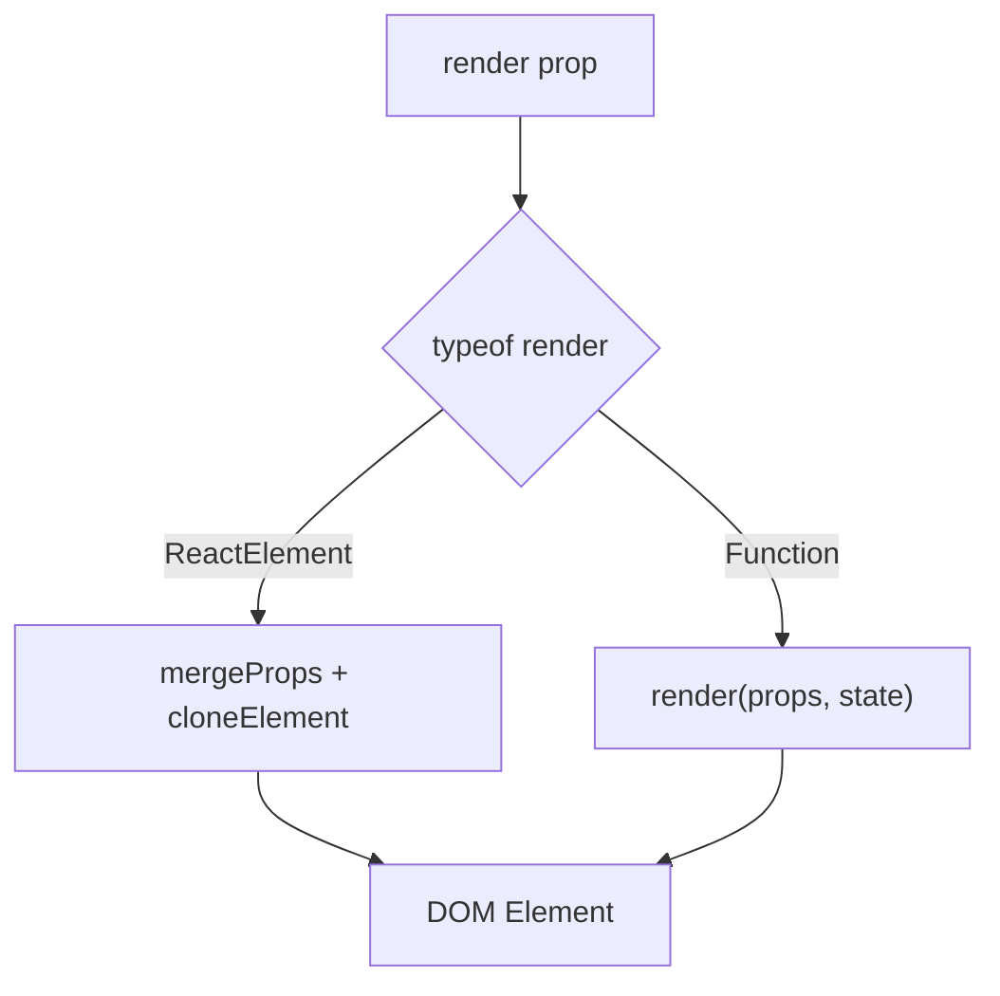

# Base UI Render Prop 패턴 — interactive-os에 적용할 힌트

> 작성일: 2026-03-23
> 맥락: AriaItem wrapper 제거 후, render API를 Base UI 방식으로 개선하기 위한 근거 수집

> **Situation** — interactive-os의 AriaItem이 wrapper div를 제거하고 render(item, state, props) 3인자 패턴으로 전환 완료.
> **Complication** — props가 3번째 인자라 빠뜨리기 쉽고(Checkbox 사고), Base UI는 props를 1번째에 둔다.
> **Question** — Base UI의 render prop 설계에서 무엇을 가져올 수 있는가?
> **Answer** — props-first 순서, mergeProps 유틸, JSX element 형태 render 3가지를 적용 가능. cloneElement는 JSX 형태에만 한정 사용.

---

## Why — render prop이 asChild를 대체하는 이유

Radix의 `asChild` + `Slot` 패턴은 `React.cloneElement`에 의존한다. 이 접근의 문제:

1. **타입 안전성 부재** — 자식이 `ReactNode`로 취급되어 컴파일 타임 검증 불가
2. **RSC 비호환** — 비동기 서버 컴포넌트는 클라이언트에서 pending Promise이므로 cloneElement가 props 주입 실패
3. **React Compiler 충돌** — Sebastian Markbage: "cloneElement는 기본적으로 soft deprecated. 인라인 최적화를 방해"
4. **암묵적 props 병합** — 이벤트 핸들러 실행 순서, className 연결 규칙이 문서화 안 됨



Base UI는 2025.12 v1.0에서 render prop을 공식 API로 확정. shadcn/ui가 2026.01 Base UI 공식 지원 시작하면서 이 패턴이 업계 표준으로 수렴 중.

---

## How — Base UI useRender 내부 구현

### 두 가지 render 형태

**1. JSX Element 형태 (자동 병합)**
```tsx
<Menu.Trigger render={<MyButton size="md" />}>
  Open menu
</Menu.Trigger>
```
내부: `mergeProps(internalProps, element.props)` → `React.cloneElement(element, mergedProps)`

**2. Callback 함수 형태 (수동 spread)**
```tsx
<Switch.Thumb
  render={(props, state) => (
    <span {...props}>
      {state.checked ? <CheckedIcon /> : <UncheckedIcon />}
    </span>
  )}
/>
```
내부: `render(computedProps, state)` — cloneElement 미사용



### props 병합 규칙 (mergeProps)

| 종류 | 병합 방식 |
|------|----------|
| 이벤트 핸들러 | 체이닝 (순차 실행) |
| className | 공백 join, falsy 필터 |
| style | 객체 병합 (후자 우선) |
| ref | useMergedRefs로 합성 |
| 나머지 | 후자가 덮어씀 |

### 인자 순서: (props, state)

props가 1번째인 이유:
- **spread가 필수** — 1번째 인자가 가장 눈에 잘 띔
- **state는 선택적 사용** — 조건부 렌더링 시에만 필요
- `_state`로 무시하는 패턴이 흔함

---

## What — 프로젝트 적용 가능 항목

### 1. props-first 순서 전환

```tsx
// 현재 (interactive-os)
render: (item, state, props) => ReactElement

// Base UI 방식 적용
render: (props, item, state) => ReactElement
```

props를 빠뜨리면 role/aria-* 누락 → 접근성 깨짐. 1번째 인자가 가장 안전.

### 2. mergeProps 유틸리티

현재 프로젝트에 이벤트 핸들러 병합 유틸이 없다. Combobox의 `handleOptionClick`을 props에 수동 합성하는 등 ad-hoc 병합이 산재.

```tsx
// mergeProps 도입 시
const optionProps = mergeProps(ariaProps, { onClick: handleOptionClick })
return render(optionProps, entity, state)
```

### 3. JSX element 형태 render (선택적)

단순 케이스에서 callback 없이 JSX만으로:
```tsx
// 현재: callback 필수
<ListBox renderItem={(props, item) => (
  <span {...props}>{item.data.label}</span>
)} />

// JSX 형태 가능 시:
<ListBox renderItem={<span />} />
// → 내부에서 cloneElement로 children + props 자동 병합
```

이건 우선순위 낮음. callback 형태가 충분히 유연하고 타입 안전.

---

## If — 프로젝트 시사점

### 즉시 적용 (이번 세션)

| 항목 | 변경 | 이유 |
|------|------|------|
| **인자 순서** | `(item, state, props)` → `(props, item, state)` | props 누락 방지, Base UI 표준 |

### 백로그

| 항목 | 설명 |
|------|------|
| **mergeProps** | 이벤트 핸들러 체이닝 유틸. Combobox, Toolbar 등에서 활용 |
| **JSX element render** | `render={<MyComponent />}` 형태. cloneElement 사용하되 callback과 공존 |
| **data-* 상태 속성** | `data-focused`, `data-selected` 등을 CSS에서 직접 사용. state를 render에 안 넘겨도 됨 |

### 하지 않을 것

| 항목 | 이유 |
|------|------|
| **useRender hook 도입** | 현재 AriaItem이 이미 동일 역할 수행. 추상화 중복 |
| **asChild 패턴 복귀** | cloneElement 의존, RSC/Compiler 비호환, 타입 unsafe |

---

## Insights

- **"soft deprecated"는 "deprecated"가 아니다**: React 팀이 cloneElement를 soft deprecated라 했지만 React 19에서 정식 deprecated 마크 없음. 다만 React Compiler 최적화를 차단하므로 새 코드에서는 피하는 것이 현명
- **Base UI도 cloneElement를 쓴다**: JSX element 형태 render에서. 완전 제거가 아니라 "callback 형태에서는 안 쓴다"가 정확
- **props-first는 DX 선택이다**: 기술적 이유가 아닌, "빠뜨리기 어렵게 만드는" 설계 선택. pit of success 원칙
- **data-* 속성 기반 스타일링이 트렌드**: Base UI, Headless UI v2 모두 state를 render에 안 넘기고 `data-[checked]` 등 CSS 속성으로 처리. state 인자 자체를 줄이는 방향

---

## Sources

| # | 출처 | 유형 | 핵심 내용 |
|---|------|------|----------|
| 1 | [useRender – Base UI](https://base-ui.com/react/utils/use-render) | 공식 문서 | render prop API, mergeProps 사용법 |
| 2 | [Composition – Base UI](https://base-ui.com/react/handbook/composition) | 공식 문서 | 두 가지 render 형태, ref/props 병합 규칙 |
| 3 | [useRenderElement.tsx – GitHub](https://github.com/mui/base-ui/blob/master/packages/react/src/utils/useRenderElement.tsx) | 소스코드 | cloneElement 사용 여부, evaluateRenderProp 구현 |
| 4 | [asChild 도전과제 비교](https://zenn.dev/tsuboi/articles/8abddb1ae3038f?locale=en) | 전문 블로그 | asChild/Slot 문제점, RSC/Compiler 비호환성 |
| 5 | [Radix vs Base UI](https://preblocks.com/blog/radix-ui-vs-base-ui) | 비교 분석 | 두 라이브러리의 철학 차이 |
| 6 | [shadcn/ui Base UI 지원](https://ui.shadcn.com/docs/changelog/2026-01-base-ui) | 공식 문서 | 2026.01 Base UI 공식 채택 |
| 7 | [RFC: Base UI customization API](https://github.com/mui/base-ui/discussions/157) | 커뮤니티 | render prop vs asChild 설계 논의 |

---

## Walkthrough

1. `src/interactive-os/components/aria.tsx` → AriaItemProps.render 시그니처 확인
2. `src/interactive-os/ui/ListBox.tsx` → defaultRenderItem에서 props spread 패턴 확인
3. `src/AppShell.tsx` → renderNavItem에서 Tooltip + props 배치 확인 (복잡한 케이스)
4. 확인 포인트: 모든 defaultRenderItem이 `(props, item, state)` 순서로 props-first 되어 있으면 적용 완료
