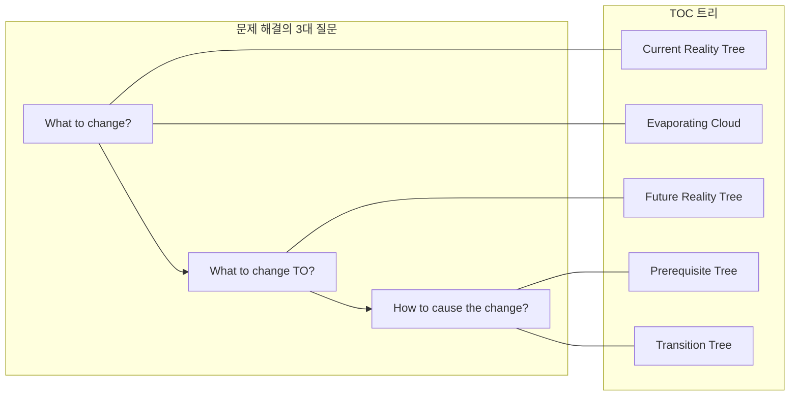
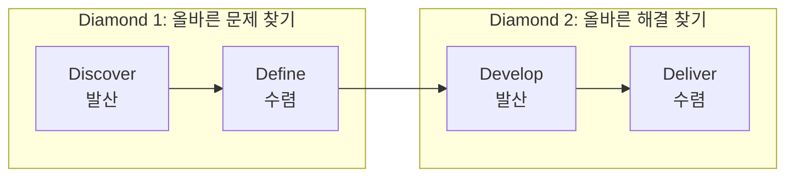

# 구조적 문제해결 프레임워크 비교 — TOC와 유사한 방법론들

> 작성일: 2026-03-24
> 맥락: discussion 스킬이 TOC Thinking Processes를 기반으로 하는데, 다른 구조적 문제해결 방법론에서 차용할 수 있는 요소가 있는지 탐색

> **Situation** — discussion 스킬은 TOC 5개 트리를 10개 요소로 풀어낸 구조로 운영되고 있다.
> **Complication** — TOC 외에도 유사한 구조적 문제해결 프레임워크들이 존재하며, 각각 고유한 강점이 있다.
> **Question** — 어떤 프레임워크들이 있고, discussion 스킬에 차용할 수 있는 요소는 무엇인가?
> **Answer** — 7개 프레임워크를 비교한 결과, TOC가 가장 포괄적이나 TRIZ의 모순 해소, Double Diamond의 발산-수렴 리듬, Cynefin의 문제 유형 분류가 보완점으로 유의미하다.

---

## Why — 왜 비교가 필요한가

TOC Thinking Processes는 "무엇을 바꿀 것인가 → 무엇으로 바꿀 것인가 → 어떻게 바꿀 것인가"라는 3대 질문을 5개 논리 트리(CRT, EC, FRT, PRT, TT)로 풀어낸다. 그러나 모든 문제 상황이 TOC의 인과 논리에 최적화되어 있지는 않다. 문제 유형에 따라 다른 접근이 더 효과적일 수 있다.

---

## How — 각 프레임워크의 작동 원리

### 1. TOC Thinking Processes (현재 사용 중)

**핵심**: 인과 논리로 제약을 식별하고 해소한다.

| 단계 | 도구 | discussion 요소 |
|------|------|----------------|
| 뭐가 문제? | Current Reality Tree | 목적, 배경, 이상적 결과, 현실, 문제, 원인 |
| 왜 못 바꾸지? | Evaporating Cloud | 제약 |
| 뭘 바꿀 수 있지? | Prerequisite Tree | 목표 |
| 바꾸면 어떻게 되지? | Future Reality Tree | 해결, 부작용 |
| 어떻게 실행하지? | Transition Tree | (→ /plan에 위임) |

**강점**: 인과 체인이 명확, 제약에 집중, 부작용 사전 검토
**약점**: 아이디어 생성 메커니즘이 없음, 문제 유형 분류가 없음

### 2. TRIZ (발명적 문제해결 이론)

**핵심**: 모순을 정의하고, 40가지 발명 원리로 해소한다.

| 단계 | 내용 |
|------|------|
| 모순 정의 | 개선하려는 속성 A와 악화되는 속성 B를 식별 |
| 모순 매트릭스 | 39x39 매트릭스에서 해당 모순에 적용 가능한 원리 탐색 |
| 원리 적용 | 40가지 발명 원리 중 선택하여 해결책 도출 |

**TOC와의 관계**: Evaporating Cloud가 모순을 정의하는 데 도움을 주고, TRIZ가 그 모순을 해소하는 구체적 방법을 제공한다. TOC는 "왜 충돌하는가"를 찾고, TRIZ는 "어떻게 풀 것인가"를 제공한다.

**차용 가능성**: `/conflict` 스킬에서 전제를 깬 후 해결책을 생성할 때, TRIZ의 분리 원리(시간 분리, 공간 분리, 조건 분리, 부분과 전체 분리)가 유용할 수 있다.

### 3. Toyota A3 Problem Solving

**핵심**: A3 용지 한 장에 PDCA 사이클을 압축한다.

| 단계 | 내용 | TOC 대응 |
|------|------|---------|
| Background | 왜 이 문제를 다루는가 | 목적, 배경 |
| Current State | 지금 상태 측정 | 현실 |
| Problem Statement | 갭 정의 | 문제 |
| Root Cause Analysis | 5 Why, 어골도 | 원인 |
| Target State | 목표 상태 | 이상적 결과 |
| Countermeasures | 대책 | 해결 |
| Follow-Up | 효과 확인 계획 | 검증 |

**강점**: 한 장에 강제 압축 → 본질에 집중, 시각적 현상 파악 강조
**차용 가능성**: "현재 상태를 측정하라"는 원칙. discussion에서 현실(4) 요소의 이해도를 올릴 때 정량적 관찰을 요구하는 것이 유용하다.

### 4. Kepner-Tregoe

**핵심**: IS/IS NOT 비교 분석으로 원인을 좁혀간다.

| 프로세스 | 내용 | TOC 대응 |
|---------|------|---------|
| Situation Appraisal | 문제 분해, 우선순위 | 목적, 배경 |
| Problem Analysis | IS/IS NOT 비교로 원인 특정 | 원인 |
| Decision Analysis | 기준 가중치로 대안 평가 | 해결 |
| Potential Problem Analysis | 리스크 사전 식별 | 부작용 |

**강점**: IS/IS NOT 기법 — "문제가 발생하는 곳과 발생하지 않는 곳의 차이"로 원인을 좁힘
**차용 가능성**: 원인(6) 요소가 🟡 정체일 때, "어디서는 되고 어디서는 안 되는가?"라는 IS/IS NOT 질문이 돌파구가 될 수 있다.

### 5. Double Diamond (Design Council)

**핵심**: 발산→수렴을 두 번 반복한다.

| 단계 | 모드 | 내용 |
|------|------|------|
| Discover | 발산 | 넓게 탐색, 사용자 조사, 관찰 |
| Define | 수렴 | 핵심 문제 정의 |
| Develop | 발산 | 해결책 다수 생성 |
| Deliver | 수렴 | 프로토타입, 검증, 선택 |

**강점**: 발산-수렴의 리듬이 명시적. "지금은 넓히는 시간인가, 좁히는 시간인가"를 구분한다.
**차용 가능성**: discussion에서 현재 어느 모드인지(발산 vs 수렴) 명시하면 대화가 더 효율적일 수 있다. 초반(목적~문제)은 발산, 후반(목표~해결)은 수렴.

### 6. Cynefin Framework

**핵심**: 문제를 유형별로 분류하고, 유형에 맞는 접근법을 선택한다.

| 도메인 | 인과관계 | 접근법 |
|--------|---------|--------|
| Clear | 명확 | Sense → Categorize → Respond (모범 사례 적용) |
| Complicated | 분석 필요 | Sense → Analyze → Respond (전문가 분석) |
| Complex | 사후에만 파악 | Probe → Sense → Respond (실험 후 패턴 발견) |
| Chaotic | 없음 | Act → Sense → Respond (일단 행동, 안정화) |
| Disorder | 모름 | 분해 후 각 도메인에 배치 |

**강점**: "이 문제에 TOC가 맞는가?"를 판단하는 메타 프레임워크. 복잡한(Complex) 문제에는 인과 분석보다 실험이 더 적합할 수 있다.
**차용 가능성**: discussion 시작 시 Cynefin 도메인을 판별하면 접근 전략이 달라질 수 있다. Clear/Complicated → TOC 10요소 순서대로. Complex → 실험 먼저, 패턴 후에 구조화.

### 7. Systems Thinking (Iceberg Model)

**핵심**: 보이는 사건 아래의 패턴, 구조, 멘탈 모델을 탐색한다.

| 레벨 | 질문 | 깊이 |
|------|------|------|
| Events | 무슨 일이 일어났는가? | 표면 |
| Patterns | 반복되는 추세는? | 중간 |
| Structures | 이 패턴을 만드는 시스템 구조는? | 깊음 |
| Mental Models | 이 구조를 유지하는 가정/신념은? | 가장 깊음 |

**강점**: "원인의 원인의 원인"을 4단계로 체계화. 단발성 사건이 아니라 시스템 수준의 변화를 유도한다.
**차용 가능성**: 원인(6) 분석 시 Iceberg 4단계를 적용하면 표면적 원인에서 멈추지 않고 구조적 원인까지 파고들 수 있다.

---

## What — 프레임워크 비교 매트릭스

| 프레임워크 | 문제 정의 | 원인 분석 | 해결 생성 | 부작용 검토 | 실행 계획 | 고유 강점 |
|-----------|----------|----------|----------|-----------|----------|----------|
| **TOC TP** | CRT | CRT→EC | FRT | NBR | PRT→TT | 제약 집중, 인과 논리 |
| **TRIZ** | 모순 정의 | 모순 매트릭스 | 40원리 | - | - | 모순 해소 체계 |
| **A3** | Background | 5 Why | Countermeasures | - | Follow-Up | 한 장 압축, 측정 강조 |
| **Kepner-Tregoe** | Situation | IS/IS NOT | Decision Analysis | PPA | - | 비교 분석 |
| **Double Diamond** | Discover→Define | - | Develop→Deliver | - | - | 발산-수렴 리듬 |
| **Cynefin** | 도메인 분류 | - | 도메인별 접근 | - | - | 메타 분류 |
| **Systems Thinking** | Events | 4단계 깊이 | 구조 변경 | 피드백 루프 | - | 시스템 수준 변화 |

---

## If — discussion 스킬에 대한 시사점

### 이미 강한 것 (TOC에서 온 것)
- 인과 논리 기반 10요소 구조
- 제약 식별 + Evaporating Cloud
- 부작용 사전 검토 (Negative Branch Reservation)

### 차용 가치가 있는 것

| 출처 | 아이디어 | 적용 지점 |
|------|---------|----------|
| **TRIZ** | 모순의 4가지 분리 원리 (시간/공간/조건/부분-전체) | `/conflict` 스킬에서 전제를 깬 후 해결책 생성 시 |
| **Kepner-Tregoe** | IS/IS NOT 비교 질문 | 원인(6) 🟡 정체 시 "어디서는 되고 어디서는 안 되는가?" |
| **Double Diamond** | 발산-수렴 모드 명시 | 대화 초반(1~5) = 발산, 후반(6~10) = 수렴으로 리듬 인식 |
| **Cynefin** | 문제 유형 분류 | discussion 진입 시 "이건 Complicated인가 Complex인가?" 판별 |
| **Systems Thinking** | Iceberg 4단계 | 원인(6) 분석 시 표면→패턴→구조→멘탈 모델 순으로 깊이 탐색 |
| **A3** | 현상 측정 강조 | 현실(4) 이해도를 올릴 때 "측정 가능한 수치로 표현하라" |

### 차용하지 않을 것
- TRIZ 40원리 전체: 기술적 발명에 특화, 소프트웨어 논의에서는 과잉
- A3 한 장 제약: discussion은 대화형이라 물리적 제약이 불필요
- Cynefin 5도메인 전체 운영: discussion은 주로 Complicated 도메인에서 작동, 매번 분류하는 건 오버헤드

---

## Insights

- **TOC는 "분석 → 해결" 파이프라인에서 가장 완결적**이다. 다른 프레임워크들은 특정 단계(원인 분석, 해결 생성, 문제 분류)에 특화되어 있지만 전체 흐름을 커버하지는 못한다.
- **가장 큰 빈자리는 "아이디어 생성"**이다. TOC는 제약을 식별하고 전제를 깨는 데는 강하지만, "자, 그러면 뭘 할까?"에서 창의적 도약을 돕는 메커니즘이 없다. TRIZ가 이 빈자리를 채울 수 있다.
- **Cynefin은 메타 판단**이다. "이 문제에 TOC를 적용하는 게 맞는가?"를 먼저 묻는 프레임워크. Complex 도메인 문제에 TOC를 강제하면 역효과가 난다 — 실험이 먼저다.

---

## Sources

| # | 출처 | 유형 | 핵심 내용 |
|---|------|------|----------|
| 1 | [TOC Thinking Processes - TOC Institute](https://www.tocinstitute.org/toc-thinking-processes.html) | 공식 | 5개 트리 구조와 3대 질문 설명 |
| 2 | [Physical Contradictions and Evaporating Clouds - TRIZ Journal](https://the-trizjournal.com/physical-contradictions-evaporating-clouds/) | 전문가 | TOC EC와 TRIZ 모순 해소의 통합 |
| 3 | [A3 Problem Solving - Lean Enterprise Institute](https://www.lean.org/lexicon-terms/a3-report/) | 공식 | A3 리포트 구조와 PDCA 연결 |
| 4 | [8D Is Not a Problem Solving Method - Kepner-Tregoe](https://kepner-tregoe.com/blogs/8d-is-not-a-problem-solving-method/) | 전문가 | KT와 8D 비교, IS/IS NOT 분석 |
| 5 | [Framework for Innovation - Design Council](https://www.designcouncil.org.uk/our-resources/framework-for-innovation/) | 공식 | Double Diamond 원본 정의 |
| 6 | [Cynefin Framework - Wikipedia](https://en.wikipedia.org/wiki/Cynefin_framework) | 백과사전 | 5 도메인과 각 접근법 |
| 7 | [Iceberg Model - Ecochallenge.org](https://ecochallenge.org/iceberg-model/) | 교육 | Systems Thinking 4단계 모델 |
| 8 | [TOC + System Dynamics - Wiley](https://onlinelibrary.wiley.com/doi/full/10.1002/sdr.1768) | 학술 | TOC와 시스템 다이내믹스 통합 프레임워크 |

---

## Walkthrough

> discussion 스킬에서 이 조사 결과를 적용하려면?

1. 다음 `/discussion` 진입 시, 문제 유형을 감각적으로 판별해본다 (Complicated vs Complex)
2. 원인(6)이 🟡 정체하면 "어디서는 되고 어디서는 안 되는가?" (IS/IS NOT) 질문을 시도한다
3. `/conflict`에서 전제를 깬 후 해결책이 안 나오면, TRIZ 분리 원리(시간/공간/조건/부분-전체)를 힌트로 활용한다
4. 대화가 산만해지면 "지금 발산 모드인가 수렴 모드인가?"를 자문한다
