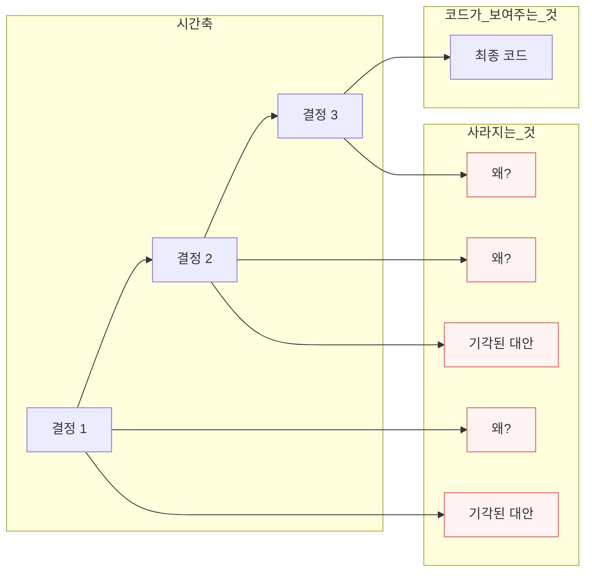
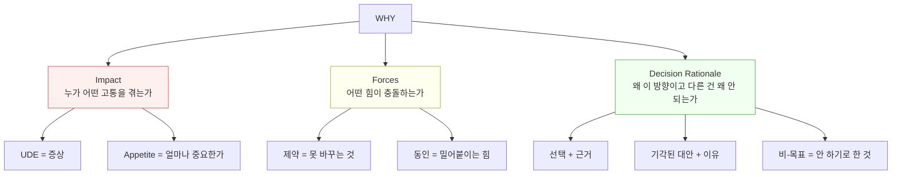

# WHY를 구조적으로 기록하는 IT 문서 산출물 — 비교 분석

> 작성일: 2026-03-24
> 맥락: PRD에 discuss의 WHY가 구조적으로 이식되도록 개선하려는 논의에서, 업계 대표 WHY 기록 형식을 조사

> **Situation** — 코드에서 추출 가능한 건 WHAT(산출물)과 HOW(인터페이스)뿐이다. WHY(동기, 결정 근거, 기각 이유)는 사람이 써야 한다.
> **Complication** — 현재 PRD ① 동기는 Given/When/Then(증상 시나리오)만 구조화되어 있어, impact와 decision rationale이 빠진다.
> **Question** — 업계에서는 WHY를 어떤 형식으로 기록하고, 우리 PRD에 어떻게 적용할 수 있는가?
> **Answer** — 6가지 대표 형식이 있으며, 핵심은 **Context(힘의 장) + Decision(선택) + Alternatives(기각 이유)**의 3요소다. 우리 PRD에는 ADR의 구조를 가장 가볍게 녹일 수 있다.

---

## Why — 왜 WHY 기록 형식이 필요한가

소프트웨어는 결정의 연쇄다. 코드는 **마지막 결정의 결과**만 보여주고, 왜 그 결정을 했는지, 다른 선택지가 뭐였는지, 어떤 제약이 있었는지는 사라진다.



6개월 후 "왜 이렇게?" 또는 "이걸 바꿔도 되나?"라는 질문에 답하려면, WHY가 코드 옆에 구조적으로 남아 있어야 한다.

---

## How — 6가지 대표 형식의 구조

### 1. ADR (Architecture Decision Record) — Nygard 원형

Michael Nygard가 2011년 제안한 가장 기본적인 결정 기록 형식.

| 섹션 | 내용 | WHY 기여도 |
|------|------|-----------|
| **Title** | 짧은 명사구 (예: "ADR 9: LDAP for Multitenant") | — |
| **Context** | 힘의 장(forces) 서술. 기술적·정치적·사회적 요인. **가치 중립적** | ★★★★★ |
| **Decision** | "We will…" 능동태로 선택 서술 | ★★★ |
| **Status** | proposed → accepted → deprecated/superseded | — |
| **Consequences** | 긍정·부정·중립 결과 모두 나열 | ★★★★ |

**핵심 특징:**
- 1-2페이지. 구어체. 마크다운.
- "하나의 ADR의 consequences가 다음 ADR의 context가 된다" — 결정의 연쇄를 추적하는 구조
- 가장 가벼움. 5분이면 쓸 수 있음

**WHY를 잡는 메커니즘:** Context의 "forces in tension" — 서로 충돌하는 힘을 명시하면 왜 그 선택이 불가피했는지가 드러남

---

### 2. MADR (Markdown ADR) — 구조화된 ADR

ADR의 진화형. 선택지 비교와 decision drivers를 구조화.

| 섹션 | 필수 | 내용 |
|------|------|------|
| **Context and Problem Statement** | ✅ | 2-3문장 상황 서술 |
| **Decision Drivers** | 선택 | 결정을 밀어붙이는 힘/관심사 목록 |
| **Considered Options** | ✅ | 선택지 나열 (평가 없이) |
| **Decision Outcome** | ✅ | "Chosen option: {X}, because {justification}" |
| **Pros and Cons of Options** | 선택 | Good/Bad/Neutral로 각 선택지 평가 |
| **Confirmation** | 선택 | 결정이 올바르게 구현됐는지 검증 방법 |

**Y-Statement 패턴** (MADR의 씨앗):
```
In the context of {use case},
  facing {concern},
  we decided for {option}
  to achieve {quality},
  accepting {downside},
  because {additional rationale}.
```

**WHY를 잡는 메커니즘:** Decision Drivers(왜 이게 중요한가) + Considered Options(왜 다른 걸 안 했는가)의 조합

---

### 3. Google Design Doc

Google 내부 소프트웨어 엔지니어링 문화의 핵심 도구.

| 섹션 | 내용 | WHY 기여도 |
|------|------|-----------|
| **Context and Scope** | 배경 사실. 뭘 만드는지 러프한 전경 | ★★★ |
| **Goals and Non-Goals** | 목표 + **명시적 비-목표** | ★★★★★ |
| **Design** | 실제 설계. **trade-off를 기록하는 곳** | ★★★★ |
| **Alternatives Considered** | 다른 접근법과 **각각의 기각 이유** | ★★★★★ |
| **Cross-Cutting Concerns** | 보안, 프라이버시, 관측성 | ★★ |

**핵심 특징:**
- 비교적 비공식적. 코딩 전에 작성.
- Non-Goals가 강력 — "할 수 있지만 안 하기로 한 것"이 WHY의 경계를 그림
- Alternatives Considered가 WHY의 핵심 — "왜 이 방향인가"의 직접적 답

**WHY를 잡는 메커니즘:** Goals/Non-Goals(무엇이 중요하고 무엇이 아닌가) + Alternatives(왜 다른 걸 버렸는가)

---

### 4. Amazon PR/FAQ (Working Backwards)

완성된 미래에서 역방향으로 사고하여 WHY를 강제하는 형식.

| 섹션 | 내용 | WHY 기여도 |
|------|------|-----------|
| **Headline + Subtitle** | 발표 제목 + 혜택 한 줄 | ★★★ |
| **Problem Paragraph** | 고객 고통 Top 2-3. **솔루션 언급 금지** | ★★★★★ |
| **Solution Paragraph** | 각 고통에 대한 해법 | ★★★ |
| **Leader Quote** | "왜 우리 회사가 이걸 하는가" | ★★★★ |
| **How It Works** | 작동 방식 | ★★ |
| **Customer Quote** | 가상 고객 증언 | ★★ |
| **Internal FAQ** | 내부 이해관계자 질문 | ★★★★ |
| **Customer FAQ** | 사용자 질문 예상 | ★★★ |

**핵심 특징:**
- 내러티브 강제 — 불릿 포인트 금지, 6페이지 산문
- Problem paragraph에서 **솔루션 없이 고통만 서술** — WHY가 WHAT보다 먼저
- FAQ가 "왜 이렇게 안 했어?"를 미리 답함

**WHY를 잡는 메커니즘:** Problem-first 구조 + FAQ의 사전 반박

---

### 5. Shape Up Pitch (Basecamp)

제약(appetite)과 문제를 먼저 정의하고, 솔루션을 그 안에서 도출.

| 섹션 | 내용 | WHY 기여도 |
|------|------|-----------|
| **Problem** | "왜 현 상태가 안 되는가" — 단일 구체 스토리 | ★★★★★ |
| **Appetite** | 시간 제약 (2-6주). 솔루션의 형태를 결정 | ★★★★ |
| **Solution** | 핵심 요소만. 즉시 이해 가능한 형태 | ★★ |
| **Rabbit Holes** | 비자명한 복잡성. 빠질 수 있는 함정 | ★★★ |
| **No-gos** | 의도적 제외 항목 | ★★★★ |

**핵심 특징:**
- Appetite이 독특 — "이 문제에 얼마만큼 투자할 가치가 있는가?"가 WHY의 일부
- No-gos ≈ Google의 Non-Goals — 경계가 WHY를 선명하게 함

**WHY를 잡는 메커니즘:** Problem(왜 바꿔야 하는가) + Appetite(얼마나 중요한가) + No-gos(뭘 안 하는가)

---

### 6. RFC (Request for Comments)

팀 전체의 피드백을 구하는 제안 문서.

| 섹션 | 내용 | WHY 기여도 |
|------|------|-----------|
| **Summary** | 한 단락 요약 | ★★ |
| **Motivation** | 왜 이 변경이 필요한가 | ★★★★★ |
| **Detailed Design** | 구체적 설계 | ★★ |
| **Drawbacks** | 이 제안의 단점 | ★★★★ |
| **Alternatives** | 다른 접근과 기각 이유 | ★★★★★ |
| **Unresolved Questions** | 아직 모르는 것 | ★★★ |

**핵심 특징:**
- Motivation이 가장 중요한 섹션 — 여기서 설득 못 하면 나머지가 무의미
- Drawbacks를 작성자 본인이 씀 — self-critique 강제
- Unresolved Questions — "모른다"를 명시적으로 기록

**WHY를 잡는 메커니즘:** Motivation(왜 필요한가) + Alternatives(왜 이 방향인가) + Drawbacks(이 방향의 대가는)

---

## What — WHY의 3요소와 형식별 커버리지

모든 형식을 관통하는 WHY의 구성 요소:



| 형식 | Impact | Forces | Decision Rationale | 무게 |
|------|--------|--------|-------------------|------|
| **ADR (Nygard)** | 🟡 암시적 | 🟢 Context | 🟡 Decision만 (대안 없음) | 극경량 |
| **MADR** | 🟡 Problem Statement | 🟢 Decision Drivers | 🟢 Options + Outcome | 경량 |
| **Google Design Doc** | 🟢 Goals/Non-Goals | 🟡 Context | 🟢 Alternatives Considered | 중량 |
| **Amazon PR/FAQ** | 🟢 Problem Paragraph | 🟡 암시적 | 🟢 Internal FAQ | 중량 |
| **Shape Up Pitch** | 🟢 Problem + Appetite | 🟡 Rabbit Holes | 🟢 No-gos | 경량 |
| **RFC** | 🟢 Motivation | 🟡 암시적 | 🟢 Alternatives + Drawbacks | 중량 |

---

## If — 프로젝트에 대한 시사점

### 현재 PRD ① 동기 vs 업계 형식

| WHY 3요소 | 현재 PRD ① 동기 | 업계 형식의 공통점 |
|-----------|----------------|------------------|
| **Impact** | Given/When/Then = UDE(증상) | Problem paragraph, Motivation, Goals |
| **Forces** | ❌ 없음 | Context(ADR), Decision Drivers(MADR) |
| **Decision Rationale** | ❌ 없음 | Alternatives Considered, Non-Goals, No-gos |

**갭:** 현재 PRD는 "뭐가 안 되는가"(Impact의 UDE)만 있고, "왜 이 방향인가"(Forces + Decision Rationale)가 구조적으로 빠져 있다.

### 적용 방향

이 프로젝트의 특성(1인 개발, discuss→PRD 파이프라인, AI 파트너)을 고려하면:

1. **ADR의 Context(forces in tension)** → discuss 이해도 테이블의 "원인 + 제약"에서 자동 추출 가능
2. **MADR의 Considered Options + Decision Outcome** → discuss에서 논의된 선택지와 결론
3. **Google의 Non-Goals / Shape Up의 No-gos** → discuss의 "목표"에서 의도적 제외를 분리

무거운 형식(PR/FAQ 6페이지, RFC 전체)은 과잉. **ADR + MADR의 핵심 요소만** PRD ① 동기에 녹이는 게 현실적이다.

### discuss → PRD 매핑 제안

| discuss 이해도 테이블 | PRD ① 동기 확장 |
|---------------------|----------------|
| 목적 | **Impact** — 이게 안 되면 누가 고통 |
| 현재 Given/When/Then | **UDE** — 증상 시나리오 (유지) |
| 원인 + 제약 | **Forces** — 충돌하는 힘과 고정 조건 |
| 목표 (바꿀 것 + 안 바꿀 것) | **Decision** — 선택 + 기각 대안 + 비-목표 |

---

## Insights

- **"Consequences of one ADR become the context for the next"** — ADR의 연쇄 구조는 결정 간 인과를 추적하는 유일한 형식. 다른 형식은 단일 결정에 집중한다. 우리 프로젝트에서 PROGRESS.md의 Gaps가 다음 discuss의 시작점이 되는 것과 같은 구조.
- **Non-Goals가 WHY의 숨은 강자** — Google과 Shape Up 모두 "안 하기로 한 것"을 명시한다. "왜 이걸 했는가"보다 "왜 이걸 안 했는가"가 6개월 후 더 유용하다. 코드에 없는 것은 코드에서 발견할 수 없기 때문.
- **Y-Statement는 한 문장 WHY** — "In the context of X, facing Y, we decided for Z, to achieve W, accepting V, because U." PRD 동기 행 하나를 이 패턴으로 강제하면 WHY가 빠질 수 없다.
- **Amazon PR/FAQ의 "솔루션 없이 고통만"** — Problem paragraph에서 솔루션 언급을 금지하는 규칙은, discuss에서 해결(9)보다 목적(1)~문제(5)를 먼저 채우는 현재 스킬 구조와 일치한다.

---

## Sources

| # | 출처 | 유형 | 핵심 내용 |
|---|------|------|----------|
| 1 | [Documenting Architecture Decisions — Michael Nygard](https://www.cognitect.com/blog/2011/11/15/documenting-architecture-decisions) | 원저 블로그 | ADR 원형 5섹션 정의 |
| 2 | [About MADR](https://adr.github.io/madr/) | 공식 문서 | MADR 템플릿 필수/선택 섹션 |
| 3 | [The MADR Template Explained and Distilled](https://ozimmer.ch/practices/2022/11/22/MADRTemplatePrimer.html) | 저자 블로그 | Y-Statement → MADR 진화 과정, Decision Drivers 상세 |
| 4 | [Design Docs at Google](https://www.industrialempathy.com/posts/design-docs-at-google/) | 내부자 블로그 | Google Design Doc 구조, Goals/Non-Goals, Alternatives |
| 5 | [Working Backwards: The Amazon PR/FAQ](https://productstrategy.co/working-backwards-the-amazon-prfaq-for-product-innovation/) | 분석 블로그 | PR/FAQ 구조, Problem-first 접근 |
| 6 | [Write the Pitch — Shape Up](https://basecamp.com/shapeup/1.5-chapter-06) | 공식 문서 | Pitch 5요소, Problem + Appetite + No-gos |
| 7 | [ADR Templates](https://adr.github.io/adr-templates/) | 공식 문서 | ADR 템플릿 변형 목록 |
| 8 | [RFCs and Design Docs — Pragmatic Engineer](https://newsletter.pragmaticengineer.com/p/rfcs-and-design-docs) | 뉴스레터 | RFC/Design Doc 실제 기업 사례 |

---

## Walkthrough

> 이 조사를 프로젝트에서 직접 활용하려면?

1. **현재 PRD 확인** — `docs/superpowers/specs/archive/` 아무 PRD의 ① 동기를 열어 Given/When/Then만 있는지 확인
2. **discuss 이해도 테이블 대조** — 같은 주제의 discuss 대화에서 "목적, 원인, 제약, 목표"가 PRD에 얼마나 이식됐는지 비교
3. **Y-Statement 시도** — 하나의 동기 행을 "In the context of X, facing Y, we decided for Z, accepting W, because U" 패턴으로 다시 써보기
4. **갭 확인** — Forces(충돌하는 힘)와 Decision Rationale(기각된 대안)이 어디에도 없다면, 그게 현재 구조의 정확한 빈칸
