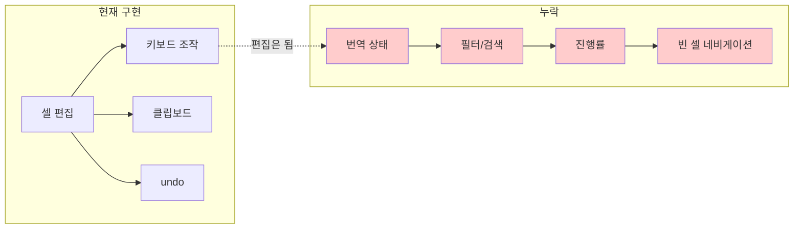
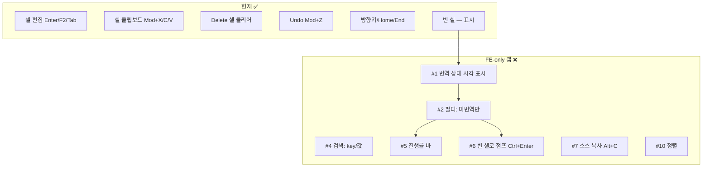

# i18n Editor FE 기능 — 상용 서비스 대비 갭 분석

> 작성일: 2026-03-25
> 맥락: PageI18nEditor 개밥먹기 후 상용 서비스 대비 누락 기능 식별

> **Situation** — i18n Editor가 cellEdit plugin 기반 스프레드시트 편집을 제공하고, 27개 통합 테스트로 검증됐다.
> **Complication** — 상용 i18n 서비스(Crowdin, Lokalise, Tolgee, SimpleLocalize)와 비교하면 "편집"만 있고 "관리" 기능이 없다.
> **Question** — FE 조작 관점에서 필수적으로 갖춰야 할 기능은 무엇이고, 현재 무엇이 빠져 있는가?
> **Answer** — 번역 상태 표시, 필터/검색, 진행률 표시가 3대 필수 갭이다. 나머지(TM, 용어집, QA, 협업)는 백엔드 의존이라 FE 조작 scope 밖.

---

## Why — 왜 편집만으로 부족한가

상용 i18n 서비스의 에디터는 "번역 입력" + "번역 관리"가 결합된 도구다. 번역자는 시간의 50% 이상을 **미번역 항목 찾기, 상태 확인, 필터링**에 쓴다. 입력 UX가 아무리 좋아도 "어디를 번역해야 하는지"를 모르면 쓸모없다.

---

## How — 상용 서비스의 FE 기능 분류

조사한 5개 서비스(Crowdin, Lokalise, Tolgee, SimpleLocalize, Locize)의 FE 기능을 **백엔드 불필요 / 백엔드 필요**로 나누면:

### FE-only (프론트엔드 조작만으로 구현 가능)

| # | 기능 | 설명 | Crowdin | Lokalise | Tolgee | SimpleLocalize |
|---|------|------|---------|----------|--------|----------------|
| 1 | **번역 상태 표시** | 셀별 상태(미번역/번역됨/검수됨) 시각 표시 | ✅ 컬러 코드 | ✅ 아이콘 | ✅ 상태 배지 | ✅ 리뷰 상태 |
| 2 | **필터: 미번역만** | 빈 셀이 있는 행만 보기 | ✅ | ✅ | ✅ | ✅ |
| 3 | **필터: 언어별** | 특정 언어 열만 표시/숨기기 | ✅ 열 커스텀 | ✅ bilingual | ✅ | ✅ |
| 4 | **검색: key/값** | key 이름이나 번역 값으로 검색 | ✅ Ctrl+F | ✅ | ✅ | ✅ Ctrl+/ |
| 5 | **진행률 표시** | 언어별 번역 완성도 % | ✅ 원형 배지 | ✅ | ✅ | ✅ 정렬 |
| 6 | **빈 셀로 점프** | 다음 미번역 셀로 바로 이동 | ✅ 자동 이동 | ✅ | — | — |
| 7 | **소스 복사** | 원본 값을 번역 필드에 복사 (Alt+C) | ✅ Alt+C | ✅ Insert source | — | — |
| 8 | **placeholder 보호** | `{name}` 같은 변수를 편집 불가 블록으로 표시 | ✅ 블록 표시 | ✅ 블록 표시 | ✅ 누락 감지 | — |
| 9 | **글자 수 제한** | key별 최대 길이 표시/경고 | ✅ | ✅ | — | — |
| 10 | **정렬** | key 알파벳, 최근 수정, 미번역 우선 등 | ✅ | — | — | ✅ 다양 |
| 11 | **Ctrl+Enter 저장+다음** | 편집 confirm 후 다음 미번역으로 자동 이동 | ✅ | ✅ | — | — |

### 백엔드 필요 (FE scope 밖)

| 기능 | 설명 | 비고 |
|------|------|------|
| Translation Memory (TM) | 유사 번역 제안 | DB 필요 |
| Machine Translation (MT) | Google/DeepL 연동 | API 키 필요 |
| 용어집 (Glossary) | 용어 일관성 관리 | 별도 데이터 |
| QA 자동 검증 | placeholder 누락, 구두점 불일치 | 규칙 엔진 |
| 코멘트/협업 | 번역자 간 토론 | 실시간 통신 |
| 버전 히스토리 | 번역 변경 이력 | DB 필요 |
| 권한/워크플로 | 번역자/검수자 역할 | 인증 필요 |

---

## What — 우리 구현 대비 갭 매트릭스

### 상세 갭 분석

| # | 기능 | 현재 상태 | 구현 난이도 | 우선순위 | 이유 |
|---|------|----------|-----------|---------|------|
| **1** | **번역 상태 표시** | 빈 셀에 "—" + `cell-empty` class만 | 낮 | **P0** | 모든 필터/진행률의 기반. 셀에 미번역/번역됨 상태 표시 |
| **2** | **필터: 미번역만** | 없음 | 중 | **P0** | 번역자의 1순위 동작. "빈 칸 어디 있어?" |
| **3** | **필터: 언어별** | 없음 (4열 고정) | 낮 | P1 | 한 언어 집중 번역 시 필요 |
| **4** | **검색: key/값** | 없음 | 중 | **P0** | 특정 텍스트 찾기. Ctrl+F |
| **5** | **진행률 표시** | 없음 | 낮 | P1 | 언어별 번역 % 바. 상태 데이터에서 파생 |
| **6** | **빈 셀로 점프** | 없음 | 중 | P1 | Ctrl+Enter = 다음 미번역 셀로 이동. Crowdin 핵심 워크플로 |
| **7** | **소스 복사** | Mod+C로 셀 복사는 가능 | 낮 | P2 | Alt+C로 ko 값을 현재 셀에 복사. 편의 기능 |
| **8** | **placeholder 보호** | 없음 | 중 | P2 | `{name}` 같은 변수 실수 편집 방지. 현재 CMS 데이터에 변수 없음 |
| **9** | **글자 수 제한** | 없음 | 낮 | P2 | key별 maxLength 표시. UI 공간 제약 관리용 |
| **10** | **정렬** | 없음 (CMS 순서 고정) | 중 | P1 | 미번역 우선, 알파벳순, 최근 수정순 |
| **11** | **Ctrl+Enter 저장+다음 미번역** | Enter = 아래 이동 (모든 행) | 중 | P1 | 번역 워크플로 전용 단축키. 빈 셀 건너뛰기 |

---

## If — 프로젝트 시사점

### P0 필수 (번역 도구로서 최소 요건)

1. **번역 상태 표시** — `cell-empty` class가 이미 있으므로, 미번역/번역됨 2상태를 셀 배경색으로 표시. CSS만으로 가능.
2. **필터: 미번역만** — Grid 데이터를 필터링하여 빈 셀 있는 행만 표시. store 필터 또는 UI 토글.
3. **검색** — key 또는 번역 값으로 행 필터. Ctrl+F 바인딩. input + Grid 데이터 필터.

### P1 편의 (번역 효율)

4. 진행률 바 — 언어별 (번역된 셀 / 전체 셀) %. 상태 데이터에서 계산.
5. 빈 셀로 점프 — Ctrl+Enter로 다음 미번역 셀 focusNext 반복.
6. 정렬 — NormalizedData의 relationships 순서를 재배열.
7. 필터: 언어별 — I18N_COLUMNS에서 열 show/hide.

### P2 고급 (있으면 좋은)

8. 소스 복사 (Alt+C)
9. placeholder 보호
10. 글자 수 제한

### interactive-os 관점

P0 기능 중 **검색/필터**는 Grid 컴포넌트의 범용 기능이 될 수 있다. i18n Editor 전용이 아니라 **Grid에 filtering API를 추가**하면 다른 Grid 소비자도 혜택을 받는다. 이건 cellEdit과 같은 레벨의 범용 플러그인이 될 수 있다.

---

## Insights

- **Ctrl+Enter(저장+다음 미번역)가 핵심 워크플로**: Crowdin/Lokalise 모두 "auto-advance to next untranslated"를 옵션으로 제공. 일반 Enter(아래 이동)와 구분되는 **번역 전용 네비게이션**. 우리의 cellEdit Enter=아래 이동과 공존 가능.
- **필터가 편집보다 중요할 수 있다**: 상용 서비스의 필터 옵션이 10개 이상인 이유는, 번역자 시간의 절반 이상이 "어디를 작업할지 찾기"에 소비되기 때문. 편집 UX는 이미 충분하고, 발견(discovery) UX가 다음 병목.
- **상태 = 필터의 기반**: 번역 상태(미번역/번역됨/검수됨)가 없으면 필터도, 진행률도, 자동 이동도 구현 불가. 상태가 모든 관리 기능의 전제 조건.

---

## Sources

| # | 출처 | 유형 | 핵심 내용 |
|---|------|------|----------|
| 1 | [Crowdin Editor Overview](https://support.crowdin.com/online-editor/) | 공식 문서 | 키보드 단축키, 필터 12종, QA 체크, WYSIWYG 프리뷰 |
| 2 | [Lokalise Translation Editor](https://docs.lokalise.com/en/articles/6854191-translation-editor) | 공식 문서 | bilingual/multilingual 뷰, placeholder 블록, AI 제안 |
| 3 | [Tolgee Translator Features](https://tolgee.io/features/translators) | 공식 문서 | 3단계 상태, 용어집, Translation Memory |
| 4 | [SimpleLocalize Filters & Sorting](https://simplelocalize.io/docs/translation-editor/filters/) | 공식 문서 | 정렬 9종(알파벳/미번역 우선/최근 수정), 검색 Ctrl+/ |
| 5 | [Crowdin Features](https://crowdin.com/features/translators-workbench) | 제품 페이지 | Multilingual Grid 모드, 열 커스텀, 자동 이동 |
| 6 | [Top 10 TMS Tools 2026](https://www.bestdevops.com/top-10-translation-management-systems-tms-tools-in-2025-features-pros-cons-comparison/) | 비교 리뷰 | 9개 TMS 기능 비교 |

---

## Walkthrough

> 현재 i18n Editor에서 갭을 직접 체감하려면?

1. `http://localhost:5173/i18n` 접속
2. en 열을 보면 대부분 빈 셀("—")임을 확인
3. **빈 셀만 모아보고 싶다** → 필터 없음, 스크롤로 찾아야 함 (갭 #2)
4. **특정 key를 찾고 싶다** → Ctrl+F가 브라우저 검색을 트리거함, Grid 내 검색 아님 (갭 #4)
5. **전체 진행률을 보고 싶다** → 표시 없음 (갭 #5)
6. **다음 빈 셀로 바로 가고 싶다** → Enter가 모든 행을 순회함, 빈 셀만 건너뛰기 불가 (갭 #6)
