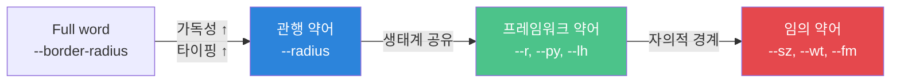
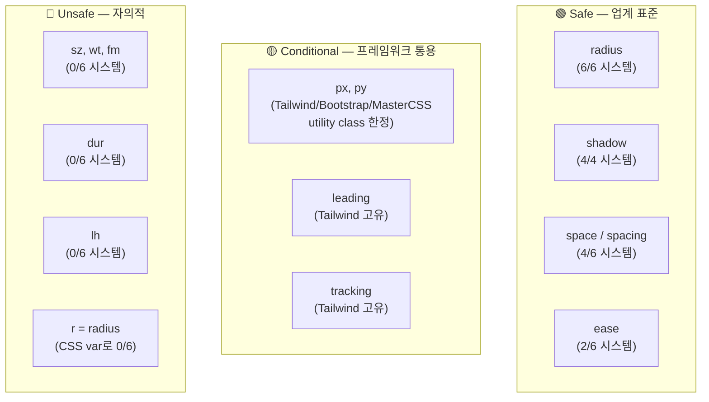

# CSS 디자인 토큰 네이밍 약어 관행 — 주요 시스템 비교

> 작성일: 2026-03-25
> 맥락: DESIGN.md 5개 번들의 축 이름에 통용 약어 vs 자의적 약어를 구분하기 위한 근거 조사

> **Situation** — 디자인 토큰 네이밍에서 약어 사용은 보편적이나, 시스템마다 약어 경계가 다르다.
> **Complication** — 우리 번들 축 이름이 shape는 극축약(-r, -py, -px), type은 혼합(-size, -lh), motion은 full(-duration, -easing)로 불일치.
> **Question** — 업계에서 통용되는 약어의 경계는 어디인가? 어떤 약어가 safe하고, 어떤 것이 자의적인가?
> **Answer** — `r`, `py`, `px`, `lh`는 프레임워크 생태계에서 통용. `sz`, `wt`, `fm`, `dur`는 어디서도 안 쓰임. full word가 기본, 통용 약어만 예외.

---

## Why — 약어가 문제가 되는 이유

CSS custom property는 IDE 자동완성에 의존하는 API. 이름이 곧 인터페이스다.

약어가 만드는 두 가지 위험:
1. **학습 비용**: 새로운 사람이 `--shape-md-r`을 보고 radius를 떠올리려면 사전 지식 필요
2. **일관성 붕괴**: 같은 시스템 안에서 "어디까지 줄이는가"의 기준이 없으면 축마다 다른 규칙

---

## How — 주요 디자인 시스템의 약어 정책

### 비교표: 속성별 네이밍

| CSS property | Tailwind v4 | Open Props | Radix Themes | Primer (GitHub) | Spectrum (Adobe) | SLDS (Salesforce) |
|---|---|---|---|---|---|---|
| **font-size** | `--text-*` | `--font-size-*` | `--font-size-*` | `fontSize` | `--font-size-*` | `--fontSize` |
| **font-weight** | `--font-weight-*` | `--font-weight-*` | `--font-weight-*` | `fontWeight` | — | — |
| **line-height** | `--leading-*` | `--font-lineheight-*` | `--line-height-*` | `lineHeight` | — | — |
| **font-family** | `--font-*` | `--font-*` | `--default-font-family` | — | — | — |
| **letter-spacing** | `--tracking-*` | `--font-letterspacing-*` | `--letter-spacing-*` | — | — | — |
| **border-radius** | `--radius-*` | `--radius-*` | `--radius-*` | — | `--corner-radius-*` | `--radius-border-*` |
| **padding** | utility `px-*` `py-*` | — | — | — | — | — |
| **spacing** | `--spacing` | `--size-*` | `--space-*` | `size` | — | `--spacing-*` |
| **duration** | — | `--duration-*` | — | — | — | — |
| **easing** | `--ease-*` | `--ease-*` | — | — | — | — |
| **shadow** | `--shadow-*` | `--shadow-*` | — | `shadow` | — | — |

### 패턴 분석

**모든 시스템이 공유하는 약어:**
- `radius` (border-radius에서 border- 탈락) — **6/6 시스템**
- `shadow` (box-shadow에서 box- 탈락) — **4/4 시스템**

**Tailwind만의 약어 (utility class 유래):**
- `leading` = line-height — Tailwind 고유, 나머지는 `line-height` 또는 `lineheight`
- `tracking` = letter-spacing — Tailwind 고유, 나머지는 `letter-spacing`
- `text` = font-size — Tailwind 고유, 나머지는 `font-size`

**utility class에서 통용 (Tailwind + Bootstrap + Master CSS):**
- `px` = padding-x (horizontal) — **3개 프레임워크**
- `py` = padding-y (vertical) — **3개 프레임워크**
- `r` = radius — Tailwind utility `rounded-*` 내부에서만, CSS variable로는 `--radius-*`

**어디서도 CSS custom property로 쓰이지 않는 약어:**
- `sz` (size), `wt` (weight), `fm` (family), `dur` (duration) — **0/6 시스템**
- `lh` (line-height) — CSS custom property로는 0/6, 하지만 CSS shorthand `font:` 논의에서 간혹 언급

---

## What — 약어 안전 등급

### 상세 판정

| 약어 | 원본 | 판정 | 근거 |
|------|------|------|------|
| `radius` | border-radius | 🟢 | 6/6 시스템. CSS `border-radius` 자체가 radius를 포함 |
| `shadow` | box-shadow | 🟢 | 보편적. CSS property에서 box- 탈락은 관행 |
| `space` | spacing | 🟢 | Radix, Bootstrap 등. `spacing`도 OK (Tailwind, SLDS) |
| `ease` | easing / timing-function | 🟢 | Tailwind, Open Props. CSS `ease-in` 자체가 약어 |
| `px`, `py` | padding-x, padding-y | 🟡 | utility class에서 통용. CSS var 이름으로는 드묾 |
| `leading` | line-height | 🟡 | Tailwind만. 타이포그래피 전문 용어(활자 간격)라 의미는 정확 |
| `r` | radius | 🔴 | CSS variable 이름으로 사용하는 시스템 0개 |
| `lh` | line-height | 🔴 | CSS variable 이름으로 사용하는 시스템 0개 |
| `sz` | size | 🔴 | 어디서도 안 씀 |
| `wt` | weight | 🔴 | 어디서도 안 씀 |
| `fm` | family | 🔴 | 어디서도 안 씀 |
| `dur` | duration | 🔴 | Open Props조차 `--duration-*` full word |

---

## If — 프로젝트 시사점

### 우리 번들의 현재 vs 업계 기준

| 번들 | 현재 축 이름 | 업계 기준 대비 | 제안 |
|------|-------------|---------------|------|
| **shape** | `-r`, `-py`, `-px` | `r` 🔴, `py`/`px` 🟡 | `-radius`, `-py`, `-px` |
| **type** | `-size`, `-weight`, `-family`, `-lh` | size/weight/family 🟢, `lh` 🔴 | `-size`, `-weight`, `-family`, `-line-height` |
| **motion** | `-duration`, `-easing` | 둘 다 🟢 full word | 유지 ✓ |
| **tone** | `-hover`, `-dim`, `-foreground` | modifier, 약어 아님 | 유지 ✓ |
| **surface** | level 이름 (base~outlined) | 약어 아님 | 유지 ✓ |

### 적용 규칙 제안

1. **CSS property 이름에서 파생된 약어만 허용**: `radius`(←border-radius), `shadow`(←box-shadow), `ease`(←timing-function)
2. **utility class 관행 약어는 허용**: `px`, `py` (Tailwind/Bootstrap 3개+ 프레임워크)
3. **임의 축약 금지**: `r`, `lh`, `sz`, `wt`, `fm`, `dur` — 어떤 시스템에서도 CSS variable 이름으로 안 쓰임
4. **full word가 기본**: 의심스러우면 줄이지 않는다

---

## Insights

- **Tailwind의 `leading`/`tracking`은 전통 타이포그래피 용어**를 부활시킨 독특한 선택이다. 활자 조판에서 leading=행간, tracking=자간은 정확한 용어지만, CSS 세계에서는 Tailwind 사용자만 알아듣는다. 우리 시스템에서 채택하려면 Tailwind 의존성을 전제해야 한다.
- **Open Props는 "clarity over brevity"를 명시적 원칙으로 채택**. `--font-lineheight-*`처럼 중복처럼 보여도 full word를 고수한다. 약어 유혹을 가장 강하게 거부하는 시스템.
- **`px`/`py`는 CSS 표준이 아니라 프레임워크 관행**이다. CSS에는 `padding-inline`/`padding-block`이 있고, 이것이 논리적 방향(logical properties) 기준. 하지만 `px`/`py`가 Tailwind+Bootstrap+MasterCSS에서 통용되어 사실상 표준.
- **번들 내 축 이름이 일관적인 시스템은 없다** — 대부분 번들(composite token) 개념 자체가 없고, 개별 토큰만 나열. 우리의 번들 구조는 독자적이므로, 축 네이밍 규칙도 우리가 정의해야 한다.

---

## Sources

| # | 출처 | 유형 | 핵심 내용 |
|---|------|------|----------|
| 1 | [Tailwind v4 Theme Variables](https://tailwindcss.com/docs/theme) | 공식 문서 | `--text-*`, `--radius-*`, `--leading-*`, `--font-weight-*` 네이밍 |
| 2 | [Open Props](https://open-props.style/) | 공식 사이트 | `--font-size-*`, `--font-lineheight-*`, `--radius-*` — clarity over brevity |
| 3 | [Radix Themes Typography](https://www.radix-ui.com/themes/docs/theme/typography) | 공식 문서 | `--font-size-*`, `--font-weight-*`, `--space-*`, `--radius-*` |
| 4 | [Radix Themes Spacing](https://www.radix-ui.com/themes/docs/theme/spacing) | 공식 문서 | `--space-1` ~ `--space-9` |
| 5 | [Radix Themes Radius](https://www.radix-ui.com/themes/docs/theme/radius) | 공식 문서 | `--radius-1` ~ `--radius-6` |
| 6 | [GitHub Primer Token Names](https://primer.style/product/primitives/token-names/) | 공식 문서 | `fontSize`, `fontWeight`, `lineHeight` — camelCase full word |
| 7 | [Adobe Spectrum Design Tokens](https://spectrum.adobe.com/page/design-tokens/) | 공식 문서 | `--spectrum-font-size-*`, `--spectrum-corner-radius-*` |
| 8 | [SLDS Styling Hooks](https://developer.salesforce.com/docs/platform/lwc/guide/create-components-css-custom-properties.html) | 공식 문서 | `--slds-g-spacing-*`, `--slds-g-radius-border-*` |
| 9 | [Smashing Magazine — Naming Best Practices](https://www.smashingmagazine.com/2024/05/naming-best-practices/) | 블로그 | "bg for background is acceptable, clr for color is not" |
| 10 | [Nord Design System Naming](https://nordhealth.design/naming/) | 공식 문서 | `n-space-xl` — t-shirt sizing abbreviation OK |
| 11 | [Nathan Curtis — Naming Tokens in Design Systems](https://medium.com/eightshapes-llc/naming-tokens-in-design-systems-9e86c7444676) | 블로그 | 토큰 분류 체계, category-property-modifier 패턴 |
| 12 | [Tailwind Padding Utilities](https://tailwindcss.com/docs/padding) | 공식 문서 | `px-*`, `py-*` utility class 관행 |

---

## Walkthrough

> 이 조사 결과를 프로젝트에서 직접 확인하려면?

1. `src/styles/tokens.css`를 열어 shape/type/motion 번들 축 이름 확인
2. 🔴 판정 약어 검색: `--shape-xs-r`, `--type-hero-lh` 등
3. 위 "적용 규칙 제안" 표에 따라 rename 대상 식별
4. rename 후 `[data-surface]` 등 소비자 CSS에서 깨지는 곳 없는지 grep
