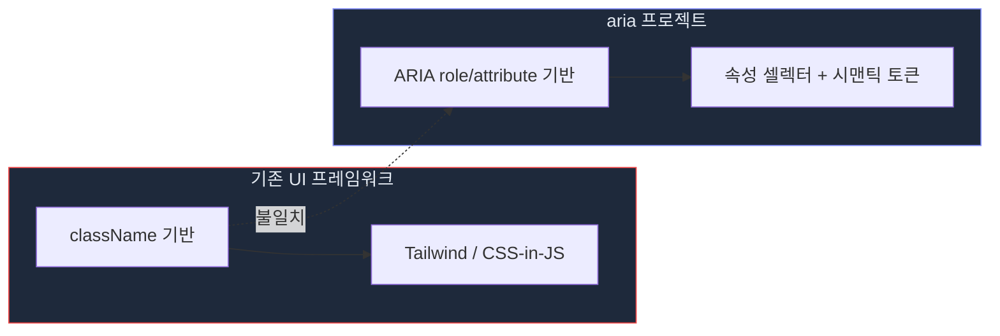
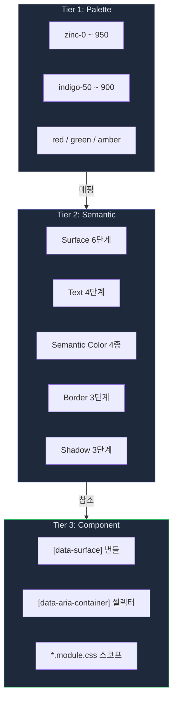
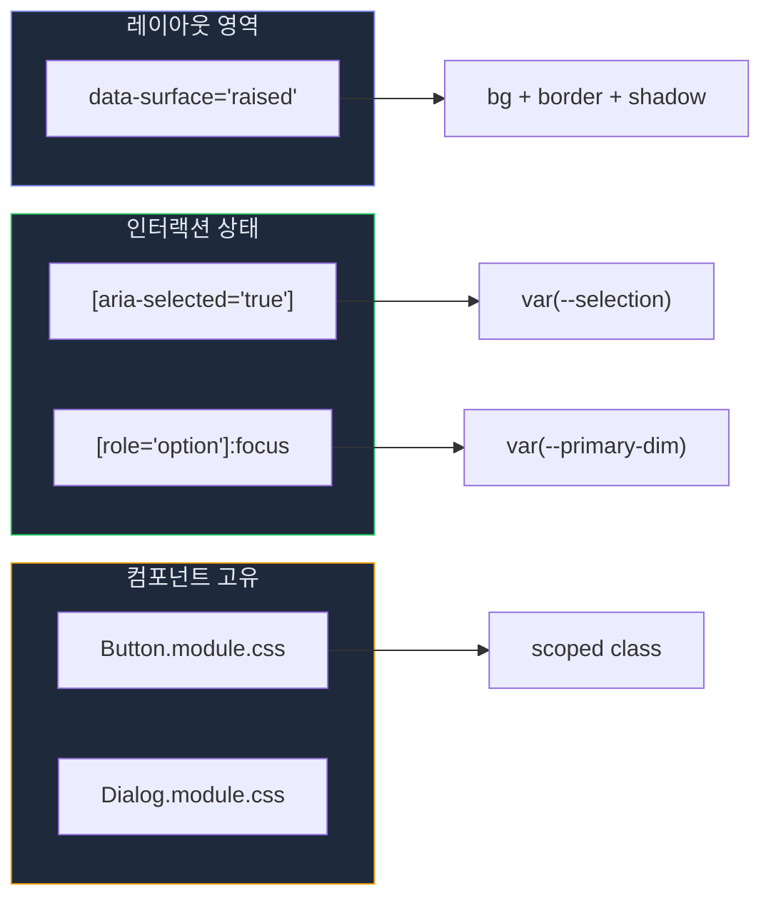
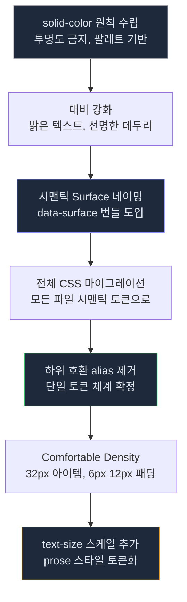

# 디자인 시스템 현황 — aria 프로젝트의 토큰·스타일·컴포넌트 아키텍처

> 작성일: 2026-03-22
> 맥락: 현재까지 구축된 디자인 시스템의 구조, 결정 이유, 현황을 정리한다.

---

## Why — 왜 자체 디자인 시스템이 필요한가

aria 프로젝트는 **ARIA 속성 기반 렌더링 엔진**(interactive-os)을 핵심으로 한다. 컴포넌트가 클래스명이 아닌 `role`, `aria-selected`, `aria-level` 같은 시맨틱 속성으로 렌더링되므로, 기존 UI 라이브러리(Tailwind, MUI 등)의 클래스 기반 스타일링이 맞지 않는다.



**핵심 요구사항 3가지:**
1. **ARIA 속성이 곧 스타일 셀렉터** — `[aria-selected="true"]`로 직접 스타일링
2. **테마 전환** — 다크/라이트 모드, 단일 토큰 소스로 관리
3. **Surface 번들** — 배경+테두리+그림자를 하나의 속성으로 묶어 일관성 보장

---

## How — 3-Tier 토큰 아키텍처

### 전체 구조



| 범례 | 의미 |
|------|------|
| 회색 테두리 | 원시 팔레트 (직접 사용 금지) |
| 보라 테두리 | 시맨틱 토큰 (사용처에서 참조) |
| 초록 테두리 | 컴포넌트 레벨 (실제 적용) |

### Tier 1: Palette — 원색 팔레트

`tokens.css`의 `:root`에 정의된 원시 값. **컴포넌트에서 직접 참조 금지.**

| 계열 | 토큰 | 용도 |
|------|------|------|
| Zinc | `--zinc-0` ~ `--zinc-950` (11단계) | 그레이스케일 전체 |
| Indigo | `--indigo-50` ~ `--indigo-900` (8단계) | Primary 계열 |
| Red | `--red-500`, `--red-600` | Destructive |
| Green | `--green-500`, `--green-900` | Selection |
| Amber | `--amber-500` | Warning |

### Tier 2: Semantic — 의미 기반 토큰

#### Surface 6단계

| 토큰 | 의미 | 번들 |
|------|------|------|
| `--surface-base` | 최하층 배경 (앱 전체) | bg |
| `--surface-sunken` | 움푹 들어간 영역 | bg |
| `--surface-default` | 중립 영역 | bg |
| `--surface-raised` | 떠 있는 패널 | bg + border + shadow |
| `--surface-overlay` | 최상층 (드롭다운, 다이얼로그) | bg + border + shadow |
| `--surface-outlined` | 투명 배경 + 테두리만 | border |

`[data-surface="raised"]` 한 속성으로 bg+border+shadow 세 가지가 동시 적용된다.

#### Text 4단계

| 토큰 | 용도 |
|------|------|
| `--text-bright` | 최고 대비 (헤딩, 강조) |
| `--text-primary` | 본문 기본 |
| `--text-secondary` | 보조 텍스트 |
| `--text-muted` | 최저 우선도 |

#### Semantic Color 4종 (독립 제어)

| 토큰 | 용도 | 파생 |
|------|------|------|
| `--primary` | 버튼, 액센트 | hover, foreground, dim, mid, bright |
| `--focus` | 포커스 링 | 단독 (primary와 독립) |
| `--selection` | 선택 상태 | 녹색 계열 |
| `--destructive` | 삭제/위험 | foreground |

**`--focus`가 `--primary`에서 독립**된 것이 핵심 결정. 포커스 링 색상을 바꿔도 버튼 색상에 영향 없음.

#### 기타

- **Border**: `--border-subtle` / `--border-default` / `--border-strong` (투명도 없는 실색)
- **Shadow**: `--shadow-sm` / `--shadow-md` / `--shadow-lg` (유일하게 opacity 허용)
- **Interactive**: `--bg-hover` / `--bg-active`

### Tier 3: Component — 적용 레벨

**3가지 스타일링 메커니즘이 공존:**

1. **`[data-surface]` 번들** — 레이아웃 영역에 surface 레벨 지정
2. **`[data-aria-container]` 셀렉터** — ARIA 속성으로 인터랙션 상태 스타일링
3. **CSS Modules** — 컴포넌트 고유 스타일 스코핑



---

## What — 현재 구현 상태

### 파일 구조

```
src/styles/
├── tokens.css          (262줄) — Tier 1 팔레트 + Tier 2 시맨틱 + 글로벌 리셋
├── components.css      (254줄) — ARIA 속성 셀렉터 + 인터랙션 상태
├── layout.css          (199줄) — 그리드 레이아웃, ActivityBar, Sidebar
├── app.css             (457줄) — 데모 유틸리티, 페이지 헤더
├── cms.css             (500+줄) — CMS 전용 사이드바, 캔버스, 툴바
└── resizer.css         (27줄)  — 패널 리사이저

src/interactive-os/ui/
├── Button.module.css
├── Combobox.module.css
├── Dialog.module.css
├── Kanban.module.css
├── Slider.module.css
├── Spinbutton.module.css
├── Toaster.module.css
├── Toolbar.module.css
└── Tooltip.module.css    (9개 컴포넌트 모듈)
```

### 테마 시스템

| 항목 | 구현 |
|------|------|
| 기본 테마 | 다크 (`:root` 블록) |
| 라이트 테마 | `[data-theme="light"]` 블록에서 전체 토큰 재정의 |
| 전환 메커니즘 | ActivityBar 버튼 → `localStorage('theme')` 저장 |
| 라이브 편집 | `/theme` 라우트에 Surface Token Editor 존재 |

### 타이포그래피

| 토큰 | 값 | 용도 |
|------|-----|------|
| `--sans` | Manrope, system stack | 기본 본문 |
| `--mono` | SF Mono, Cascadia Code, JetBrains Mono | 코드 |
| `--text-xs` | 10px | 최소 텍스트 |
| `--text-sm` | 11px | 보조 텍스트 |
| `--text-base` | 13px | 기본 (body 기본값) |
| `--text-lg` | 15px | 소제목 |
| `--text-xl` | 20px | 제목 |
| `--text-2xl` | 28px | 대제목 |

### 스페이싱

| 토큰 | 값 |
|------|-----|
| `--space-xs` | 4px |
| `--space-sm` | 8px |
| `--space-md` | 12px |
| `--space-lg` | 16px |
| `--space-xl` | 24px |
| `--space-2xl` | 32px |

### Comfortable Density 기본값

- 아이템 높이: ~32px
- 아이템 패딩: `6px 12px`
- 아이템 간격: 2px (`margin: 1px 0`)
- 라운드: `--radius` 8px / `--radius-sm` 6px / `--radius-xs` 4px

### 구현 진화 타임라인 (커밋 기준)



---

## If — 제약과 향후 방향

### 설계 원칙 (불변)

1. **raw color 직접 사용 금지** — 반드시 시맨틱 토큰 경유
2. **투명도(rgba) 금지** — shadow/backdrop만 예외
3. **Surface 번들 패턴** — bg/border/shadow를 개별 지정하지 않음
4. **ARIA 속성 = 스타일 셀렉터** — 상태 표현에 className 사용 금지
5. **CMS에서 디자인 변경 불가** — 콘텐츠만 편집, 디자인 고정

### 알려진 갭

| 영역 | 상태 | 내용 |
|------|------|------|
| ARIA CSS → 디자인 시스템 레이어 마이그레이션 | 미완 | `components.css`의 ARIA 셀렉터를 체계적 레이어로 정리 필요 |
| `cms.css` 규모 | 비대 | 500줄 이상, 모듈화 검토 필요 |
| `app.css` 데모 코드 | 혼재 | 실 서비스 스타일과 데모용 유틸리티가 같은 파일 |
| 반응형 | 미구현 | 고정 그리드(`48px + 192px + 1fr`), 모바일 미고려 |
| 디자인 토큰 문서화 | 부분적 | `/theme` 라이브 에디터는 있으나 Storybook 등 공식 문서 없음 |

### 참고 자료

- **Surface Token PRD**: `docs/superpowers/prds/2026-03-22-surface-tokens-prd.md`
- **UI 컴포넌트 디자인 스펙**: `docs/superpowers/specs/2026-03-22-ui-components-design.md`
- **Surface 네이밍 리서치**: `docs/3-resources/surfaceElevationNaming.md`
- **Focus Token 회고**: `docs/0-inbox/19-[retro]focus-token-system.md`
