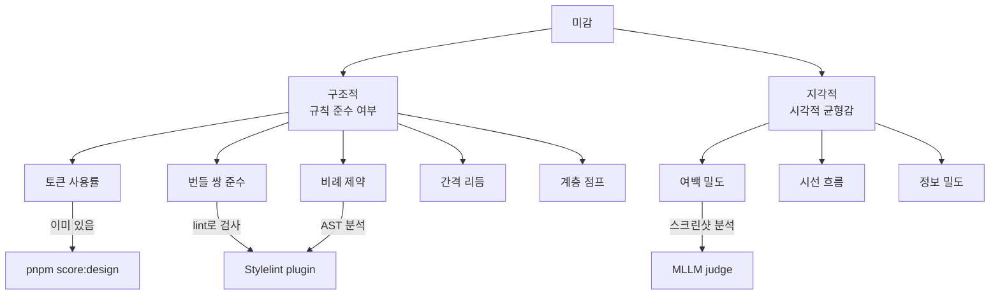
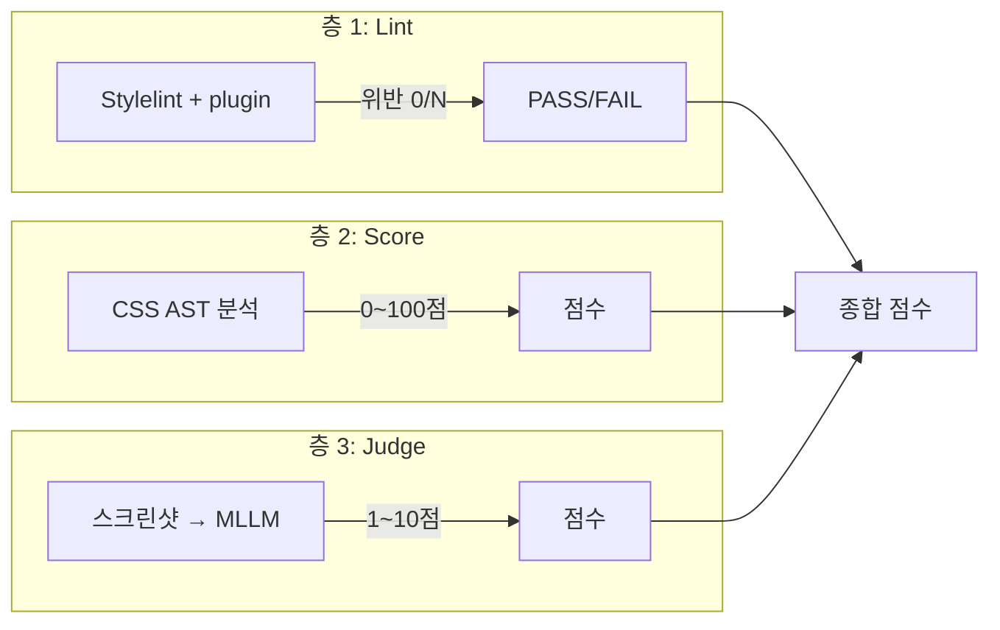

# 디자인 미감 자동 점수화 — 구조적 품질 측정 도구와 방법론

> 작성일: 2026-03-25
> 맥락: 프리미티브 프리뷰 페이지에서 "비율이 안 좋다"는 피드백 → 사람 의존 루프를 자동 점수로 대체할 수 있는가?

> **Situation** — 디자인 시스템의 토큰/번들은 정의되어 있고, `pnpm score:design`으로 토큰 커버리지를 점수화(49→96%)하는 패턴이 이미 존재한다.
> **Complication** — 토큰을 "다 썼는가"는 측정되지만, "잘 썼는가"(비례, 리듬, 계층)는 측정되지 않는다. LLM이 CSS를 작성해도 미감 판단은 사람에게 의존.
> **Question** — 미감을 어떤 축으로 분해하면 프로그래밍으로 측정할 수 있는가?
> **Answer** — 미감의 80%는 "구조적 규칙 준수"로 환원 가능하며, 나머지 20%(지각적 판단)는 MLLM으로 근사할 수 있다. 3층 전략: lint(위반) → score(비율) → judge(지각).

---

## Why — 미감은 왜 측정이 어려운가

미감은 단일 축이 아니라 여러 차원의 합성이다. 문제는 "아름다움"을 직접 측정하려 하면 주관에 갇히지만, **규칙 위반을 측정하면 객관적으로 점수화**할 수 있다는 것.



업계에서 이 문제를 3가지 층으로 접근한다:

| 층 | 도구 유형 | 정확도 | 비용 |
|---|----------|--------|------|
| **Lint** (위반 감지) | Stylelint + 커스텀 플러그인 | 100% (규칙 기반) | 낮음 |
| **Score** (비율 측정) | 커스텀 스크립트 (Project Wallace류) | 높음 | 낮음 |
| **Judge** (지각 평가) | MLLM 스크린샷 분석 | 60~77% (인간 대비) | 높음 |

---

## How — 각 층의 작동 원리

### 층 1: Lint — 위반을 잡는다

**Stylelint 커스텀 플러그인** 접근. 규칙을 코드로 정의하고 위반을 자동 감지한다.

실제 사례:
- **Rhythmguard** — Stylelint 플러그인. 3개 규칙: `use-scale`(값이 승인된 스케일에 있는가), `prefer-token`(raw literal 대신 토큰을 쓰는가), `no-offscale-transform`(모션 값도 스케일에 있는가). postcss-value-parser로 AST 분석, 자동 수정 지원.
- **stylelint-declaration-use-css-custom-properties** — CSS property에 custom property 사용을 강제. `color: #fff` → 위반, `color: var(--text-bright)` → 통과.
- **Figma Design System Auditor** — Figma 플러그인. artboard를 스캔하여 디자인 시스템 준수율을 퍼센트로 산출.

**핵심 패턴:** "허용된 값 목록" + "CSS AST 파싱" + "위반 카운트".

### 층 2: Score — 비율을 측정한다

**Project Wallace** 접근. CSS를 파싱하여 구조적 품질 지표를 산출한다.

3가지 축:
- **Performance** — 파일 크기, 중복 선언, 빈 규칙
- **Maintainability** — 규칙당 선언 수 평균/최대, specificity 일관성
- **Complexity** — 셀렉터 복잡도, !important 비율, ID 셀렉터 비율

각 축을 0~100점으로 환산. 가중 평균으로 전체 점수.

**우리 맥락에서 확장 가능한 축:**
- **번들 준수율** — shape 번들에서 radius만 쓰고 padding은 안 쓰면 감점
- **계층 점프** — type 레벨 간 크기 비율이 DESIGN.md 규칙과 일치하는가
- **비례 제약** — width: 100% 요소에 aspect-ratio나 max-width가 있는가
- **간격 리듬** — gap/padding 값이 spacing 토큰 스케일에 있는가

### 층 3: Judge — 지각을 근사한다

**UICrit / MLLM as UI Judge** 접근. 스크린샷을 MLLM에 주고 점수를 받는다.

UICrit 프레임워크 (CHI 2024):
- 983개 모바일 UI × 7명 디자이너 × 3,059개 자연어 비평
- 5가지 비평 카테고리: Layout(696), Color Contrast(655), Text Readability(591), Button Usability(601), Learnability(601)
- 10점 척도 (Aesthetics + Usability)

MLLM as UI Judge (2025):
- 9,296개 인간 평가 vs GPT-4o/Claude/Llama
- 9가지 차원: Ease of Use, Clarity, Visual Hierarchy, Memorable, Trust, Intuitive, Aesthetic Pleasure, Interest, Comfort
- **정확도: ±1 이내 72~77%.** 2점 이상 차이 나는 쌍 비교 시 90%+.
- **핵심 한계: 감정 기반 차원(Comfort, Trust)에서 가장 약함. 구조적 차원(Clarity, Visual Hierarchy)에서 가장 강함.**



---

## What — 구체적 구현 사례

### Rhythmguard 토큰맵 예시

```js
// stylelint.config.js
module.exports = {
  plugins: ['rhythmguard'],
  rules: {
    'rhythmguard/prefer-token': [true, {
      tokenMap: {
        '4px':  'var(--space-xs)',
        '8px':  'var(--space-sm)',
        '12px': 'var(--space-md)',
        '16px': 'var(--space-lg)',
      }
    }],
    'rhythmguard/use-scale': [true, {
      scale: [4, 8, 12, 16, 24, 32, 40]
    }]
  }
}
```

### UICrit 평가 프롬프트 구조

```
Given this UI screenshot:
1. Rate Layout (1-10): alignment, grouping, hierarchy
2. Rate Color Contrast (1-10): text/bg contrast
3. Rate Text Readability (1-10): size, weight appropriateness
4. Rate Visual Balance (1-10): whitespace distribution
5. Overall Aesthetics (1-10)

Provide specific critique for any score below 7.
```

### Project Wallace 점수 산출 (개념)

```
Performance  = 100 - (filesize_penalty + duplication_penalty + import_penalty)
Maintainability = 100 - (avg_decl_penalty + specificity_variance_penalty)
Complexity   = 100 - (selector_complexity_penalty + important_ratio_penalty)
Total        = (Performance + Maintainability + Complexity) / 3
```

---

## If — 프로젝트 시사점

### 3층 전략 적용 방안

| 층 | 우리 도구 | 측정 대상 | 난이도 |
|---|----------|----------|--------|
| **Lint** | `pnpm score:design` 확장 또는 Stylelint 플러그인 | raw value 위반, 번들 미사용, palette 직접 참조 | 낮음 — 이미 기반 있음 |
| **Score** | 커스텀 스크립트 (`pnpm score:aesthetics`) | 비례 제약 준수율, 간격 리듬 일관성, 계층 점프 정확도 | 중간 — CSS AST 파싱 필요 |
| **Judge** | `/improve` + 스크린샷 | MLLM이 5가지 차원(Layout/Contrast/Readability/Balance/Hierarchy)으로 점수 | 중간 — 스크린샷 캡처 파이프라인 필요 |

### DESIGN.md 규칙의 점수화 가능성

| 규칙 | 검사 방법 | 층 |
|------|---------|---|
| Rule 1: 면으로 구분 | border가 영역 분리 목적인지 (셀렉터 패턴 분석) | Lint |
| Rule 2: hero 1개 | `--type-hero-size` 참조 횟수 카운트 | Score |
| Rule 3: 위계 점프 | body↔hero 사이 중간 단계만 쓰이는지 | Score |
| Rule 5: 입력 넉넉함 | input 높이 ≥ `--input-height` | Lint |
| Rule 6: 포인트 1개 | tone-primary 외 tone 사용 빈도 | Score |
| Rule 10: gap 기본값 | 가로 gap = `--space-md`, 세로 gap = `--space-xl` 비율 | Score |
| 비례 제약 | `width: 100%` + no `aspect-ratio`/`max-width` | Lint |
| 여백 균형 | 스크린샷의 whitespace 분포 | Judge |

### 기존 `/improve` 루프와의 통합

```
pnpm score:aesthetics → 점수(0~100) → /improve가 낮은 항목 식별 → CSS 수정 → 재측정
```

이 패턴은 `pnpm score:design` (49→96%)에서 이미 검증됨. 동일 구조를 aesthetics로 확장.

---

## Insights

- **MLLM Judge의 sweet spot은 "구조적 지각"**: Visual Hierarchy, Clarity에서 인간과 0.73 상관. 감정(Comfort, Trust)에서는 0.5 이하. 우리가 점수화하고 싶은 "비율이 안 좋다"는 구조적 지각이므로 MLLM이 유효.
- **Rhythmguard의 "no guessing" 원칙**: 확정적 수정만 하고, 모호한 것은 경고만. 이건 우리 lint/score 층에도 적용해야 — 자동 수정은 확정적인 것만, 판단이 필요한 것은 점수로 표시.
- **Figma Auditor의 "준수율 %" 접근**: 전체 요소 중 디자인 시스템을 따르는 비율. 이건 우리 Score 층의 출력 형태로 적합 — "번들 준수율 87%", "비례 제약 준수율 94%".
- **UICrit의 5카테고리는 MLLM 프롬프트 구조로 그대로 사용 가능**: Layout, Color Contrast, Text Readability, Button Usability, Learnability → 우리 컴포넌트에 맞게 조정하면 됨.

---

## Sources

| # | 출처 | 유형 | 핵심 내용 |
|---|------|------|----------|
| 1 | [Project Wallace CSS Code Quality](https://www.projectwallace.com/css-code-quality) | 도구 | Performance/Maintainability/Complexity 3축 점수화 |
| 2 | [Rhythmguard Stylelint Plugin](https://dev.to/petrilahdelma/enforcing-your-spacing-standards-with-rhythmguard-a-custom-stylelint-plugin-1ojj) | 블로그 | 토큰 강제, 스케일 검증, 확정적 자동 수정 |
| 3 | [UICrit: Automated Design Evaluation](https://arxiv.org/html/2407.08850v2) | 논문 (CHI 2024) | 983 UI × 3059 비평, 5카테고리 평가 프레임워크 |
| 4 | [MLLM as UI Judge](https://arxiv.org/html/2510.08783v1) | 논문 (2025) | 9차원 평가, ±1 정확도 72-77%, 구조적 차원에서 강함 |
| 5 | [stylelint-declaration-use-css-custom-properties](https://github.com/Mavrin/stylelint-declaration-use-css-custom-properties) | GitHub | CSS property에 custom property 사용 강제 |
| 6 | [Enforcing Design Tokens with Stylelint](https://medium.com/@barshaya97_76274/design-tokens-enforcement-977310b2788e) | 블로그 | 토큰 위반 감지 실전 가이드 |
| 7 | [Figma Design System Auditor](https://www.figma.com/community/plugin/1533561941883089369/design-system-auditor) | Figma 플러그인 | artboard 스캔 → 준수율 % 산출 |
| 8 | [Design System Metrics](https://www.netguru.com/blog/design-system-metrics) | 블로그 | 채택률, 코드-디자인 정합률, 접근성 통과율 |

---

## Walkthrough

> 이 조사 결과를 프로젝트에서 직접 확인하려면?

1. `pnpm score:design` 실행 — 현재 토큰 커버리지 점수 확인 (층 1 기반)
2. `src/styles/tokens.css`의 DESIGN.md §3 조합 규칙 10개 → 각각 grep/AST로 검사 가능한지 판단
3. Stylelint 설정(`stylelint.config.js`) 확인 — 커스텀 플러그인 추가 지점
4. `/improve` 스킬의 루프 구조 확인 — score 스크립트 교체만으로 aesthetics 루프 가능
