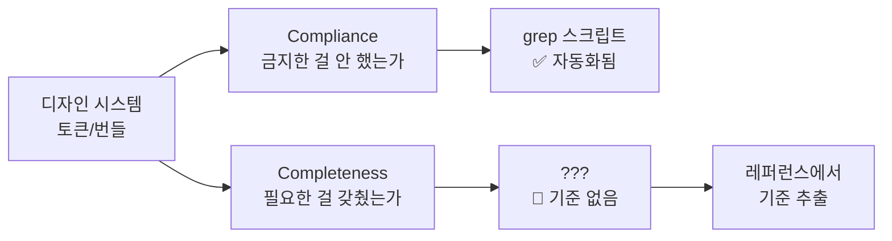
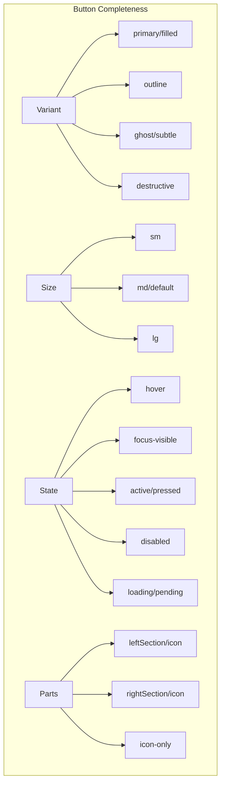

# Component Completeness Baseline — UI 라이브러리 횡단 조사

> 작성일: 2026-03-25
> 맥락: CSS Layer Protocol은 정의됐지만, grep compliance만으로는 "디자인이 좋아졌는가"를 측정 못 함. "컴포넌트가 뭘 갖춰야 완성인가"의 레퍼런스가 필요.

> **Situation** — 디자인 시스템(토큰/번들)은 갖춰졌고 CSS Layer Protocol도 정의됨.
> **Complication** — compliance(위반 0건) ≠ completeness(필수 요소 존재). 점수 스크립트가 천장에 닿아도 컴포넌트가 못생길 수 있음.
> **Question** — 주요 UI 라이브러리들이 각 컴포넌트에 갖추는 필수 요소의 공통 패턴은 무엇인가?
> **Answer** — 5개 라이브러리 횡단 분석 결과, 컴포넌트 분류별 필수 요소 교집합을 추출. 이걸 completeness 체크리스트의 기준선으로 삼는다.

---

## Why — 왜 completeness 기준이 필요한가



compliance는 "하지 말 것"을 자동 검사. completeness는 "해야 할 것"을 검사하는데, **기준이 없으면 검사할 수 없다**. 이 기준을 업계 주요 라이브러리의 공통 패턴에서 추출한다.

---

## How — 조사 방법

**조사 대상 5개 라이브러리:**

| 라이브러리 | 유형 | 특징 |
|-----------|------|------|
| **Base UI** (MUI) | Headless | 순수 로직 + data attribute 상태 노출 |
| **Radix Primitives** | Headless | 파트 분해 극대화, WAI-ARIA 준수 |
| **React Aria** (Adobe) | Headless | 가장 상세한 상태 모델 (6개 boolean state) |
| **shadcn/ui** | Styled (Radix 기반) | variant/size의 실용적 최소셋 |
| **Mantine** | 완성형 | 가장 풍부한 variant/size/section 지원 |

**추출 기준:** 3개 이상 라이브러리가 공통으로 제공하는 요소 = **필수**. 1~2개만 제공 = **선택**.

---

## What — 분류별 필수 요소 교집합

### 1. Action (Button, Toggle, Switch)



| 요소 | Base UI | Radix | React Aria | shadcn | Mantine | **필수?** |
|------|---------|-------|-----------|--------|---------|----------|
| **variant: primary/filled** | ✅ | — | — | ✅ default | ✅ filled | **필수** |
| **variant: outline** | ✅ | — | — | ✅ | ✅ | **필수** |
| **variant: ghost/subtle** | ✅ | — | — | ✅ ghost | ✅ subtle | **필수** |
| **variant: destructive** | — | — | — | ✅ | — | **필수** (시맨틱) |
| variant: secondary | — | — | — | ✅ | ✅ light | 선택 |
| variant: link | — | — | — | ✅ | — | 선택 |
| **size: sm** | — | — | — | ✅ | ✅ | **필수** |
| **size: md (default)** | ✅ | — | — | ✅ | ✅ | **필수** |
| **size: lg** | — | — | — | ✅ | ✅ | **필수** |
| size: xs | — | — | — | ✅ | ✅ | 선택 |
| **state: hover** | ✅ | ✅ | ✅ isHovered | ✅ | ✅ | **필수** |
| **state: focus-visible** | ✅ | ✅ | ✅ isFocusVisible | ✅ | ✅ | **필수** |
| **state: active/pressed** | ✅ | ✅ | ✅ isPressed | ✅ | ✅ | **필수** |
| **state: disabled** | ✅ | ✅ | ✅ isDisabled | ✅ | ✅ | **필수** |
| state: loading/pending | — | — | ✅ isPending | — | ✅ | 선택 |
| **icon: leading** | — | — | — | ✅ | ✅ leftSection | **필수** |
| **icon: trailing** | — | — | — | ✅ | ✅ rightSection | **필수** |
| **icon-only** | — | — | — | ✅ icon size | ✅ | **필수** |
| **transition/motion** | ✅ | — | ✅ [data-pressed] scale | ✅ | ✅ | **필수** |

**Button 필수 체크리스트 (12항목):**
1. variant: primary (filled)
2. variant: outline
3. variant: ghost
4. variant: destructive
5. size: sm / md / lg
6. state: hover
7. state: focus-visible (ring)
8. state: active/pressed (scale or dim)
9. state: disabled (opacity + pointer-events: none)
10. icon: leading position
11. icon: trailing position
12. transition: motion 번들 사용

---

### 2. Input (TextInput, Number, Textarea)

| 요소 | Base UI | React Aria | shadcn | Mantine | **필수?** |
|------|---------|-----------|--------|---------|----------|
| **state: focus** (ring/border) | ✅ | ✅ | ✅ | ✅ | **필수** |
| **state: disabled** | ✅ | ✅ | ✅ | ✅ | **필수** |
| **state: invalid/error** | — | ✅ | ✅ aria-invalid | ✅ error | **필수** |
| state: readonly | — | ✅ | — | — | 선택 |
| **label** | — | ✅ | ✅ FieldLabel | ✅ | **필수** |
| **description/helper** | — | ✅ | ✅ FieldDescription | ✅ | **필수** |
| **error message** | — | ✅ | ✅ | ✅ | **필수** |
| **leftSection (icon)** | — | — | ✅ InputGroup | ✅ | **필수** |
| **rightSection (icon/action)** | — | — | ✅ InputGroup | ✅ | **필수** |
| **height: 44px 급** | — | — | ✅ | ✅ (size md) | **필수** |
| **radius** | — | — | ✅ | ✅ | **필수** |
| size variants | — | — | — | ✅ xs~xl | 선택 |

**Input 필수 체크리스트 (11항목):**
1. state: focus (border 변경 또는 ring)
2. state: disabled (opacity + 상호작용 차단)
3. state: invalid (border-color: destructive)
4. label 연결 (htmlFor/aria-labelledby)
5. description/helper text
6. error message (invalid 시 표시)
7. leftSection (icon slot)
8. rightSection (icon/action slot)
9. height: --input-height (44px)
10. radius: --shape-md-radius
11. transition: focus border motion

---

### 3. Checkbox / Radio / Switch

| 요소 | Radix | React Aria | shadcn | Mantine | **필수?** |
|------|-------|-----------|--------|---------|----------|
| **state: checked** | ✅ | ✅ | ✅ | ✅ | **필수** |
| **state: unchecked** | ✅ | ✅ | ✅ | ✅ | **필수** |
| **state: indeterminate** | ✅ | ✅ | — | ✅ | **필수** (checkbox) |
| **state: disabled** | ✅ | ✅ | ✅ | ✅ | **필수** |
| **state: focus-visible** | ✅ | ✅ | ✅ | ✅ | **필수** |
| **label** | — | ✅ | ✅ | ✅ | **필수** |
| **description** | — | ✅ | ✅ | ✅ | **필수** |
| **data-state attr** | ✅ | ✅ | ✅ | ✅ | **필수** |
| **indicator (check icon)** | ✅ | ✅ | ✅ | ✅ | **필수** |
| transition (check animation) | — | — | ✅ | ✅ | **필수** |

**Checkbox 필수 체크리스트 (10항목):**
1. state: checked (visual indicator)
2. state: unchecked (empty box)
3. state: indeterminate (dash/minus icon)
4. state: disabled (opacity)
5. state: focus-visible (ring)
6. state: hover (box border/bg 변경)
7. label 연결
8. description text
9. indicator icon (check/dash)
10. transition: check/uncheck motion

---

### 4. Overlay (Dialog, AlertDialog, Tooltip)

| 요소 | Radix | Ark UI | React Aria | shadcn | Mantine | **필수?** |
|------|-------|--------|-----------|--------|---------|----------|
| **backdrop/overlay** | ✅ | ✅ | ✅ | ✅ | ✅ | **필수** |
| **title** | ✅ | ✅ | ✅ | ✅ | ✅ | **필수** |
| **description** | ✅ | ✅ | ✅ | ✅ | ✅ | **필수** |
| **close trigger** | ✅ | ✅ | ✅ | ✅ | ✅ | **필수** |
| **focus trap** | ✅ | ✅ | ✅ | ✅ | ✅ | **필수** |
| **close on escape** | ✅ | ✅ | ✅ | ✅ | ✅ | **필수** |
| **close on outside click** | ✅ | ✅ | ✅ | ✅ | ✅ | **필수** |
| **prevent scroll** | — | ✅ | ✅ | — | ✅ | **필수** |
| **enter/exit animation** | forceMount | ✅ lazyMount | ✅ | ✅ | ✅ | **필수** |
| **surface: overlay 번들** | — | — | — | — | — | **필수** (우리) |
| **data-state: open/closed** | ✅ | ✅ | ✅ | ✅ | ✅ | **필수** |
| role: alertdialog (Alert) | ✅ | ✅ | ✅ | ✅ | — | **필수** |
| destructive action styling | — | — | — | ✅ | — | **필수** (우리) |

**Dialog 필수 체크리스트 (12항목):**
1. backdrop (--dialog-backdrop)
2. surface: overlay 번들
3. title (aria-labelledby)
4. description (aria-describedby)
5. close trigger
6. focus trap
7. close on Escape
8. close on outside click
9. prevent background scroll
10. enter animation (--motion-enter)
11. exit animation
12. data-state: open/closed

**AlertDialog 추가 (3항목):**
13. role="alertdialog"
14. destructive action tone (--tone-destructive)
15. non-destructive default focus (안전한 액션에 포커스)

---

### 5. Collection (ListBox, TreeGrid, Menu, Tabs)

Collection은 headless 라이브러리와 우리의 접근이 다르다 — 우리는 `[data-aria-container]` + interactive.css 글로벌 레이어로 상태를 처리한다. 필수 요소는 interactive.css가 커버해야 할 것들:

| 요소 | 공통 패턴 | interactive.css에서? |
|------|----------|-------------------|
| **hover** (focus-within 시 억제) | 모든 라이브러리 | ✅ 이미 있음 |
| **focus: active** (bg highlight) | React Aria, Radix | ✅ 이미 있음 |
| **focus: idle** (gray bg) | Apple HIG | ✅ 이미 있음 |
| **selected** (bg tint) | 모든 라이브러리 | ✅ 이미 있음 |
| **disabled item** | Radix, React Aria | 🔴 없음 |
| **active/pressed** (feedback) | React Aria | ✅ 이미 있음 |
| **separator** (그룹 구분) | Radix Menu, Mantine | 선택 |

**Collection 추가 필수 (interactive.css 보완):**
1. disabled item 스타일 (`[aria-disabled="true"]`)
2. disabled + selected 복합 상태

---

## If — 프로젝트 시사점

### Completeness 매핑 테이블

우리 컴포넌트 → 분류 → 필수 항목 수:

| 컴포넌트 | 분류 | 필수 항목 | 현재 추정 | 갭 |
|----------|------|----------|----------|-----|
| Button | Action | 12 | ~5 (3 variant, hover, active만) | 7 |
| Toggle | Action | 12 | ~3 | 9 |
| Switch(Group) | Action | 12 | ~4 | 8 |
| TextInput | Input | 11 | ~3 (focus만) | 8 |
| Checkbox | Selection | 10 | ~4 (checked, focus만) | 6 |
| RadioGroup | Selection | 10 | ~4 | 6 |
| Dialog | Overlay | 12 | ~4 (surface만) | 8 |
| AlertDialog | Overlay | 15 | ~2 | 13 |
| Tooltip | Overlay | 6 | ~4 | 2 |
| ListBox | Collection | 2 (보완) | 0 | 2 |
| TreeGrid | Collection | 2 (보완) | 0 | 2 |
| TabList | Collection | 2 (보완) | 0 | 2 |
| MenuList | Collection | 2 (보완) | 0 | 2 |

### 점수화

```
component_score = (존재하는_필수_항목 / 총_필수_항목) × 100

total_score = Σ(component_score) / component_count
```

grep으로 자동 체크 가능한 항목:
- variant 존재: `--tone-destructive` in Button.module.css ✅
- disabled 존재: `:disabled` or `aria-disabled` in interactive.css ✅
- motion 존재: `--motion-` in *.module.css ✅
- height 존재: `--input-height` in TextInput.module.css ✅
- icon slot 존재: `leftSection` or `rightSection` in component ✅

---

## Insights

- **React Aria의 6-boolean 상태 모델이 가장 명시적**: `isHovered`, `isFocused`, `isFocusVisible`, `isPressed`, `isDisabled`, `isPending` — 우리의 interactive.css가 커버해야 할 정확한 목록
- **destructive는 headless에 없지만 styled에는 필수**: shadcn이 variant에 포함시킨 것이 업계 표준화. 우리도 Button + AlertDialog에 필수
- **indeterminate는 Checkbox의 숨은 필수**: Radix, React Aria, Mantine 3곳이 지원. 단순 on/off가 아닌 tri-state
- **loading/pending은 아직 선택**: React Aria와 Mantine만 지원. 하지만 트렌드는 필수화 방향 (isPending이 React 19와 연동)
- **Section(icon slot)은 styled 레이어의 필수**: headless에는 없지만, shadcn/Mantine 모두 leftSection/rightSection 제공. "바로 쓸 수 있으려면" 필수

---

## Sources

| # | 출처 | 유형 | 핵심 내용 |
|---|------|------|----------|
| 1 | [Base UI llms.txt](https://base-ui.com/llms.txt) | 공식 문서 | 37개 컴포넌트 목록, headless 접근 |
| 2 | [Radix Dialog](https://www.radix-ui.com/primitives/docs/components/dialog) | 공식 문서 | 8-part Dialog 분해, WAI-ARIA 준수 |
| 3 | [Radix Checkbox](https://www.radix-ui.com/primitives/docs/components/checkbox) | 공식 문서 | tri-state, data-state 속성 |
| 4 | [React Aria Button](https://react-aria.adobe.com/Button) | 공식 문서 | 6-boolean 상태 모델, isPending |
| 5 | [shadcn Button](https://ui.shadcn.com/docs/components/button) | 공식 문서 | 6 variant + 8 size, icon 패턴 |
| 6 | [shadcn Input](https://ui.shadcn.com/docs/components/input) | 공식 문서 | Field/FieldLabel/FieldDescription 패턴 |
| 7 | [Mantine Button](https://mantine.dev/core/button/) | 공식 문서 | 8 variant, loading, leftSection/rightSection |
| 8 | [Mantine TextInput](https://mantine.dev/core/text-input/) | 공식 문서 | 3 variant, error, sections |
| 9 | [Ark UI Dialog](https://ark-ui.com/react/docs/components/dialog) | 공식 문서 | 9-part Dialog, lazyMount, CSS variables |

---

## Walkthrough

> 이 문서를 프로젝트에서 활용하려면?

1. **분류별 필수 체크리스트**를 score 스크립트에 녹인다 — Action 12항목, Input 11항목, Selection 10항목, Overlay 12항목
2. `scripts/scoreComponentCompleteness.mjs` 생성 — 각 module.css를 grep해서 필수 항목 존재 여부 카운트
3. `pnpm score:completeness` 실행 → 컴포넌트별 점수 출력
4. `/improve` 스킬로 점수가 낮은 컴포넌트부터 자율 개선 루프
