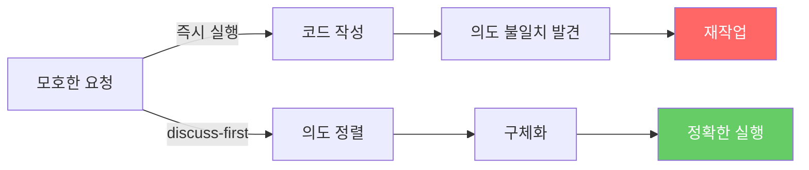
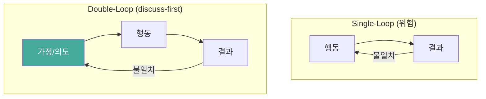
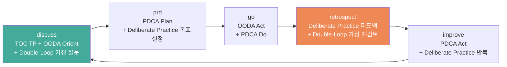

# Discuss-First 워크플로우의 이론적 기반

> 작성일: 2026-03-25
> 맥락: discuss→prd→go→retrospect→improve 파이프라인을 범용화하기 전에 이론적 탄탄함을 검증

> **Situation** — AI 협업에서 discuss→plan→execute→retro→improve 순환 파이프라인이 aria 프로젝트에서 효과적으로 작동하고 있다.
> **Complication** — 이 패턴을 범용화하려면, 특정 프로젝트에서의 경험적 성공이 아니라 일반적으로 적용 가능한 이론적 근거가 필요하다.
> **Question** — 이 워크플로우는 어떤 이론적 기반 위에 서 있으며, 범용 적용이 정당한가?
> **Answer** — 5개 이상의 독립적 이론이 동일한 구조를 지지한다. discuss-first는 단일 이론의 적용이 아니라 여러 학문의 교차점이다.

---

## Why — 왜 "실행 전 사고"가 필요한가

### 문제: 즉시 실행의 함정

소프트웨어 개발에서 가장 비싼 낭비는 "잘못된 것을 잘 만드는 것"이다. Problem framing 연구에 따르면, 팀이 해결책으로 직행하면 에너지·시간·자원이 "정말 중요한 문제"가 아닌 곳에 소모된다.

AI 협업에서 이 문제는 증폭된다. LLM은 모호한 요청도 즉시 실행할 수 있어서, 의도 불일치가 코드 수백 줄이 된 뒤에야 발견된다.

### 핵심 통찰: 생각의 비용 < 실행의 비용

First principles thinking은 복잡한 문제를 핵심 요소로 분해한 뒤 체계적으로 해결을 쌓아가는 접근이다. 선입견이나 과거 경험에 기반한 추론보다 효과적이다.

---

## How — 5개 이론이 같은 구조를 지지한다

discuss-first 파이프라인은 하나의 이론을 적용한 것이 아니다. 독립적으로 발전한 5개 이론이 동일한 구조 — **사고→계획→실행→성찰→개선** — 를 지지한다.

### 1. TOC Thinking Processes (Goldratt, 1984)

**핵심**: 시스템의 제약을 찾아 집중적으로 해소한다.

TOC의 Thinking Processes는 현실 트리(CRT)로 근본 원인을 찾고, 미래 트리(FRT)로 해결의 정합성을 검증하며, 선행조건 트리(PRT)로 장애물을 나열한다. discuss 스킬의 11개 요소(목적→배경→이상→현실→문제→원인→제약→목표→해결→부작용→장애물)는 TOC TP의 직접적 구현이다.

| TOC 도구 | discuss 요소 | 역할 |
|----------|-------------|------|
| CRT (현실 트리) | 현실, 문제, 원인 | UDE에서 근본 원인 추적 |
| EC (대립해소도) | 제약, 목표 | 바꿀 수 있는 것 vs 없는 것 분리 |
| FRT (미래 트리) | 해결, 부작용 | 해결 주입 시 정합성 검증 |
| PRT (선행조건 트리) | 장애물 | 실행 전 선행 조건 나열 |

**범용성 근거**: TOC는 제조업에서 출발했지만 지식 노동/서비스 산업에도 적용된다. 제약이 물리적 형태가 아닌 경우에도 Thinking Processes로 식별 가능하다.

### 2. OODA Loop (Boyd, 1976)

**핵심**: 불확실한 환경에서 관찰→정향→결정→행동의 빠른 순환.

| OODA | 파이프라인 | 특성 |
|------|-----------|------|
| Observe | discuss (현실 파악) | 불완전한 정보에서도 작동 |
| Orient | discuss (의도 정렬) + prd | 멘탈 모델 갱신이 핵심 |
| Decide | plan/go | 실행 결정 |
| Act | go (실행) | 빠른 실행 |

OODA의 핵심 통찰: **Orient 단계가 가장 중요하다.** Boyd는 Observe와 Act 사이의 Orient(정향)가 의사결정의 질을 결정한다고 봤다. discuss가 이 역할을 한다.

OODA는 PDCA와 달리 **불완전한 정보에서도 작동하도록 설계**되었다. 완벽한 데이터를 기다리는 것이 오히려 기회를 놓치게 한다.

### 3. Double-Loop Learning (Argyris, 1977)

**핵심**: 행동만 수정하는 single-loop가 아니라, 행동을 지배하는 가정(governing variables)까지 수정한다.

- **Single-loop**: 코드가 안 되면 코드를 수정 → 같은 종류의 실수 반복
- **Double-loop**: 왜 그런 코드를 작성했는지(가정)를 수정 → 구조적 개선

discuss의 "목적(왜 하려는가?)"부터 시작하는 구조가 정확히 governing variables에 대한 질문이다. retrospect→improve 순환이 double-loop를 구현한다.

**범용성 근거**: Argyris는 조직 학습 일반에 대한 이론이다. 코딩에 국한되지 않으며, 글쓰기·의사결정·업무 전반에 적용된다.

### 4. Deliberate Practice (Ericsson, 1993)

**핵심**: 전문성은 재능이 아니라, 즉각적 피드백이 있는 집중적 연습의 산물이다.

Ericsson의 deliberate practice 4요소:

| 요소 | 파이프라인 대응 |
|------|---------------|
| **명확한 목표** | discuss → prd로 구체화 |
| **즉각적 피드백** | retrospect (결과 vs 의도 비교) |
| **반복 기회** | improve 루프 (점수 스크립트 반복) |
| **오류 활용** | retrospect의 갭 감지 → 다음 사이클 반영 |

**범용성 근거**: 음악, 체스, 의학, 스포츠 등 모든 전문 분야에서 검증된 이론. "LLM + 점수 함수"로 deliberate practice의 피드백 루프를 자동화한 것이 improve 스킬.

### 5. PDCA Cycle (Deming, 1950s)

**핵심**: Plan→Do→Check→Act의 지속적 개선 순환.

| PDCA | 파이프라인 |
|------|-----------|
| Plan | discuss + prd |
| Do | go (실행) |
| Check | retrospect |
| Act | improve + close |

PDCA와의 차이: discuss-first는 Plan 단계를 **의도 정렬(discuss)**과 **구체화(prd)**로 2단계로 분리한다. 이것이 단순한 PDCA 적용이 아닌 이유다.

---

## What — 파이프라인의 이론적 구조

5개 이론을 종합하면, discuss-first 파이프라인의 각 단계가 이론적으로 뒷받침된다:

| 단계 | 역할 | 이론적 근거 | 범용성 |
|------|------|------------|--------|
| **discuss** | 의도 정렬 + 문제 구조화 | TOC TP, OODA Orient, Double-Loop | 모든 의사결정 |
| **prd** | 구체화 + 검증 기준 설정 | PDCA Plan, Deliberate Practice 목표 | 실행이 있는 모든 작업 |
| **go** | 구조화된 실행 | OODA Act, PDCA Do | 모든 실행 |
| **retrospect** | 의도 vs 결과 비교 | Deliberate Practice 피드백, Double-Loop | 모든 학습 |
| **improve** | 측정 기반 자율 개선 | PDCA Act, Deliberate Practice 반복 | 측정 가능한 모든 작업 |

### 왜 discuss가 출발점인가

5개 이론 모두 **"실행 전 사고"**를 강조하지만, 그 깊이가 다르다:

- PDCA의 Plan → 무엇을 할지 계획
- OODA의 Orient → 상황을 어떻게 해석할지 정향
- TOC의 TP → 왜 이 문제가 존재하는지 근본 원인 추적
- Double-Loop → 왜 이런 가정을 하고 있는지 메타 인지

discuss는 이 4가지를 하나로 묶는다. "무엇을 할지"(Plan)가 아니라 **"왜 하는지"**(Orient + TP + Double-Loop)부터 시작함으로써, 가장 깊은 수준의 사전 사고를 강제한다.

---

## If — 범용화에 대한 시사점

### 이론적으로 범용화가 정당한가?

**예.** 5개 이론 모두 특정 도메인에 국한되지 않는다:
- TOC: 제조→서비스→지식 노동으로 확장된 역사
- OODA: 군사→비즈니스→소프트웨어 순환
- Double-Loop: 조직 학습 일반 이론
- Deliberate Practice: 모든 전문 분야에서 검증
- PDCA: 품질관리→경영→소프트웨어 순환

### 범용화 시 주의점

1. **discuss의 11요소는 TOC에 특화** — 비개발자에게 "CRT", "FRT" 용어는 낯설 수 있음. 하지만 질문 자체("왜?", "지금은?", "이상은?")는 보편적
2. **improve의 점수 함수 전제** — 측정 가능한 작업에서만 자동 루프가 동작. 글쓰기/업무에서는 점수 함수 대신 체크리스트나 자기 평가로 대체 가능
3. **retrospect의 git diff 의존** — 코딩 외 작업에서는 "산출물 diff" 개념을 일반화해야 함

### 핵심 판정

discuss-first 파이프라인은 **하나의 이론을 적용한 것이 아니라, 여러 학문의 교차점**에 서 있다. 이것이 범용성의 근거다 — 특정 도메인의 best practice가 아니라, 인간의 사고-실행-학습 순환의 구조적 모델이다.

---

## Insights

- **Orient가 핵심이다**: Boyd는 OODA에서 Orient를 "전체 루프의 핵심"이라 했다. discuss가 정확히 이 역할. 단순히 "계획을 세우는 것"이 아니라 "상황을 어떻게 해석하는지의 프레임을 설정"하는 것
- **Double-Loop은 고통스럽다**: Argyris는 대부분의 조직이 "defensive reasoning" 때문에 double-loop에 저항한다고 했다. discuss의 "왜?" 질문이 자연스럽게 이 저항을 우회하는 구조
- **Deliberate Practice ≠ 반복**: Ericsson은 단순 반복과 deliberate practice를 구분했다. 핵심은 "즉각적 피드백 + 오류 활용". improve 스킬의 점수 함수가 이 역할
- **OODA는 불완전한 정보에서 작동**: PDCA와 달리 OODA는 완벽한 데이터를 기다리지 않는다. discuss의 이해도 테이블(🟢/🟡/🔴)이 "어디까지 알고 어디부터 모르는지"를 명시적으로 다루는 것이 이 정신에 부합
- **5개 이론의 수렴은 우연이 아니다**: 군사(OODA), 제조(PDCA/TOC), 학습 과학(Deliberate Practice), 조직 이론(Double-Loop)이 동일 구조로 수렴한다는 것은, 이 구조가 인간 인지의 기본 패턴을 반영한다는 증거

---

## Sources

| # | 출처 | 유형 | 핵심 내용 |
|---|------|------|----------|
| 1 | [TOC in Software Development](https://www.theagilemindset.co.uk/2025/10/07/the-theory-of-constraints-in-software-development-finding-and-fixing-the-real-bottleneck/) | 블로그 | TOC의 5 Focusing Steps와 Thinking Processes의 소프트웨어 적용 |
| 2 | [Theory of Constraints — Wikipedia](https://en.wikipedia.org/wiki/Theory_of_constraints) | 백과사전 | TOC 전체 개요, TP 도구 설명 |
| 3 | [OODA Loop — Wikipedia](https://en.wikipedia.org/wiki/OODA_loop) | 백과사전 | Boyd의 OODA 루프 원전 설명 |
| 4 | [OODA vs PDCA Comparison](https://www.theknowledgeacademy.com/blog/ooda-vs-pdca/) | 블로그 | 두 프레임워크의 적용 맥락 차이 |
| 5 | [Double-Loop Learning — Argyris 1977 (HBR)](https://hbr.org/1977/09/double-loop-learning-in-organizations) | 학술 | Single vs Double-Loop의 원전 논문 |
| 6 | [Chris Argyris — infed.org](https://infed.org/dir/welcome/chris-argyris-theories-of-action-double-loop-learning-and-organizational-learning/) | 해설 | Argyris의 이론 체계 전체 해설 |
| 7 | [Deliberate Practice — Ericsson 1993](https://gwern.net/doc/psychology/writing/1993-ericsson.pdf) | 학술 원전 | 전문성 습득의 deliberate practice 이론 |
| 8 | [Deliberate Practice Overview — Frontiers](https://www.frontiersin.org/journals/psychology/articles/10.3389/fpsyg.2019.02396/full) | 학술 리뷰 | deliberate practice 정의와 후속 연구 정리 |
| 9 | [AI Pair Programming Problems — ScienceDirect](https://www.sciencedirect.com/science/article/abs/pii/S0164121224002486) | 학술 | AI 페어 프로그래밍의 문제와 원인 분석 |
| 10 | [Intent-Aligned Multi-Agent Framework](https://aclanthology.org/2025.findings-acl.80.pdf) | 학술 | RTADev: LLM 에이전트의 의도 정렬 프레임워크 |
| 11 | [Problem Framing — Design Sprint Academy](https://www.designsprint.academy/blog/what-is-problem-framing) | 블로그 | 실행 전 문제 프레이밍의 전략적 가치 |
| 12 | [First Principles — Addy Osmani](https://addyosmani.com/blog/first-principles-thinking-software-engineers/) | 블로그 | 소프트웨어 엔지니어링에서 first principles thinking |

---

## Walkthrough

> 이 이론적 기반을 실제 파이프라인에서 확인하려면?

1. **진입점**: `/discuss` 실행 — 11요소 테이블이 TOC Thinking Processes의 구현임을 확인
2. **Orient 확인**: discuss의 첫 턴에서 "왜 하려는가?"로 시작하는 것이 OODA Orient에 해당
3. **Double-Loop 확인**: discuss에서 "이상적 결과"와 "현실"의 갭을 질문하는 과정이 governing variables 검토
4. **Deliberate Practice 확인**: `/improve`에서 점수 스크립트 → 수정 → 재측정 사이클이 Ericsson의 피드백 루프
5. **전체 순환**: discuss → prd → go → retrospect → improve → discuss 한 사이클을 관찰하면 PDCA가 double-loop로 강화된 형태임을 확인
