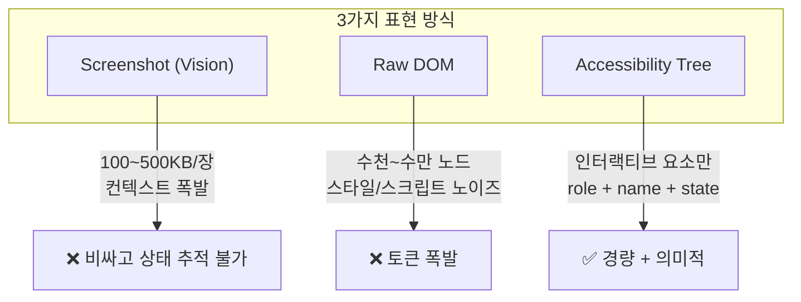
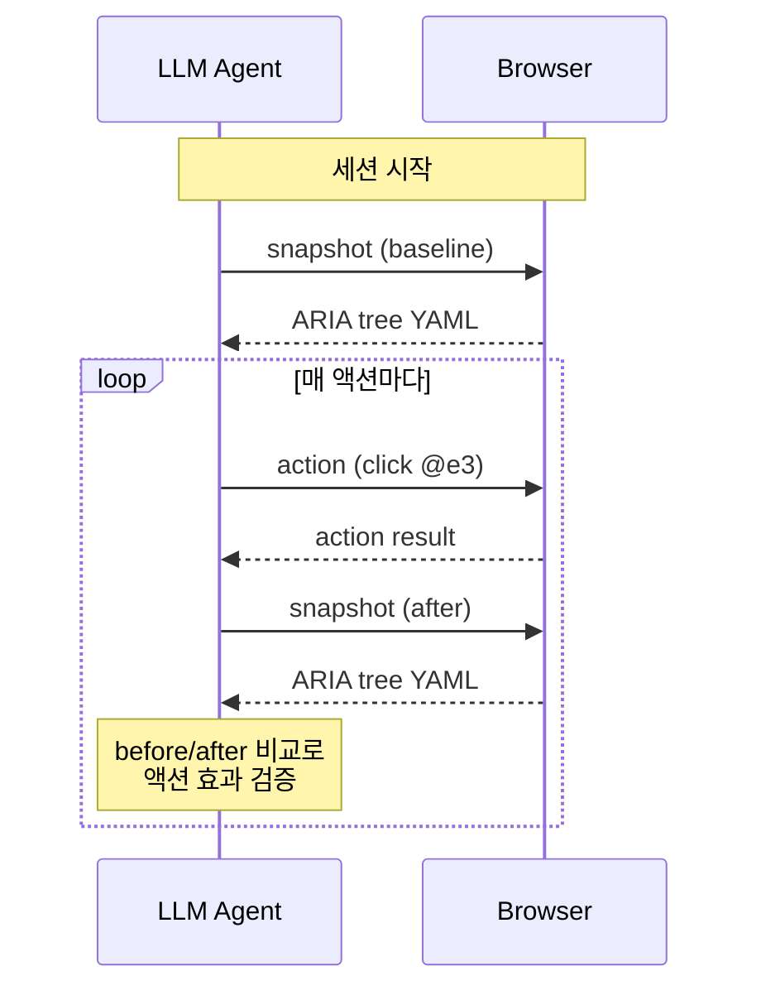

# Agentic Browser State Capture — Accessibility Tree 기반 페이지 상태 표현

> 작성일: 2026-03-25
> 맥락: REC(재현 녹화) 기능에 ARIA tree 스냅샷을 도입하기 위해, 에이전틱 브라우저들이 실제로 페이지 상태를 어떻게 캡처하는지 조사

> **Situation** — 에이전틱 브라우저(Playwright MCP, Browser Use, agent-browser 등)가 LLM에 페이지 상태를 전달하는 표준 방식이 확립되고 있다.
> **Complication** — DOM 전체는 수천~수만 노드로 토큰 폭발, 스크린샷은 0.5~3달러/태스크로 비싸고 상태 변화 추적이 불가능하다.
> **Question** — 에이전틱 브라우저들은 어떤 표현 형식, 어떤 타이밍, 어떤 프루닝 전략으로 페이지 상태를 경량화하는가?
> **Answer** — Accessibility tree를 YAML/텍스트로 직렬화하고, 매 액션 후 스냅샷을 찍어 diff로 변화를 추적한다. DOM 대비 10~100배 경량.

---

## Why — 왜 Accessibility Tree인가

세 가지 페이지 표현 방식이 경쟁했고, accessibility tree가 승자로 수렴 중이다.



| 방식 | 정확도 | 태스크 비용 | 장점 | 단점 |
|------|--------|------------|------|------|
| Screenshot + Vision | ~60% | $0.50-3.00 | 시각 레이아웃 포착 | 토큰 폭발, 상태 추적 불가 |
| Raw DOM / Markdown | ~65% | $0.20-0.50 | 텍스트 추출 가능 | 노이즈 과다 |
| **Accessibility Tree** | **81%+** | **$0.12** | 의미적, 경량 | WCAG 마크업 의존 |

핵심 인사이트: accessibility tree는 브라우저가 보조 기술(screen reader)을 위해 **이미 만들어 놓은** 경량 표현이다. 에이전틱 브라우저는 이걸 재발견한 것이다.

---

## How — 작동 원리

### 1. 스냅샷 형식: Playwright ARIA Snapshot

Playwright MCP가 사실상 표준으로 확립한 형식. YAML 기반으로 트리 구조를 들여쓰기로 표현한다.

```yaml
- navigation "Main":
  - link "Home"
  - link "Products"
  - link "About"
- main:
  - heading "Product List" [level=1]
  - list "Products":
    - listitem:
      - link "Widget A"
      - text: "$29.99"
    - listitem:
      - link "Widget B"
      - text: "$49.99"
  - button "Add to Cart"
  - checkbox "Subscribe" [checked]
```

**노드당 정보:**
- **role**: ARIA role 또는 HTML implicit role (button, link, heading, listitem...)
- **name**: accessible name (따옴표로 감싼 텍스트)
- **attributes**: ARIA 상태 — `[checked]`, `[disabled]`, `[expanded]`, `[level=N]`, `[pressed]`, `[selected]`
- **ref**: 요소 참조 ID (`@e1`, `@e2`) — 에이전트가 액션 타겟을 지정할 때 사용

**포함되는 것:** 인터랙티브 요소, 랜드마크, 헤딩, 상태(checked/disabled/expanded/selected)
**제외되는 것:** 스타일, 스크립트, 비인터랙티브 장식 요소, 클래스명

### 2. 스냅샷 타이밍: Action-Observation Loop



**핵심 원칙: 매 액션 후 스냅샷.**

- 세션 시작 시 → baseline 스냅샷
- 액션 실행 후 → 결과 스냅샷
- 스크립트와 달리 "성공했다고 가정"하지 않음 — 실제 상태 변화를 확인

Playwright MCP는 `includeSnapshot` 옵션으로 액션 응답에 스냅샷을 자동 포함할 수 있다 (끄면 토큰 70~80% 절감).

### 3. Diffing 전략: agent-browser

agent-browser는 두 스냅샷 간 **line-level text diff**를 수행한다.

```diff
- textbox "Email" @e3
+ textbox "Email" @e3: "test@example.com"
- button "Submit" @e4
+ button "Submit" @e4 [disabled]
+ status "Sending..." @e7
```

**diff에 포함:** 값 변화, 상태 변화(disabled/checked/expanded), 새 요소 추가, 요소 제거
**diff에 불포함:** 시각 스타일, 비인터랙티브 요소

요약 라인: `3 additions, 2 removals, 41 unchanged`

baseline은 **세션 내 가장 최근 스냅샷**을 자동으로 사용한다.

---

## What — 주요 구현체 비교

| 프로젝트 | 표현 방식 | 스냅샷 타이밍 | Diff 지원 | 특이점 |
|----------|----------|-------------|-----------|--------|
| **Playwright MCP** | ARIA tree YAML + @ref | 매 액션 후 (선택적) | 없음 (전체 스냅샷) | 사실상 표준. Chrome/Firefox/WebKit |
| **Browser Use** | DOM → 텍스트 추출 + 선택적 스크린샷 | 매 스텝 | 없음 | KV cache 최적화, 68초/태스크 |
| **agent-browser** | ARIA tree + @ref | 매 액션 후 | **line-level diff** | Vercel. diff가 핵심 차별점 |
| **rtrvr.ai** | Smart DOM Tree (ARIA-aware) | 온디맨드 | 없음 | 독자 프루닝, 81% 정확도 |
| **Claude Computer Use** | Screenshot (vision) | 매 액션 후 | 없음 | 비싸지만 시각 레이아웃 포착 |

### 프루닝 공통 전략

모든 구현체가 공유하는 노이즈 제거 규칙:
1. `<script>`, `<style>`, `<noscript>` 제거
2. 트래킹 픽셀, 히든 요소 제거
3. 비인터랙티브 장식 요소 제거
4. 텍스트 콘텐츠 길이 제한 (30~150자 truncate)
5. 모달/다이얼로그가 열려있으면 그것만 캡처

---

## If — 프로젝트에 대한 시사점

### 현재 REC와의 매핑

| 에이전틱 브라우저 | 현재 REC (createReproRecorder) | 갭 |
|------------------|-------------------------------|-----|
| ARIA tree 스냅샷 | 타겟 요소 1개의 ARIA 속성만 (`getAriaSnapshot`) | **전체 트리 없음** |
| 매 액션 후 스냅샷 | 매 input 이벤트마다 기록 | 타이밍은 이미 맞음 |
| line-level diff | state channel에 store diff 있음 | **ARIA tree diff 없음** |
| @ref 요소 참조 | `data-node-id`로 추적 | 유사 |
| role + name + state | role, label, selected, expanded, activedescendant, level | 범위가 타겟 1개로 제한 |

### 이 프로젝트의 유리한 점

interactive-os는 **모든 인터랙티브 요소에 ARIA 속성이 이미 있다**. 일반 웹사이트는 WCAG 마크업이 부실해서 accessibility tree가 빈약하지만, 이 프로젝트는 ARIA가 곧 데이터 모델이므로 트리가 완전하다.

### 적용 방향 (discuss에서 결정할 사항)

1. **스냅샷 범위**: 전체 페이지 vs 가장 가까운 role 컨테이너 서브트리
2. **스냅샷 타이밍**: 매 input 이벤트 vs 매 state 변경 vs 둘 다
3. **Diff 포함 여부**: 전체 스냅샷만 vs before/after diff 계산
4. **출력 형식**: Playwright YAML 호환 vs 자체 형식

---

## Insights

- **Accessibility tree는 AI를 위해 만들어진 게 아니다**: 보조 기술용으로 20년 넘게 존재했던 것을 AI가 재발견. ARIA-완전한 프로젝트가 에이전틱 시대에 유리한 포지션
- **Screenshot 대비 6~25배 저렴**: rtrvr.ai 벤치마크 기준. 토큰 절감이 정확도 하락 없이 가능
- **Diff가 핵심 인사이트**: agent-browser만 diff를 제공하고, 나머지는 매번 전체 스냅샷을 보냄. "뭐가 바뀌었는지"를 명시적으로 보여주는 것이 LLM 이해도를 높임
- **매 액션 후 스냅샷이 표준**: "state diff가 안 일어나는 버그"를 잡으려면, 상태 변경이 아니라 사용자 행동을 트리거로 해야 한다 — 에이전틱 브라우저가 정확히 이렇게 한다

---

## Sources

| # | 출처 | 유형 | 핵심 내용 |
|---|------|------|----------|
| 1 | [Playwright ARIA Snapshots](https://playwright.dev/docs/aria-snapshots) | 공식 문서 | ARIA 스냅샷 YAML 형식, 노드별 role/name/attribute 구조 |
| 2 | [rtrvr.ai DOM Intelligence Architecture](https://www.rtrvr.ai/blog/dom-intelligence-architecture) | 기술 블로그 | Smart DOM Tree로 81% 정확도, Screenshot 대비 6배 저렴 |
| 3 | [Browser Use vs Claude Computer Use](https://techstackups.com/comparisons/browser-use-vs-claude-computer-use/) | 비교 분석 | DOM 기반 vs Vision 기반 아키텍처, 비용/정확도 트레이드오프 |
| 4 | [agent-browser Diffing](https://agent-browser.dev/diffing) | 공식 문서 | line-level ARIA tree diff, before/after 비교 전략 |
| 5 | [Browser Use: Speed Matters](https://browser-use.com/posts/speed-matters) | 공식 블로그 | KV cache 최적화, 선택적 스크린샷, 68초/태스크 달성 |
| 6 | [How Browser Agents Work (Anchor)](https://anchorbrowser.io/blog/how-browser-agents-work-a-step-by-step-architectural-guide) | 아키텍처 가이드 | observe→decide→act→verify 루프, 멀티모달 관찰 전략 |
| 7 | [Playwright MCP GitHub](https://github.com/microsoft/playwright-mcp) | 공식 레포 | browser_snapshot 도구, includeSnapshot 옵션 |

---

## Walkthrough

> 현재 프로젝트에서 에이전틱 브라우저의 상태 캡처 방식을 직접 확인하려면?

1. **현재 REC 확인**: `src/interactive-os/devtools/ReproRecorderOverlay.tsx`에서 REC 버튼 동작, `createReproRecorder.ts`에서 5채널 캡처 구조 확인
2. **ARIA 스냅샷 비교**: 데모 페이지에서 REC 녹화 후 JSON 결과의 `aria` 필드(타겟 1개)와 Playwright YAML 형식(전체 트리)의 정보량 차이를 비교
3. **브라우저 내장 확인**: Chrome DevTools → Elements → Accessibility 패널에서 전체 accessibility tree 확인. 이것이 에이전틱 브라우저가 읽는 것
4. **토큰 추정**: 데모 페이지의 accessibility tree를 YAML로 직렬화하면 대략 수십~수백 줄. DOM 전체 대비 10~100배 경량
