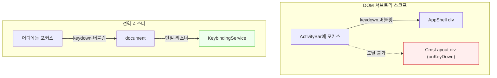
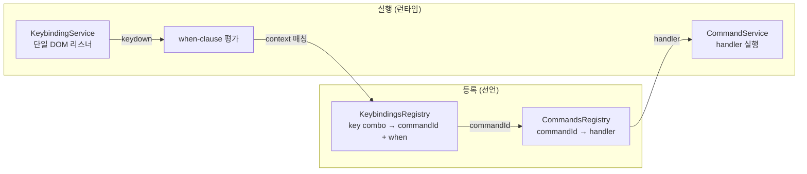
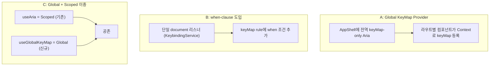

# 전역 키보드 단축키 아키텍처 — 업계 패턴 조사

> 작성일: 2026-03-25
> 맥락: interactive-os의 keyMap-only Aria가 DOM 서브트리 스코프라서 전역 단축키에 도달하지 못하는 문제. 설계 원칙(선언적 OCP)을 지키면서 전역 도달을 양립시키는 패턴을 조사.

> **Situation** — 키보드 중심 웹 앱(VS Code, Figma, Notion)은 전역 단축키를 기본 제공한다.
> **Complication** — React에서 전역 단축키를 구현하면 `document.addEventListener` ad-hoc 패턴이 되기 쉽고, 선언적 keyMap 체계와 단절된다.
> **Question** — 업계는 "선언적 keyMap 등록 + 전역 이벤트 도달 + 스코프 제어"를 어떻게 양립시키는가?
> **Answer** — **Command-Keybinding 분리 + 단일 전역 리스너 + when-context 스코핑**이 지배적 패턴이다. VS Code가 원형이며, React 생태계도 이를 변형하여 따른다.

---

## Why — 왜 DOM 서브트리 리스너로는 부족한가

웹 앱의 키보드 이벤트는 포커스된 요소에서 시작하여 DOM 트리를 버블링한다. 특정 div에 `onKeyDown`을 걸면 그 div의 자식에 포커스가 있을 때만 동작한다. 이것이 "DOM 서브트리 스코프"의 한계다.

키보드 중심 앱에서 전역 단축키(Cmd+K, Cmd+\, Cmd+P)는 **포커스 위치와 무관하게** 동작해야 한다. 사이드바, 에디터, 패널 어디에 포커스가 있든 같은 동작을 해야 한다.



| 범례 | 의미 |
|------|------|
| 빨간 배경 | 도달 불가 — DOM 트리 외부 포커스 |
| 초록 배경 | 항상 도달 — document 레벨 |

---

## How — 업계의 3가지 핵심 패턴

### 패턴 1: Command-Keybinding 분리 (VS Code)

VS Code의 아키텍처는 **Command와 Keybinding을 완전히 분리**한다.



**핵심 구조:**

| 계층 | 역할 | 확장 방법 |
|------|------|---------|
| CommandsRegistry | commandId → handler 매핑 | command 추가 (기존 코드 수정 0) |
| KeybindingsRegistry | key combo → commandId + when 매핑 | keybinding rule 추가 (기존 코드 수정 0) |
| KeybindingService | 단일 DOM 리스너, keydown 캡처 + dispatch | 수정 불필요 (불변 런타임) |
| CommandService | handler 실행, DI, 에러 핸들링 | 수정 불필요 (불변 런타임) |

**3단계 우선순위:**
1. User keybindings (keybindings.json) — 최우선
2. Extension-contributed — 중간
3. Built-in defaults — 최하위

**when-clause로 스코프 제어:**
```json
{ "key": "ctrl+k", "command": "openView", "when": "editorFocus" }
{ "key": "ctrl+k", "command": "toggleTerminal", "when": "!editorFocus" }
```
같은 키에 여러 바인딩이 존재하되, context에 따라 하나만 활성화된다.

### 패턴 2: Global + Scoped 이중 구조 (react-hotkeys)

react-hotkeys는 두 가지 컴포넌트를 제공한다:

- **`<GlobalHotKeys>`** — `document`에 리스너 부착, 포커스 무관
- **`<HotKeys>`** — 특정 DOM 요소에 스코핑, 포커스 필요

그리고 **keyMap과 handlers를 분리**한다:

```
keyMap = { DELETE_NODE: "del", SAVE: "mod+s" }      // 선언
handlers = { DELETE_NODE: () => ..., SAVE: () => ... }  // 행동
```

이 분리가 VS Code의 Command-Keybinding 분리와 동일한 패턴이다. keyMap은 "어떤 키가 어떤 의미인가", handlers는 "그 의미를 어떻게 실행하는가".

### 패턴 3: 단일 전역 리스너 + 선언적 매핑 (tinykeys, React-Keyhub)

tinykeys(~650B)는 가장 미니멀한 접근:

```javascript
tinykeys(window, {
  "Control+s": () => save(),
  "$mod+\\": () => togglePreview(),
})
// → unsubscribe 함수 반환
```

- 단일 `window` 리스너
- Record 객체에 선언 = 등록
- `unsubscribe()`로 클린업
- 스코프 제어 없음 (전역만)

React-Keyhub는 이를 확장하여 **단일 이벤트 버스 + 중앙 설정**으로:
- 모든 컴포넌트의 단축키를 하나의 이벤트 버스에 등록
- 컴포넌트별 리스너 대신 중앙 디스패치
- input 필드 자동 무시

---

## What — 패턴 비교표

| | VS Code | react-hotkeys | tinykeys | react-hotkeys-hook |
|---|---|---|---|---|
| **리스너 위치** | 단일 DOM (editor container) | Global: document, Scoped: element | window | element (ref) |
| **선언 방식** | JSON rule (key+command+when) | keyMap + handlers 분리 | Record 객체 | useHotkeys(key, handler) |
| **스코프 제어** | when-clause (context boolean) | GlobalHotKeys vs HotKeys | 없음 (전역만) | ref 기반 (포커스) |
| **Command 분리** | commandId 매개 | action name 매개 | 없음 (직접 실행) | 없음 (직접 실행) |
| **우선순위** | user > extension > default | 선언 순서 | 선언 순서 | 선언 순서 |
| **확장 = 행 추가** | ✅ | ✅ | ✅ | ✅ |
| **런타임 불변** | ✅ | ✅ | ✅ | ✅ |

**공통점:** 모든 패턴이 **선언적 매핑 + 불변 런타임**을 따른다. 차이는 스코프 제어의 정교함과 Command 간접층의 유무.

---

## If — interactive-os에 대한 시사점

### 현재 상태와 갭

interactive-os의 keyMap 체계는 **패턴 2(react-hotkeys)의 Scoped 부분**과 유사하다:
- `useAria`의 keyMap = 특정 DOM 요소에 스코핑
- axis + plugin + override 합성 = keyMap + handlers 분리의 변형
- `composePattern` = 불변 합성 런타임

**부족한 것:** 패턴 2의 **Global 부분** — `<GlobalHotKeys>` 에 해당하는 것이 없다.

### 설계 방향 3가지



| 방향 | 장점 | 단점 | VS Code 유사도 |
|------|------|------|:---:|
| **A: Global KeyMap Provider** | Aria 체계 안에서 해결, 최소 변경 | AppShell에 Aria 추가 필요, 라우트 Context 설계 필요 | 낮음 |
| **B: when-clause 도입** | VS Code 모델 완전 구현, 가장 강력 | 대규모 리팩토링, context 시스템 구축 필요 | 높음 |
| **C: Global + Scoped 이중** | react-hotkeys 모델, Scoped 기존 유지 + Global 추가 | 두 시스템 공존, useGlobalKeyMap 신규 hook 필요 | 중간 |

---

## Insights

- **VS Code의 핵심 인사이트**: Command와 Keybinding의 분리가 확장성의 열쇠. 같은 Command를 여러 키에 바인딩하고, 같은 키를 context별로 다른 Command에 바인딩할 수 있다. interactive-os의 axis keyMap은 이미 "key → handler" 직접 매핑이므로, Command 간접층이 필요한 시점이 올 수 있다.

- **"전역"의 의미가 두 가지**: (1) document-level 리스너 = 포커스 무관 도달, (2) 앱 전체 scope = 어떤 라우트든 동작. 이 둘은 다른 문제다. tinykeys는 (1)만 해결하고, VS Code의 when-clause는 (1)+(2) 모두 해결한다.

- **react-hotkeys의 keyMap/handlers 분리가 interactive-os의 axis/plugin keyMap과 구조적으로 동일**. 우리는 이미 "선언"과 "실행"을 분리하고 있고, 합성 런타임이 불변이다. 부족한 건 "전역 리스너 + when-context"뿐이다.

---

## Sources

| # | 출처 | 유형 | 핵심 내용 |
|---|------|------|----------|
| 1 | [VS Code Keybindings and Commands (DeepWiki)](https://deepwiki.com/microsoft/vscode-docs/6.4-keybindings-and-commands) | 공식 문서 분석 | Command-Keybinding 분리, when-clause, 3단계 우선순위 |
| 2 | [VS Code Command and Keybinding (DEV)](https://dev.to/ryankolter/vscode-4-commands-and-keybindings-system-4nhm) | 기술 블로그 | KeybindingService → CommandService dispatch 흐름 |
| 3 | [VS Code when-clause contexts](https://code.visualstudio.com/api/references/when-clause-contexts) | 공식 API 문서 | context key 목록, boolean expression 문법 |
| 4 | [react-hotkeys (GitHub)](https://github.com/greena13/react-hotkeys) | 라이브러리 | GlobalHotKeys vs HotKeys, keyMap/handlers 분리 |
| 5 | [react-hotkeys-hook Scoping](https://react-hotkeys-hook.vercel.app/docs/documentation/useHotkeys/scoping-hotkeys) | 라이브러리 문서 | ref 기반 스코핑, tabIndex=-1 패턴 |
| 6 | [tinykeys (GitHub)](https://github.com/jamiebuilds/tinykeys) | 라이브러리 | 650B 미니멀, window 리스너 + Record 선언 |
| 7 | [React-Keyhub (DEV)](https://dev.to/xenral/react-keyboard-shortcuts-boost-app-performance-using-react-keyhub-25co) | 기술 블로그 | 단일 이벤트 버스, 중앙 설정 모델 |
| 8 | [Command Palettes for the Web](https://robdodson.me/posts/command-palettes/) | 기술 블로그 | Command Palette 개념적 제안, 표준화 논의 |

---

## Walkthrough

1. **VS Code 모델 확인**: VS Code에서 `Cmd+K Cmd+S`로 Keyboard Shortcuts 편집기 열기 → when 컬럼 확인 → 같은 키에 다른 context 바인딩 확인
2. **react-hotkeys 코드 확인**: [GitHub README](https://github.com/greena13/react-hotkeys) → `<GlobalHotKeys>` vs `<HotKeys>` 사용 예시 비교
3. **tinykeys 코드 확인**: [GitHub source](https://github.com/jamiebuilds/tinykeys/blob/main/src/tinykeys.ts) → 100줄 미만의 전체 구현 읽기
4. **프로젝트 대입**: `src/interactive-os/primitives/useAriaView.ts:258-265` (keyMap-only 경로) → 이것이 react-hotkeys의 `<HotKeys>` (Scoped)에 해당. `<GlobalHotKeys>`에 해당하는 것이 없음을 확인
