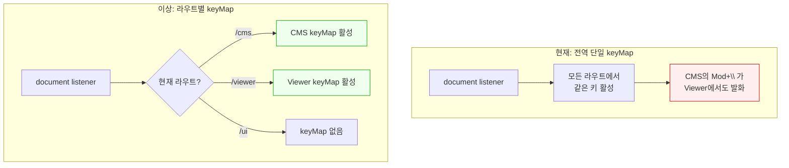
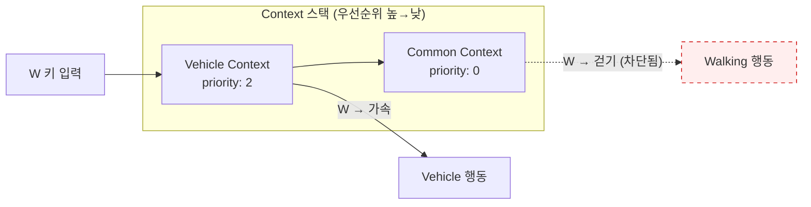

# 라우트 기반 키바인딩 — 페이지/모드 단위 단축키 스코핑 패턴

> 작성일: 2026-03-25
> 맥락: interactive-os에서 전역 단축키를 라우트 단위로 활성화/비활성화하는 설계를 검토 중. "AriaRoute" 개념의 외부 선행 사례를 조사.

> **Situation** — SPA에서 전역 단축키를 구현하면 모든 라우트에서 동일한 키가 활성화된다.
> **Complication** — 라우트별로 다른 단축키가 필요하고, 라우트 전환 시 이전 단축키가 자동 비활성화되어야 한다.
> **Question** — "라우트 = 단축키 스코프"라는 개념이 업계에서 어떤 형태로 존재하는가?
> **Answer** — 게임 엔진의 **Input Mapping Context 스택**과 react-hotkeys-hook의 **Scope Provider**가 가장 근접한 패턴. "라우트 전환 = 컨텍스트 전환"은 자연스러운 매핑이지만, 명시적으로 이를 구현한 웹 라이브러리는 없다.

---

## Why — 라우트와 단축키 스코프가 1:1 매핑되어야 하는 이유

SPA에서 라우트 전환은 사실상 "모드 전환"이다. CMS 페이지에서 `Cmd+\`는 preview 토글이지만, Viewer 페이지에서는 다른 의미이거나 무의미할 수 있다. 라우트가 바뀌면 단축키 세트도 바뀌어야 한다.



---

## How — 3가지 업계 패턴

### 패턴 1: Input Mapping Context 스택 (Unreal Engine)

게임 엔진에서 가장 정교하게 구현된 모델이다.

**핵심 개념:**
- **Input Action**: "점프", "사격" 같은 추상 행동 (Command와 유사)
- **Input Mapping Context**: Input Action에 물리 키를 매핑하는 데이터 에셋 (KeyMap과 유사)
- **Context 스택**: 여러 Context를 우선순위와 함께 활성화/비활성화



**라우트 매핑:**
- 차량 탑승 = 라우트 전환 (`/cms` 진입)
- Vehicle Context 추가 = `AriaRoute` keyMap 등록
- 차량 하차 = 라우트 이탈 (`/cms` 언마운트)
- Vehicle Context 제거 = keyMap 해제

**핵심 인사이트:** Context는 "추가/제거"이지 "교체"가 아니다. Common Context(공통 단축키)는 항상 활성이고, 라우트별 Context가 위에 쌓인다. 충돌 시 높은 우선순위가 이긴다.

### 패턴 2: Scope Provider (react-hotkeys-hook)

React 생태계에서 가장 근접한 구현이다.

**핵심 API:**
```typescript
<HotkeysProvider initiallyActiveScopes={['global']}>
  <App />
</HotkeysProvider>

// 컴포넌트에서
useHotkeys('ctrl+s', save, { scopes: 'editor' })
useHotkeys('ctrl+p', preview, { scopes: 'cms' })

// 스코프 제어
const { enableScope, disableScope } = useHotkeysContext()
enableScope('cms')   // CMS 라우트 진입 시
disableScope('cms')  // CMS 라우트 이탈 시
```

**특징:**
- `*` (wildcard) 스코프 = 항상 활성 (Common Context와 동일)
- 이름 기반 스코프 = 수동 활성화/비활성화 필요
- **라우트 자동 연동은 없음** — 개발자가 `useEffect`에서 `enableScope`/`disableScope`를 직접 호출해야 함

**한계:** 스코프 활성화가 명시적(imperative). 라우트 전환과 자동 연동되지 않으므로 "라우트 전환했는데 스코프 전환 깜빡" 실수 가능 → Pit of Failure.

### 패턴 3: KeyboardRoute (React Router + Keyboardist)

라우트와 키바인딩을 직접 결합한 유일한 웹 사례이다.

```typescript
<KeyboardRoute exact path="/" component={Home} keyName="keyH" />
<KeyboardRoute path="/posts" component={Posts} keyName="keyP" />
```

**메커니즘:** `Route`와 `Keyboardist`를 Fragment로 감싼다. 라우트가 마운트되면 키 리스너도 마운트, 언마운트되면 리스너도 해제.

**한계:**
- 네비게이션 단축키 전용 (라우트로 이동하는 키)
- 라우트 내부의 전역 단축키는 지원하지 않음
- 단일 키만 바인딩, keyMap 합성 없음

---

## What — 패턴 비교

| | UE Input Context | react-hotkeys-hook Scope | KeyboardRoute | **AriaRoute (제안)** |
|---|---|---|---|---|
| 스코프 활성화 | 명시적 add/remove | 명시적 enable/disable | 자동 (mount/unmount) | **자동 (mount/unmount)** |
| 스택/합성 | 우선순위 스택 | 병렬 (이름 기반) | 없음 | **스프레드 합성** |
| 공통 키 | Common Context (항상 활성) | `*` wildcard scope | 없음 | **AppShell 기본 keyMap** |
| 충돌 해결 | 우선순위 + consume | 스코프 분리 | 해당 없음 | **자식 override 부모** |
| 라우트 연동 | 수동 | 수동 | **자동** | **자동** |
| Pit of Success | 중간 (명시적) | 낮음 (깜빡 가능) | 높음 (자동) | **높음 (자동)** |

---

## If — interactive-os AriaRoute에 대한 시사점

### UE의 Context 스택이 가장 강력한 모델

AriaRoute의 설계에 적용하면:

```
AppShell (Common Context — 항상 활성, priority 0)
  └── /cms → AriaRoute (CMS Context — 마운트 시 자동 활성, priority 1)
        └── /cms/editor → AriaRoute (Editor Context — priority 2)
```

- **자동 활성화**: AriaRoute 마운트 = Context 추가, 언마운트 = Context 제거
- **스프레드 합성**: `{...appShell, ...cms, ...editor}` — UE의 우선순위 스택과 동일
- **충돌 해결**: 자식이 부모를 자연스럽게 override (스프레드 순서)
- **공통 키**: AppShell의 keyMap은 항상 활성 (라우트가 override하지 않는 한)

### react-hotkeys-hook의 Scope는 반면교사

`enableScope`/`disableScope`가 수동이라서 "깜빡" 위험이 있다. AriaRoute는 **마운트/언마운트에 연동**되어야 한다 — KeyboardRoute가 이미 이 패턴을 증명함.

### KeyboardRoute의 "자동 연동"이 Pit of Success의 핵심

KeyboardRoute는 기능이 제한적이지만 핵심 인사이트를 제공: **React 컴포넌트의 생명주기 = 키바인딩의 생명주기**. 이것이 AriaRoute의 설계 원칙이 되어야 한다.

---

## Insights

- **"라우트 = 단축키 스코프"를 명시적으로 구현한 웹 라이브러리는 없다.** KeyboardRoute가 가장 가깝지만 네비게이션 전용. react-hotkeys-hook의 Scope는 수동. **이 개념의 자동화는 미개척 영역이다.**

- **게임 엔진이 웹보다 20년 앞서 있다.** UE의 Input Mapping Context 스택은 "모드별 키바인딩"을 완벽히 해결한다. 웹은 아직 document.addEventListener + 수동 관리. AriaRoute가 이 갭을 메울 수 있다.

- **Pit of Success의 결정적 차이는 "자동 vs 수동"이다.** react-hotkeys-hook(수동 scope)는 Pit of Failure, KeyboardRoute(자동 mount)는 Pit of Success. AriaRoute는 반드시 자동 쪽이어야 한다.

---

## Sources

| # | 출처 | 유형 | 핵심 내용 |
|---|------|------|----------|
| 1 | [React Router + Keyboardist](https://armandososa.org/2018/6/12/react-router-plus-keyboardist/) | 블로그 | KeyboardRoute: Route + Keyboardist Fragment 조합, mount=활성화 |
| 2 | [react-hotkeys-hook Scope](https://react-hotkeys-hook.vercel.app/docs/documentation/hotkeys-provider) | 라이브러리 문서 | HotkeysProvider, enableScope/disableScope, wildcard scope |
| 3 | [Keybindy React](https://github.com/keybindyjs/react) | 라이브러리 | useKeybindy hook, pushScope/popScope 스택 |
| 4 | [UE Enhanced Input](https://www.unrealdirective.com/articles/enhanced-input-what-you-need-to-know/) | 공식 문서 | Input Mapping Context 스택, 우선순위 기반 충돌 해결 |
| 5 | [react-hotkeys-hook Scoping](https://react-hotkeys-hook.vercel.app/docs/documentation/useHotkeys/scoping-hotkeys) | 라이브러리 문서 | ref 기반 스코핑, tabIndex={-1} 패턴 |
| 6 | [VS Code when-clause contexts](https://code.visualstudio.com/api/references/when-clause-contexts) | 공식 API 문서 | activeViewlet, sideBarFocus 등 뷰 기반 context key |
