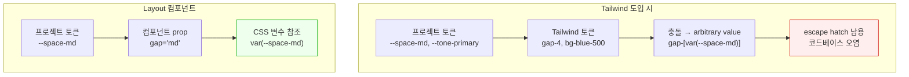

# Tailwind의 Escape Hatch 문제 — 디자인 시스템 프로젝트에서의 충돌과 대안

> 작성일: 2026-03-25
> 맥락: interactive-os는 자체 CSS 변수 토큰 시스템(DESIGN.md)을 가지고 있다. 구조적 CSS(레이아웃)를 LLM이 파악하기 어려워서 Tailwind 도입을 검토했으나, escape hatch 남용과 토큰 이중 관리가 우려됨.

> **Situation** — LLM이 CSS 파일과 JSX 분리 구조에서 레이아웃을 파악하지 못해 반복 실수(gridColumn 등)가 발생한다.
> **Complication** — Tailwind은 LLM 친화적이지만, 자체 디자인 시스템이 있는 프로젝트에서는 arbitrary values(`[...]`)가 남용되고 토큰이 이중 관리된다.
> **Question** — 자체 토큰 + LLM 가시성을 양립하는 방법은 무엇인가?
> **Answer** — **목적별 Layout 컴포넌트** — 토큰은 CSS 변수 유지, 구조만 TypeScript prop으로 표현. Panda CSS의 패턴 레이어가 이 접근의 참조 구현.

---

## Why — Tailwind과 자체 디자인 시스템이 충돌하는 구조적 이유

Tailwind은 **자체 토큰 체계**(spacing, color, breakpoint)를 가진 프레임워크다. 프로젝트에 이미 별도 토큰이 있으면, 두 체계가 경쟁한다.



### 3가지 충돌 지점

**1. 토큰 이중 관리**

Tailwind의 `gap-4`는 `1rem`. 프로젝트의 `--space-md`도 `1rem`. 같은 값을 두 시스템이 관리하면, 한쪽을 바꿀 때 다른 쪽은 그대로 — 디자인 불일치.

Tailwind 4의 `@theme`이 CSS 변수를 소스로 쓸 수 있게 했지만, 이러면 Tailwind 클래스 이름(`gap-md`)이 프로젝트 토큰 이름(`--space-md`)과 매핑 레이어가 하나 더 생김.

**2. Arbitrary Values 남용**

프로젝트 토큰을 Tailwind에서 쓰려면 `gap-[var(--space-md)]` 같은 arbitrary value를 써야 한다. 이것은 Tailwind이 "escape hatch"로 제공하는 기능이지만, 디자인 시스템 프로젝트에서는 escape가 기본 경로가 되어버린다.

**3. 동적 스타일링 한계**

컴포넌트 variant(primary/secondary), prop 기반 색상, 런타임 값 등은 Tailwind의 static class 모델과 근본적으로 충돌. `className={variant === 'primary' ? 'bg-blue-500' : 'bg-gray-500'}` 같은 패턴이 필요하고, 이건 디자인 시스템의 variant API와 이중 구현.

---

## How — 업계의 세 가지 접근

### 접근 1: Tailwind + @theme (토큰 통합 시도)

Tailwind 4에서 `@theme`을 통해 CSS 변수를 소스로 사용 가능.

하지만 제한:
- 모든 토큰을 Tailwind 유틸리티로 노출해야 함 — 사용하지 않는 유틸리티도 생성
- 레이아웃 토큰(grid column 수, flex 방향 등)은 유틸리티화가 어색
- 런타임 동적 값은 여전히 arbitrary value 필요

### 접근 2: Panda CSS / Vanilla Extract (타입 안전 CSS-in-JS)

Panda CSS는 Tailwind의 JIT 성능 + 디자인 시스템 친화적 API를 결합.

Layout 패턴이 핵심:
```typescript
// Panda CSS의 Stack 패턴 — 함수 또는 JSX
<Stack gap="6" padding="4">...</Stack>

// 또는 함수형
className={stack({ gap: '6', padding: '4' })}
```

14개 레이아웃 패턴 내장: Stack, HStack, VStack, Flex, Grid, GridItem, Container, Wrap, Center, AspectRatio, Float, Divider, Circle, Square.

장점: 타입 안전, 토큰 참조 자동, zero-runtime (빌드 타임 추출).
단점: 새 의존성, 빌드 파이프라인 변경, 학습 곡선.

### 접근 3: 목적별 Layout 컴포넌트 (자체 구현)

Panda CSS의 패턴을 라이브러리 없이 자체 구현. 가장 가벼운 접근.

```typescript
// 프로젝트 전용 — 필요한 것만
function PageLayout({ children }) {
  return <div style={{ display: 'flex', height: '100svh' }}>{children}</div>
}

function ContentArea({ children }) {
  return <div style={{ flex: 1, minWidth: 0, overflow: 'auto' }}>{children}</div>
}
```

장점: 의존성 0, 프로젝트 특화, TypeScript 타입 체크.
단점: 범용 레이아웃 컴포넌트를 만들면 Panda CSS 재발명. 목적별만 만들면 OK.

---

## What — 비교표

| | Tailwind + @theme | Panda CSS | Layout 컴포넌트 |
|---|---|---|---|
| LLM 가시성 | ✅ className에 보임 | ✅ prop/함수에 보임 | ✅ prop에 보임 |
| 토큰 이중 관리 | 🟡 @theme으로 완화 | ✅ 없음 (CSS 변수 직접) | ✅ 없음 |
| Escape hatch | 🔴 arbitrary values 남용 | ✅ 없음 | ✅ 없음 |
| 동적 variant | 🔴 className 조합 필요 | ✅ recipe/cva | ✅ prop 분기 |
| 의존성 | Tailwind (대형) | Panda CSS (중형) | **없음** |
| 구현 비용 | 설정 + 토큰 매핑 | 설정 + 학습 | 필요한 것만 구현 |
| 범용성 | 높음 | 높음 | 낮음 (목적별) |

---

## If — interactive-os에 대한 시사점

### Tailwind 기각 근거

1. **escape hatch가 기본 경로가 된다** — `--space-md`, `--tone-primary-base` 등 이미 100+ CSS 변수를 가진 시스템에서 Tailwind을 쓰면 대부분 `[var(--...)]` arbitrary value가 됨
2. **컴포넌트 module.css와 충돌** — 이미 17개 UI 컴포넌트가 CSS Module로 스타일링됨. Tailwind과 병행하면 "이 스타일은 어디에?" 문제
3. **디자인 시스템 스킬과 충돌** — `/design-implement`가 DESIGN.md 5개 번들을 강제하는데, Tailwind은 이 체계 밖

### 추천 방향

**목적별 Layout 컴포넌트가 가장 적합.**

이유:
- 의존성 0 — Panda CSS 빌드 파이프라인 불필요
- 토큰 체계 유지 — CSS 변수 직접 참조
- LLM 가시성 확보 — `<PageLayout>`, `<ContentArea>` prop이 JSX에서 즉시 가시
- 범위 제한 — 구조적 레이아웃만 컴포넌트화, 테마/장식은 CSS 유지

구체적으로 필요한 컴포넌트:
```
<PageLayout>       — flex, height:100svh (AppShell 전용)
<SidebarLayout>    — flex, sidebar:192px + content:flex-1
<ContentArea>      — flex:1, overflow:auto, padding
```

범용 `<Flex>`, `<Stack>`, `<Grid>` 같은 primitive는 Panda CSS 재발명이므로 만들지 않는다. 프로젝트에서 반복되는 목적별 레이아웃만 컴포넌트화.

---

## Insights

- **"Tailwind은 LLM에 좋다"는 반만 맞다.** Tailwind 유틸리티 클래스는 LLM이 생성하기 좋지만, 자체 토큰이 있으면 LLM이 Tailwind 토큰과 프로젝트 토큰 사이에서 혼란. arbitrary value `[var(--space-md)]`를 생성하면 가독성이 CSS 파일보다 나빠짐.

- **Panda CSS의 패턴 레이어가 가장 균형 잡힌 설계.** 하지만 빌드 파이프라인 추가 비용이 있다. 프로젝트가 3-5개 레이아웃 패턴만 필요하면, Panda를 도입하는 것보다 자체 컴포넌트가 ROI가 높다.

- **"구조 vs 장식" 분리가 핵심.** 디자인 시스템에서 CSS의 역할을 둘로 나누면: 장식(색상, 간격, 모션) = CSS 변수, 구조(flex, grid, overflow) = JSX 컴포넌트 prop. 이 분리를 지키면 두 관심사가 충돌하지 않는다.

---

## Sources

| # | 출처 | 유형 | 핵심 내용 |
|---|------|------|----------|
| 1 | [Don't use Tailwind for your Design System](https://sancho.dev/blog/tailwind-and-design-systems) | 기술 블로그 | 디자인 시스템에서 Tailwind의 구조적 한계 — variant, 동적 스타일, 캡슐화 |
| 2 | [Tailwind vs Semantic CSS (Nue)](https://nuejs.org/blog/tailwind-vs-semantic-css/) | 기술 블로그 | 코드 크기 8.5x 차이, 테마/관심사 분리 |
| 3 | [Tailwind CSS 4 @theme](https://medium.com/@sureshdotariya/tailwind-css-4-theme-the-future-of-design-tokens-at-2025-guide-48305a26af06) | 블로그 | @theme으로 CSS 변수 통합 시도 |
| 4 | [Panda CSS Patterns](https://panda-css.com/docs/concepts/patterns) | 공식 문서 | 14개 레이아웃 패턴, JSX 컴포넌트 + 함수 이중 API |
| 5 | [Arbitrary values discussion](https://github.com/tailwindlabs/tailwindcss/discussions/18748) | GitHub | 토큰 vs arbitrary value 가이드라인 |
| 6 | [Panda CSS Origin Story](https://www.adebayosegun.com/blog/panda-css-the-origin-story) | 블로그 | Chakra UI → Panda CSS 설계 동기 |
| 7 | [React CSS in 2026](https://medium.com/@imranmsa93/react-css-in-2026-best-styling-approaches-compared-d5e99a771753) | 블로그 | Tailwind 62% 만족도, CSS Module과의 비교 |
