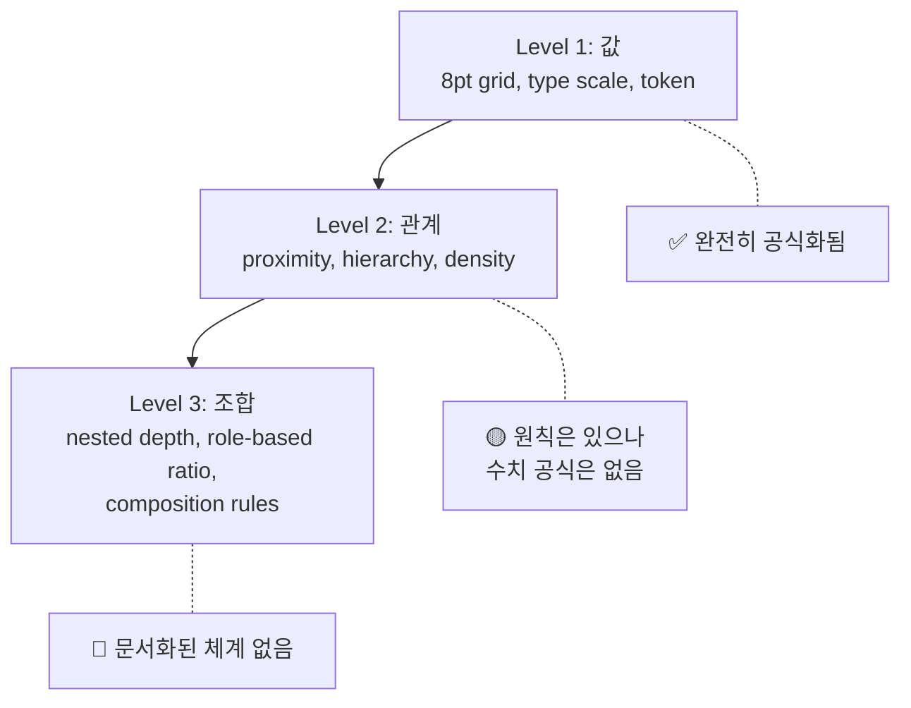
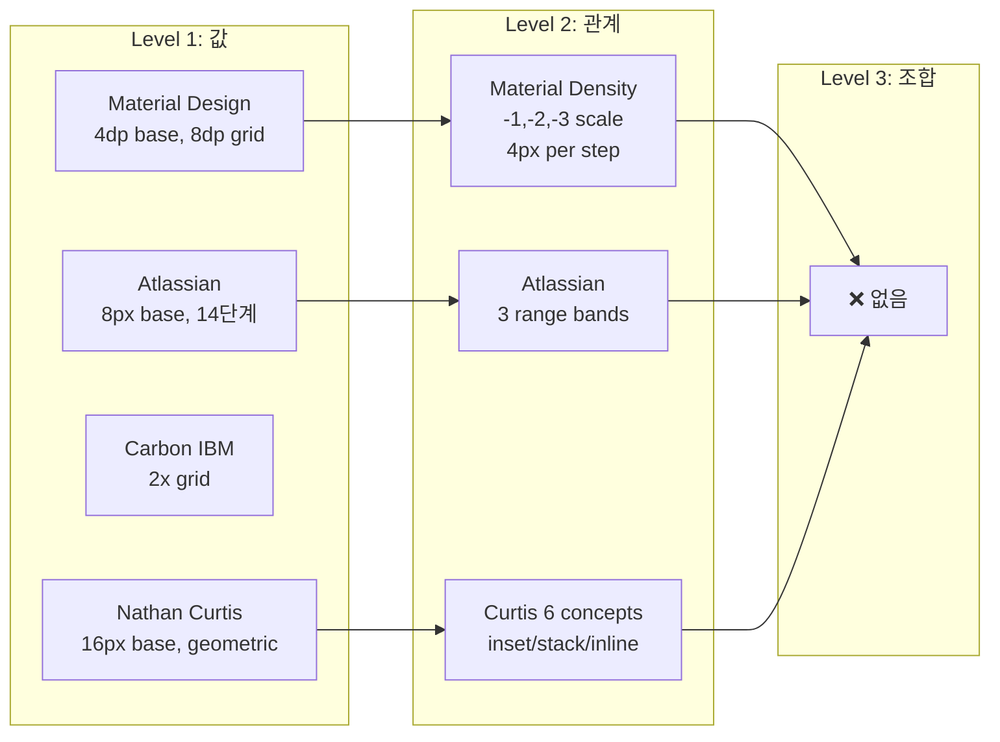

# UI Spacing 관계 규칙의 수치화 — 값 레벨을 넘어선 공식은 존재하는가

> 작성일: 2026-03-26
> 맥락: LLM이 spacing 값(8pt grid)은 알지만 관계/위계/조합 규칙을 못 쓰는 이유를 외부 자료에서 확인

> **Situation** — 8pt grid, modular type scale, spacing token 등 "값" 레벨의 spacing 공식은 이미 업계 표준이다.
> **Complication** — 그런데 이 값들을 아는 LLM도 "구린" UI를 만든다. 값 위의 관계 규칙이 공식화되어 있는지 조사했다.
> **Question** — 요소 간 spacing 관계(위계, 밀도, 조합)를 수치로 공식화한 체계가 존재하는가?
> **Answer** — **부분적으로만 존재한다.** 값 레벨은 완성, 관계 레벨은 3개 원칙이 발견되나 수치 공식은 아님, 조합 레벨은 공백.

---

## Why — 값만으로는 왜 부족한가

spacing 지식은 3개 레벨로 나뉜다:



**Level 1 (값)** 은 모든 디자인 시스템이 해결했다. 8pt grid, 4pt sub-grid, geometric/linear scale.

**Level 2 (관계)** 는 Gestalt proximity, 위계 원칙이 있지만 — "가까우면 관련, 멀면 분리"라는 정성적 기술이지 "몇 px 차이면 같은 그룹으로 인지되는가"라는 정량적 공식이 아니다.

**Level 3 (조합)** — nested component에서 depth별 padding 감소, container padding과 child gap의 비율, role별(주연/조연) 밀도 차이 — 이 레벨의 공식화된 체계는 **발견되지 않았다.**

---

## How — 발견된 관계 규칙 3가지

조사에서 발견된, 값 레벨을 넘어서는 관계 규칙:

### 규칙 1: Internal ≤ External (내부 ≤ 외부)

> "The margin around a block should be at least as large as the padding inside it — often larger."

```
container padding ≤ gap between containers
```

| 출처 | 표현 |
|------|------|
| Cieden | "internal ≤ external" — 공식화된 부등식 |
| Design for Ducks | container padding 24px, child gap 8px/16px |
| Red Hat | 2:1 ratio (좌우 32px, 상하 16px — squish inset) |

**한계:** 부등식이지 등식이 아니다. "얼마나 더 커야 하는가"는 정의되지 않음.

### 규칙 2: Depth → Density 증가 (깊이 → 밀도)

> "The more you go deep into subgroups, the smaller the margins become."

```
depth 0: section gap = 32px
depth 1: component gap = 16px
depth 2: element gap = 8px
depth 3: icon-text gap = 4px
```

| 출처 | 스케일 |
|------|--------|
| Designary | 4px(icon-text) → 8px(element) → 16px(component) → 24px(section) |
| Design for Ducks | 8px(best friends) → 16px(casual friends) → 24px(container) |
| Atlassian | small(0-8px) → medium(12-24px) → large(32-80px) 3단계 범위 |

**한계:** 2의 거듭제곱 패턴이 반복되지만, "depth n에서의 spacing = f(n)"이라는 공식은 없음. 각 시스템이 ad-hoc으로 정의.

### 규칙 3: Squish Ratio (수직 압축)

Nathan Curtis가 공식화한 유일한 수치 관계:

```
squish inset: vertical = horizontal × 0.5
stretch inset: vertical = horizontal × 1.5
```

| 개념 | 비율 | 용도 |
|------|------|------|
| Square inset | 1:1 | 카드, 패널 |
| Squish inset | 0.5:1 | 버튼, 리스트 아이템, 테이블 셀 |
| Stretch inset | 1.5:1 | 텍스트 입력, textarea |

**이것이 조사에서 발견된 유일한 수치 공식이다.**

---

## What — 주요 디자인 시스템의 spacing 체계 비교



### Material Design Density Scale

유일하게 "관계"를 수치화한 시도:

```
density 0 (default): component height = base
density -1 (comfortable): height = base - 4px
density -2 (compact): height = base - 8px
density -3 (dense): height = base - 12px
```

**역관계 규칙:** "컴포넌트 밀도가 높아지면 → 레이아웃 밀도는 낮춰라" (margin/gutter 증가). 하지만 이 역관계의 비율은 정의되지 않음.

### Nathan Curtis의 6가지 spacing 개념

| 개념 | CSS 대응 | 방향 |
|------|----------|------|
| Inset | padding (all sides) | 내부 |
| Squish | padding (V < H) | 내부 |
| Stretch | padding (V > H) | 내부 |
| Stack | margin-bottom / gap | 수직 외부 |
| Inline | margin-right / gap | 수평 외부 |
| Grid | grid gutter | 레이아웃 |

이것은 "어디에 spacing이 들어가는가"를 분류한 것이지, "얼마를 넣는가"의 관계 규칙은 아님.

### Dynamic Spacing Formula (Design for Ducks)

```
X = smallest_font_size × ratio

ratio options:
  0.75 — compact
  1.00 — standard
  1.25 — spacious

spacing levels: X, 2X, 3X, 6X
```

예: font 32px, ratio 1.25 → X=40px → levels: 40, 80, 120, 240px

**이것이 typography와 spacing을 연결하는 유일한 수치 공식이다.**

### LLM을 위한 3-Layer Token Architecture (Hardik Pandya)

```
Layer 1 (upstream):  --ds-space-100: 8px
Layer 2 (project):   --space-100: var(--ds-space-100, 8px)
Layer 3 (component): padding: var(--space-100)
```

+ `token-audit.js`로 하드코딩 검출 (CI 통합, 418 violations → 0)

**이것은 값의 enforcement이지 관계의 공식화가 아니다.**

---

## If — 프로젝트에 대한 시사점

### 발견: 빈 공간이 확인되었다

조사 결과, **Level 3 (조합 규칙)을 수치로 공식화한 체계는 존재하지 않는다.**

| 질문 | 답 |
|------|-----|
| "Card padding이 16px이면 Card 사이 gap은 몇이어야 하나?" | ≥16px (부등식만 존재) |
| "Section 안 Card, Card 안 List일 때 각 depth의 spacing은?" | 관례적 halving (32→16→8) |
| "주연 요소와 조연 요소의 밀도 차이는?" | 문서화된 규칙 없음 |
| "font-size가 바뀌면 padding은 어떻게 바뀌어야 하나?" | X = font × ratio (1개 공식만 존재) |

### 미감 공식화 프로젝트와의 연결

이 프로젝트에서 이미 진행 중인 4가지 런타임 규칙(정렬 축, 시각 노이즈, ARIA 시각 효과, 콘텐츠-경계 간격)은 Level 2-3의 빈 공간을 채우려는 시도다.

추가로 공식화할 수 있는 후보:

| 후보 규칙 | 공식화 가능성 | 측정 방법 |
|-----------|-------------|-----------|
| internal ≤ external 비율 | 높음 | padding vs parent gap ratio 측정 |
| depth별 spacing 감소율 | 높음 | nested depth별 실제 gap 측정 |
| squish ratio (V:H) | 이미 존재 | 0.5:1 / 1:1 / 1.5:1 |
| font-size → padding 비율 | 중간 | 레퍼런스 사이트 실측 |
| 주연/조연 밀도 차이 | 낮음 | 역할 판단 필요 |

---

## Insights

- **값 레벨의 포화 vs 관계 레벨의 공백**: 8pt grid를 다루는 글은 수백 편이지만, "card padding과 card gap의 비율"을 수치로 정의한 글은 0편이다. 업계 전체가 Level 1에 머물러 있다.
- **Gestalt proximity는 정량화되지 않았다**: "가까우면 관련"이라는 원칙은 100년 전부터 있지만, "몇 px 차이부터 다른 그룹으로 인지하는가"는 학술적으로도 미해결이다. CHI 2016 논문(Computational Layout Perception using Gestalt Laws)이 시도했으나 생성이 아닌 분석용이다.
- **Nathan Curtis의 squish ratio가 유일한 수치 공식**: inset/squish/stretch의 V:H 비율(1:1, 0.5:1, 1.5:1)이 조사에서 발견된 유일한 관계 수치다. 나머지는 전부 "원칙"이지 "공식"이 아니다.
- **LLM이 디자인을 못하는 이유가 여기 있다**: 공식 자체가 존재하지 않는데 LLM이 할 수 있을 리 없다. 사람 디자이너도 이 레벨은 "감"으로 하고 있다 — 다만 좋은 디자이너의 감이 일관되어서 "공식이 있는 것처럼" 보일 뿐이다.
- **레퍼런스 실측이 유일한 방법**: 공식이 없으므로, 좋은 디자인에서 역공학으로 규칙을 추출하는 것이 현재 가능한 유일한 접근이다. 이 프로젝트의 /design-extract 방향이 정확히 이것이다.

---

## Sources

| # | 출처 | 유형 | 핵심 내용 |
|---|------|------|----------|
| 1 | [Space in Design Systems — Nathan Curtis](https://eightshapes.com/articles/space-in-design-systems/) | 전문가 블로그 | 6가지 spacing 개념(inset/squish/stretch/stack/inline/grid), squish=0.5 유일한 수치 공식 |
| 2 | [UI Spacing Cheat Sheet — Design for Ducks](https://designforducks.com/ui-spacing-cheat-sheet-a-complete-guide-2/) | 블로그 | X=font×ratio 공식, friendship 3단계(8/16/24px) |
| 3 | [Spacing Best Practices — Cieden](https://cieden.com/book/sub-atomic/spacing/spacing-best-practices) | 블로그 | internal ≤ external 부등식 규칙, 8pt grid |
| 4 | [Atlassian Spacing](https://atlassian.design/foundations/spacing/) | 공식 문서 | 14단계 토큰 스케일(0-80px), 3 range bands |
| 5 | [Carbon Spacing — IBM](https://carbondesignsystem.com/elements/spacing/overview/) | 공식 문서 | 2x grid, condensed/normal density (2x ratio) |
| 6 | [Expose Your Design System to LLMs — Hardik Pandya](https://hvpandya.com/llm-design-systems) | 블로그 | 3-layer token architecture, token-audit.js CI enforcement |
| 7 | [Material Design Density — Una Kravets](https://medium.com/google-design/using-material-density-on-the-web-59d85f1918f0) | 공식 블로그 | density scale(0/-1/-2/-3), 4px per step, 역관계 규칙 |
| 8 | [Spacing, Grids, and Layouts — designsystems.com](https://www.designsystems.com/space-grids-and-layouts/) | 전문 사이트 | 8pt/4pt grid, button padding=line-height+2×base |
| 9 | [Gestalt Proximity — Smashing Magazine](https://www.smashingmagazine.com/2019/04/spaces-web-design-gestalt-principles/) | 블로그 | proximity 원칙의 정성적 적용, 수치 공식 부재 확인 |
| 10 | [UI Layout Generation with LLMs Guided by UI Grammar](https://arxiv.org/abs/2310.15455) | 학술 논문 | UI grammar으로 LLM 레이아웃 생성 가이드, hierarchical structure encoding |
| 11 | [Computational Layout Perception using Gestalt Laws](https://dl.acm.org/doi/10.1145/2851581.2892537) | 학술 논문 | 4개 Gestalt law로 90% 케이스 hierarchical grouping 가능 (분석용) |
| 12 | [Top-Down Approach in Component Spacing — Woovi](https://dev.to/woovi/design-system-101-top-down-approach-in-component-spacing-281m) | 블로그 | 부모가 자식 spacing 제어 원칙, gap property 우선 |

---

## Walkthrough

> 이 조사 결과를 프로젝트에서 직접 활용하려면?

1. **현재 규칙 확인**: `pnpm score:design` → 기존 6개 정적 규칙(surface/cursor/minSize/hover/focusVisible/cssTokens)의 점수 확인
2. **레퍼런스 실측**: `/design-extract`로 레퍼런스 사이트에서 padding/gap/depth별 spacing 수치 추출
3. **관계 규칙 후보 인코딩**: internal≤external 비율, depth별 감소율을 `score:design-visual`에 추가
4. **자가성장 루프**: `/improve`로 측정→수정→재측정 반복
