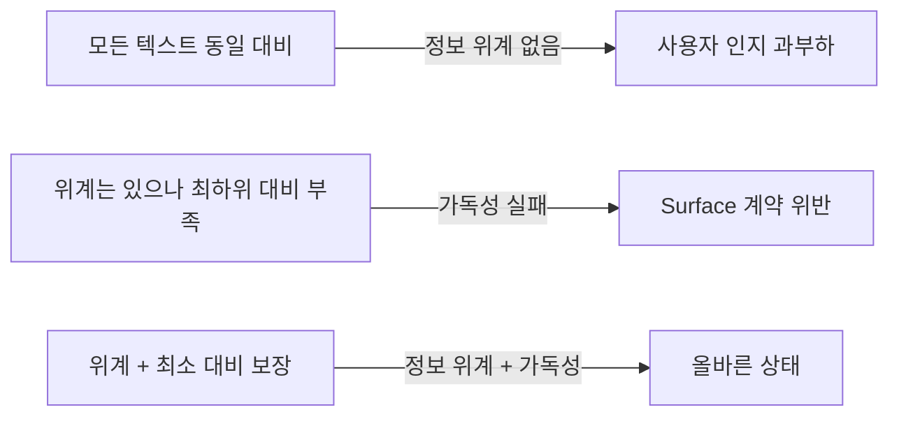
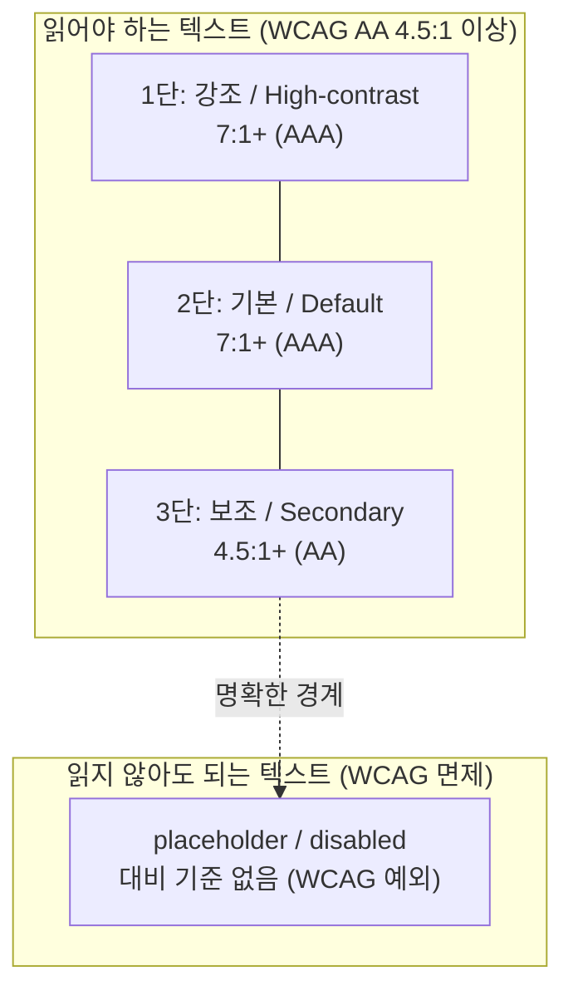
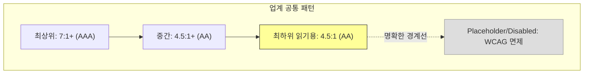

# Text Color Hierarchy Tokens — 디자인 시스템별 텍스트 색상 위계 비교

> 작성일: 2026-03-26
> 맥락: Surface 위 text-muted가 WCAG AA를 전면 실패하여, 업계 표준 텍스트 위계 구조와 대비 기준을 조사

> **Situation** — 우리 디자인 시스템은 4단 텍스트 위계(bright/primary/secondary/muted)를 사용하며, Surface 번들이 모든 텍스트의 가독성을 보장해야 한다.
> **Complication** — text-muted가 모든 Surface에서 WCAG AA(4.5:1)는 물론 large text AA(3:1)조차 못 넘기는 경우가 있어, Surface의 가독성 계약이 깨져 있다.
> **Question** — 업계 주요 디자인 시스템은 텍스트 위계를 몇 단계로, 어떤 이름과 역할로, 어떤 대비 기준으로 정의하는가?
> **Answer** — 대부분 3~4단계이며, 최하위 "읽어야 하는" 텍스트는 최소 4.5:1(WCAG AA)을 보장한다. 그 아래는 disabled/placeholder로 분리하여 WCAG 면제 대상으로 명시적 처리한다.

---

## Why — 텍스트 위계가 필요한 이유

텍스트 위계는 정보 중요도를 시각적으로 인코딩하는 가장 기본적인 수단이다. 모든 텍스트가 같은 대비라면 사용자는 무엇이 중요한지 판단할 수 없고, 대비가 너무 낮으면 아예 읽을 수 없다.

핵심 긴장: **위계 구분(낮은 대비로 "덜 중요함" 표현)** vs **가독성(읽으려면 최소 대비 필요)**. 이 둘의 균형점이 각 디자인 시스템의 텍스트 토큰 설계를 결정한다.

---

## How — 업계 표준 구조

### 공통 패턴: "읽어야 하는 것"과 "읽지 않아도 되는 것"의 경계

모든 주요 디자인 시스템이 공유하는 핵심 구조:

**경계의 의미**: 3단(secondary/helper)까지는 "사용자가 읽어야 한다" → AA 필수. 그 아래(placeholder/disabled)는 "읽을 필요 없거나 상호작용 불가" → WCAG 1.4.3 면제.

---

## What — 시스템별 상세 비교

### 1. Radix Colors (shadcn/ui 기반)

| Step | 역할 | APCA 대비 | 비고 |
|------|------|-----------|------|
| Step 12 | **High-contrast text** | Lc 90+ (on Step 2) | 본문, 제목 |
| Step 11 | **Low-contrast text** | Lc 60+ (on Step 2) | 보조 텍스트, 캡션 |

- **2단계** 텍스트 위계 (12-step 스케일에서 11, 12만 텍스트용)
- APCA 기반 — WCAG 2.x가 아닌 차세대 대비 알고리즘 사용
- Lc 60 ≈ WCAG 2.x의 ~4.5:1에 해당
- placeholder/disabled는 별도 opacity 처리

**shadcn/ui 구현:**

| 토큰 | Light 값 | Dark 값 | 역할 |
|------|----------|---------|------|
| `foreground` | neutral-950 (~#0a0a0a) | ~#fafafa | 기본 텍스트 |
| `muted-foreground` | neutral-500 (~#737373) | ~#a3a3a3 | 보조 텍스트, 캡션, 타임스탬프 |

- **알려진 문제**: muted-foreground(#737373) on muted(#F5F5F5) = **4.34:1 → AA 미달** ([이슈 #8088](https://github.com/shadcn-ui/ui/issues/8088))
- 수정 제안: #707070 → 4.54:1로 AA 달성

### 2. IBM Carbon

| 토큰 (v11) | White 테마 | Gray 100 테마 | 역할 |
|------------|-----------|---------------|------|
| `text-primary` | #161616 (Gray 100) | #F4F4F4 (Gray 10) | 본문, 제목 |
| `text-secondary` | #525252 (Gray 70) | #C6C6C6 (Gray 30) | 보조 설명 |
| `text-placeholder` | rgba(22,22,22, 0.40) | rgba(244,244,244, 0.40) | 입력 힌트 |
| `text-disabled` | rgba(22,22,22, 0.25) | rgba(244,244,244, 0.25) | 비활성 |
| `text-helper` | #6F6F6F (Gray 50) | #A8A8A8 (Gray 40) | 폼 도움말 |
| `text-error` | #DA1E28 (Red 60) | #FF8389 (Red 40) | 오류 |

- **3단계** 읽기용 텍스트 (primary, secondary, helper) + **2단계** 면제 (placeholder, disabled)
- **핵심 설계**: placeholder/disabled는 **opacity 기반** — `text-primary`의 40%/25%
  - 이유: 레이어가 바뀌어도 상대적 강조도가 일정 (absolute hex보다 유연)
  - 공식 입장: "Neither needs to pass color contrast" ([이슈 #10054](https://github.com/carbon-design-system/carbon/issues/10054))
- text-secondary(#525252 on #FFFFFF) ≈ **7.2:1** (AAA)
- text-helper(#6F6F6F on #FFFFFF) ≈ **4.7:1** (AA)

### 3. Adobe Spectrum

| 단계 | Gray 스케일 | 대비 기준 | 역할 |
|------|-----------|-----------|------|
| Heading | Gray 900 | 4.5:1+ (on Gray 100) | 제목 |
| Body text | Gray 800 | 4.5:1+ | 본문 |
| Subdued text | Gray 700 | 4.5:1+ | 보조 텍스트 |
| Label | Gray 700 | 4.5:1+ | 폼 레이블 |
| Disabled | Gray 500 | **3:1** (의도적 감소) | 비활성 |

- **4단계** 읽기용 + **1단계** 면제
- 특징: 읽기용 텍스트는 **전부 4.5:1 이상** — 최하위 Subdued/Label도 예외 없음
- Disabled만 3:1로 의도적 감소 → "상호작용 불가임을 시각적으로 전달"

### 4. Material Design 3

| 토큰 | 역할 | 대비 |
|------|------|------|
| `on-surface` (#1C1B1D) | 기본 텍스트 | ~16:1 on white (AAA) |
| `on-surface-variant` (#4D4256) | 보조 텍스트 | ~7:1 on white (AAA) |
| `outline` | 경계선 | 3:1+ |
| `outline-variant` | 약한 경계선 | — |

- **2단계** 텍스트 위계 (on-surface / on-surface-variant)
- 특징: 가장 단순한 모델. 2단계만으로 위계 + 가독성 동시 달성
- 둘 다 AAA 수준 — **최하위 텍스트도 7:1**

### 5. APCA (차세대 WCAG 3 후보)

| Lc 레벨 | 용도 | WCAG 2.x 대략 환산 |
|---------|------|-------------------|
| Lc 90 | 본문, 단락 텍스트 (권장) | ~7:1 (AAA) |
| Lc 75 | 본문 최소, 큰 보조 텍스트 | ~4.5:1 (AA) |
| Lc 60 | 비본문 콘텐츠 텍스트 | ~3.5:1 |
| Lc 45 | 제목, 큰 텍스트 | ~3:1 (AA-lg) |
| Lc 30 | **Placeholder, disabled** | ~2:1 |
| Lc 15 | 비텍스트 장식 (이 이하 = invisible) | ~1.5:1 |

---

## 종합 비교표

| 시스템 | 읽기용 단계 | 면제 단계 | 최하위 읽기용 대비 | 면제 처리 |
|--------|-----------|----------|-----------------|----------|
| **Radix/shadcn** | 2 (high/low) | opacity | Lc 60 ≈ **4.5:1** | 별도 opacity |
| **Carbon** | 3 (primary/secondary/helper) | 2 (placeholder/disabled) | **4.7:1** (helper) | text-primary의 40%/25% opacity |
| **Spectrum** | 4 (heading/body/subdued/label) | 1 (disabled) | **4.5:1** (subdued) | Gray 500 → 3:1 |
| **Material 3** | 2 (surface/variant) | — | **7:1** (variant) | 별도 disabled 상태 |
| **APCA** | 3 (Lc90/75/60) | 2 (Lc30/15) | **Lc 60 ≈ 3.5:1** | Lc 30 명시 |

**핵심 발견: 모든 시스템에서 "읽어야 하는 최하위 텍스트"는 4.5:1 이상이다.** 어떤 시스템도 2~3:1 대비를 "읽어야 하는 텍스트"에 허용하지 않는다.

---

## If — 우리 프로젝트에 대한 시사점

### 현재 상태 진단

| 토큰 | Dark (on default) | Light (on default) | 업계 기준 |
|------|-------------------|-------------------|----------|
| text-bright | 15.9:1 AAA ✅ | 19.3:1 AAA ✅ | ≥ 7:1 |
| text-primary | 13.7:1 AAA ✅ | 17.2:1 AAA ✅ | ≥ 7:1 |
| text-secondary | 6.0:1 AA ✅ | 5.1:1 AA ✅ | ≥ 4.5:1 |
| **text-muted** | **2.3:1 FAIL** ❌ | **2.7:1 FAIL** ❌ | ≥ 4.5:1 또는 면제 |

### text-muted의 정체성 문제

우리 시스템에서 text-muted는 **4단 위계의 최하위**이지, disabled/placeholder가 아니다. 그런데 실제 대비(2.3~2.8:1)는 업계에서 **placeholder/disabled 수준**(Carbon의 25~40% opacity, APCA Lc 30)에 해당한다.

즉, **"읽어야 하는 텍스트"인데 "읽지 않아도 되는 텍스트"의 대비를 갖고 있다.**

### 해결 방향

Carbon의 opacity 모델이 가장 시사적이다:

| 역할 | 대비 기준 | 우리 매핑 |
|------|----------|----------|
| 읽기용 최하위 (helper) | 4.5:1+ AA | **text-muted → 여기로 올려야** |
| Placeholder | ~40% opacity (면제) | 별도 토큰 필요 시 추가 |
| Disabled | ~25% opacity (면제) | opacity: 0.4 (현재 동작) |

---

## Insights

- **shadcn/ui도 같은 문제를 겪고 있다**: muted-foreground가 4.34:1로 AA 미달이라는 이슈가 열려 있다. 업계 전반적으로 "muted"라는 이름이 "얼마나 낮춰도 되는지"에 대한 과소평가를 유발하는 경향이 있다.
- **Carbon의 opacity 접근법**: disabled/placeholder를 hex가 아닌 primary의 opacity로 정의하면, Surface가 바뀌어도 상대적 강조도가 자동 유지된다. Surface 계약과 자연스럽게 정합한다.
- **"읽기용 최하위 = AA"는 업계 합의**: Radix, Carbon, Spectrum, Material 모두 "읽어야 하는 가장 약한 텍스트"에 4.5:1 이상을 보장한다. 어떤 시스템도 3:1 미만을 읽기용 텍스트에 허용하지 않는다.
- **APCA가 주는 뉘앙스**: WCAG 3 후보인 APCA는 Lc 60(≈3.5:1)을 비본문 콘텐츠 텍스트의 최소로 잡는다. 이는 기존 4.5:1보다 약간 관대하지만, 본문 텍스트에는 여전히 Lc 75(≈4.5:1) 이상을 요구한다.

---

## Sources

| # | 출처 | 유형 | 핵심 내용 |
|---|------|------|----------|
| 1 | [Radix Colors — Understanding the Scale](https://www.radix-ui.com/colors/docs/palette-composition/understanding-the-scale) | 공식 문서 | 12-step 스케일, Step 11/12 텍스트 대비 보장 (Lc 60/90) |
| 2 | [Material Design 3 — Color Roles](https://m3.material.io/styles/color/roles) | 공식 문서 | on-surface / on-surface-variant 2단 텍스트 위계 |
| 3 | [Adobe Spectrum — Color System](https://spectrum.adobe.com/page/color-system/) | 공식 문서 | Gray 700~900 텍스트, 500 disabled, 전부 4.5:1+ |
| 4 | [Carbon — Color Tokens](https://carbondesignsystem.com/elements/color/tokens/) | 공식 문서 | text-primary/secondary/helper/placeholder/disabled 5단 |
| 5 | [Carbon Issue #10054](https://github.com/carbon-design-system/carbon/issues/10054) | GitHub | placeholder/disabled opacity 기반 전환, "Neither needs to pass contrast" |
| 6 | [shadcn/ui Issue #8088](https://github.com/shadcn-ui/ui/issues/8088) | GitHub | muted-foreground 4.34:1 → AA 미달, #707070 수정 제안 |
| 7 | [APCA in a Nutshell](https://git.apcacontrast.com/documentation/APCA_in_a_Nutshell.html) | 표준 후보 | Lc 90/75/60/45/30/15 레벨별 용도 정의 |
| 8 | [WCAG 2.1 — Contrast Minimum](https://www.w3.org/WAI/WCAG21/Understanding/contrast-minimum.html) | W3C | 4.5:1 기본, 3:1 large text, disabled 면제 |
| 9 | [shadcn/ui Colors Naming](https://isaichenko.dev/blog/shadcn-colors-naming/) | 블로그 | foreground/muted-foreground 토큰 역할 해설 |

---

## Walkthrough

> 이 조사 결과를 프로젝트에서 직접 확인하려면?

1. `src/styles/tokens.css`에서 `--text-muted` 값 확인 (Dark: `--stone-600` = #5C5B56, Light: #9B9DA6)
2. 브라우저 DevTools → 아무 Surface 위의 muted 텍스트 선택 → Computed 탭에서 color 확인
3. [WebAIM Contrast Checker](https://webaim.org/resources/contrastchecker/)에 foreground/background 입력
4. 결과가 4.5:1 미만이면 → Surface 계약 위반 확인
