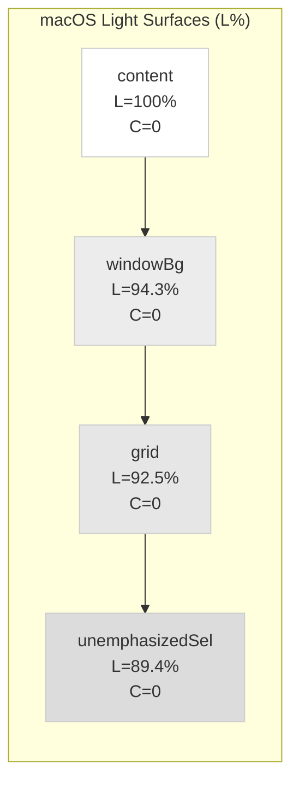
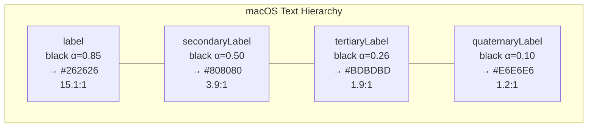

# macOS Sequoia Light Theme Colors — 시스템 앱 색상 실측

> 작성일: 2026-03-26
> 맥락: Light theme surface 톤이 부자연스러워서, macOS 최신 네이티브 앱의 실제 색상을 레퍼런스로 조사

> **Situation** — OKLCH warm stone 팔레트로 light theme를 만들었으나, sunken surface가 부담스럽게 보인다.
> **Complication** — warm chroma(C=0.012)가 밝은 배경에서 눈에 띄는 cream 색으로 보이며, 현대 macOS의 깔끔한 느낌과 괴리가 있다.
> **Question** — macOS Sequoia 네이티브 앱은 실제로 어떤 색상 톤과 구조를 사용하는가?
> **Answer** — 완전한 무채색(chroma=0), opacity 기반 텍스트, 매우 tight한 surface gap(6% L). Surface에 색온도가 없다.

---

## Why — 왜 macOS 색상을 참고하는가

macOS는 가장 광범위하게 검증된 light theme 레퍼런스다. 수십억 시간의 사용자 노출을 거친 색상 체계이며, 접근성(WCAG)과 심미성을 동시에 달성한다. 우리 앱이 macOS 위에서 실행되므로, 네이티브 앱과의 시각적 일관성이 사용자 신뢰에 직결된다.

---

## How — macOS 색상 체계의 구조

### 1. Surface: 완전 무채색 + tight gap

- **Chroma = 0** — 모든 배경이 순수 gray. warm도 cool도 아님.
- **Gap 최대 6%** — content(100%)와 windowBg(94.3%) 사이가 5.7%.
- **Vibrancy** — sidebar는 고정 색이 아니라 반투명 blur로 깊이 표현. 고정 색상 정의 불필요.

### 2. Text: opacity 기반 위계

- **2단계만 AA** — label(15.1:1)만 AAA, secondary(3.9:1)는 AA-large.
- **3~4단은 의도적 FAIL** — tertiary/quaternary는 장식적 역할. 읽어야 하는 텍스트에 사용하지 않음.
- **opacity 기반** — 고정 hex가 아니라 black의 투명도. 배경이 바뀌어도 상대적 강조도 유지.

---

## What — 실측 데이터 (macOS Sequoia, 현재 시스템에서 직접 추출)

### Background Colors

| NSColor | Hex | L% (OKLCH) | Chroma | 용도 |
|---------|-----|-----------|--------|------|
| controlBackground | #FFFFFF | 100.0% | 0 | 콘텐츠 영역, 입력 필드 |
| textBackground | #FFFFFF | 100.0% | 0 | 텍스트 편집 영역 |
| windowBackground | #ECECEC | 94.3% | 0 | 윈도우 크롬, toolbar |
| grid | #E6E6E6 | 92.5% | 0 | 테이블 격자선 |
| unemphasizedSelectedBg | #DCDCDC | 89.4% | 0 | 비활성 선택 배경 |
| underPageBackground | rgba(150,150,150,0.9) | ~60% | 0 | 페이지 아래 배경 |

### Label Colors (opacity on #000000)

| NSColor | Alpha | 흰 배경 실효색 | 흰 배경 대비 | 용도 |
|---------|-------|-------------|------------|------|
| label | 0.85 | #262626 | 15.1:1 AAA | 본문, 제목 |
| secondaryLabel | 0.50 | #808080 | 3.9:1 AA-lg | 보조 텍스트, 날짜 |
| tertiaryLabel | 0.26 | #BDBDBD | 1.9:1 — | 비활성 힌트 |
| quaternaryLabel | 0.10 | #E6E6E6 | 1.2:1 — | 장식적 |
| placeholderText | 0.25 | #BFBFBF | 1.8:1 — | placeholder |
| separator | 0.10 | #E6E6E6 | 1.2:1 — | 구분선 |

### Selection & Interactive

| NSColor | Hex | 용도 |
|---------|-----|------|
| selectedContentBg | #0064E1 (blue) | 활성 선택 배경 |
| link | #0068DA (blue) | 링크 텍스트 |

---

## If — 우리 프로젝트에 대한 시사점

### 현재 문제와 macOS 비교

| 속성 | 우리 (현재) | macOS | 갭 |
|------|-----------|-------|-----|
| Surface chroma | **C=0.005~0.012** (warm cream) | **C=0** (pure neutral) | 우리가 warm, macOS가 neutral |
| Sunken–Default gap | **6% L** (92→98) | **5.7% L** (94.3→100) | 비슷하나 chroma가 문제 |
| Text model | 고정 hex (stone step) | **opacity on black** | 근본적으로 다름 |
| secondaryLabel 대비 | 5.86:1 AA | 3.9:1 AA-lg only | 우리가 더 높음 |
| tertiaryLabel/muted | 4.52:1 AA | 1.9:1 FAIL | 우리가 훨씬 높음 |

### 핵심 시사점

1. **Chroma가 문제의 본질** — L% gap은 macOS와 비슷한데, C=0.012의 warm cream이 밝은 배경에서 부자연스럽게 보임. macOS는 C=0으로 이 문제를 원천 차단.

2. **Light에서 chroma를 극단적으로 낮춰야** — warm을 유지하더라도 light surface의 C는 0.003 이하로. C=0.003 at L=95%는 육안으로 거의 구분 불가.

3. **macOS의 text 대비는 놀랍게 낮음** — secondaryLabel이 3.9:1로 AA-large만 통과. Apple은 "읽어야 하는 최하위"를 우리보다 훨씬 관대하게 설정. 우리가 4.5:1을 지키는 것은 맞지만, macOS보다 보수적임을 인지.

4. **Opacity 모델의 장점** — macOS가 opacity 기반인 이유는 vibrancy(반투명 배경)와 자동 적응. 우리는 고정 배경이라 hex 토큰도 괜찮지만, Carbon처럼 opacity 기반으로 전환하면 surface 변경에 자동 적응.

---

## Insights

- **macOS light는 무채색 세계다**: 모든 배경, 모든 텍스트, 모든 구분선이 순수 gray(R=G=B). 유일한 유채색은 accent blue(선택, 링크)뿐. warm cream이 부자연스러운 이유가 여기에 있다.

- **Apple의 "읽어야 하는 최하위"는 secondary(3.9:1)다**: tertiary 이하는 장식적 요소에만 사용하고, 실제 텍스트는 label(15:1) + secondary(3.9:1) 2단계로 운영. 4단 위계는 우리 자체 설계.

- **Surface gap보다 chroma gap이 더 눈에 띈다**: L=94% vs L=100%는 subtle하지만, C=0 vs C=0.012는 "흰색 옆에 크림색"으로 즉각 인지된다. 같은 L 차이라도 chroma가 있으면 경계가 도드라진다.

---

## Sources

| # | 출처 | 유형 | 핵심 내용 |
|---|------|------|----------|
| 1 | 로컬 실측 (Swift NSColor → sRGB) | 직접 측정 | macOS Sequoia 시스템 색상 전수 추출 |
| 2 | [512 Pixels macOS Screenshot Library](https://512pixels.net/projects/aqua-screenshot-library/macos-15-sequoia/) | 스크린샷 | Sequoia Notes/Mail/Finder 시각 참조 |
| 3 | [Apple HIG — Color](https://developer.apple.com/design/human-interface-guidelines/color) | 공식 문서 | 시맨틱 색상 사용 원칙 |
| 4 | [Gerald Versluis — Dynamic Colors Overview](https://blog.verslu.is/xamarin/ios-macos-dark-mode-dynamic-colors-overview/) | 블로그 | NSColor light/dark 값 참조 테이블 |
| 5 | [NSColor Documentation](https://developer.apple.com/documentation/appkit/nscolor) | 공식 API | 시스템 색상 정의 및 역할 |

---

## Walkthrough

> 이 조사 결과를 직접 확인하려면?

1. macOS에서 Digital Color Meter 앱 실행 (Spotlight → "Digital Color Meter")
2. Finder 사이드바 위에 마우스 올리기 → RGB 값 확인 (R≈G≈B, 무채색 확인)
3. Notes 앱 열어서 3-column 레이아웃 관찰 → sidebar/list/content 경계의 미묘한 차이
4. 우리 앱과 나란히 놓고 비교 → chroma 차이가 즉각 보임
